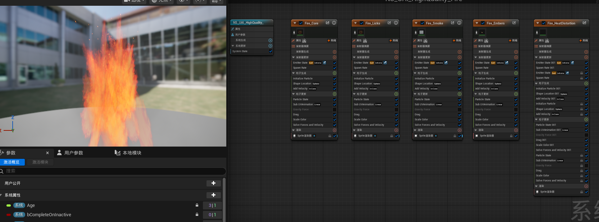
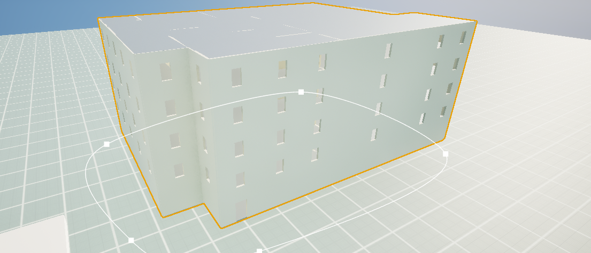
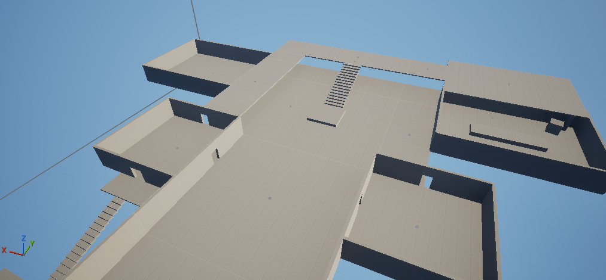

# UeAgentInterfacePak

## 效果一览

如果你正在做 UE 原型、关卡验证或视觉效果预研，`UeAgentInterfacePak` 的目标是让 AI 更深入地参与编辑器内制作，把想法逐步推到能看的画面。它适合在明确目标、持续检查和多轮交互配合下，辅助搭建空间、生成体块、调整材质和补充特效。

下面这些示例是当前项目在不同交互强度下做出的探索性展示，用来说明它可以介入哪些方向。它们不是稳定能力承诺，也不代表每次都能自动复现同等结果；更准确地说，它们展示了这套工作流在人工监督、反复校验和持续修正下能推进到的效果范围。

更基础地说，它已经可以让 AI 在 UE 里实际操作蓝图、关卡、Actor、资产、材质、UMG、Sequencer、动画、Control Rig、Niagara、PCG、静态网格、骨骼网格、纹理、音频、物理、数据资产、项目设置和打包相关内容。这些能力已经覆盖了 UE 创作的大部分基础面；在这个项目里，它们仍然只是基础中的基础。真正有价值的部分，是把这些基础能力串起来，变成能持续产出画面、验证玩法空间、搭建特效和推进资产迭代的制作助手。

| 水面材质 | Niagara 火焰 |
| --- | --- |
|  |  |
| 较高交互配合下完成的水面材质探索，展示波面、反光和水体质感可以被持续调试。 | 经过数次尝试调出的 Niagara 火焰展示，交互量不算高，但仍需要观察效果并迭代形态、烟、余烬和热扰动。 |
| PCG 建筑 | 白盒关卡 |
|  |  |
| PCG 建筑体块展示，说明 AI 可以参与生成和调整程序化场景结构。 | 白盒关卡展示，说明 AI 可以参与空间、路线和尺度验证。 |

`UeAgentInterfacePak` 是 `UeAgentInterface` 的本地分发包仓库。它把 UE Editor 插件、配套 CLI 开发仓库、Codex skills、UE 本地知识库和发布材料放在同一个可追踪入口中，用于在新 UE 项目或新 Codex 环境中恢复同一套自动化工作流。

普通使用者只需要安装 UE 插件和需要的 skill。`UeAgentInterfaceCMD/` 主要面向维护、构建、发布验证和刷新 skill 内置 `uai-cli.exe`，不作为最终用户的独立安装步骤。

## 当前边界

- UE 插件当前在 `GptProjectTest` 的 Unreal Engine `5.6.1` / `Win64` 环境中编译和使用；其他 UE 版本需要重新编译和验证。
- 插件版本来自 `UeAgentInterface/UeAgentInterface.uplugin`：`VersionName: 0.1`，当前仍标记为 Beta。
- Pak 内 `skills/ue-agent-interface/tools/uai-cli.exe` 当前为 `uai-cli 0.2.0`。
- `ue-kb` 知识库主来源为 UE `5.7` 官方文档本地 Markdown 转换版，并附带 Niagara、PCG、Animation、Rendering、Pipeline/Plugins、Packaging 等补充专题。它用于概念和 API 查询；本项目真实 UE 状态仍以 UAI 指令读回为准。
- 本包是本地仓库发布边界，不代表已经推送 GitHub、创建远端 Release 或更新远端 tag。远端动作由维护者手动完成。

## 包内容

| 路径 | 用途 | 普通使用者是否安装 |
| --- | --- | --- |
| `UeAgentInterface/` | UE Editor 插件 submodule。放入目标项目 `Plugins/UeAgentInterface/` 后，在编辑器内提供本地 UAI 服务。 | 需要 |
| `skills/ue-agent-interface/` | Codex 侧 UAI workflow skill，包含同步后的插件/CLI 正式文档副本和内置 `tools/uai-cli.exe`。 | 需要 |
| `skills/ue-kb/` | UE 本地知识库 skill，携带 `kb-manifest.json`、source、chunks、FTS 索引和知识库使用规则。 | 需要 |
| `skills/kbcli-knowledge-base/` | kbCli runtime skill submodule，提供 `kb.exe` 和 vector service；是 `ue-kb` 正常查询的重要配套。 | 需要 |
| `UeAgentInterfaceCMD/` | CLI 开发/测试/发布验证仓库。用于构建 `uai-cli.exe`、执行 `release ci`、生成 report 和维护命令覆盖矩阵。 | 不需要单独安装 |
| `docs/images/` | README 使用的安装和菜单截图。 | 随包 |
| `releases/` | 本地发布 manifest 和发布材料归档。 | 维护者使用 |

`skills/kbcli-knowledge-base/` 是只读分发引用。不要通过 `installed-to-pak` 复制覆盖它；更新时应更新对应 submodule gitlink。

## 获取包内容

克隆或复制本包后，先拉取 submodule：

```powershell
git submodule update --init --recursive
```

如果只需要插件，也可以直接使用公开插件仓库：

```powershell
git clone https://github.com/xianruiyang/UeAgentInterface.git .\Plugins\UeAgentInterface
```

使用整个包仓库时，从 `UeAgentInterfacePak/UeAgentInterface` 复制或引用插件目录即可。

## 插件安装

1. 关闭目标 UE 项目和 Visual Studio。
2. 在目标 UE 项目根目录创建 `Plugins` 目录。
3. 将本包中的 `UeAgentInterface/` 放到目标项目的 `Plugins/UeAgentInterface/`。
4. 如果目标项目是 C++ 项目，重新生成工程文件并编译 Editor target。
5. 打开 `.uproject`，确认插件启用。可以在 `.uproject` 的 `Plugins` 数组中加入：

```json
{
  "Name": "UeAgentInterface",
  "Enabled": true,
  "SupportedTargetPlatforms": [
    "Win64"
  ]
}
```

也可以在 Unreal Editor 的 `Edit -> Plugins` 窗口中搜索并启用 `UeAgentInterface`。启用或禁用插件后，如果 UE 要求重启编辑器，应按提示重启。

当前插件 `.uplugin` 会启用一批 UE 内置插件依赖，包括 `EnhancedInput`、`Niagara`、`PCG`、`ModelingToolsEditorMode`、`MeshModelingToolset`、`IKRig`、`GeometryCache`、`ComputeFramework`、`DeformerGraph`、`StateTree`、`SmartObjects`、`Paper2D`、`TextureGraph`、`WmfMedia`、`Metasound` 等。目标工程缺少某个内置插件或引擎版本不匹配时，应先解决插件加载/编译问题，再使用 UAI 自动化。

## Skill 安装

把需要的 skill 复制到 Codex skills 目录。`ue-agent-interface`、`ue-kb` 和 `kbcli-knowledge-base` 都是必装项：前者负责 UE 自动化工作流，后两者负责本地 UE 知识检索和查询运行时。

`ue-kb` 必须安装，因为它是离线 UE 知识来源；`kbcli-knowledge-base` 也很重要，因为它不是普通说明文档，而是 `ue-kb` 的查询运行时入口，负责提供 `kb.exe`、vector service 和相关诊断能力。没有运行时或环境暂时不完整时，`ue-kb` 仍然有本地 Markdown、chunk、索引和来源文件可读；此时也不要完全跳过知识检索，至少应打开 `ue-kb` 的 `references/guides/standalone.md`，按主题地图、source layout、`content/markdown/`、`chunks/chunks.jsonl` 和原始 `references/` 做只读查证。

```powershell
$PakRoot = Get-Location
$SkillRoot = "$env:USERPROFILE\.codex\skills"
New-Item -ItemType Directory -Force -Path $SkillRoot | Out-Null

Copy-Item -Recurse -Force (Join-Path $PakRoot "skills\ue-agent-interface") "$SkillRoot\ue-agent-interface"
Copy-Item -Recurse -Force (Join-Path $PakRoot "skills\ue-kb") "$SkillRoot\ue-kb"
Copy-Item -Recurse -Force (Join-Path $PakRoot "skills\kbcli-knowledge-base") "$SkillRoot\kbcli-knowledge-base"
```

如果本机已经有同名 skill，复制前先备份旧目录，避免覆盖未提交的本地修改。安装后开启新 Codex 对话，首次使用时最好显式引用 `$ue-agent-interface` 或 `$ue-kb`。

在 `GptProjectTest` 开发工作区维护 skill 时，优先使用项目同步脚本：

```powershell
python .\scripts\skills\sync_codex_skills.py --mode check --direction pak-to-installed --skills package
python .\scripts\skills\sync_codex_skills.py --mode sync --direction pak-to-installed --skills package --prune
```

`package` 默认同步 `ue-agent-interface,ue-kb`。如需从 Pak 刷新本机 `kbcli-knowledge-base`，显式指定该 skill；不要反向把 installed copy 写回 Pak：

```powershell
python .\scripts\skills\sync_codex_skills.py --mode check --direction pak-to-installed --skills kbcli-knowledge-base
```

## 启动服务

安装并启用插件后，在 Unreal Editor 中打开目标项目，然后从菜单启动服务：

`Window` -> `UeAgentInterface` -> `Start UeAgentInterface Server`


同一菜单还提供：

- `Stop UeAgentInterface Server`：停止编辑器内服务。
- `Copy Connection Info`：复制当前连接信息，便于 CLI 或 skill 检查连接。

启动后可以用 skill 内工具做连接检查。report 应写到当前用户工作区，不写回 skill 或 Pak 目录：

```powershell
$SkillDir = "$env:USERPROFILE\.codex\skills\ue-agent-interface"
$UserWorkDir = Get-Location
$RuntimeLogs = Join-Path $UserWorkDir "runtimeLogs"
New-Item -ItemType Directory -Force -Path $RuntimeLogs | Out-Null

& (Join-Path $SkillDir "tools\uai-cli.exe") `
  --report-file (Join-Path $RuntimeLogs "uai_doctor.json") `
  doctor --json-output
```

实际自动化工作应通过 `ue-agent-interface` skill 调用 `uai-cli.exe`，不要直接调用 HTTP 接口。

## 推荐工作流

1. 启动 UE 项目，并通过菜单开启 `UeAgentInterface Server`。
2. 在 Codex 中使用 `$ue-agent-interface`。该 skill 只使用自身 `tools/uai-cli.exe`，不从项目 `UeAgentInterfaceCMD/dist/` 或 PATH 选择 CLI。
3. 临时 `plan`、`vars`、`batch` 和 params JSON 放在用户工作目录的 `tmp/uai_params/`。
4. report、crash capture、runtime index 和运行日志放在用户工作目录的 `runtimeLogs/`。
5. 创建或修改资产时优先走 JSON 或 folder 结构化 JSON 工作流。
6. 应用后检查 report、错误、warning、编译结果、Niagara Stack issue、dirty resource、截图或 runtime probe。
7. 需要窗口验证时，默认最小化或不抢焦点启动 UE，避免影响当前桌面操作。

## 知识库使用

`ue-kb` 是 portable 知识库内容；`kbcli-knowledge-base` 提供运行时。查询时应使用 `kbcli-knowledge-base` skill 解析出的 `kb.exe`，再显式指向 `skills/ue-kb/kb-manifest.json`。

`ue-kb` 包内包含 FTS 索引；Hybrid 查询还依赖本机 Qdrant/vector service 状态。若 vector 不可用，可以降级 keyword，但不要把 keyword-only 结果描述成 Hybrid 结果。

如果 `kbcli-knowledge-base`、Qdrant、vector service 或 embedding 环境暂时无法配置，仍然应使用 `ue-kb` 做最低限度的本地知识检索。优先读取：

- `skills/ue-kb/references/guides/standalone.md`
- `skills/ue-kb/references/maps/topic-map.md`
- `skills/ue-kb/references/maps/source-layout.md`
- `skills/ue-kb/content/markdown/`
- `skills/ue-kb/chunks/chunks.jsonl`
- `skills/ue-kb/references/UE5_7Doc/docs/`
- `skills/ue-kb/references/Supplemental/`

降级检索时要在回答或记录中说明当前不是 Hybrid 查询，并引用可复查的 `source_path`；能定位 chunk 时再引用 `chunk_id`。

## 目录概览

```text
UeAgentInterfacePak/
  README.md
  docs/images/
    ue-agent-interface-menu.png
  releases/
  skills/
    kbcli-knowledge-base/
    ue-agent-interface/
    ue-kb/
  UeAgentInterface/
  UeAgentInterfaceCMD/
```

## 开发与发布维护

- `UeAgentInterface/`、`UeAgentInterfaceCMD/` 和 `skills/kbcli-knowledge-base/` 是 Git submodule。正式发布时先在子仓库提交，再回到 Pak 仓库更新 gitlink。
- `skills/ue-agent-interface/` 与 `skills/ue-kb/` 是 Pak 直接分发内容。更新后需要同步到真实 Codex skills 目录再验证。
- `ue-agent-interface` skill 内的 `docs/` 是插件/CLI 正式文档的同步副本；同步时不得复制 `commands/deprecatedCommand/**` 或 generated 覆盖矩阵。
- 更新 `UeAgentInterfaceCMD` 后，如该 CLI 变更应进入 skill，需要重新构建并刷新 `skills/ue-agent-interface/tools/uai-cli.exe` 与默认配置，再同步 installed skill。
- Pak 目录不得残留 `runtimeLogs/`、`logs/`、report payload、`tmp/`、`.pytest_cache/`、`__pycache__/`、`Binaries/`、`Intermediate/`、`Saved/`、`DerivedDataCache/` 等运行产物。
- `release dev-mirror` 只用于本地临时镜像和问题定位，不代表正式发布；写入 Pak submodule 内容必须显式传 `--allow-submodule-content-write`。
- 正式发布前使用外层项目的单入口门禁：

```powershell
python UeAgentInterfaceCMD/run_uai_cli.py release ci --json-output --ci-output runtimeLogs/uai_release_ci.json
```

`release ci` 会检查 coverage、sync-check、Pak layout、发布包 hygiene、Dev/Pak CLI 单测和质量门禁。`--allow-dirty` 只用于本地诊断，正式发布提交前应回到干净且范围明确的状态。

GitHub 远端发布、`git push`、创建 GitHub Release 和更新远端 tag 是人工边界；Agent 只准备本地提交、manifest、release notes、gate report 和待执行命令清单。

## 参考

- Epic 官方插件文档：<https://dev.epicgames.com/documentation/unreal-engine/plugins-in-unreal-engine>
- Epic 插件启用/禁用文档：<https://dev.epicgames.com/documentation/unreal-engine/working-with-plugins-in-unreal-engine>
- Git submodule 文档：<https://git-scm.com/docs/git-submodule>
