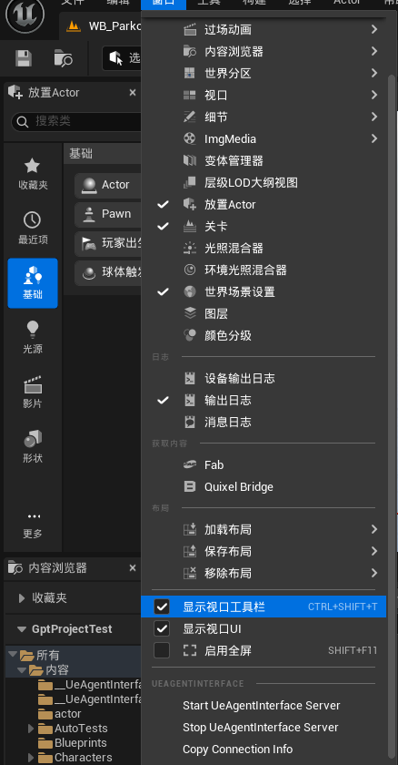

# UeAgentInterfacePak

`UeAgentInterfacePak` 是 `UeAgentInterface` 插件和配套 Codex skills 的分发包。它用于把 Unreal Editor 自动化插件、AI 侧 skill 文档和 skill 内部 CLI 工具放在同一个包仓库里，方便在新 UE 项目或新 Codex 环境中恢复同一套工作流。

本包包含三类内容：


| 路径                   | 用途                                                                                                        | 是否需要用户安装 |
| ---------------------- | ----------------------------------------------------------------------------------------------------------- | ---------------- |
| `UeAgentInterface/`    | Unreal Editor 插件 submodule。安装到 UE 项目的`Plugins/UeAgentInterface` 后，在编辑器内提供本地自动化服务。 | 需要             |
| `skills/`              | Codex skill 包。包含 `ue-agent-interface` 和 `ue-kb`；`ue-kb` 汇总 UE 官方文档 KB 与补充专题。             | 需要             |
| `UeAgentInterfaceCMD/` | CLI 源码和构建产物仓库，主要用于开发和打包 skill 内部工具。                                                 | 不需要单独安装   |

`UeAgentInterfaceCMD` 只作为 skill 内工具的开发仓库保留。普通使用时不要把它作为独立组件安装；`ue-agent-interface` skill 会使用自身 `tools/uai-cli.exe` 中的工具。

## 适用版本

- 当前包按 `GptProjectTest` 的实际环境整理，目标 Unreal Engine 版本为 `5.6`。
- 当前插件版本为 `UeAgentInterface.uplugin` 中的 `VersionName: 0.1`。
- 当前插件是 Editor 插件，目标平台为 `Win64`。
- 插件依赖 UE 内置或项目可启用插件：`EnhancedInput`、`Niagara`、`ModelingToolsEditorMode`、`MeshModelingToolset`、`IKRig`。
- 当前代码仍标记为 Beta，建议优先在项目副本或版本控制可回退的工程里使用。

## 获取包内容

克隆或复制本包后，先确认 submodule 已拉取：

```powershell
git submodule update --init --recursive
```

如果只需要插件，也可以直接使用公开插件仓库：

```powershell
git clone https://github.com/xianruiyang/UeAgentInterface.git .\Plugins\UeAgentInterface
```

如果使用整个包仓库，后续安装时从 `UeAgentInterfacePak/UeAgentInterface` 复制或引用插件目录即可。

## 插件安装

1. 在目标 UE 项目根目录创建 `Plugins` 目录。
2. 将本包中的 `UeAgentInterface/` 放到目标项目的 `Plugins/UeAgentInterface/`。
3. 如果项目是 C++ 项目，重新生成工程文件并编译 Editor target。
4. 打开 `.uproject`，确认插件启用。可以在 `.uproject` 的 `Plugins` 数组中加入：

```json
{
  "Name": "UeAgentInterface",
  "Enabled": true,
  "SupportedTargetPlatforms": [
    "Win64"
  ]
}
```

也可以在 Unreal Editor 的 Plugins 窗口里搜索并启用 `UeAgentInterface`。启用后如 UE 要求重启编辑器，按提示重启。

## Skill 安装

将本包 `skills/` 下需要的 skill 复制到 Codex 的 skills 目录：

```powershell
$SkillRoot = "$env:USERPROFILE\.codex\skills"
New-Item -ItemType Directory -Force -Path $SkillRoot | Out-Null
Copy-Item -Recurse -Force .\skills\ue-agent-interface "$SkillRoot\ue-agent-interface"
Copy-Item -Recurse -Force .\skills\ue-kb "$SkillRoot\ue-kb"
```

在 `GptProjectTest` 开发工作区内维护 skill 时，优先使用项目同步脚本，而不是手工只复制一边：

```powershell
python .\scripts\skills\sync_codex_skills.py --mode check --direction pak-to-installed --skills ue-agent-interface
python .\scripts\skills\sync_codex_skills.py --mode sync --direction pak-to-installed --skills ue-agent-interface --prune
```

安装后重启 Codex 会话或重新加载 skills。常用方式：

- 使用 `$ue-agent-interface` 执行 UE 编辑器自动化、JSON/folder 结构化资产编辑、截图、smoke 验证等。
- 使用 `$ue-kb` 查询 UE 5.7 官方文档本地 KB，以及 Niagara、Animation、PCG、Level Design 等补充专题。

如果本机已经有同名 skill，复制前先备份旧目录，避免覆盖本地未提交的修改。

要注意，codex安装skill后，要开启新对话才能使用。首次使用时最好显式引用所需的skill，以防模型没有自动加载。

## 插件开启方法

安装并启用插件后，在 Unreal Editor 中打开目标项目，然后从菜单启动服务：

`Window` -> `UeAgentInterface` -> `Start UeAgentInterface Server`



同一菜单还提供：

- `Stop UeAgentInterface Server`：停止编辑器内服务。
- `Copy Connection Info`：复制当前连接信息，便于 CLI 或 skill 检查连接。

启动后可以用 skill 内工具做连接检查：

```powershell
$UserWorkDir = Get-Location
New-Item -ItemType Directory -Force -Path (Join-Path $UserWorkDir "runtimeLogs") | Out-Null
.\skills\ue-agent-interface\tools\uai-cli.exe --report-file (Join-Path $UserWorkDir "runtimeLogs/uai_doctor.json") doctor --json-output
```

实际自动化工作应通过 `ue-agent-interface` skill 调用 `uai-cli.exe`，不要直接调用 HTTP 接口。

## 推荐工作流

1. 先启动 UE 项目，并通过菜单开启 `UeAgentInterface Server`。
2. 在 Codex 中使用 `$ue-agent-interface` skill；skill 只使用自身 `tools/uai-cli.exe`，不从项目 `UeAgentInterfaceCMD/dist/` 或 PATH 选择 CLI。
3. 临时 `plan`、`vars`、`batch` 和 params JSON 放在用户工作目录的 `tmp/uai_params/`，report 和 runtime log 放在用户工作目录的 `runtimeLogs/`。
4. 创建或修改资产时优先走 JSON 或 folder 结构化 JSON 工作流。
5. 应用后检查命令返回中的错误、warning、Niagara Stack issue、compile log 和 dirty resource。
6. 需要窗口验证时，默认最小化或不抢焦点启动 UE，避免影响当前桌面操作。

## 目录说明

```text
UeAgentInterfacePak/
  README.md
  docs/images/
    ue-agent-interface-menu.png
  skills/
    ue-agent-interface/
    ue-kb/
  UeAgentInterface/
  UeAgentInterfaceCMD/
```

## 开发说明

- `UeAgentInterface/` 和 `UeAgentInterfaceCMD/` 是 Git submodule，更新它们时应先在各自仓库提交，再回到本包仓库更新 gitlink。
- `skills/` 是本包直接分发的 skill 内容，更新后需要同步到真实 Codex skills 目录再验证；同步脚本默认分发集合为 `ue-agent-interface,ue-kb`。
- `UeAgentInterfaceCMD/` 面向 skill 内部工具开发和 `uai-cli.exe` 打包，不作为最终用户安装步骤。
- `ue-agent-interface` skill 内的 `docs/` 是插件/CLI 正式文档的同步副本；同步时不得复制 `commands/deprecatedCommand/**` 或 generated 覆盖矩阵。
- 更新 `UeAgentInterfaceCMD` 后，如该 CLI 变更应进入 skill，需要重新构建并刷新 `skills/ue-agent-interface/tools/uai-cli.exe` 及默认配置，再同步 installed skill。
- 初步代码由 GPT 辅助编写，后续维护应以真实编译、自动化测试、UE 内验证和文档同步为准。
