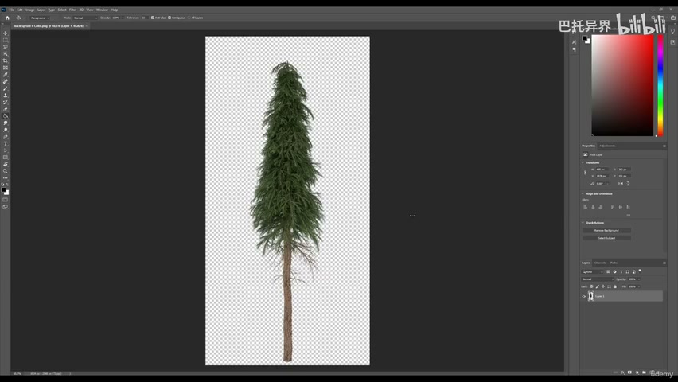
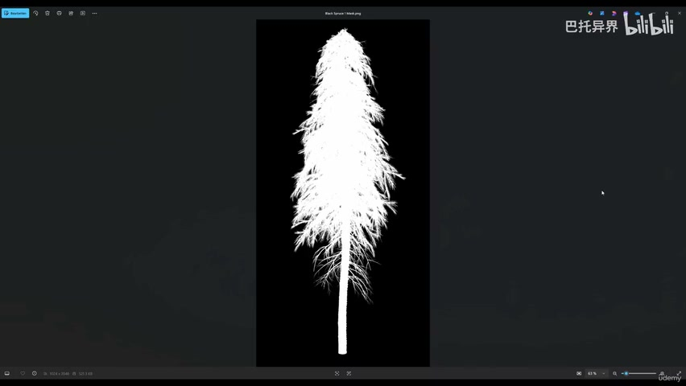
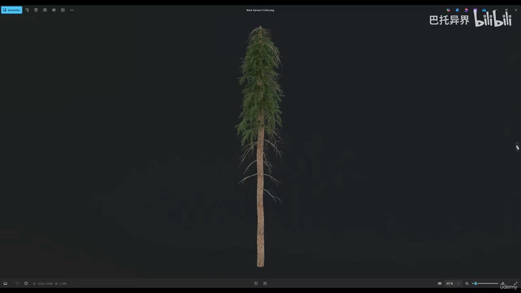
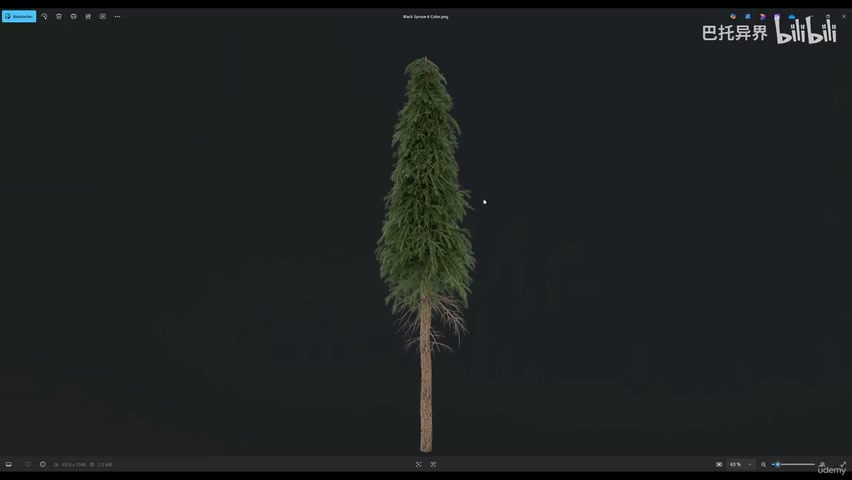

# 1-2 - The Black Spruce Tree

## 知识目标

- 本文整理“1-2 - The Black Spruce Tree”的 PCG 实操流程、关键节点、参数组织方式和复现风险点。

## 可复现主流程

- 观察黑云杉最终目标：树冠层次、枝条填充、针叶密度、阴影深度和透明背景渲染效果。
- 明确资产制作顺序：先做枝条和针叶卡片，再做树干，最后组装成整棵树并导入 UE5。
- 记录要服务于实时环境的约束：轮廓不能太重复、枝条要填满空洞、LOD/材质/风动画要能进入后续场景。
- 把本集作为后续建模与纹理分 P 的验收基准：每一步都要回看是否能得到同样的树形和自然感。

## 关键术语

- `Density`
- `Mask`
- `Material`
- `trees`
- `million`
- `show`
- `branches`
- `Nanite`
- `completely`

## 操作步骤与要点

### 观察黑云杉最终目标：树冠层次、枝条填充、针叶密度、阴影深度和透明背景渲染效果

**内容要点：**

- 观察黑云杉最终目标：树冠层次、枝条填充、针叶密度、阴影深度和透明背景渲染效果。

**关键截图：**

**参数、节点和风险点：**

- `Material`
- `trees`
- `show`
- `Nanite`
- `spruce`
- `already`
- `model`
- `course`
- `background`

### 明确资产制作顺序：先做枝条和针叶卡片，再做树干，最后组装成整棵树并导入 UE5

**内容要点：**

- 明确资产制作顺序：先做枝条和针叶卡片，再做树干，最后组装成整棵树并导入 UE5。

**关键截图：**

**参数、节点和风险点：**

- `Density`
- `Mask`
- `million`
- `copy`
- `paste`
- `rotate`
- `dead`
- `mirror`
- `mask`
- `gaps`

### 记录要服务于实时环境的约束：轮廓不能太重复、枝条要填满空洞、LOD/材质/风动画要能进入后续场景

**内容要点：**

- 记录要服务于实时环境的约束：轮廓不能太重复、枝条要填满空洞、LOD/材质/风动画要能进入后续场景。

**关键截图：**

**参数、节点和风险点：**

- `completely`
- `branches`
- `trunk`
- `crazy`
- `chunks`
- `next`
- `lecture`
- `Blender`
- `enough`

## 复现检查清单

- 本集是概览，重点是最终资产标准和制作路线，不应误写成完整操作教程。
- 所有 UE5 资产都要检查比例、pivot、材质槽、贴图色彩空间和实例化性能。
- 复现时先固定随机种子，再调整密度、过滤和生成资源，避免随机结果掩盖逻辑错误。
