# 1-4 - Texturing the Branches of the Black Spruce in Substance Painter

## 知识目标

- 本文整理“1-4 - Texturing the Branches of the Black Spruce in Substance Painter”的 PCG 实操流程、关键节点、参数组织方式和复现风险点。

## 可复现主流程

- 把枝条模型导入 Substance Painter，确认 UV、材质槽、法线和透明区域都正确。
- 制作枝条/针叶的 Base Color、Normal、Roughness、Alpha 等贴图，并区分树皮与针叶区域。
- 通过颜色变化、粗糙度和法线细节降低重复感，让枝条在 UE 远近视角都能读出层次。
- 导出贴图时统一命名与通道格式，为 UE5 材质和后续打包贴图做准备。

## 关键术语

- `Mesh`
- `Point`
- `Mask`
- `Material`
- `color`
- `case`
- `more`
- `change`
- `needles`

## 操作步骤与要点

### 把枝条模型导入 Substance Painter，确认 UV、材质槽、法线和透明区域都正确

**内容要点：**

- 把枝条模型导入 Substance Painter，确认 UV、材质槽、法线和透明区域都正确。

**关键截图：**

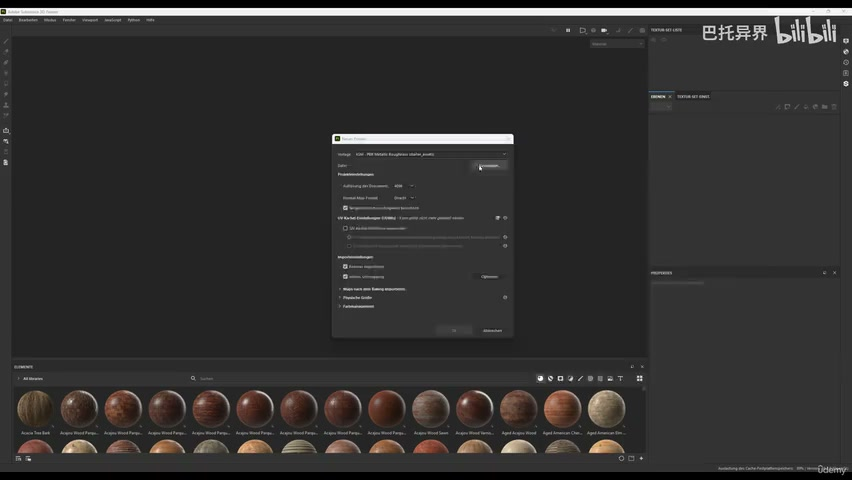
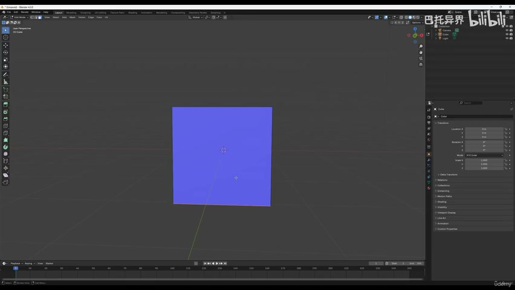

**参数、节点和风险点：**

- `Mesh`
- `Material`
- `branches`
- `import`
- `branch`
- `inside`
- `some`

### 把枝条模型导入 Substance Painter，确认 UV、材质槽、法线和透明区域都正确（2）

**内容要点：**

- 把枝条模型导入 Substance Painter，确认 UV、材质槽、法线和透明区域都正确（2）。

**关键截图：**

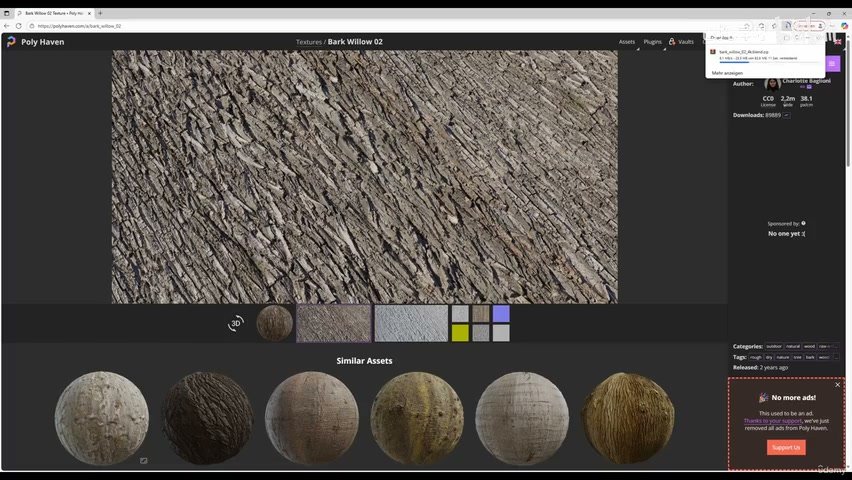
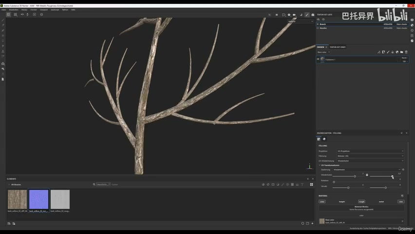

**参数、节点和风险点：**

- `Material`
- `color`
- `case`
- `change`
- `already`
- `fill`

### 制作枝条/针叶的 Base Color、Normal、Roughness、Alpha 等贴图，并区分树皮与针叶区域

**内容要点：**

- 制作枝条/针叶的 Base Color、Normal、Roughness、Alpha 等贴图，并区分树皮与针叶区域。

**关键截图：**

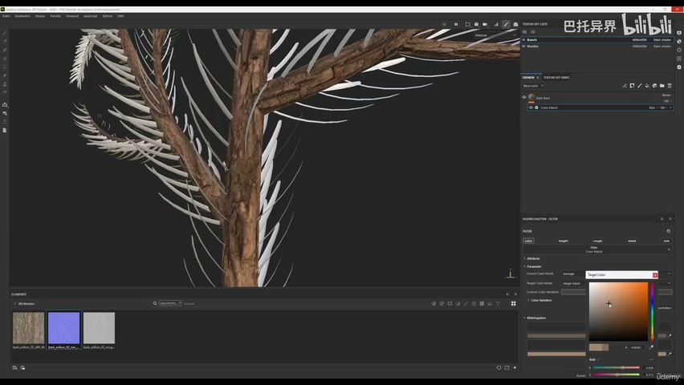
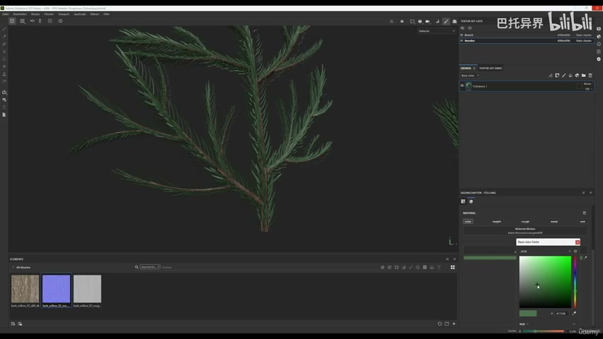

**参数、节点和风险点：**

- `Point`
- `Mask`
- `color`
- `think`
- `rotate`
- `layer`
- `base`

### 通过颜色变化、粗糙度和法线细节降低重复感，让枝条在 UE 远近视角都能读出层次

**内容要点：**

- 通过颜色变化、粗糙度和法线细节降低重复感，让枝条在 UE 远近视角都能读出层次。

**关键截图：**

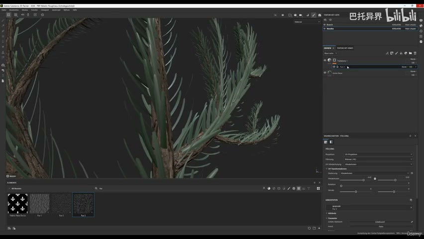
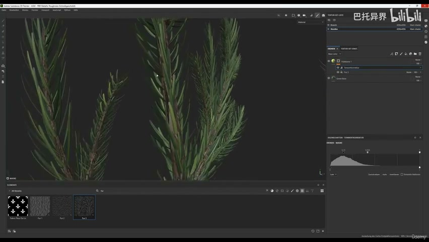

**参数、节点和风险点：**

- `Point`
- `Mask`
- `Material`
- `more`
- `needles`
- `roughness`
- `point`
- `green`

### 通过颜色变化、粗糙度和法线细节降低重复感，让枝条在 UE 远近视角都能读出层次（2）

**内容要点：**

- 通过颜色变化、粗糙度和法线细节降低重复感，让枝条在 UE 远近视角都能读出层次（2）。

**关键截图：**

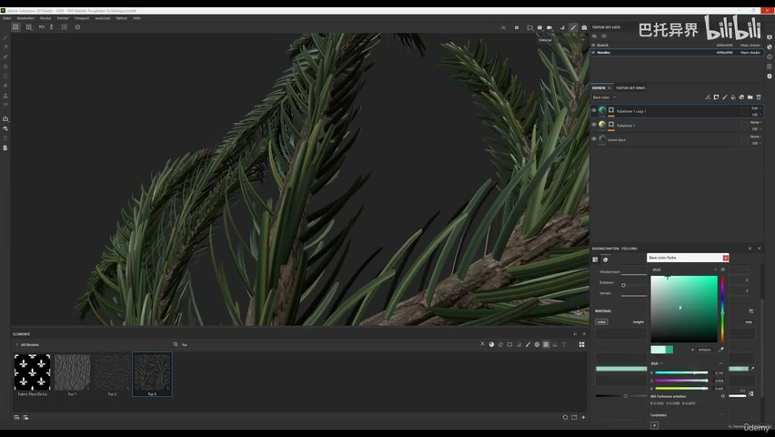
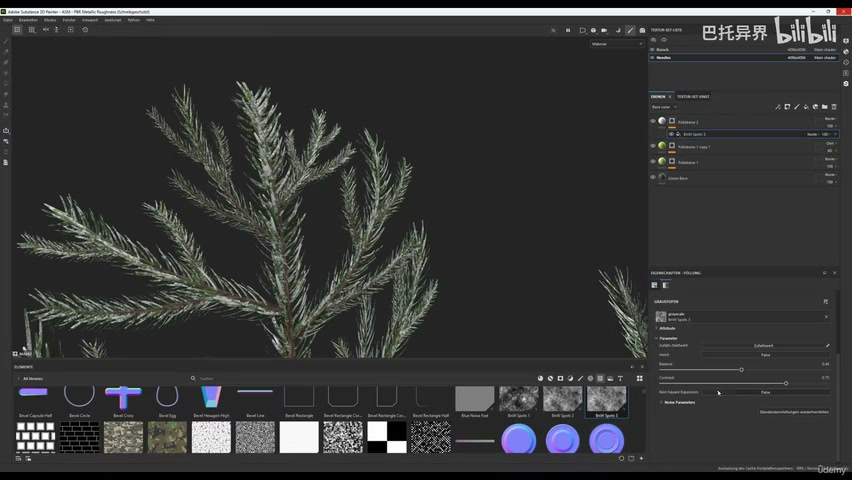

**参数、节点和风险点：**

- `Mask`
- `Material`
- `snow`
- `height`
- `branch`
- `color`
- `textures`
- `play`

### 导出贴图时统一命名与通道格式，为 UE5 材质和后续打包贴图做准备

**内容要点：**

- 导出贴图时统一命名与通道格式，为 UE5 材质和后续打包贴图做准备。

**关键截图：**

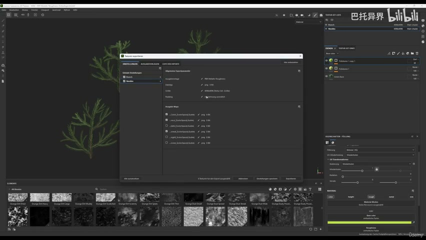
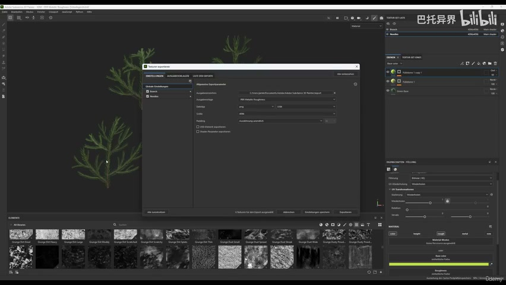

**参数、节点和风险点：**

- `some`
- `cool`
- `trunk`
- `show`
- `sure`
- `type`
- `metallic`
- `roughness`
- `change`
- `default`

## 复现检查清单

- 透明枝叶贴图要重点检查 alpha 边缘、mipmap 和双面材质，否则 UE5 中会出现毛边或过暗。
- 所有 UE5 资产都要检查比例、pivot、材质槽、贴图色彩空间和实例化性能。
- 复现时先固定随机种子，再调整密度、过滤和生成资源，避免随机结果掩盖逻辑错误。
