# 1-7 - Create the Black Spruce Tree

## 知识目标

- 本文整理“1-7 - Create the Black Spruce Tree”的 PCG 实操流程、关键节点、参数组织方式和复现风险点。

## 可复现主流程

- 把树干和多组枝条变体组装成完整黑云杉，先建立主枝层级，再用小枝填补空洞。
- 控制枝条旋转、缩放、层级间距和朝向，让树冠从多个角度看都不露空。
- 制作多个树形或枝条组合变体，为后续 PCG/foliage 分布提供随机性。
- 检查资产复杂度、材质槽数量、碰撞和导出设置，保证 UE5 中能作为环境资产使用。

## 关键术语

- `Mesh`
- `Transform`
- `Point`
- `Random`
- `Mask`
- `Material`
- `tree`
- `down`
- `branches`
- `more`

## 操作步骤与要点

### 把树干和多组枝条变体组装成完整黑云杉，先建立主枝层级，再用小枝填补空洞

**内容要点：**

- 把树干和多组枝条变体组装成完整黑云杉，先建立主枝层级，再用小枝填补空洞。

**关键截图：**

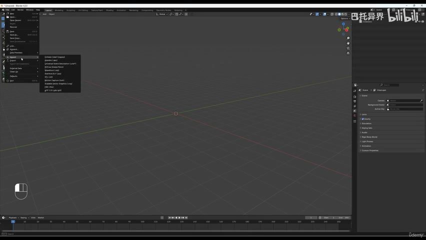
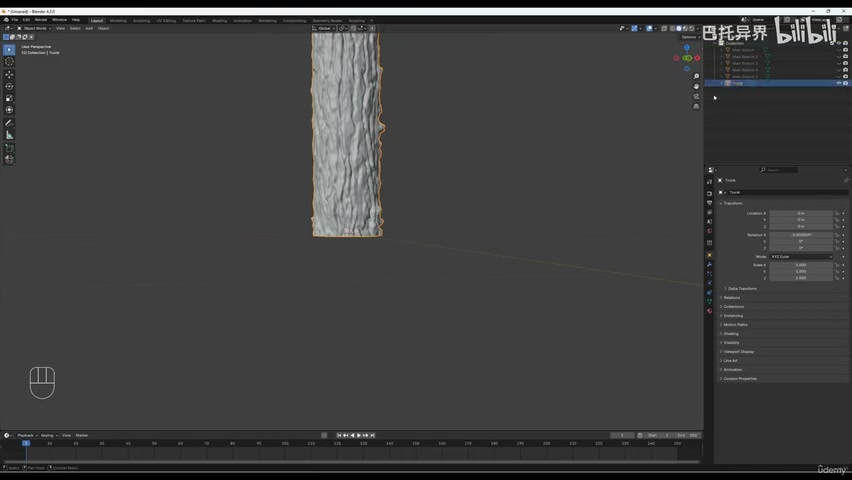

**参数、节点和风险点：**

- `Transform`
- `Material`
- `material`
- `trunk`
- `already`
- `lighting`
- `textures`
- `node`
- `first`

### 把树干和多组枝条变体组装成完整黑云杉，先建立主枝层级，再用小枝填补空洞（2）

**内容要点：**

- 把树干和多组枝条变体组装成完整黑云杉，先建立主枝层级，再用小枝填补空洞（2）。

**关键截图：**

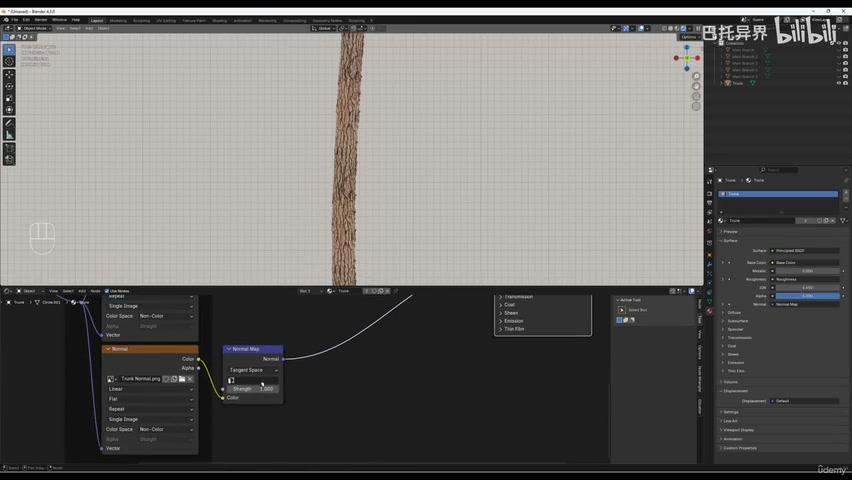
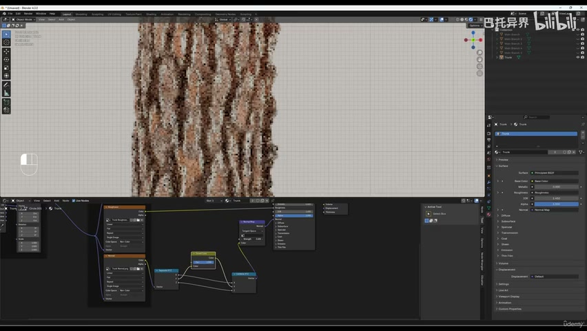

**参数、节点和风险点：**

- `Material`
- `color`
- `needles`
- `goes`
- `combine`
- `branch`
- `normal`
- `OpenGL`
- `shift`
- `again`

### 把树干和多组枝条变体组装成完整黑云杉，先建立主枝层级，再用小枝填补空洞（3）

**内容要点：**

- 把树干和多组枝条变体组装成完整黑云杉，先建立主枝层级，再用小枝填补空洞（3）。

**关键截图：**

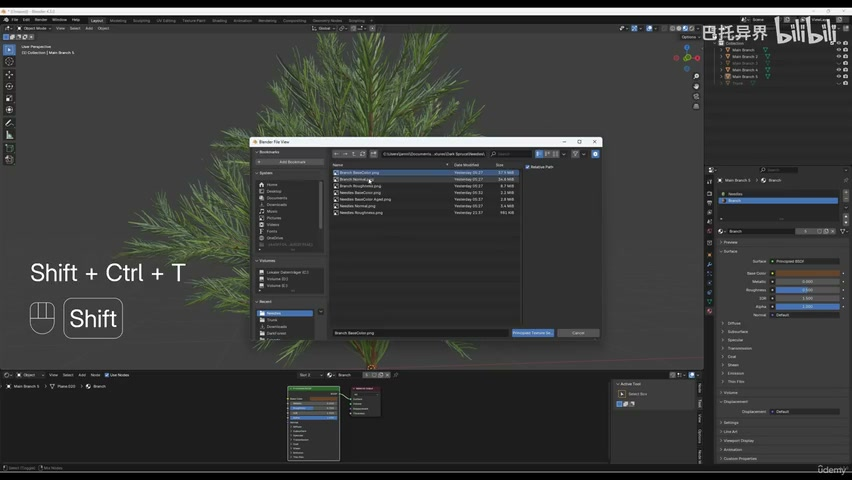
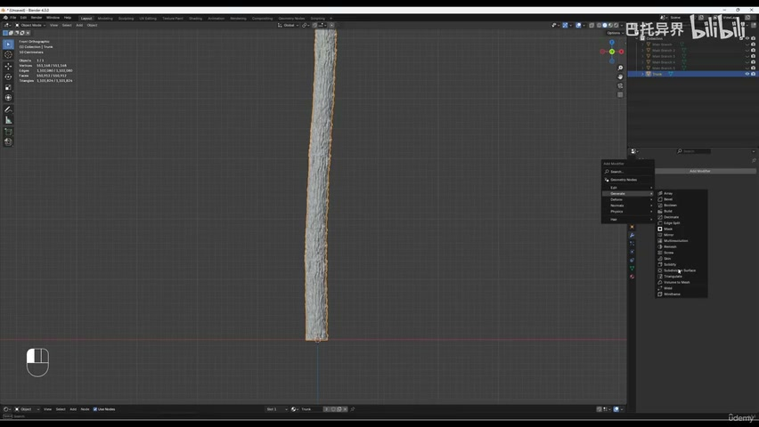

**参数、节点和风险点：**

- `Point`
- `decimate`
- `think`
- `trunk`
- `fine`
- `branch`
- `still`
- `point`
- `difference`
- `branches`

### 把树干和多组枝条变体组装成完整黑云杉，先建立主枝层级，再用小枝填补空洞（4）

**内容要点：**

- 把树干和多组枝条变体组装成完整黑云杉，先建立主枝层级，再用小枝填补空洞（4）。

**关键截图：**

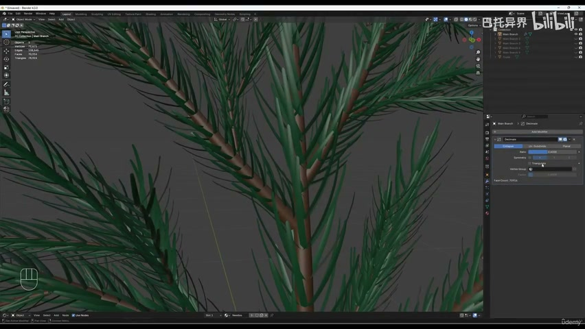
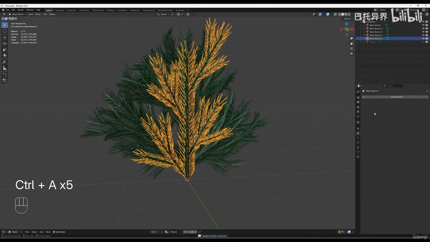

**参数、节点和风险点：**

- `decimate`
- `control`
- `modifiers`
- `hide`
- `apply`
- `branch`
- `copy`

### 控制枝条旋转、缩放、层级间距和朝向，让树冠从多个角度看都不露空

**内容要点：**

- 控制枝条旋转、缩放、层级间距和朝向，让树冠从多个角度看都不露空。

**关键截图：**

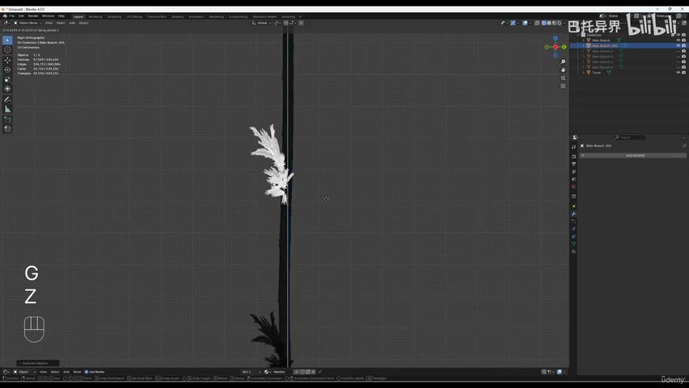
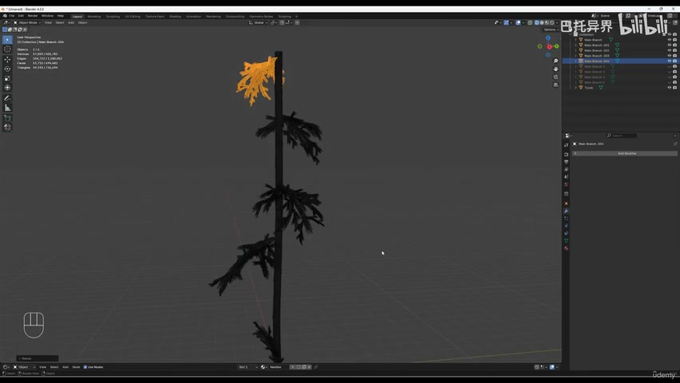

**参数、节点和风险点：**

- `Point`
- `branches`
- `dead`
- `rotate`
- `them`
- `branch`
- `scale`
- `down`

### 控制枝条旋转、缩放、层级间距和朝向，让树冠从多个角度看都不露空（2）

**内容要点：**

- 控制枝条旋转、缩放、层级间距和朝向，让树冠从多个角度看都不露空（2）。

**关键截图：**

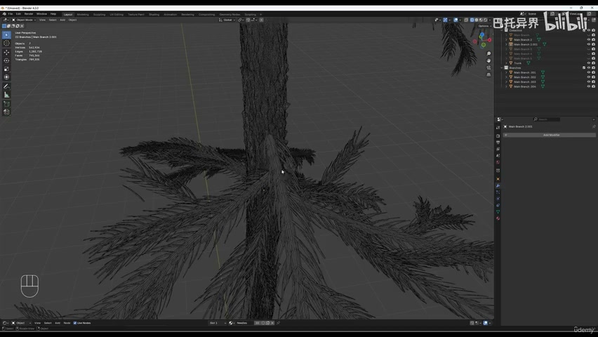
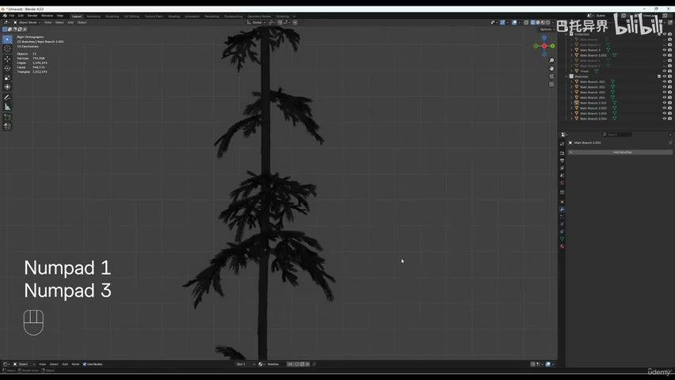

**参数、节点和风险点：**

- `Shift`
- `scale`
- `rotate`
- `more`
- `down`

### 控制枝条旋转、缩放、层级间距和朝向，让树冠从多个角度看都不露空（3）

**内容要点：**

- 控制枝条旋转、缩放、层级间距和朝向，让树冠从多个角度看都不露空（3）。

**关键截图：**

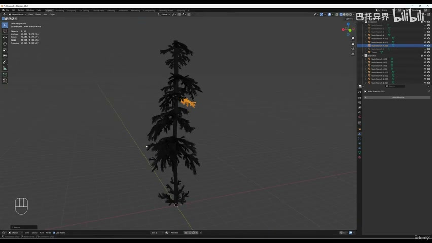
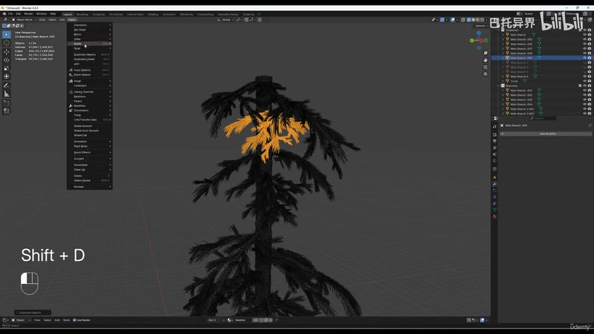

**参数、节点和风险点：**

- `down`
- `more`
- `scale`
- `Scale`
- `mirror`
- `branches`
- `Boom`
- `shift`
- `couple`

### 控制枝条旋转、缩放、层级间距和朝向，让树冠从多个角度看都不露空（4）

**内容要点：**

- 控制枝条旋转、缩放、层级间距和朝向，让树冠从多个角度看都不露空（4）。

**关键截图：**

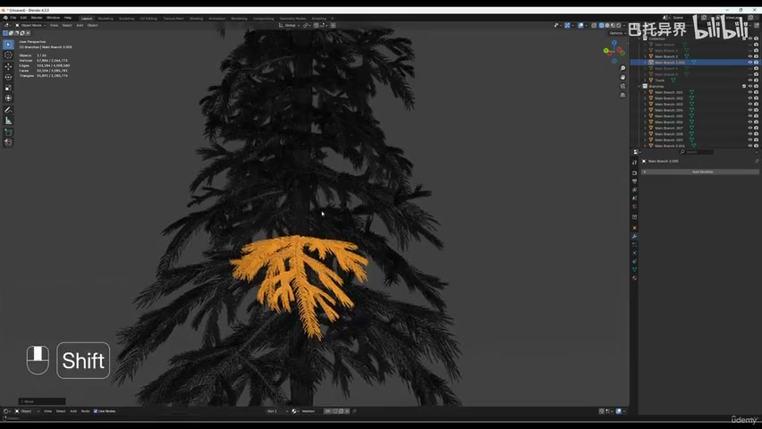
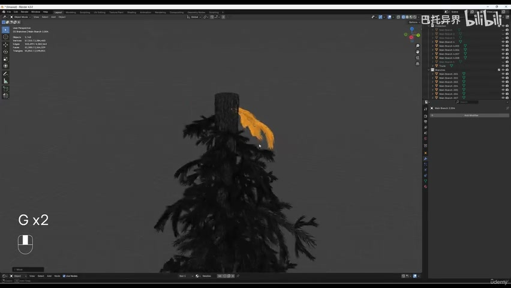

**参数、节点和风险点：**

- `them`
- `tree`
- `down`
- `dead`
- `scale`
- `place`
- `Rotate`
- `Scale`

### 制作多个树形或枝条组合变体，为后续 PCG/foliage 分布提供随机性

**内容要点：**

- 制作多个树形或枝条组合变体，为后续 PCG/foliage 分布提供随机性。

**关键截图：**

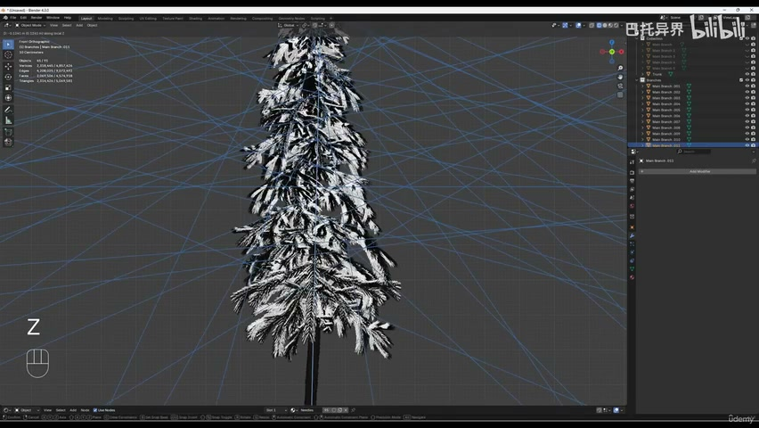
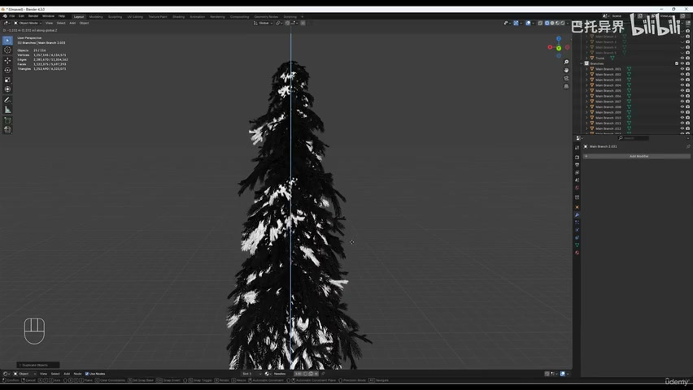

**参数、节点和风险点：**

- `Random`
- `move`
- `shift`
- `them`
- `again`
- `shouldn`
- `doing`
- `good`
- `gaps`

### 制作多个树形或枝条组合变体，为后续 PCG/foliage 分布提供随机性（2）

**内容要点：**

- 制作多个树形或枝条组合变体，为后续 PCG/foliage 分布提供随机性（2）。

**关键截图：**

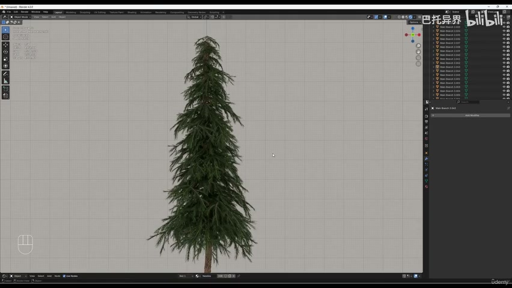
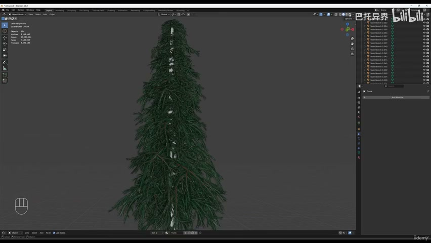

**参数、节点和风险点：**

- `tree`
- `down`
- `move`
- `better`
- `gaps`
- `wanted`
- `unsettling`

### 制作多个树形或枝条组合变体，为后续 PCG/foliage 分布提供随机性（3）

**内容要点：**

- 制作多个树形或枝条组合变体，为后续 PCG/foliage 分布提供随机性（3）。

**关键截图：**

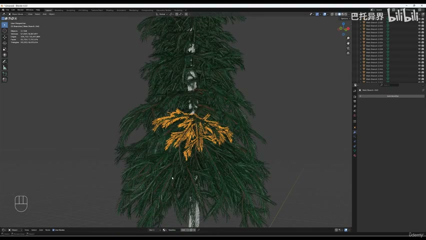
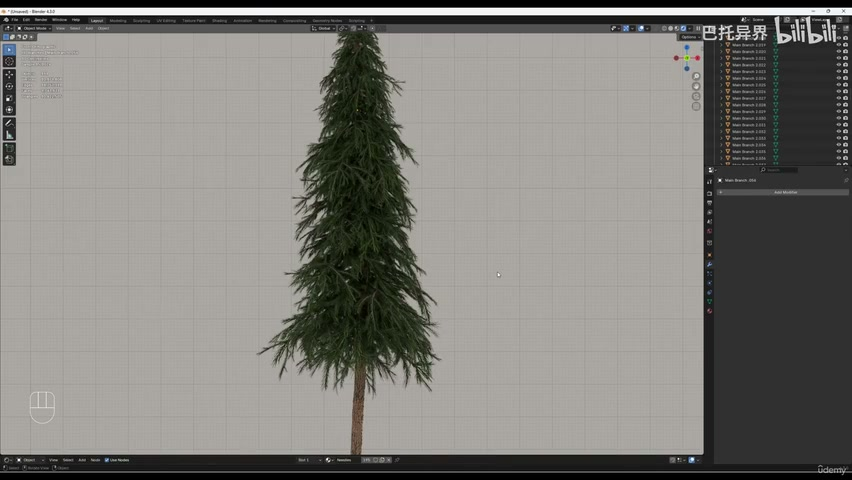

**参数、节点和风险点：**

- `Random`
- `tree`
- `million`
- `down`
- `important`
- `doing`
- `more`
- `rotate`
- `scale`

### 制作多个树形或枝条组合变体，为后续 PCG/foliage 分布提供随机性（4）

**内容要点：**

- 制作多个树形或枝条组合变体，为后续 PCG/foliage 分布提供随机性（4）。

**关键截图：**

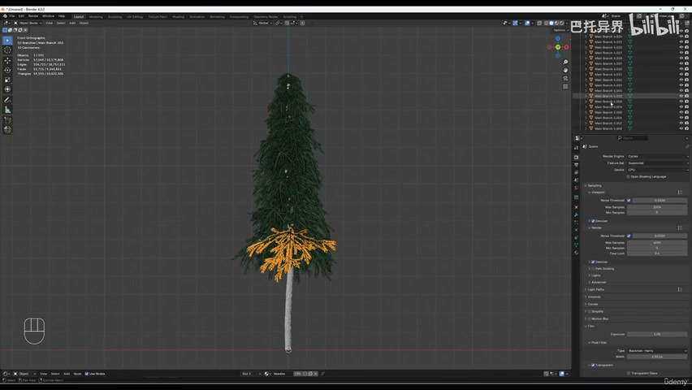
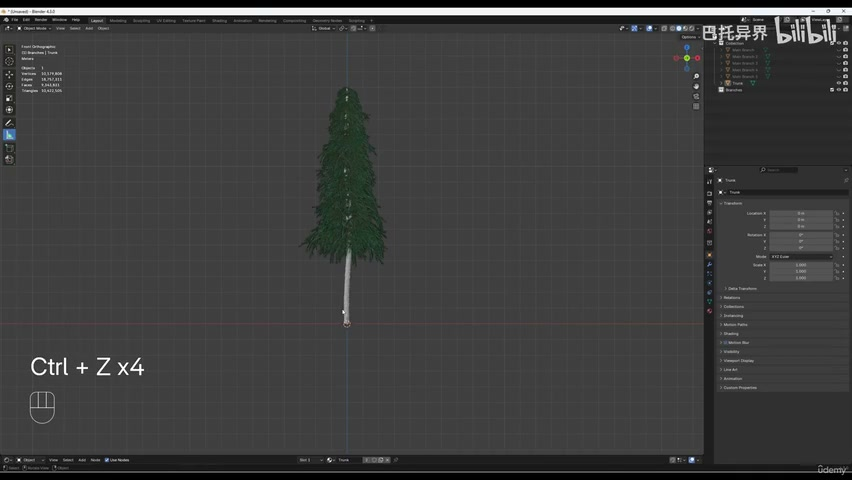

**参数、节点和风险点：**

- `Mesh`
- `Transform`
- `Material`
- `mesh`
- `save`
- `export`
- `fine`
- `before`
- `tree`
- `join`

### 检查资产复杂度、材质槽数量、碰撞和导出设置，保证 UE5 中能作为环境资产使用

**内容要点：**

- 检查资产复杂度、材质槽数量、碰撞和导出设置，保证 UE5 中能作为环境资产使用。

**关键截图：**

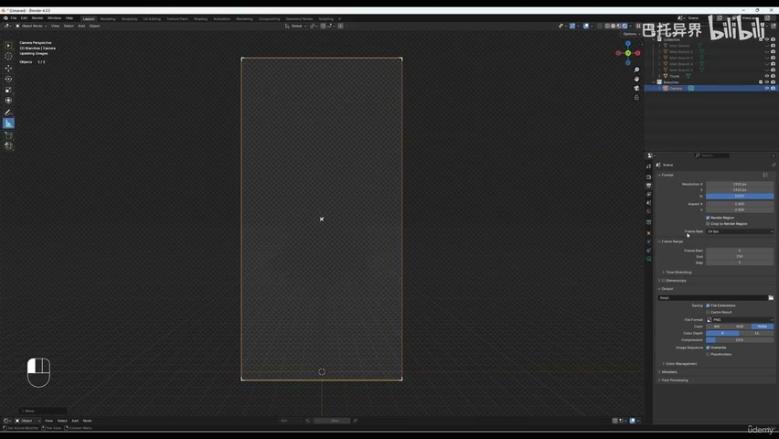
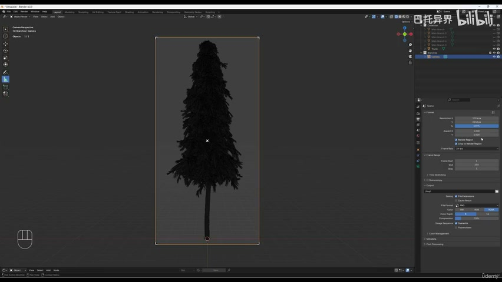

**参数、节点和风险点：**

- `render`
- `ratio`
- `disable`
- `region`
- `sure`
- `tree`
- `aspect`

### 检查资产复杂度、材质槽数量、碰撞和导出设置，保证 UE5 中能作为环境资产使用（2）

**内容要点：**

- 检查资产复杂度、材质槽数量、碰撞和导出设置，保证 UE5 中能作为环境资产使用（2）。

**关键截图：**

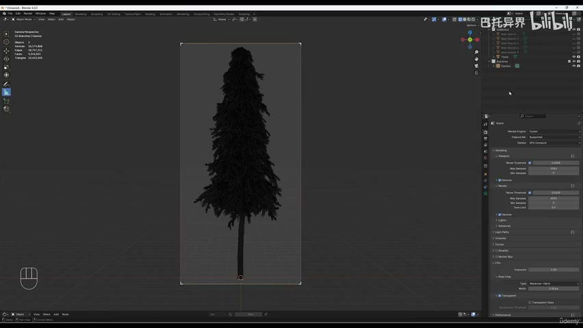
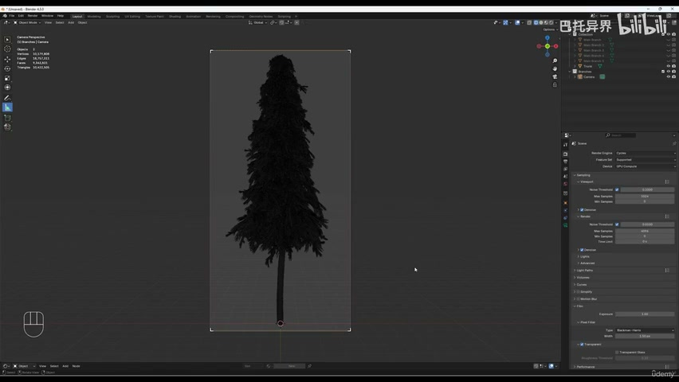

**参数、节点和风险点：**

- `Mesh`
- `Random`
- `Mask`
- `everything`
- `tree`
- `branches`
- `some`
- `dead`
- `them`
- `time`

### 检查资产复杂度、材质槽数量、碰撞和导出设置，保证 UE5 中能作为环境资产使用（3）

**内容要点：**

- 检查资产复杂度、材质槽数量、碰撞和导出设置，保证 UE5 中能作为环境资产使用（3）。

**关键截图：**

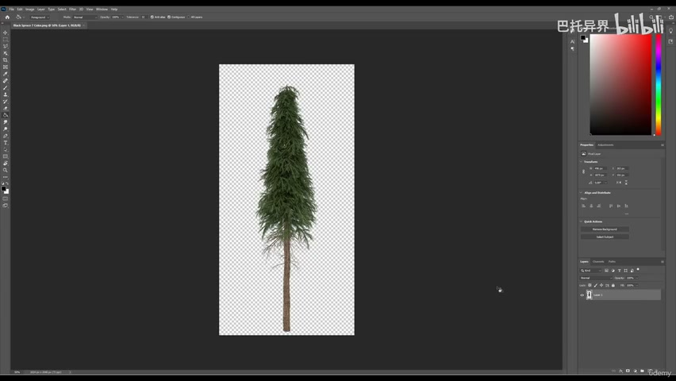
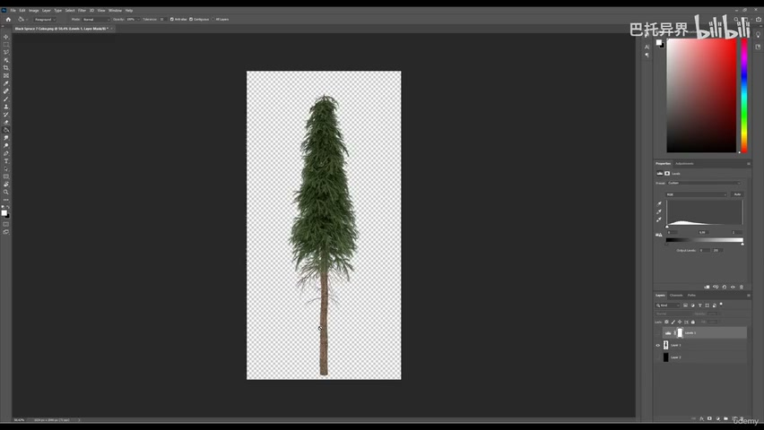

**参数、节点和风险点：**

- `Mask`
- `Material`
- `show`
- `tree`
- `good`
- `separate`
- `image`
- `layer`
- `drag`
- `mask`

## 复现检查清单

- 组装阶段要同时看近景枝条细节和远景剪影，单一视角好看不等于可用于开放环境。
- 所有 UE5 资产都要检查比例、pivot、材质槽、贴图色彩空间和实例化性能。
- 复现时先固定随机种子，再调整密度、过滤和生成资源，避免随机结果掩盖逻辑错误。
