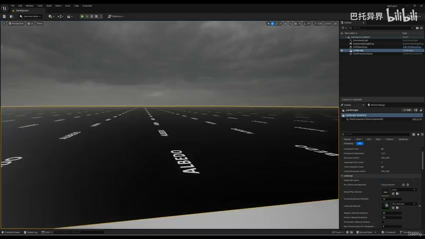
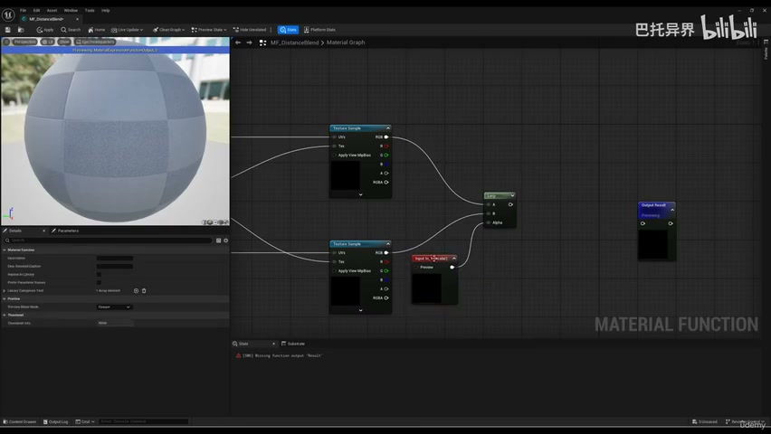
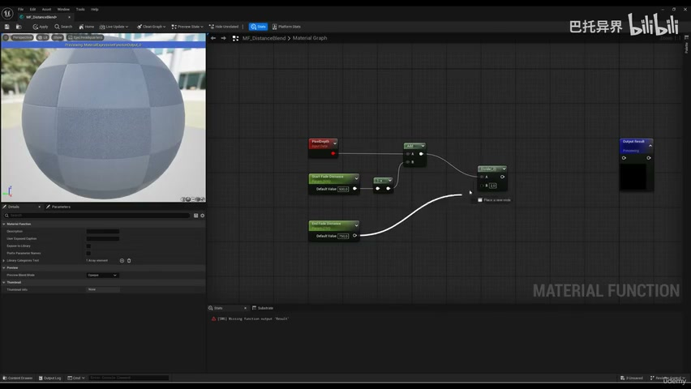
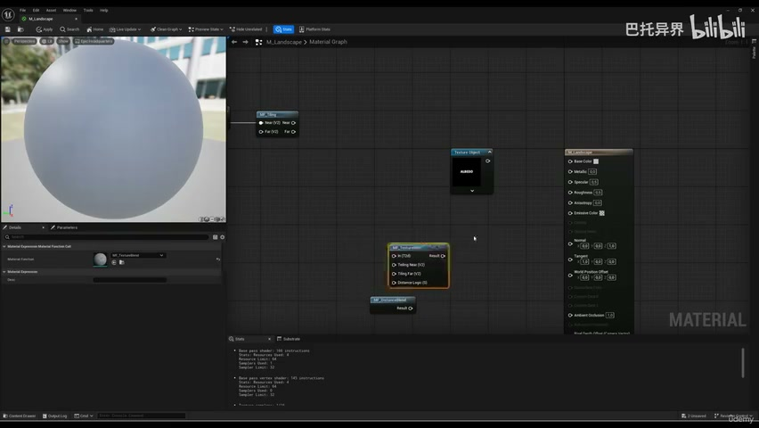
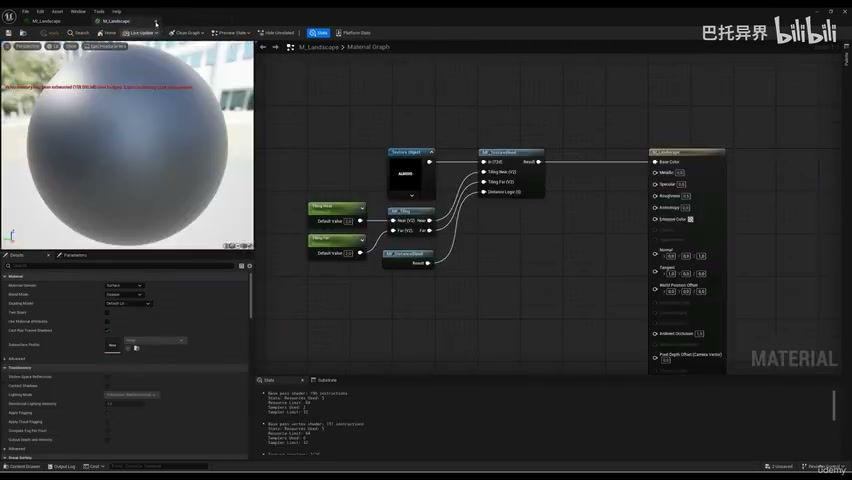
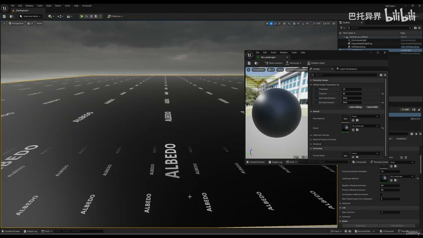

# 2-2 - Distance Blend Function

## 知识目标

- 本文整理“2-2 - Distance Blend Function”的 PCG 实操流程、关键节点、参数组织方式和复现风险点。

## 可复现主流程

- 创建近景/远景纹理混合逻辑，减少 Landscape 远距离重复图案。
- 用 Camera Distance 或距离衰减参数在不同 tiling 之间过渡。
- 把距离、过渡宽度、近景尺度和远景尺度暴露为参数。
- 在视口中检查近距离细节和远距离大形是否自然衔接。

## 关键术语

- `Material`
- `Instance`
- `Landscape`
- `blend`
- `distance`
- `tiling`
- `texture`
- `material`
- `near`
- `function`
- `fade`
- `input`

## 操作步骤与要点

### 创建近景/远景纹理混合逻辑，减少 Landscape 远距离重复图案

**内容要点：**

- 创建近景/远景纹理混合逻辑，减少 Landscape 远距离重复图案。

**关键截图：**

**参数、节点和风险点：**

- `Material`
- `Instance`
- `Landscape`
- `material`
- `function`
- `blend`
- `distance`
- `texture`
- `hook`
- `scalar`

### 用 Camera Distance 或距离衰减参数在不同 tiling 之间过渡

**内容要点：**

- 用 Camera Distance 或距离衰减参数在不同 tiling 之间过渡。

**关键截图：**

**参数、节点和风险点：**

- `Material`
- `Instance`
- `Landscape`
- `near`
- `distance`
- `tiling`
- `texture`
- `blend`
- `input`
- `function`

### 把距离、过渡宽度、近景尺度和远景尺度暴露为参数

**内容要点：**

- 把距离、过渡宽度、近景尺度和远景尺度暴露为参数。

**关键截图：**

**参数、节点和风险点：**

- `Material`
- `Instance`
- `Landscape`
- `tiling`
- `fade`
- `bigger`
- `distance`
- `blend`
- `texture`
- `zoom`

## 复现检查清单

- 距离混合不要产生明显分界线；过渡宽度和纹理尺度需要随场景尺寸调整。
- 所有 UE5 资产都要检查比例、pivot、材质槽、贴图色彩空间和实例化性能。
- 复现时先固定随机种子，再调整密度、过滤和生成资源，避免随机结果掩盖逻辑错误。
