# 2-3 - Add Texture Functions

## 知识目标

- 本文整理“2-3 - Add Texture Functions”的 PCG 实操流程、关键节点、参数组织方式和复现风险点。

## 可复现主流程

- 把 Base Color、Normal、Roughness、AO、Displacement 等贴图采样整理为统一材质函数。
- 在函数内接入平铺、距离混合和强度调节，让每个地表层能用同一套入口。
- 为贴图缺失或通道打包预留参数，减少后续替换纹理时的节点改动。
- 用材质实例测试不同纹理组，确认输出值域和法线强度合理。

## 关键术语

- `Component`
- `Material`
- `Instance`
- `Landscape`
- `distance`
- `blend`
- `albedo`
- `texture`
- `logic`
- `near`
- `normal`
- `roughness`
- `tiling`
- `material`

## 操作步骤与要点

### 把 Base Color、Normal、Roughness、AO、Displacement 等贴图采样整理为统一材质函数

**内容要点：**

- 把 Base Color、Normal、Roughness、AO、Displacement 等贴图采样整理为统一材质函数。

**关键截图：**

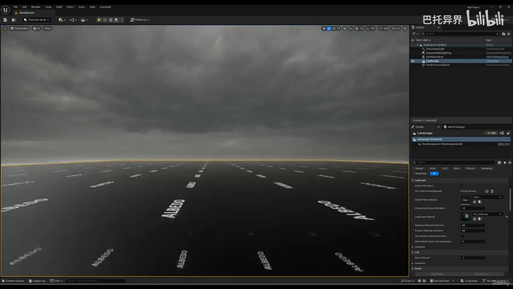
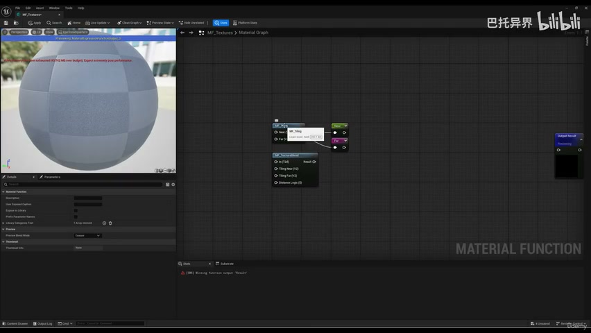

**参数、节点和风险点：**

- `Material`
- `near`
- `reroute`
- `node`
- `distance`
- `blend`
- `texture`
- `function`
- `more`
- `call`

### 把 Base Color、Normal、Roughness、AO、Displacement 等贴图采样整理为统一材质函数（2）

**内容要点：**

- 把 Base Color、Normal、Roughness、AO、Displacement 等贴图采样整理为统一材质函数（2）。

**关键截图：**

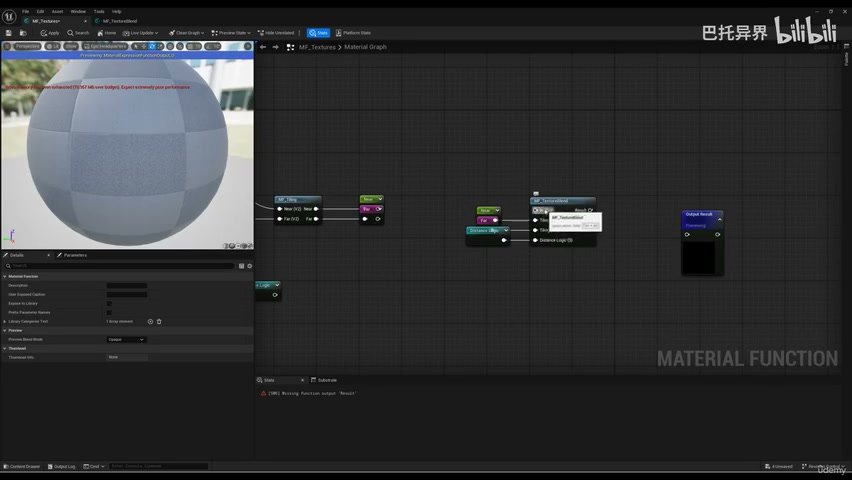
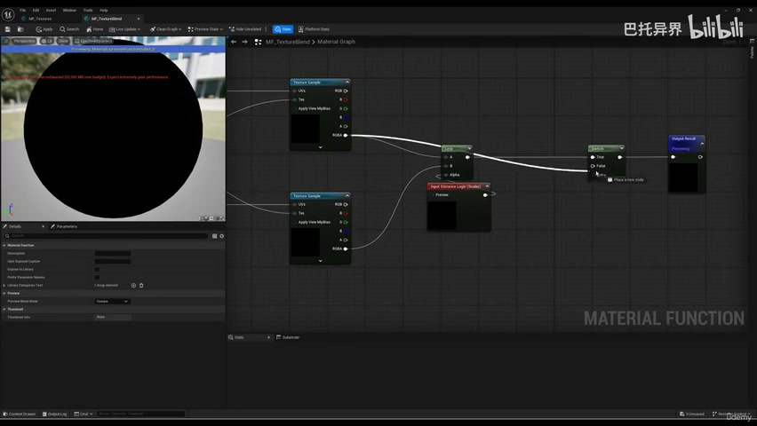

**参数、节点和风险点：**

- `Material`
- `blend`
- `distance`
- `texture`
- `static`
- `bool`
- `switch`
- `save`
- `input`
- `call`

### 在函数内接入平铺、距离混合和强度调节，让每个地表层能用同一套入口

**内容要点：**

- 在函数内接入平铺、距离混合和强度调节，让每个地表层能用同一套入口。

**关键截图：**

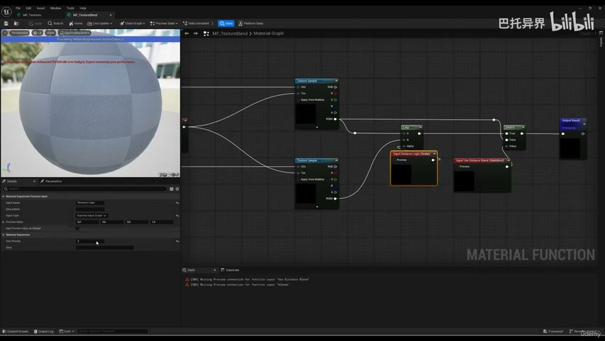
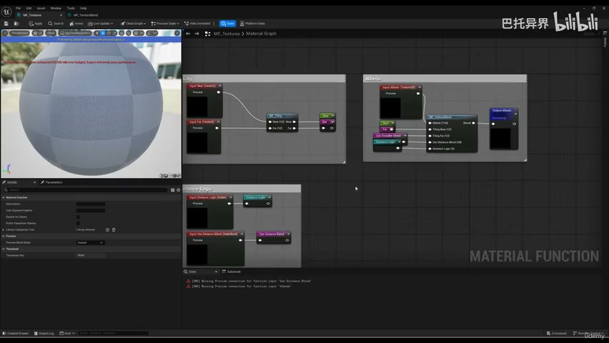

**参数、节点和风险点：**

- `Material`
- `Landscape`
- `distance`
- `logic`
- `albedo`
- `blend`
- `texture`
- `would`
- `textures`
- `whole`

### 为贴图缺失或通道打包预留参数，减少后续替换纹理时的节点改动

**内容要点：**

- 为贴图缺失或通道打包预留参数，减少后续替换纹理时的节点改动。

**关键截图：**

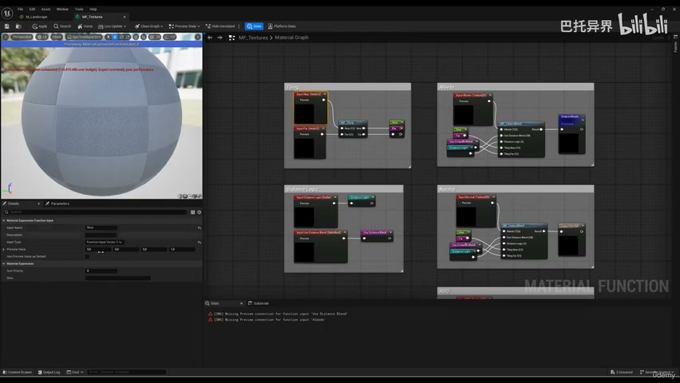
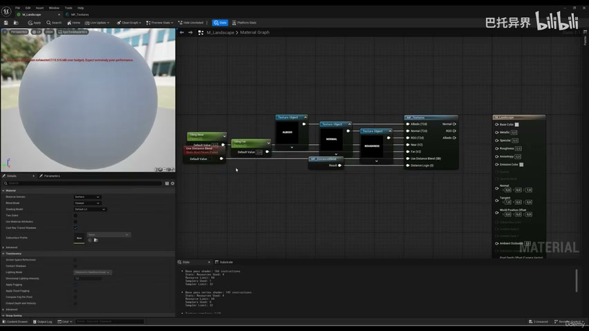

**参数、节点和风险点：**

- `Component`
- `Material`
- `Instance`
- `Landscape`
- `albedo`
- `distance`
- `blend`
- `near`
- `roughness`
- `displacement`

### 为贴图缺失或通道打包预留参数，减少后续替换纹理时的节点改动（2）

**内容要点：**

- 为贴图缺失或通道打包预留参数，减少后续替换纹理时的节点改动（2）。

**关键截图：**

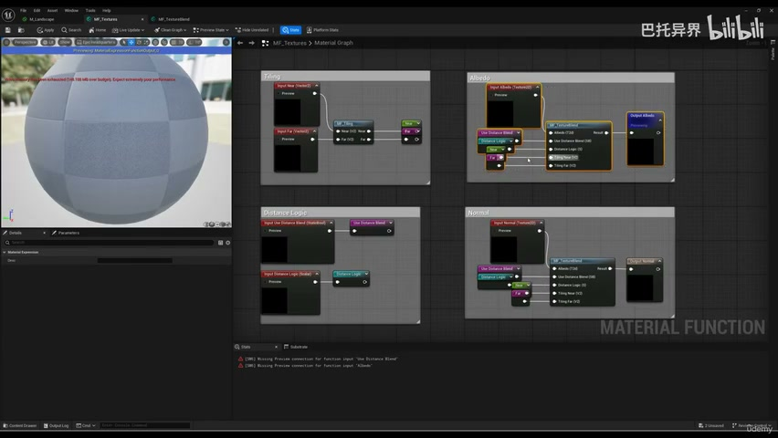
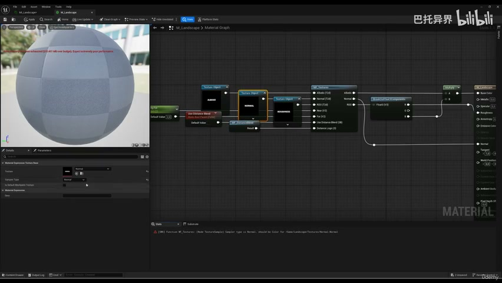

**参数、节点和风险点：**

- `Material`
- `Instance`
- `Landscape`
- `logic`
- `normal`
- `texture`
- `albedo`
- `roughness`
- `distance`
- `tiling`

### 用材质实例测试不同纹理组，确认输出值域和法线强度合理

**内容要点：**

- 用材质实例测试不同纹理组，确认输出值域和法线强度合理。

**关键截图：**

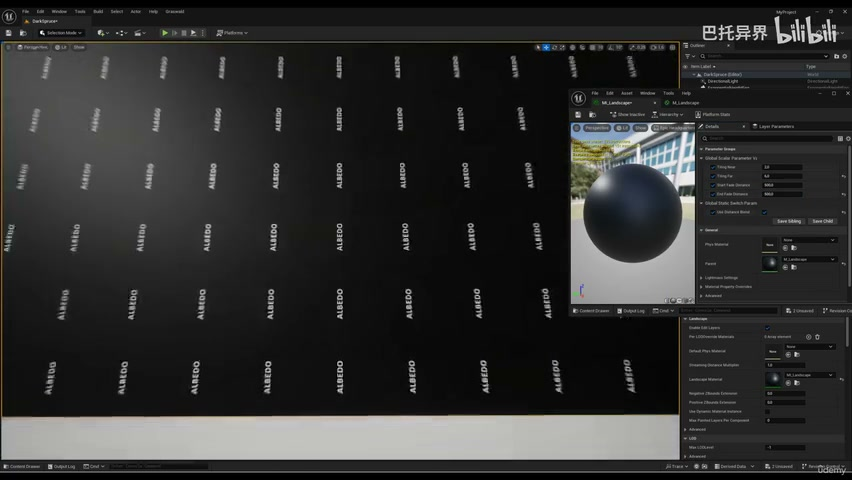
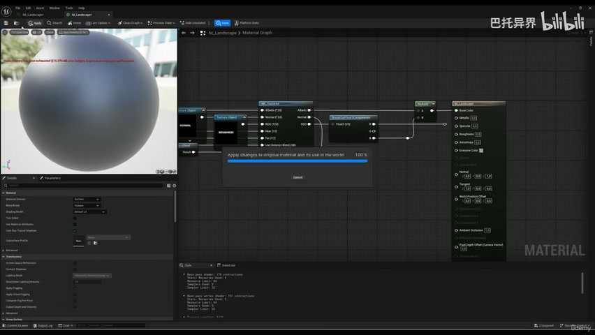

**参数、节点和风险点：**

- `Material`
- `roughness`
- `distance`
- `normal`
- `blend`
- `only`
- `channel`
- `working`
- `ambient`
- `occlusion`

## 复现检查清单

- 材质函数越通用，越要注意参数命名和默认值，否则后面层函数会难以维护。
- 所有 UE5 资产都要检查比例、pivot、材质槽、贴图色彩空间和实例化性能。
- 复现时先固定随机种子，再调整密度、过滤和生成资源，避免随机结果掩盖逻辑错误。
