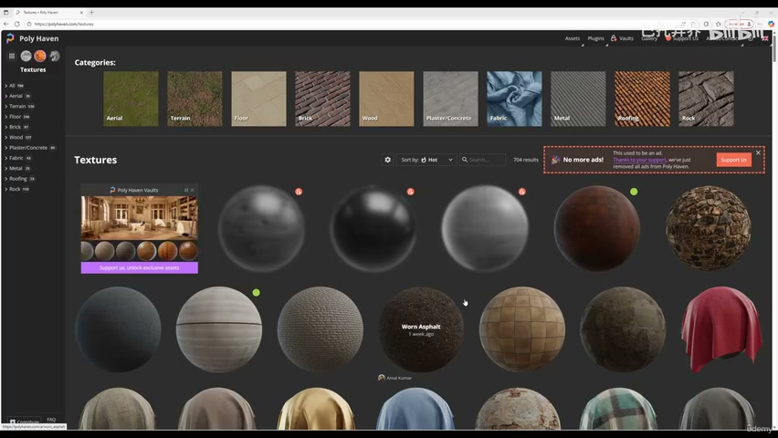
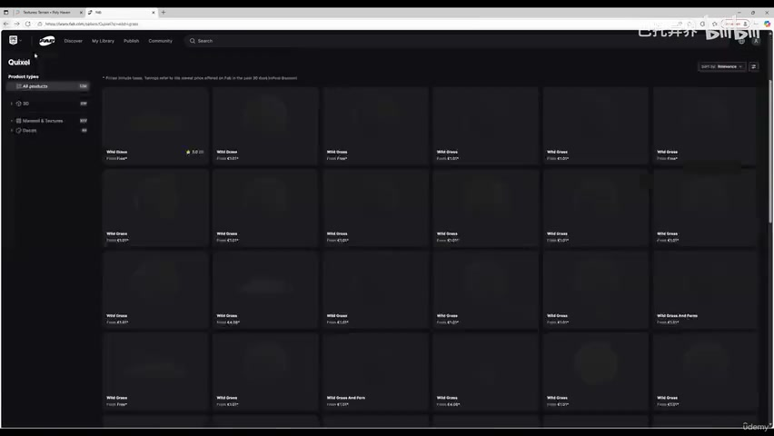
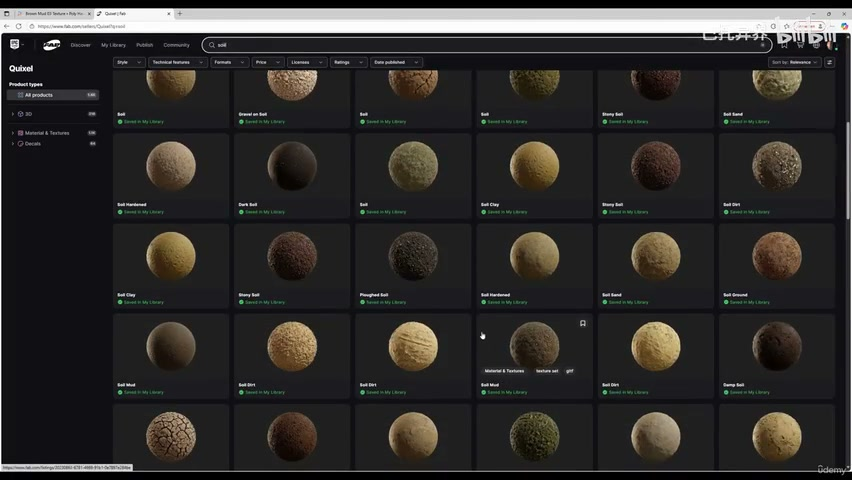
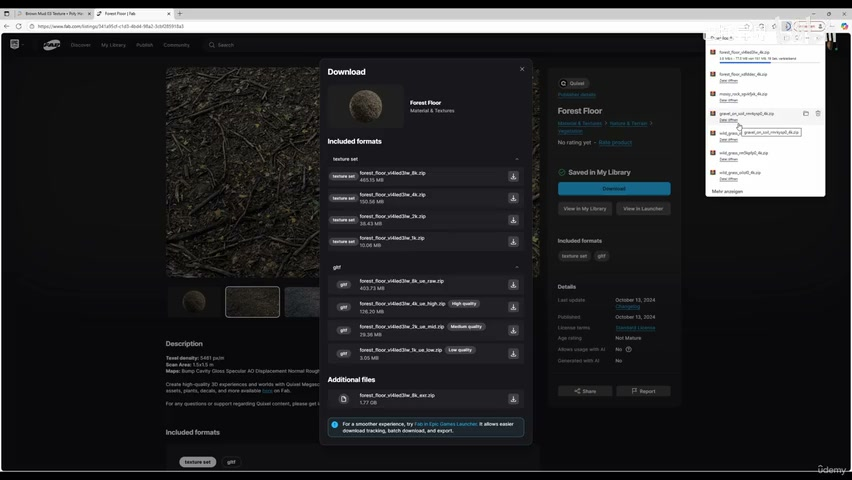
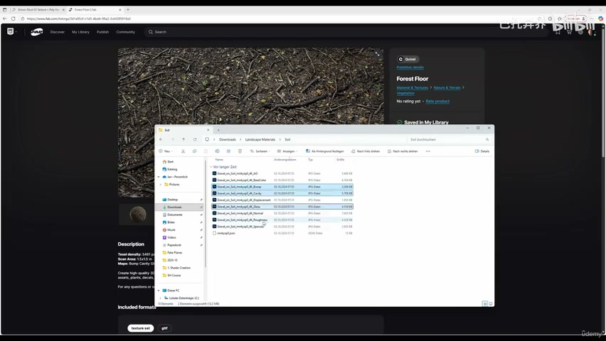
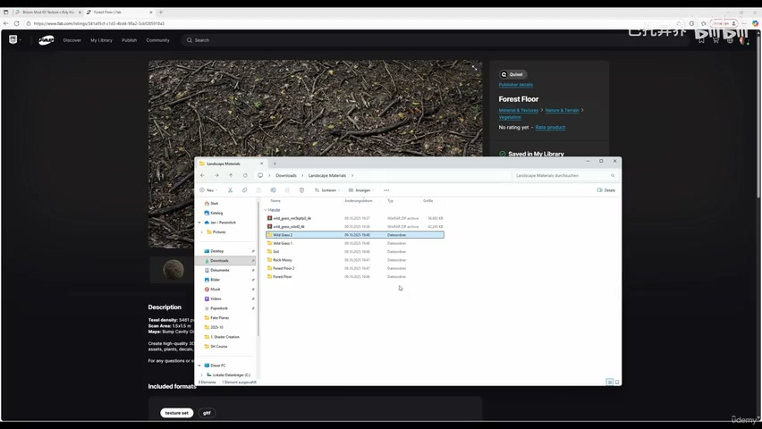

# 2-6 - Download Textures

## 知识目标

- 本文整理“2-6 - Download Textures”的 PCG 实操流程、关键节点、参数组织方式和复现风险点。

## 可复现主流程

- 按课程需要下载泥土、草地、岩石、苔藓等地表纹理资源。
- 统一检查贴图分辨率、命名、色彩空间和通道含义。
- 把下载资源整理到项目目录，并创建 UE5 中的 Texture/Material Instance 引用关系。
- 记录授权、来源和替换建议，方便后续做不同环境版本。

## 关键术语

- `Mask`
- `Material`
- `Landscape`
- `textures`
- `grass`
- `some`

## 操作步骤与要点

### 按课程需要下载泥土、草地、岩石、苔藓等地表纹理资源

**内容要点：**

- 按课程需要下载泥土、草地、岩石、苔藓等地表纹理资源。

**关键截图：**

**参数、节点和风险点：**

- `Mask`
- `Material`
- `Landscape`
- `grass`
- `textures`
- `nice`
- `texture`
- `Quixel`
- `search`

### 统一检查贴图分辨率、命名、色彩空间和通道含义

**内容要点：**

- 统一检查贴图分辨率、命名、色彩空间和通道含义。

**关键截图：**

**参数、节点和风险点：**

- `Material`
- `Landscape`
- `textures`
- `floor`
- `some`
- `gravel`
- `rock`
- `think`
- `soil`

### 把下载资源整理到项目目录，并创建 UE5 中的 Texture/Material Instance 引用关系

**内容要点：**

- 把下载资源整理到项目目录，并创建 UE5 中的 Texture/Material Instance 引用关系。

**关键截图：**

**参数、节点和风险点：**

- `extract`
- `delete`
- `gloss`
- `specular`
- `wild`
- `grass`
- `bump`
- `cavity`
- `soil`
- `folder`

## 复现检查清单

- 下载纹理不是只保存文件，必须同时整理命名、通道和导入设置。
- 所有 UE5 资产都要检查比例、pivot、材质槽、贴图色彩空间和实例化性能。
- 复现时先固定随机种子，再调整密度、过滤和生成资源，避免随机结果掩盖逻辑错误。
