# 2-8 - Paint Landscape Materials

## 知识目标

- 本文整理“2-8 - Paint Landscape Materials”的 PCG 实操流程、关键节点、参数组织方式和复现风险点。

## 可复现主流程

- 在 Landscape 上应用多层材质，先大面积铺设主地表，再用 Paint Layer 做道路、坡面和过渡。
- 根据场景构图调整每层 tiling、颜色、粗糙度、法线强度和混合边缘。
- 结合地形起伏刷出泥土、草地、岩石等区域，避免纹理分布与地形逻辑冲突。
- 保存材质实例和 Layer Info，作为后续 PCG、样条道路和 RVT 的基础。

## 关键术语

- `Point`
- `Graph`
- `Material`
- `Instance`
- `Landscape`
- `normal`
- `texture`
- `displacement`
- `fine`
- `working`
- `roughness`
- `point`
- `default`

## 操作步骤与要点

### 在 Landscape 上应用多层材质，先大面积铺设主地表，再用 Paint Layer 做道路、坡面和过渡

**内容要点：**

- 在 Landscape 上应用多层材质，先大面积铺设主地表，再用 Paint Layer 做道路、坡面和过渡。

**关键截图：**

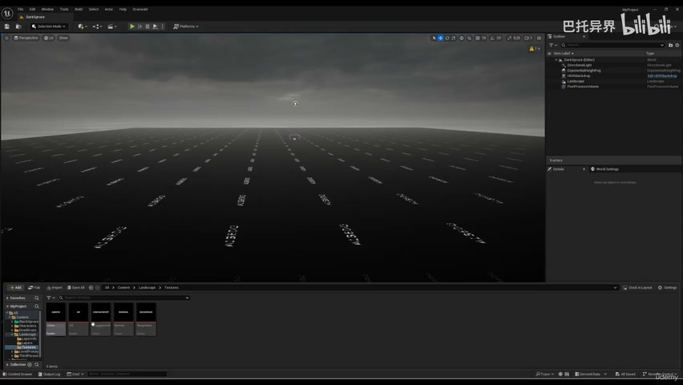
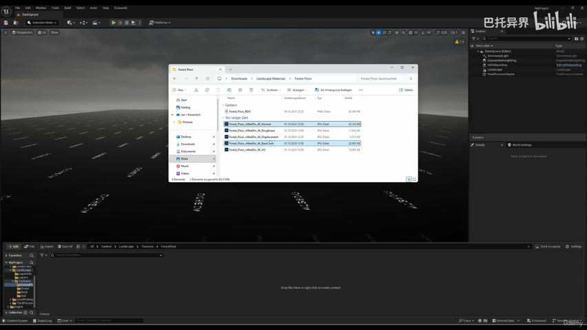

**参数、节点和风险点：**

- `Material`
- `Landscape`
- `displacement`
- `normal`
- `base`
- `color`
- `grass`
- `four`
- `materials`
- `flip`

### 在 Landscape 上应用多层材质，先大面积铺设主地表，再用 Paint Layer 做道路、坡面和过渡（2）

**内容要点：**

- 在 Landscape 上应用多层材质，先大面积铺设主地表，再用 Paint Layer 做道路、坡面和过渡（2）。

**关键截图：**

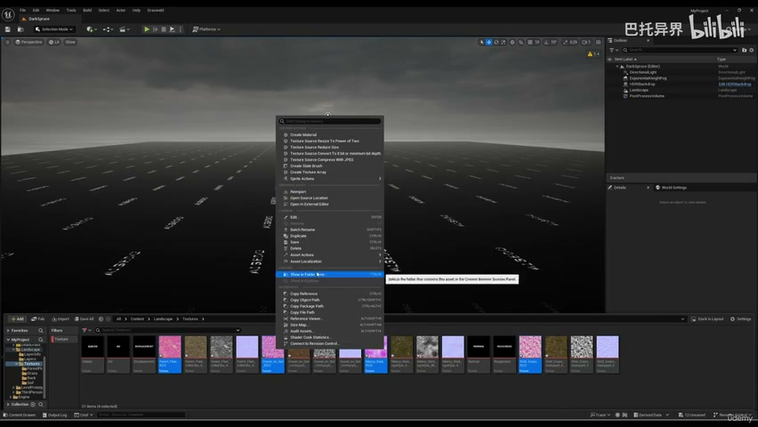
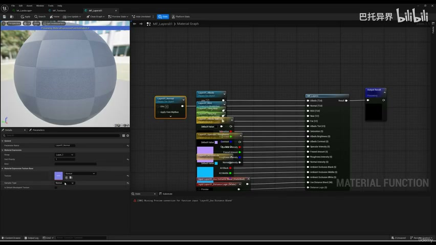

**参数、节点和风险点：**

- `Graph`
- `Material`
- `Landscape`
- `normal`
- `texture`
- `change`
- `layers`
- `default`
- `open`
- `maps`

### 根据场景构图调整每层 tiling、颜色、粗糙度、法线强度和混合边缘

**内容要点：**

- 根据场景构图调整每层 tiling、颜色、粗糙度、法线强度和混合边缘。

**关键截图：**

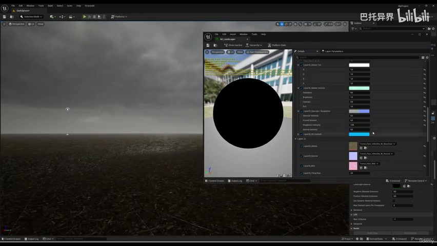
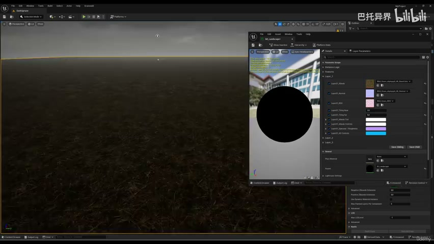

**参数、节点和风险点：**

- `Point`
- `Material`
- `Instance`
- `Landscape`
- `texture`
- `normal`
- `fine`
- `intensity`
- `forest`
- `grass`

### 结合地形起伏刷出泥土、草地、岩石等区域，避免纹理分布与地形逻辑冲突

**内容要点：**

- 结合地形起伏刷出泥土、草地、岩石等区域，避免纹理分布与地形逻辑冲突。

**关键截图：**

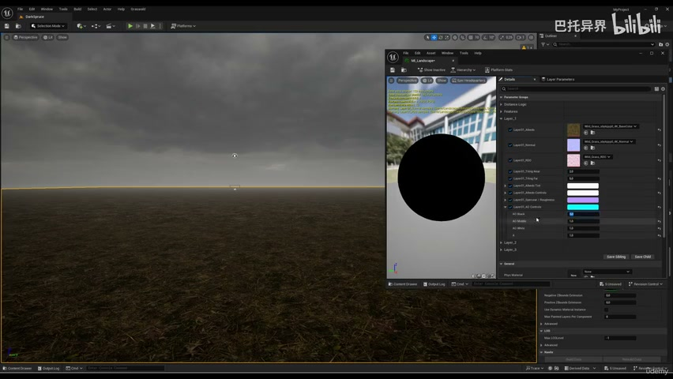
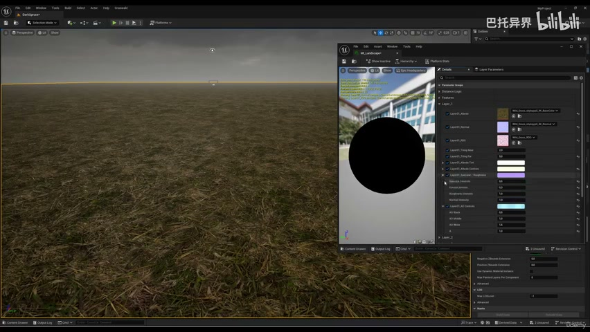

**参数、节点和风险点：**

- `Point`
- `Material`
- `Landscape`
- `roughness`
- `check`
- `working`
- `specular`
- `Fresnel`
- `five`
- `good`

### 结合地形起伏刷出泥土、草地、岩石等区域，避免纹理分布与地形逻辑冲突（2）

**内容要点：**

- 结合地形起伏刷出泥土、草地、岩石等区域，避免纹理分布与地形逻辑冲突（2）。

**关键截图：**

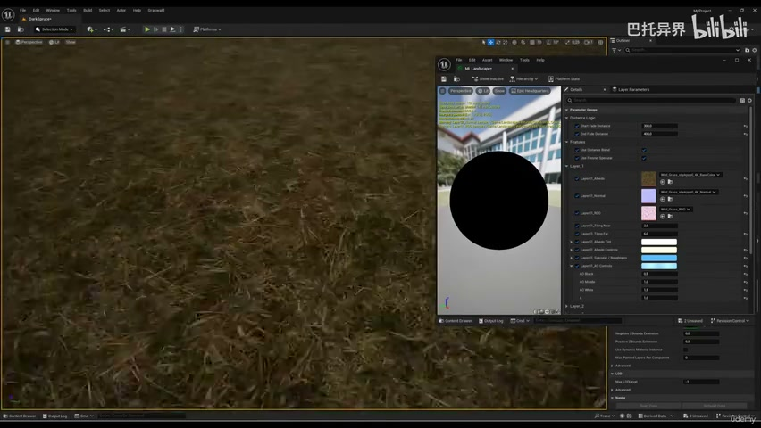
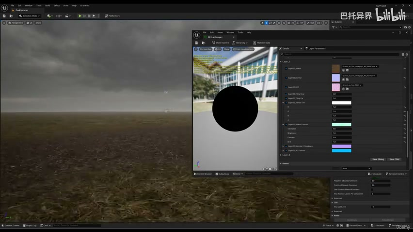

**参数、节点和风险点：**

- `Point`
- `Material`
- `Landscape`
- `point`
- `layer`
- `fine`
- `second`
- `albedo`
- `normal`
- `values`

### 保存材质实例和 Layer Info，作为后续 PCG、样条道路和 RVT 的基础

**内容要点：**

- 保存材质实例和 Layer Info，作为后续 PCG、样条道路和 RVT 的基础。

**关键截图：**

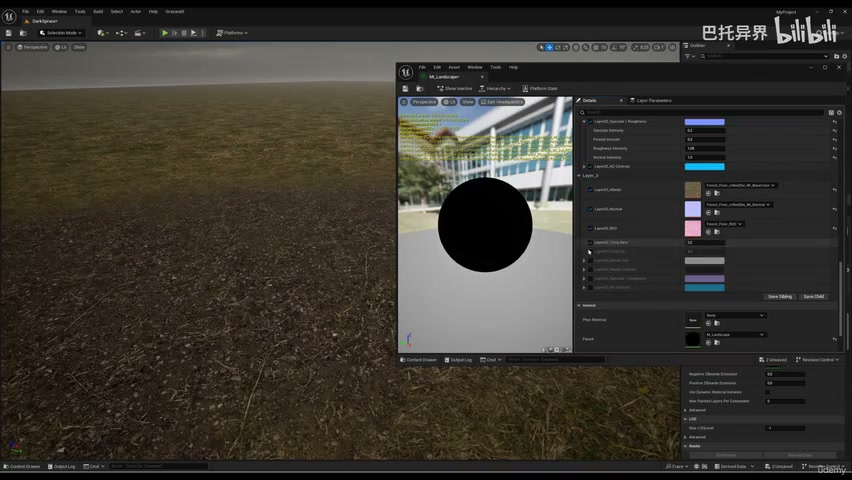
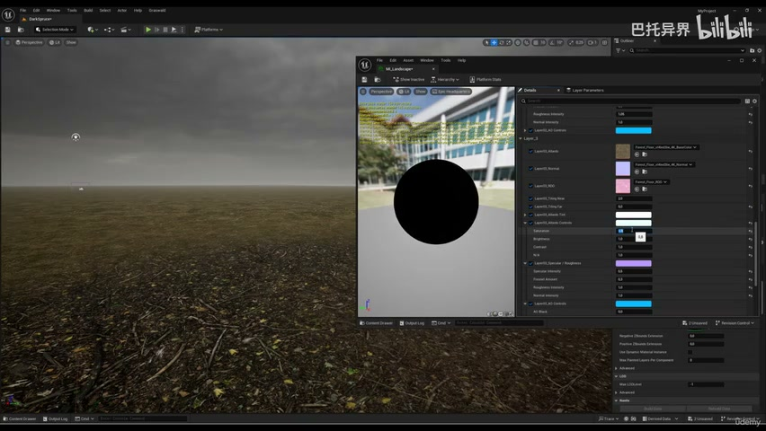

**参数、节点和风险点：**

- `Point`
- `Instance`
- `Landscape`
- `working`
- `properly`
- `controls`
- `brightness`
- `contrast`
- `fine`
- `think`

## 复现检查清单

- 手绘层要服务于场景动线和坡度，不要只追求局部纹理好看。
- 所有 UE5 资产都要检查比例、pivot、材质槽、贴图色彩空间和实例化性能。
- 复现时先固定随机种子，再调整密度、过滤和生成资源，避免随机结果掩盖逻辑错误。
