# 2-11 - Create 5km Landscape in GAEA

## 知识目标

- 本文整理“2-11 - Create 5km Landscape in GAEA”的 PCG 实操流程、关键节点、参数组织方式和复现风险点。

## 可复现主流程

- 在 GAEA 中创建或处理 5km 级别地形，高度、侵蚀、坡度和水流遮罩要服务于 UE5 场景。
- 导出 heightmap 和需要的 mask，记录分辨率、范围和高度比例。
- 在 UE5 中导入 Landscape，匹配世界尺寸、Z scale 和材质层。
- 检查大地形中的构图区域、道路空间和后续 PCG 生成范围。

## 关键术语

- `Point`
- `Component`
- `Density`
- `Material`
- `Instance`
- `Landscape`
- `height`
- `landscape`
- `import`

## 操作步骤与要点

### 在 GAEA 中创建或处理 5km 级别地形，高度、侵蚀、坡度和水流遮罩要服务于 UE5 场景

**内容要点：**

- 在 GAEA 中创建或处理 5km 级别地形，高度、侵蚀、坡度和水流遮罩要服务于 UE5 场景。

**关键截图：**

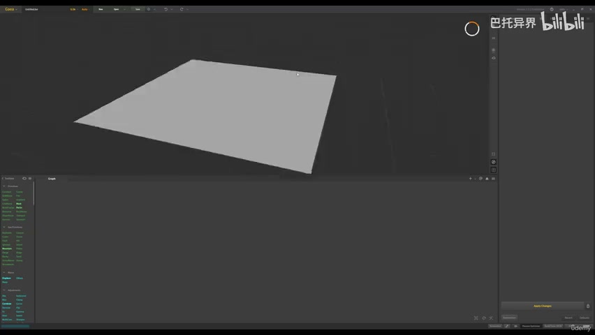
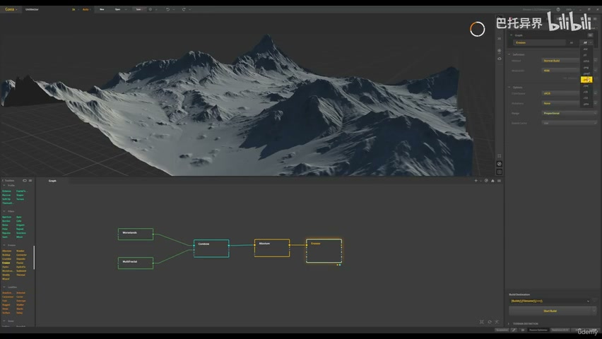

**参数、节点和风险点：**

- `Material`
- `Landscape`
- `height`
- `landscape`
- `meters`
- `Unreal`
- `Engine`
- `scale`
- `erosion`
- `more`

### 在 GAEA 中创建或处理 5km 级别地形，高度、侵蚀、坡度和水流遮罩要服务于 UE5 场景（2）

**内容要点：**

- 在 GAEA 中创建或处理 5km 级别地形，高度、侵蚀、坡度和水流遮罩要服务于 UE5 场景（2）。

**关键截图：**

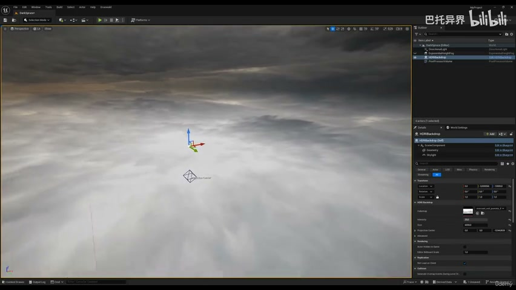
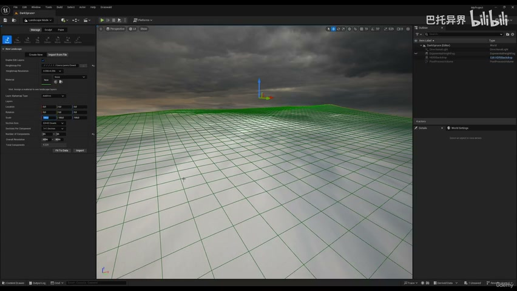

**参数、节点和风险点：**

- `Component`
- `Landscape`
- `height`
- `scale`
- `Gaia`
- `landscape`
- `think`
- `default`
- `ratio`

### 导出 heightmap 和需要的 mask，记录分辨率、范围和高度比例

**内容要点：**

- 导出 heightmap 和需要的 mask，记录分辨率、范围和高度比例。

**关键截图：**

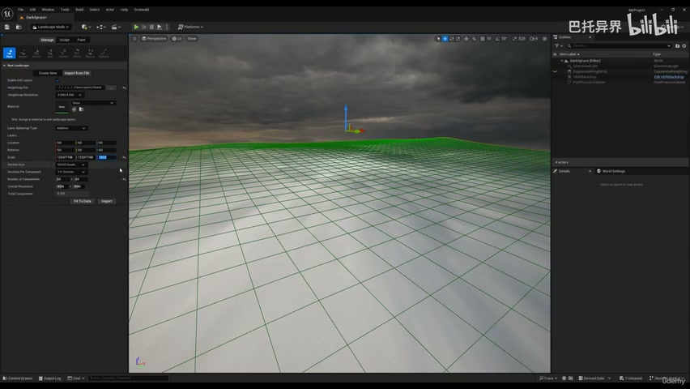
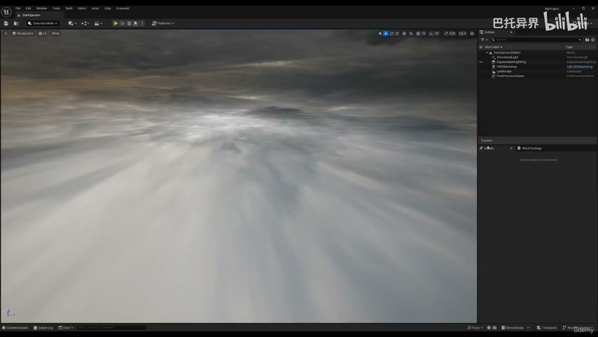

**参数、节点和风险点：**

- `Landscape`
- `height`
- `multiply`
- `landscape`
- `actual`
- `value`
- `fork`
- `HDRI`
- `divided`
- `reason`

### 导出 heightmap 和需要的 mask，记录分辨率、范围和高度比例（2）

**内容要点：**

- 导出 heightmap 和需要的 mask，记录分辨率、范围和高度比例（2）。

**关键截图：**

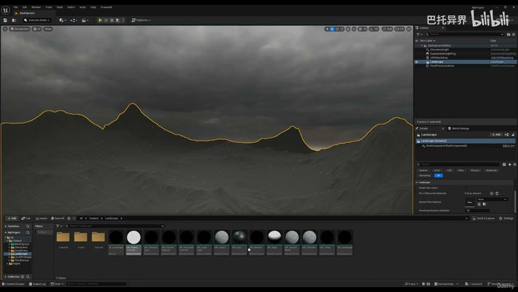

**参数、节点和风险点：**

- `Material`
- `Instance`
- `Landscape`
- `import`
- `rock`
- `file`
- `info`
- `Boom`
- `layer`
- `delete`

### 在 UE5 中导入 Landscape，匹配世界尺寸、Z scale 和材质层

**内容要点：**

- 在 UE5 中导入 Landscape，匹配世界尺寸、Z scale 和材质层。

**关键截图：**

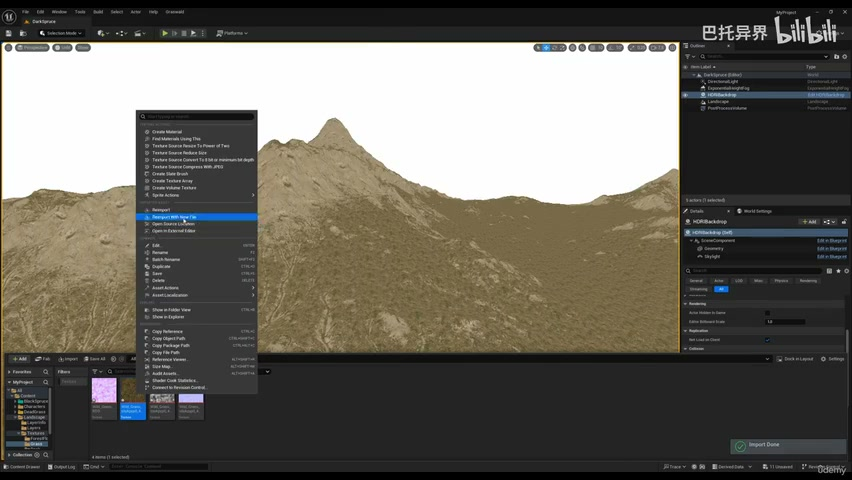
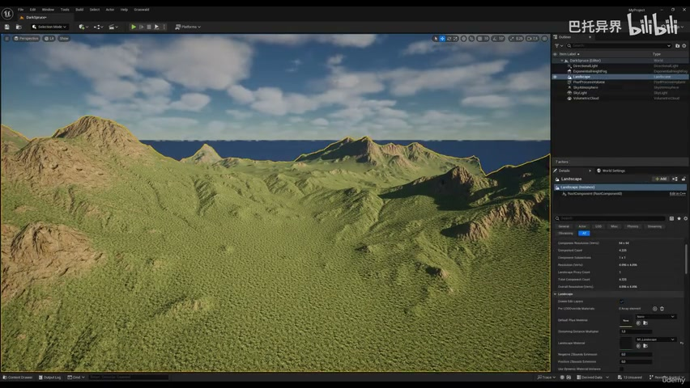

**参数、节点和风险点：**

- `Material`
- `Landscape`
- `import`
- `grass`
- `lighting`
- `process`
- `height`
- `light`
- `five`
- `file`

### 在 UE5 中导入 Landscape，匹配世界尺寸、Z scale 和材质层（2）

**内容要点：**

- 在 UE5 中导入 Landscape，匹配世界尺寸、Z scale 和材质层（2）。

**关键截图：**

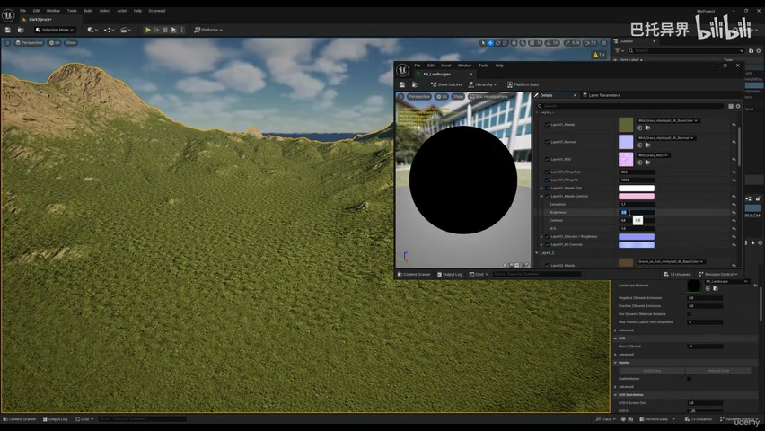
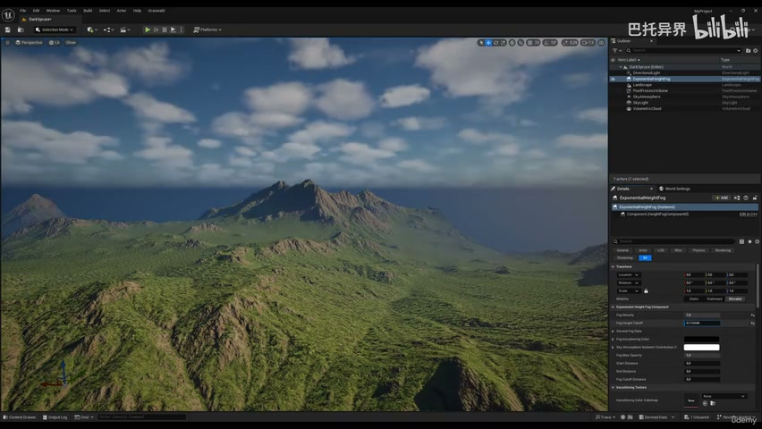

**参数、节点和风险点：**

- `Point`
- `Density`
- `Material`
- `Landscape`
- `good`
- `point`
- `distance`
- `fine`
- `falloff`
- `landscape`

### 检查大地形中的构图区域、道路空间和后续 PCG 生成范围

**内容要点：**

- 检查大地形中的构图区域、道路空间和后续 PCG 生成范围。

**关键截图：**

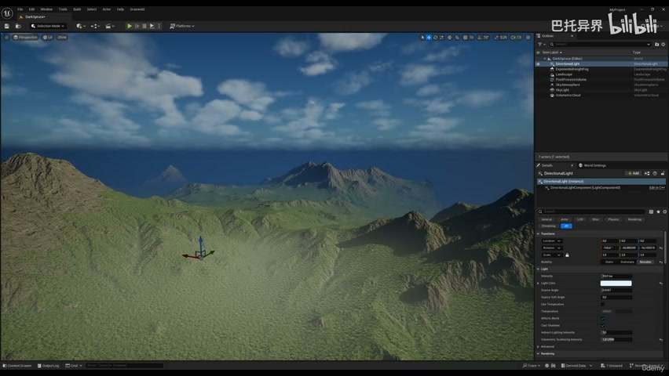
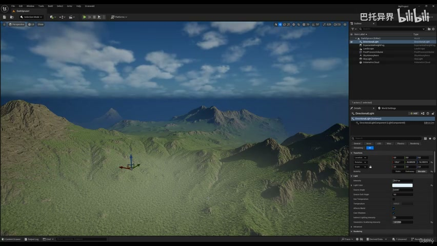

**参数、节点和风险点：**

- `Material`
- `Landscape`
- `blend`
- `couple`
- `landscape`
- `material`
- `height`
- `well`
- `more`
- `already`

## 复现检查清单

- GAEA 到 UE5 的高度比例和分辨率必须记录清楚，否则后续道路、植被和镜头都会偏。
- 所有 UE5 资产都要检查比例、pivot、材质槽、贴图色彩空间和实例化性能。
- 复现时先固定随机种子，再调整密度、过滤和生成资源，避免随机结果掩盖逻辑错误。
