# 2-12 - Add Parallax Occlusion Function

## 知识目标

- 本文整理“2-12 - Add Parallax Occlusion Function”的 PCG 实操流程、关键节点、参数组织方式和复现风险点。

## 可复现主流程

- 创建 POM 材质函数，把高度图转成近景视差深度。
- 暴露高度强度、步数、距离衰减和纹理坐标输入。
- 把 POM 接入地表材质，比较开启前后石头、泥土等细节深度。
- 为远距离或低性能场景设置衰减，避免 POM 在大面积 Landscape 上过重。

## 关键术语

- `Graph`
- `Mask`
- `Material`
- `Instance`
- `Landscape`
- `displacement`
- `texture`
- `occlusion`
- `parallax`
- `steps`
- `channel`
- `mapping`
- `height`

## 操作步骤与要点

### 创建 POM 材质函数，把高度图转成近景视差深度

**内容要点：**

- 创建 POM 材质函数，把高度图转成近景视差深度。

**关键截图：**

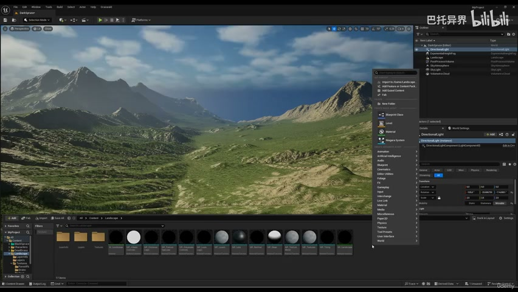
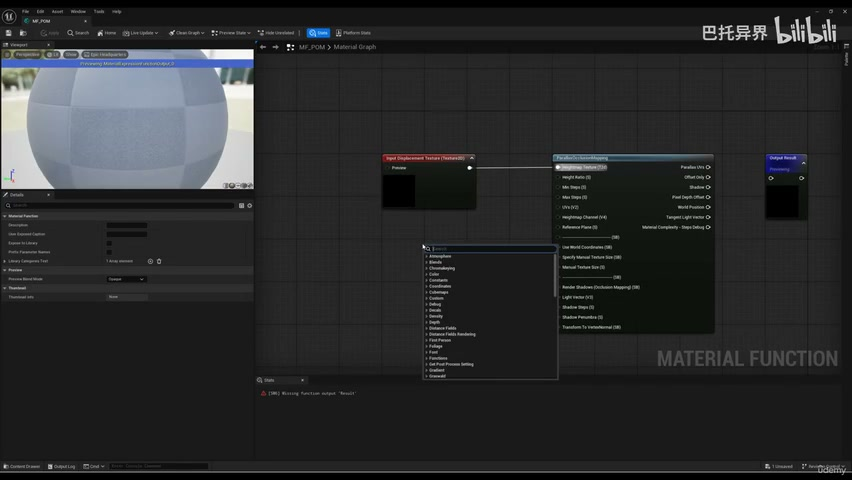

**参数、节点和风险点：**

- `Material`
- `Landscape`
- `steps`
- `displacement`
- `height`
- `texture`
- `offset`
- `parallax`
- `occlusion`
- `already`

### 创建 POM 材质函数，把高度图转成近景视差深度（2）

**内容要点：**

- 创建 POM 材质函数，把高度图转成近景视差深度（2）。

**关键截图：**

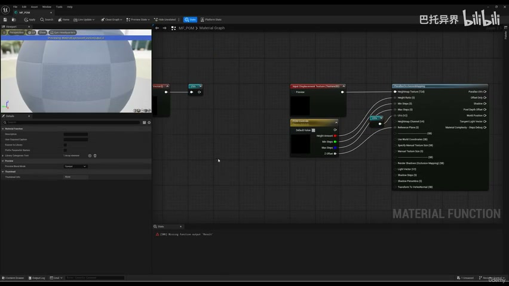
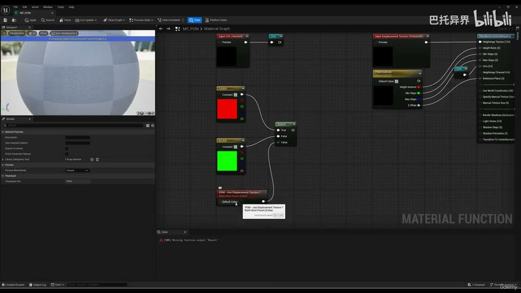

**参数、节点和风险点：**

- `Material`
- `channel`
- `height`
- `displacement`
- `select`
- `texture`
- `green`
- `static`
- `would`
- `vector`

### 暴露高度强度、步数、距离衰减和纹理坐标输入

**内容要点：**

- 暴露高度强度、步数、距离衰减和纹理坐标输入。

**关键截图：**

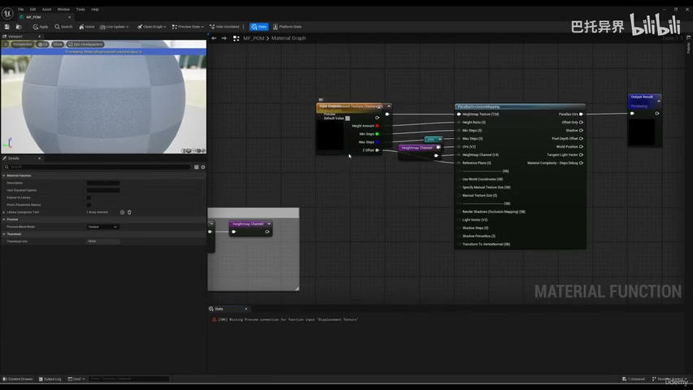
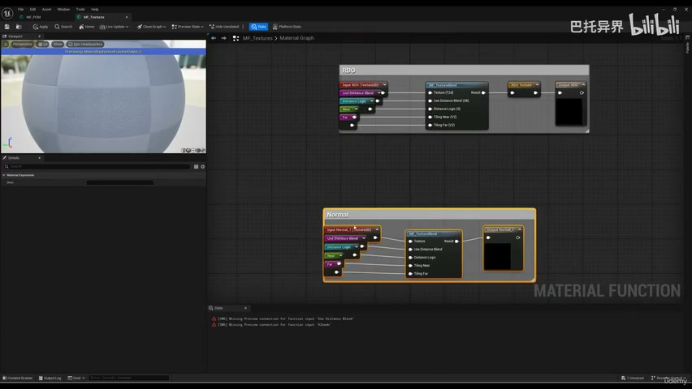

**参数、节点和风险点：**

- `Graph`
- `Material`
- `displacement`
- `near`
- `parallax`
- `occlusion`
- `mapping`
- `texture`
- `more`
- `input`

### 把 POM 接入地表材质，比较开启前后石头、泥土等细节深度

**内容要点：**

- 把 POM 接入地表材质，比较开启前后石头、泥土等细节深度。

**关键截图：**

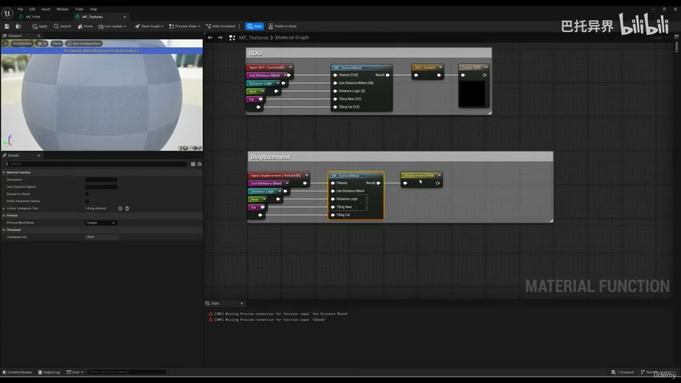
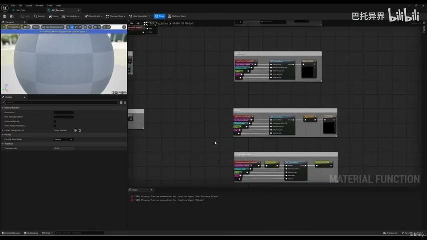

**参数、节点和风险点：**

- `Mask`
- `Material`
- `Landscape`
- `displacement`
- `reroute`
- `texture`
- `named`
- `save`
- `node`
- `think`

### 把 POM 接入地表材质，比较开启前后石头、泥土等细节深度（2）

**内容要点：**

- 把 POM 接入地表材质，比较开启前后石头、泥土等细节深度（2）。

**关键截图：**

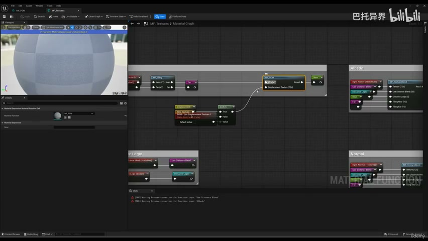
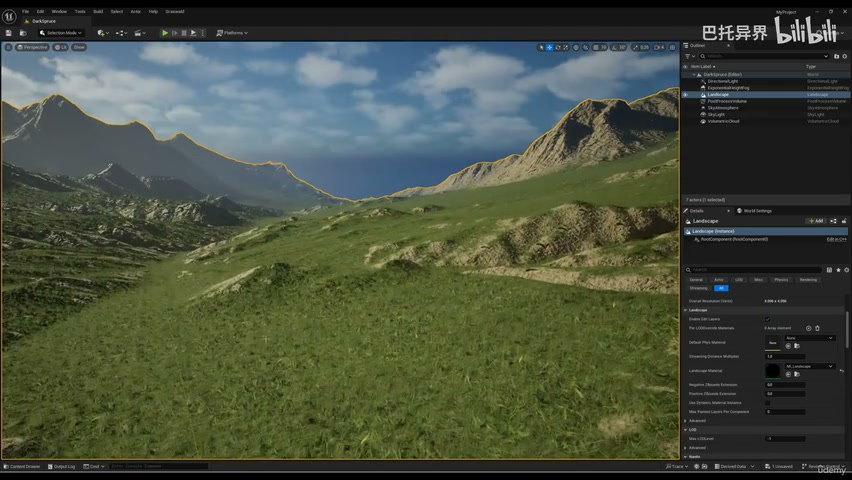

**参数、节点和风险点：**

- `Material`
- `Instance`
- `Landscape`
- `near`
- `occlusion`
- `tiling`
- `layer`
- `parallax`
- `steps`
- `material`

### 为远距离或低性能场景设置衰减，避免 POM 在大面积 Landscape 上过重

**内容要点：**

- 为远距离或低性能场景设置衰减，避免 POM 在大面积 Landscape 上过重。

**关键截图：**

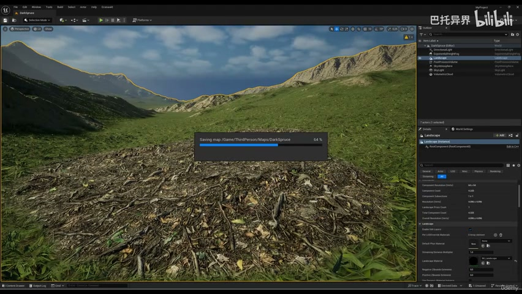
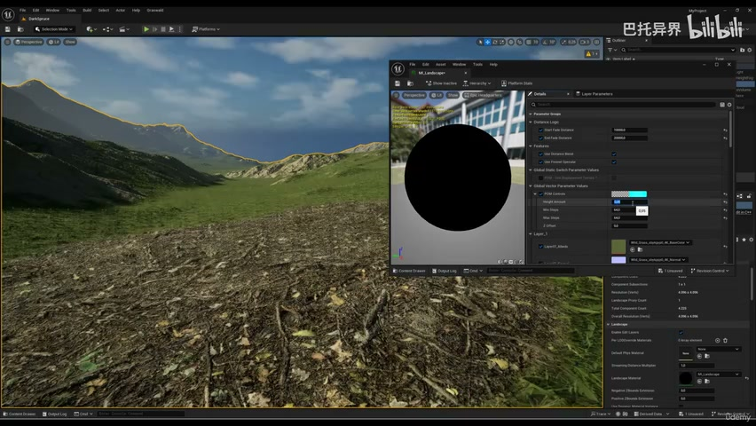

**参数、节点和风险点：**

- `Material`
- `Instance`
- `occlusion`
- `parallax`
- `mapping`
- `next`
- `already`
- `displacement`
- `texture`
- `lecture`

## 复现检查清单

- POM 应用于 Landscape 时要控制步数和距离，不能为了近景细节牺牲整体性能。
- 所有 UE5 资产都要检查比例、pivot、材质槽、贴图色彩空间和实例化性能。
- 复现时先固定随机种子，再调整密度、过滤和生成资源，避免随机结果掩盖逻辑错误。
