# 2-13 - Add Parallax Occlusion with Displacement and LightVector

## 知识目标

- 本文整理“2-13 - Add Parallax Occlusion with Displacement and LightVector”的 PCG 实操流程、关键节点、参数组织方式和复现风险点。

## 可复现主流程

- 扩展 POM 函数，加入位移感和 LightVector 相关的光照响应。
- 调试高度图、视线方向和光照方向，让凹凸细节在动态光下更可信。
- 处理 POM 与法线、粗糙度、AO 的组合，避免只增加深度但材质反应不一致。
- 在不同视角和光照下观察伪影、边缘拉伸和性能。

## 关键术语

- `Blueprint`
- `Actor`
- `Component`
- `Graph`
- `Mask`
- `Material`
- `Instance`
- `Landscape`
- `displacement`
- `shadow`
- `shadows`
- `texture`
- `vector`
- `material`
- `light`

## 操作步骤与要点

### 扩展 POM 函数，加入位移感和 LightVector 相关的光照响应

**内容要点：**

- 扩展 POM 函数，加入位移感和 LightVector 相关的光照响应。

**关键截图：**

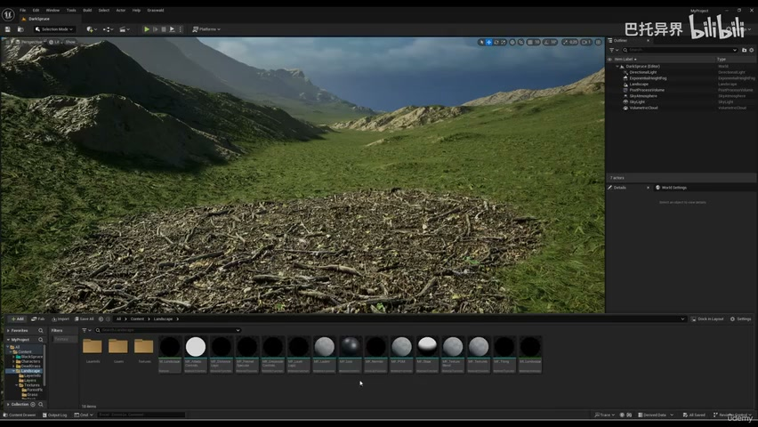
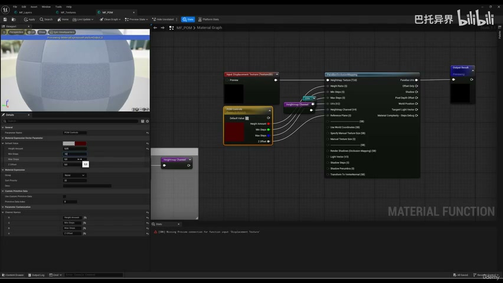

**参数、节点和风险点：**

- `Material`
- `displacement`
- `layers`
- `parallax`
- `occlusion`
- `input`
- `mapping`
- `textures`
- `would`
- `material`

### 扩展 POM 函数，加入位移感和 LightVector 相关的光照响应（2）

**内容要点：**

- 扩展 POM 函数，加入位移感和 LightVector 相关的光照响应（2）。

**关键截图：**

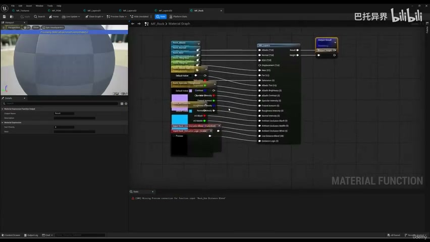
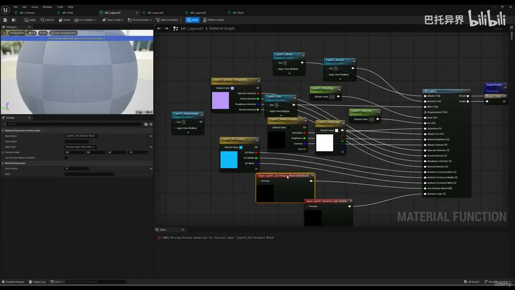

**参数、节点和风险点：**

- `Graph`
- `Material`
- `displacement`
- `layer`
- `three`
- `texture`
- `needs`
- `gray`
- `scale`
- `sRGB`

### 扩展 POM 函数，加入位移感和 LightVector 相关的光照响应（3）

**内容要点：**

- 扩展 POM 函数，加入位移感和 LightVector 相关的光照响应（3）。

**关键截图：**

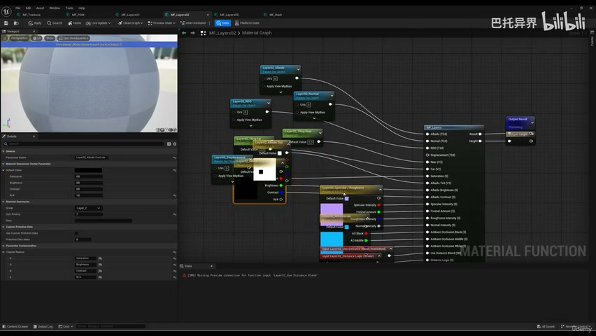
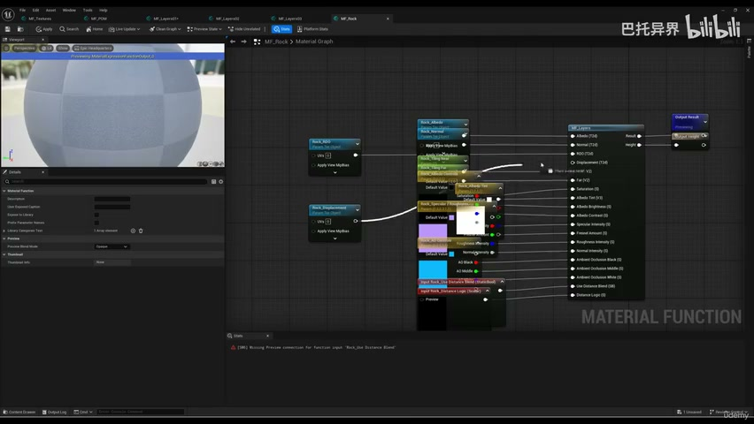

**参数、节点和风险点：**

- `Material`
- `Instance`
- `displacement`
- `would`
- `must`
- `sure`
- `controls`
- `inside`
- `linear`
- `seven`

### 扩展 POM 函数，加入位移感和 LightVector 相关的光照响应（4）

**内容要点：**

- 扩展 POM 函数，加入位移感和 LightVector 相关的光照响应（4）。

**关键截图：**

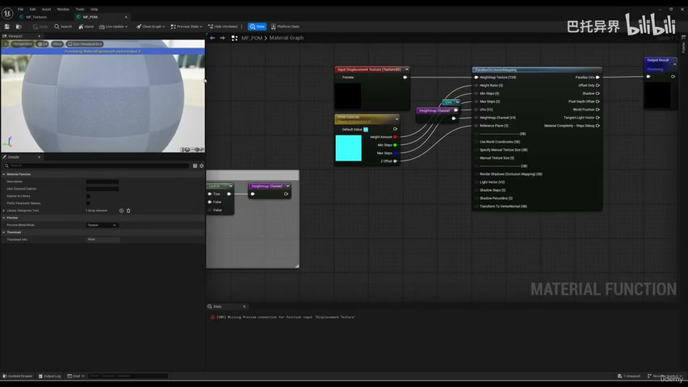
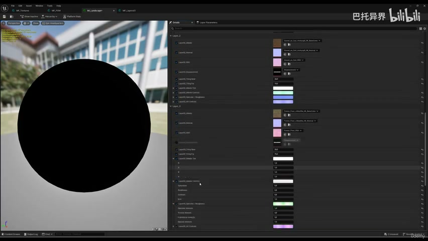

**参数、节点和风险点：**

- `Material`
- `Instance`
- `Landscape`
- `displacement`
- `texture`
- `layer`
- `think`
- `activate`
- `inside`
- `rock`

### 调试高度图、视线方向和光照方向，让凹凸细节在动态光下更可信

**内容要点：**

- 调试高度图、视线方向和光照方向，让凹凸细节在动态光下更可信。

**关键截图：**

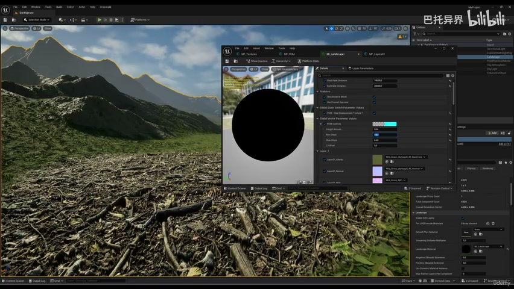
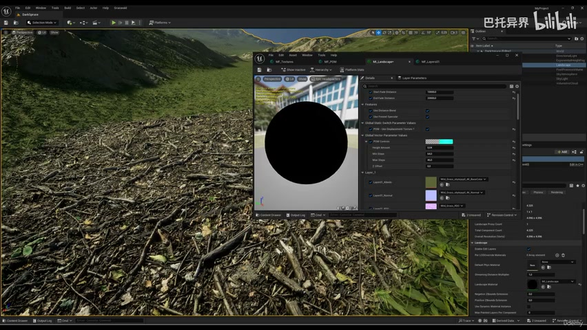

**参数、节点和风险点：**

- `Landscape`
- `displacement`
- `texture`
- `even`
- `change`
- `difference`
- `grass`
- `enough`
- `steps`
- `waves`

### 调试高度图、视线方向和光照方向，让凹凸细节在动态光下更可信（2）

**内容要点：**

- 调试高度图、视线方向和光照方向，让凹凸细节在动态光下更可信（2）。

**关键截图：**

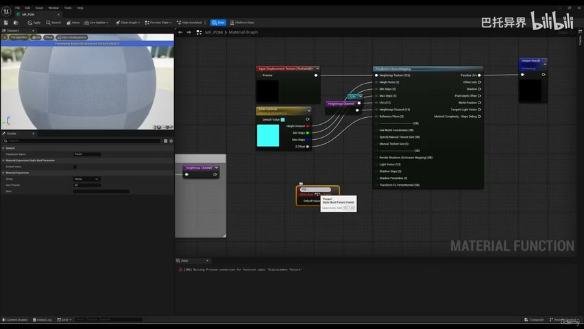
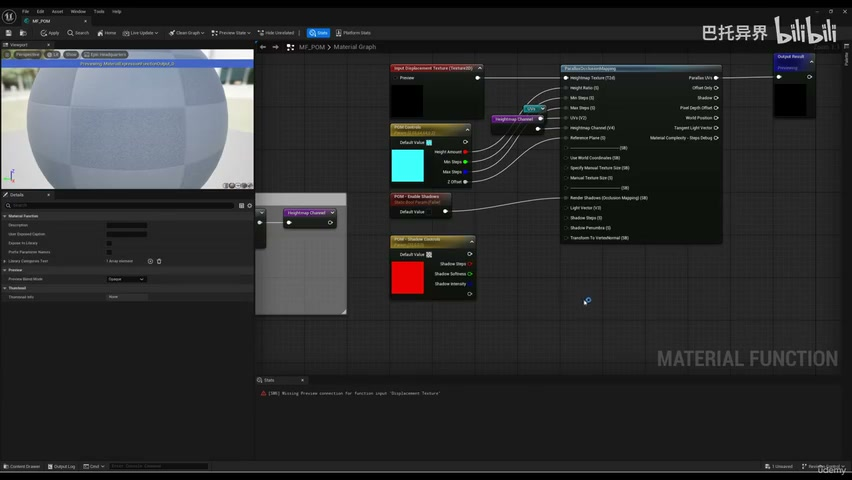

**参数、节点和风险点：**

- `Blueprint`
- `Material`
- `Instance`
- `shadow`
- `light`
- `default`
- `call`
- `shadows`
- `vector`
- `value`

### 调试高度图、视线方向和光照方向，让凹凸细节在动态光下更可信（3）

**内容要点：**

- 调试高度图、视线方向和光照方向，让凹凸细节在动态光下更可信（3）。

**关键截图：**

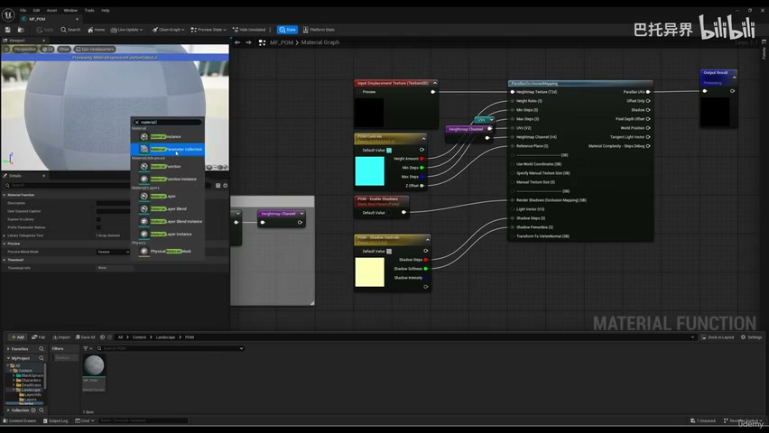
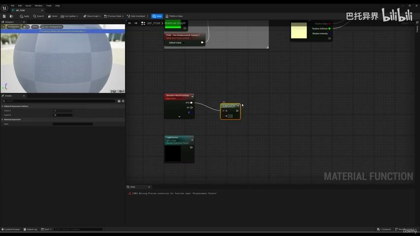

**参数、节点和风险点：**

- `Blueprint`
- `Component`
- `Graph`
- `Mask`
- `Material`
- `vector`
- `light`
- `parameter`
- `world`
- `position`

### 处理 POM 与法线、粗糙度、AO 的组合，避免只增加深度但材质反应不一致

**内容要点：**

- 处理 POM 与法线、粗糙度、AO 的组合，避免只增加深度但材质反应不一致。

**关键截图：**

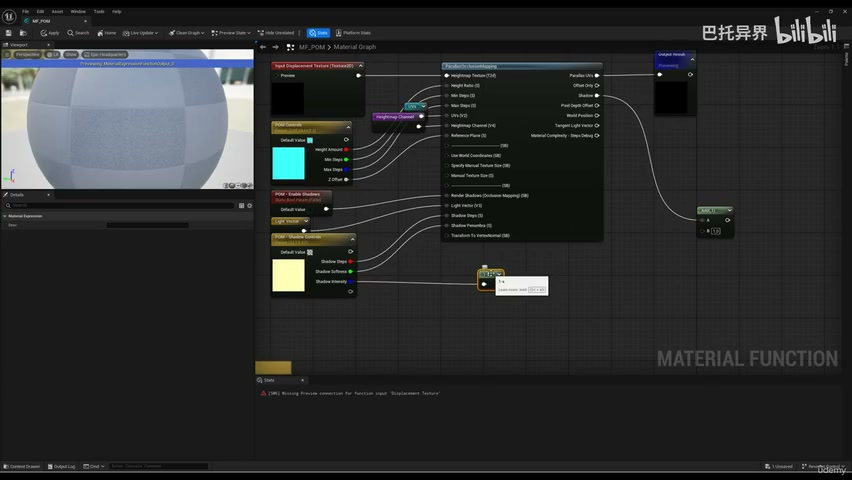
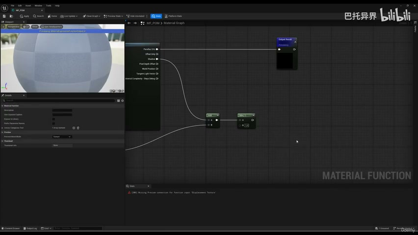

**参数、节点和风险点：**

- `Material`
- `Instance`
- `shadow`
- `intensity`
- `value`
- `parameter`
- `means`
- `static`
- `minus`
- `confused`

### 处理 POM 与法线、粗糙度、AO 的组合，避免只增加深度但材质反应不一致（2）

**内容要点：**

- 处理 POM 与法线、粗糙度、AO 的组合，避免只增加深度但材质反应不一致（2）。

**关键截图：**

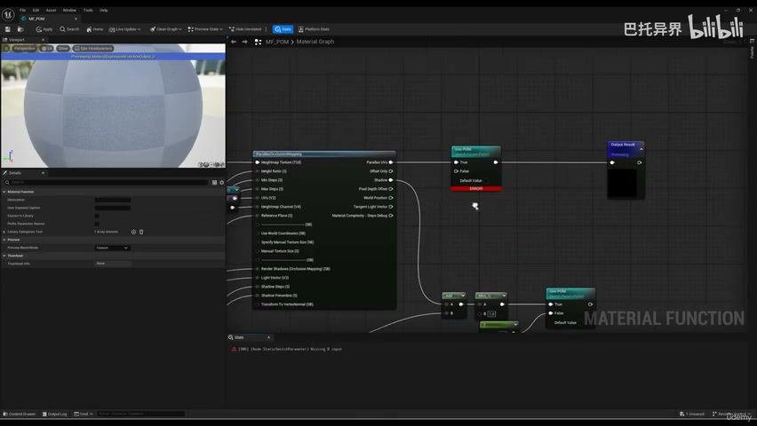
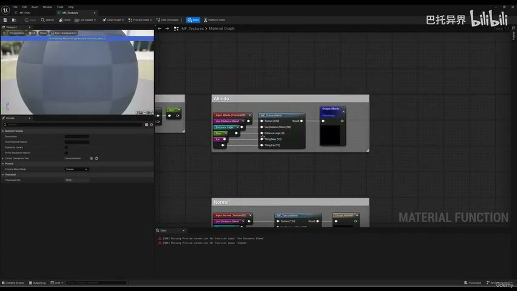

**参数、节点和风险点：**

- `Material`
- `Instance`
- `texture`
- `shadows`
- `near`
- `output`
- `straighten`
- `parallax`
- `occlusion`
- `Boom`

### 处理 POM 与法线、粗糙度、AO 的组合，避免只增加深度但材质反应不一致（3）

**内容要点：**

- 处理 POM 与法线、粗糙度、AO 的组合，避免只增加深度但材质反应不一致（3）。

**关键截图：**

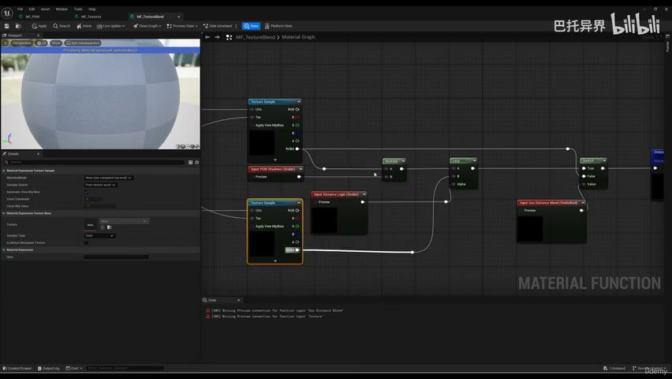
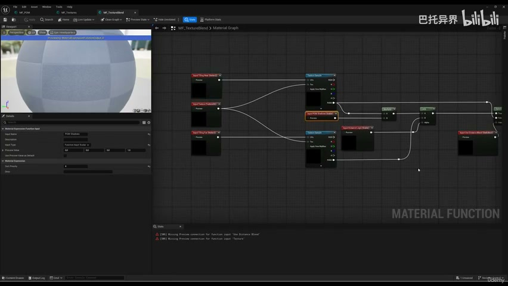

**参数、节点和风险点：**

- `Material`
- `Instance`
- `shadows`
- `input`
- `function`
- `material`
- `fine`
- `already`
- `call`

### 处理 POM 与法线、粗糙度、AO 的组合，避免只增加深度但材质反应不一致（4）

**内容要点：**

- 处理 POM 与法线、粗糙度、AO 的组合，避免只增加深度但材质反应不一致（4）。

**关键截图：**

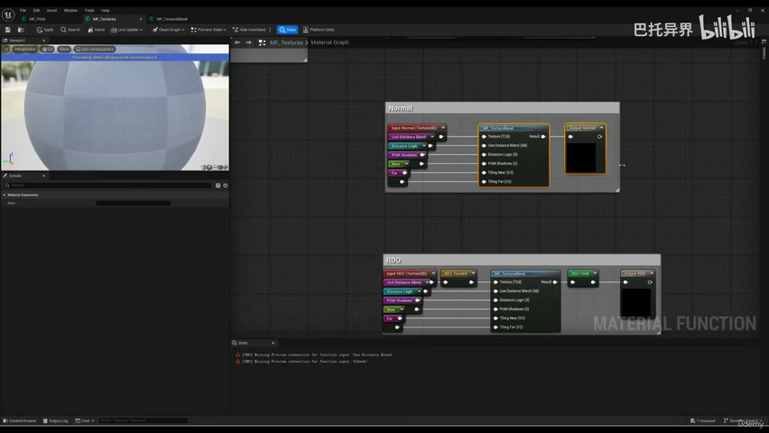
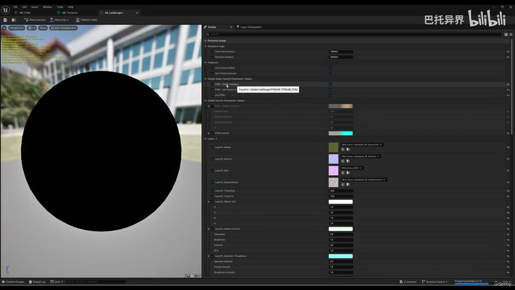

**参数、节点和风险点：**

- `Material`
- `Instance`
- `texture`
- `shadows`
- `displacement`
- `enable`
- `fine`
- `parameter`
- `sorry`

### 在不同视角和光照下观察伪影、边缘拉伸和性能

**内容要点：**

- 在不同视角和光照下观察伪影、边缘拉伸和性能。

**关键截图：**

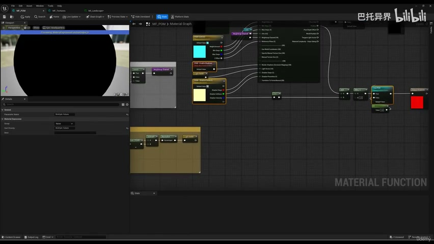
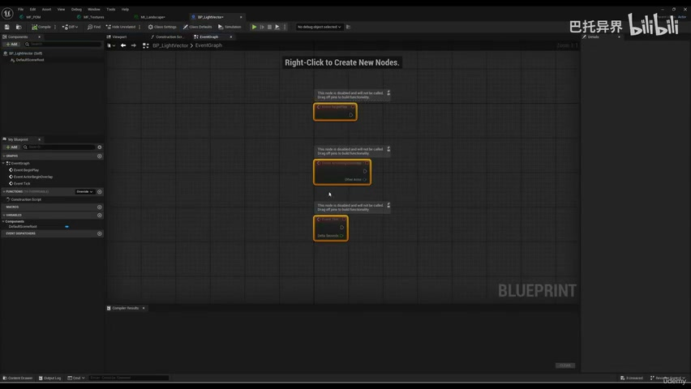

**参数、节点和风险点：**

- `Blueprint`
- `Actor`
- `Graph`
- `Material`
- `blueprint`
- `vector`
- `shadow`
- `shadows`
- `controls`
- `light`

### 在不同视角和光照下观察伪影、边缘拉伸和性能（2）

**内容要点：**

- 在不同视角和光照下观察伪影、边缘拉伸和性能（2）。

**关键截图：**

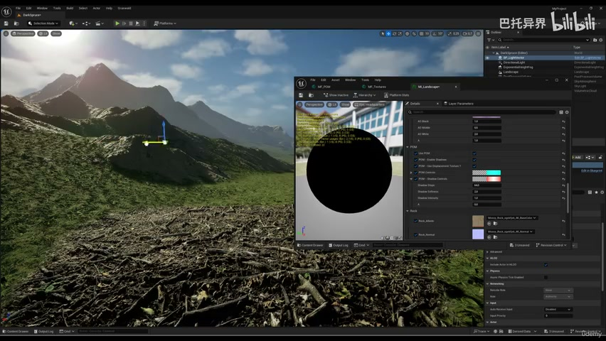
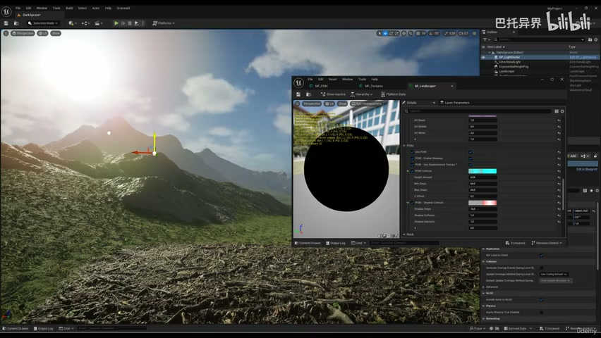

**参数、节点和风险点：**

- `Landscape`
- `shadow`
- `shadows`
- `intensity`
- `working`
- `keep`
- `displacement`
- `hour`
- `again`

### 在不同视角和光照下观察伪影、边缘拉伸和性能（3）

**内容要点：**

- 在不同视角和光照下观察伪影、边缘拉伸和性能（3）。

**关键截图：**

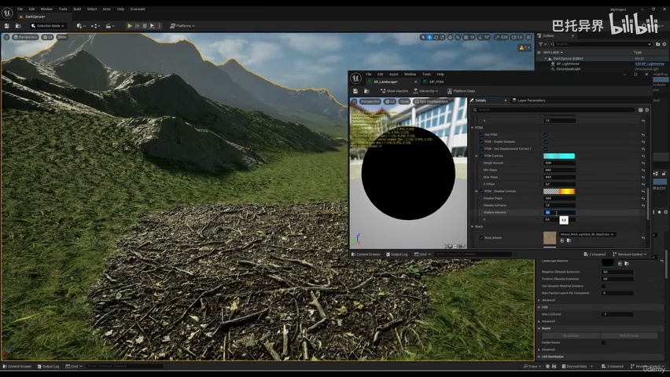
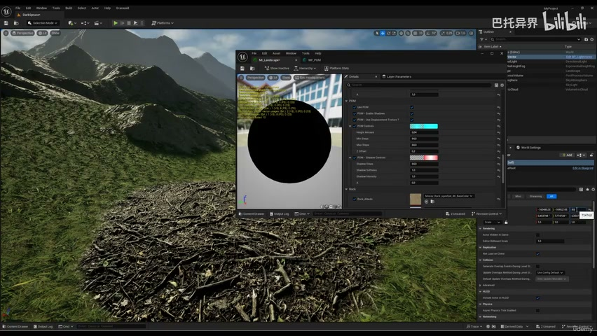

**参数、节点和风险点：**

- `shadow`
- `softness`
- `without`
- `good`
- `case`
- `displacement`
- `texture`
- `steps`
- `sharper`

## 复现检查清单

- POM 与光照增强要谨慎，伪位移不能破坏实际几何轮廓。
- 所有 UE5 资产都要检查比例、pivot、材质槽、贴图色彩空间和实例化性能。
- 复现时先固定随机种子，再调整密度、过滤和生成资源，避免随机结果掩盖逻辑错误。
