# 2-14 - Add Runtime Virtual Texture to the Landscape

## 知识目标

- 本文整理“2-14 - Add Runtime Virtual Texture to the Landscape”的 PCG 实操流程、关键节点、参数组织方式和复现风险点。

## 可复现主流程

- 启用 Runtime Virtual Texture，并在 Landscape 材质中输出颜色、法线、高度等需要的数据。
- 创建 RVT Volume，覆盖 Landscape 和需要参与混合的区域。
- 在地表材质中写入 RVT，在其他材质中读取 RVT 实现环境融合。
- 检查 RVT 分辨率、Volume 覆盖范围和刷新结果。

## 关键术语

- `PCG`
- `Mesh`
- `Attribute`
- `Actor`
- `Bounds`
- `Mask`
- `Material`
- `Instance`
- `Landscape`
- `texture`
- `virtual`
- `distance`
- `material`
- `landscape`
- `enable`
- `logic`

## 操作步骤与要点

### 启用 Runtime Virtual Texture，并在 Landscape 材质中输出颜色、法线、高度等需要的数据

**内容要点：**

- 启用 Runtime Virtual Texture，并在 Landscape 材质中输出颜色、法线、高度等需要的数据。

**关键截图：**

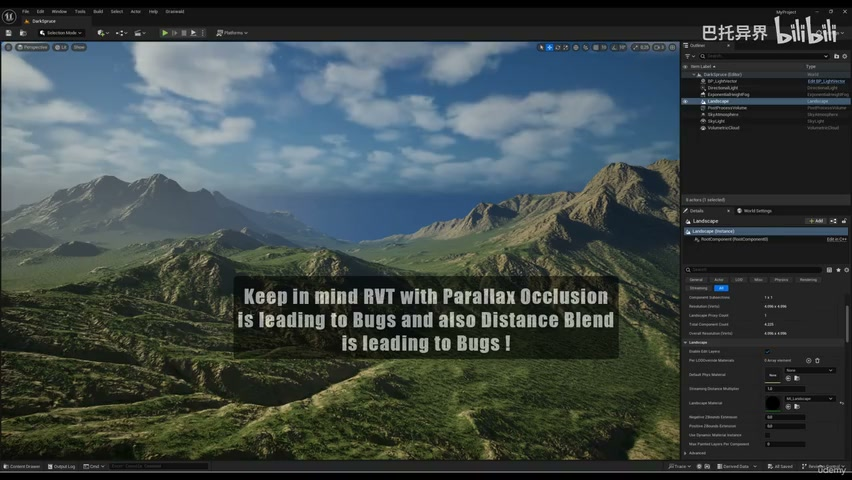
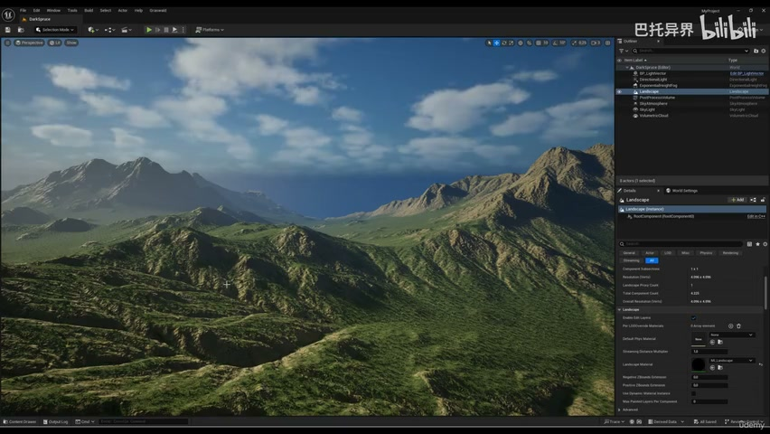

**参数、节点和风险点：**

- `PCG`
- `Mesh`
- `Mask`
- `Material`
- `Instance`
- `Landscape`
- `material`
- `landscape`
- `texture`
- `virtual`

### 启用 Runtime Virtual Texture，并在 Landscape 材质中输出颜色、法线、高度等需要的数据（2）

**内容要点：**

- 启用 Runtime Virtual Texture，并在 Landscape 材质中输出颜色、法线、高度等需要的数据（2）。

**关键截图：**

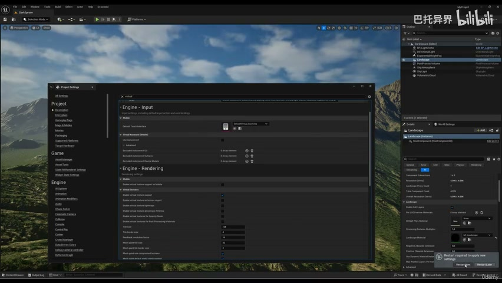
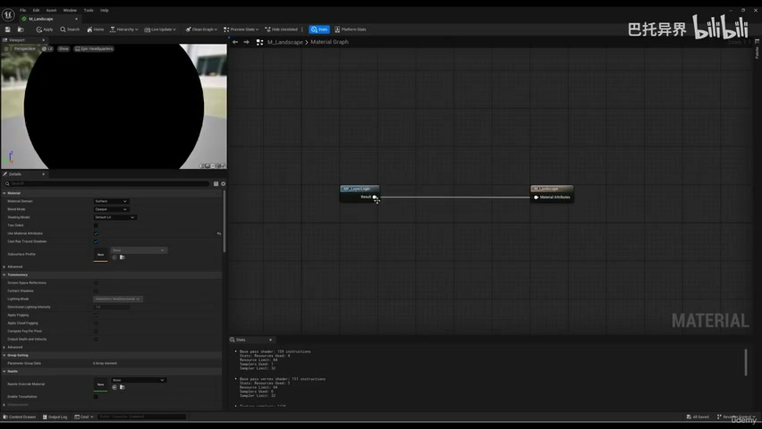

**参数、节点和风险点：**

- `Mesh`
- `Attribute`
- `Mask`
- `Material`
- `Instance`
- `Landscape`
- `material`
- `virtual`
- `shadow`
- `world`

### 创建 RVT Volume，覆盖 Landscape 和需要参与混合的区域

**内容要点：**

- 创建 RVT Volume，覆盖 Landscape 和需要参与混合的区域。

**关键截图：**

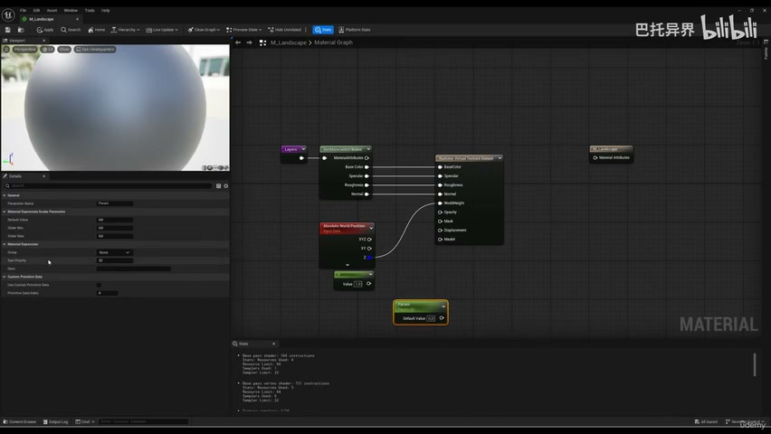
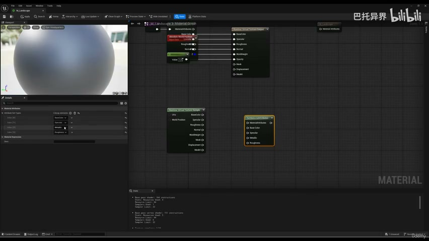

**参数、节点和风险点：**

- `Attribute`
- `Actor`
- `Material`
- `Instance`
- `Landscape`
- `material`
- `virtual`
- `texture`
- `landscape`
- `would`

### 创建 RVT Volume，覆盖 Landscape 和需要参与混合的区域（2）

**内容要点：**

- 创建 RVT Volume，覆盖 Landscape 和需要参与混合的区域（2）。

**关键截图：**

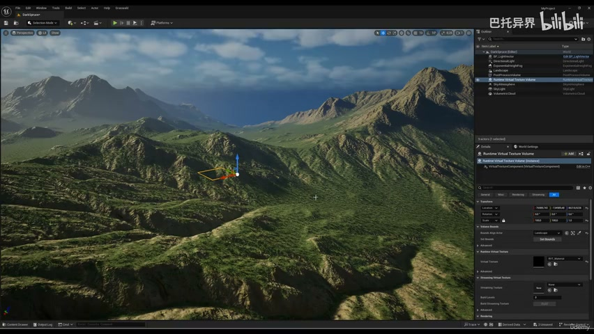
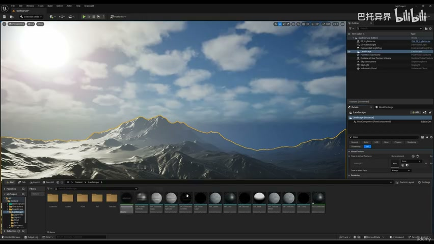

**参数、节点和风险点：**

- `Actor`
- `Bounds`
- `Material`
- `Instance`
- `Landscape`
- `texture`
- `logic`
- `virtual`
- `distance`
- `enable`

### 在地表材质中写入 RVT，在其他材质中读取 RVT 实现环境融合

**内容要点：**

- 在地表材质中写入 RVT，在其他材质中读取 RVT 实现环境融合。

**关键截图：**

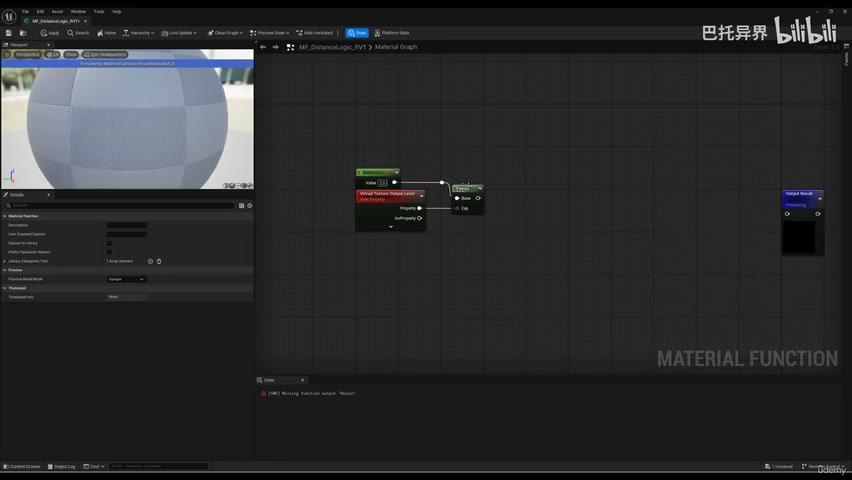
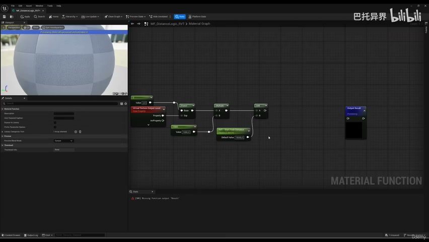

**参数、节点和风险点：**

- `Material`
- `Landscape`
- `fade`
- `distance`
- `would`
- `minus`
- `value`
- `constant`
- `parameter`
- `scalar`

### 在地表材质中写入 RVT，在其他材质中读取 RVT 实现环境融合（2）

**内容要点：**

- 在地表材质中写入 RVT，在其他材质中读取 RVT 实现环境融合（2）。

**关键截图：**

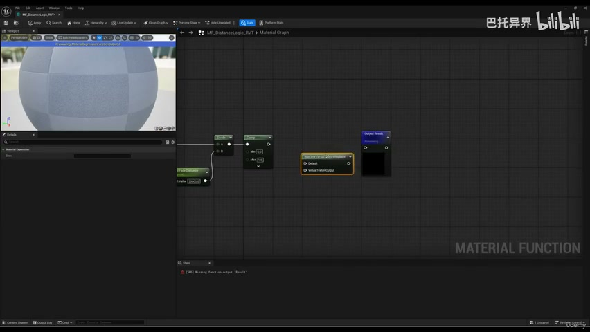
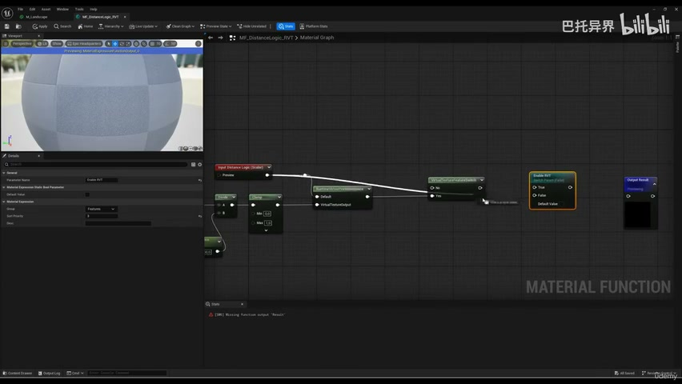

**参数、节点和风险点：**

- `Material`
- `Landscape`
- `distance`
- `logic`
- `virtual`
- `texture`
- `switch`
- `default`
- `course`
- `runtime`

### 检查 RVT 分辨率、Volume 覆盖范围和刷新结果

**内容要点：**

- 检查 RVT 分辨率、Volume 覆盖范围和刷新结果。

**关键截图：**

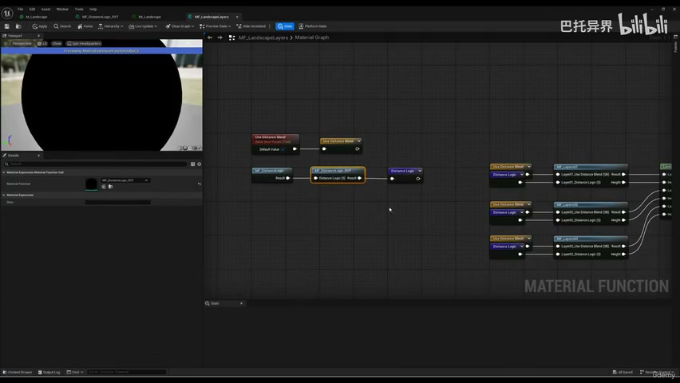
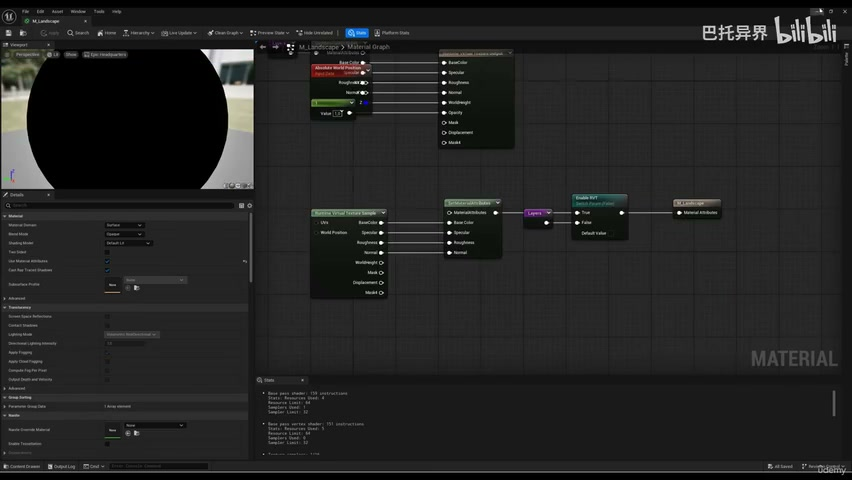

**参数、节点和风险点：**

- `Material`
- `Landscape`
- `distance`
- `logic`
- `texture`
- `enable`
- `fade`
- `save`
- `getting`
- `between`

## 复现检查清单

- RVT Volume 覆盖范围和材质写入设置错误时，读取材质会完全没有混合数据。
- 所有 UE5 资产都要检查比例、pivot、材质槽、贴图色彩空间和实例化性能。
- 复现时先固定随机种子，再调整密度、过滤和生成资源，避免随机结果掩盖逻辑错误。
