# 3-3 - Import Spline into Unreal Engine 5

## 知识目标

- 本文整理“3-3 - Import Spline into Unreal Engine 5”的 PCG 实操流程、关键节点、参数组织方式和复现风险点。

## 可复现主流程

- 将样条 Mesh、贴图和材质导入 UE5，检查比例、pivot、forward axis 和碰撞。
- 创建材质实例，接入纹理、RVT 混合和必要的位移/视差逻辑。
- 把 Mesh 放入测试 Spline，确认弯曲、UV 和边缘融合都正确。
- 整理资产目录，为后续 PCG Spline Path 或手工样条铺设做准备。

## 关键术语

- `Static Mesh`
- `Mesh`
- `Spline`
- `Transform`
- `Point`
- `Mask`
- `Material`
- `Instance`
- `Landscape`

## 操作步骤与要点

### 将样条 Mesh、贴图和材质导入 UE5，检查比例、pivot、forward axis 和碰撞

**内容要点：**

- 将样条 Mesh、贴图和材质导入 UE5，检查比例、pivot、forward axis 和碰撞。

**关键截图：**

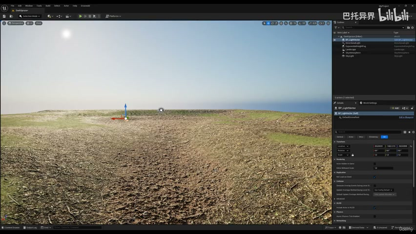
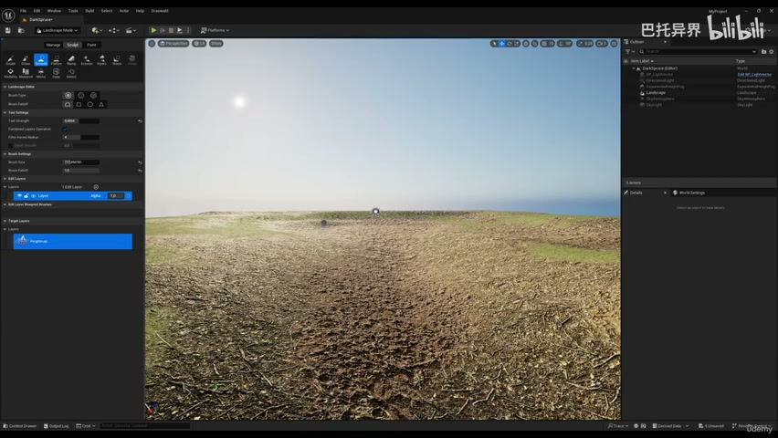

**参数、节点和风险点：**

- `Material`
- `Landscape`
- `landscape`
- `small`
- `material`
- `path`
- `project`
- `complete`
- `case`

### 将样条 Mesh、贴图和材质导入 UE5，检查比例、pivot、forward axis 和碰撞（2）

**内容要点：**

- 将样条 Mesh、贴图和材质导入 UE5，检查比例、pivot、forward axis 和碰撞（2）。

**关键截图：**

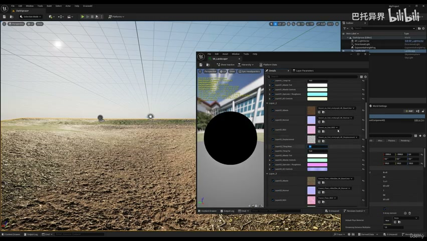
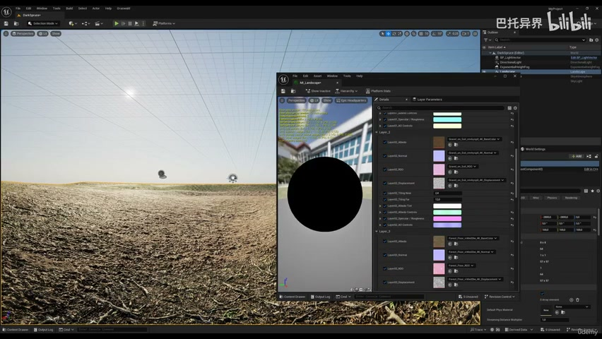

**参数、节点和风险点：**

- `grass`
- `textures`

### 将样条 Mesh、贴图和材质导入 UE5，检查比例、pivot、forward axis 和碰撞（3）

**内容要点：**

- 将样条 Mesh、贴图和材质导入 UE5，检查比例、pivot、forward axis 和碰撞（3）。

**关键截图：**

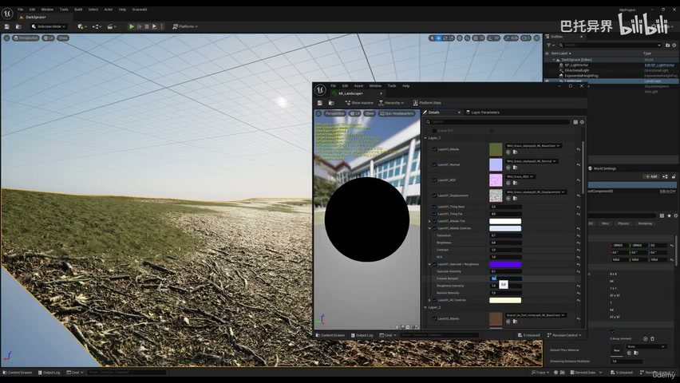
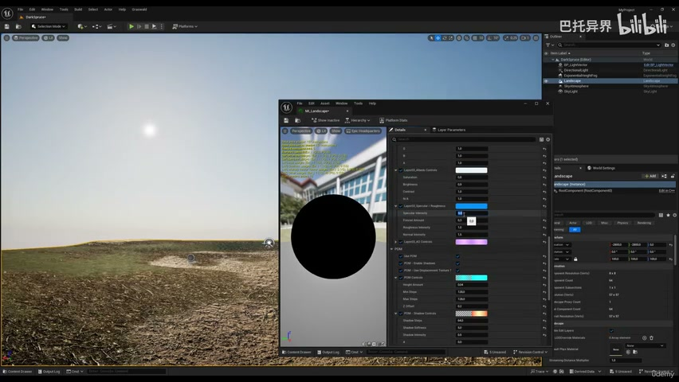

**参数、节点和风险点：**

- `Material`
- `intensity`
- `parallax`
- `occlusion`
- `near`
- `distance`
- `Fresnel`
- `Roughness`
- `Normal`
- `better`

### 将样条 Mesh、贴图和材质导入 UE5，检查比例、pivot、forward axis 和碰撞（4）

**内容要点：**

- 将样条 Mesh、贴图和材质导入 UE5，检查比例、pivot、forward axis 和碰撞（4）。

**关键截图：**

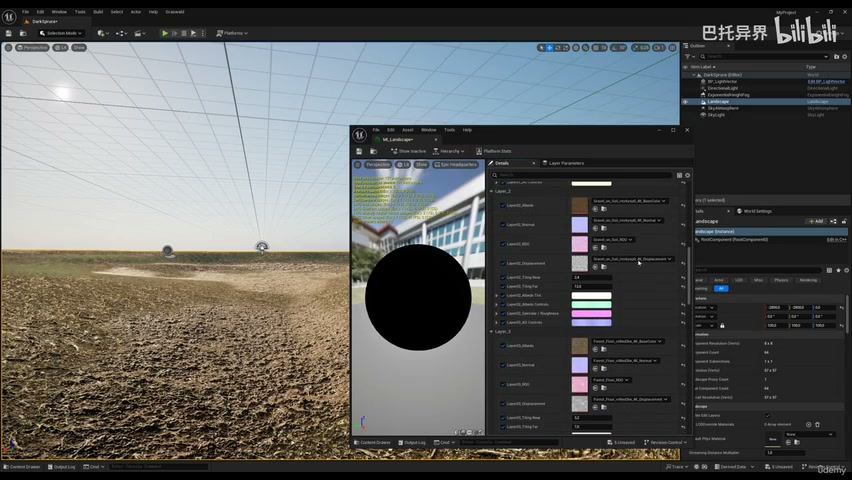
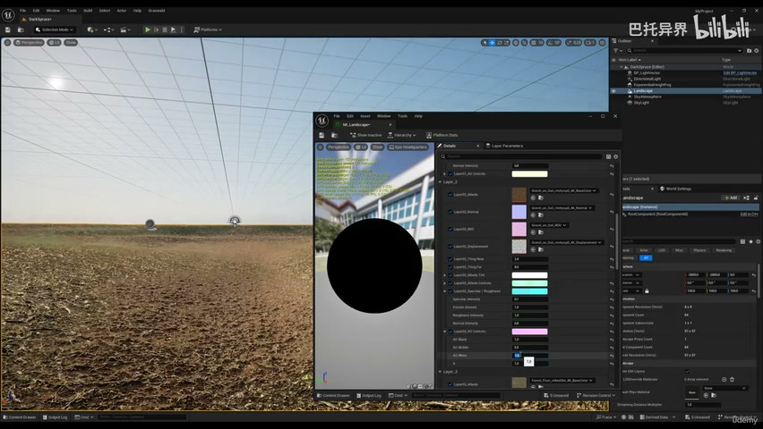

**参数、节点和风险点：**

- `good`
- `always`
- `already`
- `distance`
- `intensity`
- `white`
- `second`
- `layer`
- `soil`
- `doesn`

### 创建材质实例，接入纹理、RVT 混合和必要的位移/视差逻辑

**内容要点：**

- 创建材质实例，接入纹理、RVT 混合和必要的位移/视差逻辑。

**关键截图：**

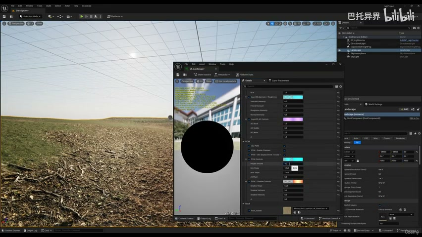
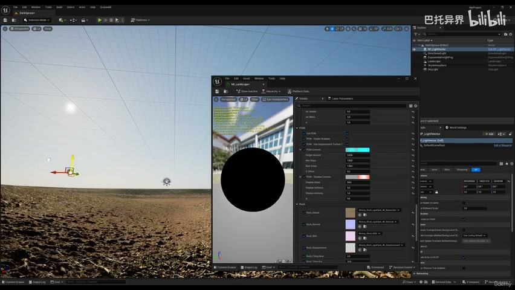

**参数、节点和风险点：**

- `Landscape`
- `shadow`
- `light`
- `vector`
- `shadows`
- `depends`
- `texture`
- `tiling`
- `already`

### 创建材质实例，接入纹理、RVT 混合和必要的位移/视差逻辑（2）

**内容要点：**

- 创建材质实例，接入纹理、RVT 混合和必要的位移/视差逻辑（2）。

**关键截图：**

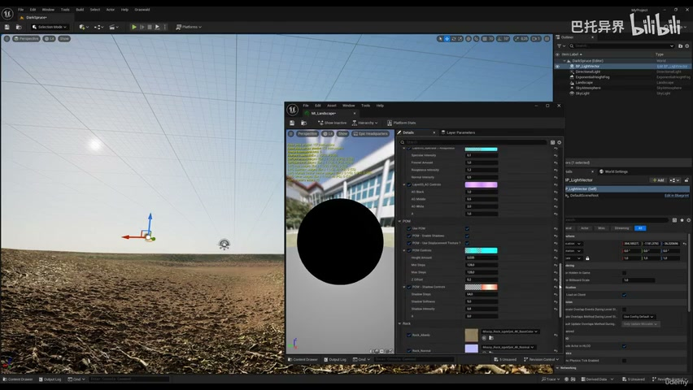
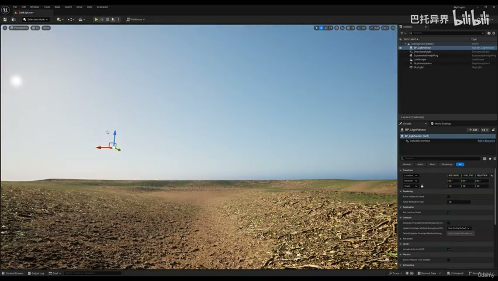

**参数、节点和风险点：**

- `Material`
- `more`
- `view`
- `move`
- `light`
- `vector`

### 创建材质实例，接入纹理、RVT 混合和必要的位移/视差逻辑（3）

**内容要点：**

- 创建材质实例，接入纹理、RVT 混合和必要的位移/视差逻辑（3）。

**关键截图：**

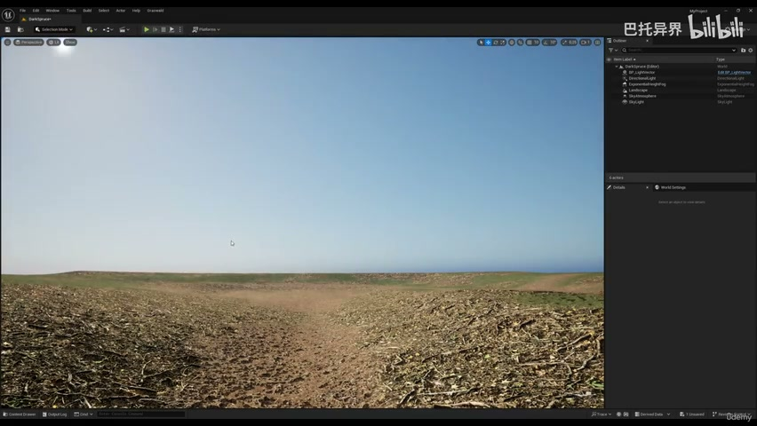
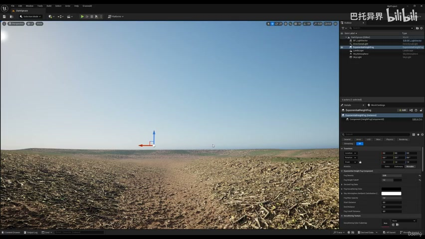

**参数、节点和风险点：**

- `Material`
- `mean`
- `always`
- `good`
- `important`
- `lighting`
- `change`
- `think`

### 创建材质实例，接入纹理、RVT 混合和必要的位移/视差逻辑（4）

**内容要点：**

- 创建材质实例，接入纹理、RVT 混合和必要的位移/视差逻辑（4）。

**关键截图：**

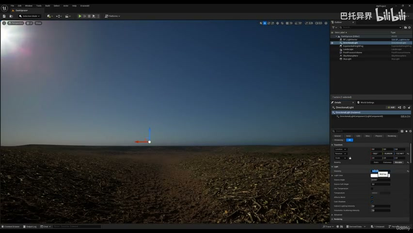
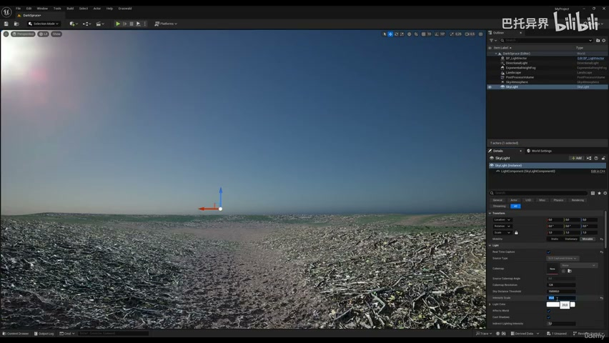

**参数、节点和风险点：**

- `Material`
- `skylight`
- `light`
- `direction`
- `lighting`
- `important`
- `difference`
- `course`

### 把 Mesh 放入测试 Spline，确认弯曲、UV 和边缘融合都正确

**内容要点：**

- 把 Mesh 放入测试 Spline，确认弯曲、UV 和边缘融合都正确。

**关键截图：**

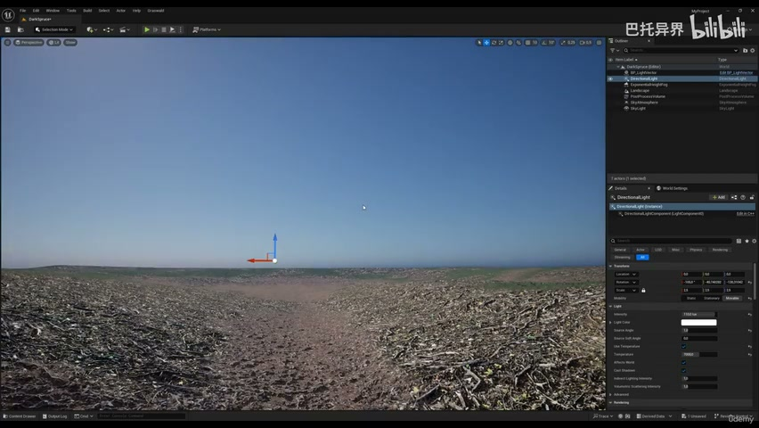
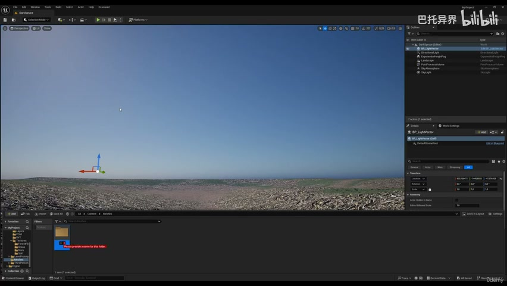

**参数、节点和风险点：**

- `Static Mesh`
- `Mesh`
- `Spline`
- `Material`
- `mesh`
- `import`
- `spline`
- `delete`
- `folder`
- `light`

### 把 Mesh 放入测试 Spline，确认弯曲、UV 和边缘融合都正确（2）

**内容要点：**

- 把 Mesh 放入测试 Spline，确认弯曲、UV 和边缘融合都正确（2）。

**关键截图：**

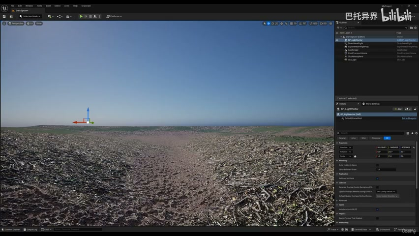
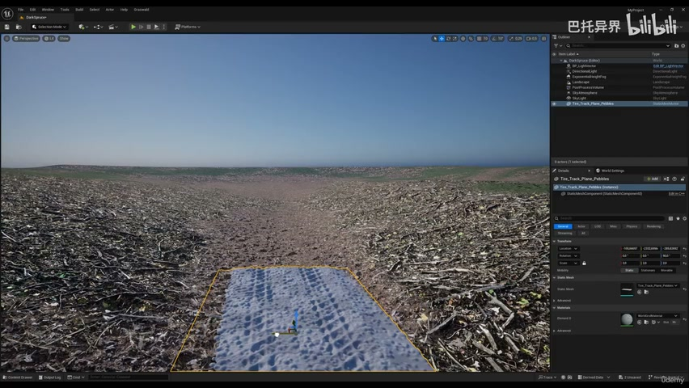

**参数、节点和风险点：**

- `Spline`
- `Landscape`
- `displacement`
- `think`
- `spline`
- `landscape`
- `scale`
- `reference`
- `nice`
- `fine`

### 把 Mesh 放入测试 Spline，确认弯曲、UV 和边缘融合都正确（3）

**内容要点：**

- 把 Mesh 放入测试 Spline，确认弯曲、UV 和边缘融合都正确（3）。

**关键截图：**

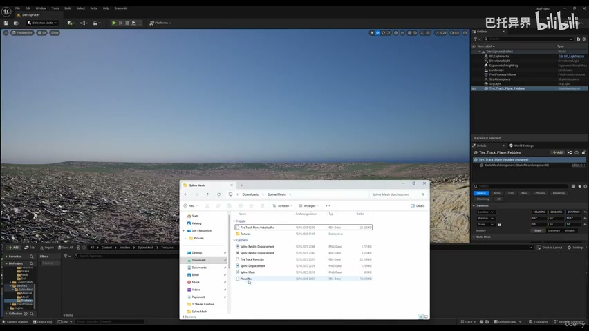
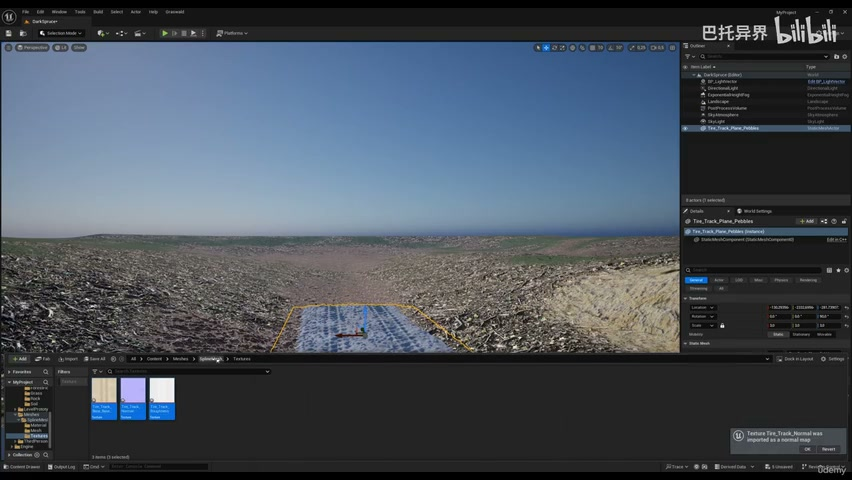

**参数、节点和风险点：**

- `Spline`
- `Mask`
- `Material`
- `mask`
- `textures`
- `base`
- `apply`
- `texture`
- `spline`
- `track`

### 把 Mesh 放入测试 Spline，确认弯曲、UV 和边缘融合都正确（4）

**内容要点：**

- 把 Mesh 放入测试 Spline，确认弯曲、UV 和边缘融合都正确（4）。

**关键截图：**

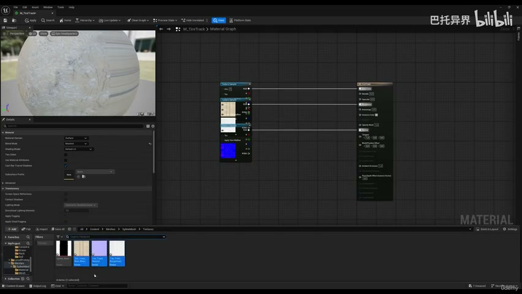
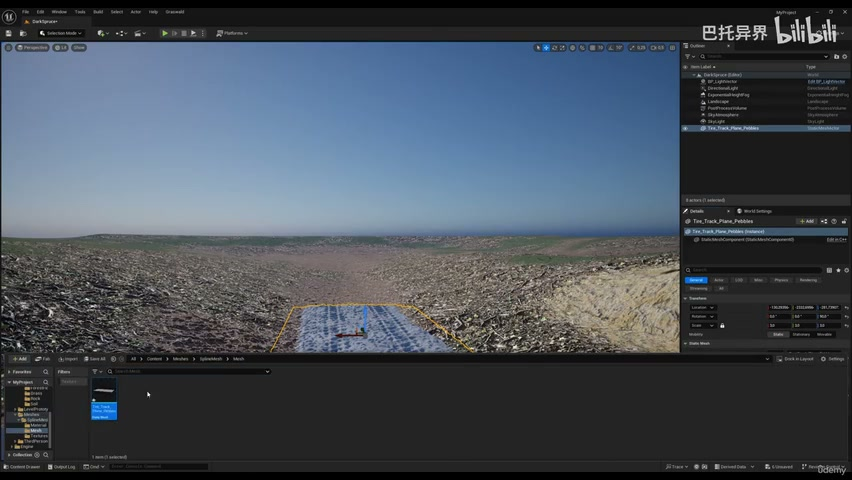

**参数、节点和风险点：**

- `Mesh`
- `Spline`
- `Mask`
- `Material`
- `Landscape`
- `mask`
- `bright`
- `swap`
- `textures`
- `boom`

### 整理资产目录，为后续 PCG Spline Path 或手工样条铺设做准备

**内容要点：**

- 整理资产目录，为后续 PCG Spline Path 或手工样条铺设做准备。

**关键截图：**

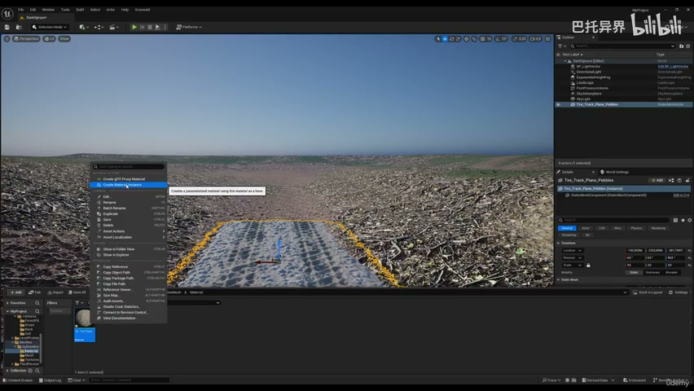
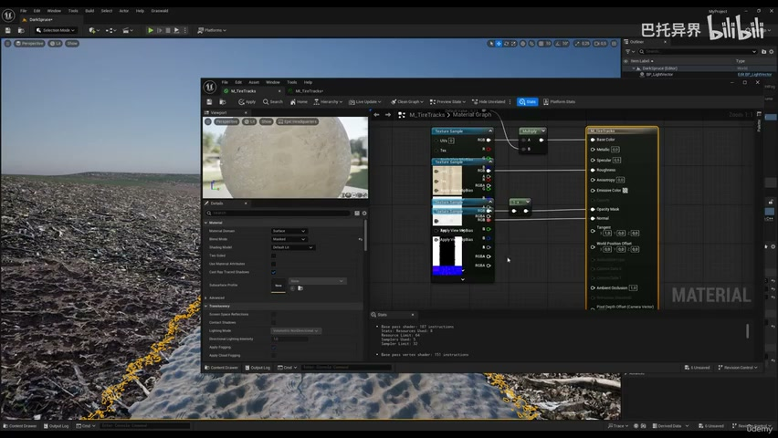

**参数、节点和风险点：**

- `Point`
- `Material`
- `Instance`
- `brightness`
- `tire`
- `tracks`
- `material`
- `instance`
- `open`
- `saturation`

### 整理资产目录，为后续 PCG Spline Path 或手工样条铺设做准备（2）

**内容要点：**

- 整理资产目录，为后续 PCG Spline Path 或手工样条铺设做准备（2）。

**关键截图：**

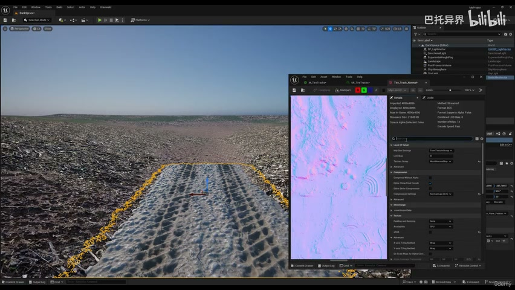
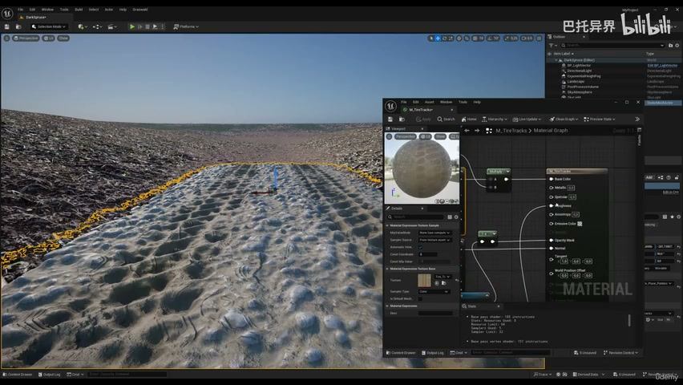

**参数、节点和风险点：**

- `Transform`
- `Material`
- `always`
- `specular`
- `call`
- `darken`
- `sure`
- `green`
- `channel`
- `correct`

### 整理资产目录，为后续 PCG Spline Path 或手工样条铺设做准备（3）

**内容要点：**

- 整理资产目录，为后续 PCG Spline Path 或手工样条铺设做准备（3）。

**关键截图：**

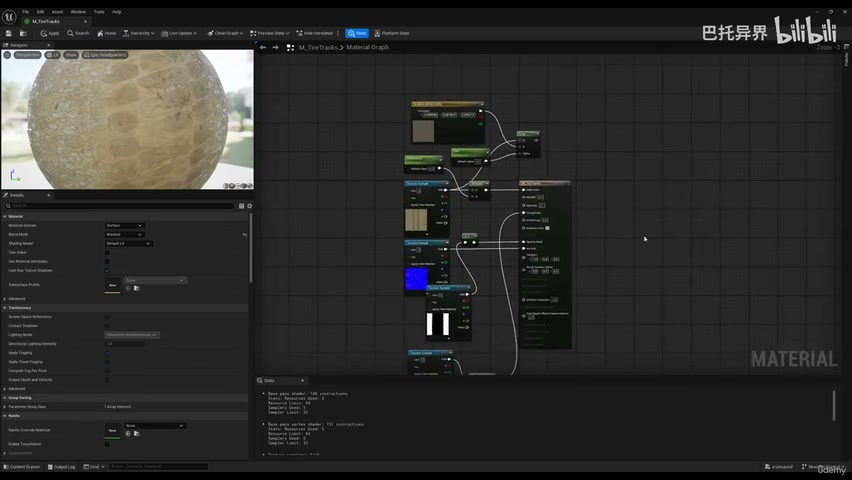
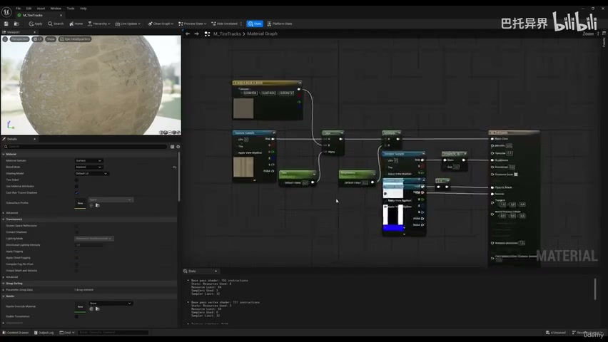

**参数、节点和风险点：**

- `Material`
- `Instance`
- `after`
- `first`
- `annoying`
- `Tint`
- `adjust`
- `brightness`
- `open`

### 整理资产目录，为后续 PCG Spline Path 或手工样条铺设做准备（4）

**内容要点：**

- 整理资产目录，为后续 PCG Spline Path 或手工样条铺设做准备（4）。

**关键截图：**

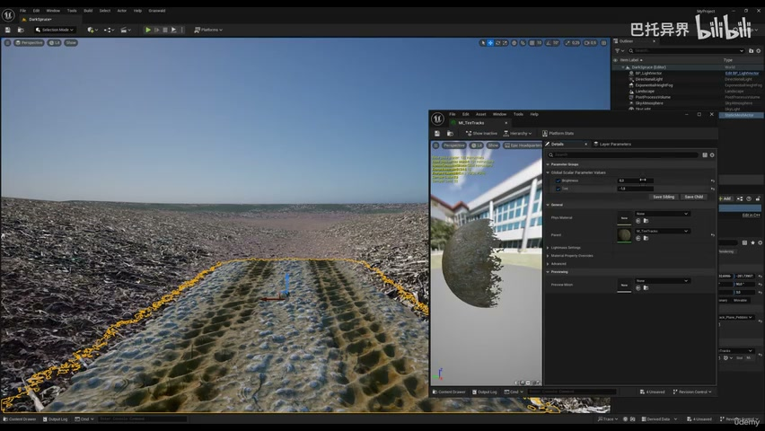
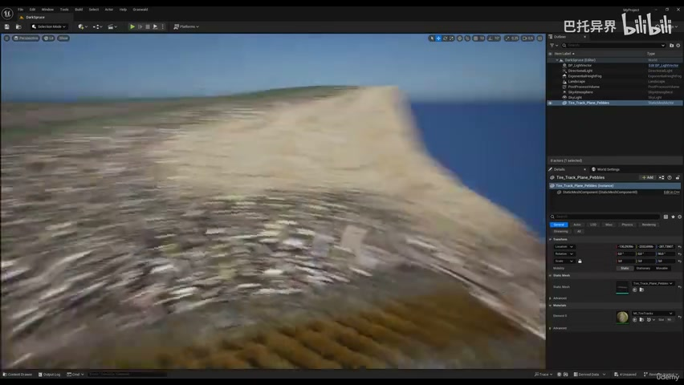

**参数、节点和风险点：**

- `Mesh`
- `Spline`
- `Mask`
- `Material`
- `Landscape`
- `more`
- `vibrance`
- `giving`
- `texture`
- `spline`

## 复现检查清单

- 导入阶段要特别检查 forward axis、UV 拉伸和 Spline Mesh 拉伸设置。
- 所有 UE5 资产都要检查比例、pivot、材质槽、贴图色彩空间和实例化性能。
- 复现时先固定随机种子，再调整密度、过滤和生成资源，避免随机结果掩盖逻辑错误。
