# 3-4 - Create Spline in Unreal Engine 5

## 知识目标

- 本文整理“3-4 - Create Spline in Unreal Engine 5”的 PCG 实操流程、关键节点、参数组织方式和复现风险点。

## 可复现主流程

- 在 UE5 中创建 Spline Actor 或 Blueprint，用样条点定义道路、溪流或路径走向。
- 沿样条生成 Spline Mesh，控制分段、宽度、切线和对地形投射。
- 接入材质、RVT 混合和边缘过渡，让样条对象嵌入 Landscape。
- 调整样条点，验证路径转弯、坡度和端点处理是否稳定。

## 关键术语

- `Mesh`
- `Spline`
- `Point`
- `Component`
- `Mask`
- `Material`
- `Instance`
- `Landscape`
- `material`
- `mesh`
- `segments`
- `landscape`

## 操作步骤与要点

### 在 UE5 中创建 Spline Actor 或 Blueprint，用样条点定义道路、溪流或路径走向

**内容要点：**

- 在 UE5 中创建 Spline Actor 或 Blueprint，用样条点定义道路、溪流或路径走向。

**关键截图：**

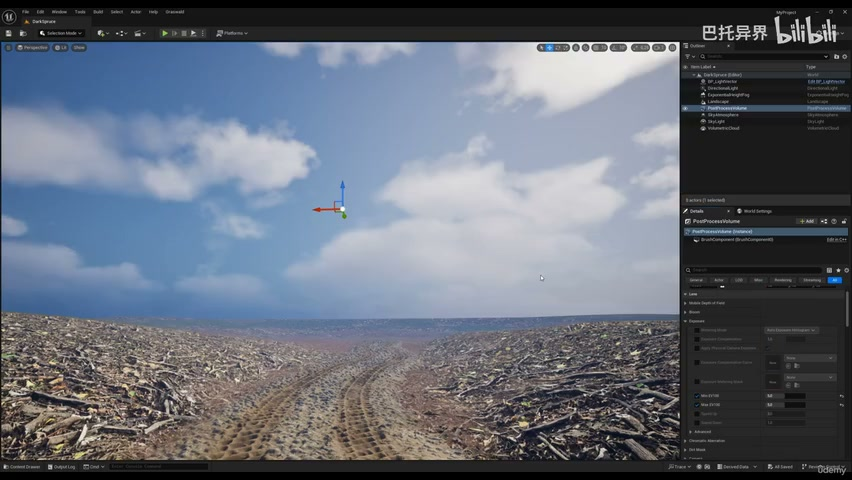
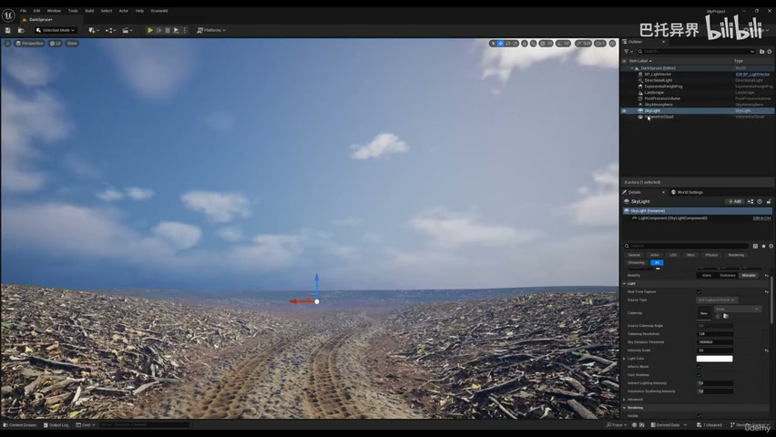

**参数、节点和风险点：**

- `Mesh`
- `Spline`
- `Component`
- `Material`
- `Landscape`
- `material`
- `spline`
- `landscape`
- `fine`
- `mesh`

### 在 UE5 中创建 Spline Actor 或 Blueprint，用样条点定义道路、溪流或路径走向（2）

**内容要点：**

- 在 UE5 中创建 Spline Actor 或 Blueprint，用样条点定义道路、溪流或路径走向（2）。

**关键截图：**

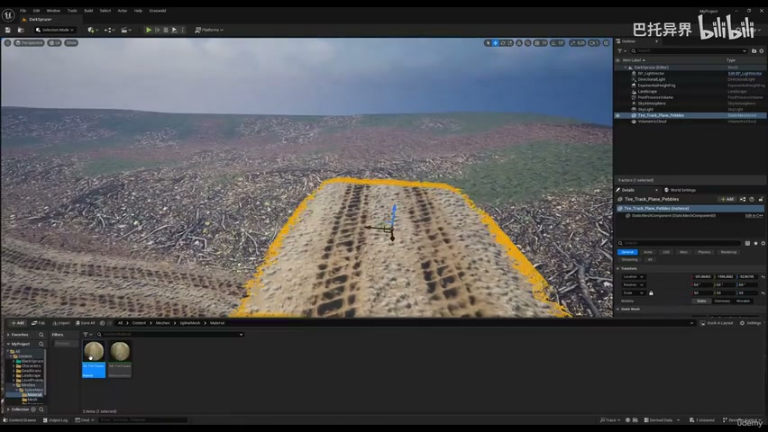
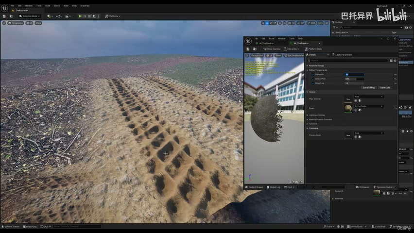

**参数、节点和风险点：**

- `Mesh`
- `Spline`
- `Point`
- `Mask`
- `Material`
- `Instance`
- `material`
- `dither`
- `blending`
- `offset`

### 在 UE5 中创建 Spline Actor 或 Blueprint，用样条点定义道路、溪流或路径走向（3）

**内容要点：**

- 在 UE5 中创建 Spline Actor 或 Blueprint，用样条点定义道路、溪流或路径走向（3）。

**关键截图：**

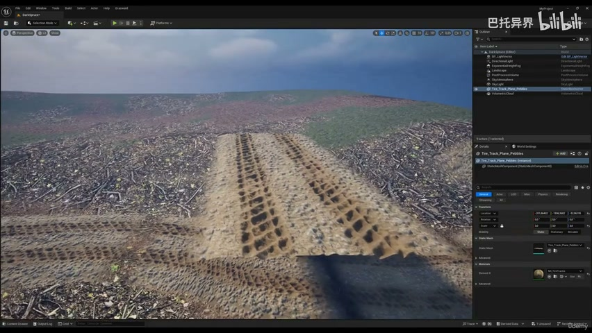
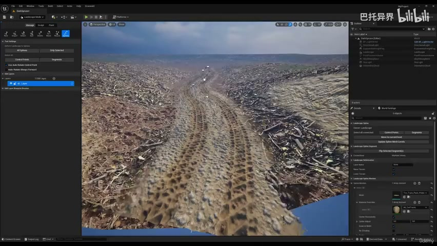

**参数、节点和风险点：**

- `Mesh`
- `Spline`
- `Point`
- `Mask`
- `Material`
- `Landscape`
- `mesh`
- `spline`
- `material`
- `control`

### 沿样条生成 Spline Mesh，控制分段、宽度、切线和对地形投射

**内容要点：**

- 沿样条生成 Spline Mesh，控制分段、宽度、切线和对地形投射。

**关键截图：**

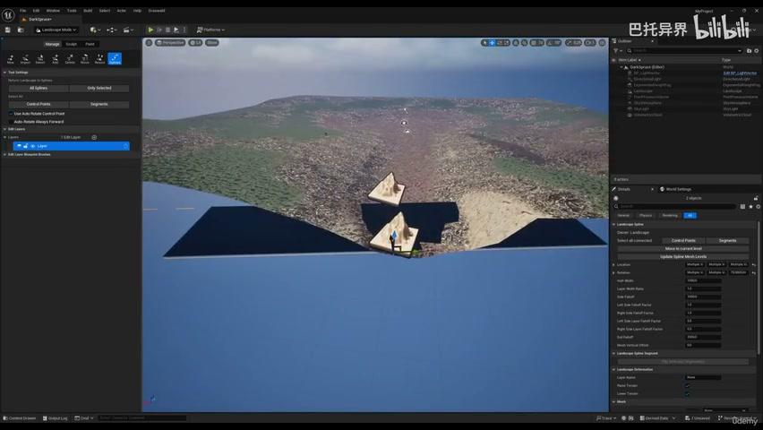
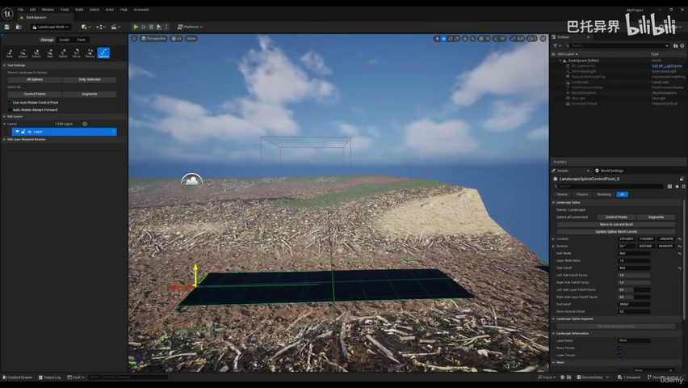

**参数、节点和风险点：**

- `Mesh`
- `down`
- `more`
- `rotate`

### 沿样条生成 Spline Mesh，控制分段、宽度、切线和对地形投射（2）

**内容要点：**

- 沿样条生成 Spline Mesh，控制分段、宽度、切线和对地形投射（2）。

**关键截图：**

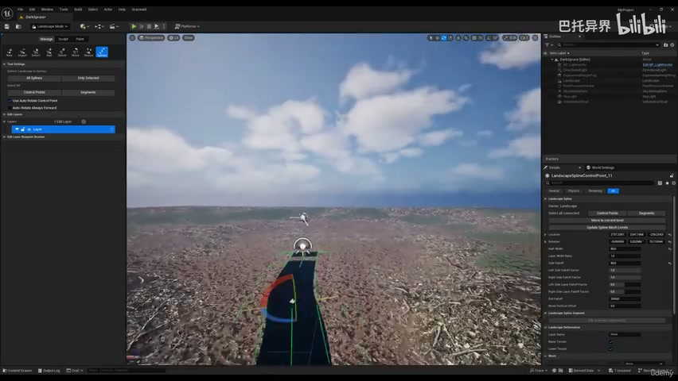
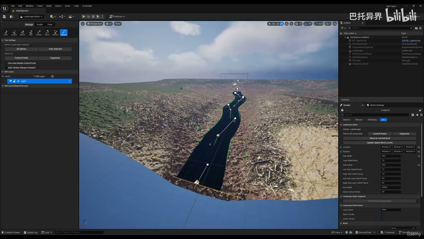

**参数、节点和风险点：**

- `Mesh`
- `Spline`
- `Point`
- `Material`
- `Landscape`
- `segments`
- `control`
- `points`
- `selected`
- `mesh`

### 沿样条生成 Spline Mesh，控制分段、宽度、切线和对地形投射（3）

**内容要点：**

- 沿样条生成 Spline Mesh，控制分段、宽度、切线和对地形投射（3）。

**关键截图：**

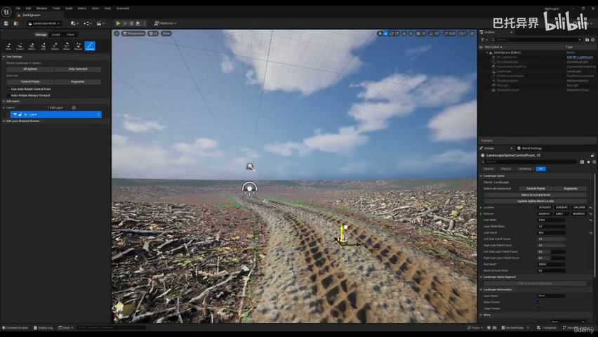
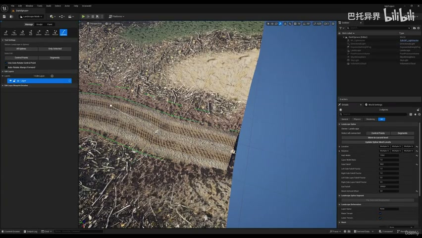

**参数、节点和风险点：**

- `Mesh`
- `Spline`
- `Point`
- `Material`
- `Instance`
- `Landscape`
- `material`
- `sure`
- `segments`
- `segment`

### 接入材质、RVT 混合和边缘过渡，让样条对象嵌入 Landscape

**内容要点：**

- 接入材质、RVT 混合和边缘过渡，让样条对象嵌入 Landscape。

**关键截图：**

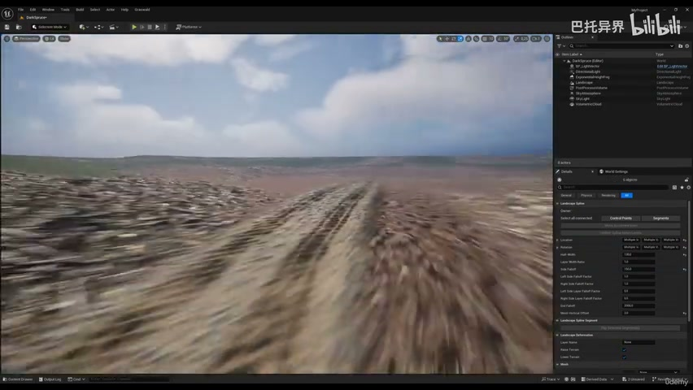
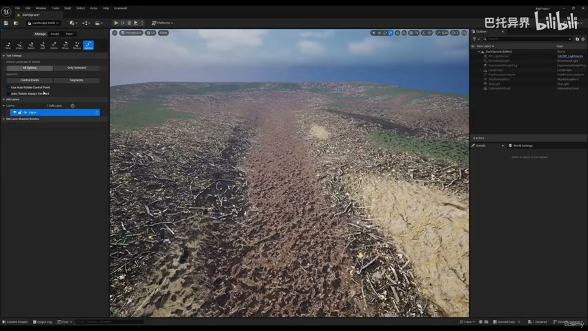

**参数、节点和风险点：**

- `Mesh`
- `Spline`
- `Point`
- `Material`
- `Landscape`
- `mesh`
- `segments`
- `control`
- `sure`
- `accordingly`

### 接入材质、RVT 混合和边缘过渡，让样条对象嵌入 Landscape（2）

**内容要点：**

- 接入材质、RVT 混合和边缘过渡，让样条对象嵌入 Landscape（2）。

**关键截图：**

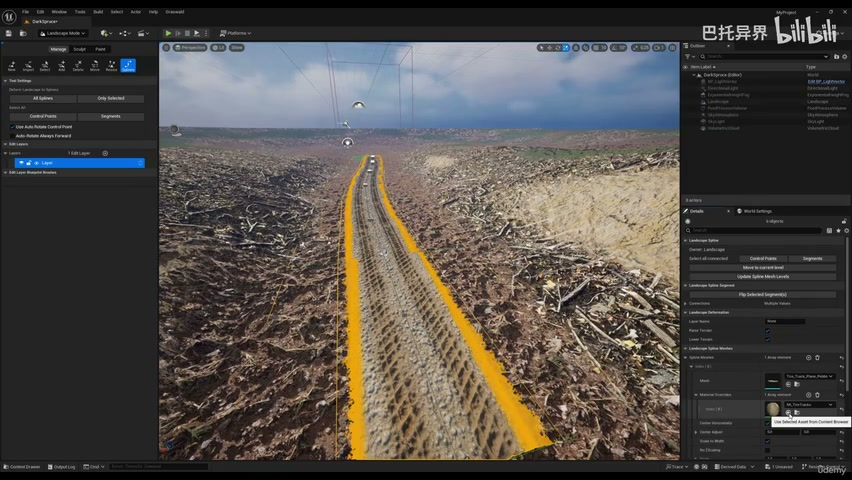
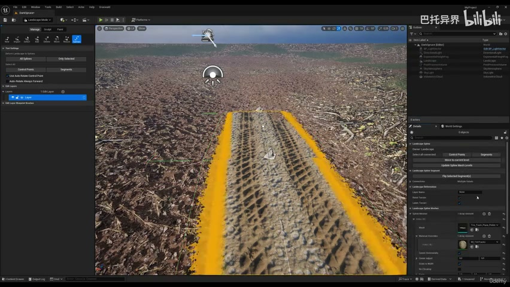

**参数、节点和风险点：**

- `Mesh`
- `Spline`
- `Point`
- `Material`
- `Landscape`
- `segments`
- `mesh`
- `sure`
- `control`
- `points`

### 接入材质、RVT 混合和边缘过渡，让样条对象嵌入 Landscape（3）

**内容要点：**

- 接入材质、RVT 混合和边缘过渡，让样条对象嵌入 Landscape（3）。

**关键截图：**

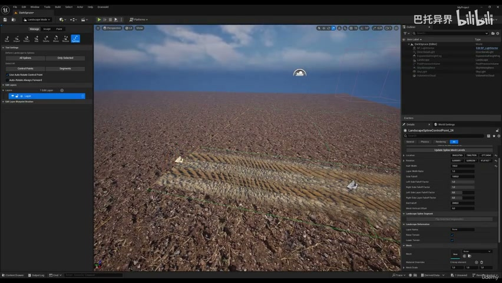
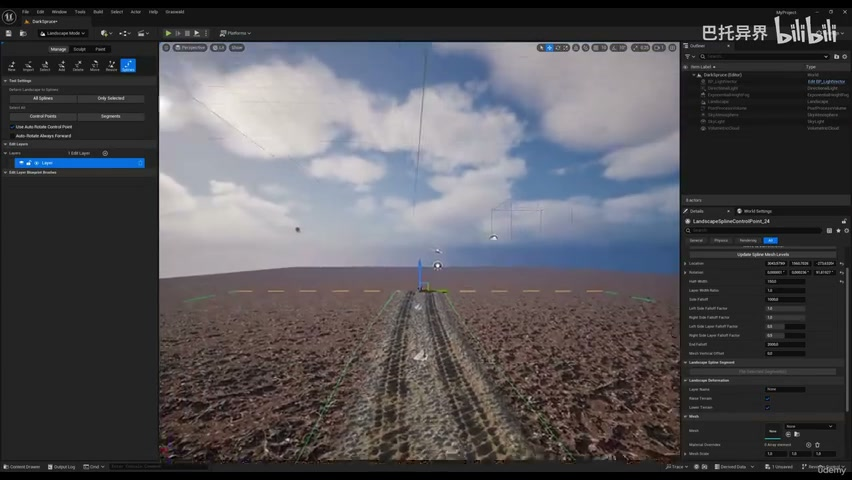

**参数、节点和风险点：**

- `Spline`
- `Landscape`
- `landscape`
- `line`
- `blend`
- `perfectly`
- `selected`
- `means`

### 调整样条点，验证路径转弯、坡度和端点处理是否稳定

**内容要点：**

- 调整样条点，验证路径转弯、坡度和端点处理是否稳定。

**关键截图：**

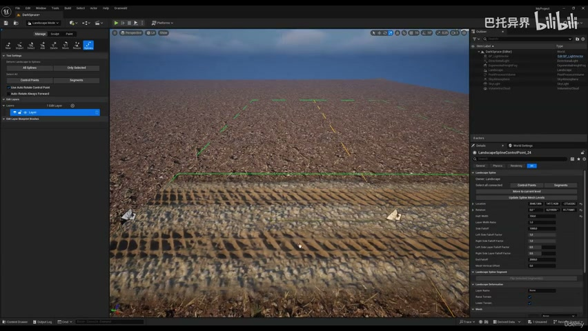
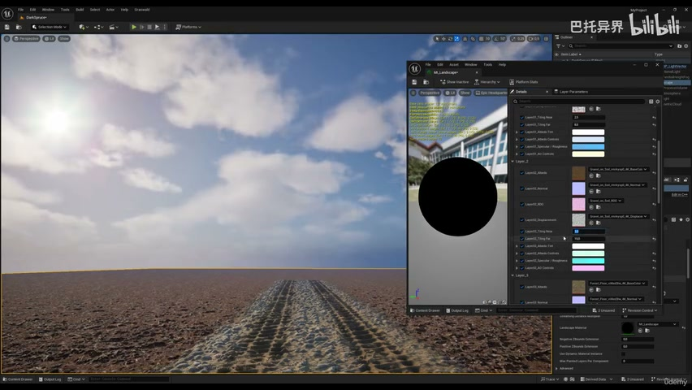

**参数、节点和风险点：**

- `Mesh`
- `Point`
- `Material`
- `Instance`
- `Landscape`
- `shift`
- `better`
- `brightness`
- `applied`
- `sure`

### 调整样条点，验证路径转弯、坡度和端点处理是否稳定（2）

**内容要点：**

- 调整样条点，验证路径转弯、坡度和端点处理是否稳定（2）。

**关键截图：**

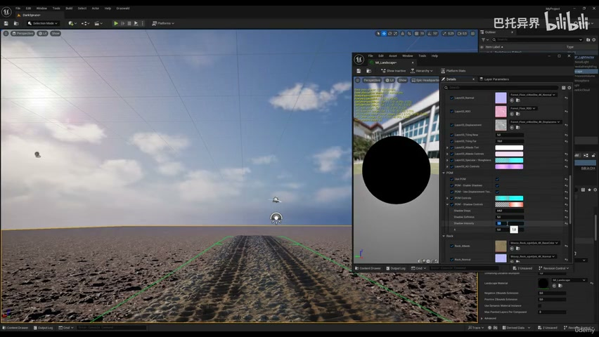
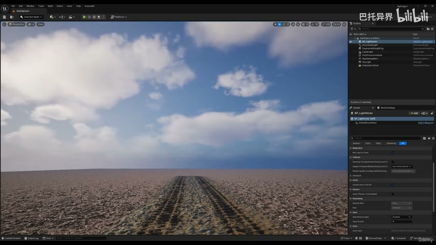

**参数、节点和风险点：**

- `Mesh`
- `Spline`
- `Material`
- `Landscape`
- `foliage`
- `course`
- `section`
- `textures`
- `shadow`

## 复现检查清单

- Spline 点的切线、地形高度和 Mesh 分段要一起调，否则弯道会拉伸或穿地。
- 所有 UE5 资产都要检查比例、pivot、材质槽、贴图色彩空间和实例化性能。
- 复现时先固定随机种子，再调整密度、过滤和生成资源，避免随机结果掩盖逻辑错误。
