# 4-1 - Create the Grass Foliage

## 知识目标

- 本文整理“4-1 - Create the Grass Foliage”的 PCG 实操流程、关键节点、参数组织方式和复现风险点。

## 可复现主流程

- 制作草叶模型或卡片，控制草丛轮廓、密度、朝向和多变体组合。
- 设置 UV、顶点色或权重，用于后续风动画、颜色变化和 subsurface。
- 准备不同高度、弯曲和稀疏程度的草丛变体，服务于 PCG 或 foliage 分布。
- 检查三角面数、透明区域和材质槽，保证实时环境可用。

## 关键术语

- `Mesh`
- `Transform`
- `Point`
- `Random`
- `Mask`
- `Material`
- `Landscape`
- `more`
- `grass`

## 操作步骤与要点

### 制作草叶模型或卡片，控制草丛轮廓、密度、朝向和多变体组合

**内容要点：**

- 制作草叶模型或卡片，控制草丛轮廓、密度、朝向和多变体组合。

**关键截图：**

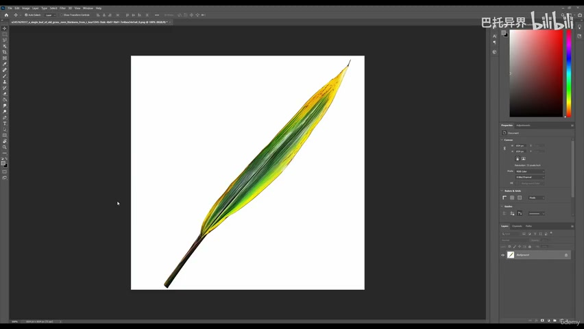

**参数、节点和风险点：**

- `Mesh`
- `grass`
- `vibrant`
- `leaf`
- `show`
- `speed`
- `tree`

### 制作草叶模型或卡片，控制草丛轮廓、密度、朝向和多变体组合（2）

**内容要点：**

- 制作草叶模型或卡片，控制草丛轮廓、密度、朝向和多变体组合（2）。

**关键截图：**

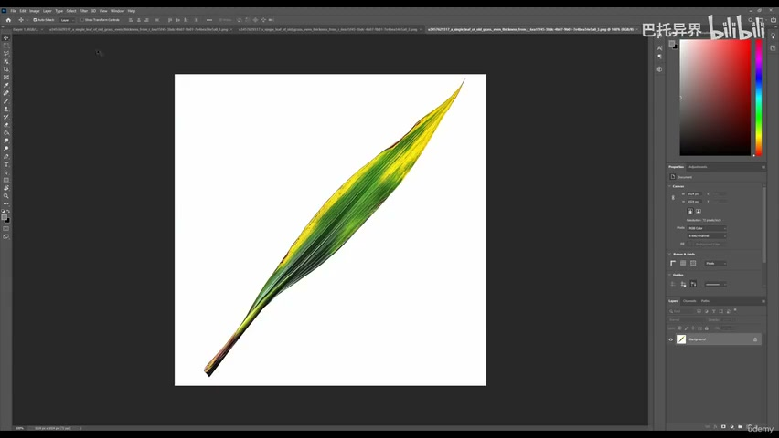
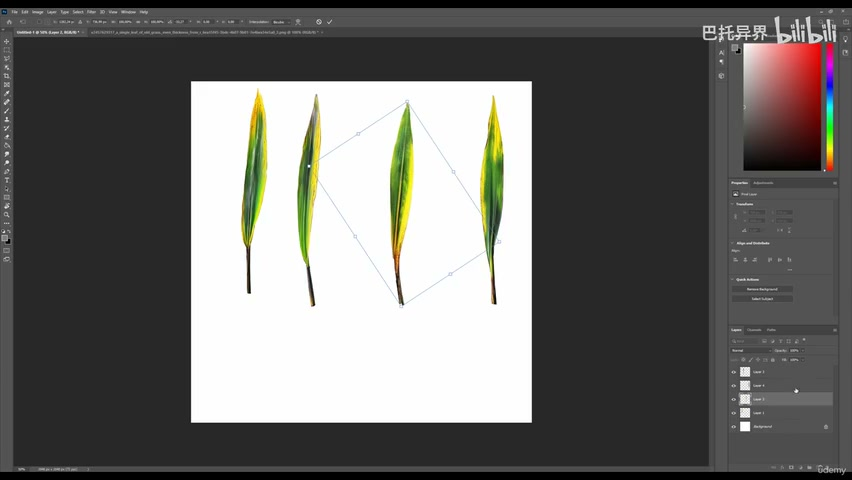

**参数、节点和风险点：**

- `scale`
- `them`
- `Ctrl`
- `white`
- `would`

### 制作草叶模型或卡片，控制草丛轮廓、密度、朝向和多变体组合（3）

**内容要点：**

- 制作草叶模型或卡片，控制草丛轮廓、密度、朝向和多变体组合（3）。

**关键截图：**

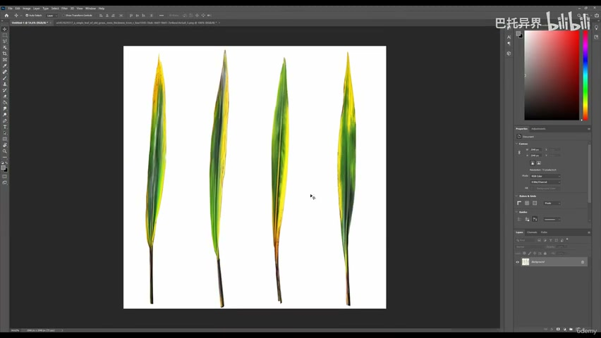
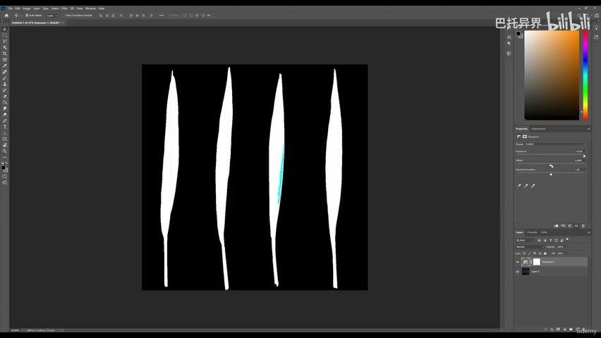

**参数、节点和风险点：**

- `Mask`
- `care`
- `exposure`
- `mask`
- `paint`
- `grass`
- `color`
- `layer`
- `know`
- `black`

### 制作草叶模型或卡片，控制草丛轮廓、密度、朝向和多变体组合（4）

**内容要点：**

- 制作草叶模型或卡片，控制草丛轮廓、密度、朝向和多变体组合（4）。

**关键截图：**

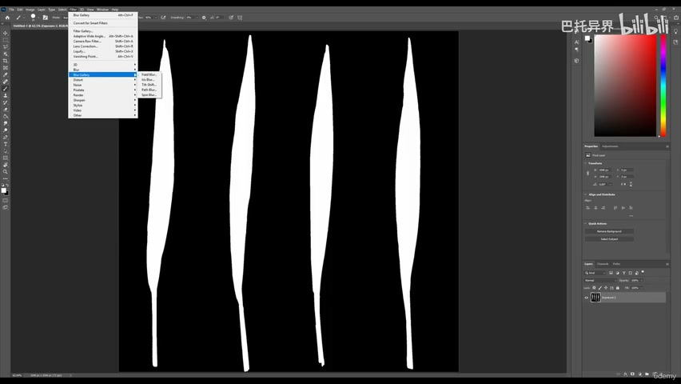
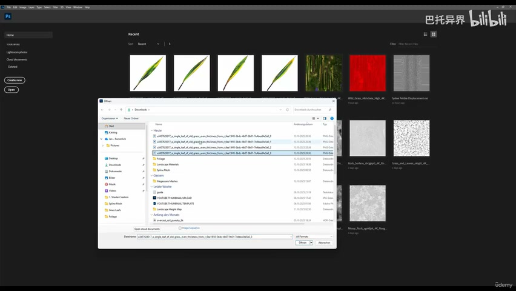

**参数、节点和风险点：**

- `Mask`
- `blur`
- `call`
- `case`
- `believe`
- `edges`
- `Unreal`
- `Engine`
- `think`

### 设置 UV、顶点色或权重，用于后续风动画、颜色变化和 subsurface

**内容要点：**

- 设置 UV、顶点色或权重，用于后续风动画、颜色变化和 subsurface。

**关键截图：**

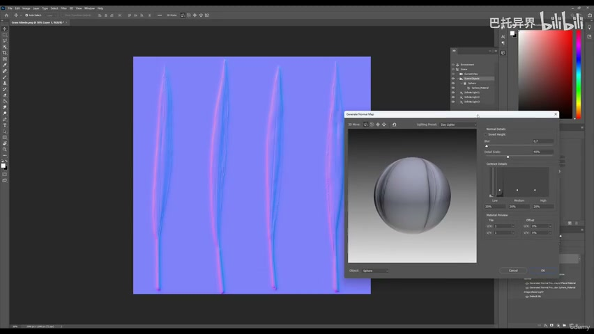
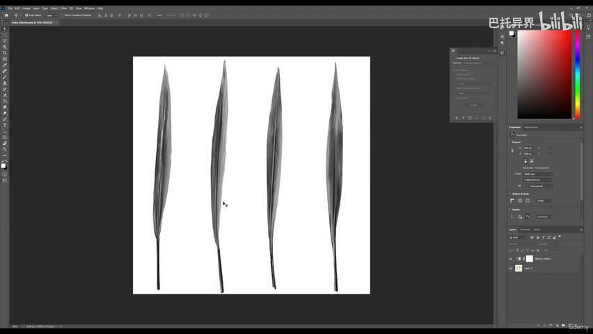

**参数、节点和风险点：**

- `Point`
- `Mask`
- `normal`
- `brighten`
- `blur`
- `keep`
- `cone`

### 设置 UV、顶点色或权重，用于后续风动画、颜色变化和 subsurface（2）

**内容要点：**

- 设置 UV、顶点色或权重，用于后续风动画、颜色变化和 subsurface（2）。

**关键截图：**

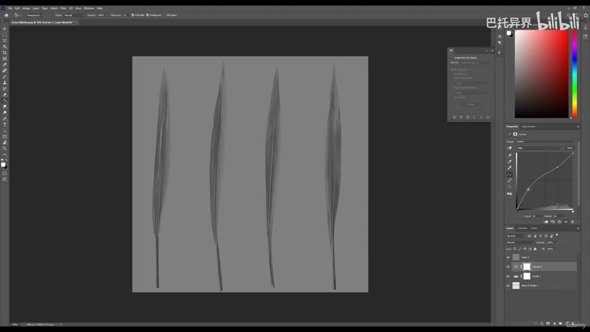

**参数、节点和风险点：**

- `more`
- `think`
- `believe`
- `roughness`
- `grass`
- `trunk`

### 设置 UV、顶点色或权重，用于后续风动画、颜色变化和 subsurface（3）

**内容要点：**

- 设置 UV、顶点色或权重，用于后续风动画、颜色变化和 subsurface（3）。

**关键截图：**

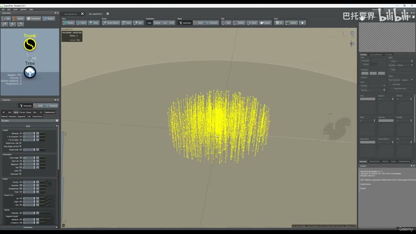
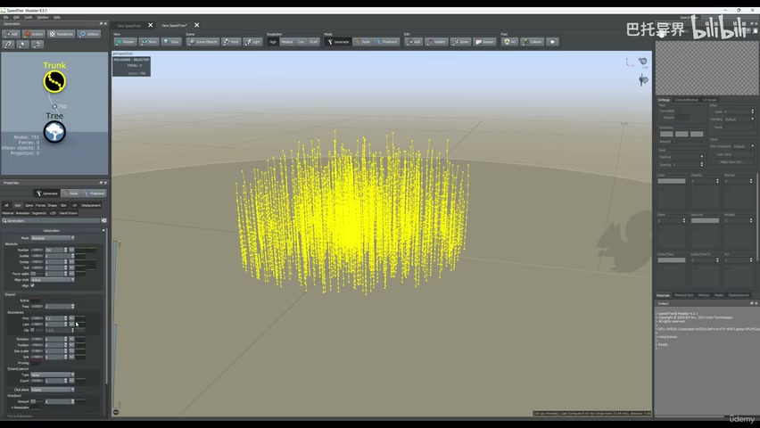

**参数、节点和风险点：**

- `Random`
- `randomize`
- `more`
- `height`
- `curl`
- `change`
- `grass`
- `means`
- `important`

### 设置 UV、顶点色或权重，用于后续风动画、颜色变化和 subsurface（4）

**内容要点：**

- 设置 UV、顶点色或权重，用于后续风动画、颜色变化和 subsurface（4）。

**关键截图：**

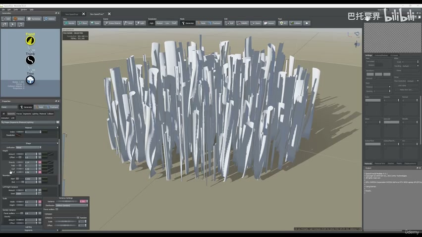
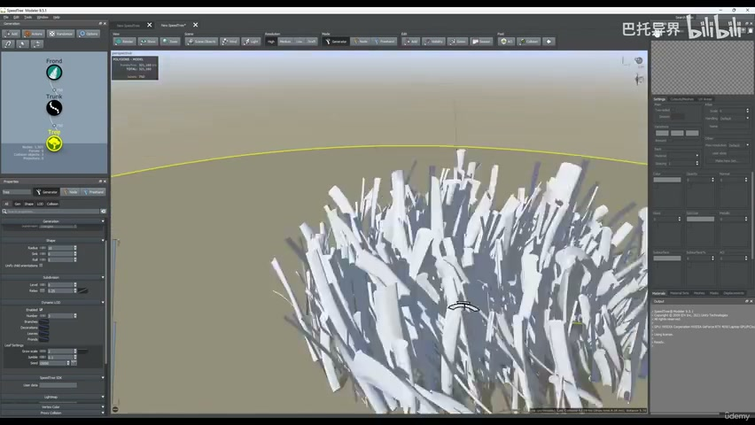

**参数、节点和风险点：**

- `Random`
- `much`
- `grass`
- `zigzag`
- `randomize`
- `more`
- `curl`
- `important`
- `variations`

### 准备不同高度、弯曲和稀疏程度的草丛变体，服务于 PCG 或 foliage 分布

**内容要点：**

- 准备不同高度、弯曲和稀疏程度的草丛变体，服务于 PCG 或 foliage 分布。

**关键截图：**

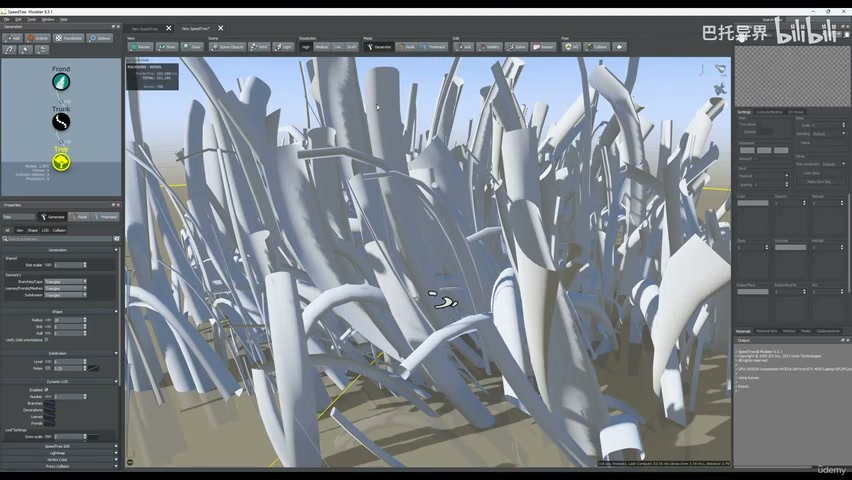
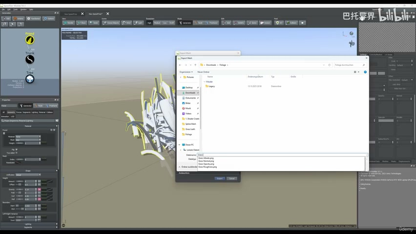

**参数、节点和风险点：**

- `Mesh`
- `Transform`
- `Random`
- `Mask`
- `more`
- `looking`
- `Blender`
- `noise`
- `segments`
- `skinny`

### 准备不同高度、弯曲和稀疏程度的草丛变体，服务于 PCG 或 foliage 分布（2）

**内容要点：**

- 准备不同高度、弯曲和稀疏程度的草丛变体，服务于 PCG 或 foliage 分布（2）。

**关键截图：**

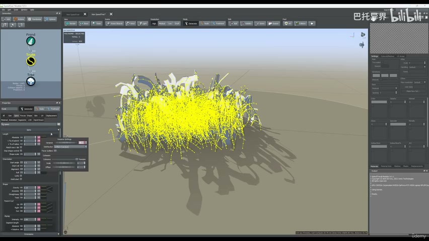
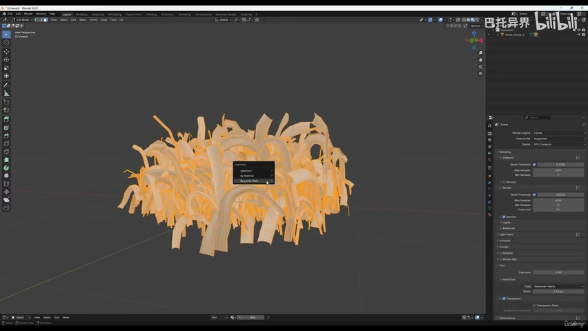

**参数、节点和风险点：**

- `Mesh`
- `Random`
- `Material`
- `selected`
- `grass`
- `select`
- `random`
- `scale`
- `same`

### 准备不同高度、弯曲和稀疏程度的草丛变体，服务于 PCG 或 foliage 分布（3）

**内容要点：**

- 准备不同高度、弯曲和稀疏程度的草丛变体，服务于 PCG 或 foliage 分布（3）。

**关键截图：**

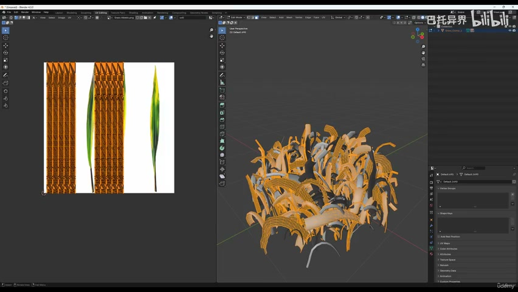
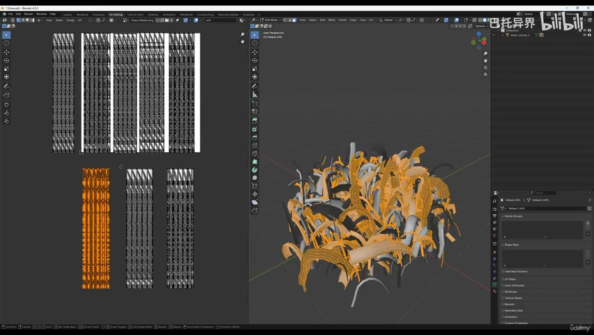

**参数、节点和风险点：**

- `Point`
- `Random`
- `Material`
- `select`
- `everything`
- `material`
- `random`
- `them`
- `opacity`
- `coordinate`

### 准备不同高度、弯曲和稀疏程度的草丛变体，服务于 PCG 或 foliage 分布（4）

**内容要点：**

- 准备不同高度、弯曲和稀疏程度的草丛变体，服务于 PCG 或 foliage 分布（4）。

**关键截图：**

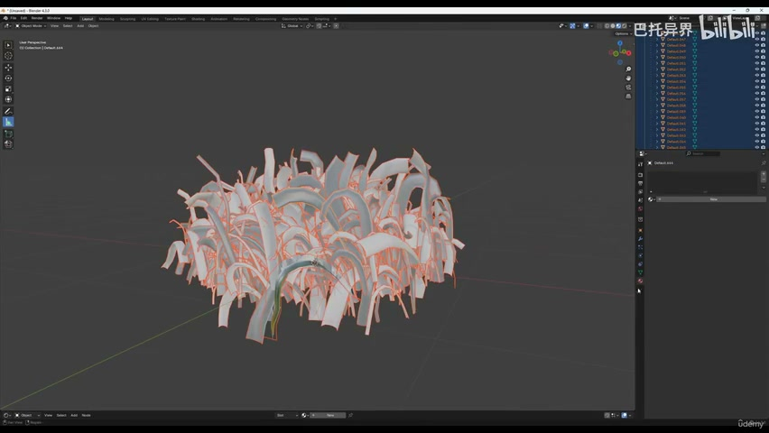
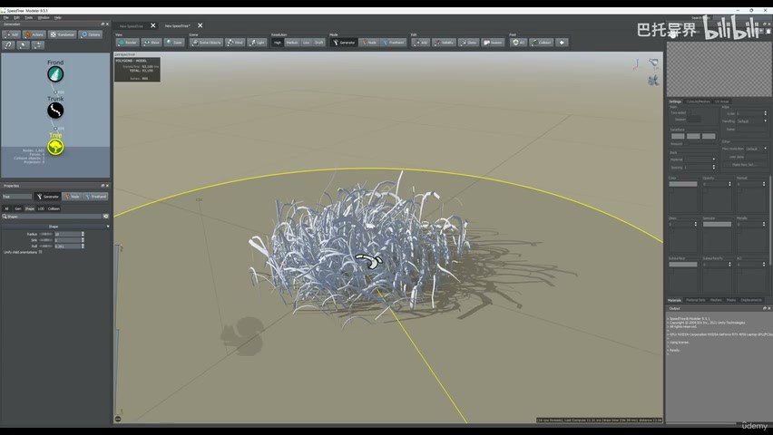

**参数、节点和风险点：**

- `Random`
- `Material`
- `front`
- `segments`
- `everything`
- `less`

### 检查三角面数、透明区域和材质槽，保证实时环境可用

**内容要点：**

- 检查三角面数、透明区域和材质槽，保证实时环境可用。

**关键截图：**

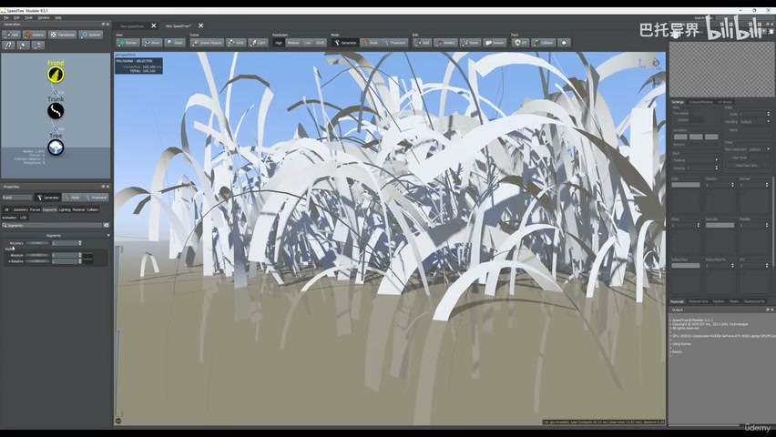
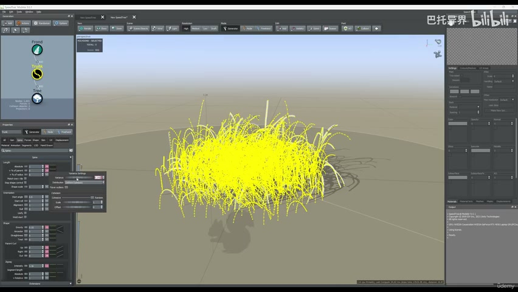

**参数、节点和风险点：**

- `Mesh`
- `Landscape`
- `more`
- `bend`
- `five`
- `curl`
- `plane`
- `think`
- `trunk`
- `spine`

### 检查三角面数、透明区域和材质槽，保证实时环境可用（2）

**内容要点：**

- 检查三角面数、透明区域和材质槽，保证实时环境可用（2）。

**关键截图：**

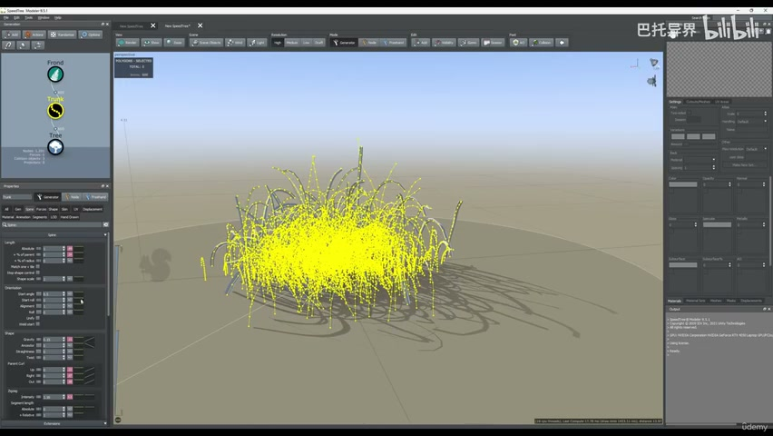
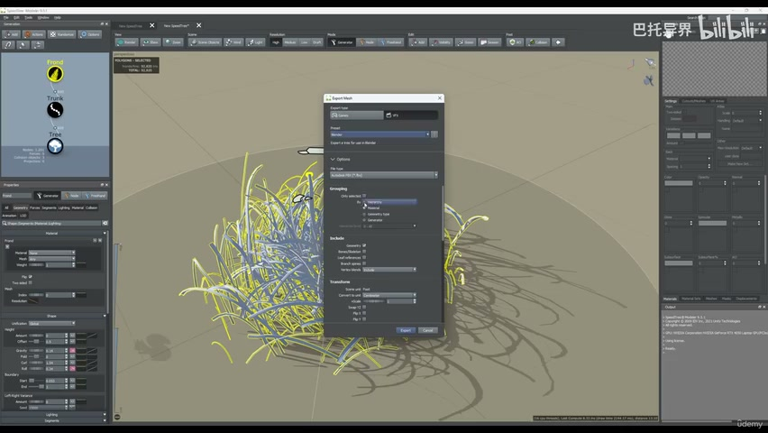

**参数、节点和风险点：**

- `Mesh`
- `Random`
- `more`
- `less`
- `gravity`
- `doing`
- `trunk`
- `first`
- `important`

### 检查三角面数、透明区域和材质槽，保证实时环境可用（3）

**内容要点：**

- 检查三角面数、透明区域和材质槽，保证实时环境可用（3）。

**关键截图：**

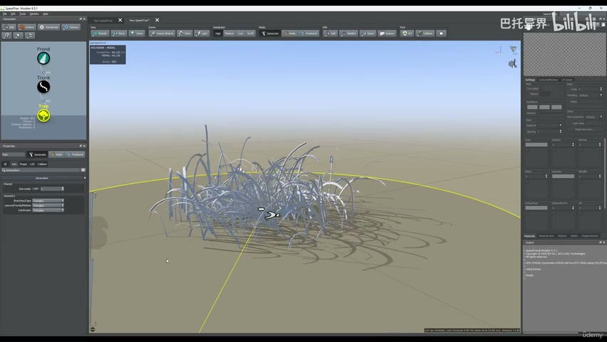
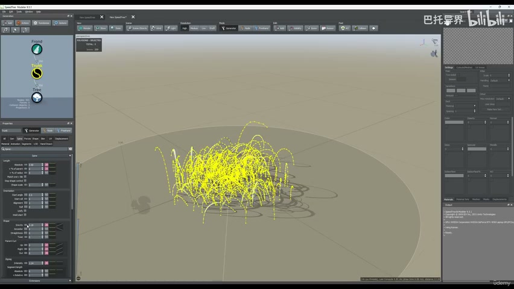

**参数、节点和风险点：**

- `grass`
- `more`
- `trunk`
- `export`
- `much`
- `club`
- `gravity`
- `Alright`
- `nice`

## 复现检查清单

- 草资产需要大量实例化，模型复杂度和透明排序问题必须提前控制。
- 所有 UE5 资产都要检查比例、pivot、材质槽、贴图色彩空间和实例化性能。
- 复现时先固定随机种子，再调整密度、过滤和生成资源，避免随机结果掩盖逻辑错误。
