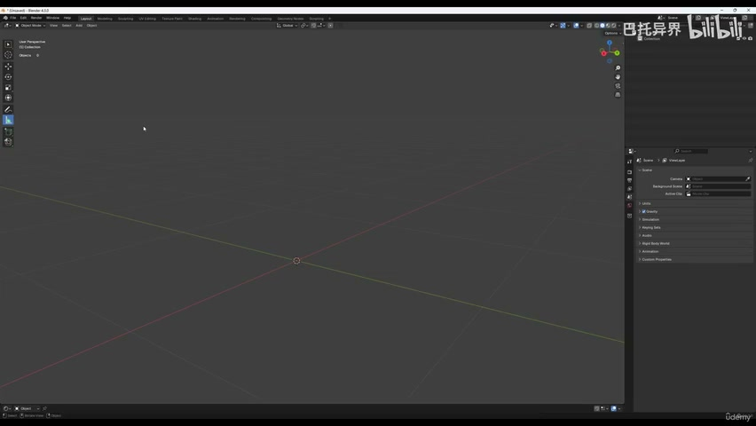
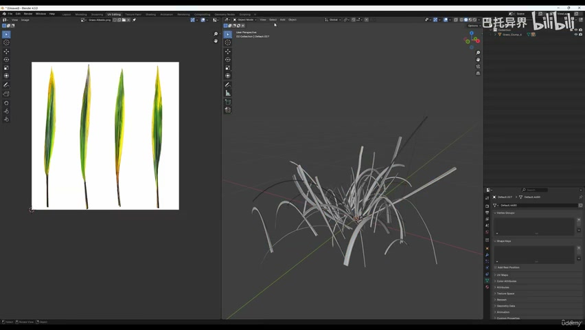
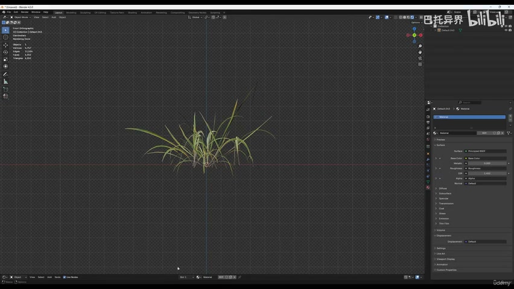
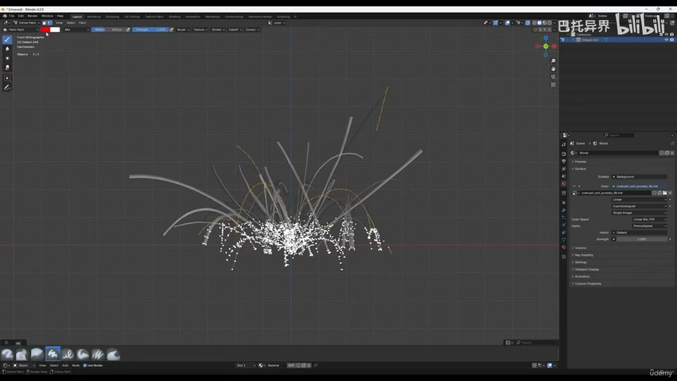
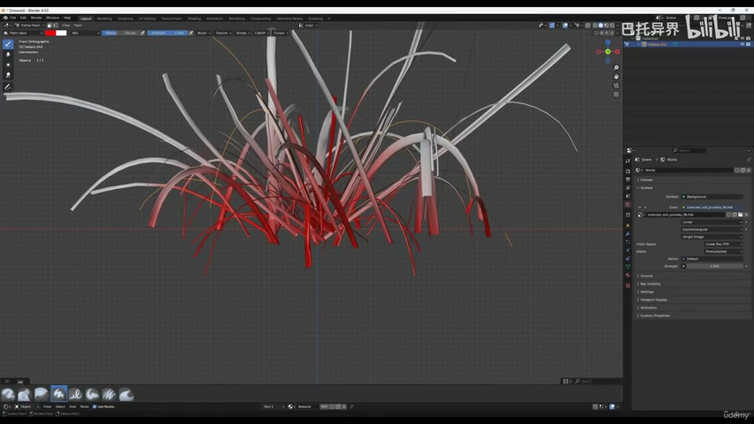
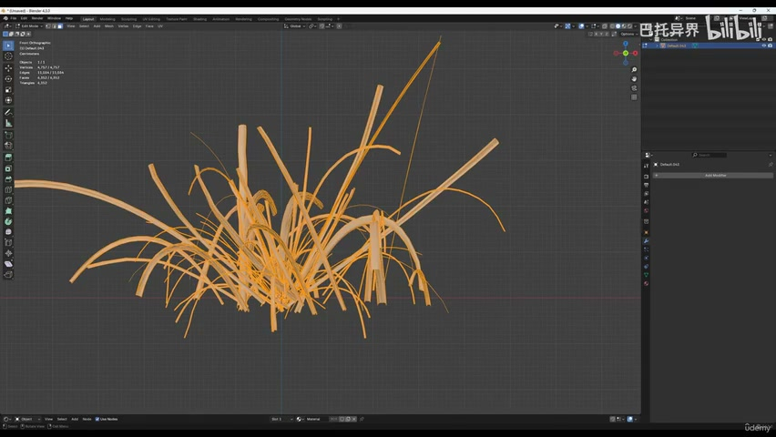
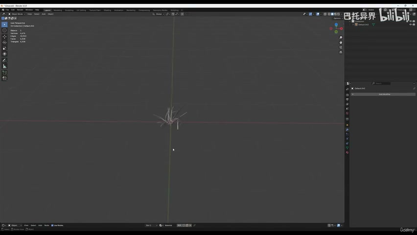
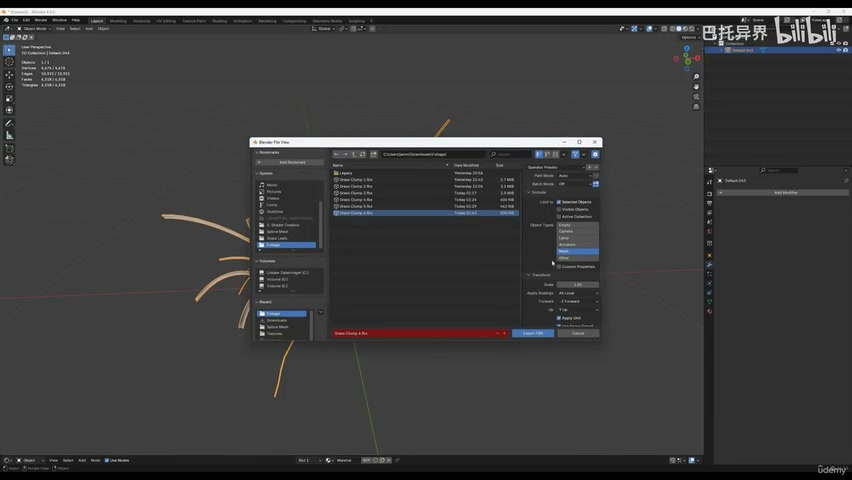

# 4-2 - Prepare Grass Foliage

## 知识目标

- 本文整理“4-2 - Prepare Grass Foliage”的 PCG 实操流程、关键节点、参数组织方式和复现风险点。

## 可复现主流程

- 整理草丛变体、pivot、LOD、碰撞和命名，准备进入 UE5。
- 为草材质所需的颜色、alpha、normal、roughness 和顶点权重准备贴图或数据。
- 检查资产尺度，确保草与黑云杉、道路和 Landscape 尺寸匹配。
- 按后续 PCG/foliage 使用方式分组保存。

## 关键术语

- `Mesh`
- `Transform`
- `Point`
- `Random`
- `Vertex Color`
- `Mask`
- `Material`
- `Landscape`
- `mode`
- `mesh`
- `more`
- `color`
- `everything`

## 操作步骤与要点

### 整理草丛变体、pivot、LOD、碰撞和命名，准备进入 UE5

**内容要点：**

- 整理草丛变体、pivot、LOD、碰撞和命名，准备进入 UE5。

**关键截图：**

**参数、节点和风险点：**

- `Mesh`
- `Transform`
- `Random`
- `Material`
- `Landscape`
- `more`
- `select`
- `everything`
- `object`
- `mode`

### 为草材质所需的颜色、alpha、normal、roughness 和顶点权重准备贴图或数据

**内容要点：**

- 为草材质所需的颜色、alpha、normal、roughness 和顶点权重准备贴图或数据。

**关键截图：**

**参数、节点和风险点：**

- `Mesh`
- `Material`
- `paint`
- `vertex`
- `mesh`
- `mode`
- `bottom`
- `sure`
- `blur`

### 检查资产尺度，确保草与黑云杉、道路和 Landscape 尺寸匹配

**内容要点：**

- 检查资产尺度，确保草与黑云杉、道路和 Landscape 尺寸匹配。

**关键截图：**

**参数、节点和风险点：**

- `Mesh`
- `Transform`
- `Vertex Color`
- `Mask`
- `color`
- `good`
- `white`
- `root`
- `doesn`
- `information`

### 按后续 PCG/foliage 使用方式分组保存

**内容要点：**

- 按后续 PCG/foliage 使用方式分组保存。

**关键截图：**

**参数、节点和风险点：**

- `Point`
- `pivot`
- `point`
- `orange`
- `Unreal`
- `Engine`
- `texture`
- `more`
- `weird`
- `looking`

## 复现检查清单

- 草的 pivot 和尺度会影响批量分布、贴地和风动画。
- 所有 UE5 资产都要检查比例、pivot、材质槽、贴图色彩空间和实例化性能。
- 复现时先固定随机种子，再调整密度、过滤和生成资源，避免随机结果掩盖逻辑错误。
