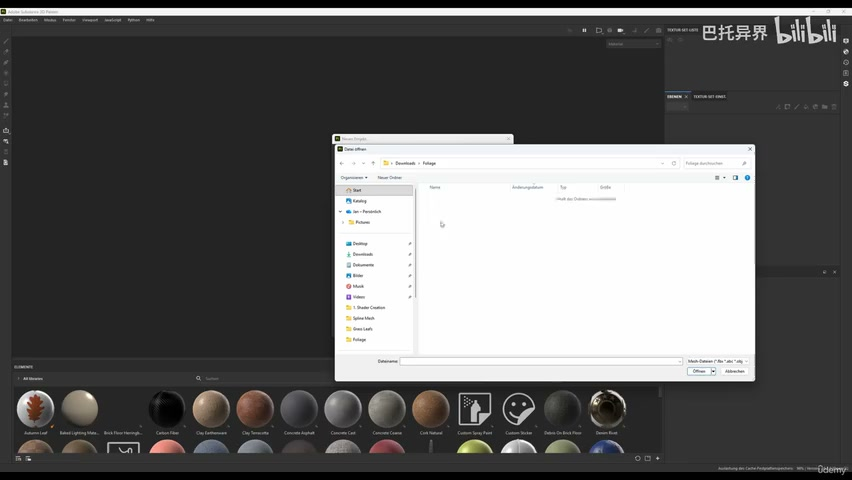
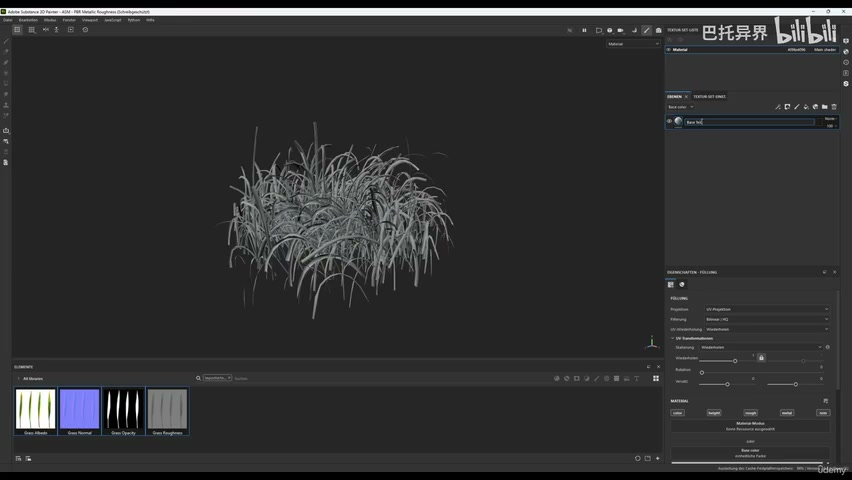
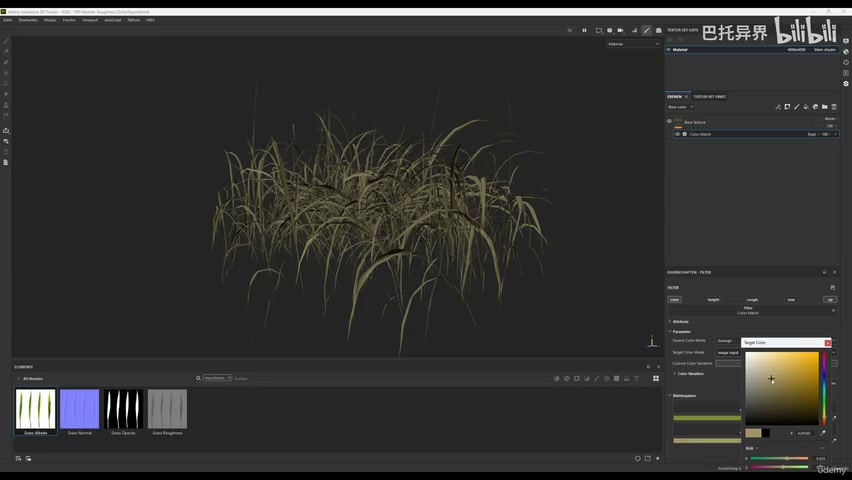
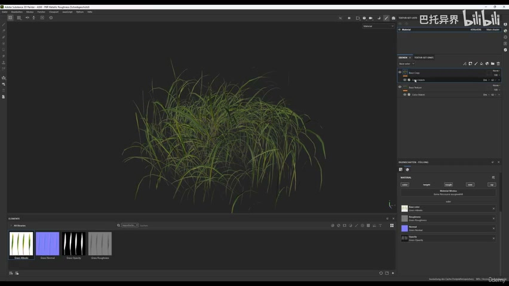
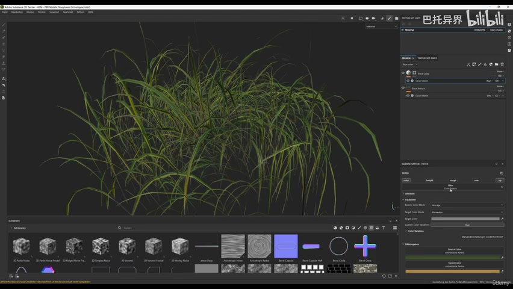
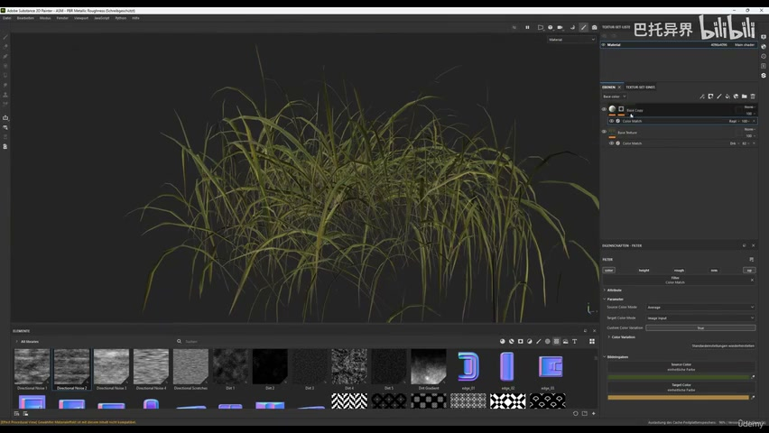
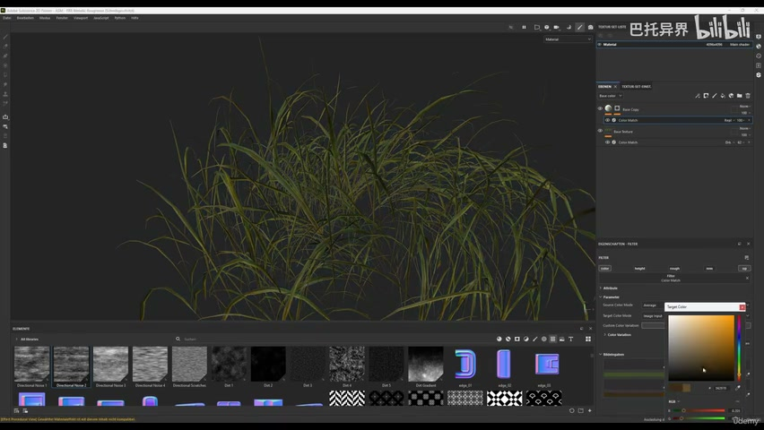
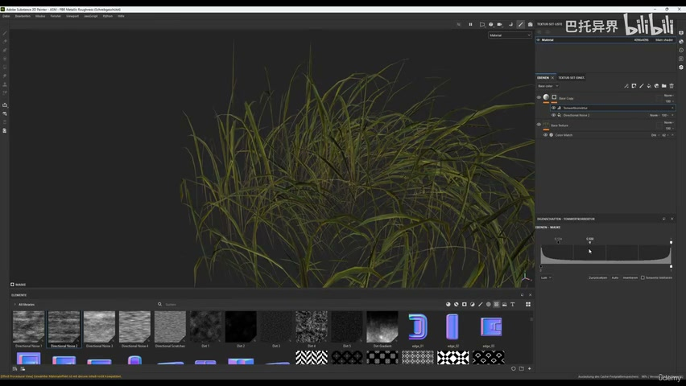
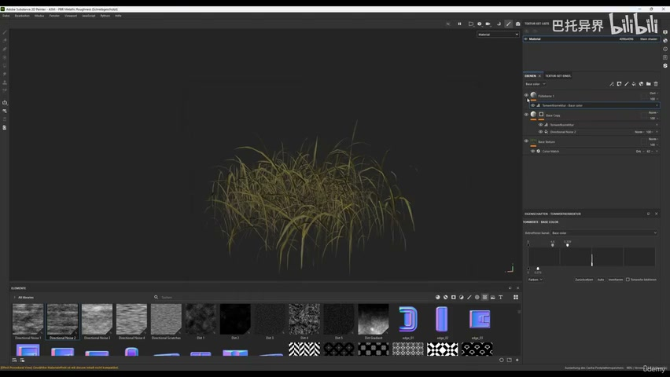
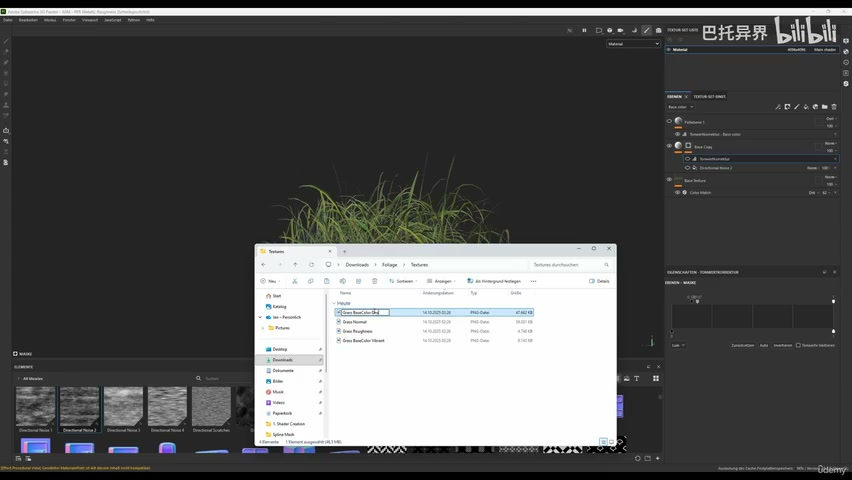

# 4-3 - Texture Grass Foliage

## 知识目标

- 本文整理“4-3 - Texture Grass Foliage”的 PCG 实操流程、关键节点、参数组织方式和复现风险点。

## 可复现主流程

- 在 Substance Painter 或贴图工具中制作草叶颜色、透明、法线和粗糙度。
- 加入颜色变化和叶片明暗，避免大面积分布时出现重复图案。
- 导出 UE5 材质需要的贴图，并确认 alpha/sRGB 设置。
- 用测试材质检查远近视角、mipmap 和边缘质量。

## 关键术语

- `Mesh`
- `Actor`
- `Mask`
- `Material`
- `Instance`
- `color`
- `more`
- `mask`

## 操作步骤与要点

### 在 Substance Painter 或贴图工具中制作草叶颜色、透明、法线和粗糙度

**内容要点：**

- 在 Substance Painter 或贴图工具中制作草叶颜色、透明、法线和粗糙度。

**关键截图：**

**参数、节点和风险点：**

- `Mesh`
- `Actor`
- `Mask`
- `Material`
- `opacity`
- `shadow`
- `more`
- `less`
- `albedo`

### 在 Substance Painter 或贴图工具中制作草叶颜色、透明、法线和粗糙度（2）

**内容要点：**

- 在 Substance Painter 或贴图工具中制作草叶颜色、透明、法线和粗糙度（2）。

**关键截图：**

**参数、节点和风险点：**

- `Mask`
- `color`
- `layer`
- `wanna`
- `match`
- `filter`
- `darken`

### 加入颜色变化和叶片明暗，避免大面积分布时出现重复图案

**内容要点：**

- 加入颜色变化和叶片明暗，避免大面积分布时出现重复图案。

**关键截图：**

**参数、节点和风险点：**

- `Mask`
- `contrast`
- `more`
- `color`
- `mask`
- `noise`
- `direction`
- `black`
- `directional`
- `increase`

### 导出 UE5 材质需要的贴图，并确认 alpha/sRGB 设置

**内容要点：**

- 导出 UE5 材质需要的贴图，并确认 alpha/sRGB 设置。

**关键截图：**

**参数、节点和风险点：**

- `Mask`
- `Material`
- `Instance`
- `texture`
- `good`
- `roughness`
- `more`
- `type`
- `fine`
- `material`

### 用测试材质检查远近视角、mipmap 和边缘质量

**内容要点：**

- 用测试材质检查远近视角、mipmap 和边缘质量。

**关键截图：**

**参数、节点和风险点：**

- `Mask`
- `Material`
- `grass`
- `vibrant`
- `color`
- `export`
- `textures`
- `only`
- `mask`
- `spots`

## 复现检查清单

- 草的 alpha 边缘和 mipmap 很容易糊或闪，导出后必须在 UE5 中检查。
- 所有 UE5 资产都要检查比例、pivot、材质槽、贴图色彩空间和实例化性能。
- 复现时先固定随机种子，再调整密度、过滤和生成资源，避免随机结果掩盖逻辑错误。
