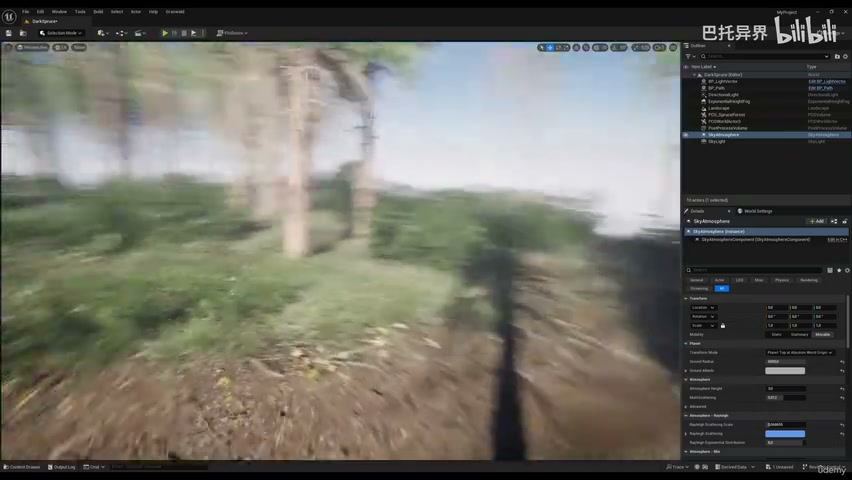
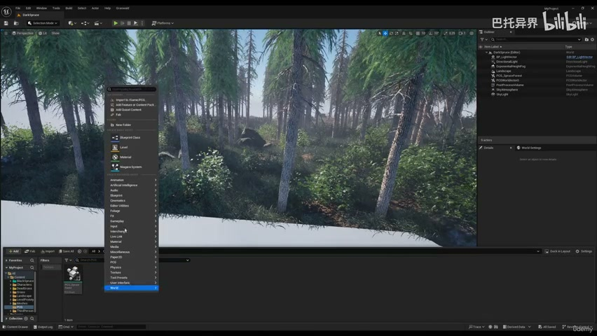
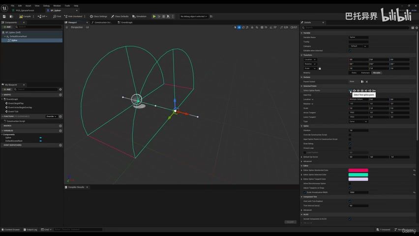
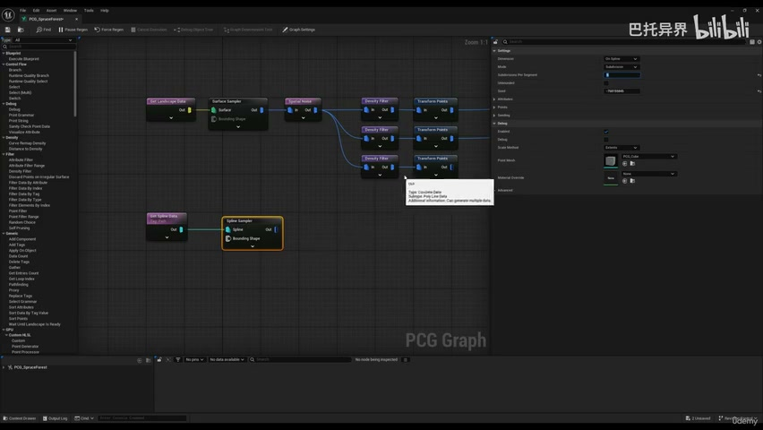
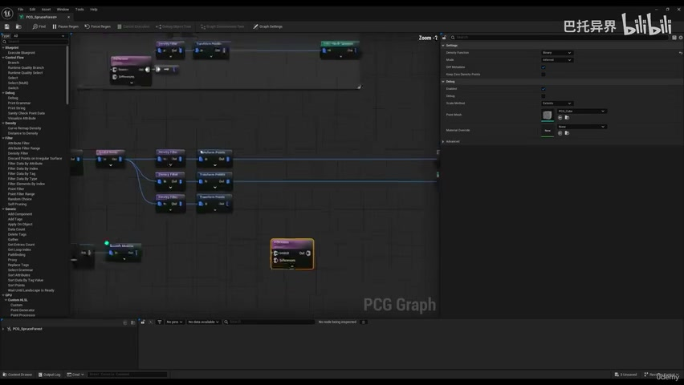
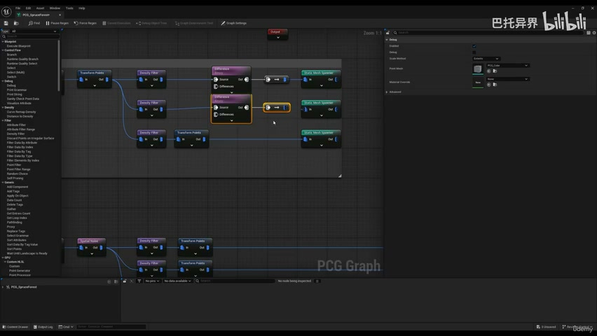
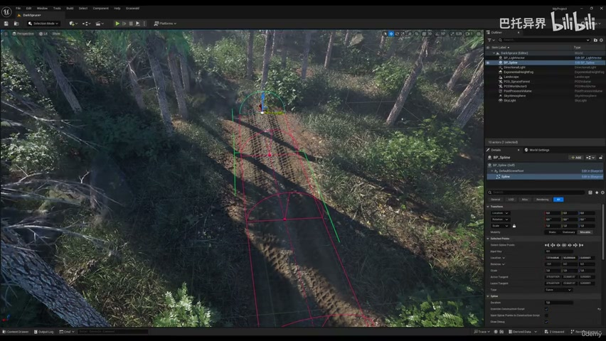
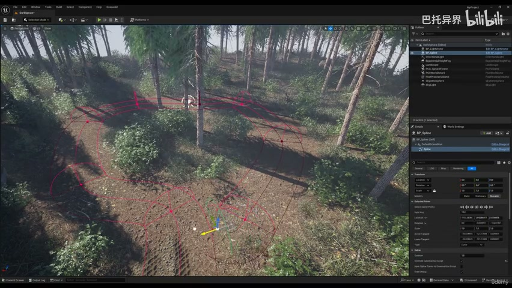
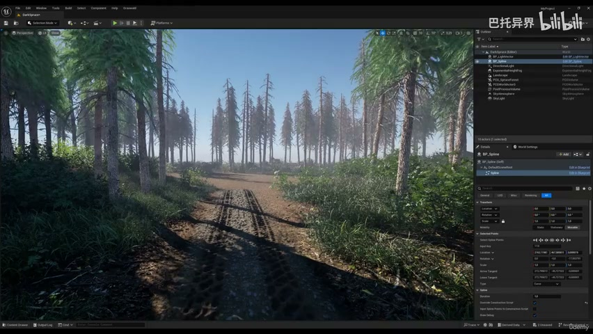
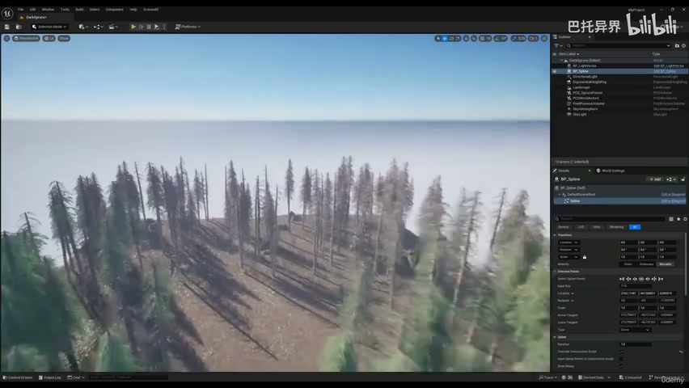

# 5-3 - PCG Spline Path

## 知识目标

- 本文整理“5-3 - PCG Spline Path”的 PCG 实操流程、关键节点、参数组织方式和复现风险点。

## 可复现主流程

- 让 PCG 读取道路/溪流 Spline 数据，用距离或 Bounds 控制路径周围留白。
- 按样条边缘生成草、石头、落叶等过渡细节，让路径嵌入森林。
- 用距离衰减或密度渐变控制边缘植被，不做硬切割。
- 检查弯道、坡地、端点和交叉区域的点云分布。

## 关键术语

- `PCG`
- `Blueprint`
- `Static Mesh`
- `Mesh`
- `Spline`
- `Transform`
- `Point`
- `Actor`
- `Spawn`
- `Density`
- `Graph`
- `Material`
- `Landscape`
- `spline`
- `blueprint`

## 操作步骤与要点

### 让 PCG 读取道路/溪流 Spline 数据，用距离或 Bounds 控制路径周围留白

**内容要点：**

- 让 PCG 读取道路/溪流 Spline 数据，用距离或 Bounds 控制路径周围留白。

**关键截图：**

**参数、节点和风险点：**

- `PCG`
- `Blueprint`
- `Mesh`
- `Spline`
- `Point`
- `Actor`
- `spline`
- `some`
- `always`

### 让 PCG 读取道路/溪流 Spline 数据，用距离或 Bounds 控制路径周围留白（2）

**内容要点：**

- 让 PCG 读取道路/溪流 Spline 数据，用距离或 Bounds 控制路径周围留白（2）。

**关键截图：**

**参数、节点和风险点：**

- `PCG`
- `Blueprint`
- `Spline`
- `Point`
- `Actor`
- `Graph`
- `Landscape`
- `spline`
- `bounce`
- `fine`

### 按样条边缘生成草、石头、落叶等过渡细节，让路径嵌入森林

**内容要点：**

- 按样条边缘生成草、石头、落叶等过渡细节，让路径嵌入森林。

**关键截图：**

**参数、节点和风险点：**

- `PCG`
- `Static Mesh`
- `Mesh`
- `Spline`
- `Transform`
- `Point`
- `Spawn`
- `Density`
- `Graph`
- `Landscape`

### 用距离衰减或密度渐变控制边缘植被，不做硬切割

**内容要点：**

- 用距离衰减或密度渐变控制边缘植被，不做硬切割。

**关键截图：**

**参数、节点和风险点：**

- `PCG`
- `Blueprint`
- `Spline`
- `Point`
- `Material`
- `drag`
- `area`
- `more`
- `spline`
- `Boom`

### 检查弯道、坡地、端点和交叉区域的点云分布

**内容要点：**

- 检查弯道、坡地、端点和交叉区域的点云分布。

**关键截图：**

**参数、节点和风险点：**

- `Landscape`
- `scene`
- `good`
- `background`
- `nice`
- `still`
- `guide`
- `through`
- `build`

## 复现检查清单

- 样条坐标空间、宽度和 PCG 距离计算必须一致。
- 所有 UE5 资产都要检查比例、pivot、材质槽、贴图色彩空间和实例化性能。
- 复现时先固定随机种子，再调整密度、过滤和生成资源，避免随机结果掩盖逻辑错误。
