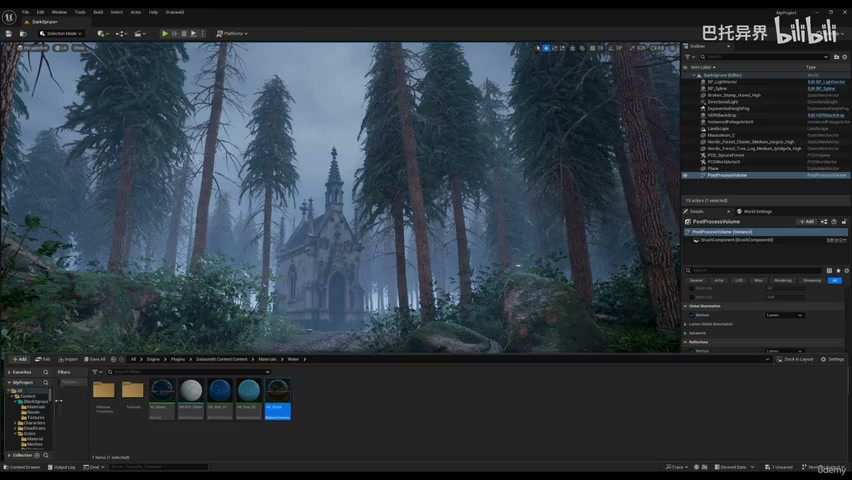
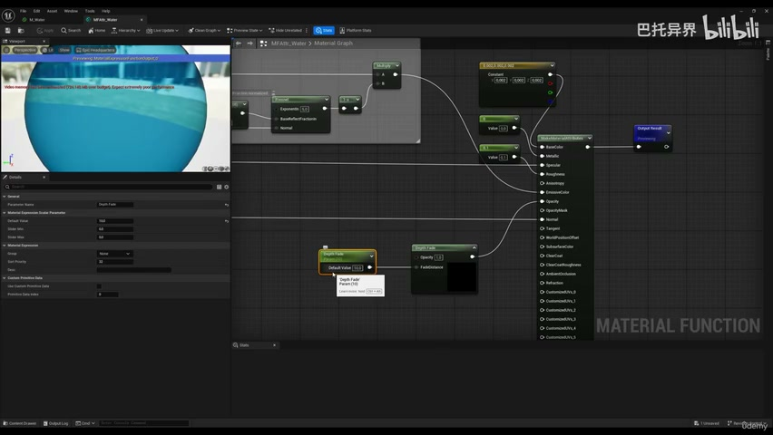
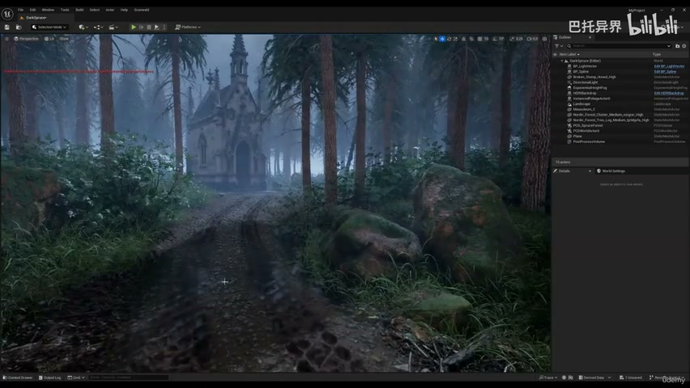
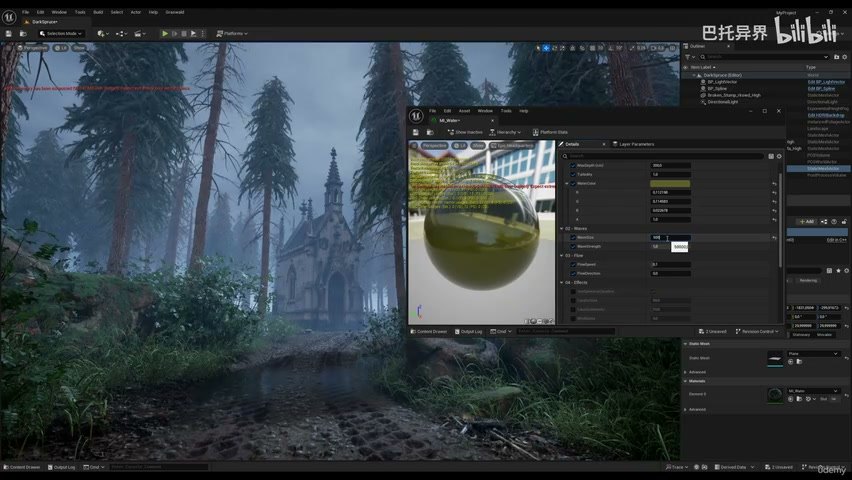
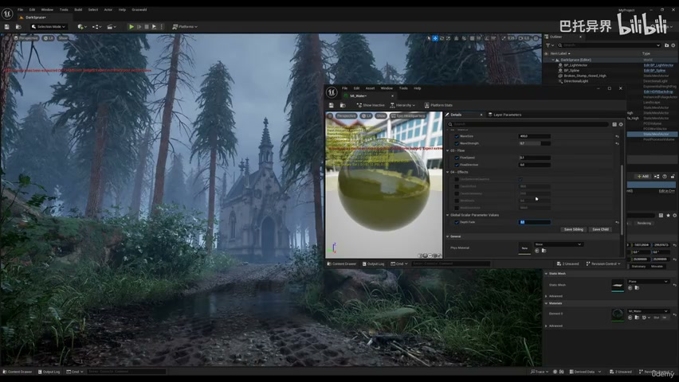
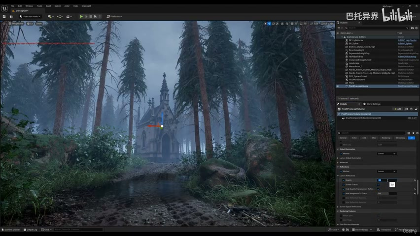

# 5-5 - Water Shader with Depth Fade

## 知识目标

- 本文整理“5-5 - Water Shader with Depth Fade”的 PCG 实操流程、关键节点、参数组织方式和复现风险点。

## 可复现主流程

- 创建浅水材质，使用 Depth Fade 或 Scene Depth 控制水边透明过渡。
- 接入颜色、法线、roughness、波纹和透明度，让浅水与地形自然融合。
- 调整深浅水颜色、边缘 fade、折射或透明设置，避免水体硬边。
- 放入场景中测试与样条/地形/RVT 的关系。

## 关键术语

- `Mesh`
- `Spline`
- `Attribute`
- `Material`
- `Instance`
- `Landscape`
- `material`
- `water`
- `fade`
- `plane`
- `depth`
- `translucent`
- `function`

## 操作步骤与要点

### 创建浅水材质，使用 Depth Fade 或 Scene Depth 控制水边透明过渡

**内容要点：**

- 创建浅水材质，使用 Depth Fade 或 Scene Depth 控制水边透明过渡。

**关键截图：**

**参数、节点和风险点：**

- `Mesh`
- `Spline`
- `Attribute`
- `Material`
- `Instance`
- `Landscape`
- `material`
- `water`
- `fade`
- `translucent`

### 接入颜色、法线、roughness、波纹和透明度，让浅水与地形自然融合

**内容要点：**

- 接入颜色、法线、roughness、波纹和透明度，让浅水与地形自然融合。

**关键截图：**

**参数、节点和风险点：**

- `Mesh`
- `Spline`
- `Material`
- `Instance`
- `Landscape`
- `material`
- `fade`
- `depth`
- `water`
- `wave`

### 调整深浅水颜色、边缘 fade、折射或透明设置，避免水体硬边

**内容要点：**

- 调整深浅水颜色、边缘 fade、折射或透明设置，避免水体硬边。

**关键截图：**

**参数、节点和风险点：**

- `Mesh`
- `Spline`
- `Material`
- `Landscape`
- `water`
- `reflections`
- `spline`
- `select`
- `already`

## 复现检查清单

- 透明水材质要检查排序、反射和边缘深度，不能只在材质预览里判断。
- 所有 UE5 资产都要检查比例、pivot、材质槽、贴图色彩空间和实例化性能。
- 复现时先固定随机种子，再调整密度、过滤和生成资源，避免随机结果掩盖逻辑错误。
