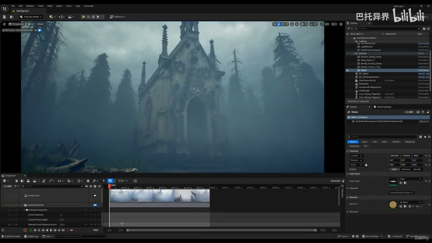
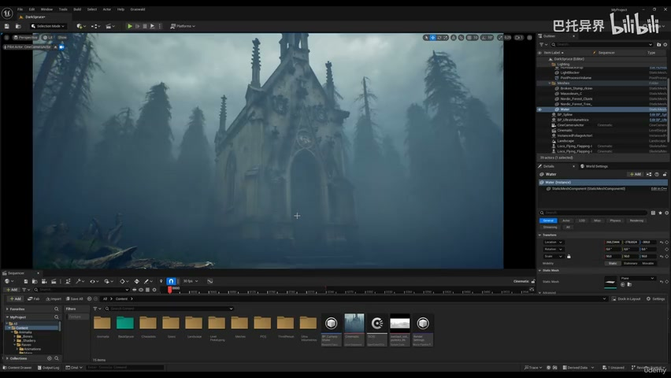
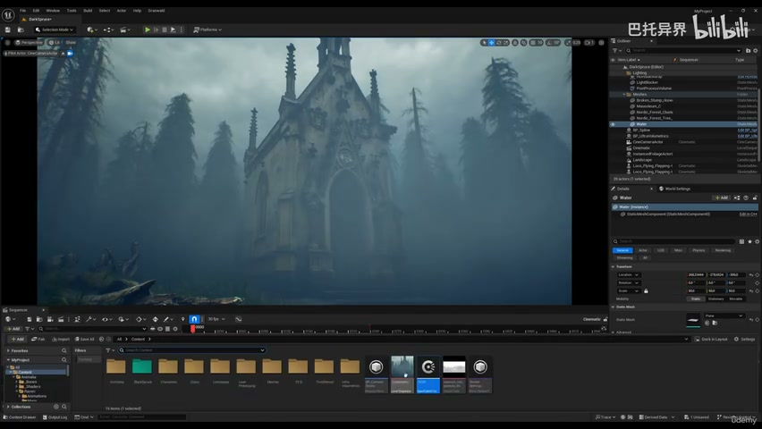
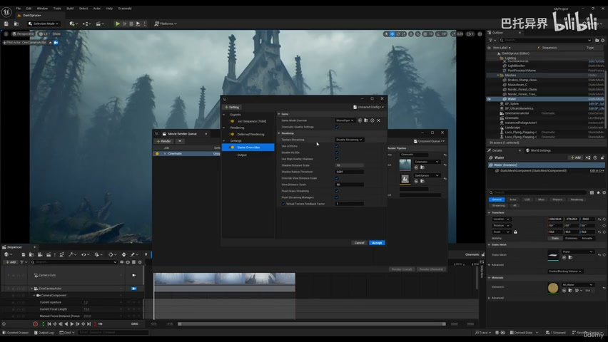
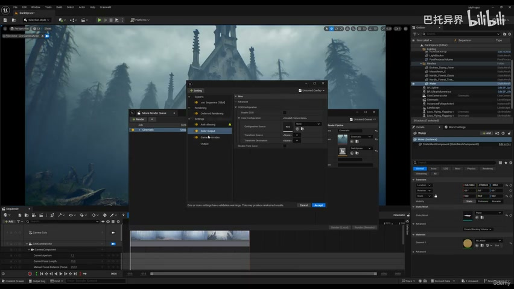
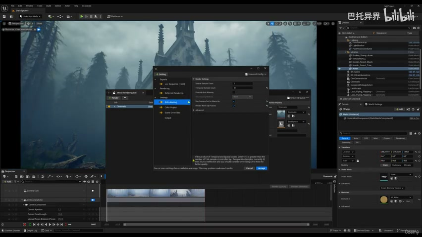
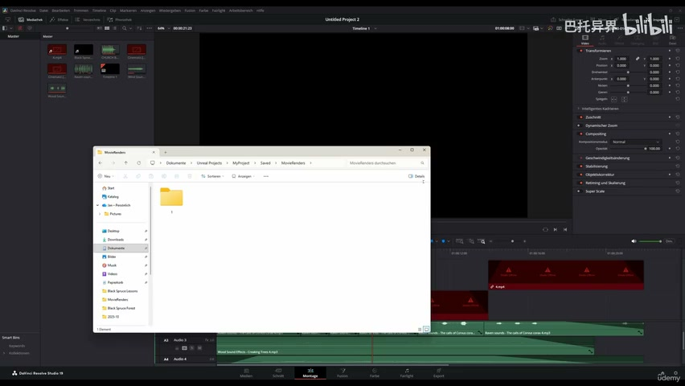
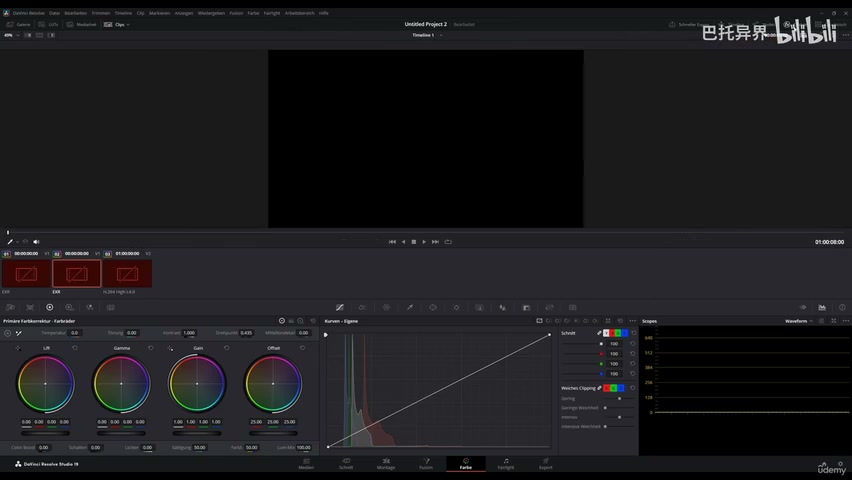

# 5-7 - Export with OCIO and Import into DaVinci with Color Input

## 知识目标

- 本文整理“5-7 - Export with OCIO and Import into DaVinci with Color Input”的 PCG 实操流程、关键节点、参数组织方式和复现风险点。

## 可复现主流程

- 在 UE/MRQ 中配置 OCIO 或色彩输出，确保导出素材符合后期色彩空间要求。
- 导出图像序列或视频后导入 DaVinci Resolve，设置正确的输入色彩管理。
- 做基础调色、曝光、对比、色温和高光/阴影调整，让森林环境更统一。
- 输出最终成片并记录色彩空间、编码和版本。

## 关键术语

- `Spline`
- `Transform`
- `Point`
- `color`
- `space`
- `image`
- `settings`
- `video`

## 操作步骤与要点

### 在 UE/MRQ 中配置 OCIO 或色彩输出，确保导出素材符合后期色彩空间要求

**内容要点：**

- 在 UE/MRQ 中配置 OCIO 或色彩输出，确保导出素材符合后期色彩空间要求。

**关键截图：**

**参数、节点和风险点：**

- `Spline`
- `Point`
- `color`
- `space`
- `sRGB`
- `linear`
- `desired`

### 导出图像序列或视频后导入 DaVinci Resolve，设置正确的输入色彩管理

**内容要点：**

- 导出图像序列或视频后导入 DaVinci Resolve，设置正确的输入色彩管理。

**关键截图：**

**参数、节点和风险点：**

- `quality`
- `image`
- `settings`
- `color`
- `cinematic`
- `sure`

### 做基础调色、曝光、对比、色温和高光/阴影调整，让森林环境更统一

**内容要点：**

- 做基础调色、曝光、对比、色温和高光/阴影调整，让森林环境更统一。

**关键截图：**

**参数、节点和风险点：**

- `Transform`
- `OCIO`
- `color`
- `show`
- `anti`
- `aliasing`
- `video`
- `settings`
- `linear`

### 输出最终成片并记录色彩空间、编码和版本

**内容要点：**

- 输出最终成片并记录色彩空间、编码和版本。

**关键截图：**

**参数、节点和风险点：**

- `Transform`
- `color`
- `ACES`
- `images`
- `image`
- `video`
- `correction`

## 复现检查清单

- OCIO 输入输出空间必须和 DaVinci 项目设置一致，否则画面会偏灰、偏暗或过饱和。
- 所有 UE5 资产都要检查比例、pivot、材质槽、贴图色彩空间和实例化性能。
- 复现时先固定随机种子，再调整密度、过滤和生成资源，避免随机结果掩盖逻辑错误。
