# UE5 程序化管道- 教程篇（免费下载）

## 知识目标

- 围绕“UE5 程序化管道- 教程篇（免费下载）”整理 UE5 程序化管道蓝图流程：用原始 Spline 作为输入，通过重采样和切线修正生成更适合管道拐角的新 Spline，再沿新 Spline 创建管道段和连接件。

## 可复现主流程

- 先确认成品蓝图的对外参数：管道材质、基础管道网格、连接处网格、半径、长度、是否生成连接件等都应可在实例中调整。
- 准备基础圆柱网格并创建 Actor 蓝图，添加 Spline 组件，先做一个最基础的按样条生成 Spline Mesh 的测试链路。
- 把原始 Spline 当作输入，创建新的重采样 Spline；先清理默认点，再准备把计算出的新点逐个添加进去。
- 遍历原始样条点时分开处理首点、末点和中间点，避免端点访问前后点越界，并保证新 Spline 的端点贴合原路径。
- 对中间段按沿样条距离采样：结合点索引、转角距离和原始 Spline 长度，计算新 Spline 中每个采样点的位置。
- 把重采样结果放回关卡测试，检查直线段和弯折段；如果直线段不直，优先怀疑新 Spline 点的切线没有正确设置。
- 为新 Spline 点设置切线：直线段取原始 Spline 在对应距离处的切线，端点和中间点按索引分别设置。
- 调整切线长度：用转角距离和方向向量控制弯曲幅度，必要时乘以系数，让拐角既不硬折也不过度弯曲。
- 基于重采样后的 Spline 创建管道段：为每一段添加 Spline Mesh Component，设置起点/终点位置与切线。
- 补齐材质、半径、连接件开关、连接处模型和细节模型替换，最终把蓝图整理成可复用的程序化管道工具。

## 关键术语

- `蓝图`
- `Mesh`
- `Spline`
- `Point`
- `Actor`
- `Spawn`
- `Loop`
- `Material`
- `样条`
- `网格`
- `材质`
- `过滤`
- `采样`
- `参数`
- `节点`
- `程序化`
- `生成`
- `BP_Test`

## 操作步骤与要点

### 先确认成品蓝图的对外参数：管道材质、基础管道网格、连接处网格、半径、长度、是否生成连接件等都应可在实例中调整

**内容要点：**

- 先确认成品蓝图的对外参数：管道材质、基础管道网格、连接处网格、半径、长度、是否生成连接件等都应可在实例中调整。

**关键截图：**

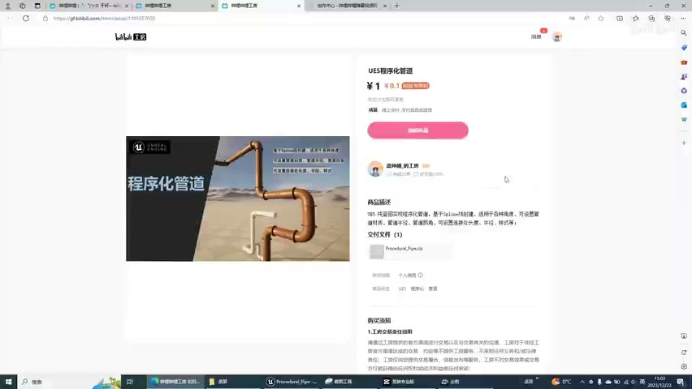
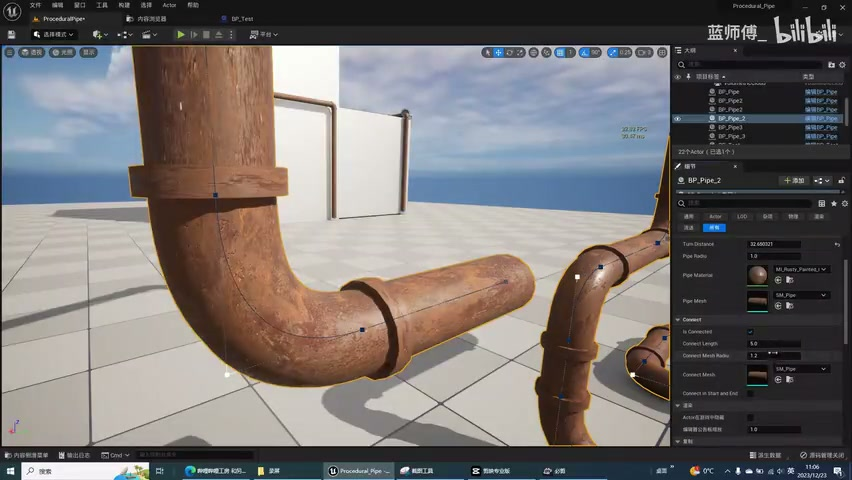

**参数、节点和风险点：**

- `蓝图`
- `样条`
- `网格`
- `材质`
- `参数`
- `节点`
- `程序化`
- `生成`

### 准备基础圆柱网格并创建 Actor 蓝图，添加 Spline 组件，先做一个最基础的按样条生成 Spline Mesh 的测试链路

**内容要点：**

- 准备基础圆柱网格并创建 Actor 蓝图，添加 Spline 组件，先做一个最基础的按样条生成 Spline Mesh 的测试链路。

**关键截图：**

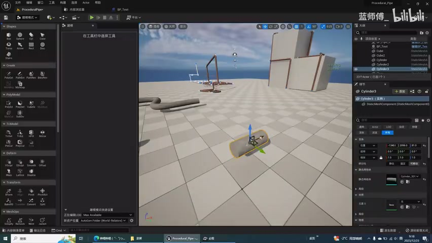
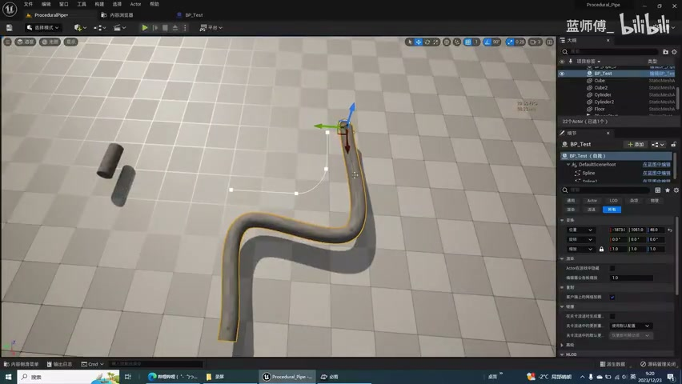

**参数、节点和风险点：**

- `蓝图`
- `Mesh`
- `Actor`
- `样条`
- `网格`
- `节点`
- `生成`
- `Pocedralripe`
- `test`
- `obe2`

### 把原始 Spline 当作输入，创建新的重采样 Spline；先清理默认点，再准备把计算出的新点逐个添加进去

**内容要点：**

- 把原始 Spline 当作输入，创建新的重采样 Spline；先清理默认点，再准备把计算出的新点逐个添加进去。

**关键截图：**

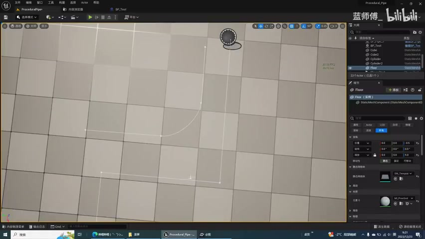
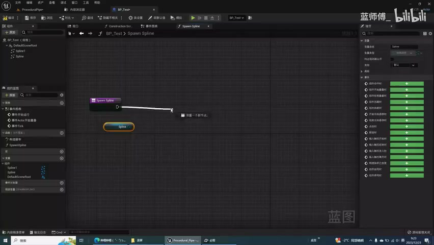

**参数、节点和风险点：**

- `Mesh`
- `Spawn`
- `样条`
- `网格`
- `生成`
- `supply`
- `Pocedrallpe`
- `Test`
- `Procedaalp`
- `qylinder`

### 遍历原始样条点时分开处理首点、末点和中间点，避免端点访问前后点越界，并保证新 Spline 的端点贴合原路径

**内容要点：**

- 遍历原始样条点时分开处理首点、末点和中间点，避免端点访问前后点越界，并保证新 Spline 的端点贴合原路径。

**关键截图：**

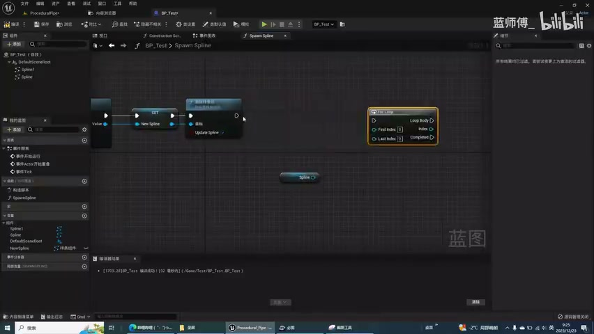
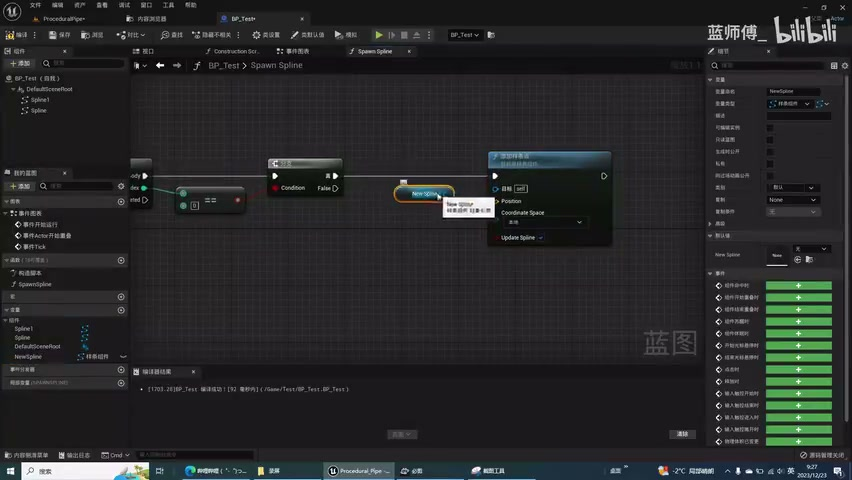

**参数、节点和风险点：**

- `Spline`
- `Spawn`
- `样条`
- `Pocedualfipe`
- `oP_Test`
- `BP_Test`
- `footnScr`
- `fBP_Test`
- `Test`
- `Deftcloot`

### 对中间段按沿样条距离采样：结合点索引、转角距离和原始 Spline 长度，计算新 Spline 中每个采样点的位置

**内容要点：**

- 对中间段按沿样条距离采样：结合点索引、转角距离和原始 Spline 长度，计算新 Spline 中每个采样点的位置。

**关键截图：**

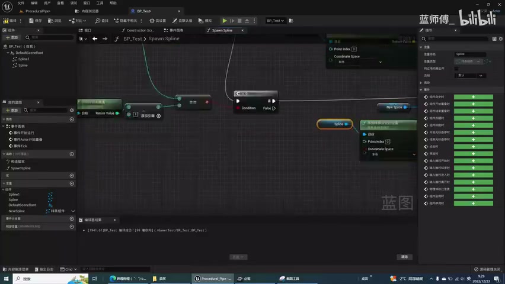
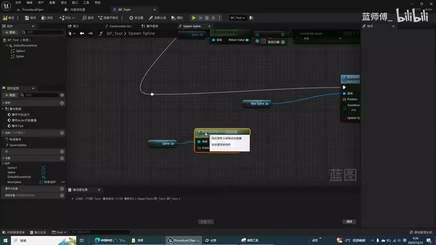

**参数、节点和风险点：**

- `Spline`
- `Spawn`
- `样条`
- `参数`
- `Pocedrallipe`
- `bpTes`
- `BP_Test`
- `Oonetcton`
- `Test`
- `Detcoot`

### 把重采样结果放回关卡测试，检查直线段和弯折段；如果直线段不直，优先怀疑新 Spline 点的切线没有正确设置

**内容要点：**

- 把重采样结果放回关卡测试，检查直线段和弯折段；如果直线段不直，优先怀疑新 Spline 点的切线没有正确设置。

**关键截图：**

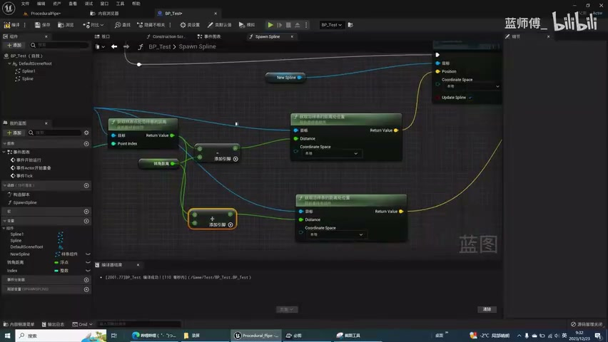
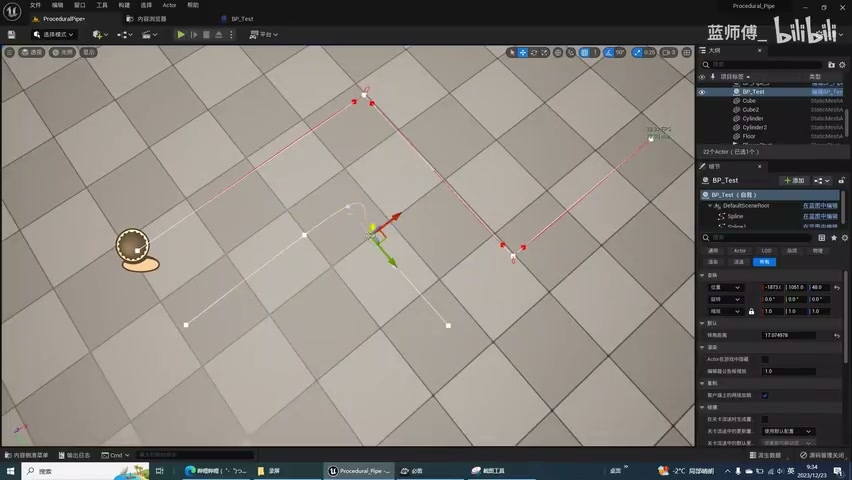

**参数、节点和风险点：**

- `Spline`
- `Spawn`
- `样条`
- `ProceduralPipe`
- `BP_Test`
- `fOoncten`
- `fBP_Test`
- `Test`
- `Defetcenloot`
- `spieel`

### 为新 Spline 点设置切线：直线段取原始 Spline 在对应距离处的切线，端点和中间点按索引分别设置

**内容要点：**

- 为新 Spline 点设置切线：直线段取原始 Spline 在对应距离处的切线，端点和中间点按索引分别设置。

**关键截图：**

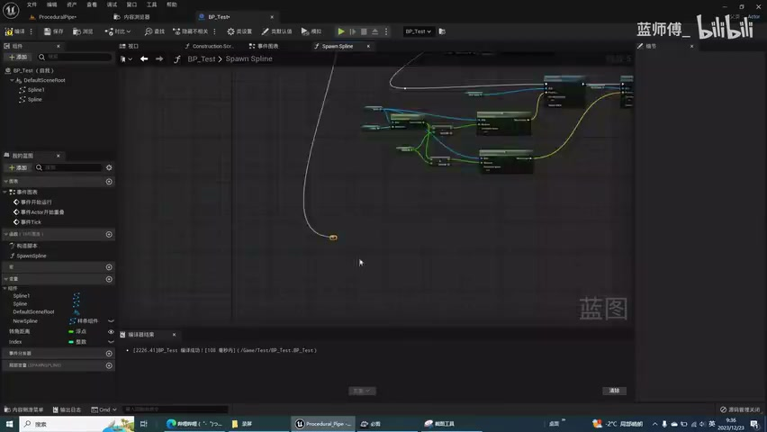
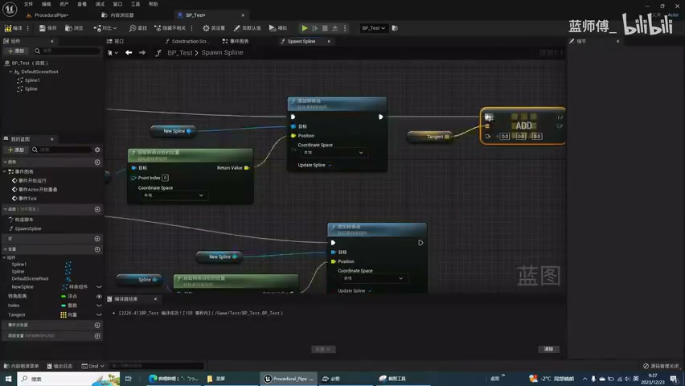

**参数、节点和风险点：**

- `Spline`
- `Spawn`
- `样条`
- `节点`
- `Test`
- `Constructon`
- `BP_Test`
- `BP_Tes`
- `Defautceeoot`
- `Ssplieel`

### 调整切线长度：用转角距离和方向向量控制弯曲幅度，必要时乘以系数，让拐角既不硬折也不过度弯曲

**内容要点：**

- 调整切线长度：用转角距离和方向向量控制弯曲幅度，必要时乘以系数，让拐角既不硬折也不过度弯曲。

**关键截图：**

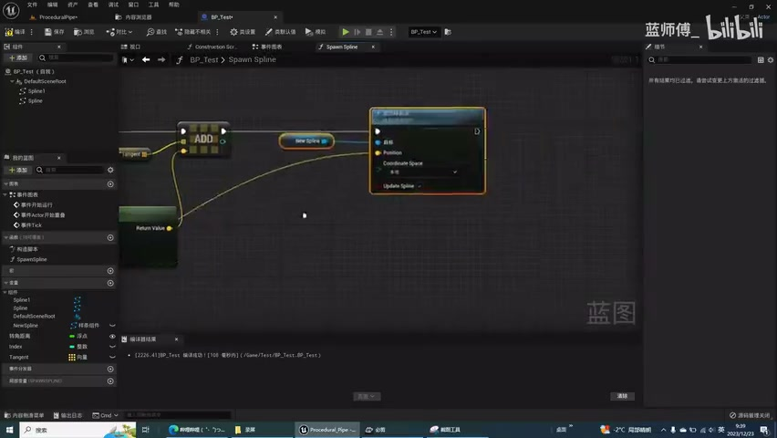
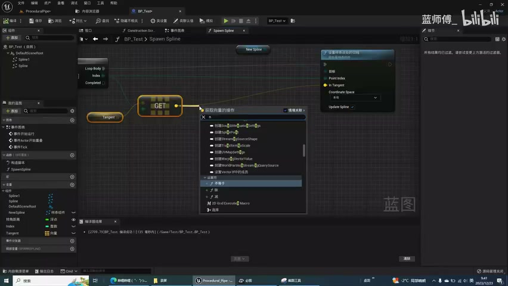

**参数、节点和风险点：**

- `Spline`
- `Spawn`
- `过滤`
- `ProceduralPipe`
- `DPTe`
- `BP_Test`
- `fconstructon`
- `fBP_Test`
- `P_Tes`
- `Defautcloot`

### 基于重采样后的 Spline 创建管道段：为每一段添加 Spline Mesh Component，设置起点/终点位置与切线

**内容要点：**

- 基于重采样后的 Spline 创建管道段：为每一段添加 Spline Mesh Component，设置起点/终点位置与切线。

**关键截图：**

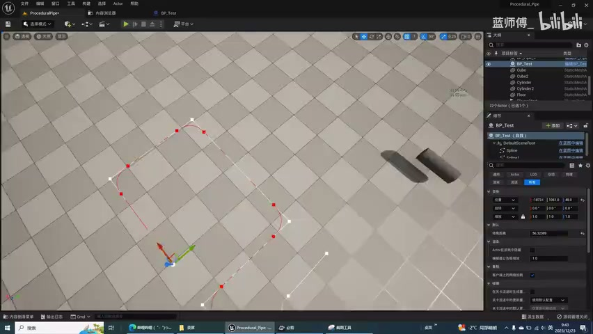
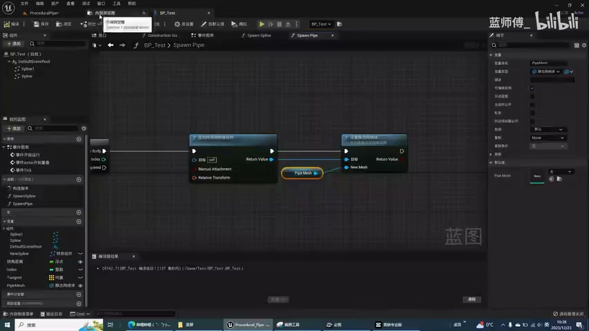

**参数、节点和风险点：**

- `Spawn`
- `样条`
- `网格`
- `采样`
- `生成`
- `Spawnpipe`
- `Proedrallpe`
- `Test`
- `cylnde`
- `obe2`

### 补齐材质、半径、连接件开关、连接处模型和细节模型替换，最终把蓝图整理成可复用的程序化管道工具

**内容要点：**

- 补齐材质、半径、连接件开关、连接处模型和细节模型替换，最终把蓝图整理成可复用的程序化管道工具。

**关键截图：**

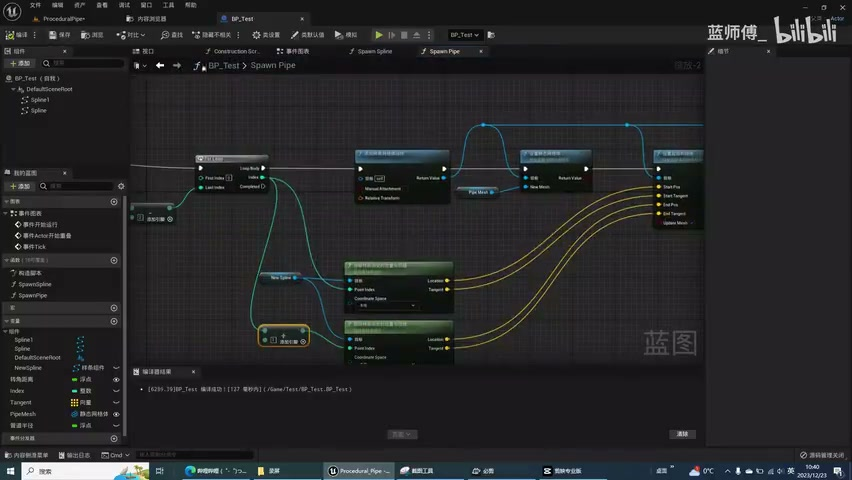
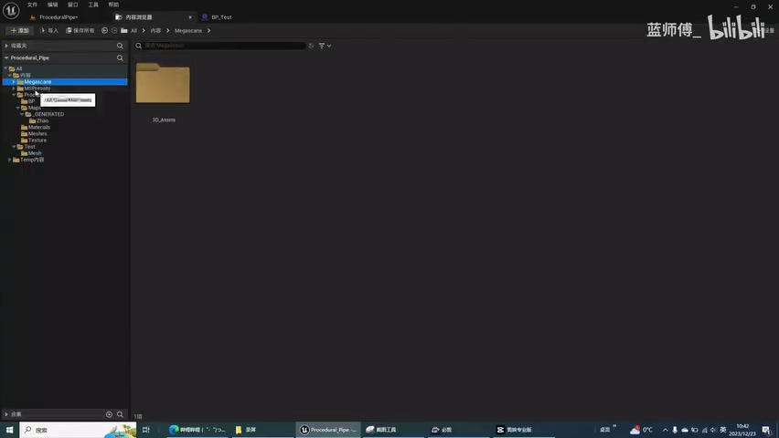

**参数、节点和风险点：**

- `Spawn`
- `样条`
- `网格`
- `材质`
- `生成`
- `ProceduralPipe`
- `Tesr`
- `fBP_Test`
- `SpawnPipe`
- `BP_Test`

## 复现检查清单

- 原始 Spline 与重采样 Spline 不要混用，调试时保留旧线便于对比直线段是否完全重合。
- 首点和末点必须特殊处理，否则循环里访问前后点时容易越界或导致端点切线错误。
- 直线段是否变弯，通常取决于切线方向和切线长度是否来自正确的沿样条距离。
- 转角距离过小会让拐角仍然很硬，过大又会吞掉短线段；应暴露为参数并在实例中调试。
- Spline Mesh 的起终点位置、切线、半径和材质设置要成组验证，避免只看到网格生成但变形方向错误。
- 复现时先固定随机种子，再调整密度、过滤和生成资源，避免随机结果掩盖逻辑错误。
