# 虚幻引擎5.4.4中制作PCG森林路径全流程

## 知识目标

- 围绕“虚幻引擎5.4.4中制作PCG森林路径全流程”整理 UE5 PCG 样条路径生成流程：复用 Electric Dreams 示例中的 PCG 子图和层级点复制逻辑，把设计师绘制的 Spline 转换为可生成道路、岩石、树木和边缘装饰的程序化路径工具。

## 可复现主流程

- 先建立示例工程上下文：打开 Electric Dreams/PCG 示例，定位 PCG Graphs、Spline Example、PCG Custom Graphs，并识别可复用的 Copy Points with Hierarchy 与 Apply Hierarchy 子图。
- 准备道路资产和路径蓝图：确认路径网格沿 X 轴朝向，整理道路段、岩石、树木等资产，并创建用于承载样条和 PCG 的 Actor Blueprint。
- 创建 PCG Graph 并读取样条输入：让 PCG 图表从蓝图或关卡中的 Spline 获取路径数据，生成沿路径分布的基础点集。
- 用 Copy Points with Hierarchy 和 Apply Hierarchy 继承 Electric Dreams 的层级逻辑，把 Mesh、Material Path 等属性挂到点上，供后续 Static Mesh Spawner 使用。
- 为道路本体设置 Mesh 与 Material Path 属性，并把转换后的点接入 Static Mesh Spawner，先确认道路能沿样条生成。
- 给岩石和边缘物体创建独立分支：用过滤、随机选择、自定义过滤或 Difference 把点集拆分，避免多类资产挤在同一个位置。
- 处理树木和小树分支：基于路径两侧的点做随机筛选、变换、缩放和朝向控制，让植被在道路边缘形成自然变化。
- 把道路、岩石、树木等分支组合回同一个 PCG 图表，检查每个分支的点数、资产路径、材质路径和生成顺序。
- 修正旋转和贴地问题：使用 Transform Points、点属性和角度计算，让实例跟随地面和路径方向，避免路面或装饰物出现穿插、漂浮或奇怪翻转。
- 最后在关卡中移动/编辑 Spline 进行复测，确认路径、边缘随机物体、植被、材质和层级复制逻辑都能随样条稳定更新。

## 关键术语

- `PCG`
- `Blueprint`
- `蓝图`
- `Static Mesh`
- `Mesh`
- `SubGraph`
- `Spline`
- `Transform`
- `Point`
- `Attribute`
- `Actor`
- `Component`
- `Spawn`
- `Grid`
- `Bounds`
- `Density`
- `Random`
- `Seed`

## 操作步骤与要点

### 先建立示例工程上下文：打开 Electric Dreams/PCG 示例，定位 PCG Graphs、Spline Example、PCG Custom Graphs，并识别可复用的 Copy Points with Hierarchy 与 Apply Hierarchy 子图

**内容要点：**

- 本段先展示目标效果：设计师在关卡中调整一条 Spline，PCG 会沿路径重建道路，并在道路两侧随机生成树木、岩石和植被。随后定位 Electric Dreams 示例关卡和 PCG Spline Example，说明本教程会复用官方示例中的路径生成逻辑。

**关键截图：**

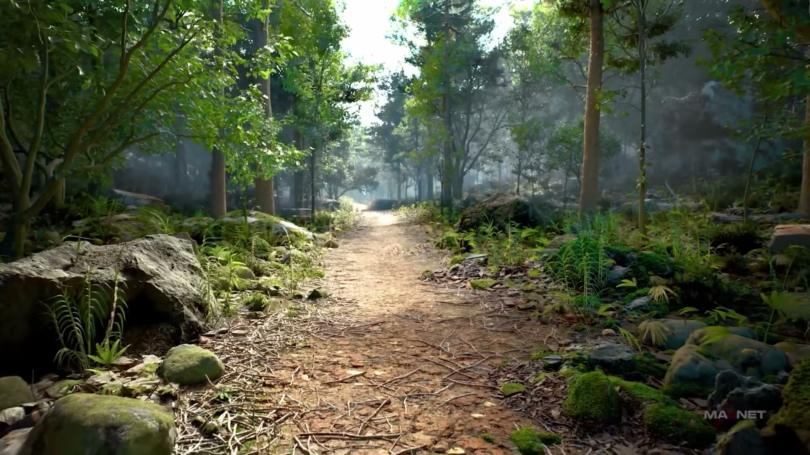

**参数、节点和风险点：**

- `PCG`
- `Mesh`
- `Actor`
- `Component`
- `体积`
- `森林`
- `tutorial`
- `Light`
- `ThirdPersonMap`
- `Magnet`

### 先建立示例工程上下文：打开 Electric Dreams/PCG 示例，定位 PCG Graphs、Spline Example、PCG Custom Graphs，并识别可复用的 Copy Points with Hierarchy 与 Apply Hierarchy 子图（2）

**内容要点：**

- 本段主要查找可复用资源：进入 PCG Custom Graphs，确认 Copy Points with Hierarchy、Apply Hierarchy 以及相关 Post Copy Points 蓝图可直接拿来继承层级属性。随后开始整理道路段、岩石等资产，并强调路径网格朝向要沿 X 轴。

**关键截图：**

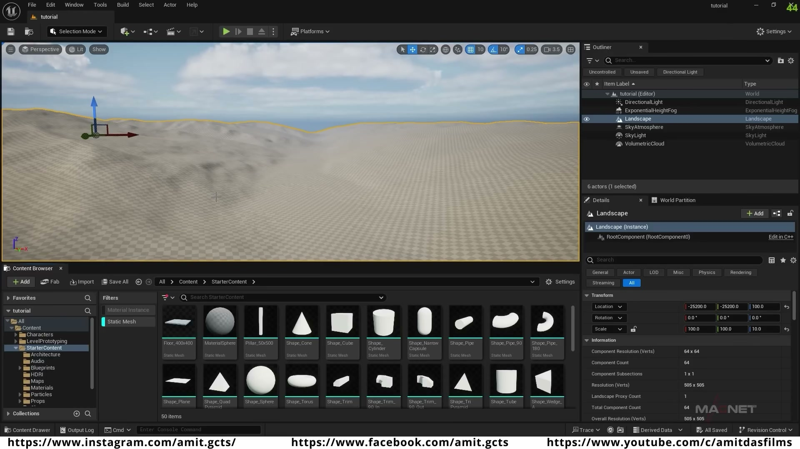

**参数、节点和风险点：**

- `Material`
- `Landscape`
- `网格`
- `材质`
- `过滤`
- `森林`
- `landscape`
- `Quixel`
- `Unreal`
- `Senji`

### 先建立示例工程上下文：打开 Electric Dreams/PCG 示例，定位 PCG Graphs、Spline Example、PCG Custom Graphs，并识别可复用的 Copy Points with Hierarchy 与 Apply Hierarchy 子图（3）

**内容要点：**

- 本段把资产和蓝图准备串起来：把岩石等候选资产放入便于选择的集合，创建 BP Desert Paths 一类的 Actor Blueprint，并开始建立用于路径生成的 PCG Graph，为后续读取 Spline 和生成点集做准备。

**关键截图：**

**参数、节点和风险点：**

- `Material`
- `Instance`
- `Landscape`
- `材质`
- `实例`
- `过滤`
- `Ground`
- `Mega`
- `texture`
- `Paint`

### 准备道路资产和路径蓝图：确认路径网格沿 X 轴朝向，整理道路段、岩石、树木等资产，并创建用于承载样条和 PCG 的 Actor Blueprint

**内容要点：**

- 本段进入 PCG 图表核心：添加 Copy Points with Hierarchy 与 Apply Hierarchy 子图，把 Mesh、Material Path 等属性写入点数据，再把点数据送入 Static Mesh Spawner，先让道路或基础资产能沿路径正确生成。

**关键截图：**

**参数、节点和风险点：**

- `Static Mesh`
- `Mesh`
- `Density`
- `Material`
- `Landscape`
- `网格`
- `材质`
- `过滤`
- `道路`
- `Grass`

### 准备道路资产和路径蓝图：确认路径网格沿 X 轴朝向，整理道路段、岩石、树木等资产，并创建用于承载样条和 PCG 的 Actor Blueprint（2）

**内容要点：**

- 本段处理岩石分支的过滤逻辑：因为多块岩石不能全部堆在同一点上，需要通过过滤、随机选择、Difference 或自定义过滤把点集拆分，让不同岩石在路径两侧有机会互斥分布。

**关键截图：**

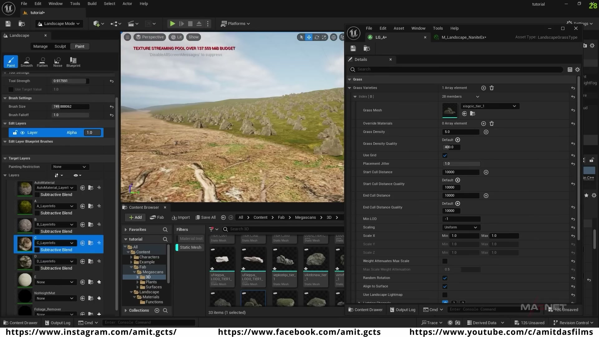

**参数、节点和风险点：**

- `PCG`
- `Static Mesh`
- `Mesh`
- `Spawn`
- `Landscape`
- `网格`
- `材质`
- `过滤`
- `采样`
- `节点`

### 创建 PCG Graph 并读取样条输入：让 PCG 图表从蓝图或关卡中的 Spline 获取路径数据，生成沿路径分布的基础点集

**内容要点：**

- 本段开始处理树木分支：复用前面已经拆好的点集，给树木创建独立的随机过滤、变换、缩放和朝向控制，让大树、小树能够沿道路边缘自然分布，而不是规则重复。

**关键截图：**

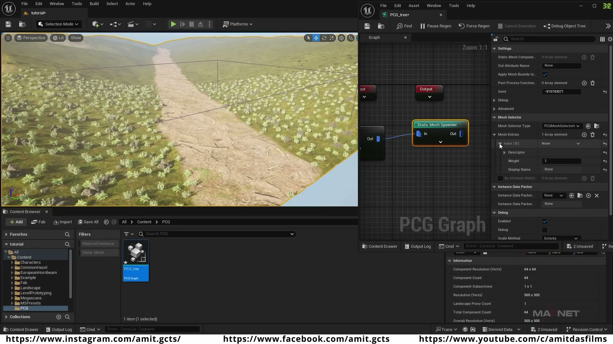

**参数、节点和风险点：**

- `PCG`
- `Static Mesh`
- `Mesh`
- `Attribute`
- `Density`
- `Graph`
- `网格`
- `属性`
- `过滤`
- `密度`

### 创建 PCG Graph 并读取样条输入：让 PCG 图表从蓝图或关卡中的 Spline 获取路径数据，生成沿路径分布的基础点集（2）

**内容要点：**

- 本段继续细化小树和随机分布：调整随机比例、最小值、属性过滤和标签，把不同植被分支分别接回图表，确保大树、小树、岩石各自使用正确的点集和资源路径。

**关键截图：**

**参数、节点和风险点：**

- `PCG`
- `Static Mesh`
- `Mesh`
- `Transform`
- `Point`
- `Material`
- `Landscape`
- `网格`
- `材质`
- `属性`

### 用 Copy Points with Hierarchy 和 Apply Hierarchy 继承 Electric Dreams 的层级逻辑，把 Mesh、Material Path 等属性挂到点上，供后续 Static Mesh Spawner 使用

**内容要点：**

- 本段把各个分支合并回完整道路系统：道路本体、岩石、树木、小树等分支都接入同一个 PCG 结构，通过过滤和 Transform 控制它们如何围绕路面分布，形成接近 Electric Dreams 示例的随机路径环境。

**关键截图：**

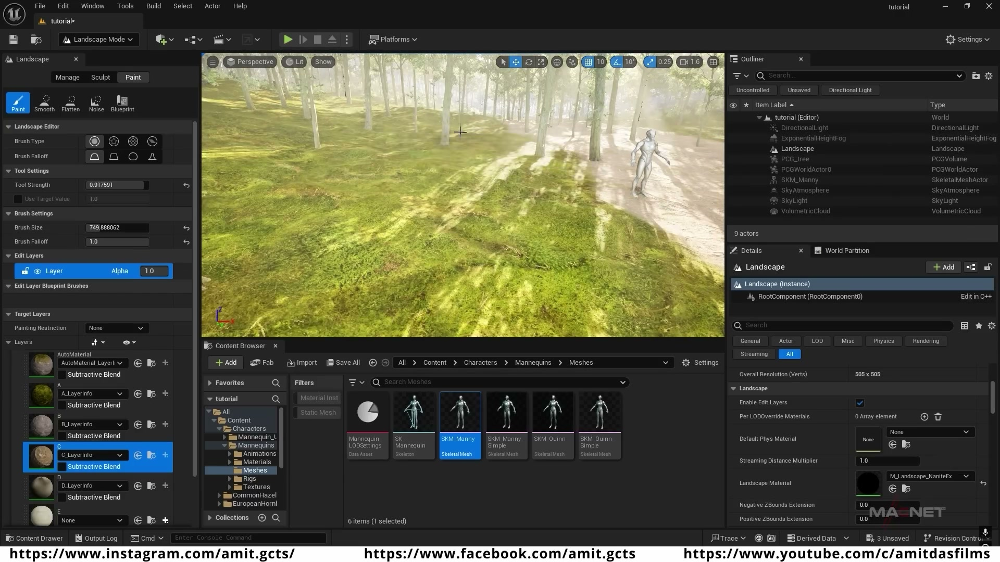

**参数、节点和风险点：**

- `PCG`
- `Blueprint`
- `蓝图`
- `Spline`
- `Actor`
- `Landscape`
- `样条`
- `tutorial`
- `shift`
- `LandscapeModev`

### 用 Copy Points with Hierarchy 和 Apply Hierarchy 继承 Electric Dreams 的层级逻辑，把 Mesh、Material Path 等属性挂到点上，供后续 Static Mesh Spawner 使用（2）

**内容要点：**

- 本段重点解决道路段与 Spline 的连接问题：如果直接把网格段接到 Spline 点，转角和高度变化容易产生缝隙或错位；需要在中间增加点、根据网格长度偏移位置，并保证点与 Spline 起点、路径方向一致。

**关键截图：**

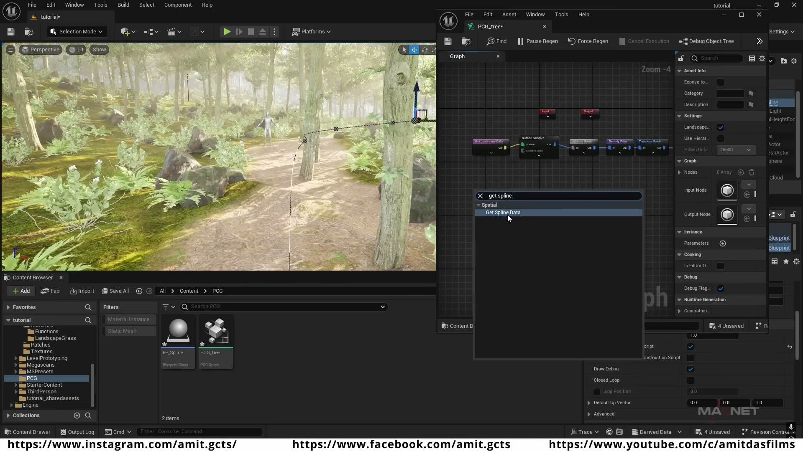
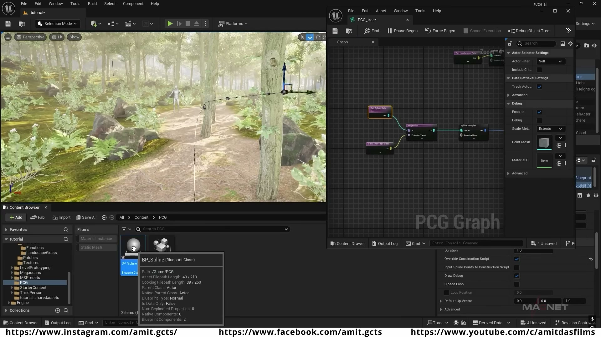

**参数、节点和风险点：**

- `PCG`
- `Blueprint`
- `蓝图`
- `Spline`
- `Actor`
- `Component`
- `Density`
- `Graph`
- `Landscape`
- `样条`

### 为道路本体设置 Mesh 与 Material Path 属性，并把转换后的点接入 Static Mesh Spawner，先确认道路能沿样条生成

**内容要点：**

- 本段修正最终 Transform：拆分点的 Transform，把 X/Y/Z 位移或旋转按路径点计算后重新组合，使道路和装饰物能跟随地形坡度与路径角度。最终通过移动 Spline 验证生成结果能稳定更新，减少漂浮、穿插和翻转问题。

**关键截图：**

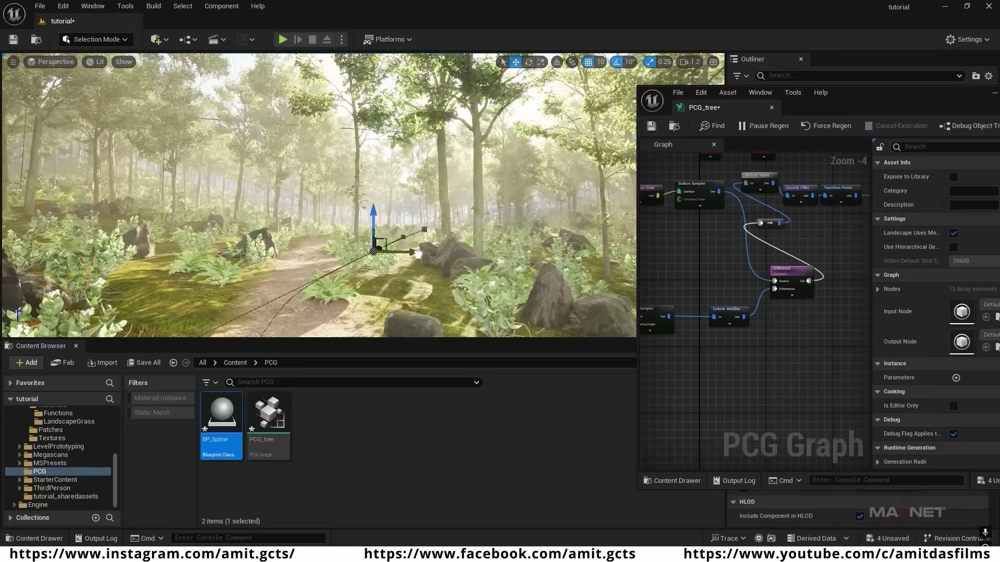

**参数、节点和风险点：**

- `PCG`
- `Actor`
- `Component`
- `Graph`
- `Material`
- `Landscape`
- `样条`
- `网格`
- `材质`
- `过滤`

### 为道路本体设置 Mesh 与 Material Path 属性，并把转换后的点接入 Static Mesh Spawner，先确认道路能沿样条生成（2）

**视频内容贴合整理：**

**内容要点：**

- 为道路本体设置 Mesh 与 Material Path 属性，并把转换后的点接入 Static Mesh Spawner，先确认道路能沿样条生成（2）。

**关键截图：**

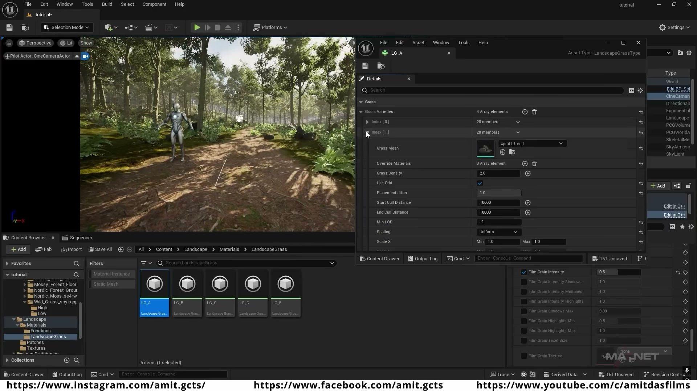

**参数、节点和风险点：**

- `Static Mesh`
- `Mesh`
- `Actor`
- `Component`
- `Density`
- `Material`
- `Landscape`
- `网格`
- `过滤`
- `密度`

### 给岩石和边缘物体创建独立分支：用过滤、随机选择、自定义过滤或 Difference 把点集拆分，避免多类资产挤在同一个位置

**视频内容贴合整理：**

**内容要点：**

- 给岩石和边缘物体创建独立分支：用过滤、随机选择、自定义过滤或 Difference 把点集拆分，避免多类资产挤在同一个位置。

**关键截图：**

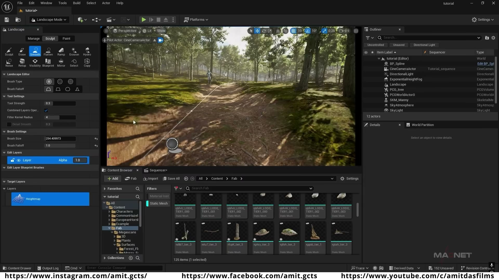

**参数、节点和风险点：**

- `PCG`
- `蓝图`
- `Static Mesh`
- `Mesh`
- `Spline`
- `Transform`
- `Point`
- `Actor`
- `Spawn`
- `Material`

### 给岩石和边缘物体创建独立分支：用过滤、随机选择、自定义过滤或 Difference 把点集拆分，避免多类资产挤在同一个位置（2）

**视频内容贴合整理：**

**内容要点：**

- 给岩石和边缘物体创建独立分支：用过滤、随机选择、自定义过滤或 Difference 把点集拆分，避免多类资产挤在同一个位置（2）。

**关键截图：**

**参数、节点和风险点：**

- `PCG`
- `Spline`
- `Transform`
- `Point`
- `Actor`
- `Spawn`
- `Graph`
- `Material`
- `Landscape`
- `样条`

### 处理树木和小树分支：基于路径两侧的点做随机筛选、变换、缩放和朝向控制，让植被在道路边缘形成自然变化

**视频内容贴合整理：**

**内容要点：**

- 处理树木和小树分支：基于路径两侧的点做随机筛选、变换、缩放和朝向控制，让植被在道路边缘形成自然变化。

**关键截图：**

**参数、节点和风险点：**

- `PCG`
- `Static Mesh`
- `Mesh`
- `Spline`
- `Actor`
- `Spawn`
- `网格`
- `过滤`
- `采样`
- `密度`

### 处理树木和小树分支：基于路径两侧的点做随机筛选、变换、缩放和朝向控制，让植被在道路边缘形成自然变化（2）

**视频内容贴合整理：**

**内容要点：**

- 处理树木和小树分支：基于路径两侧的点做随机筛选、变换、缩放和朝向控制，让植被在道路边缘形成自然变化（2）。

**关键截图：**

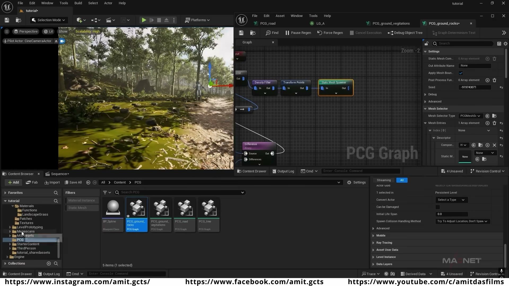

**参数、节点和风险点：**

- `PCG`
- `Static Mesh`
- `Mesh`
- `Transform`
- `Point`
- `Actor`
- `Graph`
- `Landscape`
- `网格`
- `过滤`

### 把道路、岩石、树木等分支组合回同一个 PCG 图表，检查每个分支的点数、资产路径、材质路径和生成顺序

**视频内容贴合整理：**

**内容要点：**

- 把道路、岩石、树木等分支组合回同一个 PCG 图表，检查每个分支的点数、资产路径、材质路径和生成顺序。

**关键截图：**

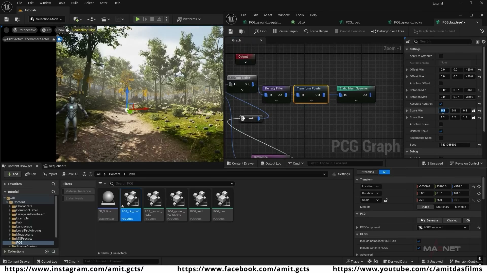
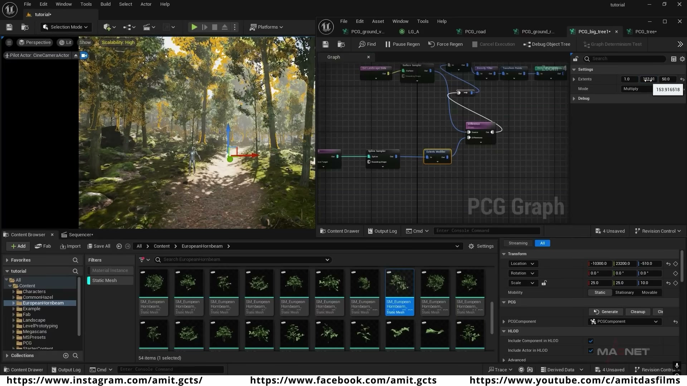

**参数、节点和风险点：**

- `PCG`
- `Static Mesh`
- `Mesh`
- `Transform`
- `Actor`
- `Spawn`
- `Graph`
- `Landscape`
- `网格`
- `体积`

### 把道路、岩石、树木等分支组合回同一个 PCG 图表，检查每个分支的点数、资产路径、材质路径和生成顺序（2）

**视频内容贴合整理：**

**内容要点：**

- 把道路、岩石、树木等分支组合回同一个 PCG 图表，检查每个分支的点数、资产路径、材质路径和生成顺序（2）。

**关键截图：**

**参数、节点和风险点：**

- `PCG`
- `Static Mesh`
- `Mesh`
- `Transform`
- `Point`
- `Actor`
- `Spawn`
- `Graph`
- `Landscape`
- `网格`

### 修正旋转和贴地问题：使用 Transform Points、点属性和角度计算，让实例跟随地面和路径方向，避免路面或装饰物出现穿插、漂浮或奇怪翻转

**视频内容贴合整理：**

**内容要点：**

- 修正旋转和贴地问题：使用 Transform Points、点属性和角度计算，让实例跟随地面和路径方向，避免路面或装饰物出现穿插、漂浮或奇怪翻转。

**关键截图：**

**参数、节点和风险点：**

- `Spline`
- `Actor`
- `密度`
- `Directional`
- `Light`
- `Sequencer`
- `tutorial`
- `Whose`
- `Selection`
- `shift`

### 修正旋转和贴地问题：使用 Transform Points、点属性和角度计算，让实例跟随地面和路径方向，避免路面或装饰物出现穿插、漂浮或奇怪翻转（2）

**视频内容贴合整理：**

**内容要点：**

- 修正旋转和贴地问题：使用 Transform Points、点属性和角度计算，让实例跟随地面和路径方向，避免路面或装饰物出现穿插、漂浮或奇怪翻转（2）。

**关键截图：**

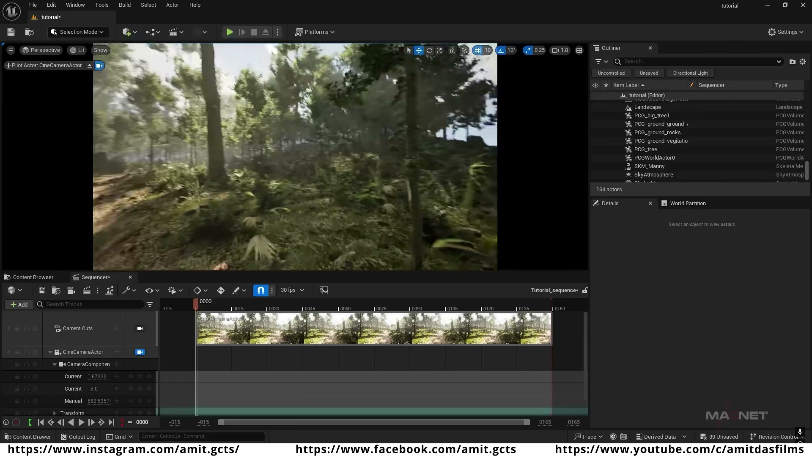

**参数、节点和风险点：**

- `PCG`
- `Static Mesh`
- `Mesh`
- `Actor`
- `Landscape`
- `网格`
- `过滤`
- `tutorial`
- `Sequencer`
- `Static`

### 最后在关卡中移动/编辑 Spline 进行复测，确认路径、边缘随机物体、植被、材质和层级复制逻辑都能随样条稳定更新

**视频内容贴合整理：**

**内容要点：**

- 最后在关卡中移动/编辑 Spline 进行复测，确认路径、边缘随机物体、植被、材质和层级复制逻辑都能随样条稳定更新。

**关键截图：**

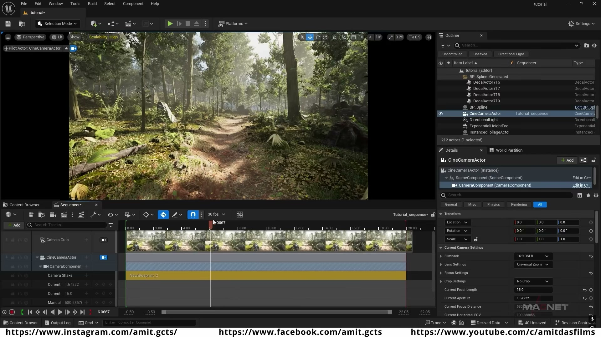

**参数、节点和风险点：**

- `蓝图`
- `Static Mesh`
- `Mesh`
- `Actor`
- `网格`
- `过滤`
- `Shake`
- `Camera`
- `Movie`
- `Render`

### 最后在关卡中移动/编辑 Spline 进行复测，确认路径、边缘随机物体、植被、材质和层级复制逻辑都能随样条稳定更新（2）

**视频内容贴合整理：**

**内容要点：**

- 最后在关卡中移动/编辑 Spline 进行复测，确认路径、边缘随机物体、植被、材质和层级复制逻辑都能随样条稳定更新（2）。

**关键截图：**

**参数、节点和风险点：**

- `PCG`
- `Actor`
- `材质`
- `Temporal`
- `Sample`
- `Count`
- `Override`
- `anti`
- `aliasing`
- `Frame`

## 复现检查清单

- 路径网格必须沿正确轴向建模，视频中强调沿 X 轴，否则 Spline Mesh 或点实例会整体朝向错误。
- Mesh 与 Material Path 属性名要和 Static Mesh Spawner/子图读取的一致，属性拼写错误会导致资产不生成或材质丢失。
- 岩石、树木、小树等分支应先用点调试确认互斥关系，再接 Spawner，避免同一点重复生成多个资产。
- 随机过滤和 Density/Filter 分支要保持可调参数，方便在不同路径长度和场景密度下复用。
- 旋转修正不能只看道路平面，还要检查地形坡度和路径转弯处的实例方向。
- 复现时先固定随机种子，再调整密度、过滤和生成资源，避免随机结果掩盖逻辑错误。
