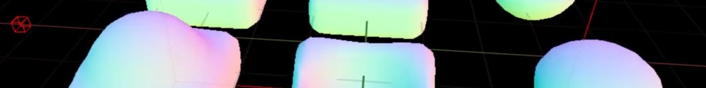

# 使用 Niagara 在虚幻引擎中开发行进立方体插件

- 来源: https://dev.epicgames.com/community/learning/tutorials/wvGG/developing-a-marching-cube-plug-in-in-unreal-engine-with-niagara
- 原文标题: Developing a Marching Cube Plug-In in Unreal Engine With Niagara

## 由 80 Level 与虚幻引擎合作呈现

自 Niagara Fluids 插件发布以来，Twitter 上涌现出了许多有趣的流体模拟特效。虽然大多数特效都使用光线步进法渲染 SDF 文件，但我更想探索基于网格的方法。为此，我编写了一个小型插件，可以轻松集成到 Niagara 系统中，用于从 SDF 文件生成网格。

虽然行进立方体算法并非新技术，但我找不到任何能与 Niagara 完美集成的现有解决方案。我的第一个实现基于我 在虚幻引擎 4 中使用计算着色器搭建的行进立方体算法。它是一个代码插件，因此需要对引擎进行一些修改才能与 Niagara 兼容。遗憾的是，由于需要修改引擎，我无法轻易地将其分享给社区。

在寻找替代方案的过程中，我偶然发现了 erindale_xyz 的 Geometry Nodes 直播，他尝试在 Blender 中实现类似的功能。由于几何节点是在 CPU 上计算的，因此速度可能较慢，但他的技术启发我使用 Niagara 和顶点变形来实现该技术的 GPU 版本。 Theory 理论

由于行进立方体算法是一种众所周知的技术，我不会详细介绍其工作原理，而是专注于插件的实现。您可以参考以下资料以更好地了解行进立方体算法：

## 编程冒险：塞巴斯蒂安·拉格的《行进立方体》

## 保罗·伯克的《标量场的多边形化》

行进立方体算法的主要组成部分可以概括如下：

我们需要将一个标量场渲染为等值面。在本例中，它将是体积纹理 (VolumeTexture)、体积目标 (VolumeTarget) 或栅格化为体积渲染目标 (VolumeRenderTarget) 的粒子。

使用网格以固定的间隔对标量场进行采样。在我们的例子中，这些采样点将是生成在网格上的粒子。

一种为网格中的每个单元格发射三角形的方法。这是通过渲染实例化粒子来实现的。

现在，让我们看看插件是如何处理这些组件的。 Scalar Field 标量场

支持 VolumeTexture 和 VolumeRenderTarget，可以轻松设置为对外部纹理的引用或在 Niagara 内渲染。 Grid 网格

内置了在网格中生成粒子的功能，提供了调整网格分辨率和缩放的控件，这是控制行进立方体分辨率所必需的。 Modules Setup Marching Cube Grid and Grid Location make sure that the particles are spawned uniformly on a grid which allows scaling, rotating,

模块 设置行进立方体网格 和 网格位置 确保粒子在网格上均匀生成，从而允许自由缩放、旋转和平移父发射器。

网格分辨率 控制每个轴上的单元格数量。可以通过调整此设置来增加/减少行进立方体算法的分辨率。

局部范围 是指网格在局部空间中的大小，如下图中的红色线框立方体所示。

在网格上生成的粒子。

由于行进立方体在等值面附近发射三角形，我们可以观察到网格中的大部分空间都是空的。这意味着发射器会渲染粒子并丢弃渲染的数据。为了优化设置，我们可以遍历粒子并根据等值面检查结果将其隐藏。这由插件提供的`PrepareRenderState_Texture`和`PrepareRenderState_RenderTarget`模块处理。

添加可见性检查会减少渲染的粒子数量。

## 发射三角形

系统看起来仍然很粗糙，完全不像光滑的表面。为了解决这个问题，我们需要沿着网格单元边缘对三角形顶点进行插值。这可以通过使用 MF_MarchingCube 材质函数来实现，该函数使用 PrepareRenderState_* 模块导出的粒子数据。

由于每个单元格导出的三角形数量可能在 3 到 15 个之间变化，我们需要一个至少包含 15 个三角形的静态网格体，并动态剔除材质内部不需要的三角形。要剔除材质内部的三角形，我们可以将 WorldPositionOffset 设置为 -WorldPosition。这会使三角形退化，在像素着色时不会被考虑，从而节省一些像素着色器的工作量。

默认的 M_MarchingCube 材质是实现行进立方体算法所需的最小材质。用户可以使用 MF_MarchingCube 函数创建自定义材质，以调整顶点 WPO 和法线。

在现有系统中添加行进立方体

该插件附带了一些 Niagara 系统示例，展示了如何使用纹理和渲染目标进行设置。以下是其中一个示例。

在这个例子中，我将使用 Niagara Fluids 插件提供的 ParticleSurfacing 效果。ParticleSurfacing 发射器可以从粒子生成 SDF（表面形变函数），这将为如何使用该插件处理粒子提供一个很好的参考。

1. System Changes 1. 系统变更

由于行进立方体发射器需要访问由粒子表面发射器修改的 SDF 渲染目标，我们将在系统级别添加一个新的渲染目标，以便所有发射器可以共享同一个纹理。

2. 粒子表面发射器的变化

我们需要将所有对 SimRT 的引用替换为系统提供的 MarchingCubeSDF 渲染目标。

3. NE_MarchingCube emitter

3. NE_MarchingCube 发射器

现在我们将添加由 MarchingCube 插件提供的发射器，并将引用设置为 MarchingCubeSDF 渲染目标。

搞定！你已经实现了你的第一个行进立方体算法！

如果想了解更高级的应用场景，可以看看 尼亚加拉激光特效。我的 推特 上也有关于激光特效的简要介绍。

## Amit Mehar，3D 艺术家和开发人员

## 了解更多关于尼亚加拉流体公司的信息

## 虚幻引擎关于行进立方体算法的文档

## 阿米特·梅哈尔推特 Amit Mehar Gumroad Download the plug-in for free!

## 免费下载插件！
