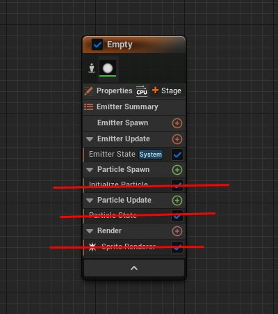
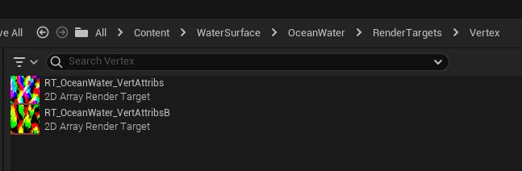
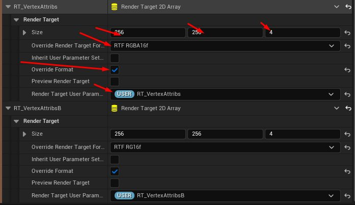
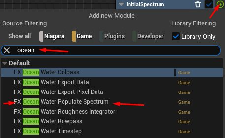
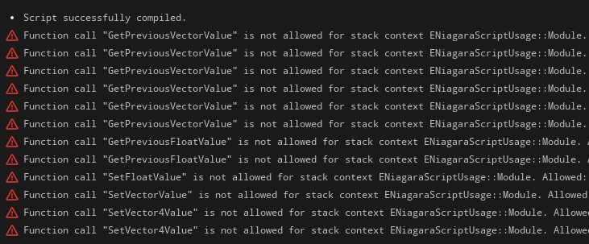

# 海洋模拟

- 来源: https://dev.epicgames.com/community/learning/tutorials/qM1o/unreal-engine-ocean-simulation
- 原文标题: Ocean Simulation

## 来自 Deathrey 的海洋视频（Vimeo 版） ---

## 以画中画模式播放

## (打开新窗口）

## Ocean_Video

## Deathrey

## 喜欢

添加到稍后观看

## 分享

## 播放

00:17

## 双语字幕

设置

## 画中画

## 引言

在本文中，我将展示在尼亚加拉系统中创建海洋表面模拟系统的示例。 What is required: 所需材料：

## 虚幻引擎 5.1 或 5.3

## DirectX 12 compatible GPU

## 兼容 DirectX 12 的 GPU

## 对尼亚加拉瀑布有基本的了解

选择你喜欢的文本编辑器。（例如：Notepad++）

## 大约5小时的空闲时间

版本 5.1 的项目文件可在本教程的最后一节中找到。 升级到 5.3 所需的更改已在本帖中列出。

## 内容

## 教程将分为以下几个部分： Overview 概述

## 系统和发射器创建

## 用户参数设置

## 发射器生成脚本

## 发射器更新脚本

## 频谱生成模拟阶段

## 频谱滴答模拟阶段

## 逆快速傅里叶变换阶段

## 泡沫模拟和属性导出阶段

## Roughness integrator stage

## 粗糙度积分器阶段

## 海洋物质的创造

## 参数探索

1. Overview 1. 概述

自实时渲染技术诞生以来，如何渲染出逼真的海洋表面一直是一个挑战。

本质上，这很简单。你只需要将几个波形信号相加即可。唯一的问题是，这里的“几个”至少意味着几千个。 Traditionally, as soon as texturing became available,

传统上，纹理贴图技术出现后，制作海洋表面的任务主要围绕着在表面平移一个或多个纹理展开。这种方法至今仍然可行，但缺乏真实感。随着硬件的进步，以及灵活可编程的顶点着色器和像素着色器的应用，一种直接在着色器中计算波浪叠加的方法应运而生。如果您正在阅读本文，很可能您已经尝试在材质编辑器中实现基本的格斯特纳波。虽然这种方法灵活且逼真，但即使在今天，指望拥有足够的处理能力直接在着色器中计算超过 30 个解析波信号仍然有些天真。

这两个极端促使人们开发了许多技术和诀窍。其中一种方法是将波浪逐帧渲染成纹理，然后在水着色器中使用该纹理。虽然这在速度上确实有所提升（因为纹理的像素数量少于屏幕），但这距离处理成千上万个波浪的理想状态还相差甚远。不过，从整体来看，这种方法行之有效，而且效果非常好。

这就是我们目前的进度。每一帧都会生成一个纹理，其中每个纹素代表一个离散位置，并包含海平面高度数据。对于每个这样的纹素，我们需要计算所有单独的波浪信号。对于一个普通的 256x256 纹理和 30 个波浪，我们需要计算正弦函数的值 1966080 次。毋庸置疑，即使对于 GPU 来说，这也是一项相当繁重的运算。

但是，如果我们使用的波并非完全任意呢？想象一下，一个波长任意的正弦波在纹理中沿特定方向（向左或向右）传播。我们需要对这样的正弦波函数进行多少次计算？256 次。如果我们再添加一个波长恰好短两倍的波呢？你会发现，至少有一半的点可以在两个波之间重复使用。

正是由于这种在离散网格上评估重复信号的基本特性，我们才能作弊并加快速度。

快速傅里叶变换完全基于这一特性。 I will not dive into math here, but to establish basics,

我不会在这里深入探讨数学，但为了建立基本概念，每个信号都可以看作是分解成一定数量的正弦和余弦。

在我们的例子中，高度纹理是一个场，它描述了空间中每个点的高度与位置之间的关系。这就是空间域，即高度随空间的变化。现在，如果你认为每个点的高度仅仅是不同长度的正弦和余弦函数的总和，那么同样的数据也可以用不同的方式表示，即表示为一组随频率变化的振幅和相位。这就是傅里叶域或频域，即振幅和相位随频率的变化。

傅里叶变换是一种将空间域转换为频域的运算。正变换是从空间域到频域的转换，逆变换是从频域到空间域的转换。 Fast Fourier transform is the same operation,

快速傅里叶变换是相同的操作，但它使用了一种利用前面提到的特性的算法。

基于此，我们将用傅里叶域来定义水的高度场。记住，它是振幅和相位随频率的变化关系。 Amplitude and phase is described by a complex number (or a vector, if it is easier to visualize for you). Direction of such vector describes phase,

振幅和相位可以用复数（或者向量，如果您觉得这样更容易理解）来描述。该向量的方向表示相位，其长度表示振幅。频率由网格上的位置决定。更具体地说，频率等于到网格中心的距离。我们还有波的方向，同样由网格上的位置决定。波的方向是一个从中心到当前网格点的向量，没什么特别的。网格边缘的网格点频率最高，靠近中心的网格点频率最低。从现在开始，我们将频率和方向作为一个组合值来讨论，即波矢量。它的方向表示波的方向，其大小是频率的倒数。

这就是频率域上的复振幅场。在教程末尾提供的参考资料中，通常将其命名为 h0~(k)，表示从波矢开始的初始复振幅。

而这正是我们将在尼亚加拉地区实施的方案。 At first,

首先，我们将生成一个随机复振幅场并控制其分布。 Then, each frame, we will be changing phase of each wave signal by a function of its frequency and time, that passed between two frames. And that is really all there is about our heightfield. Change phase of initial complex amplitude to a specific time. Established notation for this step is h~(h0, k,t), meaning complex amplitude from initial complex amplitude, wavector and time. Any formula, that you might be seeing in the reference,

然后，在每一帧中，我们将根据每个波信号的频率和时间（即两帧之间的时间间隔）来改变其相位。这就是我们高度场的全部内容。改变初始复振幅在特定时间的相位。 此步骤的常用符号是 h~(h0, k, t)，表示由初始复振幅、波矢量和时间得到的复振幅。 您在参考文献中看到的任何公式，此时都涉及对复数的运算，这可能一开始会让人感到困惑。

## 这个公式的意思很简单：

## 由波向量 k 和时间 t 得到的复振幅等于：

初始复振幅乘以波矢 k 的初始角频率指数，再乘以时间……

plus... 更多的...

负波矢 k 的共轭复振幅，乘以初始角频率的指数的共轭，再乘以时间。

其中指数为复数，使用欧拉公式计算。 So, all in all,

所以，总共是两次乘法和一次加法。但这些都是在复数上进行的。 Complex amplitude h0 we have from previous step. Angular frequency we can set to whatever we want, but for ocean waves,

复振幅 h0 是我们从上一步得到的。角频率可以任意设置，但对于海浪而言，波矢长度和角频率之间存在既定的关系。时间则来自我们的模拟结果。 Now, the logical question you might have at this point,

现在，你可能会问，共轭振幅到底是什么，它又是从何而来呢？

复数的共轭运算是将其虚部乘以-1。至于频率的来源，频率可以是正数也可以是负数，正如空间域中的位置可以是正数也可以是负数一样。当我们越过零频率点并进入负频率时，频谱将与正频率部分完全镜像，相位也随之镜像。

将复数值的虚部乘以 -1，就能得到频谱在负频率处的镜像部分。理论上，我们可以选择不计算负频率，但这会造成浪费，因为计算负频率会使有效波数翻倍。

之后，我们将对这些数据进行逆快速傅里叶变换，结果将是高度图。准确地说，是位移图，因为除了高度之外，我们还会生成水平位移。

然后我们将处理置换贴图，以便在着色器中使用，并创建一个基本材质来预览结果。 And we will be doing that 4 times at once, giving us 4 different textures for different scale,

我们将同时进行 4 次这样的操作，从而得到 4 种不同尺度的纹理，并将它们组合成材质。

最后，我们将探讨不同的参数值如何冲击效果模拟，并讨论改进方法。

考虑到这一点，让我们进入下一步，创建和设置尼亚加拉系统。 2.

2. 系统和发射器创建

在内容浏览器中右键单击并创建一个空的尼亚加拉系统。

在 Niagara 编辑器中打开新创建的系统。

添加一个空发射器。

根据你的喜好重命名发射器

在发射器属性中将模拟目标更改为 GPU 计算模拟。

将“计算边界”模式设置为可编程。

删除粒子生成、粒子更新和渲染中现有的模块。



3.

现在我们将创建一组用户参数来控制该系统，并简要介绍它们的功能。

我们将使用 Vector4 参数，其中每个分量 XYZW 存储相应级联的值。

参数按以下方式分组： PerCascadeParameters: 按级联参数： WindDirectionality - Controls removal of waves, travelling against the wind for each cascade , Vector4

风向性 - 控制波浪的移除，每次级联都逆风传播， 矢量 4

## 各级联的 振幅 -位移缩放因子， 矢量 4

## 波动性 - 控制每次级联的水平位移幅度， 矢量 4

## 每个级联的长度（以米为单位）， Vector4

## 控制每个级联的短波衰减， Vector4

## 控制每个级联的长波去除， Vector4

## 控制每个级联波浪垂直于风向的衰减， Vector4

## PerCascadeFoamParameters:

## 泡沫注入 - 控制每次级联注入的泡沫量， 矢量 4

每次级联中泡沫注入发生区域的大小偏差， Vector4

## 控制泡沫随时间消散的速度， Vector4

## 控制泡沫在空间中消散的速度， 矢量 4

## WindControl:

风控： WindSpeed - Speed of wind in meters per second, float

## 风速 - 风速，单位为米/秒， 浮点数

## 风向 - 风的方向，以度为单位， 浮动

其他： Gravity - Gravity force, in meters per second squared, float

## 重力 - 重力，单位为米每秒平方， 浮标

重复周期 - 以秒为单位，模拟完成一次完整循环所需的时间， 浮点数

渲染目标 A： RT_PixelAttributes_Casc0 - Render target 2D, that stores pixel attributes for cascade 0,

渲染目标，用于存储级联 0 的像素属性， 纹理渲染目标

渲染目标 2D，用于存储级联 1 的像素属性， 纹理渲染目标

渲染目标 2D，用于存储级联 2 的像素属性， 纹理渲染目标

渲染目标 2D，用于存储级联 3 的像素属性， 纹理渲染目标

渲染目标二维数组，用于存储所有级联的顶点属性， 纹理渲染目标

渲染目标 B： RT_PixelAttributesB_Casc0 - Render target 2D, that stores pixel attributes for cascade 0,

渲染目标 2D，用于存储级联 0 的像素属性， 纹理渲染目标

渲染目标 2D，用于存储级联 1 的像素属性， 纹理渲染目标

渲染目标 2D，用于存储级联 2 的像素属性， 纹理渲染目标

渲染目标 2D，用于存储级联 3 的像素属性， 纹理渲染目标

渲染目标二维数组，用于存储所有级联的顶点属性， 纹理渲染目标

粗糙度： RoughnessPower - Controls how fast roughness increases with distance, float

粗糙度强度 - 控制粗糙度随距离增加的速度， 浮动

## 控制粗糙度积分收敛所需的帧数，整数

渲染目标 2D，用于存储粗糙度查找表， 纹理渲染目标

创建用户参数后，我们可以按照以下屏幕截图设置其默认值，并且需要在内容浏览器中创建渲染目标资源。

我们将把顶点属性存储在两个渲染目标数组中，每个级联一个切片。 First array will store displacement along X,Y, Z

第一个数组将存储沿 X、Y、Z 轴的位移以及先前沿 X 轴的位移。 Second array will store previous displacement along Y,Z axes.

第二个数组将存储之前沿 Y、Z 轴的位移。

像素属性将存储在每个级联的单独渲染目标中。 Render target

## 渲染目标

渲染目标 B 将存储 2 个衍生值：泡沫和表面拉伸。

我们还需要一个渲染目标来存储粗糙度预积分的结果。

此时，请在内容浏览器中创建渲染目标资源，并将其与相应的用户参数关联。您可以将所有渲染目标设置保留为默认值，因为我们将在 Niagara 中进行更改。



4. Emitter spawn scripts 4. 发射器生成脚本

现在我们将创建用于启动发射器的模块。

## 我们将有3个：

设置初始值 - 在这里我们将对用户参数进行一些处理，并将它们设置为发射器参数。

设置网格 - 在这里我们将创建和调整网格大小，并将它们设置为发射器参数。

设置渲染目标 - 在这里我们将创建和设置渲染目标。

设置首字母

在内容浏览器中，创建一个新的 Niagara 模块脚本资源，将其命名为 FX_OceanWater_SetInitials，然后在 Niagara 编辑器中打开它。

在脚本详情面板中，您需要将 模块使用位掩码更改为发射器 SpawnScript，并选中模块。 Also, change library visibility to Exposed , so we can easily find the module later,

另外，请将 库的可见性更改为“公开”，以便我们以后可以轻松找到该模块，并添加一个关键字，以便您可以快速在库中找到该模块。我使用的是 OceanWater 关键字。

现在，让我们来看一下设置首字母的模块。

首先，我们设置几个硬编码的整数值： GridSize - size of your simulation grid, 256

## 模拟网格的大小， 256

逆快速傅里叶变换过程中使用的遍数，以 GridSize 为底的对数， 8

## 我们同时模拟的级联数量， 4

## HalfGridSize—— 我们的网格大小除以二， 即 128

## 粗糙度 LUT 表 大小 - 粗糙度查找表的大小， 4096

接下来，我们只需传入用户参数，并调整其中的一些参数。

当然，您可以直接使用用户参数而不是将其设置为发射器参数，但这样做可以让您执行输入处理，而不会冲击效果以后与您的系统交互的任何内容或任何人。

设置网格

现在重复上述步骤创建 FX_OceanWater_SetGrids 模块：

如果收到有关 SetNumCells 函数的脚本使用位掩码的错误信息，请忽略它，它不会产生任何冲击效果。

设置渲染目标

创建 FX_OceanWater_SetRenderTargets 模块的过程也相同：

现在，让我们把模块添加到发射器中。

点击发射器生成部分的加号，输入 ocean 关键字（或之前用于将模块暴露给库可见性的关键字），然后选择 “设置初始值” 模块。

然后将用户相应的参数链接到模块输入：

对于 “设置网格” 模块，您需要将所有网格的“覆盖缓冲区格式”设置为“浮点数”：

我们将导出 6 个顶点属性：沿 X、Y 和 Z 轴的位移以及这些位移的前一帧版本，总共 6 个属性。我们需要它们至少 16 位精度。因此，我们将使用两个渲染目标数组，其中每个切片对应一个级联，一个采用 4 通道格式，另一个采用 2 通道格式。

对于像素属性，我们将导出 6 个衍生属性、泡沫和表面拉伸，总共 8 个属性，精度为 16 位。

截至撰写本教程时，Niagara 尚不支持在渲染目标数组上自动生成 mip，因此我们需要将导出拆分为每个级联的单独渲染目标。

对于像素属性，渲染目标

设置 尺寸 为 256 x 256

## Mip 生成 后 模拟

将渲染目标格式覆盖 为 RGBA16f

将目标用户参数渲染 为 相应的 用户参数

对于顶点属性，渲染目标数组 A：

设置 尺寸 为 256 x 256 x 4

将渲染目标格式覆盖 为 RGBA16f

将目标用户参数渲染 为 相应的用户参数

对于顶点属性，渲染目标数组 B：

设置 尺寸 为 256 x 256 x 4

将渲染目标格式覆盖 为 RG16f

将目标用户参数渲染 为 相应的用户参数



## 粗糙度查找表渲染目标：

设置 尺寸 为 4096 x 1

## Mip 生成 后 模拟

将渲染目标格式覆盖 为

将目标用户参数渲染 为 相应的用户参数

5. Emitter Update Scripts

5. 发射器更新脚本

重复上一步的操作，再创建一个 Niagara 模块脚本，并将其命名为 FX_OceanWater_SetPerFrame。 Inside the module, we will be advancing animation time by delta time, checking if we reached repeat period and if so,

在模块内部，我们将按增量时间推进动画时间，检查是否达到重复周期，如果达到，则重置动画时间：

将该模块添加到发射器更新部分，链接 WindSpeed 用户参数，并链接 AnimationTime 和 AnimationPeriod 发射器参数，这些参数是由 SetInitials 模块在发射器生成部分设置的。

6. Spectrum generation stage

6. 频谱生成阶段

创建一个新的 Niagara 模块脚本，并将其命名为 FX_OceanWater_PopulateSpectrum Creation process is the same, but

创建过程相同，但需要将 模块使用位掩码 设置为 粒子模拟阶段脚本。

该模块主要由一个 自定义 HLSL 表达式 和一个生成随机振幅的部分组成。

我们从参数映射中获取输入，并按如下方式将其链接到自定义 HLSL 节点：

我们生成 两个具有均匀随机相位和均匀随机幅值的复振幅，将它们打包成 Vector4 并传递给自定义 HLSL 表达式：

自定义 HLSL 表达式有一个名为 IGNORE 的 整数 输出，它连接到映射集中名为 IGNORE 的 局部参数。它的唯一目的是确保我们的 HLSL 表达式连接到图并由 Niagara 进行评估。

现在，我们来谈谈一些更有趣的事情，即自定义 HLSL 表达式中的代码。

您可以选择任何外部文本编辑器，例如带有 HLSL 语法高亮显示的 Notepad++ 来编写代码，然后将其复制粘贴到自定义 HLSL 表达式中（如果您可以直接在那里编写代码，或者如果您觉得方便的话），或者从教程中粘贴代码。

```cpp
// We will be using GPU only features, so we need to hide it, when Niagara tries to evaluate the scrip for CPU use.
#if GPU_SIMULATION
// Retrive WaveVector from thread index.
int2 Position = int2(GDispatchThreadId.x,GDispatchThreadId.y);
float2 WaveVector = float2(Position.x-HalfGridSize, Position.y-HalfGridSize);
WaveVector *= 2.0f * PI;
//Our parameters for each of cascade are stored as components of a 4D vector.
//We access them, treating 4D vector as array of 4 scalars,
```

如果像上次一样，你遇到关于 SetVector4Value 函数位掩码使用的错误，请不要在意：

现在，将该模块添加到我们的发射器中。

点击发射器属性中的“+阶段”，然后选择 “通用仿真阶段”。

## 在模拟阶段设置中，编辑以下内容：

## 模拟阶段名称 - 初始频谱

## Iteration Source - DataInterface

## 迭代源 - 数据接口

## 覆盖 GPU 调度类型 - Thee D

## 元素计数 X - GridSize 发射器参数

## 元素计数 Y - 网格大小 发射器参数

## 元素计数 Z - 级联 发射器参数

## 数据接口 - SpectrumGrid 发射器参数

## 执行行为 - 仿真重置时

这种配置使我们能够轻松地映射到包含 4 个级联的 2D 网格。

现在点击 InitialSpectrum 模拟阶段展开中 的加号，输入关键词 ocean，然后选择我们之前创建的模块 FX_OceanWater_PopulateSpectrum。



选择新添加的模块和链接发射器参数：

此时，我们可以休息一下，检查一下系统目前为止是否运行正常。

在发射器堆栈中选择 “设置网格” 模块，然后在 SpectrumGrid 数据界面上启用预览。

现在在 Niagara 视口中应该可以看到带有红点的纹理。如果没有看到或者纹理看起来不一样，很可能是之前的步骤有误，需要返回并重新检查所有步骤。

预览显示了 4 个属性，分别对应 4 列：正频谱幅度的 X 和 Y 分量，以及负频谱幅度的 X 和 Y 分量。第一列为空白，由预览系统生成，可以忽略。4 行对应于级联。

7. 频谱滴答模拟阶段

重复上述步骤，创建 Niagara 模块脚本，并将其命名为 FX_OceanWaterTimeStep。

## 该模块也将仅限于自定义 HLSL 表达式。 Link

将参数映射中的链接发射器参数传递给自定义表达式，并生成虚拟整数输出，就像上次一样。

为了保持该模块代码的整洁，我们将使用 Niagara 的外部包含功能。

在您的电脑上创建一个名为 OceanComplexMath.ush 的 文本文件。

在那里放入两个用于处理复数的实用函数，然后保存文件。

```cpp
// Perform multiplication of two complex numbers
float2 jMul(float2 c0,float2 c1)
{
float2 c;
c.x=c0.x*c1.x-c0.y*c1.y;
c.y=c0.x*c1.y+c0.y*c1.x;
return c;
}
```

现在，在模块编辑器中选择 niagara 自定义 HLSL 表达式，然后在详细信息面板上，单击 “绝对包含文件路径” 旁边的加号。

然后点击 ... 点击新添加条目附近的按钮，浏览到您在上一步中创建的文件。 !!! Do note, that it is absolute path,

！！！ 请注意，这是绝对路径，仅在您的计算机上有效。如果需要在不同的计算机上使用，则需要使用虚拟路径。

现在将代码添加到自定义 HLSL 表达式中：

```cpp
#if GPU_SIMULATION
// Retrive WaveVector from thread index
float2 WaveVector = float2(int(GDispatchThreadId.x)-HalfGridSize, int(GDispatchThreadId.y)-HalfGridSize);
bool bSkip = ((GDispatchThreadId.x == 256) && (GDispatchThreadId.y == 256));
WaveVector *= 2.0f * PI;
WaveVector /= PatchLength[GDispatchThreadId.z];
// Calculate magnitude of WaveVector
```

如果您看到有关这些函数使用位掩码的错误： GetPreviousVector4Value 获取上一个向量4值

设置向量4值

设置二维向量值

忽略这些，你的发射器功能不会受到冲击效果。

现在，与上一步相同，创建新的仿真阶段，添加时间步长模块，并在仿真阶段设置中编辑以下内容：

## 模拟阶段名称 - 时间步

## Iteration Source - DataInterface

## 迭代源 - 数据接口

## 覆盖 GPU 调度类型 - Thee D

## 元素计数 X - GridSize 发射器参数

## 元素计数 Y - 网格大小 发射器参数

## 元素计数 Z - 级联 发射器参数

## 数据接口 - FFTGrid 发射器参数

## Execute Behavior - Always

## 执行行为 - 始终

将发射器参数链接到模块输入：

现在，是时候停下来检查一下一切是否正常运转了。

在堆栈的“发射器生成”部分选择 “设置网格” 模块，禁用 “频谱网格” 上的预览，启用 “FFT 网格”上的预览。

现在你应该能看到6列闪烁着红色圆点的图案。

我们有 3 个复振幅，分别沿 X、Y 和 Z 轴的位移，每个振幅占用两个通道，因此总共有 6 列，4 行，每行对应一个级联。 Again, if you do not get expected result here, it is worth checking if any errors were made,

再次强调，如果您在这里没有得到预期的结果，那么在继续之前，值得检查一下是否出现了任何错误。

8. 逆快速傅里叶变换阶段

本教程中的代码是基于一篇参考文章《DirectX 11 中的快速傅里叶变换图像处理》编写的。该文章的链接位于教程末尾。 Row Pass 行通行证

再创建一个模块脚本，命名为 FX_OceanWater_Rowpass Like previously,

与以前一样，它将在一个自定义 HLSL 表达式及其附加包含文件中完成。

在您的电脑上创建一个名为 OceanWaterFFT.ush 的 文本文件。

它将包含以下代码，其中包含用于 iFFT 过程的实用函数：

## OceanWaterFFT.ush

```cpp
//--------------------------------------------------------------------------------------
// Copyright 2014 Intel Corporation
// All Rights Reserved
```

/

```cpp
// Permission is granted to use, copy, distribute and prepare derivative works of this
// software for any purpose and without fee, provided, that the above copyright notice
// and this statement appear in all copies. Intel makes no representations about the
// suitability of this software for any purpose. THIS SOFTWARE IS PROVIDED "AS IS."
// INTEL SPECIFICALLY DISCLAIMS ALL WARRANTIES, EXPRESS OR IMPLIED, AND ALL LIABILITY,
// INCLUDING CONSEQUENTIAL AND OTHER INDIRECT DAMAGES, FOR THE USE OF THIS SOFTWARE,
```

将此包含文件添加到模块的自定义 HLSL 表达式中。

## 以及自定义 HLSL 表达式代码：

```cpp
//--------------------------------------------------------------------------------------
// Copyright 2014 Intel Corporation
// All Rights Reserved
```

/

```cpp
// Permission is granted to use, copy, distribute and prepare derivative works of this
// software for any purpose and without fee, provided, that the above copyright notice
// and this statement appear in all copies. Intel makes no representations about the
// suitability of this software for any purpose. THIS SOFTWARE IS PROVIDED "AS IS."
// INTEL SPECIFICALLY DISCLAIMS ALL WARRANTIES, EXPRESS OR IMPLIED, AND ALL LIABILITY,
// INCLUDING CONSEQUENTIAL AND OTHER INDIRECT DAMAGES, FOR THE USE OF THIS SOFTWARE,
```

如果您看到有关这些函数使用位掩码的错误： GetPreviousVector4Value 获取上一个向量4值

## 获取上一个二维向量值

设置向量4值

设置二维向量值

忽略这些，你的发射器功能不会受到冲击效果。

设置仿真阶段参数：

## 迭代源 - 数据接口

## 仿真阶段名称 - iFFT_ROWPASS

## 覆盖 GPU 调度类型 - 双向

## 元素计数 X - 网格大小 发射器参数

## 元素计数 Y - 网格大小 发射器参数

## 数据接口 - FFTGrid 发射器参数

## 重写 GPU 线程调度数量 - 256 x 1 x 1

将模块脚本添加到仿真阶段并链接发射器参数：

## 列通行

现在，在内容浏览器中复制 FX_OceanWater_Rowpass 模块脚本资源，并将其命名为 FX_OceanWater_Colpass。 Inside,

## 内部只需要做3处改动：

从参数映射中添加位移网格并将其传递给自定义表达式

在自定义表达式中，按如下方式注释和取消注释第一行：

```cpp
// Comment out one and uncomment the other to switch between row pass and column pass
```

## # define COLPASS 1

```cpp
//#define ROWPASS 1
// Comment out one and uncomment the other to switch between row pass and column pass
#define COLPASS 1
//#define ROWPASS 1
```

如果您看到有关这些函数使用位掩码的错误： GetPreviousVector4Value 获取上一个向量4值

## 获取上一个二维向量值

设置向量4值

设置二维向量值

设置向量值

忽略这些，你的发射器功能不会受到冲击效果。

再次为我们的发射器创建一个新的仿真阶段。 Simulation stage settings are same as previous stage,

仿真阶段的设置与前一阶段相同，但名称和迭代界面不同。

## 迭代源 - 数据接口

## 仿真阶段名称 - iFFT_COLPASS

## 覆盖 GPU 调度类型 - 双向

## 元素计数 X - 网格大小 发射器参数

## 元素计数 Y - 网格大小 发射器参数

## 数据接口 - FFTGrid 发射器参数

## 重写 GPU 线程调度数量 - 256 x 1 x 1

将模块添加到舞台并链接发射器参数：

按照惯例，稍作休息，检查一下一切是否运转正常。

在“发射器生成”中选择 “设置网格” 模块，取消选中 “FFTGrid” 数据接口上的预览，并启用 “DisplacementGrid” 数据接口上的预览。

## 你应该能在 Niagara 视口中看到位移预览：

如果出现错误，请务必返回并重新检查步骤。如果没有错误，恭喜你，你已经正式完成了最难的部分。 9.

9. 泡沫模拟和属性导出阶段

创建一个新的模块脚本，并将其命名为 FX_OceanWater_ExportData Same as previous stage,

与上一阶段相同，该模块将包含一个自定义 HLSL 表达式及其包含文件。

在您的电脑上创建一个名为 OceanExport.ush 的 文本文件。 Contents of include file is one Utility function,

包含文件的内容是一个实用函数，用于加载带有环绕寻址的网格：

## OceanExport.ush

```cpp
#define LENGTH 256
int2 GetWrappedPosition(int3 pos,int2 offset)
{
int2 posi=pos.xy+offset;
```

## FLATTEN

```cpp
if (posi.x>=LENGTH) posi.x-=LENGTH;
```

## FLATTEN

```cpp
if (posi.x<0) posi.x+=LENGTH;
```

## FLATTEN

别忘了在自定义 HLSL 表达式中添加外部包含文件。 Module contents: 模块内容：

## 以及自定义表达式代码：

```cpp
#if GPU_SIMULATION
// Sample offsets for foam blur
static int2 SampleOffsets[5] =
{
```

## int2(0,0), //D00

## int2(0,1), //D01

## int2(0,-1), //D0m1

## int2(1,0), //D10

## int2(-1,0), //Dm10

如果您看到有关这些函数使用位掩码的错误： GetPreviousVectorValue 获取先前向量值

## 获取先前的浮点值

设置浮点值

设置向量值

设置向量4值

忽略这些，你的发射器功能不会受到冲击效果。



总结一下本模块脚本的功能：我们读取 偏移处的位移值 以获得 导 数，这些导数将用于提取材质的法线。我们还会获取表面重叠并产生 泡沫的 区域，并将 泡沫 累积起来 使其模糊。

然后我们将 位移 和 先前的位移 导出到渲染目标数组。

我们还会将 像素属性 存储在网格中，以便在后续阶段导出到各个渲染目标。之所以需要这一步，是因为在一个模拟阶段中无法拥有太多的渲染目标。当 Niagara 支持渲染目标数组 mipmap 生成时，这一步骤就可以用与导出顶点属性相同的逻辑来替代。

## Simulation stage settings:

## 模拟阶段设置：

## 迭代源 - 数据接口

## 模拟阶段名称 - FoamAndExport

## 覆盖 GPU 调度类型 - 三维

## 元素计数 X - 网格大小 发射器参数

## 元素计数 Y - 网格大小 发射器参数

## 元素计数 Z - 级联 发射器参数

## DataInterface - FoamGrid EmitterParameter

## 数据接口 - FoamGrid EmitterParameter

将模块添加到仿真阶段并链接发射器参数：

再创建一个模块脚本，并将其命名为 Fx_OceanWater_ExportPixelData Inside the module,

模块内部包含一个自定义 HLSL 表达式，代码如下：

```cpp
#if GPU_SIMULATION
// Load Pixel attributes from foam grid for specified cascade
int2 SamplePos = int2(GDispatchThreadId.x,GDispatchThreadId.y+CascadeSelector*256);
float4 PixelAttribA;
FoamGrid.GetPreviousVector4Value<Attribute="PixelAttribA">(SamplePos.x, SamplePos.y, PixelAttribA);
float4 PixelAttribB;
FoamGrid.GetPreviousVector4Value<Attribute="PixelAttribB">(SamplePos.x, SamplePos.y, PixelAttribB);
```

如果您看到有关此函数使用位掩码的错误： GetPreviousVector4Value 获取上一个向量4值

忽略它，你的发射器功能不会受到冲击效果。

## Simulation stage settings:

## 模拟阶段设置：

## 迭代源 - 数据接口

## 模拟阶段名称 - ExportPixelCascade0

## 覆盖 GPU 调度类型 - 双向

## 元素计数 X - 网格大小 发射器参数

## 元素计数 Y - 网格大小 发射器参数

## 数据接口 - RT_PixelAttribs_Casc0 发射器参数

添加模块并链接发射器参数，并将 级联选择器 输入设置为 0：

现在再添加 3 个模拟阶段，并命名： ExportPixelCascade1 导出像素级联1

## ExportPixelCascade2

## ExportPixelCascade3

除了数据接口之外，它们的仿真阶段设置将与上一步相同， 数据接口 应设置为

## 发射器参数

## 发射器参数

## 发射器参数

将 FX_OceanWater_ExportPixelCascade 模块添加到所有 4 个阶段，链接发射器参数，并将 级联选择器 输入分别设置为 1、2 和 3。

现在是查看结果的时候了。

在堆栈的发射器生成部分选择 “设置网格” 模块，禁用 位移网格 数据接口的预览。

在堆栈的发射器生成部分选择 “设置渲染目标” 模块，并启用 RT_VertexAttribs 和 RT_VertexAttribsB 渲染目标数组数据接口的预览。

你应该能在预览中看到置换纹理的动画效果。

10. Roughness Integrator Stage

10. 粗糙度积分器阶段

编写最后一个尼亚加拉模块脚本，并将其命名为 FX_OceanWater_RoughnessIntegrator Inside the script, by tradition,

按照惯例，脚本内部只能包含一个自定义 HLSL 表达式：

```cpp
#if GPU_SIMULATION
#define SAMPLES_PER_FRAME 16
// Run a loop for number of integration samples per frame
float RoughnessSum = 0;
for(int FrameSamples=0; FrameSamples < SAMPLES_PER_FRAME; FrameSamples++)
{
// Generate random position in the world. Assuming 0->999999999 range reasonably represents world
float2 PositionA = float2(rand_float(999999999.0f),rand_float(999999999.0f));
// LUT is going to cover range of 0 to this value, in world units. Hardcoded to about 20 meters
```

该代码生成随机世界坐标，并从这些坐标处的导数中检索法向量。

然后，在以第一个位置为圆心的圆内随机选择一个位置。圆的半径由当前线程所属的 LUT 纹素以及 LUT 预期覆盖的总范围决定。

## 然后得到第二个位置的法向量。 Two normals are then compared,

然后比较两个法线，它们的点积被认为是粗糙度。

该代码重复执行 16 次，得到的粗糙度取平均值，与之前的粗糙度混合，并存储在网格和渲染目标中。

如果您看到有关这些函数使用位掩码的错误： GetPreviousFloatValue 获取先前的浮点值

设置浮点值

忽略这些，你的发射器功能不会受到冲击效果。

添加一个带有设置的模拟阶段：

## 迭代源 - 数据接口

## 仿真阶段名称 - 粗糙度积分

## 数据接口 - 粗糙度 网格发射器参数

将模块脚本添加到仿真阶段并链接发射器参数：

此时您可以将尼亚加拉系统拖放到关卡中，并使用内容浏览器预览所有渲染目标。

现在最好整理一下内容结构。我使用以下文件夹结构，但你可以选择任何你觉得顺手的格式：

如果现在一切运行正常，并且您在渲染目标中看到了输出，那么您就可以进入最后一个也是最令人愉悦的部分——材质创建。 11.

11. 海洋物质的形成

让我们创建一个非常基础的材料来预览我们的模拟结果。

我们需要一些 实用材料函数。

## 材料功能

我们先来创建 MF_GrabCascadeData_Vertex。

它将从我们指定的两个渲染目标数组中采样位移和先前位移：

顶部纹理示例材质表达式将 RT_OceanWater_VertAttribs RenderTarget 数组资源设置为纹理，底部纹理示例材质表达式将 RT_OceanWater_VertAttribsB 设置为纹理。

创建另一个材质函数，并将其命名为 MF_GrabCascadeData_Pixel

它是用于从两个指定的渲染目标中获取像素属性的。

请确保将两个纹理采样材质表达式的 采样器源 更改为 Shared:Wrap

创建一个新的材质函数，并将其命名为 MF_GrabVertexAttributes

它将从所有 4 个级联中获取当前帧和上一帧的位移，并使用我们之前创建的 MF_GrabCascadeData_Vertex 材质函数将它们相加：

创建一个新的材质函数，并将其命名为 MF_GrabPixelAttributes

它将使用我们之前创建的 MF_GrabCascadeData_Pixel 材质函数来获取导数和泡沫数据：

材质函数的第一部分获取每个级联的数据。接下来的部分重复执行 4 次，将 CascadeSelector 常量以及 Tex 和 Tex_B 中的纹理分别更改为 RT_PixelAttribs_Casc0-3 和 RT_PixelAttribsB_Casc0-3。

下一节简单地将所有 4 个级联的 AttributeA 和 AttributeB 输出相加。

下一节将属性 A 和属性 B 的组成部分组装成衍生品。

下一部分通过导数的叉积来获取法向量，如果法向量指向下方则将其反转，然后对其进行归一化。

最后，Foam 输出取自 AttributeB 的总和。

再创建一个材质函数，并将其命名为 MF_GrabRoughness

它将用于使用投影像素尺寸对粗糙度渲染目标进行采样。

确保纹理采样材质表达式的 采样器源 设置为 Shared:Clamp。

再创建一个材质函数，并将其命名为 MF_AdjutColor

它将用于浅水和深水颜色之间的插值。

再创建一个材质函数，并将其命名为 MF_Scattering

它将使用我们之前创建的 MF_AdjustColor 材质函数为水着色。

最后，创建最终材质函数并将其命名为 MF_Foam

它将用于根据模拟泡沫属性创建泡沫和气泡遮罩。

请务必将三个 TextureSample 材质表达式的 采样器源 设置为 Shared:Wrap。

## 组装材料

现在材质组装速度会非常快。我们将使用默认的光照材质。

创建新材质并将其命名为 M_PreviewOceanWater

这部分材质使用我们之前创建的两个材质函数来获取所有属性。

参数的值与 niagara 系统中的 PatchLength 用户参数的值相同。

接下来，像素属性被转换为法线、基础颜色和泡沫遮罩。

我用于泡沫及其法线的纹理是来自引擎示例内容的 water_d 和 water_n：

然后，根据气泡掩模和几个参数获得散射颜色：

最后，添加了粗糙度材料功能，并将所有组件连接到材料输入引脚。

MF_GrabVertexAttributes 的结果直接连接到世界位置偏移。

最后一步， 禁用 材质上的 切线空间法线：

现在，在关卡中添加一个静态网格体 Actor，并为其指定一个细分平面网格。我使用的是 NiagaraFluids 插件中的 plane1024，但您也可以根据需要导入自己的网格。将其放大到合适的尺寸（请记住，我们最大的级联面片长度设置为 2 公里），并为其指定材质。此外， 请取消选中“冲击效果距离场”照明 复选框。 Niagara system should be already in the level from one of the steps earlier, drag and drop it in,

尼亚加拉系统应该已经在前面某个步骤的级别中了，如果不在，请将其拖放到该级别中。

下一节我们将讨论参数探索以及如何调整仿真。 12. Parameter exploration

12. 参数探索

首先也是最重要的参数是 补丁长度。 Ideally, it needs to be set so that largest cascade is appreciably longer than longest waves,

理想情况下，需要将其设置为使最大级联长度明显长于当前风速所能产生的最长波浪。 Remember, that our wavelengths and directions are defined by position on grid? That means that there will be only 8 longest waves in cascade and 2040 shortests waves. So our spectrum is sampled with different density, depending on wavelength, and we do not want longest waves to show up, as there are very few of them,

还记得吗？我们的波长和方向是由网格上的位置决定的。这意味着级联中只会存在 8 个最长的波和 2040 个最短的波。因此，我们的频谱会根据波长以不同的密度进行采样，我们不希望最长的波出现，因为它们数量很少，振幅很高，而且会造成明显的重复。 Smaller cascades should have an irrational scale factor in relation to original cascade. Good strategy is to make second largest cascade 1.68ish times smaller than largest one, then perform big jump down to scale of meters,

较小的级联图相对于原始级联图应具有非理性比例因子。一个好的策略是，将第二大的级联图缩小到最大级联图的 1.68 倍左右，然后大幅缩小到米级，并再次使第一小级联图和第二小级联图的比例保持在 1.68 倍左右。这样可以完全消除可见的平铺现象。

此外，还要注意不要让级联重叠，也就是说，不要对不同级联中的同一波长进行两次采样。

为此，我们有 长波截止 参数。您可以启用 SpectrumGrid 预览并调整该参数。

随着级联强度的增加，你会注意到光谱中心出现一个黑点。你的目标是选择合适的级联强度，使得除了最大级联之外，所有级联的中心信号都被截断大约五分之一。你可以目测，也可以计算级联重叠处的精确波长。

另一个需要考虑的参数是 短波截止 Too short waves bring two problems. First problem is spatial aliasing, as they do not have enough samples in space to accurately represent normals and displacement. And second problem is, that if you look at your spectrum being a square, you will notice, that when wind direction is diagonal, we actually get more waves and of shorter wavelength,

波长过短会带来两个问题。首先是空间混叠，因为空间采样点不足以精确表示法线和位移。其次，如果将频谱图视为正方形，你会发现，当风向为对角线时，实际上会产生更多波长更短的波，这是因为角落处的纹素到中心的距离大于边中纹素到中心的距离。考虑到这一点，你可以调整参数，使频谱预览图在边缘附近显示黑色区域，使其看起来更接近圆形而不是正方形。

## 断断续续

使用 0.7 到 1.5 之间的数值可以获得最逼真的表面效果。重要的是不要犹豫，可以进一步提高数值，让波峰相互重叠。

## 振幅

使用我们现有的频谱，这个值实际上并不能描述任何信息。唯一需要说明的是，为了更贴近实际情况，级联幅度应该增加当前级联与较大级联 PatchLength 之比的平方。在此，推动较小的级联至关重要。

## 风向性 At value of 1 , waves,

当值为 1 时，逆风传播的波浪将完全消除。 At value of 0 ,

当值为 0 时，逆风和顺风方向的波浪数量相等。

最好保持平衡。数值在 0.6 左右效果不错。

当值为 1 时，垂直于风向传播的波浪只会部分衰减。

随着数值的 增加，垂直于风向传播的波浪将越来越受到抑制。

## 性价比范围是 3-8

## 重复周期

iFFT 计算过程中，某些数值可能会非常高，也可能非常低。我们只有大约 1500 秒的运行时间，超过这个时间精度问题就会变得非常严重。如果设置的值超过这个值，会导致波形抖动，并在动画时间重置期间出现明显的跳跃。 At the same time, setting it too low will introduce too many unrealistic wave propagation speeds,

同时，设置得太低会导致出现太多不切实际的波传播速度，甚至会冻结一些波信号。

性价比较高的价格区间是 200-1000。

## 重力 Does not need tweaking,

## 无需调整，正常情况下应为 9.8

## 泡沫注射 Normally should be left 1 ,

通常应保留 1，但可以减少以获得密度较低的整体泡沫。

## 合理值范围为 0.8-1.0

## 泡沫阈值

这控制着泡沫何时开始注入，以及波峰接近坍塌时泡沫注入的早晚。

它与 波涛汹涌 密切相关。

## 合理取值范围为 -0.5 至 0.0

## 泡沫模糊

控制泡沫模糊的速度。 Depends on framerate. 取决于帧速率。

## 适宜值范围为 0.1-20

## 泡沫褪色

控制从模拟中去除泡沫的速度 Depends on framerate. 取决于帧速率。

## 适宜值范围为 0.01-0.5

## 粗糙度

## 控制粗糙度随距离增加的速度

## 合理值范围为 0.125 - 8

## NumRoughnessIntegrationSamples

## 粗糙度积分样本数 Controls amount of frames,

控制执行粗糙度积分的帧数。 Increasing it greatly improves roughness lookup texture accuracy and reduces roughness flicker,

增加该值可以大大提高粗糙度查找纹理的准确性并减少粗糙度闪烁，但也会降低对风向变化的响应速度。

## 合理价位范围是 64-512

## 经过一段时间的参数和材料调整后：

## 来自 Deathrey 的 Vimeo 上的

## 以画中画模式播放

## (打开新窗口）

## 尼亚加拉海洋系统

## 死亡之城

## 喜欢

添加到稍后观看

## 分享

## 播放

00:35

## 双语字幕

设置

## 画中画

## 尼亚加拉海洋系统

## 结语和进一步改进

我提供的只是一个大致的框架，不必严格遵守，还有很大的优化和定制空间。 Firstly, of course,

首先，当然你需要一个合适的海洋渲染网格。它可以是基于四叉树的网格、投影网格，或者仅仅是一个吸附到摄像机的四边形。 Secondly,

其次，可以调整级联的数量和大小。 Thirdly, instead of running 4 cascades in the same pass, system can be reconfigured to run those in separated passes. That will slow down things a bit,

第三，系统可以重新配置，不再在同一轮运行中执行 4 个级联，而是分轮运行。这样做会稍微降低速度，但会消耗更少的内存。 Also, very important, when niagara gets mip generation for render target arrays, the part where we store intermediate displacements, and write them out to render targets for individual cascades, should be replaced with render target array, as it is completely redundant and is currently the slowest part of the system. Technically, it is possible to use texture arrays in pixel shader without mip maps and let temporal super resolution deal with noise, but it will slow down rendering appreciably,

另外，非常重要的一点是，当 Niagara 为渲染目标数组生成 mip 贴图时，我们存储中间位移并将其写入各个级联渲染目标的那部分代码应该被渲染目标数组替换，因为它完全是冗余的，而且目前是系统中最慢的部分。从技术上讲，可以在像素着色器中使用纹理数组而无需 mip 贴图，并让时间超分辨率来处理噪声，但这会显著降低渲染速度，尤其是在高分辨率下。 My choice was to export 6 derivatives for pixel shader,

我选择导出 6 个导数用于像素着色器，但这部分也可以重新配置。导数可以减少到 2 个，但当多个导数组合到材质中时，法线的质量会受到冲击效果。导数的计算方式也可以进行调整。目前使用的是前向有限差​​分法，但可以使用更大的核函数，甚至可以使用逆快速傅里叶变换 (iFFT) 直接从频谱域导出导数。后一种方法可以极大地提高导数的质量，但计算成本可能过高。

像素属性也可以以降低位深度的格式存储。 One cannot really reduce bit depth for displacements, but instead of exporting previous frame displacements, we can encode velocity directly,

虽然无法真正降低位移的位深度，但我们可以直接编码速度，而不是导出前一帧的位移，因为同一帧内位移的差异小于位移的幅度。例如，可以使用 RGB10A2 格式来实现这一点。 running iFFT in 16 bit mode is also an option, which can speed up that pass almost twice,

以 16 位模式运行 iFFT 也是一个选择，它可以使该过程的速度提高近一倍，但对于所有级联大小来说，它都不可行。

代码中有一些细微的调整，可以稍微提高速度。SM6 的特性可以用来加快模糊处理、导数计算和 iFFT 运算的速度。

可以使用更少的网格数据接口。

至于频谱计算，我在这个例子中使用了简单的公式。你可以尝试用更复杂的公式替换它，甚至可以用类似均衡器的曲线来控制它。 I

我选择频谱中相位和振幅呈均匀分布。分布的偏差会冲击效果水波的整体形状。相位采用正态分布会产生更明显的波浪。 Choppiness parameter can be defined for each wave signal individually through spectrum,

可以通过频谱分析为每个波信号单独定义波动性参数，而不是对每个级联使用统一的值。这将显著提高表面真实感。

对于镜面抗锯齿，目前成熟且经过验证的方法不多，例如 CLEAN 映射（教程末尾有链接）。但我在此提出了一种不同的方法，即使用粗糙度查找表，并预先针对一系列像素尺寸进行积分。在我看来，它比其他任何方法都具有显著优势（它对像素着色器的负载增加极小，不易受小级联脉冲的冲击效果，不需要三次滤波，并且允许在不冲击效果粗糙度的情况下淡化较小的级联），只有两个缺点：一是它对海洋状态变化不敏感，但坦白说，海洋状态的变化速度通常不足以造成冲击效果；二是如果级联存在显著的局部变化，则其粗糙度值会偏离正确值过大。粗糙度积分步长也可以进行调整，例如，分别计算 X 和 Y 方向的粗糙度并利用它们来驱动各向异性，对波瓣进行重要性采样，非线性映射像素尺寸等等。

可以添加一个机制来无缝地改变风速和风向。实现逻辑非常简单。要从初始状态过渡到目标状态，可以缓慢地淡化频谱中的一小部分波信号，待其完全消失后，为其准备新的初始振幅，然后开始淡入这些信号，同时淡出下一组振幅。可以使用拜耳矩阵、蓝噪声或任何其他模式来选择要淡入和淡出的波信号。值得尝试。 Lastly,

最后，我展示的材质只是一个用于预览的简易占位符。可以制作更复杂的版本，例如带有动态泡沫纹理、风波涟漪以及更多功能。瀑布可以根据距离逐渐淡出。也可以使用单层水着色模型。

本教程的大部分内容基于 J. Tessendorf 的《模拟海洋水》，链接如下。 Inverse Fast Fourier Transform code is based on Fast Fourier Transform for Image Processing in DirectX 11 ,

逆快速傅里叶变换代码基于 DirectX 11 中的图像处理快速傅里叶变换，链接如下。

至此，我们就到此为止了。如果您有任何问题或建议，可以通过 Unreal Slackers 的 Discord 服务器联系我。

## 项目文件

!!! 如果您选择下载示例文件，请注意，步骤 7、8、9 中与自定义 HLSL 表达式一起使用的 Niagara 包含文件使用的是绝对路径，因此您需要编辑包含自定义 HLSL 表达式的相关模块并调整包含路径。着色器包含文件位于项目的 Content 文件夹中。 ！！！

打开 FX_OceanWater_Timestep Niagara 模块脚本，选择自定义 HLSL 表达式，在选定的详细信息选项卡上，在“绝对包含文件路径”条目旁边，单击 “...” 按钮，浏览到 OceanTutorial/Content/OceanWater，选择 OceanComplexMath.ush 文件。

打开 FX_OceanWater_Rowpass Niagara 模块脚本，选择自定义 HLSL 表达式，在选定的详细信息选项卡上，在“绝对包含文件路径”条目旁边，单击“...”按钮，浏览到 OceanTutorial/Content/OceanWater，选择 OceanWater.ush 文件。

打开 FX_OceanWater_Colpass Niagara 模块脚本，选择自定义 HLSL 表达式，在选定的详细信息选项卡上，在“绝对包含文件路径”条目旁边，单击“...”按钮，浏览到 OceanTutorial/Content/OceanWater，选择 OceanWater.ush 文件。

打开 FX_OceanWater_ExportData Niagara 模块脚本，选择自定义 HLSL 表达式，在选定的详细信息选项卡上，在“绝对包含文件路径”条目旁边，单击“...”按钮，浏览到 OceanTutorial/Content/OceanWater，选择 OceanExport.ush 文件。

## 项目文件

## 示例项目

## J. Tessendorf 的《模拟海洋水》

## 丹·贝克设计的简洁而清晰的镜面高光

## DirectX 11 中的快速傅里叶变换图像处理
