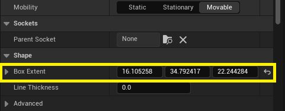
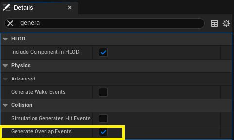
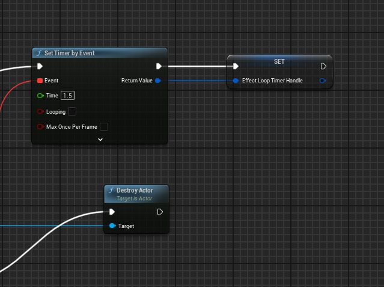

# 蓝图模块：控制尼亚加拉效应（第三部分）

- 来源: https://dev.epicgames.com/community/learning/tutorials/m6JM/unreal-engine-blueprint-module-controlling-niagara-effects-part-3
- 原文标题: Blueprint Module: Controlling Niagara Effects (Part 3)

如果你错过了本系列的前两部分，可以点击下面的链接查看。

## 第一部分：控制尼亚加拉效应 Part 2:

## 第二部分：关卡蓝图——管理多个通风口

学生指南：使用蓝图进行程序化尼亚加拉特效排序

## 第三部分：危险碰撞

目标：修改 BP_FXVent，使其在开火阶段启用碰撞时，如果玩家角色（BP_HourOfCode_Character）与通风口的碰撞体积重叠，则消除该玩家角色。

## 实现碰撞消除逻辑

1. 配置碰撞组件：

打开 BP_FXVent 蓝图编辑器。

在“组件”面板中搜索并添加“盒碰撞”组件。

在“详细信息”面板中调整“碰撞箱范围”值，以定义碰撞箱的形状和大小。此碰撞箱决定了火焰爆炸的冲击效果范围，玩家若在爆炸效果生效期间进入该区域，将被消灭。请确保碰撞箱仅覆盖预期的危险区域——如果碰撞箱过大，玩家可能会认为游戏不公平。

## 此外，在“详细信息”面板中：

在“碰撞”类别下，确保选中“生成重叠事件”（真）。

将碰撞预设设置为自定义……

将对象类型设置为 WorldStatic。

将碰撞启用状态的初始值设置为“无碰撞”。

On Component Begin Overlap：从 On Component Begin Overlap 节点的执行引脚出发，连接到 Cast To BP_HourOfCode_Character 节点。将重叠事件的 Other Actor 输出引脚拖到 Cast 节点的 Object 输入引脚。

从 Cast Succeeded 执行引脚连接到 Disable Input 节点。将 Cast 节点的 As BP Hour Of Code Character 输出引脚拖到 Disable Input 的 Target 输入引脚。

添加 Get Player Controller 节点，并将其 Return Value 连接到 Disable Input 的 Player Controller 输入引脚（这会阻止玩家继续控制角色）。

从 Disable Input 节点的输出执行引脚连接到 Set Timer by Event 节点。

将 Time 值设置为 1.5 秒（或你希望销毁前等待的延迟时间）。

在 Event 输出引脚（红色方块）附近右键，添加 Custom Event，并命名为 ActorDestroyEvent。将 Event 引脚连接到这个 ActorDestroyEvent 自定义事件。

将 ActorDestroyEvent 事件连接到 Destroy Actor 节点。

从原始 Cast To BP_HourOfCode_Character 节点拖出 As BP Hour Of Code Character 输出引脚，并将它连接到 Destroy Actor 节点的 Target 输入引脚（这会在 1.5 秒延迟后销毁玩家角色）。

Set EffectLoopTimerHandle：从 Set Timer by Event 节点的执行引脚拖出，搜索 “set EffectLoopTimerHandle”。

3. 实现碰撞切换逻辑：该逻辑只在火焰应处于激活状态时启用碰撞体。烟雾阶段禁用碰撞：转到 DoSmokePhase 自定义事件。

紧接在事件节点后添加 Set Collision Enabled 节点。

将 Components 面板中的 BoxCollision 组件（名为 Collision）拖到图表中，并把它连接到 Set Collision Enabled 节点的 Target 输入引脚。

在 Set Collision Enabled 节点中，将 New Type 下拉框设置为 No Collision（如果默认尚未如此设置）。

将 DoSmokePhase 的执行流连接到这个 Set Collision Enabled 节点，然后将它的输出执行引脚连接到烟雾阶段其余逻辑（例如激活烟雾效果）。

目的：确保烟雾阶段开始时，碰撞体不会触发任何重叠事件。

火焰阶段启用碰撞：转到触发火焰阶段的事件（例如 DoFirePhase）。

在逻辑中找到调用 FireEffectComponent 的 Activate 节点的位置。

紧接在 FireEffectComponent 的 Activate 节点之后，添加另一个 Set Collision Enabled 节点。

将 BoxCollision 组件变量连接到它的 Target 输入引脚。

目的：此功能专门用于检测火焰效果刚激活时的重叠情况。由于烟雾阶段的碰撞检测功能被关闭，因此现在触发的任何重叠事件都意味着玩家在火焰激活期间进入或身处其中。

火灾后隐式禁用：当火灾阶段计时器完成且逻辑循环回到 DoSmokePhase 时，第一个操作仍然是将碰撞设置为无碰撞，从而在火灾持续时间（加上延迟）结束后有效地​​禁用它。

## 编译并保存 BP_FXVent 蓝图。 Conclusion 结论

## 在这种配置下：

当烟雾阶段开始时，BP_FXVent 的碰撞体积被明确禁用（无碰撞）。

碰撞体积会在火焰效果激活后立即显式启用（仅查询）。

如果玩家角色（BP_HourOfCode_Character）在启用碰撞体积时（即在射击阶段）开始与碰撞体积重叠，则会触发“组件开始重叠”事件。

此事件会立即禁用玩家的输入。

A 1.5-second timer starts.

开始计时，倒计时1.5秒。

计时器结束后，触发击杀事件，摧毁玩家角色 Actor。
