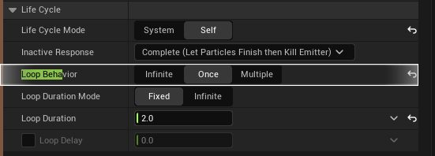
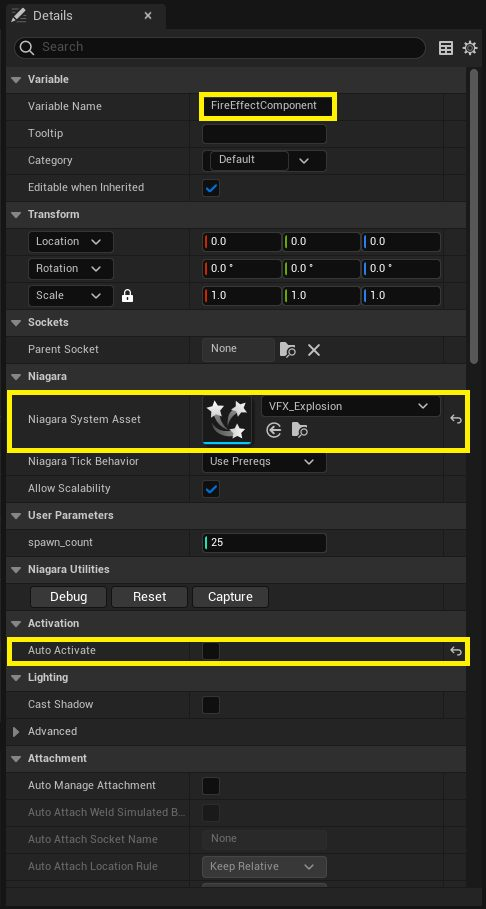
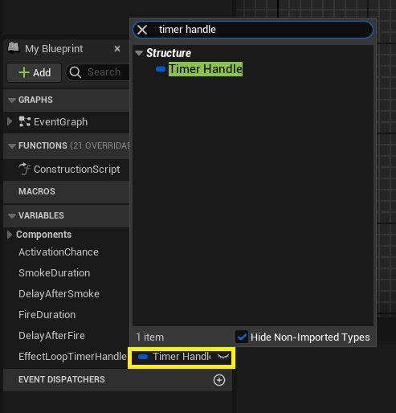
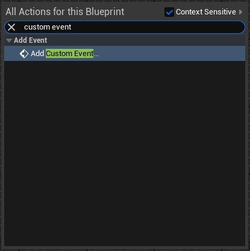

# 蓝图模块：控制尼亚加拉粒子（第一部分）

- 来源: https://dev.epicgames.com/community/learning/tutorials/vaEw/unreal-engine-blueprint-module-controlling-niagara-particles-part-1
- 原文标题: Blueprint Module: Controlling Niagara Particles (Part 1)

## 2 3,833 查看

学生指南：使用蓝图进行程序化尼亚加拉特效排序

本教程演示如何使用虚幻引擎蓝图以编程方式控制 Niagara 粒子特效。我们将创建一个蓝图，在爆炸特效触发前先触发烟雾粒子特效。玩家与火焰爆炸碰撞后将被消灭。我们将在玩家需要绕行的平台上放置多个此蓝图副本。在所有放置的蓝图中，每次游戏运行时都会随机激活一部分，而其余蓝图则保持休眠状态（不产生烟雾或火焰特效）。 Prerequisites: 先决条件： Niagara

项目中已创建并提供了用于烟雾和火焰特效的 Niagara 粒子系统（与之前的 Niagara 模块 相同）。我们假设它们分别命名为 VFX_Smoke 和 VFX_Explosion，但您可以使用自己的资源名称。

## 更改尼亚加拉粒子发射器设置

在继续之前，需要对您在 尼亚加拉模块 中创建的尼亚加拉粒子效果进行一项关键更改。具体来说，是烟雾效果。

打开烟雾尼亚加拉资源（例如 VFX_Smoke），然后选择发射器节点。在“详细信息”面板右侧的搜索栏中，搜索“循环行为”，并将其设置为 “一次 ”而不是 “无限”。

对火焰特效也进行同样的操作。

## 第一部分：FX 通风口蓝图（BP_FXVent）

此蓝图 Actor 将包含单个通风口效果循环的逻辑（烟雾 -> 暂停 -> 火焰 -> 暂停 -> 重复）。 1.

1. 创建蓝图 Actor：

在内容浏览器中，右键单击。

选择蓝图类。

选择 Actor 作为父类。

将蓝图命名为 BP_FXVent。

双击 BP_FXVent 资源以打开蓝图编辑器。

2. Setup Components: 2. 安装组件：

转到“组件”选项卡（通常位于左上角）。如果找不到，请转到顶部菜单栏，然后​​选择“窗口”>“组件”。

点击“+ 添加”。

搜索并添加 Niagara 粒子系统组件。

选择新添加的组件。在右侧的“详细信息”面板中：

在“变量名称”设置旁边的详细信息面板中，将组件重命名为 SmokeEffectComponent。

在 Niagara 部分，将我们在 上一课 中创建的烟雾 Niagara 系统（例如 VFX_Smoke）分配给 Niagara 系统资产槽。

至关重要的是，取消勾选“自动激活”复选框。我们希望通过蓝图控制激活过程。

在组件面板中再次单击 “+ 添加”。

在 DefaultSceneRoot 下添加另一个 Niagara Particle System 组件。

选择此新组件。在“详细信息”面板中：

将其重命名为 FireEffectComponent。

将您的火焰尼亚加拉系统（例如，VFX_Explosion）分配给尼亚加拉系统资产槽。

取消勾选“自动激活”复选框。

您的“组件”选项卡现在应该列出 DefaultSceneRoot、SmokeEffectComponent 和 FireEffectComponent。

3. Define Variables: 3. 定义变量：

转到“我的蓝图”选项卡（通常位于左下角）。

点击“变量”旁边的“ +” 按钮，添加以下变量： ActivationChance: 激活几率：

类型：浮点数

用途：一个介于 0.0 和 1.0 之间的值，表示带有尼亚加拉粒子特效的特定蓝图在关卡开始时激活的概率。值为 0.7 表示 70% 的概率。

可编辑：切换眼睛图标（实例可编辑），以便您可以从关卡编辑器中的详细信息面板为放置在关卡中的不同通风口设置不同的机会。

## 烟雾持续时间：

类型：浮点数

目的：烟雾效果应持续多长时间（以秒为单位）。

可编辑：切换眼睛图标。

## DelayAfterSmoke: DelayAfterSmoke：

类型：浮点数

目的：烟雾开始后，到火焰效果触发之前（包括烟雾持续时间）的延迟时间（以秒为单位）。

可编辑：切换眼睛图标。

## 火灾持续时间：

类型：浮点数

目的：火焰特效应持续多长时间（以秒为单位）。

可编辑：切换眼睛图标。

## DelayAfterFire: DelayAfterFire：

类型：浮点数

目的：火灾发生后，在烟雾再次出现之前，需要等待一段时间（以秒为单位）。

可编辑：切换眼睛图标。

## EffectLoopTimerHandle: EffectLoopTimerHandle：

类型：定时器句柄。您可以在“变量”面板中变量名称旁边的下拉菜单中搜索此变量类型。

## 解释：什么是定时器手柄？

定时器句柄本质上是一个唯一标识符或引用，指向您已启动的特定定时器（通常使用“按事件设置定时器”或“按函数名设置定时器”之类的节点）。您可以把它想象成启动定时器时获得的票号。

拥有此句柄后，您可以稍后与该特定计时器进行交互。您可以使用它来暂停计时器、检查剩余时间，或者最常见的是，清除或使计时器失效，从而防止其再次触发。这对于停止循环或在 Actor 销毁时进行清理至关重要。

可编辑：请勿选中。此设置由蓝图内部管理。

## 编译并设置默认值

点击工具栏中的“编译”按钮。这将更新蓝图，并允许您设置默认值。

选择每个浮点变量，并在“详细信息”面板中设置合理的默认值。例如： ActivationChance: 0.7 激活几率：0.7

烟雾持续时间：3.0

DelayAfterSmoke: 1.0（这意味着烟雾停止 1 秒后才会着火，因为计时器持续时间包括烟雾持续时间）

持续时间：1.0

DelayAfterFire: 1.0（这意味着下一个烟雾循环将在火焰停止后 1 秒开始）

4. 实现事件图逻辑

切换到事件图表选项卡。

我们将创建一个由定时器控制的循环序列。循环的目的是，一旦火焰特效消失，我们希望同一个“通风口”（蓝图）保持激活状态。因此，烟雾到火焰的序列会再次重复执行。

启动循环： Right-click in the graph and search for "Custom Event".

在图表中右键单击，搜索“自定义事件”。添加一个事件并将其命名为 StartEffectLoop。

在图表中右键单击，搜索“自定义事件”。添加一个自定义事件并将其命名为 DoSmokePhase。从 StartEffectLoop 的执行引脚拖出 DoSmokePhase 事件。

## 烟雾阶段：

将“组件”面板中的“烟雾效果组件”拖到图表上。

拖出 SmokeEffectComponent 节点，找到 Activate 节点。将 DoSmokePhase 连接到其执行引脚。确保选中 Activate 节点上的 Reset 复选框（如果粒子效果已激活，这将重新启动粒子效果）。

拖出 Activate 节点的执行引脚，然后搜索“按事件设置定时器”。

设置烟雾阶段的计时器：

对于时间输入引脚：

将“我的蓝图”面板中的 SmokeDuration 变量拖到编辑器中，然后选择“获取”。

将变量拖入编辑器后，您可以选择获取变量的值或设置其值。今后，“获取{变量}”将表示选择“获取”选项。

将“我的蓝图”面板中的“DelayAfterSmoke”变量拖到编辑器中，然后选择“获取”。

右键单击编辑器，搜索“添加”节点。使用此节点（浮点数 + 浮点数）将这两个变量相加。

将 SmokeDuration 和 DelayAfterSmoke 变量连接到

将“按事件设置定时器”的事件（红色）输出引脚连接到一个新的自定义事件。将此事件命名为 DoFirePhase。

## 定时器手柄的存放：

拖动“EffectLoopTimerHandle”变量并选择“设置 EffectLoopTimerHandle”。将“按事件设置定时器”节点的返回值连接到“设置”节点的输入引脚（蓝色）。

为什么要在这里存储定时器句柄？我们存储“通过事件设置定时器”返回的句柄，以便引用这个特定的定时器实例。这对于清理工作至关重要。如果 BP_FXVent Actor 在定时器仍然处于活动状态时被销毁，定时器可能仍然会尝试触发，从而导致错误。通过存储句柄，我们可以在“结束播放”事件（参见步骤 f）中使用它来显式清除此定时器，从而避免此类问题。

## 火力阶段和循环：

找到您创建的 DoFirePhase 自定义事件。

将 SmokeEffectComponent 从组件面板拖到事件图中。然后，右键单击并搜索“Deactivate”节点。将 DoFirePhase 事件的执行引脚连接到 Deactivate 节点。将 SmokeEffectComponent 引用连接到 Deactivate 节点的 Target 输入引脚。

从组件面板中拖动 FireEffectComponent，并对其调用 Activate 节点（确保选中 Reset）。

从“激活”节点（用于火焰效果）添加另一个“按事件设置计时器”节点。

对于此定时器的 Time 输入引脚：

获取 FireDuration 变量。

获取 DelayAfterFire 变量。

使用 Add 节点（浮点数 + 浮点数）将这两个变量相加。

将 FireDuration 和 DelayAfterFire 变量连接到

将 Event（红色）输出引脚拖出，并直接连接到 DoSmokePhase 自定义事件的执行引脚。这样就创建了一个循环。

将第二个“按事件设置定时器”节点的“返回值”（蓝色）输出引脚拖出，并连接到另一个 “设置效果循环定时器 句柄”节点。这将更新句柄变量，使其指向最新的定时器，确保在播放结束时清除正确的定时器。

## 收尾工作：

在图表中右键单击，搜索“Event End Play”（事件结束播放）。添加此事件节点。（当 Actor 被销毁或游戏结束时，此事件会自动触发）。

拖出它的执行引脚，然后通过句柄搜索清除和使定时器失效。

获取 EffectLoopTimerHandle 变量并将其连接到“通过句柄清除和失效定时器”节点的 Handle 输入引脚。这样可以确保当 Actor 从场景中移除时，定时器循环能够干净利落地停止。

注意：通过事件节点设置定时器，而不是通过延迟节点设置定时器。 Why use

为什么使用“按事件设置定时器”节点而不是“延迟”节点？ Delay Node:

延迟节点：此节点会暂停特定蓝图脚本链的执行流程，暂停时间为指定时长。在延迟结束前，该执行链的后续步骤将不会执行。如果在延迟期间 Actor 被销毁，则该执行链的其余部分将丢失。对于线性序列来说，延迟节点很容易处理，但对于循环或交互操作来说，可能会出现问题。关键在于，延迟节点会阻塞特定的执行路径。

通过事件节点设置计时器：此节点异步工作。它会在后台启动一个倒计时计时器，而不会暂停当前的执行流程。脚本会在“通过事件设置计时器”节点之后立即继续执行。计时器结束后，它会触发指定的事件（连接到红色引脚）。这种方式更加灵活和健壮，尤其适用于循环或需要 Actor 在等待期间保持响应的情况。如果您需要提前清除计时器（例如，在“结束播放”事件中），也必须使用此方法。对于不应暂停其他所有操作的循环或定时事件，“通过事件设置计时器”（或“通过函数名称设置计时器”）是首选方法。

编译并保存 BP_FXVent 蓝图。 将多个 BP_FXVent Actor 从内容浏览器拖到关卡中。

您现在可能什么也看不到，但在下一部分中，您将学习如何激活这些已放置角色中的随机子集！

## 第二部分：关卡蓝图——管理多个通风口
