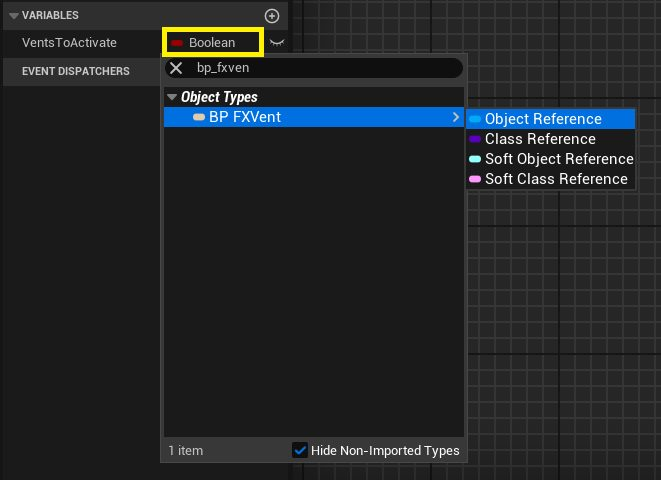
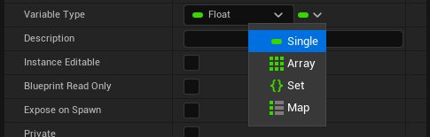

# 蓝图模块：控制尼亚加拉粒子（第二部分）

- 来源: https://dev.epicgames.com/community/learning/tutorials/raPD/unreal-engine-blueprint-module-controlling-niagara-particles-part-2
- 原文标题: Blueprint Module: Controlling Niagara Particles (Part 2)

如果你错过了本系列的第一部分，可以点击下面的链接。

## 第一部分：控制尼亚加拉效应

学生指南：使用蓝图进行程序化尼亚加拉特效排序

## 第二部分：关卡蓝图——管理多个通风口

现在，我们将使用关卡蓝图来管理关卡中哪些 BP_FXVent 角色实际激活，并随着时间的推移随机安排它们的激活顺序。 What is a Level Blueprint?

## 什么是关卡蓝图？

关卡蓝图是一种特殊类型的蓝图，它与项目中的特定关卡或地图相关联。每个关卡都有其独特的关卡蓝图。

它主要用于关卡特定的脚本编写、关卡内事件的排序（例如过场动画或触发器），以及管理或引用直接放置在该关卡中的角色。与角色蓝图不同，关卡蓝图无法创建多个实例。

## 获取关卡蓝图

在主编辑器窗口的工具栏中，单击“蓝图”按钮。

选择开放式蓝图。

创建变量

在关卡蓝图编辑器的“我的蓝图”选项卡中，创建以下变量： VentsToActivate: 待激活通风口：

类型：搜索 BP_FXVent。在“对象类型”下，选择 BP FXVent。

在右侧的“详细信息”面板中，“变量类型”设置旁边，将鼠标悬停在类型图标（通常是一个彩色圆圈）上，然后选择“数组”。

注意：数组是有序的元素集合或列表。通过将变量类型设置为 BP_FXVent 并将其转换为数组，我们创建了一个列表，该列表只能保存关卡中存在的 BP_FXVent 类实例（对象）的引用。我们将使用通过激活几率检查的通风口填充此数组。

## 激活延迟： Type: Float 类型：浮点数

目的：序列中一个通风口与下一个通风口激活之间的时间延迟（以秒为单位）。

点击编译后，在右侧的“详细信息”面板中设置默认值，例如 2.0。

请确保数据类型设置为“Single”（单值）而不是“Array”（数组）。如果您的变量默认类型为数组，则可以在“详细信息”面板中“变量类型”设置旁边将其改回单值。

## 激活计时器句柄： Type: Timer Handle 类型：计时器商店

目的：保存对负责按顺序激活通风口的定时器的引用。

## 实现事件图逻辑

活动开始：寻找并过滤通风口 Right-click and add the "Event BeginPlay"

右键单击并添加“Event BeginPlay”节点（如果尚未存在）。

将其执行引脚拖出，并搜索“获取所有 Actor 类”节点。

在此节点的“Actor Class”下拉菜单中，选择您的“BP_FXVent”。

拖出“输出 Actors”引脚（这是一个包含关卡中所有“BP_FXVent” Actor 的数组），并添加一个“For Each Loop”节点。将“获取所有类 Actor”的输出执行流程连接到循环的输入执行引脚。

检查激活几率 Inside the loop (from the "Loop Body" execution pin): Add a "Branch" node.

在循环内部（从“循环体”执行引脚）：添加一个“分支”节点。

对于“分支”的“条件”输入：

从“For Each Loop”的“Array Element”引脚上拖出（这表示循环中正在处理的当前“BP_FXVent”）。

从“BP_FXVent”中查找并获取“ActivationChance”变量。

在空白处，右键单击并搜索“随机浮点数”节点。这将返回一个介于 0.0 和 1.0 之间的随机浮点数。

添加一个“小于（<）”节点（“float < float”）。

将“随机浮点数”输出连接到“<”节点的 顶部 输入。

将“ActivationChance”变量（来自数组元素）连接到“<”节点的底部输入。

将“<”节点的布尔结果连接到“分支”的“条件”引脚。

逻辑：如果一个介于 0 和 1 之间的随机数小于通风口的“激活概率”，则激活通风口。“激活概率”越高，激活的可能性就越大。

将有效通风口添加到阵列中

拖出“分支”节点的“True”执行引脚。

查找“添加唯一值”节点（适用于数组）。

获取“VentsToActivate”变量（来自“我的蓝图”面板），并将其连接到“添加唯一”节点的“目标数组”输入引脚。

将“For Each Loop”节点的“Array Element”引脚连接到“Add Unique”节点的“New Item”输入引脚（底部的蓝色引脚）。

注意：“添加唯一标识”有什么作用？

如果数组末尾尚不存在该元素，则将其添加到数组末尾。

## 打乱顺序并启动激活计时器（循环结束后）

从“For Each Loop”节点拖出“Completed”执行引脚（该引脚在循环处理完所有参与者后触发一次），然后搜索“Shuffle”节点。该节点接收数组并随机化其元素的顺序。

获取“VentsToActivate”变量。

将其连接到 Shuffle 节点的“目标数组”输入引脚。

打乱顺序的目的：我们在收集所有通过概率检查的通风口之后，对“VentsToActivate”数组进行打乱顺序。这确保了每次游戏时，所选通风口开始冒烟/生火循环的顺序都是随机的，而不是总是按照相同的顺序激活（例如，它们在编辑器中的放置顺序或通过“获取所有类的 Actor”函数找到的顺序）。

从“Shuffle”节点的输出执行引脚，添加一个“按事件设置定时器”节点。

将“ActivationDelay”变量连接到“Time”输入引脚。

勾选“循环”复选框。

选中“循环”框后，此“按事件设置计时器”节点将每隔“ActivationDelay”秒自动重复触发连接的事件，直到明确清除计时器为止。

将“事件”（红色）输出引脚连接到一个新的 自定义事件。将其命名为“ActivateNextVent”。

## 存放激活计时器手柄

从“按事件设置定时器”节点的“返回值”（蓝色）输出引脚上拖出。

搜索“设置激活定时器句柄”并连接它。 Explanation: Similar to BP_FXVent,

说明：与 BP_FXVent 类似，我们存储此重复定时器的句柄。这样，一旦“VentsToActivate”列表中的所有通风口都被触发，我们就可以使用“通过句柄清除并使定时器失效”来停止定时器。

## ActivateNextVent Event Logic

激活下一个通风口事件逻辑 Find the "ActivateNextVent" custom event.

找到“ActivateNextVent”自定义事件。

从其执行引脚添加一个“分支”节点。

For the "Condition": 对于“条件”： Get the "VentsToActivate" array variable.

获取“VentsToActivate”数组变量。

将其拖出并搜索“长度”节点（返回数组中的项目数）。

添加一个“大于”节点（“整数 > 整数”）。

将“长度”输出连接到“">”节点的顶部输入。将底部值设置为“0”。

将布尔结果连接到“分支”的“条件”引脚。（检查阵列中是否还有剩余的通风口需要激活）

从“分支”的“真正”执行引脚（意味着还有泄压阀）： Get the "VentsToActivate" array variable.

获取“VentsToActivate”数组变量。

将其拖出并搜索“获取（副本）”节点。将索引保留为“0”。这将获取（打乱顺序的）数组中的第一个元素。

从“Get”节点（引用“BP_FXVent”）的输出引脚拖出，并搜索“StartEffectLoop”事件（我们在“BP_FXVent”中创建的自定义事件）。调用此函数/事件。

调用“StartEffectLoop”后，再次获取“VentsToActivate”数组变量。

将其拖出并找到“移除索引”节点。将索引保留为“0”。将“启动效果循环”节点的执行引脚连接到此“移除索引”节点。这将从列表中移除我们刚刚激活的通风口，使其不会再次被此定时器激活。

从“分支”的“False”执行引脚（意味着“VentsToActivate”数组为空）：

添加“通过句柄清除和使计时器失效”节点。

获取“ActivationTimerHandle”变量并将其连接到“Handle”输入端。这将停止循环计时器，因为没有更多通风口需要处理。

编译并保存关卡蓝图。 现在你应该会看到随机数量的蓝图依次触发，每个蓝图之间略有延迟。 Conclusion 结论

您现在已经建立了一个系统，其中： Individual BP_FXVent actors manage their own smoke -> fire ->

各个 BP_FXVent 参与者使用内部计时器管理自己的烟雾 -> 火 -> 重复循环。

在“开始游戏”界面，关卡蓝图会显示所有已放置的通风口。

每个通风口都有一定几率（ActivationChance）被纳入激活序列。

关卡蓝图会随机化（打乱）所选通风口的顺序。

关卡蓝图中的循环计时器会从随机列表中一次触发一个通风口的 StartEffectLoop 事件，每次激活之间有指定的延迟（ActivationDelay）。

每个通风口都会清理其自身的内部效果循环计时器（如果被摧毁，则事件结束播放）。

## 第三部分：危险碰撞
