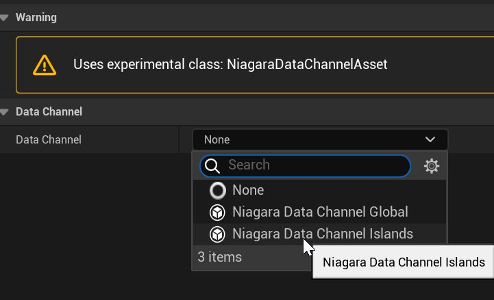

# Niagara 数据通道简介

- 来源: https://dev.epicgames.com/community/learning/tutorials/RJbm/unreal-engine-niagara-data-channels-intro
- 原文标题: Niagara Data Channels Intro

数据通道是一种促进游戏代码与 Niagara 系统之间以及 Niagara 系统之间进行通信的方式。

从最基本的意义上讲，数据通道是具有已定义有效载荷的数据流，游戏代码或 Niagara 系统可以向其中写入数据。

其他游戏代码或 Niagara 系统可以读取这些数据，并随意使用。

可以通过使用专门的数据通道类型，以多种方式扩展这一核心数据传输功能，从而开辟许多可能的应用场景。

在本文中，我们将探讨一个主要用例，即通过将突发特效组合成大型共享模拟来优化突发特效。

首先我们将看到一些视频，内容涵盖结果、性能以及如何创建此设置的深入讲解。

接下来，我们将通过截图和解释，更详细地介绍系统的核心部分。

我基于第一人称模板创建了一个示例项目，其中包含速射武器和弹丸碰撞冲击效果。 Note:

注意：5.4 版本中对此设置进行了一些更改。详情请见 此处。 Intro 引言

## 攻略

## 结果与表现

现在让我们通过一些截图和关键组件的解释，深入了解上述设置。

首先我将介绍一些基本类别和概念。 Classes and concepts. 课程和概念。

## 尼亚加拉数据通道资产

尼亚加拉数据通道的顶级资产。

每个资产都应该选择要使用的数据通道类型/类别。

目前只有少数几种频道类型是针对特定使用场景的。

项目可以根据自身特定需求创建自己的数据通道类型。 Niagara Data Channel 尼亚加拉数据通道

所有 NDC 类型的基类。定义数据有效载荷和基本通用设置。

## 尼亚加拉数据通道处理程序

运行时基类，负责管理进入 NDC 的数据，并将其分发给 Niagara Systems 读取数据和游戏代码。

每种类型的数据通道都有其自己的处理程序类，用于管理其内容。

## 尼亚加拉数据频道 - 全球

这是 NDC 最基本的功能类型。

它只是简单地定义了数据有效负载，其处理程序类将所有数据存储在一个全局集合中。

所有的读写操作都是全局可见的。

## 尼亚加拉数据通道 - 岛屿

这种 NDC 类型将世界划分为一个个独立的“岛屿”。

每个岛屿都有自己的一套数据。只有向同一个岛屿写入数据和从该岛屿读取数据的程序才能彼此看到。

选择使用哪个岛屿取决于访问该通道的对象在世界空间中的位置。

当使用同一通道的设备可能相距甚远且彼此不需要交互时，这种方法非常有用。

它还可以为每个岛屿生成特定的尼亚加拉系统，这对于自动生成监听和响应写入 NDC 的项目的系统非常有用。

最初的应用场景是将冲击效果 FX 聚合到更大的批处理系统中，以提高性能。 Impact FX Aggregation 冲击效果外汇聚合

接下来，我们将介绍如何使用 Niagara 数据通道搭建一个像上面那样的基本冲击 FX 系统所需的步骤。

我创建了一个简单的示例投影，该投影基于略微修改的第一人称模板。

我对其进行了修改，使其能够产生弹丸冲击特效并实现连续快速射击。

## 尼亚加拉数据通道资产

我们首先需要做的就是定义 NDC 资产。

在这里，我们将从内容浏览器菜单的 FX->高级->尼亚加拉数据通道下创建资产 NDC_Impact。

我们选择岛屿 NDC 类型，因为我们想将世界划分开来，只处理产生冲击效果的区域。

我们添加了一些基本变量，例如位置、法线和表面类型。

NDC 有一个与之相连的尼亚加拉系统，当冲击效果被写入 NDC 时，该系统将与每个岛屿一起生成。

该系统将监听冲击事件，并根据这些事件生成特效。

创建数据通道资产时，首先必须选择数据通道类型。

使用岛屿类型和单个尼亚加拉系统的基本 NDC 设置，该系统将随每个岛屿生成，以处理 NDC 中的条目。

## 尼亚加拉系统监听器

接下来，我们将创建尼亚加拉系统，该系统将根据写入 NDC 的条目生成每个岛屿。

我们将此称为 NS_NDC_Impact。

它将负责为 NDC 中写入的每次冲击生成粒子。

它的边界将设置为岛屿的大小加上 NDC 资产中定义的一些填充。

请注意，由于这是一个位于这些 NDC 岛屿中心的共享系统，因此当您从 NDC 数据生成时，系统位置和 LOD 距离等信息可能与您预期的不同。

现在我们先创建一个非常基本的脉冲发射器。

简单的发射器，根据数据通道的内容以脉冲串的形式发射信号。

该发射器的目的是为进入 NDC 的每次撞击事件生成粒子。

然后根据 NDC 中的值（例如位置等）初始化这些粒子。

尼亚加拉水系的主要组成部分如下（上图中红色标注部分）：

1. 系统状态应设置为循环，因为我们正在创建一个监听系统，该系统将持续运行一段时间，以监听进入系统的任何冲击效果。

2. 未使用时自动完成 - 如果 N 秒内没有粒子产生，此模块将终止系统。这使我们能够清理没有发生任何冲击效果的系统和 NDC 岛屿。

3. SpawnFromNDC - 一个临时模块，会在 NDC 中每次发生碰撞时生成粒子。

4. ReadFromNDC - 读取触发每个粒子的 NDC 项中的数据。然后，我们可以使用此数据来初始化粒子。

除了这些部分，以及系统位置等事项有所不同之外，这是一个完全正常的发射器。 SpawnFromNDC

该临时模块以 NDC Reader DI 作为输入，并接受最小和最大生成数量。

该函数的目标是遍历 NDC 中的每个项目并从中生成粒子。

理想情况下，我们可以在 Niagara 脚本中直接遍历 NDC 中的项目，但目前在 Niagara CPU 脚本中这是不可能的。

因此，我们改用一个名为 SpawnConditional 的特殊依赖注入函数。

会根据你设置的参数，为 NDC 中的每个物品生成一个新的生成点。

在这个简单的用例中，我们只是为每个 NDC 项目生成介于最小值和最大值之间的粒子数量。

稍后我们将探讨一个更高级的用例，该用例可以根据 NDC 内容有条件地生成粒子。

在 5.3 版本中，每个发射器都必须有自己的 NDC 读取器 DI，我们在 SpawnFromNDC 函数中对其进行初始化。每个发射器都会在其所属系统中生成粒子。

在最新版本中，我们使用了一个名为 Engine.Emitter.ID 的新值。这是系统中每个发射器的唯一 ID，允许某些依赖注入 (DI) 对任何发射器进行操作，即使是来自共享的系统级或用户级依赖注入。在本例中，我们有一个系统级 NDC 读取器依赖注入，我们可以使用它来启动任何发射器。

定义了 NDC 读取器 DI，并接收 NDC 中每个冲击效果的最小值/最大值来生成。

模块将针对写入 NDC 的每个冲击事件生成介于 Min 和 Max 之间的粒子数量。

从 NDC 获取信息

现在，对于进入 NDC 的每个冲击事件，我们都会生成一些粒子。接下来，我们需要做的是根据触发该粒子生成的正确 NDC 条目初始化每个粒子的值。

我们将在另一个草稿模块 ReadFromNDC 中完成这项工作。

本模块的目标是读取生成每个粒子的单个 NDC 的内容，并将其转换为一些粒子属性，然后我们可以在粒子脚本的其他地方使用这些属性。

我们接收一个 NDCReader DI 作为输入，并调用 Read 函数从中读取数据。

该函数在节点下拉菜单和每个添加引脚上都有实用辅助函数，用于显示和初始化节点/引脚，并使用来自每个 NDC 的变量。

在这里，我们将初始化节点以读取整个 NDC 数据。

然后我们检查读取是否成功，并将结果传递给一些粒子属性。

读取函数接受一个指向 NDC 数据的直接索引。为了获取每个生成粒子的正确索引，NDC 生成过程会使用 Emitter.SpawnGroup 值。

每个生成的粒子都有一个 Emitter.SpawnGroup 值，该值设置为触发其生成的正确 NDC 索引，因此我们可以使用此值在粒子脚本中读取 NDC。

模块读取生成此粒子的 NDC 项的内容。

现在我们已经将 NDC 内容包含在粒子数据中，我们可以随意使用它。我们可以将位置直接传递给粒子位置，颜色等也是如此。

我们还可以将速度等任何方向元素沿冲击法线方向调整。 Writing from Blueprint 根据蓝图写作

现在我们有了这个简单的冲击脉冲设置，让我们来看看如何从蓝图写入 NDC。

我们将修改投射物执行器，使其在命中事件发生时写入 NDC，而不是生成一个新的尼亚加拉系统。

理想情况下，我们会将这些写入 NDC 的操作批量处理，以提高性能，但为了简单起见，这里我们将在命中事件发生时一次写入一个。

如果我们想在本帧生成突发数据，我们将调用 WriteToNiagaraDataChannel 函数，该函数会为我们初始化一个实用写入器对象。

它需要 NDC 来进行使用和计数。

它还有一个“搜索参数”输入框，这一点值得特别一提。

数据通道（例如岛屿通道类型）就是这样可以将不同的读取和写入操作路由到正确的岛屿。

它使用这些搜索参数中的显式位置或组件位置来搜索要返回的正确 NDC 数据。

岛屿 NDC 会搜索其岛屿，并返回第一个找到包含此点的岛屿。

全球 NDC 完全忽略这一点，所有写入操作都会进入一个单一的全局集合。

其他 NDC 类型可能会以其他方式使用位置或组件数据来返回特定的内部 NDC 数据集。

另一个例子是 NDC，它为每个组件返回单独的数据。NDC 类型完全控制如何解释这些参数以及要返回哪些数据以供写入。

然后我们可以写入 NDC。这里我们从索引 0 写入，因为我们只写入一个冲击效果，但理想情况下，我们应该批量处理并循环，每次写入索引 0 到 N-1。

所有数据写入操作都应立即执行，将此写入对象存储在 BP 函数范围之外是不安全的。

每次您想向 NDC 发送邮件时，都应该再次调用 WriteToNiagaraDataChannel。

在这种情况下，我们将在演员位置周围生成一些随机位置和其他值。

请注意，在编写位置时，必须使用 Position 类型。尽管在蓝图中 Normal 和 Position 都是向量，但 Niagara 必须显式地区分它们为 Position 和 Vector，才能正确处理大型世界坐标。

一个简单的蓝图设置，用于向 NDC_Impacts 写入冲击效果事件。
