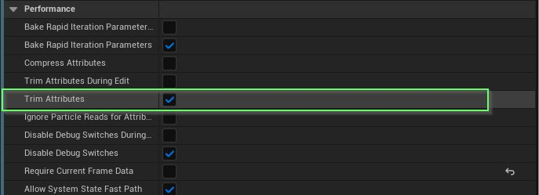
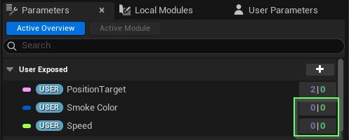

# Niagara 示例包：最佳实践

- 来源: https://dev.epicgames.com/community/learning/tutorials/L7aY/unreal-engine-niagara-example-pack-best-practices
- 原文标题: Niagara Example Pack: Best Practices

## 尼亚加拉示例包：最佳实践

## 概述

游戏开发可能非常复杂，尤其是在开发跨平台游戏时。功能和工具越多，责任也就越大。除了粒子数量、着色器指令和过度绘制等常规平衡之外，这里还提供一些额外指导，帮助您最大限度地发挥 Niagara Systems 的性能。 NOTE: See Optimizing Niagara |

注：有关更详细的信息，请参阅 “优化 Niagara | 可扩展性和最佳实践”。 Effect Type 效应类型

请确保在 Niagara 系统中使用效果类型。这有助于您在项目中指定各种使用场景，并从宏观层面设置限制和可扩展性。

## 界限

为系统设置边界是个好习惯，尤其是在你清楚系统规模的情况下。在这种情况下，设置 固定边界 能有效简化流程，让引擎轻松处理你的效果。

如果你的系统边界会根据使用场景而变化，那么最好至少设置一下 初始流边界，以免系统被意外剔除。设置一个适中的值，然后让发射器的动态边界稍后发挥作用。

## 表现

如果您的系统不会连接到移动物体，或者不依赖任何响应式数据接口，则务必关闭 “需要当前帧数据”选项。该选项位于 “系统属性” 的 “高级设置” 中。

如果情况属实，您可能还需要考虑在 系统属性 的上述 系统 部分中关闭 Actor 的初始所有者速度。

编译时启用“修剪属性”功能，将删除所有未使用的粒子属性，这有助于节省内存并提高性能。



注意：如果启用了修剪属性，则只会清理未使用的粒子属性，而不会清理用户 | 系统 | 发射器属性。

## 用户参数

用户参数虽然有用，但也可能导致性能问题。请限制用户参数的数量。

首先，删除系统中所有未使用的用户参数。



未使用的用户参数在其引用属性中显示为 0 | 0。（读取 | 写入）

```cpp
**For the above image, you must select System Node and all your emitters in order to see entire usage.
**对于上图，您必须选择系统节点和所有发射器才能查看完整的使用情况。
```

布尔值与浮点数/整数的成本相同。如果您需要处理多个布尔值，请考虑使用位掩码。在确定输入类型后，您也可以使用自定义数据接口。如果是更全局性的需求，您还可以通过 MPC 使用 NPC。 Emitters 发射器

建议使用全新的 轻量级发射器 （无状态）来制作特效。它们性能最佳，通常可以满足您的大部分需求。一旦达到轻量级发射器的功能极限，再考虑升级到标准发射器（有状态）。**如果您需要世界空间粒子效果，请直接使用有状态发射器。**

全部为无状态模式，不涉及系统更新。[Fast-U] 表示最优配置。

您可以混合搭配以获得两全其美的效果，但仅使用轻量级发射器且禁用系统状态（包括系统更新中的任何内容）的系统是最理想的，成本接近静态网格。

## 无状态发射器和有状态发射器的混合

## 与 GPU

如果你的游戏面向移动设备/Switch 平台发售，可能有些设备不支持 GPU 粒子效果，或者价格会更高。

如果您有超过 100 个粒子，使用 GPU 粒子系统可能会有所裨益。（请确保平台支持 GPU 粒子系统） Emitter Stacking 发射极堆叠

如果发射器数量较多，可以考虑将多个渲染器堆叠到一个发射器中。尤其是在设置相似且使用同一渲染器的情况下。实现方法有很多种。您可以打开 NS_TeslaCoil 示例，并参考 Arc_Main 发射器。

## 4 个渲染器共享同一个发射器！

精灵渲染器

根据与摄像机的距离禁用渲染器。

使用镂空纹理来辅助过度绘制。

## 网格渲染器

允许按粒子截锥体剔除，以及按距离剔除。

## 带状渲染器

目前，Ribbon Renderer 的性能消耗相当大，仅建议在需要其全部功能的情况下使用。关闭 Ribbon Tessellation 可以略微提升性能。

## 贴花渲染器

这是使用贴花 Actor 的绝佳替代方案，并且已内置于 Niagara 中。您可以在我们的许多示例中看​​到贴花渲染器，包括我们的 Impact NDC 系统。

它最好与 Decal Attributes 模块搭配使用，该模块同时适用于有状态发射器和无状态发射器。

## 光照渲染器

这是一种更优化的光照方式，但存在诸多限制。其中一个主要限制是无法投射阴影。除非有充分的理由，否则在较低级别的平台上也应该禁用此功能。

它最好与 Light Attributes 模块搭配使用，该模块同时适用于有状态发射器和无状态发射器。

## 性能模式

启用后，您的 Niagara 系统将在编辑器中自动优化，以更好地展示发布性能。这包括处理以下选项（如果已选择）： 烘焙快速迭代参数、 修剪属性、 禁用调试开关。

## 可扩展模式

发货前，务必进行可扩展性测试。

对于像《堡垒之夜》这样在多个平台上发布的项目来说，一条很好的规则是：

## 理想情况下，有状态发射器的数量应为：

## 低 - 3

## 带 -5

## 高 - 8

## 史诗级 - 10
