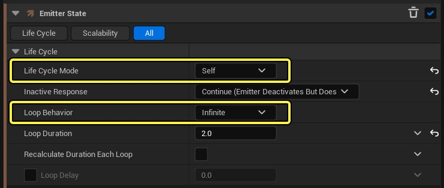
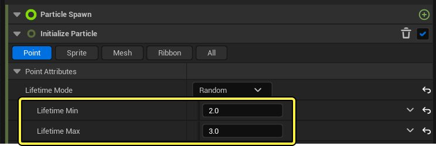
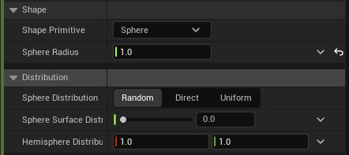

# 尼亚加拉模块：烟雾效果

- 来源: https://dev.epicgames.com/community/learning/tutorials/Zmdv/unreal-engine-niagara-module-smoke-effect
- 原文标题: Niagara Module: Smoke Effect

## 学生指南：尼亚加拉系统：火焰爆炸效果

在 上一模块 中，你学习了如何使用 Niagara 制作爆炸效果。这非常适合用于爆炸发生时的效果。但如果你想提醒玩家即将发生爆炸，以便他们能够躲避冲击，该怎么办呢？这时，烟雾效果就能派上用场了。 Prerequisites 先决条件

就像上一个关于火焰爆炸效果的模块一样，导入发射器中精灵所需的材质（M_smoke_subUV）。你可以在“入门内容包”的“入门内容 > 粒子 > 材质”下找到 M_smoke_subUV 材质。

点击并拖动该素材到您选择的、已整理好资源的文件夹中。在弹出菜单中选择“移动到此处”或“复制到此处”。移动操作会将原素材从原位置删除，并将其移动到新位置。复制操作会在新位置创建一个副本，同时保留原素材在原位置。

## 营造烟雾效果

步骤 1：创建 Niagara 系统文件

在您希望保存 Niagara 效果的文件夹中，右键单击内容浏览器，然后选择 Niagara 系统。

选择简单的精灵爆发模板，然后点击创建。

双击新建的 Niagara 文件打开编辑器。在编辑器中，单击一次发射器实例，更改其名称。给它起一个合适的名称，例如 VFX_Smoke。

## 步骤 2：渲染设置

在发射器节点中，选择精灵渲染器模块，并将材质设置为刚刚创建的 M_smoke_subUV 的副本。

精灵图包含 64 张图像。因此，对于子图像大小，请将值设置为 8.0 x 8.0。最后，选中启用子 UV 混合的复选框。

## 步骤 3：发射器更新

选中“瞬间生成爆发”模块，然后按键盘上的删除键将 其删除。这是因为我们想要实现的效果不是一团烟雾，而是一股向上升起的烟柱。

点击 “+” 图标，将生成速率模块添加到发射器更新模块。

在生成速率模块中，将生成速率设置为 10。 生成速率决定了每秒生成的粒子数量。

目前，在构建特效时，建议将模拟设置为无限循环运行。这样可以让你有更多的时间来评估设置对特效的冲击效果。在“发射器状态”模块中，点击“生命周期模式”下拉菜单，选择“自身”。然后点击“循环行为”下拉菜单，选择“无限”。

## 步骤 4：更新粒子生成组设置

在“粒子生成”组下，点击“初始化粒子”模块，打开粒子生命周期设置。在“生命周期模式”中，选择 “随机”，并将“最小生命周期”设置为 2.0，“最大生命周期”设置为 3.0。尝试调整这些值，直到找到能为烟雾效果引入合适随机性的值。

接下来，在同一个“详细信息”面板的“精灵属性”下，将 “精灵大小模式” 下拉 菜单设置为“随机均匀”，并将 “均匀精灵大小最小值” 设置为 75.0， “均匀精灵大小最大值 ”设置为 200.0。这样，粒子的大小就可以变化，但在 X 和 Y 方向上保持均匀。例如：75 x 75、125 x 125 等。

对于精灵旋转模式，选择“直接归一化角度 (0 - 1)”。这将角度值归一化到 0 到 1 之间。要为每个粒子引入角度随机性，请单击“精灵旋转角度”旁边的下拉箭头，然后选择“随机范围浮点数”。将最小值设置为 0.25，最大值设置为 0.5。

单击加号 (+) 图标并搜索“添加速度”，将 “添加速度 ”模块添加到粒子生成组中。

点击“速度”旁边的下拉箭头，搜索“随机范围向量”。这会将“最小值”和“最大值”字段添加到“速度”中。

保持 X 和 Y 的值不变，最小值和最大值都保持不变，将 Z 值设置为最小值 20.0，最大值 50.0。 这样可以增加烟雾向上运动速度的变化。

点击“+”图标，将 形状位置 添加到粒子生成组。

形状位置控制精灵的生成形状和原点。将形状图元设置为球体。将球体半径设置为 1.0。确保球体分布设置为随机。

就像你可能对尼亚加拉火焰爆炸效果所做的那样，将 SubUV 动画模块添加到粒子生成组。

在“子 UV 动画”模块中，单击“子 UV 动画模式”下拉菜单，然后选择“线性”。将起始帧设置为 0，结束帧设置为 63。精灵图包含 8x8 的图像网格，因此图像总数为 64。

## 步骤 5：粒子更新组

在发射器节点中选择“粒子更新”组，然后单击 “+” 图标。接下来，找到“加速力”模块。

粒子生成组中的速度模块赋予粒子初始速度，而加速度模块使粒子能够继续上升。

Set X, and Y to 0.0 and Z to 50.

将 X 和 Y 设置为 0.0，将 Z 设置为 50。

## 结果

## 火灾爆炸

如果您还没有完成关于使用 Niagara 创建火焰爆炸效果的教程，请务必点击下面的链接查看！

## 火灾爆炸

## 结论

在测试游戏并查看游戏过程中的效果之前，您需要采取一些步骤。

## 步骤 1：设置终止 Z 值

这样可以确保如果玩家跌落到一定高度以下，就会自动被摧毁并重生，防止无限下落。

如果没有打开“世界设置”窗口，请转到顶部菜单栏并打开“窗口”>“世界设置”。

在“世界设置”中，在“详细信息”面板旁边，找到“Kill Z”参数。

将其设置为-500。

## 步骤 2：分配正确的游戏模式

游戏模式决定了游戏的运行方式，包括使用哪个玩家控制器、HUD 和角色。

打开“世界设置”面板。

在“游戏模式覆盖”下，选择 BP_HourOfCode_Game。

步骤 3：添加玩家起始位置

这告诉虚幻引擎在游戏开始时玩家应该生成在哪里。 Go to the top menu bar and open Window > Place Actors.

转到顶部菜单栏并打开“窗口”>“放置角色”。

在“放置角色”面板中，搜索“玩家开始”。

将“玩家起始”角色拖到关卡中您希望玩家生成的位置。

步骤 4：将尼亚加拉特效添加到场景中 You’ve already created smoke and fire explosion effects. Now, it’s

你已经制作好了烟雾和火焰爆炸效果。现在，是时候把它们放到你的关卡里了。

找到您创建的两个 Niagara FX 资产。

将它们都拖到你想要爆炸出现的位置。

步骤 5：Test the Game

## 第五步：测试游戏

点击播放按钮预览新特效后的场景效果。

你会看到爆炸效果的实际效果，为你的关卡增添视觉冲击力。

目前，这些效果仅限于外观。在下一个模块中，您将学习如何：

使用蓝图动态触发这些效果。

检测玩家碰撞并淘汰玩家。
