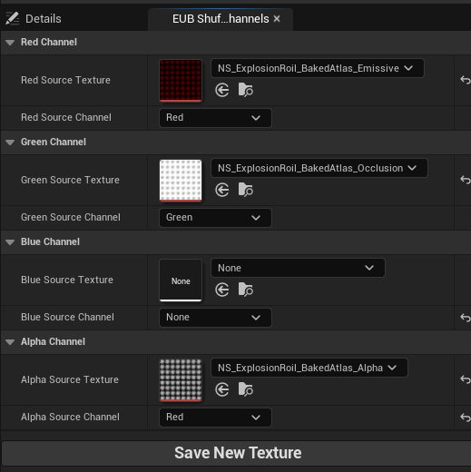
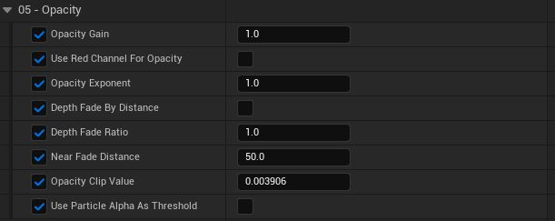
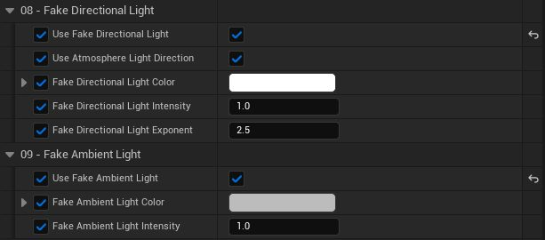

# 尼亚加拉示例包：烟雾和火焰精灵材质

- 来源: https://dev.epicgames.com/community/learning/tutorials/VEvX/unreal-engine-niagara-examples-pack-smoke-and-fire-sprites-material
- 原文标题: Niagara Examples Pack: Smoke and Fire Sprites Material

尼亚加拉示例包包含一个名为 M_SmokeAndFire_Sprites 的示例主材质。该包中的爆炸和烟雾素材均使用此材质。本文档描述了该材质的功能。您可以直接使用该材质，也可以根据需要从中剪切粘贴部分内容。

## Emission, Occlusion, Opacity

## 发射、阻塞、不透明度

该材质需要一个包含自发光、环境光遮蔽和不透明度值的图集纹理。这些值分别位于红色通道、绿色通道和 Alpha 通道中。

可以使用 Niagara Fluids 插件或任何其他 DCC 生成源纹理。示例包中包含一个编辑器实用程序小部件，可帮助您将数据重新排列到新纹理的各个通道中：

## 纹理通道随机排列编辑器实用小部件

## 普通的

该材质还支持法线纹理。此纹理可由体积的密度梯度生成，也可由使用轴对齐光源渲染的图像处理而来。该材质要求法线位于切线空间中。

## 材料亚紫外光或颗粒亚紫外光

该材质允许通过渲染的材质或粒子来为精灵序列添加动画。大多数情况下，动画将针对每个粒子进行，这也是默认模式。

## 材料亚紫外光与粒子亚紫外光

## 底色

您可以选择使用粒子颜色作为基础颜色，也可以忽略它。如果使用粒子颜色（默认设置），则“基础颜色”参数会作为粒子颜色的乘数。

## 发光

红色通道的发射值可以通过以下几种方式应用：

## 作为黑体查找的乘数

## 作为对自定义颜色曲线的查找

## 作为材质颜色的倍增因子

## 作为粒子颜色的乘数

## Auto Exposure Compensation

## 汽车事故赔偿

每个项目的光照条件可能千差万别。例如，阳光的亮度可能比室内灯光高出几个数量级。为了解决这个问题，你的项目很可能需要使用某种曝光补偿技术，将场景的亮度调整到符合你艺术指导要求的范围内。

当相机曝光调整时，粒子系统材质的自发光颜色需要某种方式来补偿其数值：

示例包中的材质会根据 “预曝光视图属性” 调整自发光颜色。自发光颜色值可以乘以或减以达到当前曝光设置的适当级别。

曝光补偿调整功能以材质函数的形式提供，并包含在示例包中。材质函数的设置定义在材质参数集合中，以便项目中所有材质共享相同的设置。

## 不透明度

该材质支持使用红色通道来控制不透明度。当使用单通道图像制作烟雾图集时，这非常有用。

深度淡入淡出可以按世界空间距离或粒子半径的百分比来应用。

粒子透明度值可以用作精灵不透明度的阈值，而不是衰减过渡效果（而非淡入淡出效果）的乘数：

## 普通的

除了纹理提供的法线外，该材质还支持基于球体的法线，可用于为精灵添加整体形状。纹理法线和球体法线的贡献可以独立控制。

默认情况下，法线贡献与不透明度相关。如果底层不透明度过低，无法支持强烈的光照塑形，则可能会显得怪异。因此，随着不透明度的降低，法线会被压平。如果需要，可以禁用此选项：

## 环境遮挡

环境光遮蔽值（来自纹理中的绿色通道）以乘数的形式应用于基础颜色。这样可以整体增加细节，而不仅仅是乘以天空光的贡献。

环境光遮蔽效果会根据粒子不透明度自动调整。随着粒子不透明度的降低，环境光遮蔽效果也会降低，以模拟物理自阴影效果。 Fake Light 假光

该材质支持模拟方向光和模拟环境光。这些光源可以与未发光的模型一起使用，也可以作为附加光源添加到已发光的模型中。

默认情况下，方向光的方向与场景中链接到天空光的主方向光的方向一致。取消选中 “使用大气光方向” 选项，即可使用自定义方向。

环境光遮蔽设置应用于模拟环境光，以帮助增强光照细节。

由于效果是基于材质的，因此不会对模拟光源应用阴影。

## 每个粒子的动态材料参数

该材料支持 4 个可对每个颗粒进行控制的参数：

发光增益：每个粒子发光颜色的倍增器。

温度标度：传递给黑体查找表的温度值的乘数。

温度指数：应用于入射发光纹理的每个粒子的指数。

不透明度指数：应用于传入不透明度纹理的每个粒子的指数。
