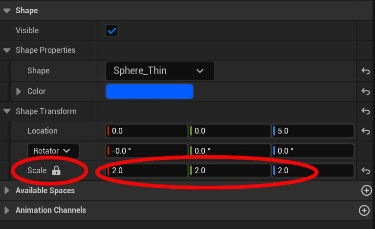
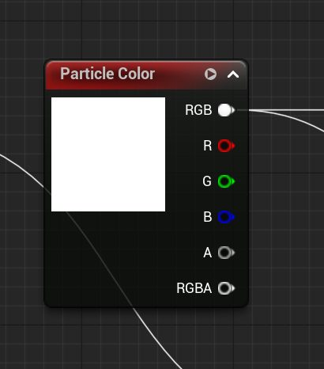

# 创建风格化漫画特效（第一部分）：烟雾轨迹

- 来源: https://dev.epicgames.com/community/learning/tutorials/y0r9/unreal-engine-creating-stylized-comic-fx-pt-1-smoke-trails
- 原文标题: Creating Stylized Comic FX Pt 1: Smoke Trails

## 创作风格化漫画特效 第一部分：烟雾轨迹

## 球体和立方体的建模

球体模型将用于模拟烟雾形状，立方体模型将用于生成骨骼网格，并最终用于构建控制骨架。

要创建球体，请将模式从“选择”切换到“建模”。

这将打开“建模工具”面板。在该面板中，单击“球体”。在视口中单击将初始化球体。在世界地图中单击，然后单击“接受”按钮。

这还会生成一个带有特殊编码名称的关联静态网格资源，并将其放置在名为“Generated”的文件夹中。根据您的项目设置，“Generated”文件夹可以创建在内容浏览器中当前打开的文件夹中，也可以创建在指定的特定位置。

现在，再次使用建模工具，点击“长方体”，创建一个简单的立方体形状。在参数面板中，我将宽度、高度和深度都设置为 10，这样可以使形状保持适中大小。现在，点击“接受”生成长方体。

在内容浏览器中找到该框，右键单击静态网格体，然后选择“转换为骨骼网格体”。在此对话框中单击“转换”将生成一个类型为骨骼网格体的新资源，其中包含一个根骨骼。

在文件菜单中保存所有内容，以确保您的工作安全。 Creating the Control Rig 创建控制装置

选择新建的骨骼网格体（SKM）盒子资源，右键单击并选择“创建/控制绑定”。这将生成另一个与 SKM_Box 资源关联的控制绑定类型的资源。

双击控制绑定资源，打开控制绑定图表面板。单击左侧的“绑定层级”选项卡，在列表中查看根骨骼。右键单击根骨骼，然后选择“新建元素”/“新建控制”。

这将在层级结构中创建一个名为 Root_ctrl 的新项目，其默认 gizmo 形状为一个小的红色球体。

在右侧详细信息面板的“形状”部分，单击默认形状，然后选择要用作控制小部件的形状，并将其缩放到适合几何体外部的大小。



设置烟雾的漫画着色器

着色器功能强大。它支持轮廓、划痕、条带、条带间的纹理、边缘光照、镜面反射、带纹理的山丘、自定义纹理和颜色以及法线贴图。

在内容浏览器中，选择并右键单击 M_Comic_Final 素材，然后复制它。另存为 M_Comic_Smoke。

打开新建的材质图，并将材质着色模型更改为“无光照”。



要在图表中添加分段色带，先取 banding 图表结果的反相并加到 Rim Light 外圈上，再从 Particle Color 中减去该结果，然后将结果乘以 Particle Color 得到带有色带的颜色。将该结果除以 20，再连接到 Blend Darken 节点的 Base，同时把 Outline 图表连接到 Blend 引脚。

将 Blend Darken 的输出连接到 Blend Lighten 节点的 Base，并把 Rim Light 图表结果连接到 Blend 引脚。Blend Lighten 的输出连接到带有 Emissive 参数的 Multiply 节点，然后再连接到材质块的 Emissive Color 引脚。

为了处理相机方向和光照方向向量，使用线性插值节点在二者之间混合，并将其同时连接到 Front Rim Light、Back Rim Light 以及 Banding 图表。

## 尼亚加拉水利系统的建设

在内容浏览器中，右键单击并创建一个 Niagara 系统。您也可以使用现有示例，在本教程中，我使用了 Fountain 示例。

双击 Niagara 系统并打开 Niagara 系统编辑器面板。单击“粒子概览”节点，并将“模拟目标”从 CPUSim 更改为 GPUComputeSim。这将触发一个错误。要修复此错误，请单击下方的“已修复”按钮来切换“计算边界”参数。

在 Niagara 编辑器左侧的“用户参数”选项卡中，单击加号并创建一个新的浮点参数，并将其命名为 SpawnRate。将值设置为 500。

在 Niagara 概览节点的渲染部分，删除精灵渲染器并添加网格渲染器。

在“粒子生成”部分的“添加速度”参数中，将速度模式从“锥内”更改为“点内”。

在粒子更新部分，添加缩放网格大小参数，并将缩放因子设置为“来自曲线的矢量”。

这将使参数中出现曲线向量 3 的曲线。我编辑了曲线，将网格放大到 2.5 倍，然后在粒子生命周期 1 结束前迅速降至零。

接下来，关闭或删除重力参数。

将拖拽值设置为 10。我们不希望粒子扩散得太远。这个值会根据网格的大小而变化。 Uncheck

在“粒子更新”部分，单击“粒子更新”部分标题旁边的绿色加号，然后添加“卷曲噪声力”。将强度设置为 100，频率设置为 1518.0。 *These values will vary based on the size of your mesh,

```cpp
*这些数值会根据网格的大小和您想要的效果而有所不同。
```

在“网格渲染器”参数中，选择之前生成的球体。将“缩放”设置为 0.25。

如果您要创建类似导弹尾迹的效果，其中尖端会呈现炽热的颜色，并在粒子生命周期结束时逐渐变暗，那么您可以在“粒子更新”部分添加一个“颜色”参数。将“颜色”参数设置为“曲线颜色”，然后单击“渐变”选项来调整颜色。从左到右的颜色变化代表粒子的生命周期。我们在修改漫画着色器时会用到这个值。

## 构建 BP_Actor

在内容浏览器中右键单击并创建一个蓝图 Actor，并将其命名为 BP_SmokeTrail。

添加一个 Niagara 组件，并将其设置为新创建的 Niagara 系统。

将 BP Actor 添加到您的关卡中。

## 烟雾轨迹动画

在内容浏览器中，右键单击并创建一个新的关卡序列资源

双击并将关卡序列加载到音序器中。

将控制绑定立方体从内容浏览器拖到序列器时间轴中。它应该会显示为一个已生成的角色。 Next,

接下来，将 BP_Smoketrail 从大纲视图拖到序列器时间轴。

## 你的时间线应该看起来像这样

在时间轴中点击 BP_Smoketrail，然后在动画模式下，在“约束”部分点击加号按钮，选择“平移”。务必点击侧边的三个点按钮以查看约束选项。取消勾选参数中的“保持偏移”，然后点击“创建”。

接下来，系统会提示您选择要约束的父级。在视口中，选择控制绑定的 Root_ctrl。

这将把 BP_SmokeTrail 约束到控件上。现在，可以在时间轴中为 BP_SmokeTrail 设置动画。通过在关卡中拖动控件来测试约束效果。你应该会看到类似这样的效果：

注：我已在 Niagara 系统中关闭了“颜色”参数，以便仅显示材质的默认颜色。但是，如上所述，“颜色”参数对于创建渐变或纯色非常有用。

现在您可以在序列器时间轴的 Root_ctrl 上设置关键帧，并为烟雾轨迹添加动画效果。
