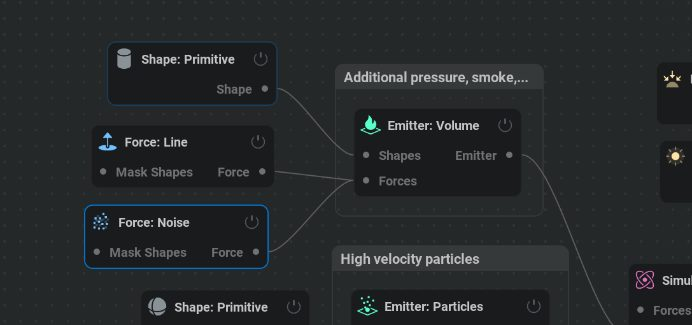
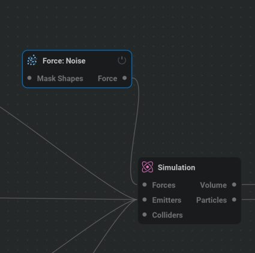
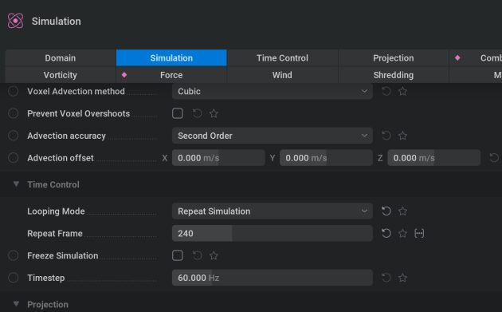
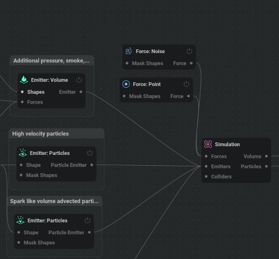
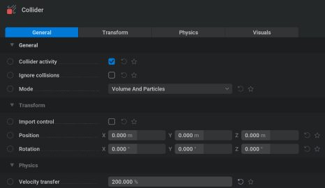
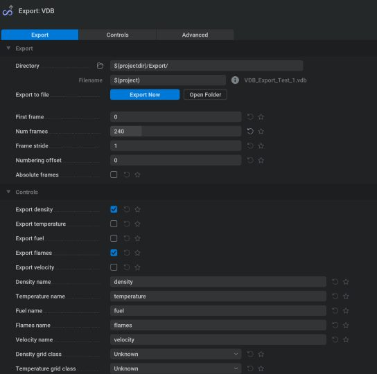

# 虚幻引擎的火焰和气体特效：EmberGen 与 Niagara Fluids 对比 - 第一部分

- 来源: https://dev.epicgames.com/community/learning/tutorials/8Xj8/fire-and-gas-vfx-for-unreal-engine-embergen-vs-niagara-fluids-part-1
- 原文标题: Fire and Gas VFX for Unreal Engine: EmberGen vs Niagara Fluids - Part 1

## 介绍

在本系列文章（共两部分）中，我们将探讨如何在虚幻引擎项目中创建火焰和气体视觉特效——通过设计体积爆炸特效的实际案例，对比 EmberGen 和 Niagara Fluids 两款工具。我们将评估每款工具的优势、局限性和工作流程，帮助视觉特效艺术家根据自身制作需求选择合适的方案。

第一部分 重点介绍 EmberGen：它的界面、基于节点的工作流程、模拟设置和导出功能。我们将逐步讲解如何构建爆炸特效，从发射器设置到 VDB 导出以及与虚幻引擎的集成。

在 第二部分 中，我们将把注意力转移到 Niagara Fluids。我们将研究其引擎原生工作流程、基于模板的设置以及实时碰撞和缓存等独特功能——最终比较两种解决方案在灵活性、可扩展性和生产效率方面的性能。 EmberGen is a standalone application developed by JangaFX, a company founded in 2016 with a focus on building tools for VFX artists. Over the years,

是一款由 JangaFX 开发的独立应用程序。JangaFX 是一家成立于 2016 年的公司，专注于为视觉特效艺术家打造工具。多年来，JangaFX 开发了多款针对视觉特效创作各个方面的应用程序： VectorayGen – a

VectorayGen – 一款现已停止开发的用于为粒子编辑器创建 FGA 矢量场资源的工具。

EmberGen—— 本研究的主题，旨在实现实时火灾和烟雾模拟。

LiquiGen—— 一款正在开发中的流体模拟工具。

GeoGen—— 一款即将推出的地形生成工具。

由于 EmberGen 并非该公司的首款产品，预计它将受益于之前在用户界面/用户体验方面的改进，尤其是在与 VectorayGen 进行比较时。其对实时工作流程的关注也表明其采用了精简且迭代的创作流程。

作为替代方案，我们将评估 Niagara Fluids——Epic Games 为虚幻引擎开发的一款插件。它提供了一系列基于模拟的特效模板，这些模板均使用 Niagara 粒子系统创建。预计该方案将与虚幻引擎的子系统实现最高级别的兼容性，并提供适用于电影级序列的直接、引擎原生工作流程。

为了比较这两种工具，我们将模拟地表爆炸效应。

爆炸初期会形成一个高温等离子球，随后逐渐演变成上升的烟云。在后续阶段，我们将测试其与动态外部因素的相互作用，例如，作用于烟雾的点力（使其在其半径范围内扩散）或作用于固体物体（使其发生物理碰撞）。

我们将对每种工具的工作流程进行比较，并就其易用性和实际适用性得出结论。 EmberGen

## 界面

程序界面为用户提供两种主要模式，可通过专用按钮进行切换： Home Screen Mode 主屏幕模式

此模式会展示近期项目的动画预览，并提供一系列基础模板供您选择。此外，它还包含学习资源的链接。EmberGen 在此视图中的一大亮点是“预设”选项卡，其中包含数十个高质量、即用型的示例。这些预设可以作为新特效的起点，也可以作为实践培训材料，因此对于初学者和经验丰富的用户来说都是宝贵的资源。

## Project Workspace Mode

## 项目工作区模式

这是直接处理项目的模式，也是本次研发的主要重点。主界面简洁明了，由四个关键面板组成。可以使用 Ctrl + 空格 键快捷键分别最大化每个面板，以便更专注于特定内容。

界面中新增的 画中画 功能让用户可以在浮动的微型 3D 视口中查看模拟结果，同时还能专注于编辑器中的特定面板。

## 3D Viewport 3D 视口

第一个面板是 3D 视口，您可以在这里查看模拟结果。可视化质量可以根据性能优先级进行调整——从禁用光照和过滤的简化视图（仅关注效果形状）到启用所有视觉功能的完整渲染预览。

## 视口分为三个选项卡： Scene 阶段

这是上面描述的标准视口，用于一般仿真预览。

## 使成为

此选项卡显示用于渲染序列或纹理图集的摄像机视图。它还提供对各种渲染输出的访问，这些输出可用于导出到游戏引擎（用于复杂的着色器）或外部合成软件。

## 出口

此选项卡允许您预览导出结果。如果渲染的是翻页动画，您可以查看完整的纹理图集，也可以逐帧查看并播放动画。

## 节点图

界面的下一部分是 节点图。EmberGen 使用非破坏性的基于节点的系统来构建特效。这使得用户可以快速定位和优化特效的特定部分，根据需要调整其复杂度，禁用整个节点组，并将节点克隆为可重用的预设，这在开发过程中便于迭代或返回到之前的版本。

## 节点图将节点组织成功能类别： Shape 形状

一系列定义基本图元及其操作的节点。这些图元可用作碰撞器或流体交互的遮罩。

## 发射器

这些节点负责将流体注入模拟体积。这可以通过体素体积或粒子系统来实现。

## 对撞机

处理流体与固体物体之间的相互作用。

## 力量

一组用于控制流体行为的物理力。

## 光

用于可视化特效的光源集合，通常是渲染动画纹理所必需的。

## 相机

在场景中添加一台摄像机。

## 数量 Brings in external geometry,

引入外部几何体，无论是静态网格还是骨骼网格。

## 出口 Contains nodes for exporting data,

包含用于导出数据的节点，例如 VDB 序列或经典的翻页动画纹理。也支持粒子导出。

## 调制器

这是一组数学函数和振荡器，用于按时间顺序驱动效果参数。

## 颜色

用于颜色自定义和控制的节点。

## 天空包厢

这是一个后台节点，导出翻页书或 VDB 时甚至不需要它，但它仍然可以增强视口可视化效果。

## 地面

地面平面的可视化表示（无碰撞）。

## 阶段

控制场景的色调映射和后期处理设置。

流体模拟所需的核心节点。

## 阴影

控制流体的着色特性。

## 批量处理

用于导出前进行额外的音量调整。

每个节点的属性都可以在第三个关键界面面板中进行调整：属性面板，它位于节点图的正下方。

此面板显示当前所选节点的按类别组织的参数集。它还包含额外的筛选选项卡，以便更高效地进行导航： Favorites –

收藏夹 – 仅显示标记为收藏夹的参数。

时间轴 – 显示使用关键帧进行动画处理的参数。

随机化 – 列出已应用随机值的参数。

界面的最后一个主要部分是时间轴。与虚幻引擎中的序列器类似，该区域允许您使用关键帧来制作动画参数。您还可以将关键帧视为动画曲线，调整插值类型，并微调切线以实现精确控制。

## EmberGen 中的仿真行为和导出功能

模拟系统的一个关键特性是其播放行为：暂停时，模拟会停止；再次按下播放键，模拟会从中断处继续播放——无论播放头在时间线上的当前位置如何。模拟以线性方式进行，并将播放期间的任何手动参数调整视为恒定值。

为了充分观察关键帧更改或参数调整对最终模拟结果的冲击效果，必须重置模拟。可以通过时间轴中的 重置 图标或按 R 键来完成此操作。

这种行为有一个缺点：要评估更改后效果的最终状态，必须从头开始重新观看整个模拟，这可能会非常耗时，尤其是在模拟时间更长或更复杂的情况下。

此外，还有专门针对使用体积发射器的流体模拟而提供的 循环选项。要启用此循环，特效必须先“预热”，直到其起始帧与循环的预期结束帧非常接近。

对于 粒子系统，您可以指定一个特定的帧，在该帧之后，模拟将自动重置到第 0 帧并重复进行。

如前所述，按下 R 键会重置模拟。如果在时间轴中定义了循环范围，则播放会重置到该范围的开头。要执行 完全重置 （建议在某些工作流程中使用），可以使用 Ctrl + R 的 硬重置 功能。

## EmberGen 的实际应用

## 支持多种关键的导出和集成工作流程：

## 翻页书纹理生成

EmberGen 的主要用途是为视觉特效创建逐帧动画纹理。它包含所有必要的渲染工具，并提供导出 深度、法线和运动矢量 等辅助贴图的选项——这些贴图对于在虚幻引擎中构建高级着色器至关重要。

## 使用遮罩进行图像序列渲染

对于传统的 VFX 流程，特效可以渲染成带有遮罩的图像序列（例如 PNG 或 EXR），以便在后期制作中合成到最终镜头中。

## 卷导出 Volumetric simulations can be exported in VDB format ,

体积模拟可以导出为 VDB 格式，以便在虚幻引擎中进行进一步处理或用作 稀疏体积纹理。

粒子导出为 Alembic 格式 Although not natively supported in Unreal Engine yet, particles can be exported as Alembic files ,

虽然虚幻引擎目前还不支持粒子，但粒子可以导出为 Alembic 文件，理论上将来可以通过 Houdini 和自定义 Niagara 数据接口进行集成。

在 EmberGen 中创建爆炸

首先，您需要在图中添加两个基本节点： 场景 和 模拟。

场景 节点作为模拟空间中所有视觉元素的容器，还可以用于选择性地调整最终渲染的外观。

在场景节点的 体积 输入端，连接模拟节点的体积输出端。该输出端代表最终的体素体积，稍后将导出为 VDB 文件。

在 模拟 节点设置中，您需要定义模拟体积的边界。该体积本质上是一个三维体素网格，其中每个维度都有其自身的分辨率，该分辨率决定了沿该轴的体素数量。

每个轴上的体素数量由 体素计数 参数控制。 Just below it is another critical setting: Voxel Size ,

紧随其后的是另一个关键设置： 体素大小，它定义了世界空间中每个体素的大小（以米为单位测量）。 Currently,

目前，模拟边界在整个模拟过程中保持不变，并直接冲击效果模拟的质量和细节水平。如果模拟范围超出定义的体积，则必须扩展边界。但是，如果在未相应调整体素大小的情况下增加体积，模拟的行为和视觉质量可能会发生显著变化。

为保持一致性， 体素大小 应与 体素数量成比例缩放。

例如，如果将分辨率从 384 体素增加到 512 体素，则现有的体素大小 0.5 应乘以比率 512 / 384 = 1.333，从而得到新的体素大小约为 0.665。

如果体素尺寸不均匀，调整就会变得更加复杂。在这种情况下，建议基于体素计数中的最大轴来计算比例，以保持比例性。 After changing the resolution,

更改分辨率后，必须单击 “应用新分辨率” 弹出按钮以确认更新。 Additionally, to optimize the use of the voxel space,

此外，为了优化体素空间的利用，您可以调整模拟的枢轴点。对于水平方向（X 轴和 Y 轴），通常选择“中心”作为枢轴点比较合适。对于垂直方向（Z 轴），由于烟雾通常会上升，因此最好将枢轴点设置为“最小值”，使其位于体积的底部。

您还会注意到 “模拟” 选项卡中的第一个参数名为 “模拟模式”，其默认设置为 “燃烧”。虽然描述中暗示存在 “基本模式”，但唯一可用的选项是 “彩色烟雾”。

使用 燃烧 模式是 EmberGen 相较于 Niagara Fluids 的主要优势之一。与主要依赖于 密度 和 温度 这两个参数的 Niagara 不同，EmberGen 的燃烧模式采用了一种更复杂的模型，该模型基于四个相互关联的参数： 烟雾、燃料、温度和火焰。 It’s also important to consider the Time Step parameter under the Time Control tab,

此外，还需注意 “时间控制” 选项卡下的 “时间步长” 参数，该参数设置为 60 Hz。这意味着模拟程序设计为以 60 FPS 的帧速率运行，开发人员强烈建议并强调此设置，以获得最佳性能和稳定性。

由于爆炸发生在地面，因此必须将模拟体积的底部边界定义为实体表面。这可以通过在 “力” 选项卡中启用 “实体地面” 选项来实现。虽然此设置也可以应用于体积的其他边界，但对于此特定效果而言并非必要。当烟雾接触到侧面或顶部边界时，它只会受到裁剪，而不会冲击效果模拟的内部行为。

现在我们需要添加火源和烟雾源。在 EmberGen 中，火源和烟雾源是通过 Emitter 节点定义的。

首先，我们将创建一个基于粒子的 球形爆炸发射器， 该发射器会发射火焰。为此，请添加一个 “发射器：粒子” 节点，并将其连接到 “模拟” 节点的 “发射器” 输入端。

接下来，我们需要定义发射器的形状。为此，添加一个 “形状：图元” 节点，将其类型设置为 “球体”，并配置其半径和在三维空间中的位置。初始放置时，将其放置在离地面稍高的位置效果很好。 Then,

然后，通过“形状”输入将形状连接到 “发射器：粒子” 节点。

接下来，我们可以配置发射器本身。由于这将是一次性爆炸，不会持续生成粒子，因此请启用 “突发发射” 参数。

使用 “爆发大小” 设置粒子数量。

为了给球体内原本均匀的粒子分布增加一些自然变化，调整 抖动距离 参数。

发射类型 设置为 “纠缠”，这会使粒子以长条状的条纹图案发射。如果设置为 “常规”，粒子则会形成均匀的“云状”粒子流，不会出现可见的条纹。

你还可以调整每道光束的粒子数，这基本上决定了爆炸会产生多少道不同的光束。

为粒子设置较短的 生命周期，理想情况下应在一个随机范围内。生命周期越长（尤其是在高速运动时），产生的火焰或烟雾就越有可能过早到达模拟边界或占据过多的空间。

将初始运动模式设置为 “根据位置计算速度”， 并使用“ 发射速度限制 ”参数微调速度范围。

按照目前的配置，粒子会从中心向各个方向发射：

与地面碰撞会阻止粒子向各个方向均匀扩散，这已经为初始火焰和烟雾增添了一种自然感。然而，为了获得更强烈的效果，您可以通过将原点（用于 在“根据位置计算速度 ”模式下计算速度）略微向下移动，使发射形状更接近圆锥形：

您还可以通过调整 重力倍率， 使其具有较小的随机范围，从而引入重力冲击效果的轻微变化。

为防止粒子反弹，建议将 粒子反弹度 设置为 0。 或者，您可以将 地面边界 参数设置为 忽略。 Next,

接下来，将粒子方向类型设置为 速度对齐， 使粒子跟随其运动方向。

速度缩放 控制粒子沿其运动矢量方向的拉伸程度。该值最高可增加 500%，以获得更具动感的效果。

您还可以根据所需的火焰和烟雾行为，微调粒子注入模拟中的温度、烟雾和速度的排放。 Afterwards, we’ll

之后，我们将通过添加火花来增强火焰爆发效果。

创建一个新的 “发射器：粒子” 节点，并将其连接到 “模拟” 节点的 “发射器” 输入端。您会注意到，EmberGen 支持同时连接多个发射器。

我们将使用相同的 Shape: Primitive 节点作为新发射器的表单。

这也是一次性爆炸，大部分参数与之前的发射器类似。不过，我们这里特别关注 “主动力” 部分下的 “体积” 参数。

在第一个发射器中，该参数设置为 0，这意味着粒子行为仅遵循预定义的规则。在本例中，我们将它设置为 100，允许粒子受到模拟范围内的各种力（例如湍流噪声）的冲击效果，从而在火花中产生引人入胜的旋转运动。 It’s also worth noting that when you add more particles and they begin to overlap within the same voxels, they amplify each other’s properties—such as temperature and density—resulting

值得注意的是，当添加更多粒子时，它们开始在同一体素内重叠，它们会增强彼此的属性（如温度和密度），从而产生更明亮的火焰和更强烈的初始形状。

这种装置在燃烧的同时也会产生一些烟雾，但典型的爆炸会产生浓密上升的蘑菇状云团。

为了增加烟雾密度和效果，我们将引入一个额外的发射器——这次使用 体积型发射器。 通过 “发射器：体积 ”节点 发射发射器。

为此，请将发射器的形状设置为 圆柱体，并相应地调整其大小和位置。

在发射器的设置中，禁用模拟中的 燃料喷射， 以避免密度过高，防止火焰在烟雾云中停留过久。

想要获得更自然的发射模式（不严格遵循圆柱形），请增加 发射梯度 值。 Next,

接下来，调整 压力 参数以冲击效果模拟图案的演变形状。为了增强细节和变化，请增加 “压力随机尺度”。您还可以通过调整 “压力随机速度”来增加湍流。

作为一项可选的视觉增强功能，您可以将此发射器设置为在火焰发射期间充当光源。这不会冲击效果 VDB 导出，但可以增强视口中的视觉预览效果。

让我们添加一些只会冲击效果这个发射器的外部力。首先，将一个新的 “力：线” 节点连接到发射器的 “力” 输入端。

这将是一条 垂直线，它会对粒子施加额外的向上力。

这种推动力的强度由 “推动力强度” 参数控制。 “扭转” 和 “排斥” 可以沿不同轴向产生各种效果——包括类似龙卷风的运动——但对于这次爆炸，我们将它们设置为零（尽管在烟雾形成阶段可能需要增加 “排斥”的值）。

我们还会通过添加一个 “力：噪声 ”节点并相应地调整其振幅来引入混沌和湍流。

为了统一三个发射器的行为，我们需要添加冲击效果整个模拟的 全局力。这可以通过将 “力” 类型的节点连接到 “模拟” 节点的 “力” 输入来实现。 Let’s

我们先添加一个湍流节点： 力：噪声。

总体而言，它的参数与之前创建的用于发射器的 Force: Noise 节点类似。但是，在这种情况下，您可以通过将 八度音阶数 提高到 5 来略微调整 振幅 并增加 噪声细节。

您还可以更改 种子 值，这将引入一个固定的随机因子，使这种噪声模式在视觉上与其他噪声节点区分开来。

在 “遮罩” 部分，您可以指定力作用于哪些模拟元素。例如，如果您将除 烟雾 （设置为 100%）之外的所有值都设置为 0%，则 噪声 将仅应用于烟雾。

您还可以添加沿表面向外辐射的环形 冲击波效果。为此，请在 模拟 中添加另一个 “发射器：粒子” 节点，并将其连接到一个新的 “形状：图 元”节点。将形状的 “类型” 字段设置为 “圆环” 以创建环形形状。

总体而言，它的参数与之前的 “发射器：粒子” 节点类似。但是，在这种情况下，您仍然需要使用较短的生命周期，并在“主动力”部分分配适中的 体积冲击效果 ——最高可达 36% 左右。

## 微调仿真参数

现在核心爆炸模型已经搭建完毕，接下来需要对模拟参数进行微调。在 “燃烧” 部分，您可以控制烟雾的 量和扩散范围。

“消散” 部分定义了各种元素（例如烟雾或火焰）随时间消散的速度。数值越高，该元素从场景中消失的速度就越快。

扩散 部分会冲击效果效果如何“融入”周围的空气，从而产生平滑或柔化的效果。

涡旋度 会增强烟雾的旋转特性。您可以使用本节中的 “遮罩” 参数选择性地应用此效果。例如，将 “恒定 ”设置为 20% 会以该强度均匀地应用旋转效果，而将 “速度遮罩” 设置为 100% 则仅对快速移动的粒子增强此效果。 Buoyancy determines how "light" the explosion feels—the higher the value,

浮力 决定了爆炸的“轻重”程度——数值越高，烟雾和火焰上升得就越高。

要增加烟雾的 重量，可以增加 烟雾重量 值。

该节点还允许您定义参与模拟的粒子的最大数量和质量。

在调整爆炸效果时，您可能已经注意到， 默认情况下模拟会无限 循环，只能通过 R 或 Ctrl+R 手动重置。要实现自动化，请转到“模拟”节点的“时间控制”部分，并将“循环模式”设置为“重复模拟”。然后，将“重复帧”设置为烟雾完全消散后的帧。

这应该尽可能接近视觉特效的实际结尾——尤其是在您想要尽量减小 VDB 文件大小的情况下。不过，您也可以稍后通过着色器加快烟雾消散速度，而无需导出过多的帧。

为了使爆炸效果更具表现力和动感，仅靠程序参数可能不够——这就是时间轴和参数动画发挥作用的地方。

## 以下是一些参数动画示例：

发射器：体积 （负责烟雾云）在模拟开始时激活，但在最初的半秒内停用，以防止烟雾过度积聚。

其 烟雾生成速度 在第一秒内加快，逐渐使烟雾变得更浓更清晰。

随着等离子球出现并过渡到烟雾云，压力对模拟的贡献逐渐减小。

您还可以为全局 “力：噪声” 节点添加动画效果——最初将其方向设置为向上以创建上升运动，然后逐渐将其过渡到更 均匀的 噪声图案。

在 “力：线” 节点中，在爆炸瞬间，将 “排斥” 值从 0 动画化为负值（大约 -3），以产生向内的拉力效果，将烟雾拉向线条。

为了确保烟雾在到达模拟边界之前消散，您可以对 烟雾消散、烟雾扩散、浮力和膨胀 等参数进行动画处理，强制烟雾在预期的帧范围内消散到空气中。

您还可以添加一个局部点力来向外推动烟雾。这可以通过添加一个 “力：点” 节点并将其连接到模拟来实现。

反弹强度 参数控制向外力的强度。

为了增强效果，建议将“附加压力速率”设置为正值。要使点力中心随时间在烟雾中移动，请对 “位置” 参数进行动画处理。

为了增加真实感，您可以导入动画骨骼网格并将其用作模拟中的 碰撞器。

为此，请将 碰撞器 节点连接到 模拟 节点的 碰撞器 输入端——该节点将处理碰撞设置。然后，创建一个 导入 节点，并将其 几何体 输出连接到 碰撞器 节点的 形状 输入端，从而将网格导入场景。

之前已使用 导出 按钮将直升机的动画控制模型导出为 FBX 格式。

支持导入 FBX 和 Alembic 格式的动画。

在 “文件路径” 属性中，您可以指定 FBX 文件的路径。使用默认设置，EmberGen 可以正确解析骨骼和蒙皮——这与 Blender 中遇到的一些常见问题不同。 You’ll

您只需要设置合适的 “主缩放” 值即可。由于虚幻引擎中爆炸比例增加了 10 倍，而导入的效果似乎是 1:100 的比例，因此将 “主缩放” 设置为 10 倍 即可恢复正确的比例。

由于动画序列设置为 60 FPS，就像 EmberGen 一样，因此无需调整帧速率。

在 碰撞器 节点设置中， 速度传递 参数从 100% 增加到 200% ——这增强了碰撞器在烟雾中运动引起的旋转效果，使交互在视觉上更具动态性。

要导出 VDB 文件，请添加一个 “体积处理 ”节点，并将其连接到 “仿真” 节点的 “体积 ”输出。该节点会提供一个 VDB 输出，该输出可用于导出。

创建新的 导出：VDB 节点并将其连接到 卷处理 节点后，剩下的就是配置以下内容： VDB save path VDB 保存路径

## 帧范围

## 要导出的属性

然后您可以点击 “立即导出” 按钮。这将在磁盘上生成一系列逐帧的 .vdb 文件。值得注意的是，序列中的每个 .vdb 文件的 大小可能不同，因为文件大小取决于模拟体积内填充的体素数量。

起初，文件大小相对较小，但随着爆炸范围扩大和烟雾增多，文件大小达到峰值，然后随着烟雾消散而逐渐减小。帧总数和填充体素的数量共同决定了序列的整体大小，无论是作为 VDB 缓存 还是导入到虚幻引擎后。

EmberGen 中的 体积处理 节点还负责对体积进行后处理，例如应用 锐化 滤镜。在本例中，我们将启用 运动模糊，它会根据体素的 速度矢量 对其进行模糊处理。

我们还会为这个属性添加动画效果：一开始数值较高，随着火焰消失逐渐降低到零。 It’s important to note that in Unreal Engine, while the default VDB material recognizes density and temperature attributes, exporting temperature from EmberGen’s

需要注意的是，在虚幻引擎中，虽然默认的 VDB 材质能够识别 密度 和 温度 属性，但从 EmberGen 的 燃烧模式 导出温度可能会导致火焰解析错误。正确的做法是导出 火焰 属性——虚幻引擎的着色器能够正确解析并将其视为温度。

要将 VDB 导入虚幻引擎，请打开 内容浏览器，然后在导入新资源时，选择导出的 .vdb 序列的 第一帧。

在导入设置窗口中，您可以查看已导出的 属性，选择它们的 位深度 （8 位压缩率最高，体积最小），并选择要将它们分配到的属性组和通道。虽然此映射关系可以在素材处理后期进行调整，但如果您使用的是既定的工作流程，则可以直接在此对话框中遵循该流程结构。

## 默认设置 通常就足够了。 After a brief processing period,

经过短暂的处理时间后，OpenVDB 序列将被加载并转换为称为 动画稀疏体积纹理 (SVT) 的 专用资源。 It’s

值得注意的是，包含所有 VDB 帧的原始文件夹占用了 10.6 GB 的 磁盘空间。导入和压缩后，生成的 .uasset 文件只有 879 MB。

该资产必须分配到爆炸所用的 材料 中。

/Engine/EngineMaterials/SparseVolumeMaterial.

为此，请创建一个新的 材质实例，并使用引擎提供的专为此类内容设计的母材质：

/Engine/EngineMaterials/SparseVolumeMaterial。

将此主材质设置为新实例的 父材质。

配置材质的第一步是将 您的 SVT 资产分配 给它。

接下来，我们需要确保 属性映射 设置正确。 Temperature (or Flames,

温度（或在燃烧模式下为火焰）应分配给属性组 B 的 R 通道。

应将密度分配给属性组 A 的 R 通道。

这些任务需要在 材料 中进行配置。

由于烟雾仍可能到达模拟体积的边缘，因此会导致 生硬的切边 ——尤其是在启用阴影时更为明显。为了缓解这种情况，建议在着色器中添加基于渐变的衰减。此渐变会降低体积边界附近 的密度 值，使烟雾逐渐褪色至 0 不透明度。要实现这一点，请使用以下设置并将其乘以密度参数：

这种设置允许我们使用 RampMask 参数来选择衰减将应用于三个全局 X、Y 或 Z 轴中的哪一个，而 Ramp Contrast 参数控制渐变过渡的平滑度或锐度。

材质设置完成后，您可以向场景中添加一个新的 异质体积 Actor，并在其属性中指定包含 SVT 的材质。 Here,

在这里，您还可以通过启用 “播放”和 “循环” 选项，在编辑器中配置帧速率并预览循环效果。

如果需要使用 序列器 为效果添加动画，建议 禁用 播放 和 循环 选项，而是使用 帧 参数手动驱动动画。

还需要记住，在使用关键帧播放任何基于缓存的动画时，动画应该是线性的。 So, make sure to set the interpolation type to Linear for the keyframes—this

因此，请确保将关键帧的插值类型设置为线性——这将使关键帧标记显示为三角形。 Results 结果

## 结论

完成第一部分后，您应该已经在 EmberGen 中拥有一个可运行的爆炸原型——它由发射器、力以及模拟参数构建而成，并导出为 VDB 文件，可在虚幻引擎中使用。这为比较不同工具的实时气体模拟奠定了基础。在第二部分中，我们将深入研究 Niagara Fluids，探索其引擎原生设置、模板驱动的工作流程以及碰撞处理，以了解它与 EmberGen 的对比情况。 Happy simulating! 💥 模拟愉快！💥
