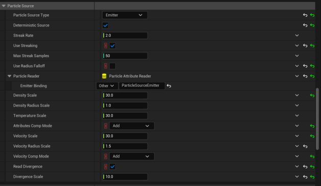

# 虚幻引擎的火焰和气体特效：EmberGen vs Niagara Fluids - 第二部分

- 来源: https://dev.epicgames.com/community/learning/tutorials/m6yO/fire-and-gas-vfx-for-unreal-engine-embergen-vs-niagara-fluids-part-2
- 原文标题: Fire and Gas VFX for Unreal Engine: EmberGen vs Niagara Fluids - Part 2

虚幻引擎的火焰和气体特效：EmberGen 与 Niagara Fluids 对比 - 第二部分

## 介绍

在本指南的第二部分，我们将介绍 Niagara Fluids——虚幻引擎的原生火焰和气体模拟解决方案。本部分以 EmberGen 中创建的爆炸原型为基础，重点讲解 Niagara 的模板驱动工作流程、发射器设置和体积模拟工具。您将学习如何为爆炸核心和冲击波配置粒子组、应用湍流和浮力，以及直接在引擎内管理碰撞。

我们还将介绍缓存、扩展和渲染工作流程——重点介绍 Niagara 在实时迭代方面的灵活性以及与 EmberGen 相比的局限性。在本节结束时，您将拥有一个可用于生产环境的 Niagara Fluid 爆炸特效，并且对它在可用性、可扩展性和最终输出质量方面相对于 EmberGen 的性能有更清晰的了解。 Niagara Fluid 尼亚加拉流体

该解决方案利用了 Niagara 编辑器中现有的模拟阶段和 3D 网格功能。它以模板的形式提供，建议以此作为起点——因为从头开始构建这样一个系统将是一个极其复杂的过程。

## 概述

尼亚加拉火灾和烟雾模拟的核心是一个双发射器系统： Parent Emitter 母发射体

这是一个传统的尼亚加拉发射器，其 渲染 组件已被禁用。除了标准属性外，该发射器还存储了 密度 和 温度 等各种属性，这些属性会通过 “设置流体源属性” 模块传递给下一个发射器。这些属性定义了模拟的初始火焰和烟雾值。

## 子发射体

这是实际的体素模拟。它从父发射器接收数据，并使用体素 3D 渲染目标，通过一系列递归操作对其进行处理。父发射器是可选的——您也可以使用程序生成的图元（例如，球体），或者，在实验阶段，使用 数据通道。

与 EmberGen 的燃烧模式相比，Niagara Fluids 使用的模型更为简化，主要基于 密度 和 温度 属性。您可以禁用任一属性来独立模拟火焰或烟雾。 Rendering Options 渲染选项

黑体渲染 ——基于温度属性。

颜色曲线渲染 ——基于用户定义的颜色曲线。

## 支持的功能

## 分歧

此功能允许将气体从源粒子周围推开，这对于爆炸效果非常有用。设置负值则会使气体向内收缩。

速度约束

有助于在烟雾旋转后保持其结构。仅适用于移动的颗粒，并能提高细节保留率。

## 湍流层： Initial Turbulence 初始湍流

## 湍流 1

## 湍流 2

这三层可以单独应用，也可以组合应用，并专门针对密度通道或温度通道。

## Small

通过分解较小的特征来增加精细细节；其频率与体素大小有关。

## 风

内置抗风能力支撑。

## 碰撞

实时碰撞检测支持多种引擎对象类型。

## 补偿演员动作 Transfers the velocity of the Niagara Actor’s

将 Niagara Actor 的父对象的速度传递到模拟中，以实现更精确的交互。

## 裸奔 Enables interpolation of fast-moving particles to create smoother,

能够对快速移动的粒子进行插值，从而创建更平滑、更连续的轨迹。

## 在尼亚加拉流体中制造爆炸

首先，创建一个新的 Niagara 系统。和往常一样，系统会提示您从可用模板列表中进行选择。启用 Niagara Fluids 插件后，列表中会出现一个新的类别。在本设置中，我们将使用 Grid3D_Gas_Divergence_Explosion 作为基础模板。

## 尼亚加拉流体爆炸系统的解剖结构

当您使用 Grid3D_Gas_Divergence_Explosion 模板创建系统时，它会自带两个发射器：

一个标准的 粒子源发射器，用作效应的源。

负责处理体积模拟，并自动链接到源发射器。

（您也可以从发射器模板列表中手动添加模拟发射器，但这样做需要您手动设置和链接父发射器。） However,

## 然而，这种基于模板的方法也存在一些缺点：

发射器被拆分为多个高级配置部分，这些部分与底层系统模块巧妙地融合在一起。某些参数名称在这些层级中重复出现，这可能会导致意外的覆盖或冲突。

由于发射器的复杂性和相互依赖性，很难将其概念化为清晰的模块化组件。因此，您需要通过高级用户界面来启用或禁用已知功能——如果您要扩展或缩减复杂性，则没有安全的方法可以删除或简化这些组件。

此外，该系统仅支持一个父发射器，这限制了灵活性。例如，如果您希望爆炸的不同区域具有不同的粒子行为，则需要找到一些巧妙的变通方法——例如，结合使用生成组和基于数学的组掩码过滤。

设置多个粒子组

## 在本例中，我们将定义两个粒子群：

## 核心爆炸

## 另一个用于冲击波环

使用 Spawn Burst Instantaneous 模块模拟一次性爆炸。

我们将创建此模块的两个实例，每个实例都有一个唯一的 生成组 ID （例如，0 和 1）和自定义参数，例如生成的粒子数量。 It’s also important to introduce a slight delay in particle emission to account for sampling latency—usually

为了弥补采样延迟，引入粒子发射的轻微延迟也很重要——通常约为一帧。0.1 秒左右的 生成延迟 效果不错。第一组粒子（核心爆炸）可以稍晚一些生成——例如，在 0.2 秒时生成——因为冲击波预计移动速度更快，应该最先出现。

接下来，在发射器中，我们创建两个新参数： VelocityMultiplier 和 SphereRadius。它们分别控制粒子的 全局速度倍率 和粒子生成 球体的半径。

根据 SpawnGroup 的不同，我们为粒子分配不同的生命周期。遵循与 EmberGen 相同的原理，源粒子的生命周期越长，流体到达模拟边界的速度就越快，产生的密度和气体也越多。因此，生命周期应保持相对较短。

借助 生成组 遮罩，我们可以使用两个 形状位置 模块，并指定 生成遮罩组 参数。对于主爆炸体，它是一个完美的球体，粒子均匀分布在其体积内。对于冲击波，它是一个通过 非均匀缩放扁平化 的球体，粒子仅出现在其表面（球体表面分布 = 1）。

接下来，使用两层不同频率的 矢量噪声 随机偏移粒子位置。这增加了不规则性，有助于使爆炸初始阶段的形状更加自然。

接下来，我们根据粒子与中心的距离，给粒子添加一个初始速度（类似于我们在 EmberGen 中使用 Velocity from Position 函数的方式）。

之后，我们添加了一个选项，可以对爆炸中心进行全局垂直偏移，使其与模拟域边界对齐。

我们还会根据粒子 生成组（SpawnGroup）为粒子增加额外的速度。冲击波的移动速度将是主爆炸体的 1.5 倍。

本文引入了 粒子密度 属性，该属性控制模拟中的初始气体生成。为了增加变化，我们使用单独的 矢量噪声 对该属性进行调制。与位置值（可以为负值）不同，我们重新映射结果，使最小密度为 0.2，最大密度为 1。

我们还添加了 阻力 模块来模拟空气阻力。

我们添加了一个碰撞模块，以确保冲击波沿表面传播，而不是从表面下方穿过。与 EmberGen 一样，反弹效果被禁用。对于碰撞几何体，我们采用了最简单可靠的方法——一个向上放置的 解析平面。其垂直位置需要根据爆炸的起始点和模拟区域的下边界进行仔细调整。

我们还使用 “杀死粒子” 模块来移除速度大小低于 1 的粒子，从而消除模拟中速度过慢的粒子。

最后，在 “设置流体源属性 ”模块中，我们可以控制粒子生成的初始流体参数—— 密度、 温度、 速度、 散度 和 半径。调整这些值会对爆炸的初始速度、烟雾和火焰的量、形状以及膨胀力产生显著冲击效果。借助 “生成组遮罩”，我们可以为每个粒子组单独分配不同的值。

应特别注意 半径 值——它必须根据模拟的分辨率和尺度进行设置。如果半径过大，会产生低分辨率模拟中常见的粗尾迹和火焰射流，因为单个粒子会同时写入多个体素。如果半径过小，则可能导致尾迹不连续，并减少火焰总量，在某些情况下甚至会完全阻止火焰生成。 Next,

在 “枢轴点” 字段中，我们指定模拟的中心点。为了优化空间，我们通过调整 Z 分量将底部边界降低到地面。

下一个重要参数是 浮力。正值会使气体上升，此时粒子速度的冲击效果大于重力。相反，负值会使气体“下沉”。这些设置分别针对火焰（温度）和烟雾（密度）进行定义。在这里，我们通过赋予较小的负 密度值 来略微“增加”烟雾的“重量”，并通过赋予略高的 温度 值来加快火焰的燃烧速度。

为了保证插值质量，我们使用 三次插值，因为它能提供最佳效果（而 线性插值 会产生更平滑、细节更少的形状——EmberGen 中也有类似的设置，其默认值也是三次插值）。

为了实现更精细的烟雾扩散，我们启用 “计算涡旋约束” 功能。然后，我们设置 涡旋倍增器，并通过 “涡旋速度衰减 ”定义倍增器生效时的粒子速度。对于速度为零的粒子，该效果无效；而速度介于两者之间的粒子速度则会按比例插值，直至达到设定的倍增器值。

启用 初始湍流 后，我们可以为 密度通道 配置新生成气体中的初始湍流模式。 湍流频率 设置该模式的频率，而 湍流增益 控制该效果的整体强度。

在 Particle Source 设置中，启用 Deterministic Source，以确保在参数固定时每次渲染的效果一致。为保持一致性，源发射器也应启用 Determinism。

由于粒子移动速度很快，它们会以固定频率在体积中采样，可能跟不上粒子速度。此时轨迹会呈现为一串分离的点。为避免这种情况，启用 Use Streaking，它会沿粒子速度路径生成额外采样，填补空的体素。Streak Rate 和 Max Streak Samples 参数控制额外采样的频率以及最大复制数量。本节还可以设置从源粒子继承的属性倍增器，并启用 Divergence 属性采样（所选模板默认已启用）。在 Attributes 部分，可以禁用火焰或烟雾，并使用 Dissipation Rate 控制其消散速度。

Attribute Resolution Multiplier 是影响爆炸视觉质量的另一个关键因素。默认值为 1（内部硬编码不会低于该值）。提高它可以在不增加总像素数量的前提下提升效果细节，相对更利于性能，不过仍会带来一定性能开销。与 EmberGen 中类似，建议启用气体与体积下边界的碰撞。为此，在 Boundary 部分禁用 Open Boundary -Z 参数。

遗憾的是，该效果不支持外部力作用于气体模拟。因此，不能像在 EmberGen 中那样使用 Point Force，只能通过与外部几何体碰撞来交互。当前状态下，系统只处理启用了碰撞的几何体。要让它与特定对象交互，需要给该对象分配名为 collider 的新标签。

与预烘焙 VDB 效果不同，该系统不能直接通过 Transform - Scale 缩放。必须按比例调整所有空间和时间参数，使其匹配新的尺度。下面是需要考虑的关键参数（示例：放大 10 倍）：首先要增大模拟发射器中的 World Size。

Particle Velocity：所有与速度相关的设置。尺度变大后，粒子需要在相同时间内移动更远距离。大多数情况下，将 Particles.Velocity 乘以 10 就足够。

Spawn location radius：如果使用球体，请将其半径增大 10 倍。

Sprite Size Mode Min/Max：Sprite 大小通常定义 Set Fluid Source Attributes 中的基础粒子半径，通常也应乘以 10。

Offset Position With Noise：将 Curl Noise 振幅提高 10 倍，因为更大的球体半径需要更大的位置变化。

Particle Lifetime Min/Max：理论上如果速度已经按比例缩放，生命周期可以不变；但如果冲击波拖尾过长，可能需要缩短。

Collision：如果 Analytical Collision Plane Position 的 Z 分量不为 0，应将其乘以 10，以保持冲击波行为一致。

Drag：可以保持不变，不过如果速度设为 10 倍后粒子扩散过快，可能需要调整空气阻力。

Set Fluid Source Attributes：通常不需要大改，但 Divergence 可能需要随更大尺寸下的新推力进行缩放。

流体模拟发射器中的 Turbulence Frequencies：将所有 Turbulence Frequency 值提高 10 倍；同时检查 Turbulence Speed 和 Turbulence Gain 是否需要按比例调整。

Density / Temperature Buoyancy：很可能需要提高 10 倍，然后通过观察效果微调。

Vorticity Confinement：Confinement 强度以及用于遮罩的最大粒子速度都应相应放大。

Density / Temperature Dissipation Rate：如果烟雾或火焰持续时间过长，需要检查并相应调整。

其他参数也可能需要根据原始效果行为差异进行调整。因此，如果交互式可缩放性很重要，最终效果尺度应在制作早期确定。作为替代，可以使用粒子编辑器内置的 Baker 工具烘焙该效果，但这种情况下对象碰撞将不再生效。

为此，添加烘焙类型 Sparse Volumetric Texture Output（最好移除默认输出，避免同时烘焙两个输出）。

在 Source Binding 中指定烘焙时要采样的数据源；本例中是组合渲染目标 SimRT，其中 Density 和 Temperature 存在不同通道中。

接着设置烘焙时长，该时长应先从时间轴确定。帧数由二维 Frames Per Dimension 参数定义。例如，EmberGen 中的爆炸持续 4 秒，在 60 fps 下为 240 帧；这里将时间设为 4 秒，并使用 16x16 = 256 帧。这两个乘数决定给定 Time Range 中会捕获多少帧。烘焙完成后，将保存的 .svt 文件指定给材质和 Heterogeneous Volume。此时它可以自由缩放；但如前所述，碰撞将不再工作。此外，粒子编辑器本身不支持创建涉及网格体的动画。烘焙用于把生成的效果转换为独立资源，从而可自由操作其尺度和播放速度。烘焙后的 .uasset 文件占用 3.97 GB，显著大于 EmberGen 的 879 MB 输出。部分原因是帧数更高（256 对 240），且 EmberGen 中烟雾会在最后几帧消散、占用更少体素，而 Niagara 中烟雾持续更久。

对于 Niagara 组件 轨道，添加一个 系统生命周期 轨道并设置所需时间。这会将特效的生命周期与序列器时间线关联起来。但是，对于高分辨率流体，不建议拖动到生命周期的最后几帧——这样做需要计算所有前面的帧，这可能会导致编辑器短暂卡顿。

添加一条 尼亚加拉宝藏 路线。

默认情况下，缓存保存在序列文件中。Fluid 缓存通常非常大，可能占用数 GB 的空间。如果序列需要在版本控制系统中频繁更新，这可能会导致工作流程问题。为了避免这种情况，您可以通过轨道上下文菜单创建一个新的 Niagara 缓存 资源，并直接烘焙到其中。

之后，您可以按下音轨上的红色录制按钮，缓存过程将自动运行，直到发射器的生命周期结束或达到音序器的 播放范围。

在此设置中，缓存效果以约 1.3 GB 的 .uasset 文件形式存储，远小于 Baker 输出文件的大小。这是因为 Sequencer 将烘焙限制在 240 帧（与 播放范围 匹配），从而减少了模拟帧的数量。重新缩放的动画也可能导致填充的体素数量减少。此外，驱动碰撞的直升机会在碰撞后留下一些空体素，而烘焙后的版本则不会。

## 手动重建为更大规模（包含碰撞）：

## 路径追踪

所创建的效果也在 路径追踪 中进行了测试。最初观察到一些问题，例如烟雾部分消失、块状感和体素化粗糙。

默认情况下，视口中的路径追踪器设置针对交互性进行了优化，这意味着与体积效果相关的某些参数设置低于电影级渲染建议的值，必须手动调整。

体素网格有两种类型—— 正交网格和视锥体网格 ——每种类型都有一组相同的命令： r.HeterogeneousVolumes.OrthoGrid.MaxBottomLevelMemoryInMegabytes r.HeterogeneousVolumes.FrustumGrid.MaxBottomLevelMemoryInMegabytes

这些参数定义了分配给体素化的最大底层内存量。默认值设置得很低（128 MB），应至少增加到 512 MB。内存上限为 2 GB，超过此上限可能会导致其他无法预见的问题。 r.HeterogeneousVolumes.OrthoGrid.ShadingRate

## r.异质体积.正交网格.着色率 r.HeterogeneousVolumes.FrustumGrid.ShadingRate

## r.异质体积.视锥体网格.着色率

这些参数控制体素网格的着色率——实际上就是像素宽度。较低的值会增加细分细节，但需要更多内存。默认值约为 4；对于电影级渲染，建议将其降低到 1。 r.HeterogeneousVolumes.FrustumGrid.DepthSliceCount

## r.异质体积.视锥体网格.深度切片计数

根据摄像机视锥体，确定体素网格沿其投影方向的深度切片（层级）数量。为了获得电影级渲染质量，建议使用 512 到 1024 之间的值。 Notably,

值得注意的是，将两种网格类型的 MaxBottomLevelMemoryInMegabytes 增加到 2048 可以解决视口中的问题。

然而，在 影片渲染队列 设置中使用相同的控制台命令却没有任何效果。

作为替代方案，我们在序列器中添加了一个新的 控制台变量 轨道，其中包含了这些命令，这在最终渲染中产生了积极的结果。

## 性能测试

针对三种场景进行了基本的性能对比测试： EmberGen

## 带缓存的尼亚加拉流体

## 尼亚加拉流体无缓存

为三种特效分别准备了一个独立的场景，并使用 序列器 触发固定摄像机进行拍摄。序列播放期间，启用了 GpuStats 的 CSV Profiler 会自动启动。序列播放结束后，录制也随之停止。 Test parameters: 测试参数：

## 虚幻编辑器独立进程模式

## 2560×1440 fullscreen 2560×1440 全屏

内存：128 GB DDR5

结果按上述顺序排列。右侧各列的数值为平均值。 Stat Unit: 美国：

## 渲染线程：

## 统计数据：

## 比较

由于硬件优化，模拟通常以多线程方式运行，最终计算结果可以以不同的顺序组合，每次都会对视觉结果产生细微变化，从而产生各种变体。在游戏开发中，这或许可以接受，但对于渲染而言——尤其是在涉及外部合成的情况下——保持一致性至关重要。这就需要一种确定性方法，即结果保持稳定，并且完全由配置的参数决定。然后通过改变种子（一个伪随机值）来引入变化。Niagara Fluid 可以为其发射器启用确定性，但这会增加计算成本。相比之下，EmberGen 默认使用这种方法，并且由于最终结果始终是“烘焙”的，因此实时性能不是问题。 Simulation Model 仿真模型 EmberGen uses a more advanced Combustion model based on four interrelated parameters,

使用基于四个相互关联的参数的更先进的燃烧模型，而 Niagara Fluid 仅支持最多两个冲击效果模拟的参数。 Purpose 目的 EmberGen is designed solely for baking its output into bitmap or VDB sequences, whereas Niagara Fluid supports real-time playback during gameplay. However, current consumer hardware cannot run high-quality Niagara fluid effects in real-time alongside other subsystems at optimal performance—baking is still necessary. Also, real-time use is mainly advantageous for quickly testing collisions against frequently changing layouts, geometry,

EmberGen 的设计初衷是将其输出烘焙成位图或 VDB 序列，而 Niagara Fluid 则支持在游戏过程中实时播放。然而，目前的消费级硬件无法在与其他子系统并行运行时以最佳性能实时运行高质量的 Niagara 流体特效——因此烘焙仍然是必要的。此外，实时使用主要优势在于能够快速测试 Sequencer 中频繁变化的布局、几何体和角色之间的碰撞。 Collision Handling 碰撞处理 EmberGen can import collisions and animated characters (and to some extent, cameras), but as an external tool, it requires constant FBX export and re-import into a DCC, which slows iteration speed. Niagara Fluid handles collisions directly in-engine,

可以导入碰撞和动画角色（以及一定程度上的摄像机），但作为一款外部工具，它需要不断地导出 FBX 文件并重新导入到 DCC 软件中，这会降低迭代速度。Niagara Fluid 则直接在引擎内处理碰撞，为交互式设置提供了更大的灵活性。

性能和工作流程： Even with simplified viewport settings, EmberGen can become slow at high simulation resolutions,

即使简化了视口设置，EmberGen 在高分辨率仿真下仍然会运行缓慢，降低迭代的舒适度。在不损失质量的前提下优化速度比 Niagara Fluid 更难。

允许直接跳转到模拟中的任何点进行清理和缓存，而 EmberGen 没有前向清理或缓存系统——只有最终烘焙。

可以对不同区域和形式施加更广泛的力，而 Niagara Fluid 仅限于三个湍流层和风。

除了支持体素体积外，还支持多个粒子发射器，而 Niagara Fluid 则仅限于程序球体或单个发射器（分为组），并且具有复杂的控制界面。

EmberGen 中的参数动画简单易用，并且得到了广泛的支持，而 Niagara 中只有父发射器 Update 块中的参数才能可靠地工作；Spawn 块无法实时设置关键帧。

## Interface and Documentation

界面和文档 EmberGen’s parameters are well-organized and documented, while Niagara’s interface mixes user-exposed and internal parameters,

EmberGen 的参数组织良好且有文档说明，而 Niagara 的界面混合了用户可见参数和内部参数，使得导航和筛选更加困难。 Baking and Output: 烘焙和输出： Both tools can bake particles to flipbooks or Sparse Volume Textures,

这两个工具都可以将粒子烘焙到翻页动画或稀疏体积纹理中，但 EmberGen 提供了一个更简化的流程。

编辑器中 Niagara 烘焙的效果不能使用碰撞检测。

显然专注于气体效应，而 Niagara Fluid 是传统发射器的更通用（且文档不足）的扩展，具有 Grid3D 和模拟阶段，也适用于液体。

## Post-processing & Quality

后期处理及质量 EmberGen includes post-processing for exported VDBs—sharpening, motion blur, adjusting voxel gradients—and built-in filters to counter high-density artifacts. Niagara Fluid offers no such tools beyond soft/hard edge modes and streaking interpolation. Niagara fluids can show scaling artifacts when baked effects are resized to non-native simulation sizes; EmberGen’s VDB output scales better. However,

包含导出 VDB 的后期处理功能，例如锐化、运动模糊和调整体素梯度，以及用于消除高密度伪影的内置滤镜。Niagara Fluid 除了软/硬边缘模式和条纹插值之外，没有提供此类工具。当烘焙效果调整为非原生模拟尺寸时，Niagara 流体可能会出现缩放伪影；EmberGen 的 VDB 输出缩放效果更好。但是，Niagara Fluid 文件通常占用磁盘空间更大。 Scaling 规模化 Because EmberGen outputs baked assets, scaling in the editor is generally trouble-free (aside from voxel resolution limits). Niagara Fluid can scale baked effects only when processed through the Baker, and real-time/collision-ready setups require a full parameter rebuild for the new spatial, velocity, and timing values—an

由于 EmberGen 输出的是烘焙好的资源，因此在编辑器中进行缩放通常不会有问题（除了体素分辨率的限制）。Niagara Fluid 只能在经过 Baker 处理后才能缩放烘焙好的特效，而且实时/碰撞检测设置需要重新构建所有参数以适应新的空间、速度和时间值——这是一个既不方便又不太精确的过程。 Boundary Control 边界控制 EmberGen’s

由于体素大小的限制，EmberGen 的模拟边界控制稍微复杂一些，但它提供了额外的工具，例如边界淡入淡出遮罩（也可以通过 UE 中的着色器实现）。 Learning Resources 学习资源

提供了更多现成的学习和逆向工程示例。 Additional Uses 其他用途 EmberGen provides robust tools for baking 2D sprite sheets for game development,

为游戏开发提供了强大的 2D 精灵图烘焙工具，有时还能提供比体积渲染更优化的替代方案。 Limitations 局限性 EmberGen does not reach the feature set of Houdini’s Pyro Solver, which includes Sparse Solver, fluid-driven simulations, and more.

EmberGen 的功能集不及 Houdini 的 Pyro Solver，后者包括稀疏求解器、流体驱动模拟等。 Houdini vs EmberGen Houdini 对比 EmberGen

专注于气态流体——它的整个设计都围绕着气态流体展开。Houdini 的 Pyro Solver 则属于一个更大的生态系统，需要熟悉其 UI/UX“语言”。

节点和参数经常与其他子系统交互，这虽然会增加复杂性，但也提供了集成能力。

两款工具都提供参数说明，但 Houdini 的说明通常需要更强的技术知识和更多的文档参考。

注重速度和即时视觉反馈，而 Houdini 开发工作流程通常需要在最终渲染之前使用较低质量的预览。

EmberGen 的源选项有限（导入的几何体带有顶点颜色遮罩，基于图元的发射器），而 Houdini 可以从水模拟、泡沫或动画几何体属性中驱动火焰/烟雾。

会自动缓存模拟结果，无需重新模拟即可逐帧检查。EmberGen 则不具备此功能。

受限于 GPU 显存（某些预设在显存低于 24 GB 的 GPU 上无法运行）。Houdini 可以使用 GPU 和系统内存。

支持脚本（HScript、Python、VEX），而 EmberGen 不支持。

EmberGen 的简洁性和专注的工具集使其即使对于非专业艺术家来说也易于上手，而 Houdini 的精通本质上是一种独立的职业，它非常注重技术艺术，并且需要扎实的数学基础。

## 结论

与 Niagara Fluid 相比，EmberGen 提供更丰富的燃烧模型、更强大的参数动画和调制功能，以及更广泛的外部作用力。它更直观，专注于气体流体，因此在不需要实时播放或复杂的粒子生成/碰撞行为时，EmberGen 是一个绝佳的选择。对于烘焙效果（尤其是那些放置在场景中且没有碰撞效果的效果），EmberGen 通常是最佳选择。此外，EmberGen 在烘焙游戏资源的 2D 精灵方面也极具价值，有时甚至比体积渲染方法更高效。 Niagara Fluid integrates more naturally into Unreal Engine, is better suited for real-time iteration in Sequencer, and has more collision handling options, but requires heavier optimization for high-quality output. Houdini remains the choice for highly complex, high-resolution simulations with unique formation conditions, provided the user has the expertise. EmberGen’s lower entry barrier and speed make it appealing for a wider range of artists,

与虚幻引擎的集成更加自然，更适合在 Sequencer 中进行实时迭代，并拥有更多碰撞处理选项，但要获得高质量的输出，需要进行更深入的优化。对于具有独特形成条件的高度复杂、高分辨率的模拟，如果用户具备相应的专业知识，Houdini 仍然是首选。EmberGen 的入门门槛较低，速度也更快，因此对更广泛的艺术家群体更具吸引力，但它缺少 Houdini 的一些高级模拟功能。 Ultimately, these tools serve different priorities: EmberGen delivers speed and visual fidelity for baked content, Niagara excels in engine-native interactivity,

归根结底，这些工具各有侧重：EmberGen 为烘焙内容提供速度和视觉保真度，Niagara 擅长引擎原生交互，而 Houdini 则在模拟复杂性方面占据主导地位。如果策略性地使用它们——有时甚至组合使用——它们可以相互补充，从而最大限度地提高制作效率和创意控制力。 Happy simulating! 💥 模拟愉快！💥
