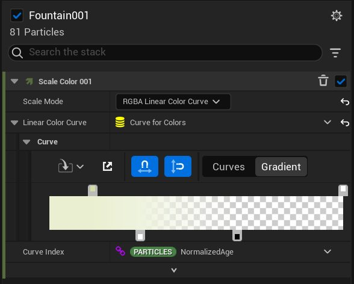
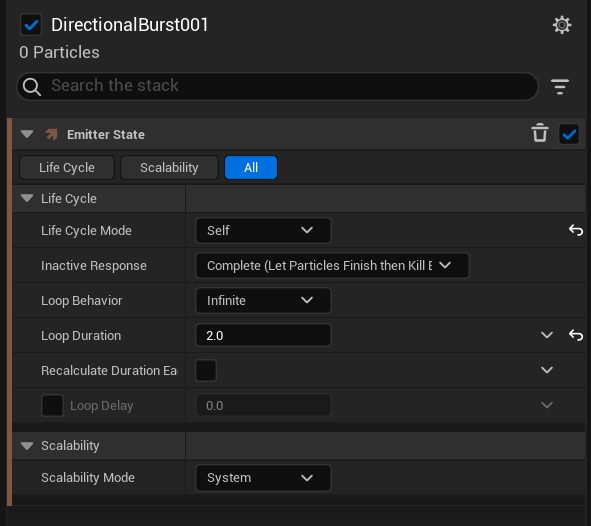
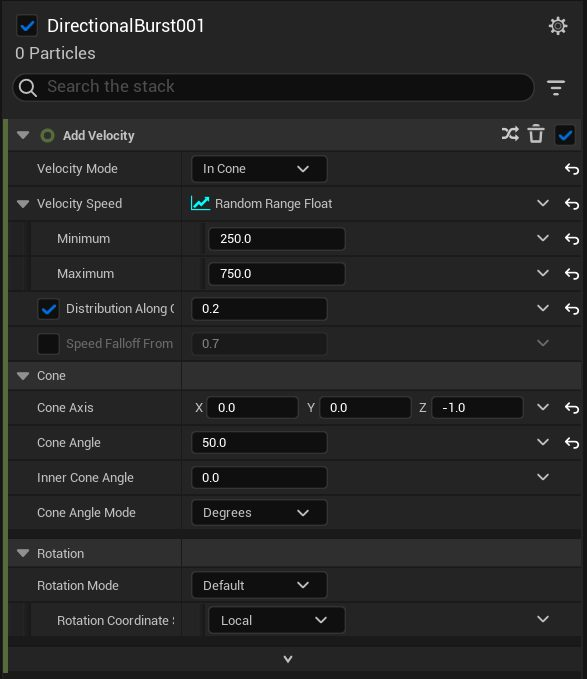
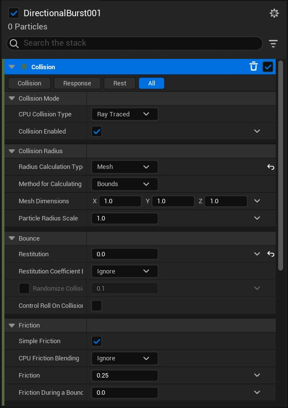

# 在虚幻引擎中重制 Unity 粒子系统

- 来源: https://dev.epicgames.com/community/learning/tutorials/qMK2/unreal-engine-remaking-a-unity-particle-system-in-unreal
- 原文标题: Remaking a Unity Particle System in Unreal

## 粒子系统

## 粒子效果 -

## 粒子 Jeremy S 杰里米·S

## 粒子

## 虚幻引擎5尼亚加拉系统

## 虚幻粒子效果 -

## 虚幻粒子 Jeremy S 杰里米·S

## 虚幻粒子

以上是使用相同提示（幽灵、污渍和烟雾）制作的两个粒子系统。第一个是用 Unity 的粒子系统制作的，第二个是用虚幻引擎 5 (UE5) 的 Niagara VFX 系统制作的。与 Unity 不同，UE5 没有名为“粒子系统”的特效模块，而是使用了 Niagara。使用 Niagara，您可以创建粒子系统。首先，让我们看一下虚幻引擎的界面布局。 Layout 布局

欢迎来到虚幻引擎工作区！我不会深入讲解整个工作区，但会介绍足够你浏览的内容。如果你想了解更多信息，网上有很多关于虚幻引擎工作区的教程。正如你所看到的，工作区的中心是场景视图，就像 Unity 一样，场景视图上方是工具栏。左侧红色区域是 “放置 Actor” 选项卡。Actor 是任何可以放置在场景中的对象，例如静态网格体、摄像机和灯光。屏幕底部蓝色区域是 内容抽屉。使用 Niagara 创建粒子系统时，你会在这里花费大量时间。它类似于 Unity 中的“项目”选项卡。你可以在这里创建、导入、编辑和修改游戏资源。右侧绿色区域是“ 世界大纲视图” 和 “细节”选项 卡。“世界大纲视图”类似于 Unity 中的层级视图，“细节”选项卡类似于 Unity 中的“检查器”选项卡。现在我们对虚幻引擎工作区有了一些了解，让我们开始在虚幻引擎中重现 Unity 的粒子系统吧！ Importing Texture 导入纹理

为了创建这个粒子系统，你需要一张烟雾纹理。我们将使用这张纹理来创建一个材质，用于粒子系统的精灵渲染器。你可以使用任何你喜欢的方式来创建纹理，但请记住将纹理的背景设置为透明！我还附上虚幻引擎支持的纹理文件类型列表：https://docs.unrealengine.com/5.1/en-US/textures-in-unreal-engine/ Side note: it's a good practice to create files in the Content Drawer to put your textures, materials, models, etc.

附注：在内容抽屉中创建文件来存放纹理、材质、模型等是一个好习惯。您可以通过右键单击内容抽屉并单击“新建文件夹”来完成此操作。 Creating a Material 创建材料

要创建材质，请右键单击内容抽屉，然后选择“材质”。单击创建的材质即可将其打开。

打开后，在预览下方左下角，您会看到“详细信息”选项卡。向下滚动到“材质”，并将设置更改为与上图一致。将混合模式设置为“半透明”，着色模式设置为“单透明”，并勾选“双面”复选框。接下来，您可以直接复制下面的代码片段。如果您想自己操作，请在材质图（网格区域）上的任意位置单击鼠标右键，搜索下方显示的节点名称，并将每个节点连接到相应的位置。

## 材料

完整的材质图应该和上图类似。确保点击“纹理采样”节点，然后在“材质表达式纹理基础”部分，点击下拉菜单并选择我们导入的烟雾纹理。这样就完成了！你已经创建了用于粒子系统中精灵渲染器的材质。在虚幻引擎中创建材质比在 Unity 中要复杂一些。一开始可能会觉得有点难，但做得越多就越容易。 Niagra System 尼亚加拉系统

## 烟雾尼亚加拉系统 1

这是在虚幻引擎中创建粒子系统的主要部分。首先，在内容抽屉中单击鼠标右键，然后选择“Niagara 系统”。

选择“从选定的发射器创建新系统”。

虚幻引擎提供了一些预设的尼亚加拉粒子系统供您选择。您很少会选择空白的粒子系统。这些模板是绝佳的起点！对于我们的第一个烟雾粒子系统（视频中的绿色烟雾），我们将从“喷泉”粒子系统开始。点击加号按钮，然后点击完成按钮。在内容抽屉中双击您新建的尼亚加拉粒子系统即可打开。

现在你已经创建并打开了 Niagara 系统，是时候修改一些设置了。下面是设置的代码片段，你可以复制粘贴，不过我也会逐一讲解这些设置。如果你想自己创建 Niagara 系统，但又不想在本教程页面和 Unreal 之间来回切换，你可以直接将代码片段复制粘贴到你的系统中，进行并排比较。Unity 中的许多粒子模块在 Unreal 中没有对应的模块，但有一些设置可以实现几乎相同的功能。

这是 Niagara 概览节点。它类似于 Unity 中的粒子系统检视面板设置。不过，两者之间也存在一些差异。正如您所见，与 Unity 粒子系统模块不同，在 Unreal 中，您无法看到 Niagara 系统的所有可用模块。要将模块添加到概览节点，您可以点击概览节点右侧的绿色和橙色加号按钮。您可以右键单击模块并点击“删除”来删除模块，或者取消选中模块右侧的蓝色勾号来停用它。我们先右键单击“重力”并将其删除，因为我们希望烟雾向上飘浮。然后，我们来更改“初始化粒子”中的一些设置。

“初始化粒子”模块与 Unity 中的主模块类似，但也存在一些差异；您可以在“初始化粒子”模块中更改粒子的颜色。您可以将此模块视为 Niagara 系统中每个粒子的基本属性。对于我们正在创建的 Niagara 系统，我们将更改每个粒子的生命周期、颜色和统一精灵大小。请按照上图所示更改设置。每个设置的作用都非常直观，其定义就在名称中。

“增加速度”模块的功能正如其名。为了营造烟雾效果，我们需要降低尼亚加拉喷泉系统默认的速度。您可以在这里更改喷射形状，但我们不需要这样做。请将设置更改为与上图一致。

接下来，我们需要将“缩放精灵大小”模块添加到粒子更新部分。点击“粒子更新”右侧的绿色加号按钮即可。缩放精灵大小与 Unity 中的“生命周期大小”模块基本相同。我们希望烟雾精灵能够像 Unity 中那样随时间推移而变大。您还需要像 Unity 模块那样使用曲线。要添加关键帧，请右键单击曲线，并将曲线设置调整为与上图所示一致。

接下来，再次点击“粒子更新”旁边的绿色加号按钮，输入“缩放颜色”，然后选择它。“缩放颜色”模块相当于 Unity 中的“生命周期颜色”模块。在“缩放颜色”设置框中，“缩放模式”旁边，点击下拉菜单并选择“RGBA 线性颜色曲线”。此时会弹出一条颜色曲线，它看起来与 Unity 中的曲线完全相同。我选择了绿色，但您可以选择任何您喜欢的颜色。您可以通过双击曲线顶部角落的标签来选择颜色。我为左侧选择了绿色，为右侧选择了白色。底部的两个标签控制不透明度，左侧设置为 1，右侧设置为 0。然后我将右侧标签向中心拖动。现在，粒子系统的颜色和不透明度会随时间变化！

最后，我将精灵的材质换成了我们刚刚创建的烟雾材质。您可以通过点击尼亚加拉渲染器底部“精灵渲染器”模块中“材质”部分的下拉菜单来完成此操作。选择所需的材质。好了！我们刚刚完成了第一个粒子系统！

## 烟雾尼亚加拉系统 2

我们来创建另一个尼亚加拉系统！步骤与之前创建喷泉系统相同，但这次选择“定向喷射”。下面是尼亚加拉系统的代码片段，但我还会再次讲解一下设置。

首先，我们将尼亚加拉系统的发射器状态更改为无限。方法是点击“循环行为”下拉菜单，并将其设置为“无限”。这类似于在 Unity 中创建一个循环粒子系统。

接下来，在“添加速度”中，将“锥轴”的 Z 轴位置更改为 -1.0。这就像在 Unity 中更改粒子系统的旋转一样。

这是尼亚加拉系统的“初始化粒子”模块。请将设置更改为与图片中的设置一致。现在也是删除尼亚加拉系统的“重力”模块和“按速度缩放精灵大小”模块的好时机。

这个尼亚加拉系统还有一个缩放精灵尺寸的模块。调整曲线使其与图像中的曲线相匹配。

现在我们将添加一个名为“碰撞”的新模块，您可以通过点击“粒子更新”旁边的加号按钮并输入“碰撞”来完成此操作。这与 Unity 中的碰撞模块类似。将“半径计算类型”设置为“网格”。在“反弹”下，将“恢复度”设置为 0。这将移除 Niagara 系统的反弹效果。正如您所看到的，您使用 Niagara 系统越多，就会发现它与 Unity 的粒子系统有越多的相似之处。最后，将精灵渲染器更改为我们创建的材质。 "Ew" Niagara System “呃”尼亚加拉系统

接下来，我们将为视频中展示的“Ew”粒子创建另一个定向爆发尼亚加拉系统。这需要您导入另一个纹理并创建另一个材质（步骤与创建上一个材质相同）。

将圆锥轴 X 轴位置设置为 1。

在“Spawn Burst Instantaneous”（瞬间生成爆发）模块中，将“Spawn Count”（生成数量）更改为 1。这类似于在 Unity 中更改最大粒子数。之后，只需将

## 综合起来

放置 Niagara 系统与在 Unity 中完全相同。从内容抽屉中，点击并拖动系统到场景中即可。如图所示，我有一个幽灵 3D 模型（幽灵、讨厌的、烟雾，还记得吗？）。您可以导入自己制作的 3D 模型，也可以从网上获取免费模型（Mixamo 是个不错的选择），或者直接使用 Actor 选项卡中的默认 Actor。这里有一个简短的视频演示如何操作（https://www.youtube.com/watch?v=axF0m6lOjG8&ab_channel=theCraters）。与在 Unity 中一样，您可以将 Niagara 系统设置为您选择的模型的子对象。根据您的喜好调整 Niagara 系统的旋转和位置。如图所示，我放置了三个我们制作的绿色烟雾粒子，每个粒子都以不同的角度放置。这就是使用 Unreal 的 Niagara 系统重现 Unity 粒子系统的全部内容。两者之间有很多相似之处和不同之处（我在 Unity 中创建的系统与我们刚刚创建的略有不同），但你可以在这两个引擎中创建很多很酷的粒子系统。祝你创作愉快！
