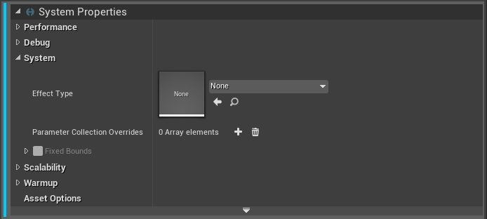

# Niagara 可扩展性：效果类型

- 来源: https://dev.epicgames.com/community/learning/knowledge-base/LJnb/unreal-engine-niagara-scalability-effect-types
- 原文标题: Niagara Scalability: Effect Types

## 尼亚加拉可扩展性：效应类型

## Apr 12, 2021.Knowledge

## 知识库

## Apr 12, 2021.Knowledge 2021年4月12日。知识

本文作者： Austin C. Niagara provides the Effect Type asset to act as a way to group related effects and specify reusable settings for them. Currently Effect Types are geared towards scalability settings, but we may add other properties in the future that make sense to bundle with effects of the same type. Effect Type scalability does not need to use the System’s simulation, that is, it runs in native C++ rather than in Niagara’s

提供效果类型资源，用于对相关效果进行分组，并为其指定可重用的设置。目前，效果类型主要面向可扩展性设置，但未来我们可能会添加其他属性，以便将同类型效果捆绑在一起。效果类型的可扩展性无需使用系统模拟，也就是说，它在原生 C++ 中运行，而不是在 Niagara 的脚本运行时中运行，因此性能更高。

可以在各个系统和发射器级别覆盖可扩展性设置，因此特定效果可以根据自身需求定制可扩展性设置，而无需复制将保持不变的各个设置。

在烹饪时，将使用效果类型及其覆盖设置的可扩展性设置，以防止在特定平台上不使用的效果被打包，从而节省空间。

您可以在系统属性中设置效果类型，并在项目设置的 Niagara 部分中指定默认效果类型。

## 更新频率

控制评估具有此类效果的系统的可扩展性状态的频率。这使得我们可以对开销较大或至关重要的玩家效果进行逐帧评估，而对可以容忍少量延迟的次要效果则采用较低的更新频率。较低的更新频率意味着每个效果的开销更小。

某些效果（例如冲击效果）也可以设置为仅在生成时生效。没有必要每帧都评估短暂的效果。 Cull Reaction 淘汰反应

控制效果在未通过可扩展性检查时的行为。例如，当效果超出最大距离时。

这些选项是两种选择的组合：

杀死或休眠：控制系统是否可以重新唤醒。

清除（开/关）：立即清除现有颗粒或让其自然完成。

例如，爆发特效应该使用击杀选项，因为它们只生成一次，不需要重新觉醒，而且它们的生命周期很短，因此是清除的理想对象。 Significance Handler 重要性处理程序

控制场景中实例的相对重要性。重要性较低的效果会优先被剔除。此功能与实例数量剔除功能配合使用。

无：无显著性处理。

年龄：较新的系统更为重要。这对于诸如冲击效果之类的场景非常有用，因为移除新生成的效果会在视觉上造成干扰。

距离：距离摄像机越近，效果越明显。

## System Scalability Settings

## 系统可扩展性设置

应用于整个系统的可扩展性设置。它们以数组形式存储，每个条目对应于一组基于质量等级（低、中、高、史诗和电影级）的平台。 Platforms will be included in their respective buckets,

平台将被归入各自的存储桶中，有些平台可能属于多个存储桶。您可以为设置条目添加或移除平台，以便更精细地控制特定平台的可扩展性。

以下是一个简化的系统可扩展性设置数组示例。对于每个条目，这些设置将应用于整个突出显示的存储桶，但不包括任何已移除的存储桶（以红色“-”表示）。除非手动选择加入（以绿色“+”表示），否则该条目不会应用于任何灰色显示的存储桶。

在这个例子中，“低”、“中”、“高”三个画质等级的最大距离均为 1000，但“高”画质等级中的 Windows 平台除外。这些平台将与 Epic 画质等级一起包含在内，其最大距离为 1500。“电影级”画质等级将不应用任何缩放功能。

每个设置可以包含以下检查项的任意组合。如果未启用这些检查项，则不会执行该项检查的测试。 Max Distance:

最大距离：如果系统与最近的摄像头之间的距离超过此值，则会被剔除。

最大效果类型实例数：此效果类型允许的最大实例数。此计数在所有使用此效果类型的系统实例之间共享。使用重要性处理程序来决定要剔除哪些系统。

例如：这样就可以定义环境冲击效果的最大数量，而无需担心每个单独的系统定义最大值以及这些最大值如何相互作用。 Max System Instances: Similar to Effect Type Instances, but only applies to instances of a specific system. Can be useful for specific effects that should be prioritized,

最大系统实例数：类似于效果类型实例数，但仅适用于特定系统的实例。可用于需要优先处理的特定效果，但仍应保持与其效果类型相同的总体可扩展性。

最大无渲染时间：如果系统在此时间内未进行渲染，则会进行剔除。这实际上是一种可见性剔除，包括视锥体剔除和遮挡剔除。此功能仅适用于使用固定边界的系统。

## Emitter Scalability Settings

## 发射器可扩展性设置

这些设置用作各种发射器特定属性的默认值。

目前这仅限于生成数量缩放，但未来可能会扩展到其他方面。

生成数量比例：此值用作我们标准生成模块中所有生成数量的比例。
