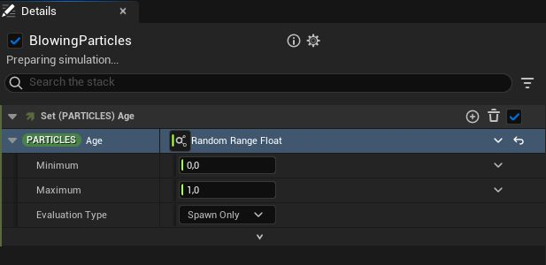

# Niagara - HLSL 中的随机数和随机浮点动态输入

- 来源: https://dev.epicgames.com/community/learning/tutorials/BdXJ/unreal-engine-niagara-random-in-hlsl-and-in-random-float-dynamic-input
- 原文标题: Niagara - random in hlsl and in random float dynamic input

这方面的资料太少了，所以我决定分享一下我的心得。我最初的主要目标是学习如何从 HLSL 表达式生成随机值，但在这个过程中，我也了解到了一些“随机浮点值”动态输入所使用的内部机制，所以这些知识在某种程度上也适用于理解“随机”动态输入的工作原理。是的，文中也包含一些虚幻引擎代码库的链接——或许能为进一步探索其内部机制的人提供参考。

## 随机 HLSL 函数

首先，在 Niagara 中，可以通过两种方式使用自定义 HLSL 表达式：在 Scretch Pad 中，以及通过在模块详细信息中向某些参数添加自定义表达式。

## Scretch Pad 中的自定义 HLSL 节点

动态输入中的自定义 HLSL

结果发现，已经有一些现成的随机函数可供使用。它们都位于 NiagaraEmitterInstanceShader.usf 文件中，该文件会自动加载以供 Niagara 着色器使用。以下是所有可用函数的签名。

```cpp
// Deterministic.
float4 rand4(int Seed1, int Seed2, int Seed3, int Seed4)
float3 rand3(int Seed1, int Seed2, int Seed3, int Seed4)
float rand(float x, int Seed1, int Seed2, int Seed3)
float2 rand(float2 x, int Seed1, int Seed2, int Seed3)
float3 rand(float3 x, int Seed1, int Seed2, int Seed3)
float4 rand(float4 x, int Seed1, int Seed2, int Seed3)
int rand(int x, int Seed1, int Seed2, int Seed3)
// Non-deterministic.
```

有两个方法： rand 和 rand_float，以及它们的多种实现方式。如您所见， rand 和 rand_float 实现方式在输出类型、第一个参数类型以及可能的参数数量上有所不同。

那些 需要四个参数 （例如 float x, int Seed1, int Seed2, int Seed3）的函数使用的是 确定性算法 ——这意味着它们的随机值主要基于提供的种子，但还有一个外部因素会冲击效果结果，我们稍后会提到。因此，如果您使用 rand(1.0, 0, 0, 0) 则所有粒子的随机值都将相同，除非您显式地使用 rand(1.0, Particles.UniqueID, 0, 0) 来使每个粒子的随机值唯一，或者使用其他种子。

重要提示——第一个参数 x 并非随机函数的种子（通常哈希方法会使用种子），它只是一个随机值将要乘以的值。例如， rand(7.0, 0, 0, 0) 内部可能生成 0.9239，最后将其乘以 7.0，因此您可以认为 rand 生成的随机值范围为 0.0 到 x。所有可用的随机函数都遵循此规则。

## Determenistic`float rand`

```cpp
// @Andrej730: Kudos to Epic Games for counting every instruction to keep it very optimized.
// Cost using rand4: 6 imad, 1 itof, 1 ishr, 1 add, 2 mul
float rand ( float x, int Seed1, int Seed2, int Seed3)
{
RandomCounterDeterministic += 1 ;
return rand3 (Seed1, Seed2, Seed3, RandomCounterDeterministic).x * x;
}
// @Andrej730: Kudos to Epic Games for counting every instruction to keep it very optimized.
// Cost using rand4: 6 imad, 1 itof, 1 ishr, 1 add, 2 mul
float rand(float x, int Seed1, int Seed2, int Seed3)
{
RandomCounterDeterministic += 1;
return rand3(Seed1, Seed2, Seed3, RandomCounterDeterministic).x * x;
}
```

只接受一个参数的 rand 函数（例如 float rand(float x)）是 不确定的。因此，即使对于同一个粒子、同一个帧等，每次调用其值也都是完全随机的。

```cpp
float rand ( float x)
{
RandomCounterNonDeterministic -= 1 ;
return rand4 (GLinearThreadId, EmitterTickCounter, GLinearThreadId, RandomCounterNonDeterministic).x * x;
}
float rand(float x)
{
RandomCounterNonDeterministic -= 1;
return rand4(GLinearThreadId, EmitterTickCounter, GLinearThreadId, RandomCounterNonDeterministic).x * x;
}
```

rand_float 只是 Niagara 内部用于 Scratch Pad 节点的`rand 函数的封装，用于生成“ 随机浮点数 ”（使用 rand 并传入一个参数，非确定性）和“ 种子浮点随机数 ”（使用 rand 并传入四个参数，确定性）。因此，如果您想在 HLSL 中获取随机值，可以忽略 rand_float 函数的存在， rand 足以满足所有需求。

## `rand_float`implementation

```cpp
float rand_float ( float x)
{
return rand (x.x);
}
float rand_float(float x)
{
return rand(x.x);
}
```

请注意，Random Range Float 动态输入在底层使用了相同的节点，因此使用了相同的 HLSL 函数。



节点底层使用了`rand_float`函数。

好了，关于随机函数的描述就到此为止，现在我们要讨论确定性函数是如何运作的一些内部原理。

## 此外，Niagara HLSL 还提供了哈希函数：

```cpp
// Small changes in the input bits should propagate to a lot of output bits, so the resulting hash is not periodic.
// This is important because the hash inputs are often things like particle ID, but the output should be pseudo-random.
int hash_single(int a)
{
int x = (a ^ 61) ^ (a >> 16);
x += x << 3;
x ^= x >> 4;
x *= 0x27d4eb2d;
x ^= x >> 15;
return x;
```

## 实现细节 - 随机计数器

你可能已经注意到，传递给 rand3 种子还有第四个 RandomCounterDeterministic （顺便一提，rand3 只是一个到处都在用的基础随机函数）。它从 0 开始，每次调用随机函数时都会递增，从而保证每次调用的结果都不同。Niagara 使用这种简单有效的方法，使随机函数每次调用都返回不同的值，同时又能保证不同帧之间的一致性（由于 GPU 的特性，着色器是针对每个粒子单独执行的，并且每帧都会重置——因此每个粒子都有自己的 RandomCounterDeterministic，并且每帧都会重置）。

## `float rand`implementation

```cpp
// Internal counter used to generate a different sequence of random numbers for each call
static int RandomCounterDeterministic = 0 ;
// Cost using rand4: 6 imad, 1 itof, 1 ishr, 1 add, 2 mul
float rand ( float x, int Seed1, int Seed2, int Seed3)
{
RandomCounterDeterministic += 1 ;
return rand3 (Seed1, Seed2, Seed3, RandomCounterDeterministic).x * x;
}
// Internal counter used to generate a different sequence of random numbers for each call
static int RandomCounterDeterministic = 0;
// Cost using rand4: 6 imad, 1 itof, 1 ishr, 1 add, 2 mul
float rand(float x, int Seed1, int Seed2, int Seed3)
{
RandomCounterDeterministic += 1;
return rand3(Seed1, Seed2, Seed3, RandomCounterDeterministic).x * x;
}
```

为了更形象地说明其工作原理，请参见下表， rand 调用完全相同，但根据帧内的调用顺序，它们会返回不同的值，但在不同的帧中仍然保持一致。 Frame 0 第0帧 Frame 1 第一帧 Frame 2 第 2 帧 1. Param1 = rand(1.0, 0, 0, 0)

1. 参数1 = rand(1.0, 0, 0, 0)

0.2323

0.2323

0.2323

2. Param2 = rand(1.0, 0, 0, 0)

2. 参数2 = rand(1.0, 0, 0, 0)

0.7273

0.7273

0.7273

3. Param3 = rand(1.0, 0, 0, 0)

3. Param3 = rand(1.0, 0, 0, 0)

0.9323

0.9323

0.9323

但这种实现方式有一个缺点——如果调用顺序不一致（或者偶尔会跳过某些调用或添加额外的调用），那么所有后续调用都将表现为完全随机且不确定的。

请看下面的示例。我添加了一个自定义的 HLSL 节点，它会跳过每隔一帧的随机调用。

注意：粒子 #1 的测试值为 53.793（53 来自帧号，因此随机值为 0.793）。

下一帧，粒子 #1 的 TestValue 值为 54.094，随机值为 0.094，因此由于随机调用跳过而发生了变化。

下一帧，TestValue 为 55.793，随机值又回到 .793，因为随机调用没有再次跳过。

您还可以看到，可以直接使用 HLSL 获取 RandomCounterDeterministic。我已经使用过它，并将其保存到 RandomCounter 属性中。

## 随机范围浮点数也使用相同的计数器：

## 所以归根结底，一切都取决于 RandomCounterDeterministic。 What it means,

这意味着我们可以使用 RandomCounterDeterministic 来调试由计算随机值的调用不一致而导致的确定性问题。 E.g. if we have some non-deterministic effect in our simulation and we want to narrow down where it comes from, we can create an integer attribute “Random Counter” on particles,

例如，如果我们的模拟中出现一些不确定效应，并且我们想缩小其来源范围，我们可以为粒子创建一个名为“随机计数器”的整数属性，添加一个模块，将其设置为 RandomCounterDeterministic，然后逐步执行模拟。如果计数器不稳定且出现意外变化，则意味着上述某个模块的设置器在 rand 使用上存在不一致。我们可以上下移动模块，直到找到导致问题的确切模块。 Though in practice “changing unexpectedly”

虽然在实践中，“意外变化”可能并不明显，甚至完全无法预测，例如在使用某些复杂的噪声算法时。但即便如此，这种方法仍然可以帮助我们了解将随机计算放在更安全的地方，从而避免它们发生意外改变。
