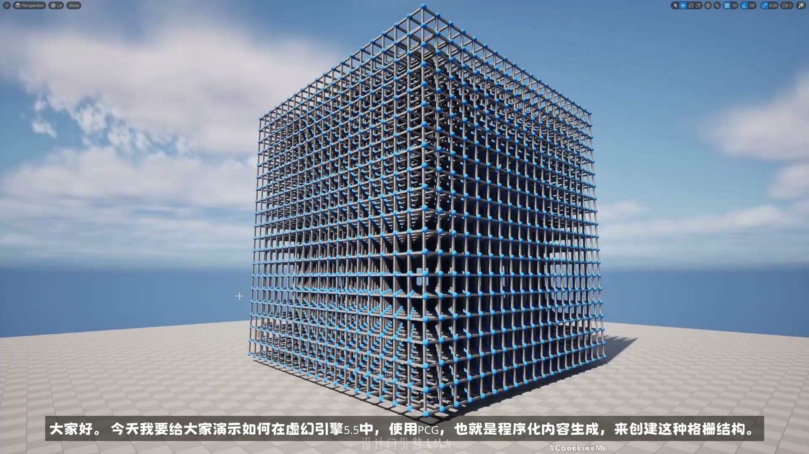
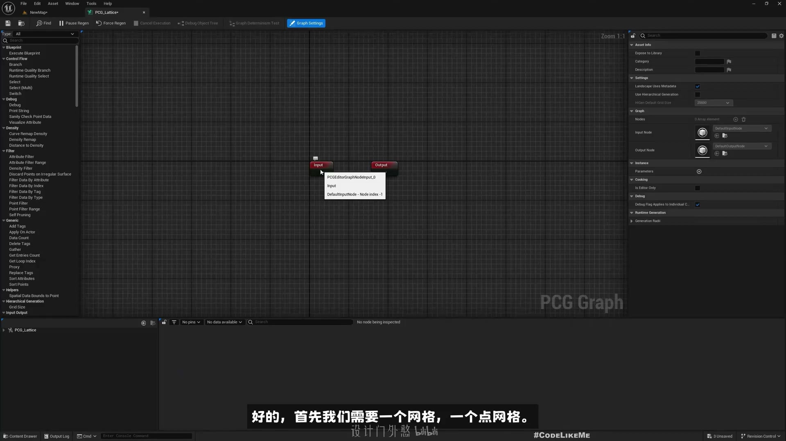
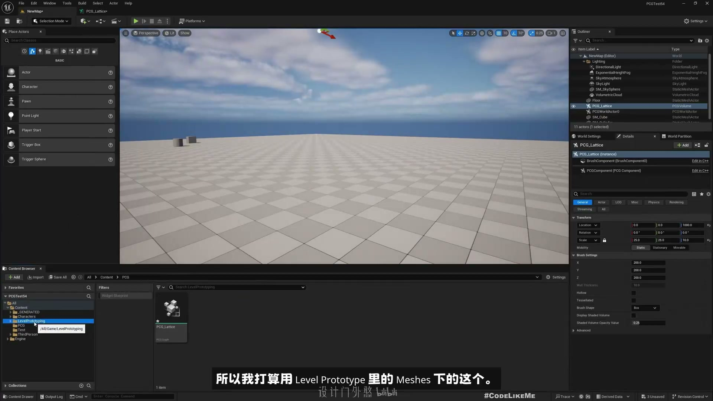
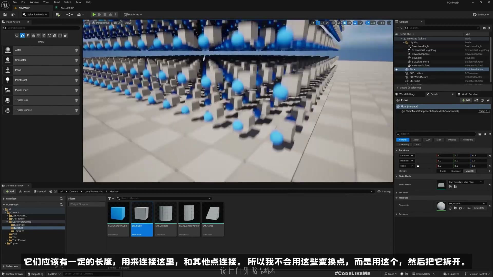
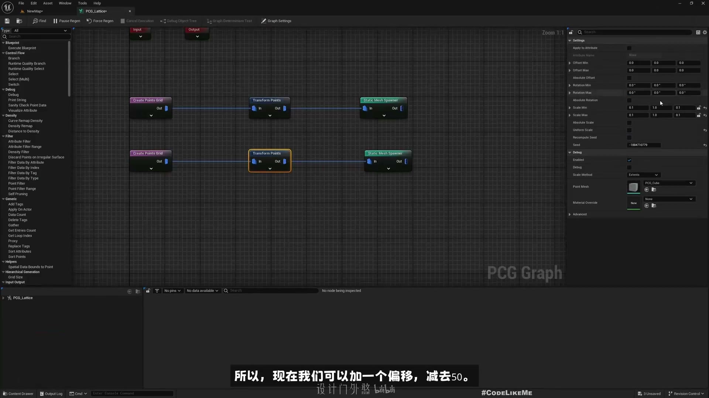
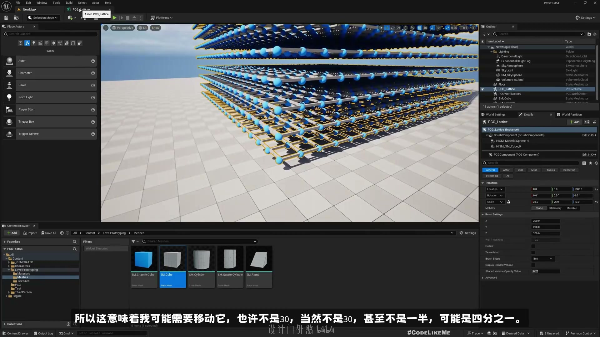
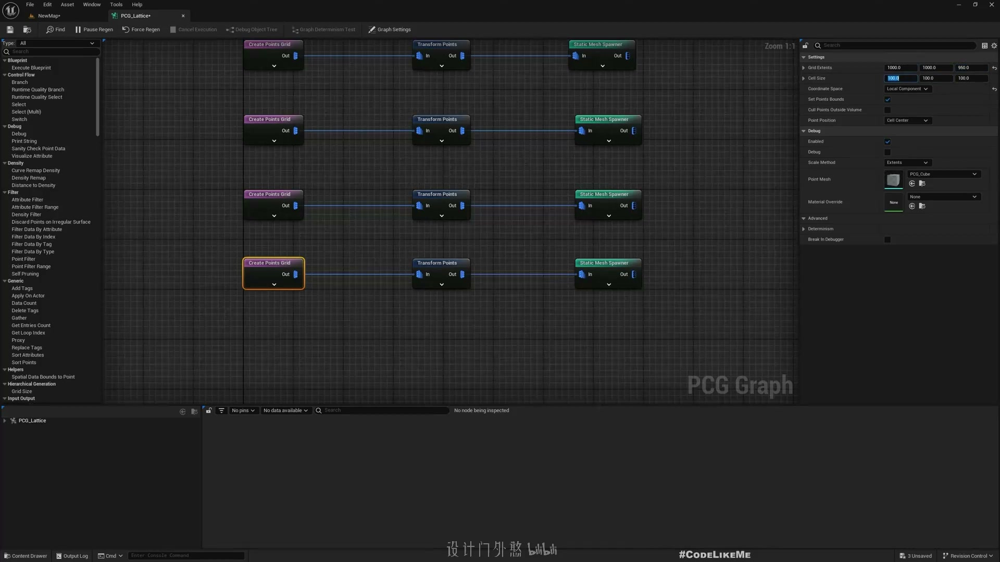
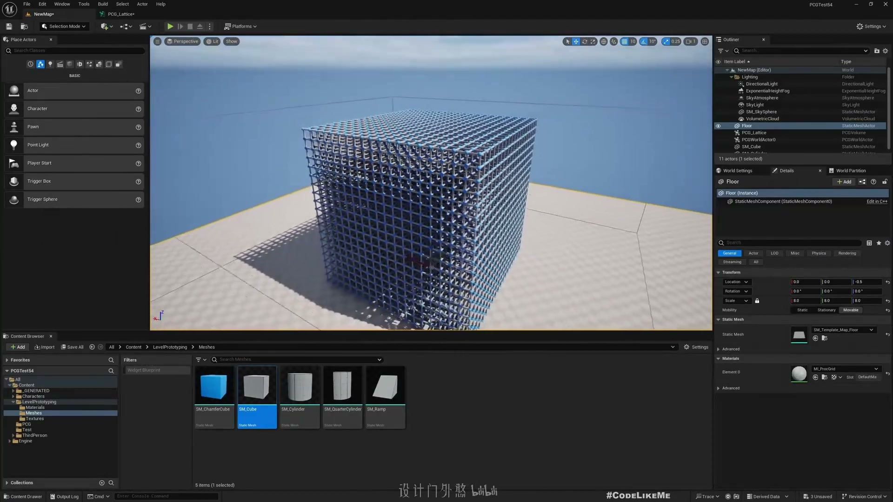

# 1 - 如何生成点集

## 知识目标

- 围绕“1 - 如何生成点集”整理 PCG 视频中的输入数据、图表规则、关键节点、参数风险和最终生成结果。
- 阅读时重点区分三层：输入来源（点、样条、表面、体积、Actor 或属性）、规则处理（采样、过滤、变换、分区、循环、HLSL 或子图）、输出方式（Static Mesh Spawner、Spawn Actor、Spline Mesh、Blueprint 或 Dynamic Mesh）。

## 可复现主流程

- 确认 PCG Graph/PCG Component 已绑定到正确 Actor，并先用 Debug/Inspect 查看中间点数据。
- 明确输入来源：Spline、Surface、Mesh、Volume、Actor、Data Asset/Data Table 或手工参数。
- 在图表中按顺序处理采样、属性写入、过滤、Transform、分区/循环和输出节点。
- 生成可见结果前，先核对 Point 的 Transform、Bounds、Density、Seed 和自定义 Attribute。
- 用 Static Mesh Spawner 输出大量网格实例；需要蓝图逻辑时改用 Spawn Actor 或 Blueprint 交互。

## 关键术语

- `PCG`、`Blueprint`、`Static Mesh`、`Mesh`、`Transform`、`Point`、`Attribute`、`Actor`、`Component`、`Spawn`、`Grid`、`Bounds`、`Density`、`Seed`、`Loop`、`Graph`、`Material`、`Instance`、`点`、`生成`、`网格`、`材质`

## 分段知识

### 00:00:00-00:05:00 点数据、Bounds 与采样来源

- 本段定位：点数据、Bounds 与采样来源。
- 知识点：Static Mesh Spawner 将点数据实例化为静态网格，复现时要检查 Mesh 清单、Transform、Density、Seed 和材质覆盖。
- 知识点：Transform Points 的坐标空间会影响点集是按世界坐标生成，还是围绕组件本地空间生成。
- 知识点：Static Mesh Spawner 将点数据实例化为静态网格，复现时要检查 Mesh、Transform、Density 和材质覆盖。
- 复现要点：先用 Debug/Inspect 核对点数量、Bounds、Density 和关键属性，再判断最终生成结果。
- 核对对象：`PCG`、`Bounds`、`点`、`点数据`、`采样`、`生成`、`网格`。

**关键画面：**

### 00:05:00-00:09:47 点数据、Bounds 与采样来源

- 本段定位：点数据、Bounds 与采样来源。
- 知识点：Static Mesh Spawner 将点数据实例化为静态网格，复现时要检查 Mesh 清单、Transform、Density、Seed 和材质覆盖。
- 复现要点：先用 Debug/Inspect 核对点数量、Bounds、Density 和关键属性，再判断最终生成结果。
- 核对对象：`Bounds`、`点`、`点数据`、`采样`、`生成`、`网格`、`材质`。

**关键画面：**

### 00:09:47-00:14:13 点数据、Bounds 与采样来源

- 本段定位：点数据、Bounds 与采样来源。
- 知识点：点数据流程需要在 Inspect 中核对点数量、Bounds、Density、Transform、Seed 和自定义属性。
- 复现要点：先用 Debug/Inspect 核对点数量、Bounds、Density 和关键属性，再判断最终生成结果。
- 核对对象：`Bounds`、`点`、`点数据`、`采样`、`网格`。

**关键画面：**

### 00:14:21-00:16:11 点数据、Bounds 与采样来源

- 本段定位：点数据、Bounds 与采样来源。
- 知识点：城市随机旋转算法应把角度限制为 90 度倍数，适合街区、道路或建筑块保持正交网格关系。
- 知识点：道路或街区边界由样条/Spline Mesh 驱动，复现时要核对样条点、切线、宽度和交叉口连接。
- 复现要点：先用 Debug/Inspect 核对点数量、Bounds、Density 和关键属性，再判断最终生成结果。
- 核对对象：`PCG`、`Bounds`、`点`、`点数据`、`采样`、`生成`。

**关键画面：**

## 复现检查

- 每个图表先检查输入数据是否正确进入 PCG Graph，再看下游生成结果。
- Debug/Inspect 时重点看点数量、Bounds、Density、Transform、Seed 和自定义 Attribute。
- Static Mesh Spawner、Spawn Actor、Spline Mesh 和 Blueprint 输出节点不能混用语义；选择前先确定是否需要实例化性能或蓝图逻辑。
- 涉及样条、分区、运行时或 GPU 生成时，必须额外验证更新触发、缓存、世界分区和性能预算。
