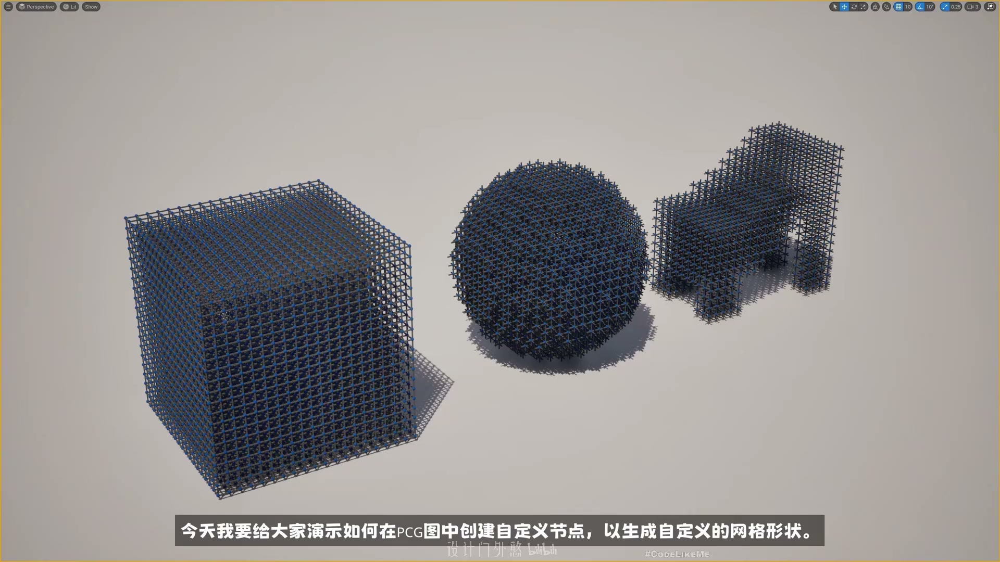
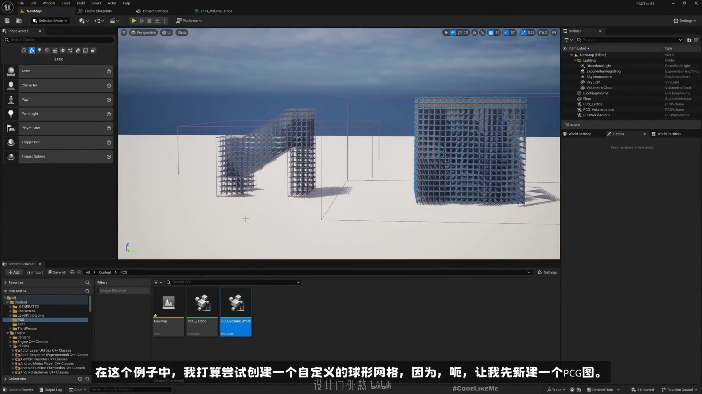
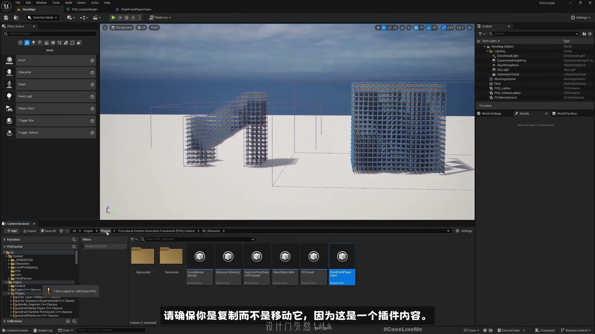
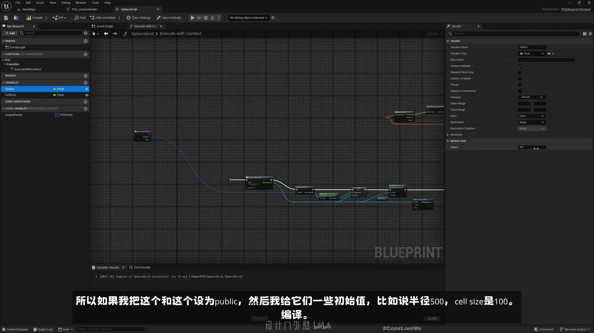
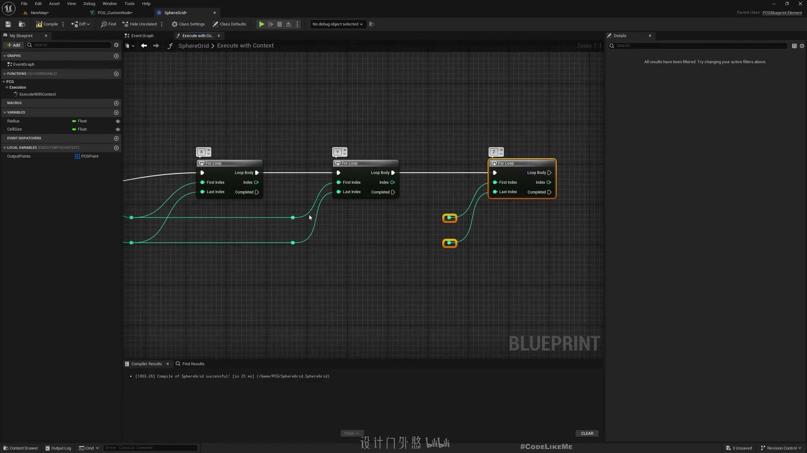
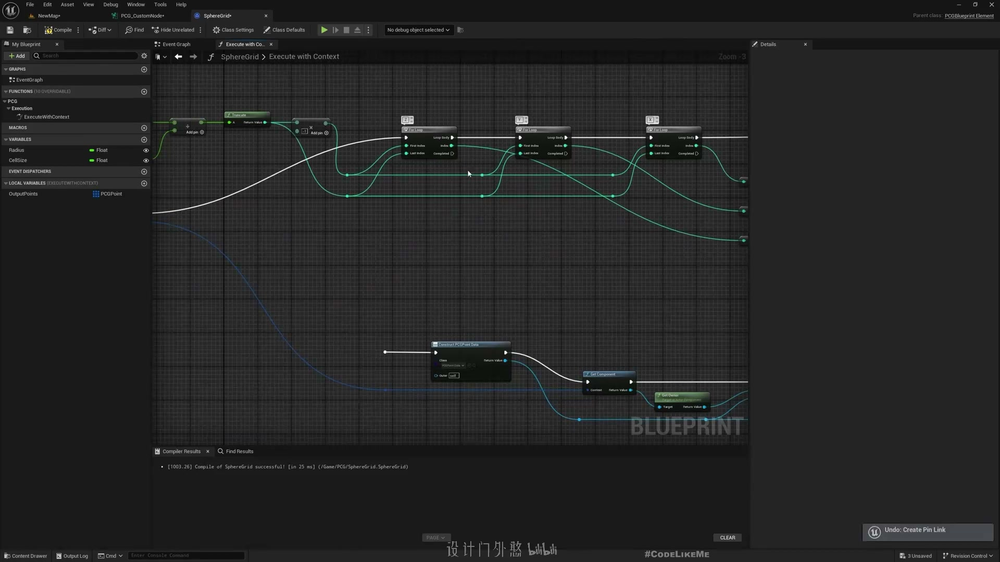
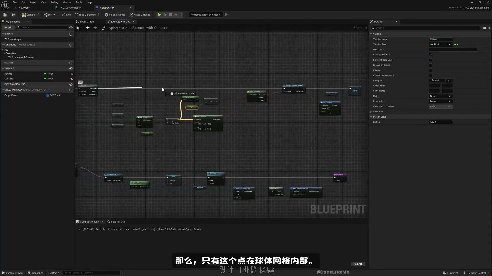
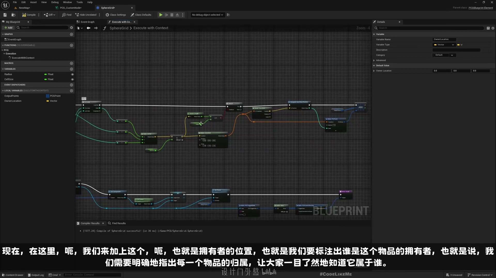
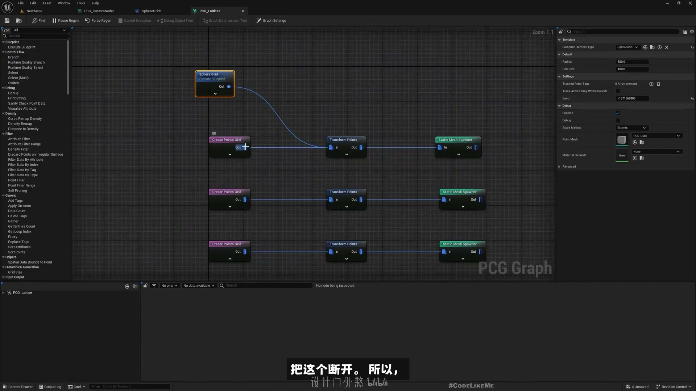
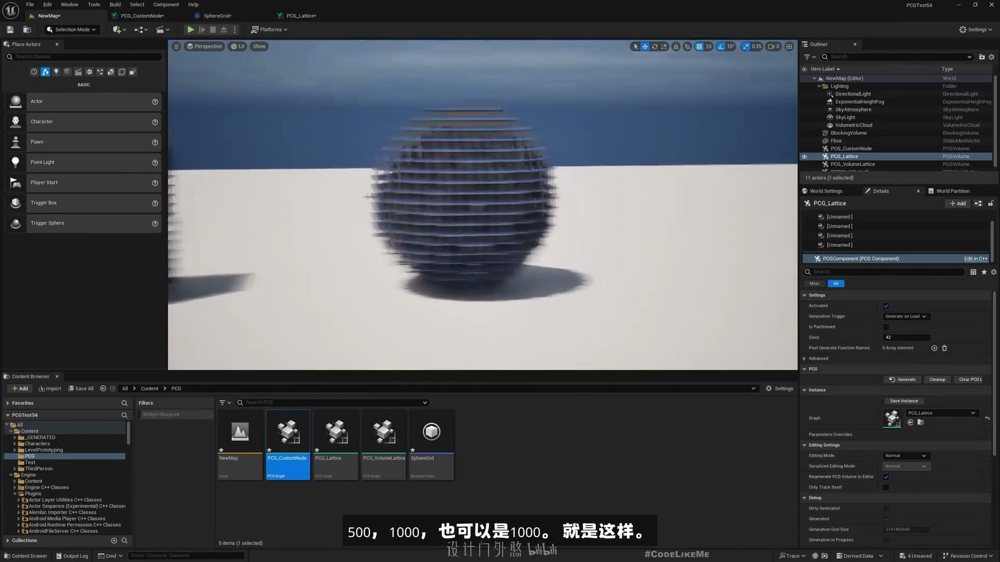

# #3 - 如何创建自定义球体网格节点

## 知识目标

- 围绕“#3 - 如何创建自定义球体网格节点”整理自定义网格节点的创建思路，把数学/节点输出转成 PCG 可用的点或网格数据。

## 可复现主流程

- 明确自定义节点要输出的几何形态和数据类型。
- 构建球体或网格点的生成逻辑，控制半径、分段和位置。
- 把输出接入 PCG 后续生成链路，检查 Debug/视口结果。
- 封装参数，使节点能够复用到不同图表中。

## 关键术语

- `PCG`
- `Blueprint`
- `蓝图`
- `Static Mesh`
- `Mesh`
- `Transform`
- `Point`
- `Attribute`
- `Actor`
- `Component`
- `Spawn`
- `Grid`
- `Bounds`
- `Density`
- `Seed`
- `Loop`
- `Graph`
- `Material`

## 操作步骤与要点

### 明确自定义节点要输出的几何形态和数据类型

**内容要点：**

- 明确自定义节点要输出的几何形态和数据类型。

**关键截图：**

**参数、节点和风险点：**

- `PCG`
- `Blueprint`
- `蓝图`
- `网格`
- `体积`
- `采样`
- `参数`
- `节点`
- `生成`
- `PerspectiveO`

### 明确自定义节点要输出的几何形态和数据类型（2）

**内容要点：**

- 明确自定义节点要输出的几何形态和数据类型（2）。

**关键截图：**

**参数、节点和风险点：**

- `PCG`
- `Point`
- `网格`
- `节点`
- `NewMap`
- `Size`
- `sell`
- `PCGTest54`
- `PCG_CustomNode`
- `PointFromPlayerPawn`

### 构建球体或网格点的生成逻辑，控制半径、分段和位置

**内容要点：**

- 构建球体或网格点的生成逻辑，控制半径、分段和位置。

**关键截图：**

**参数、节点和风险点：**

- `PCG`
- `Blueprint`
- `Grid`
- `Graph`
- `网格`
- `体积`
- `节点`
- `生成`
- `class`
- `EditAssetView`

### 把输出接入 PCG 后续生成链路，检查 Debug/视口结果

**内容要点：**

- 把输出接入 PCG 后续生成链路，检查 Debug/视口结果。

**关键截图：**

**参数、节点和风险点：**

- `PCG`
- `Blueprint`
- `Actor`
- `Grid`
- `Graph`
- `网格`
- `class`
- `actor`
- `local`
- `space`

### 封装参数，使节点能够复用到不同图表中

**内容要点：**

- 封装参数，使节点能够复用到不同图表中。

**关键截图：**

**参数、节点和风险点：**

- `PCG`
- `Blueprint`
- `Grid`
- `Graph`
- `Type`
- `Asset`
- `NewMap`
- `PCG_CustomNode`
- `SphereGrid`
- `PCG_Lattice`

## 复现检查清单

- 自定义节点的输出类型要和下游节点匹配。
- 复现时先固定随机种子，再调整密度、过滤和生成资源，避免随机结果掩盖逻辑错误。
