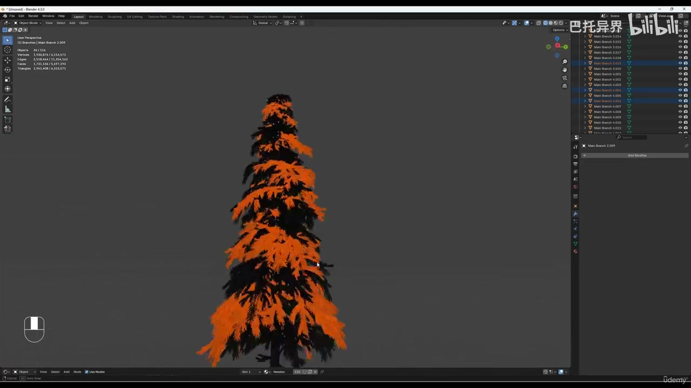
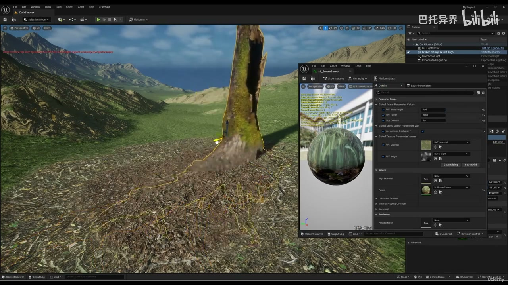

# 1 1 Introduction

## 知识目标

- 围绕“1 1 Introduction”整理 PCG 视频中的输入数据、图表规则、关键节点、参数风险和最终生成结果。
- 阅读时重点区分三层：输入来源（点、样条、表面、体积、Actor 或属性）、规则处理（采样、过滤、变换、分区、循环、HLSL 或子图）、输出方式（Static Mesh Spawner、Spawn Actor、Spline Mesh、Blueprint 或 Dynamic Mesh）。

## 可复现主流程

- 确认 PCG Graph/PCG Component 已绑定到正确 Actor，并先用 Debug/Inspect 查看中间点数据。
- 明确输入来源：Spline、Surface、Mesh、Volume、Actor、Data Asset/Data Table 或手工参数。
- 在图表中按顺序处理采样、属性写入、过滤、Transform、分区/循环和输出节点。
- 生成可见结果前，先核对 Point 的 Transform、Bounds、Density、Seed 和自定义 Attribute。
- 用 Static Mesh Spawner 输出大量网格实例；需要蓝图逻辑时改用 Spawn Actor 或 Blueprint 交互。

## 关键术语

- `PCG`、`Spline`、`Graph`、`Material`、`Landscape`、`Unreal`、`Engine`、`cinematic`、`road`、`Blender`、`Substance`、`Painter`、`Nanite`、`grass`、`parallax`、`occlusion`、`Volume`

## 分段知识

### 00:00:21-00:01:45 Spline 采样与路径生成

- 本段定位：Spline 采样与路径生成。
- 知识点：在 Blender 中制作可复用的枝条/针叶簇模块，先确定主枝比例、枝簇数量和变体目标，再用多个差异化模块组合树冠。
- 知识点：基础阶段就分配并命名材质槽，保证枝条、针叶或树皮在复制、导入 UE 和材质替换时保持稳定归类。
- 知识点：进入 Substance Painter 前检查导出比例、材质槽和 UV，保证树皮、针叶和遮罩贴图能按对象区域正确烘焙与绘制。
- 知识点：Spline 输入通常先采样为点，再用属性、距离或索引区分路段、端点、交叉点和曲线段。
- 复现要点：Spline 流程要单独核对采样间距、切线、端点、交叉点和生成网格的对齐方式。
- 复现要点：运行时、分区或 GPU 生成需要单独验证缓存、触发时机、平台支持和性能预算。
- 核对对象：`PCG`、`Spline`、`Volume`、`Material`、`采样`、`生成`。

**关键画面：**

## 复现检查

- 每个图表先检查输入数据是否正确进入 PCG Graph，再看下游生成结果。
- Debug/Inspect 时重点看点数量、Bounds、Density、Transform、Seed 和自定义 Attribute。
- Static Mesh Spawner、Spawn Actor、Spline Mesh 和 Blueprint 输出节点不能混用语义；选择前先确定是否需要实例化性能或蓝图逻辑。
- 涉及样条、分区、运行时或 GPU 生成时，必须额外验证更新触发、缓存、世界分区和性能预算。
