# 1 5 Modeling the Trunk of the Black Spruce

## 知识目标

- 围绕“1 5 Modeling the Trunk of the Black Spruce”整理 PCG 视频中的输入数据、图表规则、关键节点、参数风险和最终生成结果。
- 阅读时重点区分三层：输入来源（点、样条、表面、体积、Actor 或属性）、规则处理（采样、过滤、变换、分区、循环、HLSL 或子图）、输出方式（Static Mesh Spawner、Spawn Actor、Spline Mesh、Blueprint 或 Dynamic Mesh）。

## 可复现主流程

- 确认 PCG Graph/PCG Component 已绑定到正确 Actor，并先用 Debug/Inspect 查看中间点数据。
- 明确输入来源：Spline、Surface、Mesh、Volume、Actor、Data Asset/Data Table 或手工参数。
- 在图表中按顺序处理采样、属性写入、过滤、Transform、分区/循环和输出节点。
- 生成可见结果前，先核对 Point 的 Transform、Bounds、Density、Seed 和自定义 Attribute。
- 用 Static Mesh Spawner 输出大量网格实例；需要蓝图逻辑时改用 Spawn Actor 或 Blueprint 交互。

## 关键术语

- `Mesh`、`Transform`、`Point`、`Actor`、`Loop`、`more`、`already`、`scale`、`Branch`

## 分段知识

### 00:00:00-00:04:53 属性、过滤与数据分流

- 本段定位：属性、过滤与数据分流。
- 知识点：在 Blender 中制作可复用的枝条/针叶簇模块，先确定主枝比例、枝簇数量和变体目标，再用多个差异化模块组合树冠。
- 知识点：缩放、旋转、倒角或弯曲前后使用 `Ctrl+A > Apply All Transforms` 归一化对象变换，避免非统一缩放影响倒角、弯曲和法线。
- 知识点：为枝条圆柱增加适量环线拓扑后再弯曲，拓扑数量要兼顾平滑形变和高密度树木的面数预算。
- 知识点：缩放、旋转、倒角或弯曲前后使用 `Ctrl+A > Apply All Transforms` 归一化对象变换，避免非统一缩放导致倒角、弯曲和法线表现异常。
- 复现要点：属性命名要稳定，过滤、分区和分支节点应保留可检查的中间数据，避免后续规则难以追踪。
- 核对对象：`Branch`、`Loop`、`属性`、`过滤`。

**关键画面：**

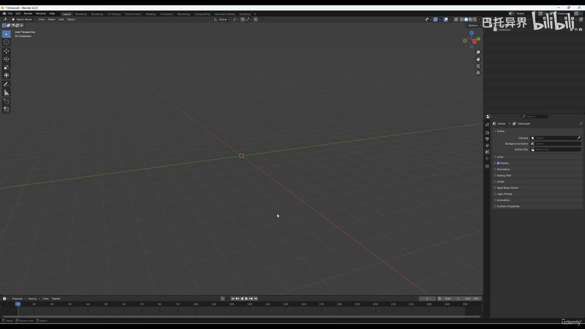
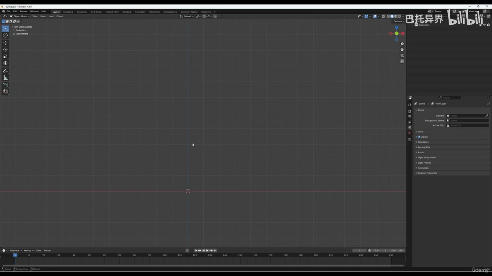

### 00:04:53-00:08:20 PCG 数据流与生成规则

- 本段定位：PCG 数据流与生成规则。
- 知识点：缩放、旋转、倒角或弯曲前后使用 `Ctrl+A > Apply All Transforms` 归一化对象变换，避免非统一缩放影响倒角、弯曲和法线。
- 知识点：在枝条仍是简单形体时标记接缝并执行 Angle Based Unwrap，先得到干净 UV，再进入复制、弯曲和变体制作。
- 知识点：在枝条仍是简单形体时标记接缝并做 Angle Based Unwrap，先得到干净 UV，再进入复制、弯曲和变体制作。
- 核对对象：`PCG`、`生成`。

**关键画面：**

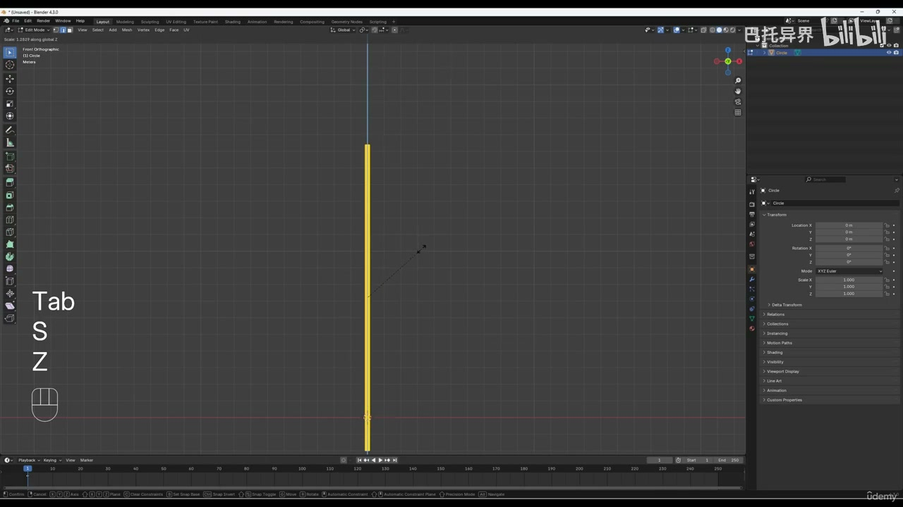
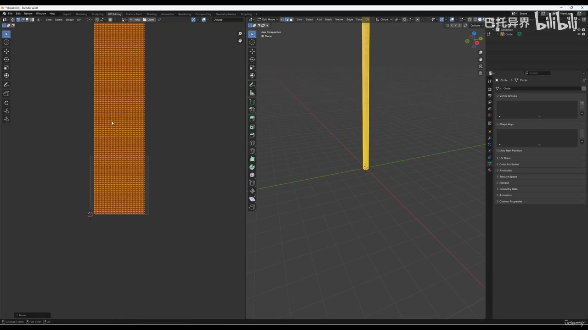

### 00:08:20-00:13:15 PCG 数据流与生成规则

- 本段定位：PCG 数据流与生成规则。
- 知识点：通过曲线或弯曲变形控制枝条走势，先检查对象变换和拓扑，再调整弯曲强度，避免卡片被拉伸或扭曲。
- 核对对象：`PCG`、`Actor`、`生成`。

**关键画面：**

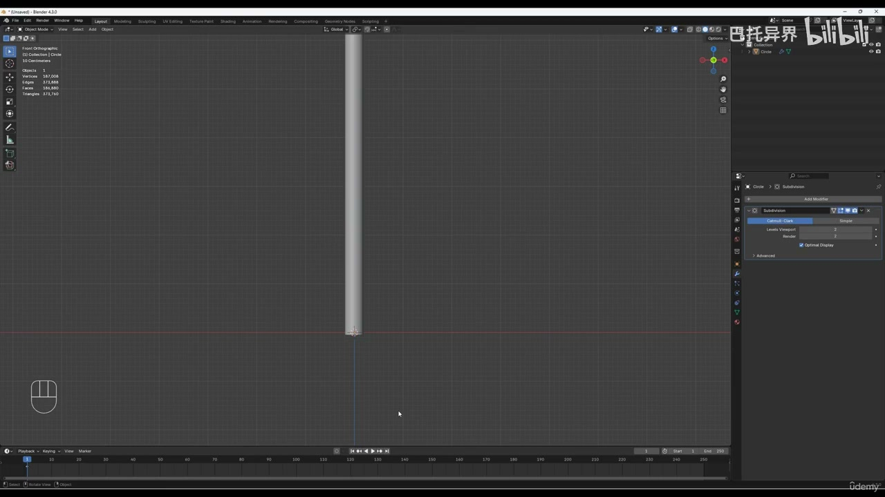
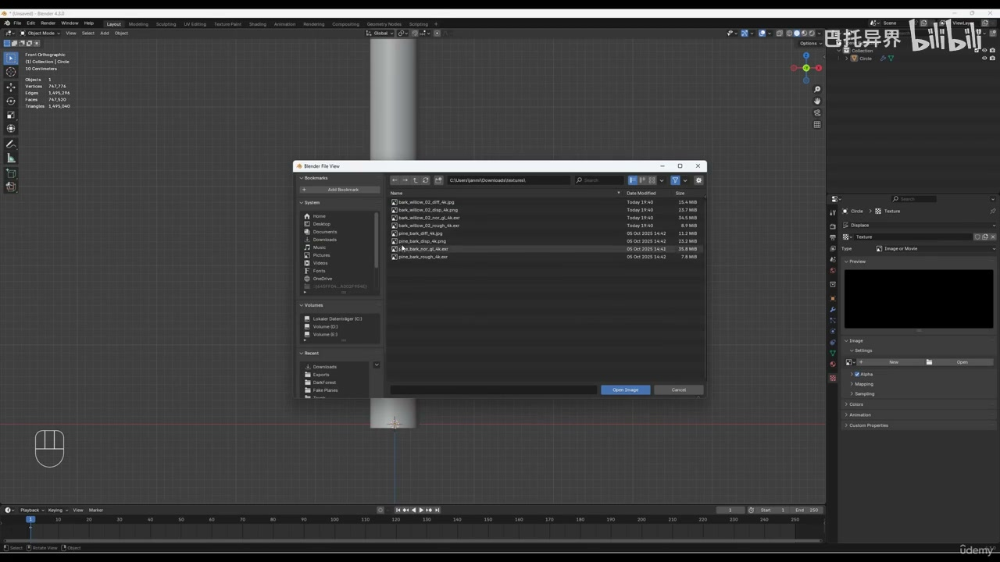

### 00:13:15-00:16:31 PCG 数据流与生成规则

- 本段定位：PCG 数据流与生成规则。
- 知识点：复现时先对照本段截图确认关键对象、参数面板和结果视图，再继续下游步骤。
- 核对对象：`PCG`、`Actor`、`生成`。

**关键画面：**

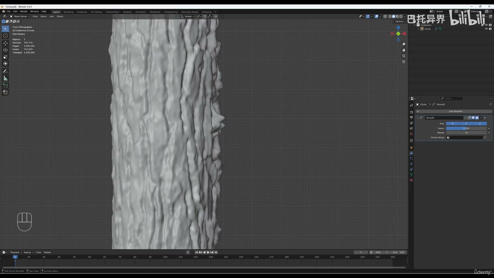
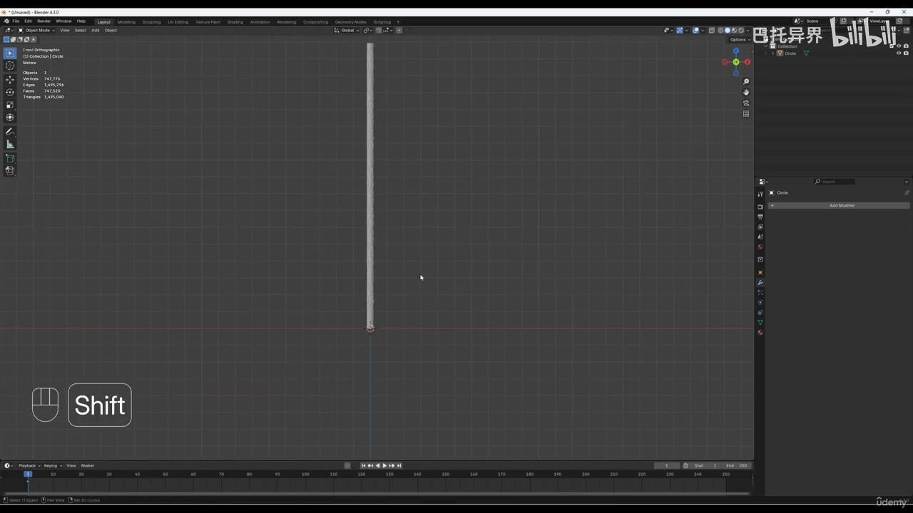

### 00:16:31-00:21:23 属性、过滤与数据分流

- 本段定位：属性、过滤与数据分流。
- 知识点：缩放、旋转、倒角或弯曲前后使用 `Ctrl+A > Apply All Transforms` 归一化对象变换，避免非统一缩放影响倒角、弯曲和法线。
- 知识点：通过曲线或弯曲变形控制枝条走势，先检查对象变换和拓扑，再调整弯曲强度，避免卡片被拉伸或扭曲。
- 知识点：PCG 流程要按点数据、属性写入、过滤条件和 Spawner 输出四步核对，避免只看最终实例而漏掉中间点状态。
- 复现要点：先用 Debug/Inspect 核对点数量、Bounds、Density 和关键属性，再判断最终生成结果。
- 复现要点：属性命名要稳定，过滤、分区和分支节点应保留可检查的中间数据，避免后续规则难以追踪。
- 核对对象：`Point`、`Branch`、`属性`、`过滤`。

**关键画面：**

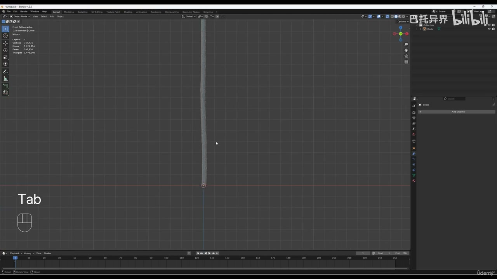
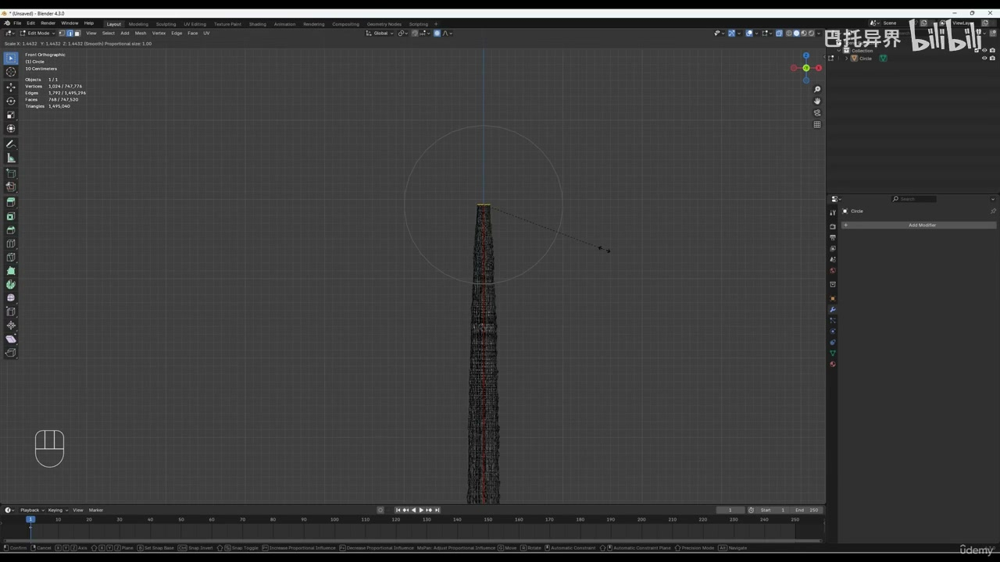

### 00:21:23-00:21:53 PCG 数据流与生成规则

- 本段定位：PCG 数据流与生成规则。
- 知识点：复现时先对照本段截图确认关键对象、参数面板和结果视图，再继续下游步骤。
- 核对对象：`PCG`、`生成`。

**关键画面：**

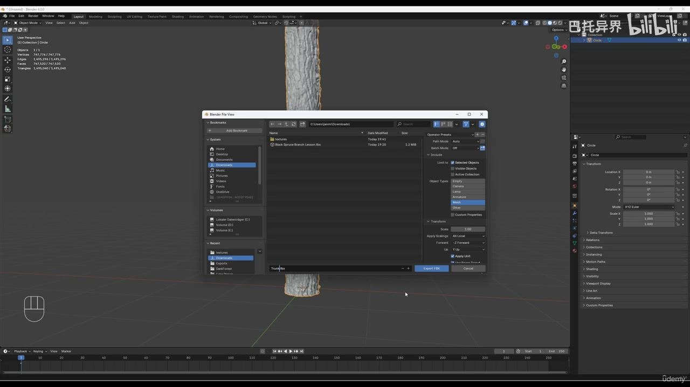
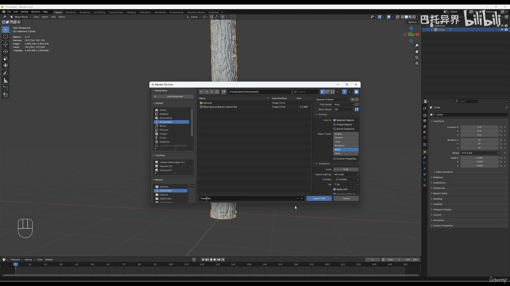

## 复现检查

- 每个图表先检查输入数据是否正确进入 PCG Graph，再看下游生成结果。
- Debug/Inspect 时重点看点数量、Bounds、Density、Transform、Seed 和自定义 Attribute。
- Static Mesh Spawner、Spawn Actor、Spline Mesh 和 Blueprint 输出节点不能混用语义；选择前先确定是否需要实例化性能或蓝图逻辑。
- 涉及样条、分区、运行时或 GPU 生成时，必须额外验证更新触发、缓存、世界分区和性能预算。
