# 1 7 Create the Black Spruce Tree

## 知识目标

- 围绕“1 7 Create the Black Spruce Tree”整理 PCG 视频中的输入数据、图表规则、关键节点、参数风险和最终生成结果。
- 阅读时重点区分三层：输入来源（点、样条、表面、体积、Actor 或属性）、规则处理（采样、过滤、变换、分区、循环、HLSL 或子图）、输出方式（Static Mesh Spawner、Spawn Actor、Spline Mesh、Blueprint 或 Dynamic Mesh）。

## 可复现主流程

- 确认 PCG Graph/PCG Component 已绑定到正确 Actor，并先用 Debug/Inspect 查看中间点数据。
- 明确输入来源：Spline、Surface、Mesh、Volume、Actor、Data Asset/Data Table 或手工参数。
- 在图表中按顺序处理采样、属性写入、过滤、Transform、分区/循环和输出节点。
- 生成可见结果前，先核对 Point 的 Transform、Bounds、Density、Seed 和自定义 Attribute。
- 用 Static Mesh Spawner 输出大量网格实例；需要蓝图逻辑时改用 Spawn Actor 或 Blueprint 交互。
- 涉及运行时、World Partition、Hierarchical Generation 或 GPU 节点时，单独验证触发模式、缓存和性能。

## 关键术语

- `Mesh`、`Transform`、`Point`、`Random`、`Mask`、`Material`、`tree`、`down`、`branches`、`more`、`Volume`、`Branch`、`GPU`

## 分段知识

### 00:00:08-00:04:51 属性、过滤与数据分流

- 本段定位：属性、过滤与数据分流。
- 知识点：缩放、旋转、倒角或弯曲前后使用 `Ctrl+A > Apply All Transforms` 归一化对象变换，避免非统一缩放影响倒角、弯曲和法线。
- 知识点：基础阶段就分配并命名材质槽，保证枝条、针叶或树皮在复制、导入 UE 和材质替换时保持稳定归类。
- 知识点：缩放、旋转、倒角或弯曲前后使用 `Ctrl+A > Apply All Transforms` 归一化对象变换，避免非统一缩放导致倒角、弯曲和法线表现异常。
- 复现要点：属性命名要稳定，过滤、分区和分支节点应保留可检查的中间数据，避免后续规则难以追踪。
- 复现要点：运行时、分区或 GPU 生成需要单独验证缓存、触发时机、平台支持和性能预算。
- 核对对象：`Branch`、`GPU`、`Material`、`属性`、`过滤`。

**关键画面：**

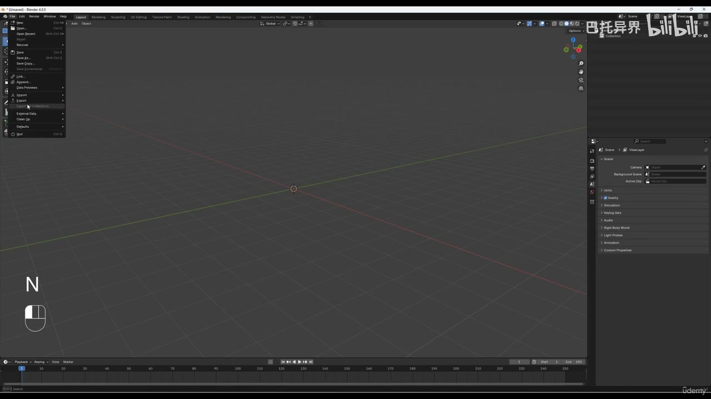
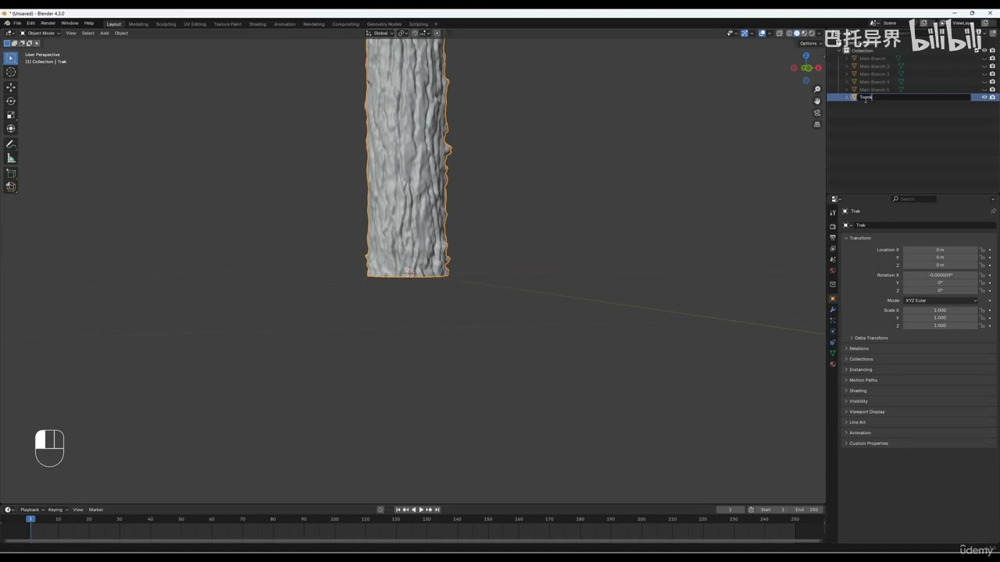

### 00:04:53-00:07:30 属性、过滤与数据分流

- 本段定位：属性、过滤与数据分流。
- 知识点：在 Blender 中制作可复用的枝条/针叶簇模块，先确定主枝比例、枝簇数量和变体目标，再用多个差异化模块组合树冠。
- 知识点：基础阶段就分配并命名材质槽，保证枝条、针叶或树皮在复制、导入 UE 和材质替换时保持稳定归类。
- 复现要点：属性命名要稳定，过滤、分区和分支节点应保留可检查的中间数据，避免后续规则难以追踪。
- 核对对象：`Branch`、`Material`、`属性`、`过滤`。

**关键画面：**

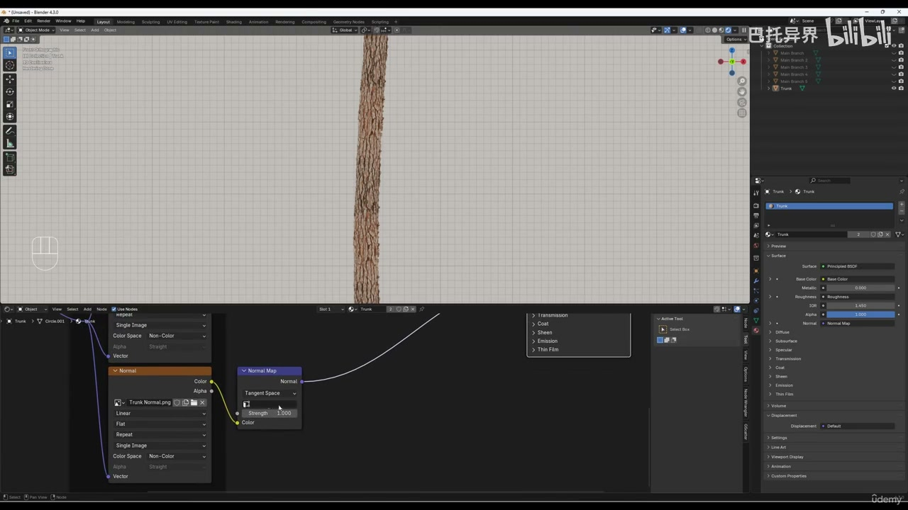
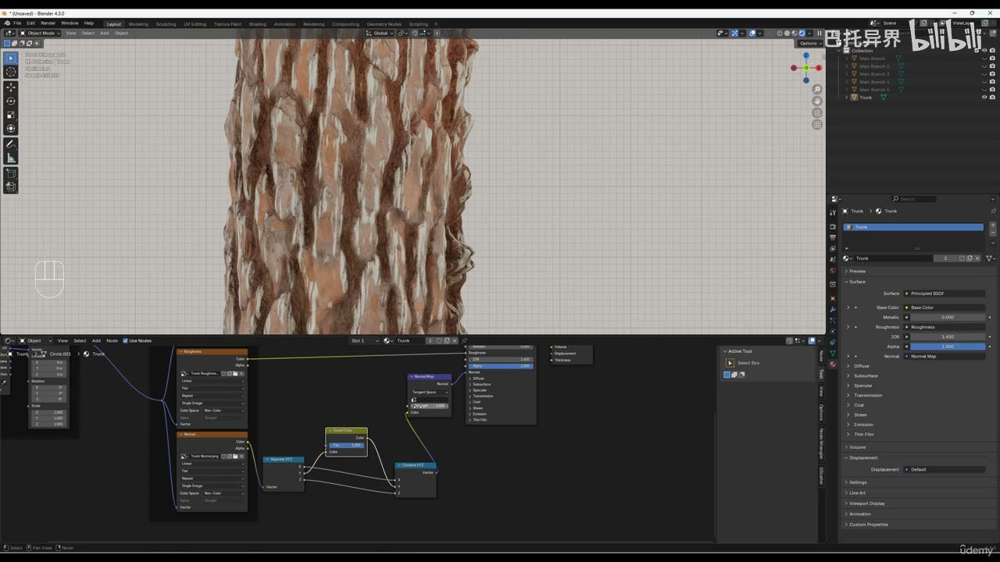

### 00:07:30-00:11:48 属性、过滤与数据分流

- 本段定位：属性、过滤与数据分流。
- 知识点：PCG 流程要按点数据、属性写入、过滤条件和 Spawner 输出四步核对，避免只看最终实例而漏掉中间点状态。
- 复现要点：先用 Debug/Inspect 核对点数量、Bounds、Density 和关键属性，再判断最终生成结果。
- 复现要点：属性命名要稳定，过滤、分区和分支节点应保留可检查的中间数据，避免后续规则难以追踪。
- 核对对象：`Point`、`Branch`、`属性`、`过滤`。

**关键画面：**

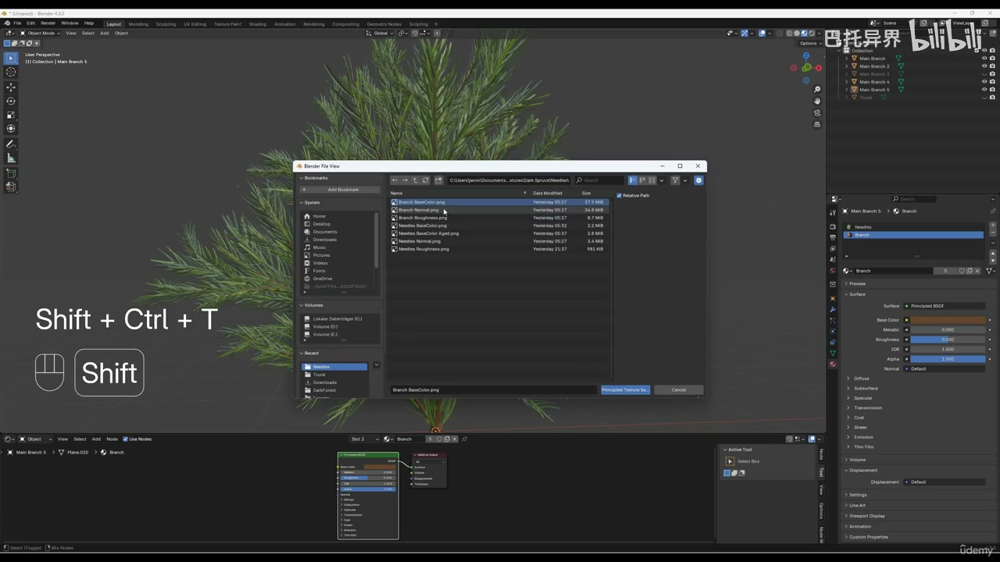
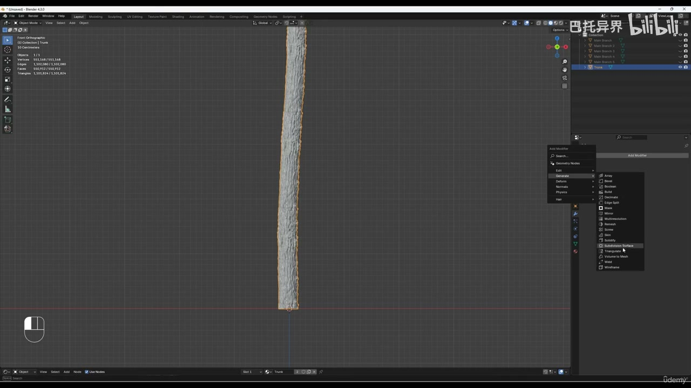

### 00:11:49-00:15:19 属性、过滤与数据分流

- 本段定位：属性、过滤与数据分流。
- 知识点：复现时先对照本段截图确认关键对象、参数面板和结果视图，再继续下游步骤。
- 复现要点：属性命名要稳定，过滤、分区和分支节点应保留可检查的中间数据，避免后续规则难以追踪。
- 核对对象：`Branch`、`属性`、`过滤`。

**关键画面：**

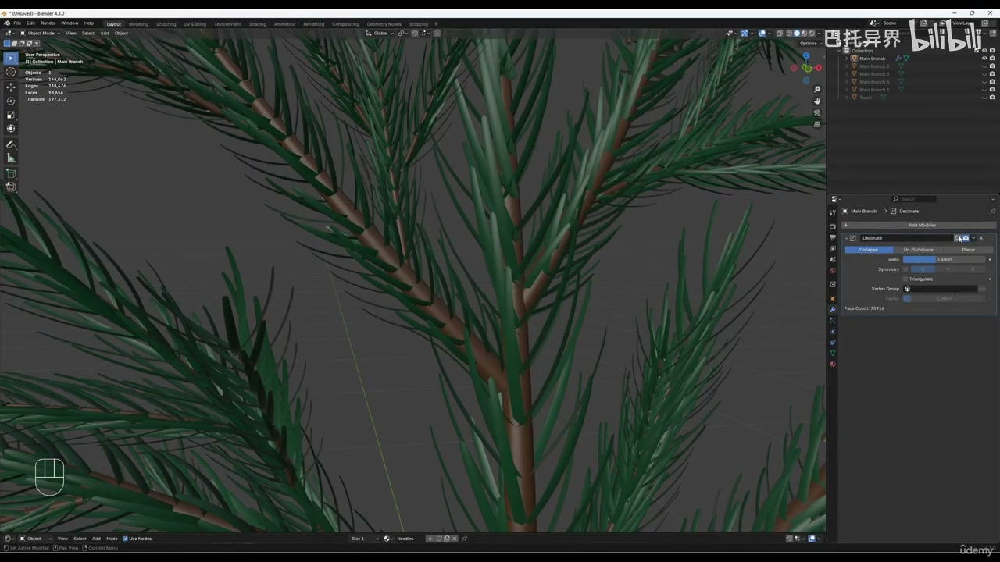
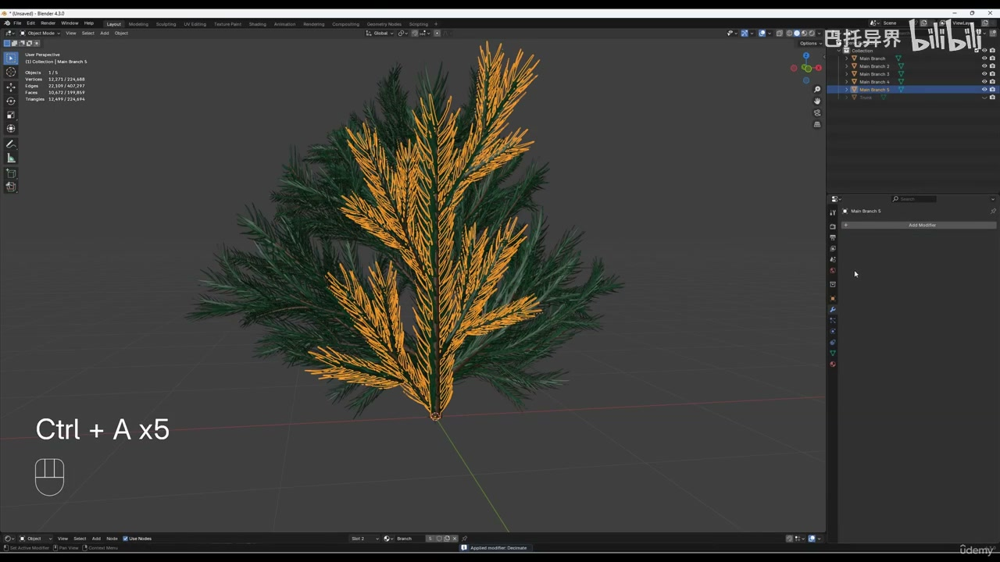

### 00:15:22-00:19:37 属性、过滤与数据分流

- 本段定位：属性、过滤与数据分流。
- 知识点：PCG 流程要按点数据、属性写入、过滤条件和 Spawner 输出四步核对，避免只看最终实例而漏掉中间点状态。
- 复现要点：先用 Debug/Inspect 核对点数量、Bounds、Density 和关键属性，再判断最终生成结果。
- 复现要点：属性命名要稳定，过滤、分区和分支节点应保留可检查的中间数据，避免后续规则难以追踪。
- 核对对象：`Point`、`Branch`、`属性`、`过滤`。

**关键画面：**

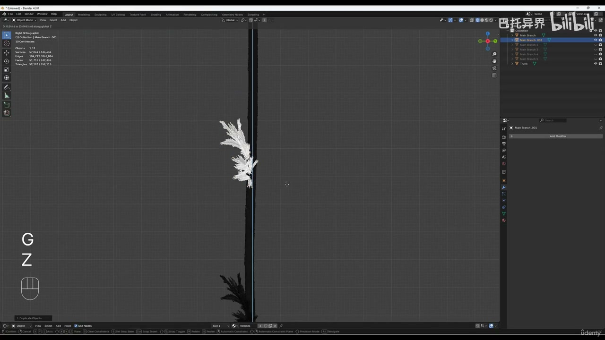
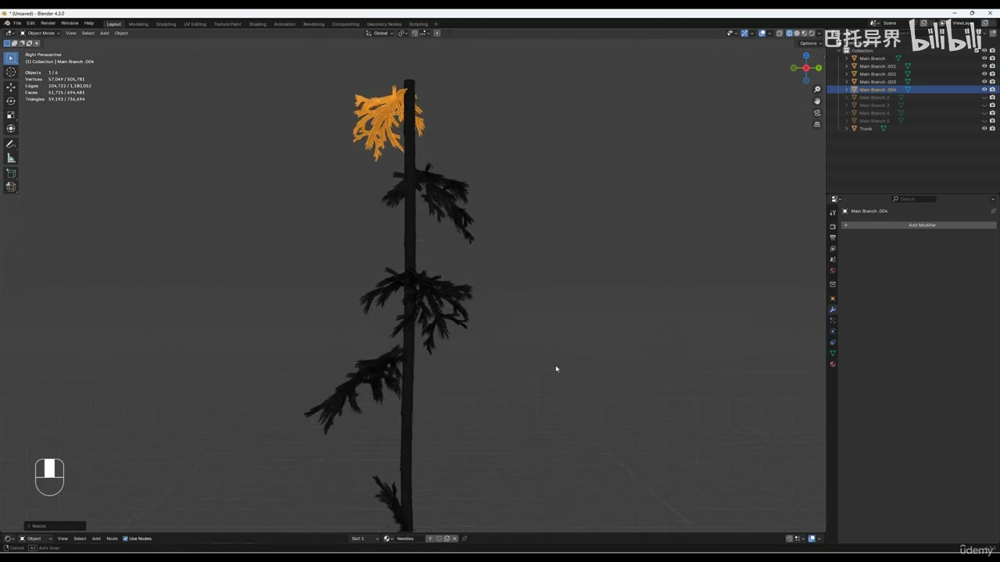

### 00:19:39-00:24:21 属性、过滤与数据分流

- 本段定位：属性、过滤与数据分流。
- 知识点：通过曲线或弯曲变形控制枝条走势，先检查对象变换和拓扑，再调整弯曲强度，避免卡片被拉伸或扭曲。
- 复现要点：属性命名要稳定，过滤、分区和分支节点应保留可检查的中间数据，避免后续规则难以追踪。
- 核对对象：`Branch`、`属性`、`过滤`。

**关键画面：**

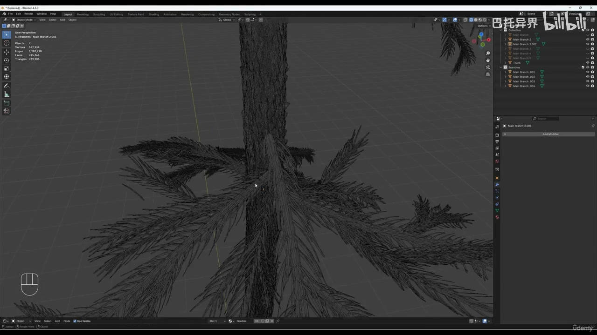
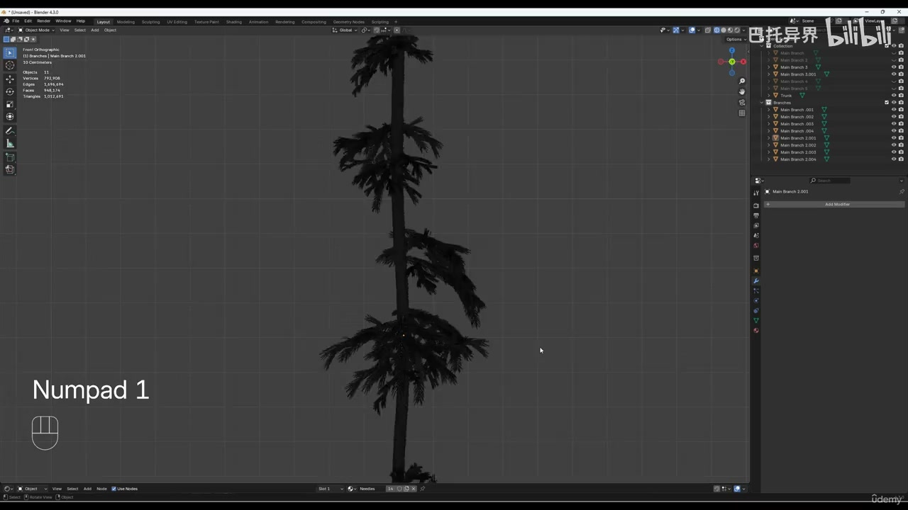

### 00:24:22-00:29:14 属性、过滤与数据分流

- 本段定位：属性、过滤与数据分流。
- 知识点：复现时先对照本段截图确认关键对象、参数面板和结果视图，再继续下游步骤。
- 复现要点：属性命名要稳定，过滤、分区和分支节点应保留可检查的中间数据，避免后续规则难以追踪。
- 核对对象：`Branch`、`属性`、`过滤`。

**关键画面：**

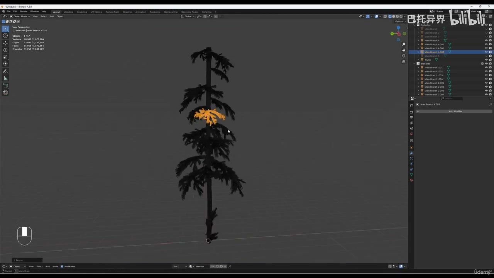
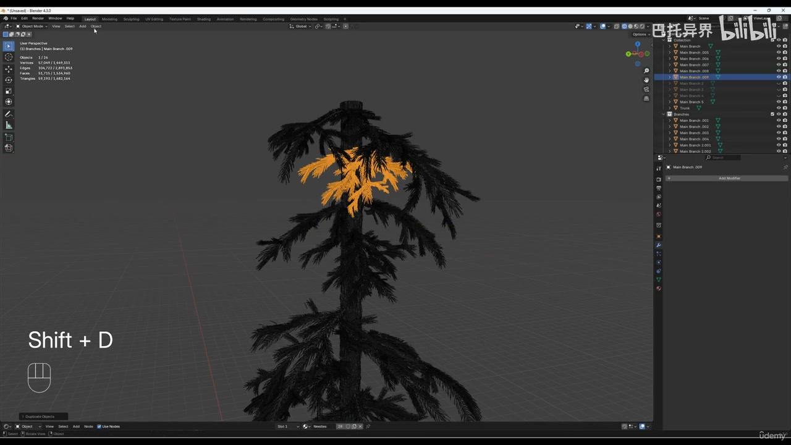

### 00:29:15-00:33:56 属性、过滤与数据分流

- 本段定位：属性、过滤与数据分流。
- 知识点：在 Blender 中制作可复用的枝条/针叶簇模块，先确定主枝比例、枝簇数量和变体目标，再用多个差异化模块组合树冠。
- 复现要点：属性命名要稳定，过滤、分区和分支节点应保留可检查的中间数据，避免后续规则难以追踪。
- 核对对象：`Branch`、`属性`、`过滤`。

**关键画面：**

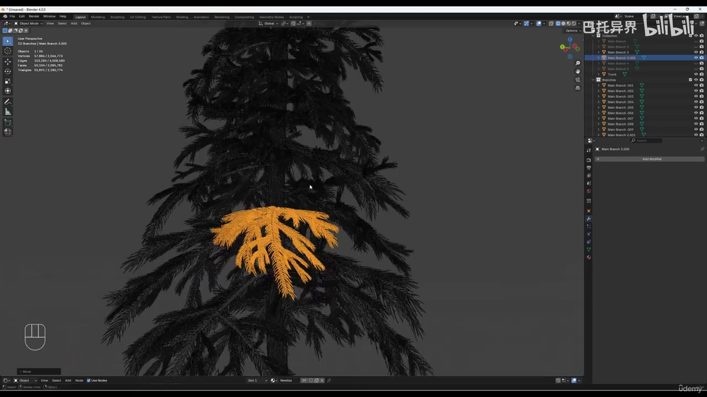
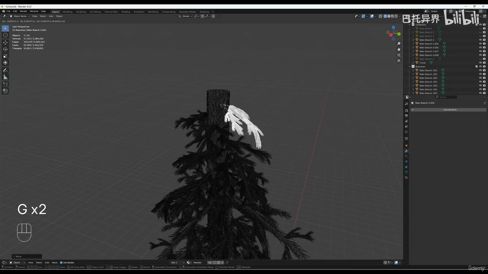

### 00:33:57-00:36:38 属性、过滤与数据分流

- 本段定位：属性、过滤与数据分流。
- 知识点：复现时先对照本段截图确认关键对象、参数面板和结果视图，再继续下游步骤。
- 复现要点：属性命名要稳定，过滤、分区和分支节点应保留可检查的中间数据，避免后续规则难以追踪。
- 核对对象：`Branch`、`Random`、`属性`、`过滤`。

**关键画面：**

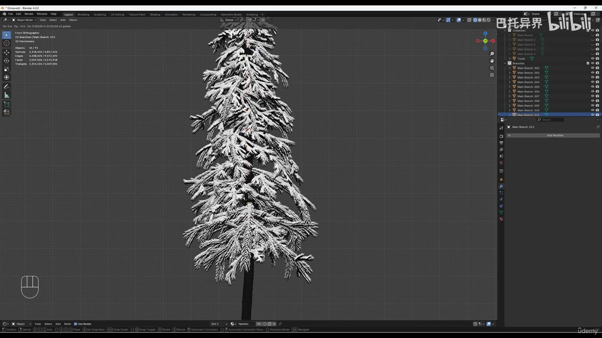
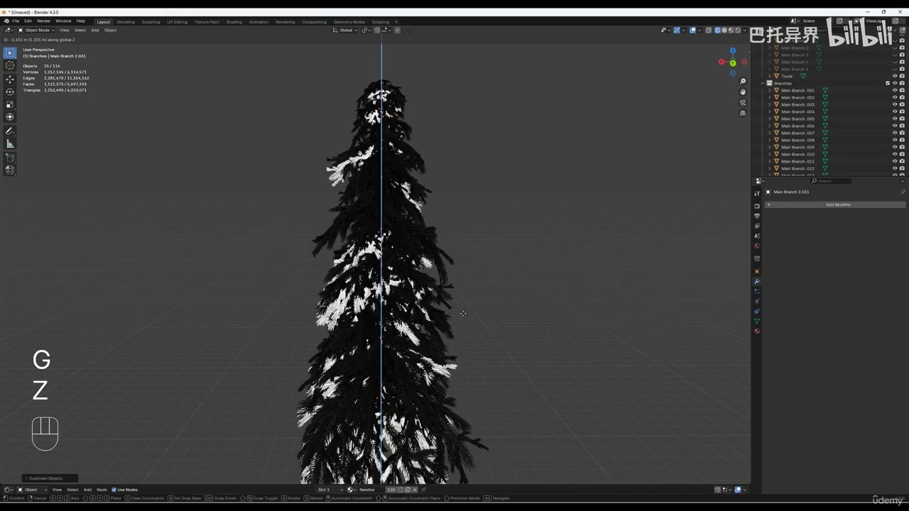

### 00:36:38-00:39:31 PCG 数据流与生成规则

- 本段定位：PCG 数据流与生成规则。
- 知识点：复现时先对照本段截图确认关键对象、参数面板和结果视图，再继续下游步骤。
- 核对对象：`PCG`、`生成`。

**关键画面：**

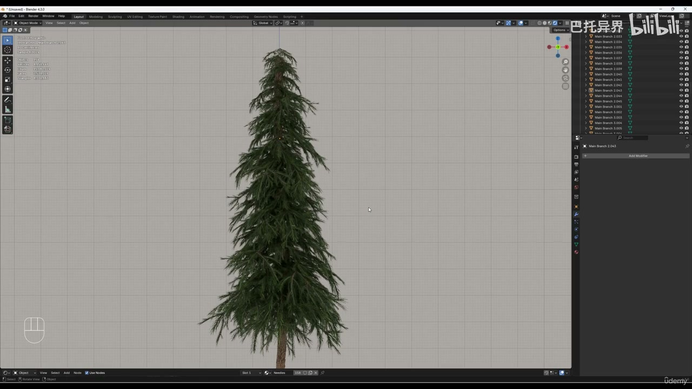
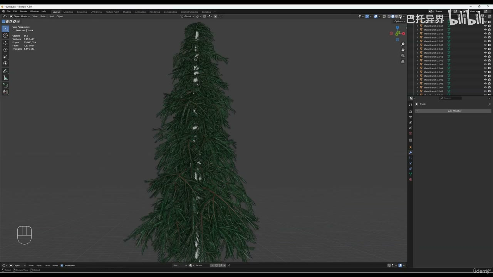

### 00:39:34-00:43:19 属性、过滤与数据分流

- 本段定位：属性、过滤与数据分流。
- 知识点：导入 UE 前检查 pivot、命名、法线、材质和 Nanite/实例化策略，保证高密度树木在场景中可管理且可重复使用。
- 复现要点：属性命名要稳定，过滤、分区和分支节点应保留可检查的中间数据，避免后续规则难以追踪。
- 核对对象：`Branch`、`Random`、`属性`、`过滤`。

**关键画面：**

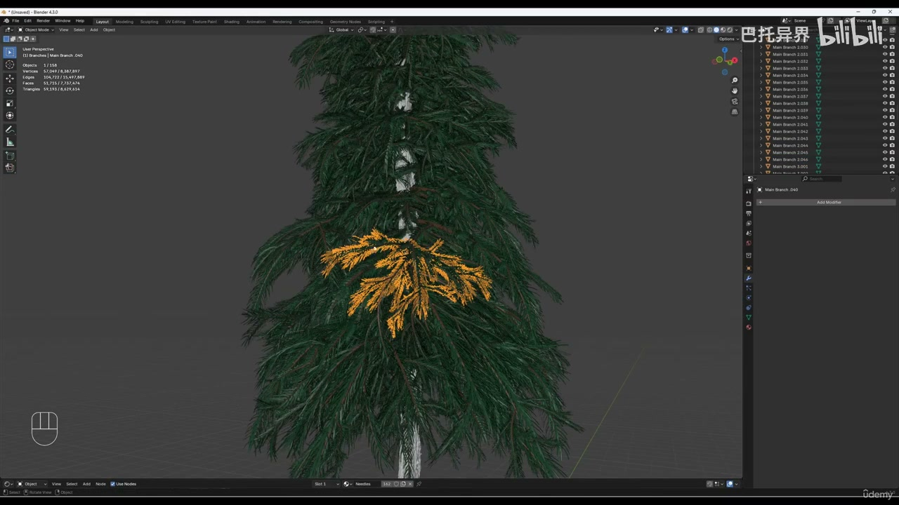
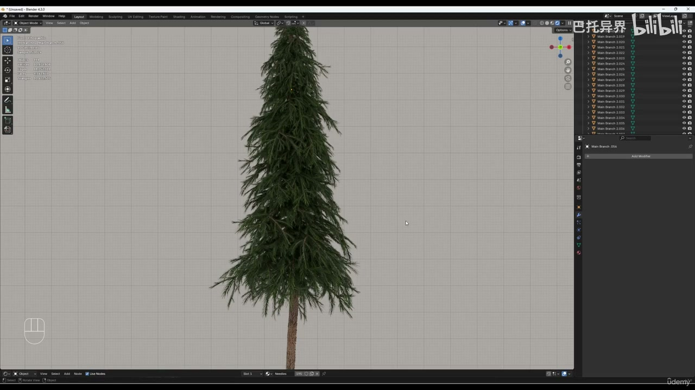

### 00:43:23-00:48:09 属性、过滤与数据分流

- 本段定位：属性、过滤与数据分流。
- 知识点：在 Blender 中制作可复用的枝条/针叶簇模块，先确定主枝比例、枝簇数量和变体目标，再用多个差异化模块组合树冠。
- 知识点：缩放、旋转、倒角或弯曲前后使用 `Ctrl+A > Apply All Transforms` 归一化对象变换，避免非统一缩放影响倒角、弯曲和法线。
- 知识点：基础阶段就分配并命名材质槽，保证枝条、针叶或树皮在复制、导入 UE 和材质替换时保持稳定归类。
- 复现要点：属性命名要稳定，过滤、分区和分支节点应保留可检查的中间数据，避免后续规则难以追踪。
- 核对对象：`Branch`、`Material`、`属性`、`过滤`。

**关键画面：**

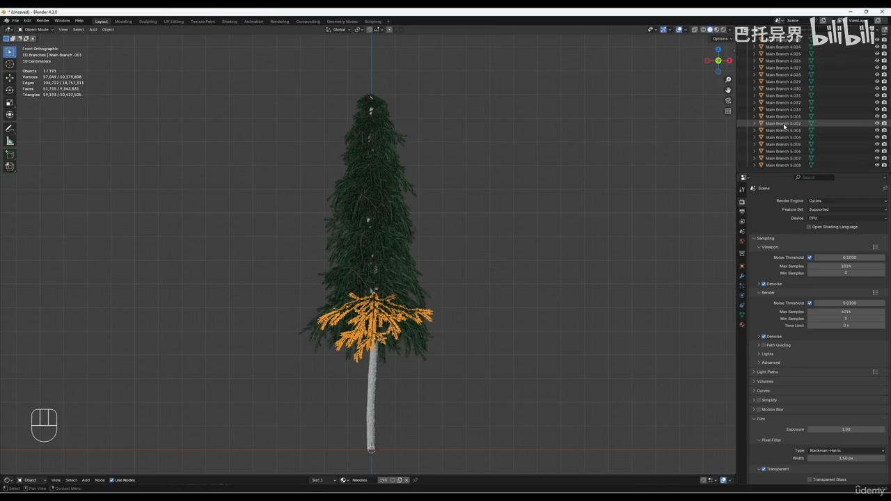
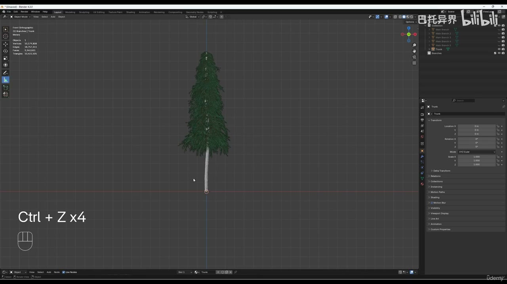

### 00:48:11-00:53:08 属性、过滤与数据分流

- 本段定位：属性、过滤与数据分流。
- 知识点：在 Blender 中制作可复用的枝条/针叶簇模块，先确定主枝比例、枝簇数量和变体目标，再用多个差异化模块组合树冠。
- 知识点：导入 UE 前检查 pivot、命名、法线、材质和 Nanite/实例化策略，保证高密度树木在场景中可管理且可重复使用。
- 复现要点：属性命名要稳定，过滤、分区和分支节点应保留可检查的中间数据，避免后续规则难以追踪。
- 核对对象：`Branch`、`属性`、`过滤`。

**关键画面：**

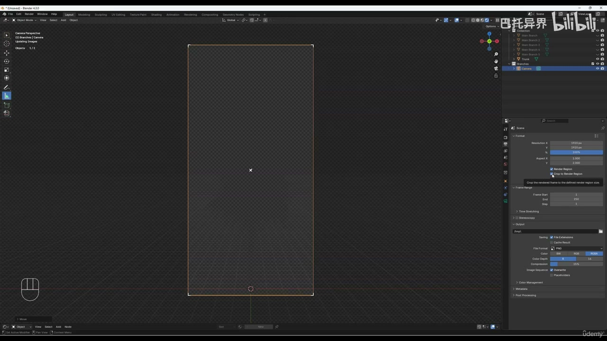
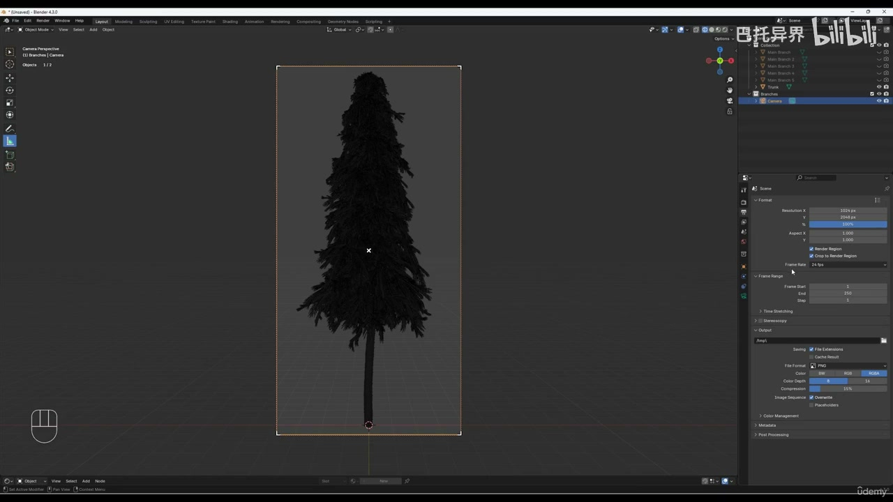

### 00:53:10-00:58:03 属性、过滤与数据分流

- 本段定位：属性、过滤与数据分流。
- 知识点：在 Blender 中制作可复用的枝条/针叶簇模块，先确定主枝比例、枝簇数量和变体目标，再用多个差异化模块组合树冠。
- 知识点：用平面卡片制作针叶基础单元，在编辑模式调整比例、朝向和中心点，作为后续阵列复制与变形的最小构件。
- 复现要点：属性命名要稳定，过滤、分区和分支节点应保留可检查的中间数据，避免后续规则难以追踪。
- 核对对象：`Volume`、`Branch`、`Random`、`属性`、`过滤`。

**关键画面：**

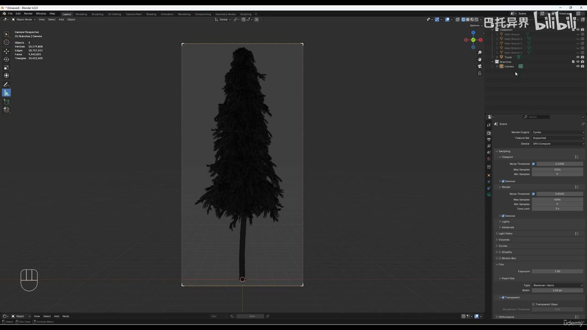
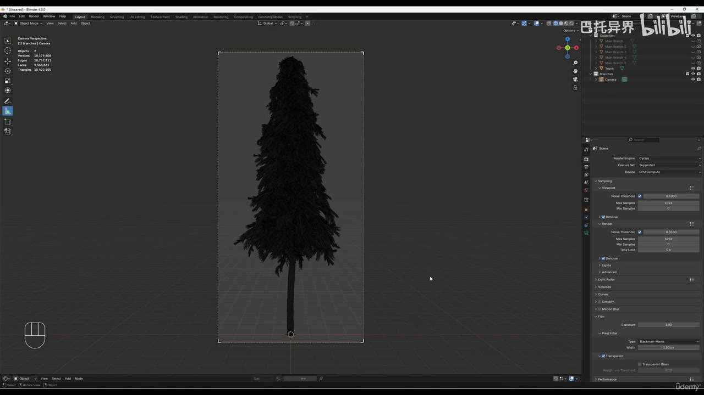

### 00:58:03-01:00:40 属性、过滤与数据分流

- 本段定位：属性、过滤与数据分流。
- 知识点：基础阶段就分配并命名材质槽，保证枝条、针叶或树皮在复制、导入 UE 和材质替换时保持稳定归类。
- 知识点：用平面卡片制作针叶基础单元，在编辑模式调整比例、朝向和中心点，作为后续阵列复制与变形的最小构件。
- 知识点：导入 UE 前检查 pivot、命名、法线、材质和 Nanite/实例化策略，保证高密度树木在场景中可管理且可重复使用。
- 复现要点：属性命名要稳定，过滤、分区和分支节点应保留可检查的中间数据，避免后续规则难以追踪。
- 核对对象：`Branch`、`Material`、`属性`、`过滤`。

**关键画面：**

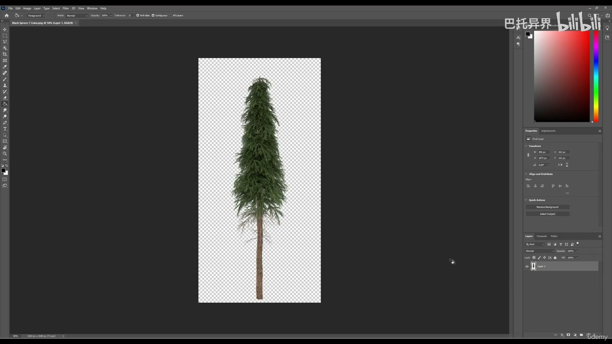

## 复现检查

- 每个图表先检查输入数据是否正确进入 PCG Graph，再看下游生成结果。
- Debug/Inspect 时重点看点数量、Bounds、Density、Transform、Seed 和自定义 Attribute。
- Static Mesh Spawner、Spawn Actor、Spline Mesh 和 Blueprint 输出节点不能混用语义；选择前先确定是否需要实例化性能或蓝图逻辑。
- 涉及样条、分区、运行时或 GPU 生成时，必须额外验证更新触发、缓存、世界分区和性能预算。
