# 2 10 Add Slope Function

## 知识目标

- 围绕“2 10 Add Slope Function”整理 PCG 视频中的输入数据、图表规则、关键节点、参数风险和最终生成结果。
- 阅读时重点区分三层：输入来源（点、样条、表面、体积、Actor 或属性）、规则处理（采样、过滤、变换、分区、循环、HLSL 或子图）、输出方式（Static Mesh Spawner、Spawn Actor、Spline Mesh、Blueprint 或 Dynamic Mesh）。

## 可复现主流程

- 确认 PCG Graph/PCG Component 已绑定到正确 Actor，并先用 Debug/Inspect 查看中间点数据。
- 明确输入来源：Spline、Surface、Mesh、Volume、Actor、Data Asset/Data Table 或手工参数。
- 在图表中按顺序处理采样、属性写入、过滤、Transform、分区/循环和输出节点。
- 生成可见结果前，先核对 Point 的 Transform、Bounds、Density、Seed 和自定义 Attribute。
- 用 Static Mesh Spawner 输出大量网格实例；需要蓝图逻辑时改用 Spawn Actor 或 Blueprint 交互。
- 涉及 Dynamic Mesh 或 Geometry Script 时，先小规模验证布尔、倒角、修补和 UV，再扩展到批量生成。

## 关键术语

- `Blueprint`、`Attribute`、`Component`、`Graph`、`Mask`、`Material`、`Instance`、`Landscape`、`alpha`、`normal`、`function`、`slope`、`call`、`albedo`、`wanna`、`Boolean`

## 分段知识

### 00:00:00-00:02:56 属性、过滤与数据分流

- 本段定位：属性、过滤与数据分流。
- 知识点：基础阶段就分配并命名材质槽，保证枝条、针叶或树皮在复制、导入 UE 和材质替换时保持稳定归类。
- 知识点：属性是 PCG 数据流中的关键状态，应明确保存分类、索引、随机种子、缩放或材质选择等信息。
- 复现要点：属性命名要稳定，过滤、分区和分支节点应保留可检查的中间数据，避免后续规则难以追踪。
- 核对对象：`Attribute`、`Material`、`属性`、`过滤`。

**关键画面：**

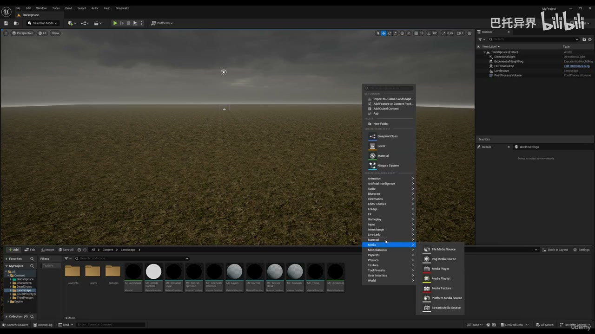
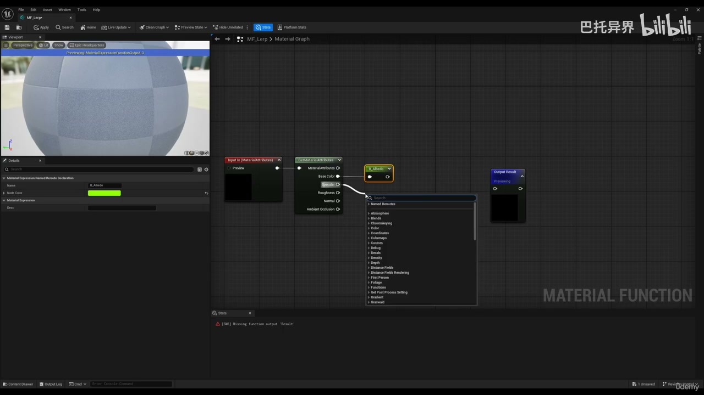

### 00:02:56-00:06:35 PCG 数据流与生成规则

- 本段定位：PCG 数据流与生成规则。
- 知识点：复现时先对照本段截图确认关键对象、参数面板和结果视图，再继续下游步骤。
- 核对对象：`PCG`、`生成`。

**关键画面：**

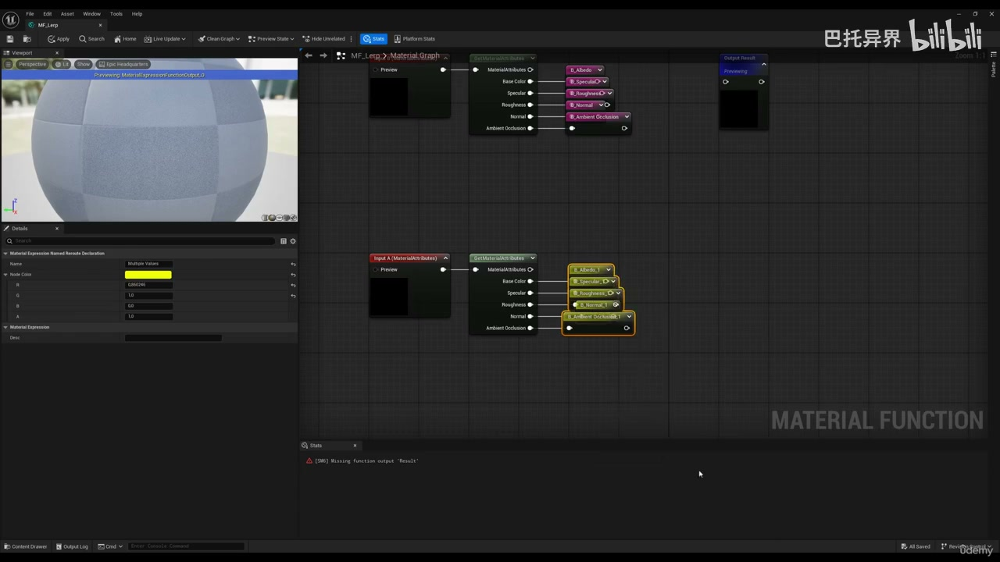
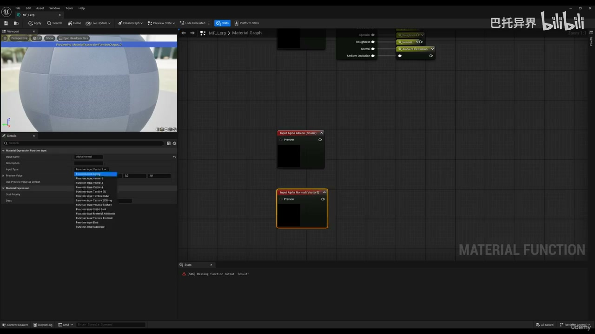

### 00:06:37-00:11:23 Geometry Script 与 Dynamic Mesh 处理

- 本段定位：Geometry Script 与 Dynamic Mesh 处理。
- 知识点：复现时先对照本段截图确认关键对象、参数面板和结果视图，再继续下游步骤。
- 复现要点：Dynamic Mesh/Geometry Script 节点通常计算成本较高，布尔、倒角和 Auto UV 应在质量与重算成本之间取舍。
- 核对对象：`Geometry Script`、`Dynamic Mesh`、`Boolean`。

**关键画面：**

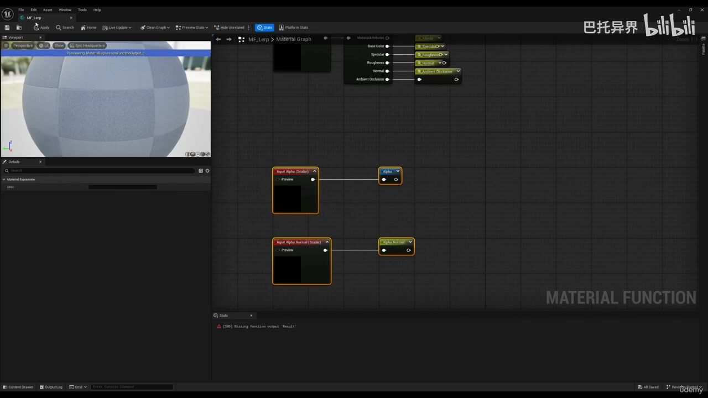
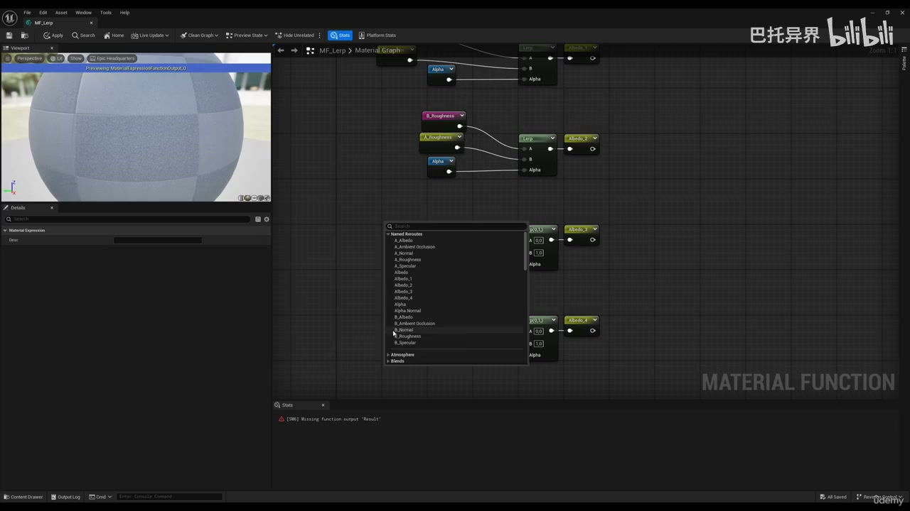

### 00:11:23-00:14:59 生成器输出与蓝图交互

- 本段定位：生成器输出与蓝图交互。
- 知识点：基础阶段就分配并命名材质槽，保证枝条、针叶或树皮在复制、导入 UE 和材质替换时保持稳定归类。
- 知识点：Spawn Actor 适合生成带蓝图逻辑的对象。
- 知识点：Static Mesh Spawner 将点数据实例化为静态网格，复现时要检查 Mesh、Transform、Density 和材质覆盖。
- 复现要点：Static Mesh Spawner 用于高效实例化；Spawn Actor/Blueprint 用于需要逻辑的对象，成本和生命周期不同。
- 核对对象：`Blueprint`、`Material`、`生成`、`蓝图`。

**关键画面：**

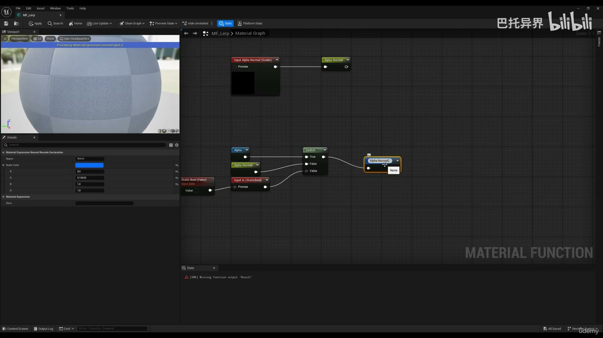
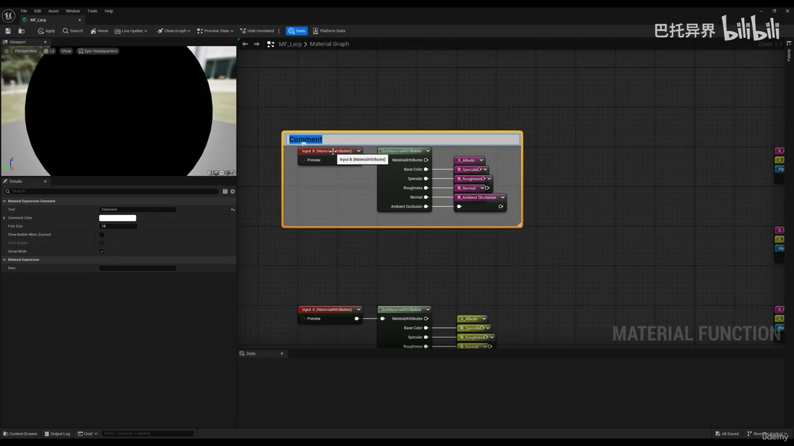

### 00:15:02-00:18:47 属性、过滤与数据分流

- 本段定位：属性、过滤与数据分流。
- 知识点：基础阶段就分配并命名材质槽，保证枝条、针叶或树皮在复制、导入 UE 和材质替换时保持稳定归类。
- 知识点：属性是 PCG 数据流中的关键状态，应明确保存分类、索引、随机种子、缩放或材质选择等信息。
- 复现要点：属性命名要稳定，过滤、分区和分支节点应保留可检查的中间数据，避免后续规则难以追踪。
- 核对对象：`Attribute`、`Material`、`属性`、`过滤`。

**关键画面：**

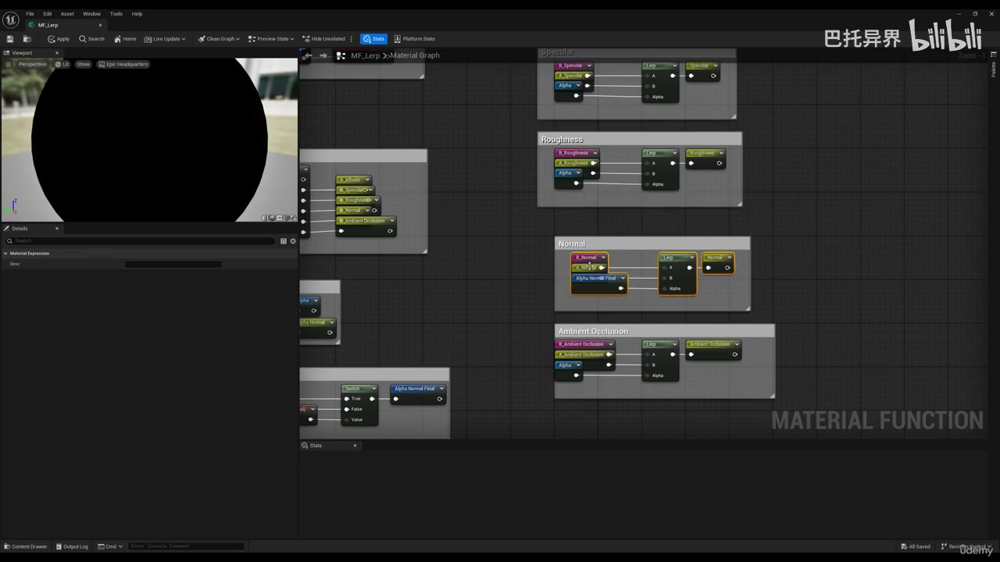
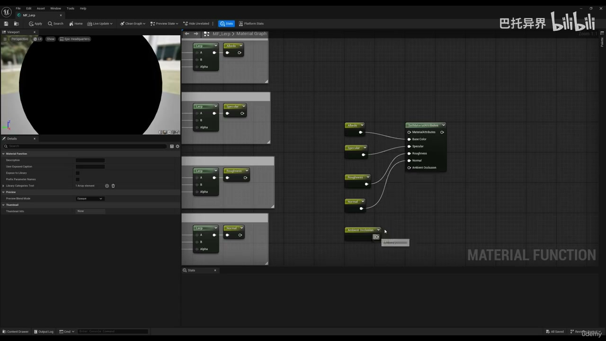

### 00:18:48-00:22:08 PCG 数据流与生成规则

- 本段定位：PCG 数据流与生成规则。
- 知识点：复现时先对照本段截图确认关键对象、参数面板和结果视图，再继续下游步骤。
- 核对对象：`PCG`、`生成`。

**关键画面：**

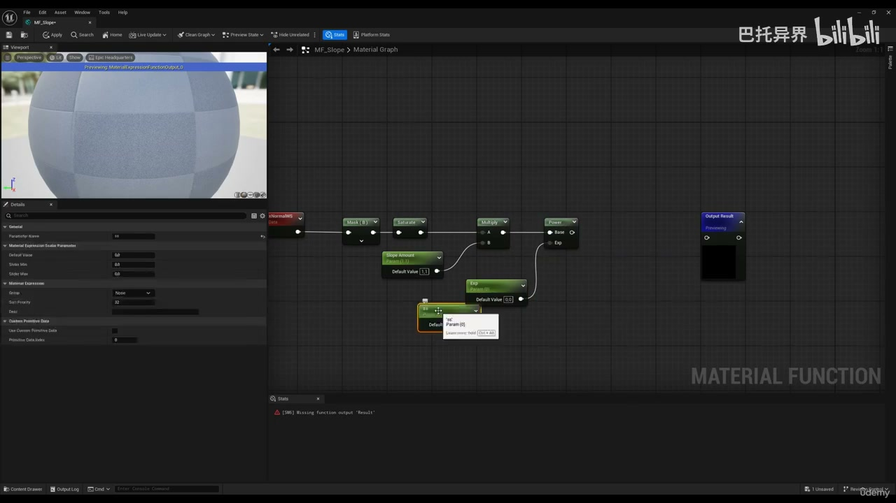
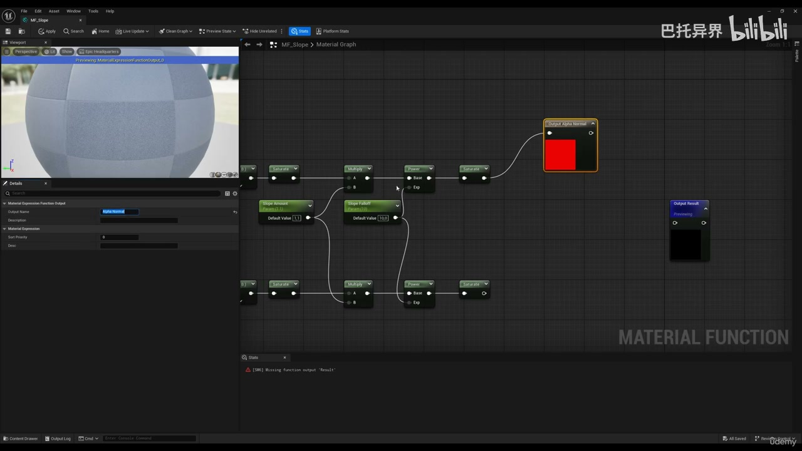

### 00:22:10-00:27:10 PCG 数据流与生成规则

- 本段定位：PCG 数据流与生成规则。
- 知识点：基础阶段就分配并命名材质槽，保证枝条、针叶或树皮在复制、导入 UE 和材质替换时保持稳定归类。
- 核对对象：`PCG`、`Material`、`Instance`、`生成`。

**关键画面：**

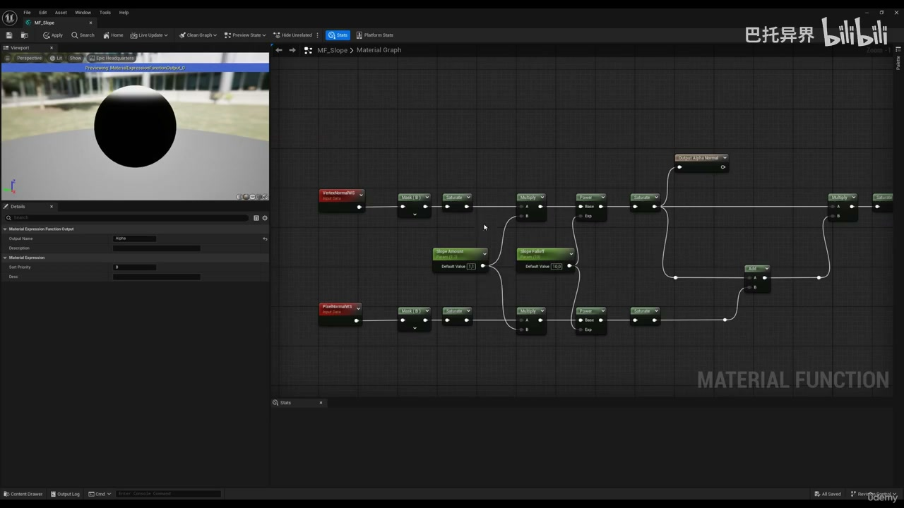
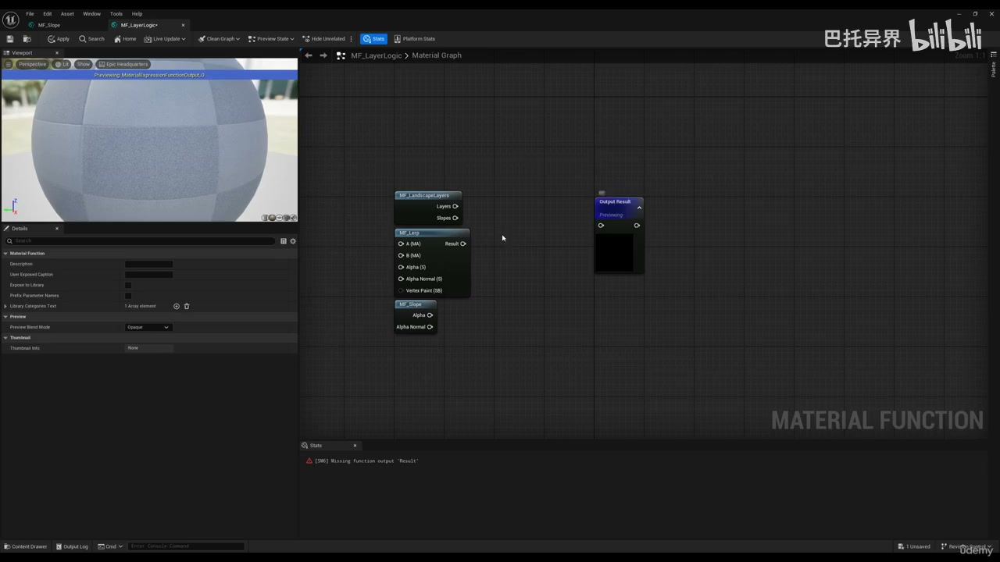

### 00:27:10-00:30:14 PCG 数据流与生成规则

- 本段定位：PCG 数据流与生成规则。
- 知识点：基础阶段就分配并命名材质槽，保证枝条、针叶或树皮在复制、导入 UE 和材质替换时保持稳定归类。
- 核对对象：`PCG`、`Material`、`生成`。

**关键画面：**

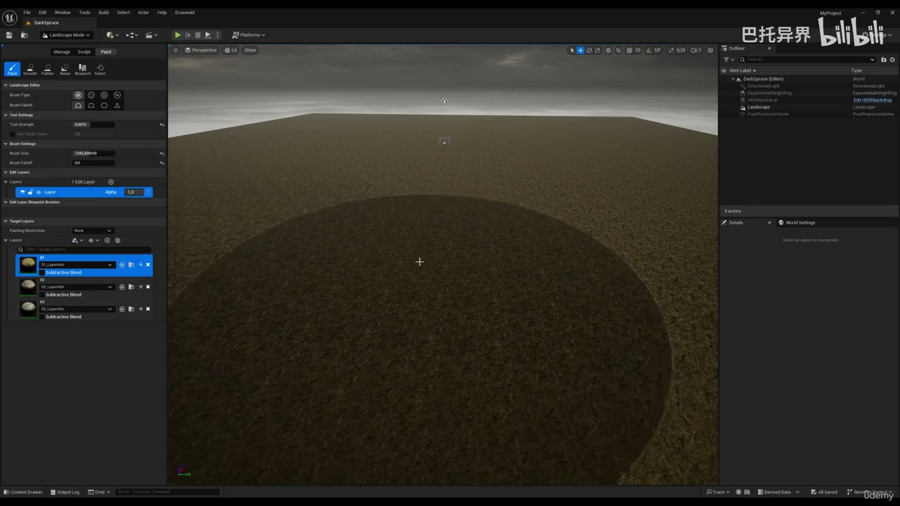
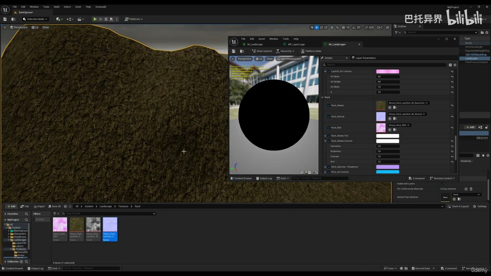

### 00:30:15-00:33:55 PCG 数据流与生成规则

- 本段定位：PCG 数据流与生成规则。
- 知识点：基础阶段就分配并命名材质槽，保证枝条、针叶或树皮在复制、导入 UE 和材质替换时保持稳定归类。
- 核对对象：`PCG`、`Material`、`Instance`、`生成`。

**关键画面：**

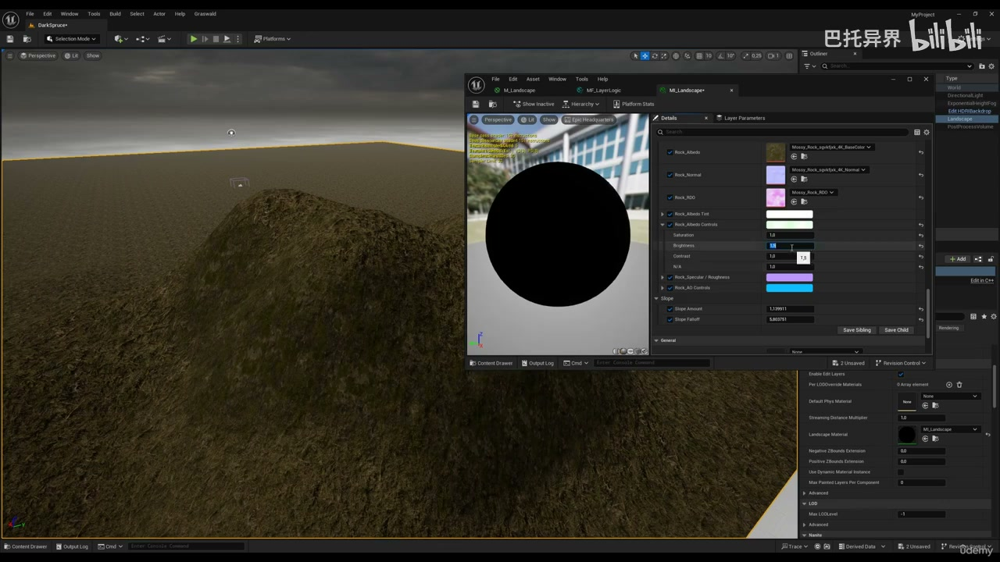
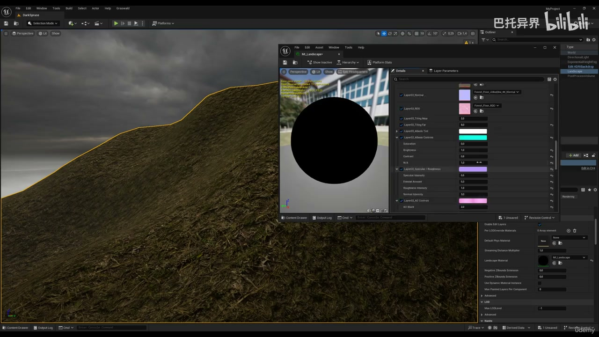

## 复现检查

- 每个图表先检查输入数据是否正确进入 PCG Graph，再看下游生成结果。
- Debug/Inspect 时重点看点数量、Bounds、Density、Transform、Seed 和自定义 Attribute。
- Static Mesh Spawner、Spawn Actor、Spline Mesh 和 Blueprint 输出节点不能混用语义；选择前先确定是否需要实例化性能或蓝图逻辑。
- 涉及样条、分区、运行时或 GPU 生成时，必须额外验证更新触发、缓存、世界分区和性能预算。
- Dynamic Mesh/Geometry Script 流程要单独测试布尔、倒角、网格修补、UV 和保存 Static Mesh 的成本。
