# 3 3 Import Spline into Unreal Engine 5

## 知识目标

- 围绕“3 3 Import Spline into Unreal Engine 5”整理 PCG 视频中的输入数据、图表规则、关键节点、参数风险和最终生成结果。
- 阅读时重点区分三层：输入来源（点、样条、表面、体积、Actor 或属性）、规则处理（采样、过滤、变换、分区、循环、HLSL 或子图）、输出方式（Static Mesh Spawner、Spawn Actor、Spline Mesh、Blueprint 或 Dynamic Mesh）。

## 可复现主流程

- 确认 PCG Graph/PCG Component 已绑定到正确 Actor，并先用 Debug/Inspect 查看中间点数据。
- 明确输入来源：Spline、Surface、Mesh、Volume、Actor、Data Asset/Data Table 或手工参数。
- 在图表中按顺序处理采样、属性写入、过滤、Transform、分区/循环和输出节点。
- 生成可见结果前，先核对 Point 的 Transform、Bounds、Density、Seed 和自定义 Attribute。
- 用 Static Mesh Spawner 输出大量网格实例；需要蓝图逻辑时改用 Spawn Actor 或 Blueprint 交互。

## 关键术语

- `Static Mesh`、`Mesh`、`Spline`、`Transform`、`Point`、`Mask`、`Material`、`Instance`、`Landscape`、`Volume`、`Spline Mesh`、`Branch`

## 分段知识

### 00:00:00-00:02:59 属性、过滤与数据分流

- 本段定位：属性、过滤与数据分流。
- 知识点：基础阶段就分配并命名材质槽，保证枝条、针叶或树皮在复制、导入 UE 和材质替换时保持稳定归类。
- 知识点：Spline 输入通常先采样为点，再用距离、切线或标签过滤道路范围内外的生成点。
- 知识点：用 Actor Tag 或 Spline 作为外部输入时，应先确认标签命中对象，再检查过滤后的点集。
- 复现要点：属性命名要稳定，过滤、分区和分支节点应保留可检查的中间数据，避免后续规则难以追踪。
- 核对对象：`Branch`、`Material`、`属性`、`过滤`。

**关键画面：**

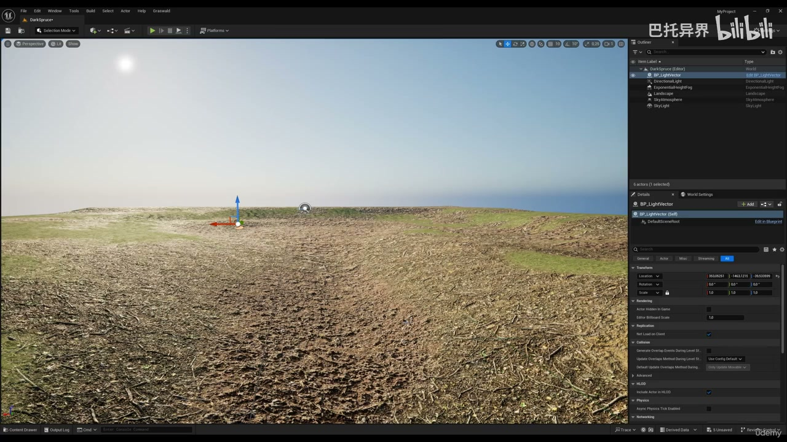
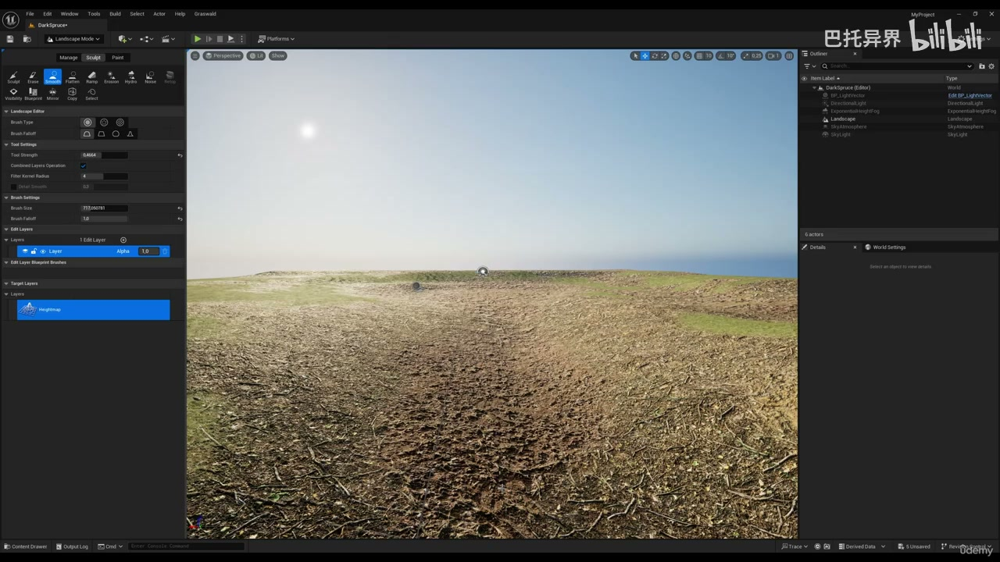

### 00:03:02-00:07:29 Spline 采样与路径生成

- 本段定位：Spline 采样与路径生成。
- 知识点：复现时先对照本段截图确认关键对象、参数面板和结果视图，再继续下游步骤。
- 知识点：Spline 输入通常先采样为点，再用距离、切线或标签过滤道路范围内外的生成点。
- 知识点：用 Actor Tag 或 Spline 作为外部输入时，应先确认标签命中对象，再检查过滤后的点集。
- 核对对象：`PCG`、`生成`。

**关键画面：**

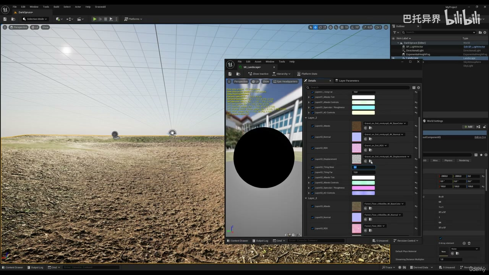
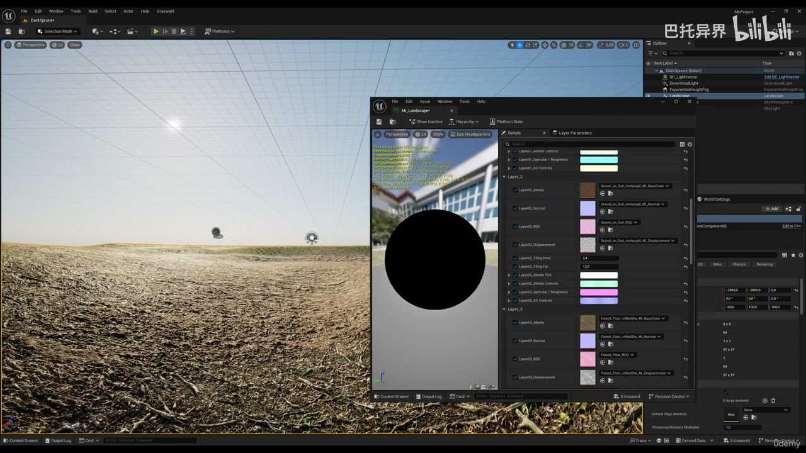

### 00:07:30-00:10:38 Spline 采样与路径生成

- 本段定位：Spline 采样与路径生成。
- 知识点：基础阶段就分配并命名材质槽，保证枝条、针叶或树皮在复制、导入 UE 和材质替换时保持稳定归类。
- 知识点：Spline 输入通常先采样为点，再用距离、切线或标签过滤道路范围内外的生成点。
- 知识点：用 Actor Tag 或 Spline 作为外部输入时，应先确认标签命中对象，再检查过滤后的点集。
- 核对对象：`PCG`、`Material`、`生成`。

**关键画面：**

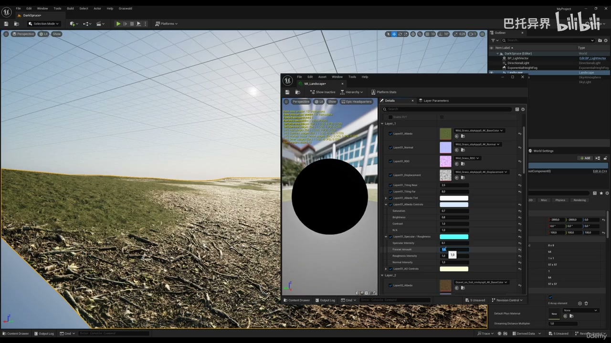
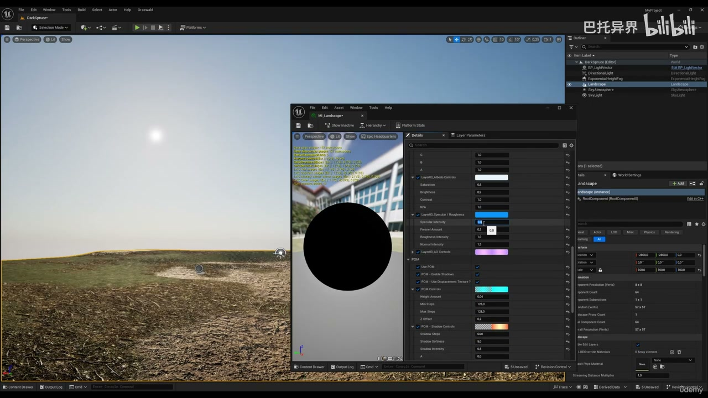

### 00:10:42-00:13:46 Spline 采样与路径生成

- 本段定位：Spline 采样与路径生成。
- 知识点：复现时先对照本段截图确认关键对象、参数面板和结果视图，再继续下游步骤。
- 知识点：Spline 输入通常先采样为点，再用距离、切线或标签过滤道路范围内外的生成点。
- 知识点：用 Actor Tag 或 Spline 作为外部输入时，应先确认标签命中对象，再检查过滤后的点集。
- 核对对象：`PCG`、`生成`。

**关键画面：**

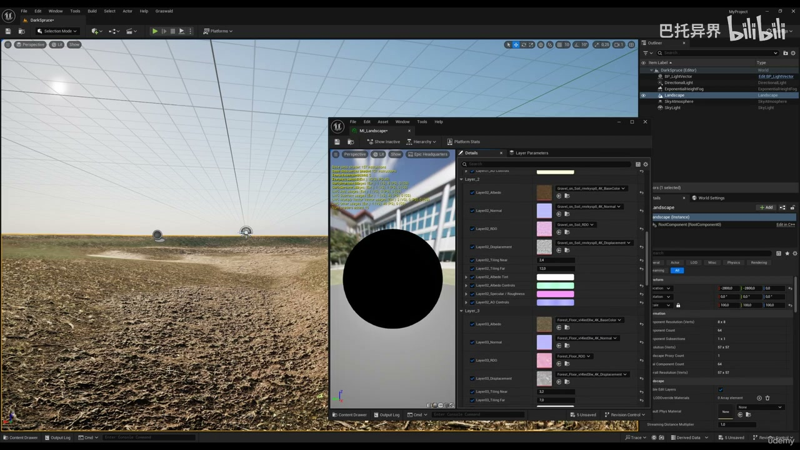
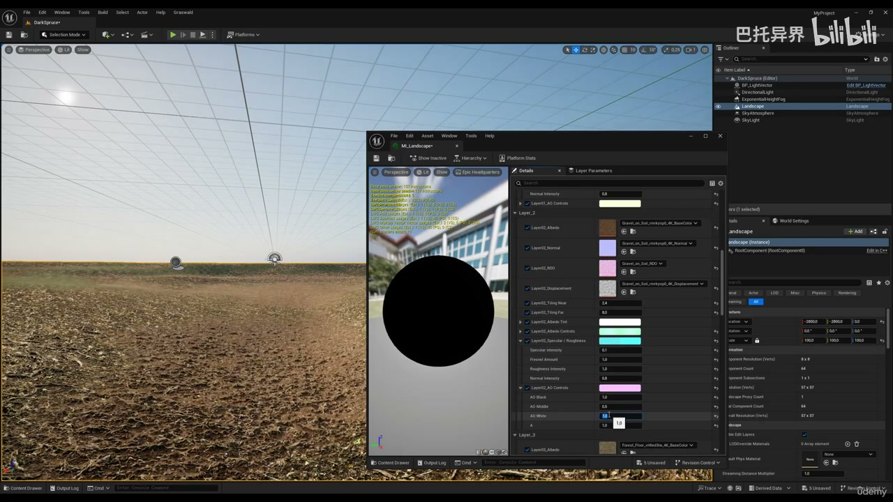

### 00:13:47-00:16:45 Spline 采样与路径生成

- 本段定位：Spline 采样与路径生成。
- 知识点：复现时先对照本段截图确认关键对象、参数面板和结果视图，再继续下游步骤。
- 知识点：Spline 输入通常先采样为点，再用距离、切线或标签过滤道路范围内外的生成点。
- 知识点：用 Actor Tag 或 Spline 作为外部输入时，应先确认标签命中对象，再检查过滤后的点集。
- 核对对象：`PCG`、`生成`。

**关键画面：**

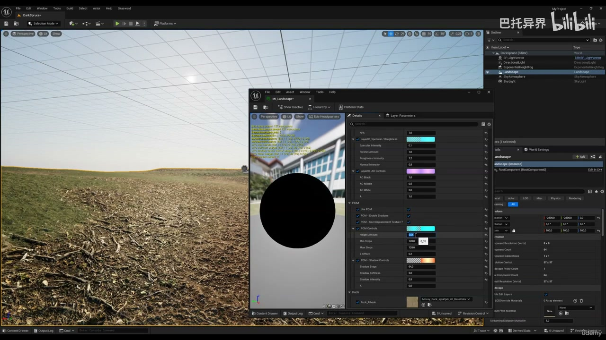
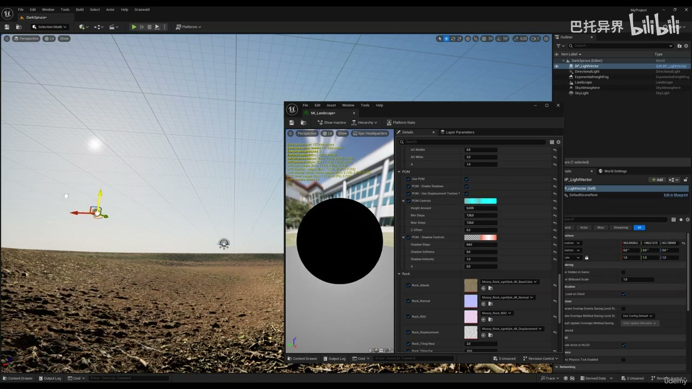

### 00:16:53-00:19:46 Spline 采样与路径生成

- 本段定位：Spline 采样与路径生成。
- 知识点：基础阶段就分配并命名材质槽，保证枝条、针叶或树皮在复制、导入 UE 和材质替换时保持稳定归类。
- 知识点：Spline 输入通常先采样为点，再用距离、切线或标签过滤道路范围内外的生成点。
- 知识点：用 Actor Tag 或 Spline 作为外部输入时，应先确认标签命中对象，再检查过滤后的点集。
- 核对对象：`PCG`、`Material`、`生成`。

**关键画面：**

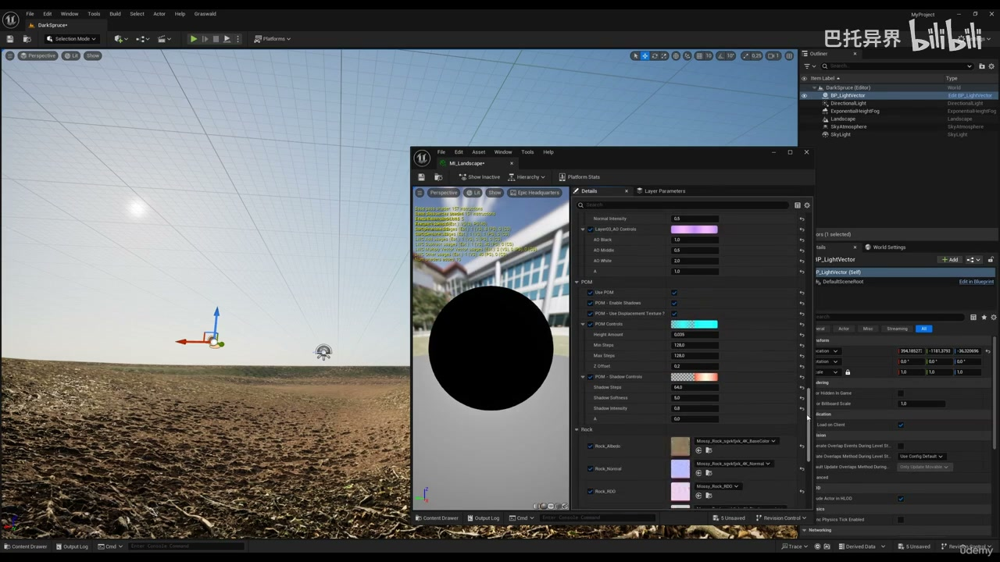
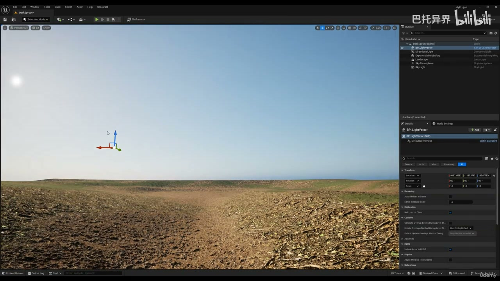

### 00:19:49-00:22:44 点数据、Bounds 与采样来源

- 本段定位：点数据、Bounds 与采样来源。
- 知识点：基础阶段就分配并命名材质槽，保证枝条、针叶或树皮在复制、导入 UE 和材质替换时保持稳定归类。
- 知识点：Spline 输入通常先采样为点，再用距离、切线或标签过滤道路范围内外的生成点。
- 知识点：用 Actor Tag 或 Spline 作为外部输入时，应先确认标签命中对象，再检查过滤后的点集。
- 复现要点：先用 Debug/Inspect 核对点数量、Bounds、Density 和关键属性，再判断最终生成结果。
- 核对对象：`Bounds`、`Volume`、`Material`、`点`、`点数据`、`采样`。

**关键画面：**

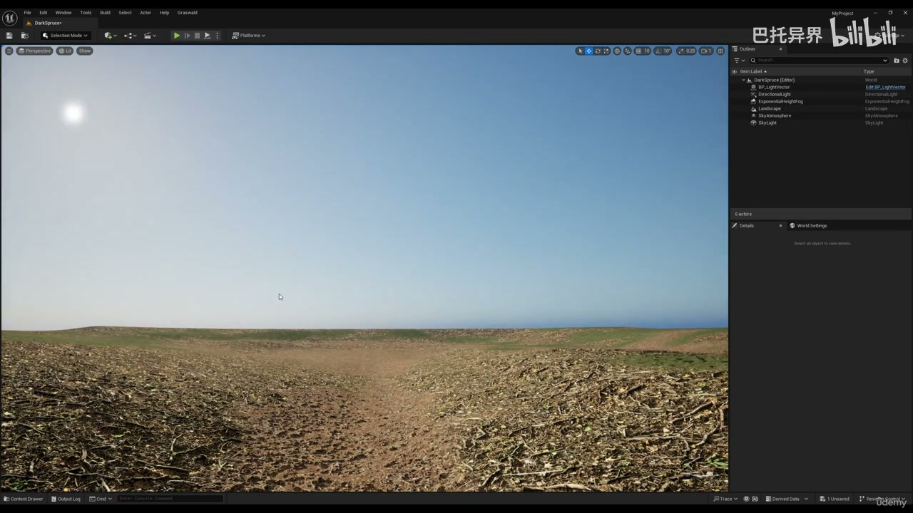
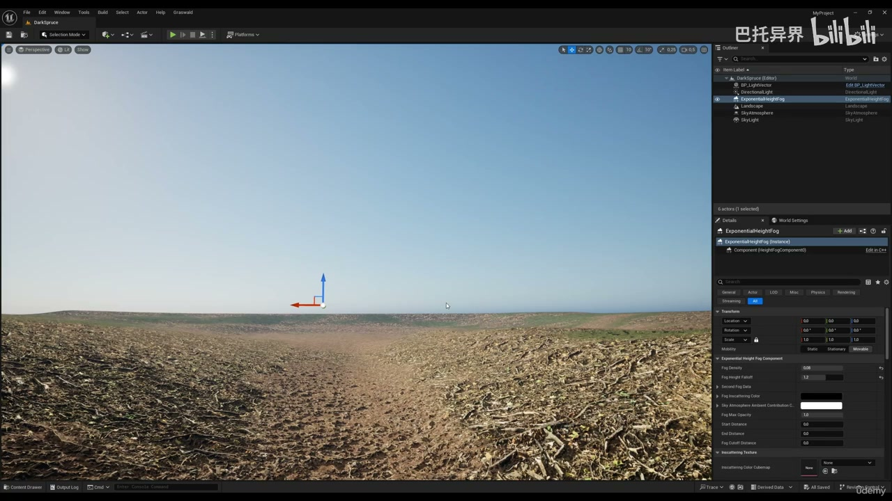

### 00:22:48-00:25:43 Spline 采样与路径生成

- 本段定位：Spline 采样与路径生成。
- 知识点：基础阶段就分配并命名材质槽，保证枝条、针叶或树皮在复制、导入 UE 和材质替换时保持稳定归类。
- 知识点：Spline 输入通常先采样为点，再用距离、切线或标签过滤道路范围内外的生成点。
- 知识点：用 Actor Tag 或 Spline 作为外部输入时，应先确认标签命中对象，再检查过滤后的点集。
- 核对对象：`PCG`、`Material`、`生成`。

**关键画面：**

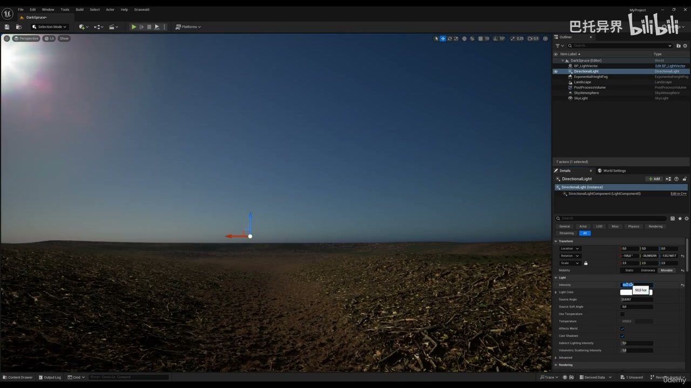
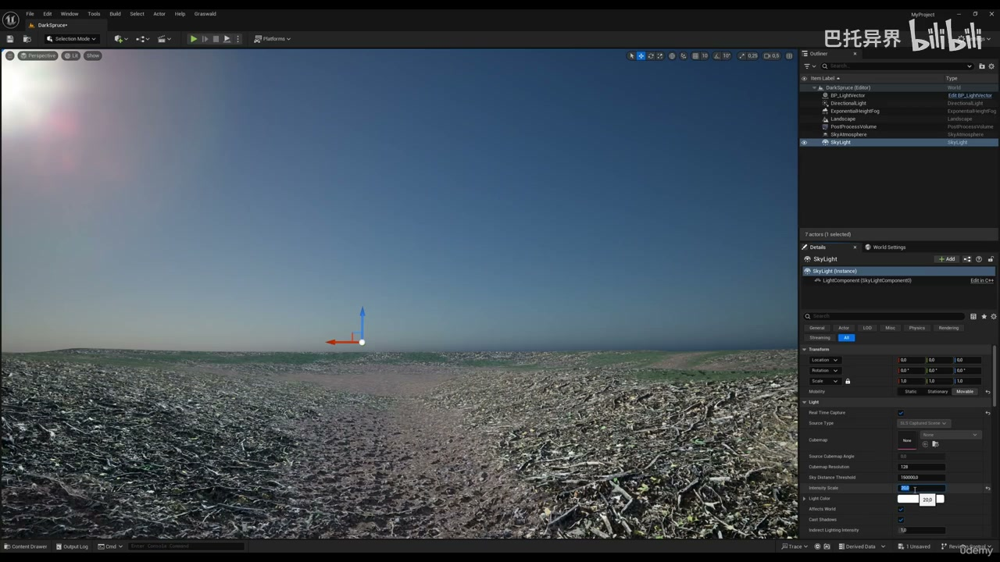

### 00:25:51-00:28:45 Spline 采样与路径生成

- 本段定位：Spline 采样与路径生成。
- 知识点：基础阶段就分配并命名材质槽，保证枝条、针叶或树皮在复制、导入 UE 和材质替换时保持稳定归类。
- 知识点：导入 UE 前检查 pivot、命名、法线、材质和 Nanite/实例化策略，保证高密度树木在场景中可管理且可重复使用。
- 知识点：Spline 输入通常先采样为点，再用属性、距离或索引区分路段、端点、交叉点和曲线段。
- 复现要点：Static Mesh Spawner 用于高效实例化；Spawn Actor/Blueprint 用于需要逻辑的对象，成本和生命周期不同。
- 复现要点：Spline 流程要单独核对采样间距、切线、端点、交叉点和生成网格的对齐方式。
- 核对对象：`Spline`、`Static Mesh`、`Spline Mesh`、`Material`、`采样`、`生成`。

**关键画面：**

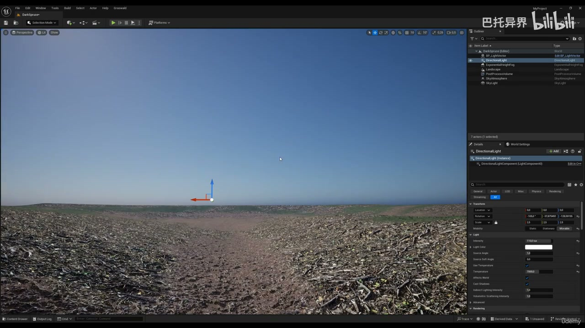
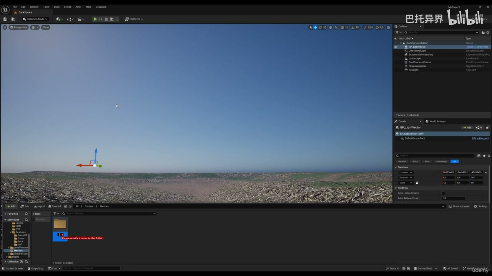

### 00:28:49-00:31:51 Spline 采样与路径生成

- 本段定位：Spline 采样与路径生成。
- 知识点：通过曲线或弯曲变形控制枝条走势，先检查对象变换和拓扑，再调整弯曲强度，避免卡片被拉伸或扭曲。
- 知识点：Spline 输入通常先采样为点，再用属性、距离或索引区分路段、端点、交叉点和曲线段。
- 复现要点：Spline 流程要单独核对采样间距、切线、端点、交叉点和生成网格的对齐方式。
- 核对对象：`Spline`、`采样`、`生成`。

**关键画面：**

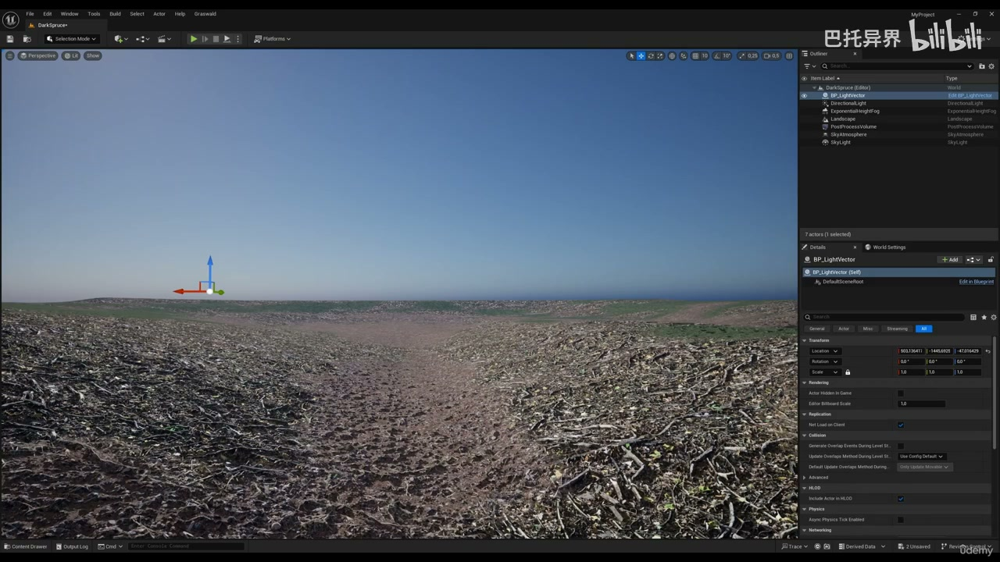
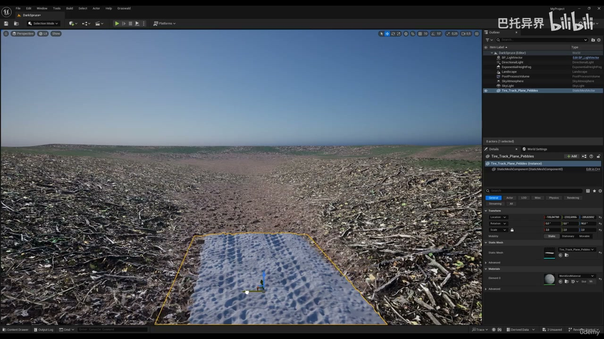

### 00:31:54-00:35:02 Spline 采样与路径生成

- 本段定位：Spline 采样与路径生成。
- 知识点：基础阶段就分配并命名材质槽，保证枝条、针叶或树皮在复制、导入 UE 和材质替换时保持稳定归类。
- 知识点：Spline 输入通常先采样为点，再用属性、距离或索引区分路段、端点、交叉点和曲线段。
- 复现要点：Spline 流程要单独核对采样间距、切线、端点、交叉点和生成网格的对齐方式。
- 核对对象：`Spline`、`Material`、`采样`、`生成`。

**关键画面：**

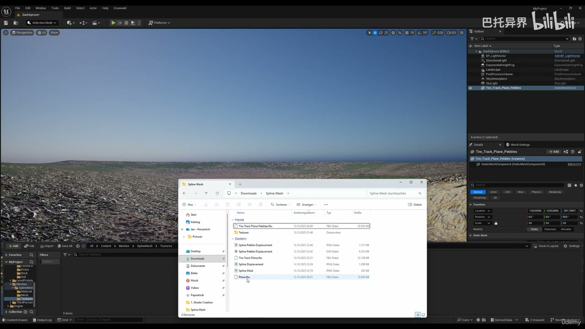
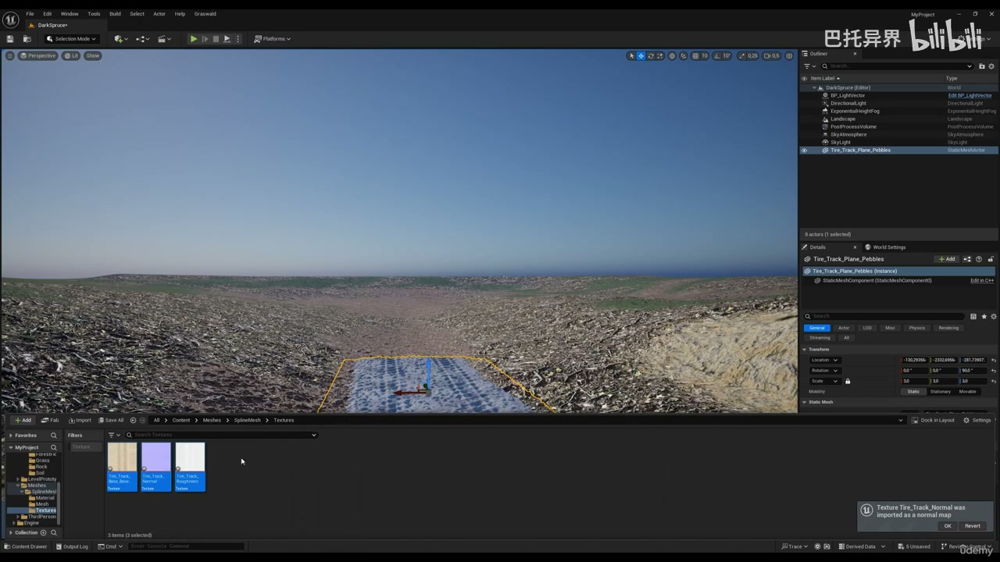

### 00:35:04-00:38:02 Spline 采样与路径生成

- 本段定位：Spline 采样与路径生成。
- 知识点：基础阶段就分配并命名材质槽，保证枝条、针叶或树皮在复制、导入 UE 和材质替换时保持稳定归类。
- 知识点：Spline 输入通常先采样为点，再用属性、距离或索引区分路段、端点、交叉点和曲线段。
- 复现要点：Spline 流程要单独核对采样间距、切线、端点、交叉点和生成网格的对齐方式。
- 核对对象：`Spline`、`Material`、`采样`、`生成`。

**关键画面：**

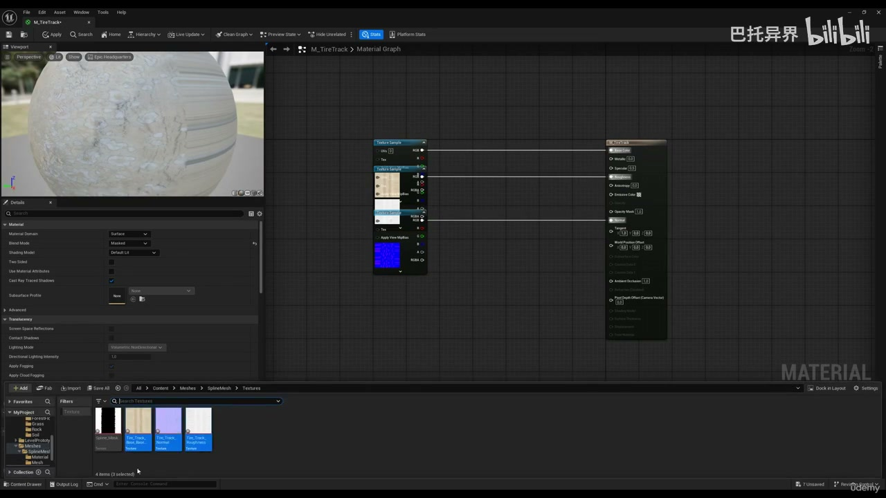
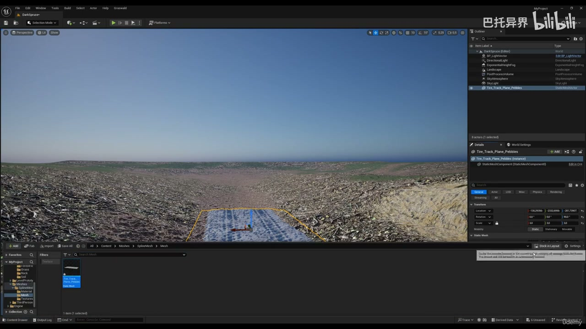

### 00:38:07-00:41:07 点数据、Bounds 与采样来源

- 本段定位：点数据、Bounds 与采样来源。
- 知识点：基础阶段就分配并命名材质槽，保证枝条、针叶或树皮在复制、导入 UE 和材质替换时保持稳定归类。
- 知识点：通过曲线或弯曲变形控制枝条走势，先检查对象变换和拓扑，再调整弯曲强度，避免卡片被拉伸或扭曲。
- 知识点：PCG 流程要按点数据、属性写入、过滤条件和 Spawner 输出四步核对，避免只看最终实例而漏掉中间点状态。
- 知识点：Spline 输入通常先采样为点，再用距离、切线或标签过滤道路范围内外的生成点。
- 知识点：用 Actor Tag 或 Spline 作为外部输入时，应先确认标签命中对象，再检查过滤后的点集。
- 复现要点：先用 Debug/Inspect 核对点数量、Bounds、Density 和关键属性，再判断最终生成结果。
- 核对对象：`Point`、`Bounds`、`Material`、`Instance`、`点`、`点数据`、`采样`。

**关键画面：**

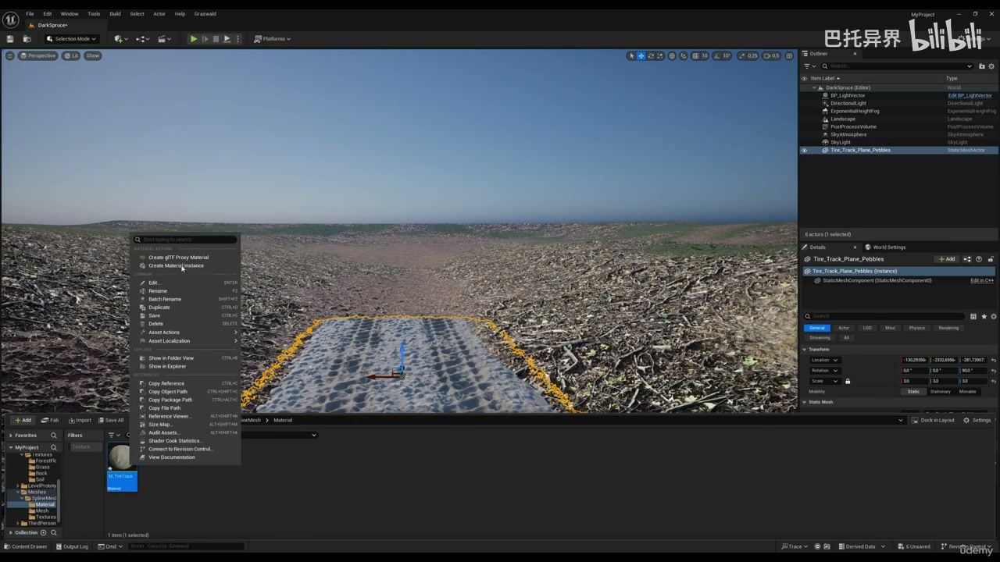
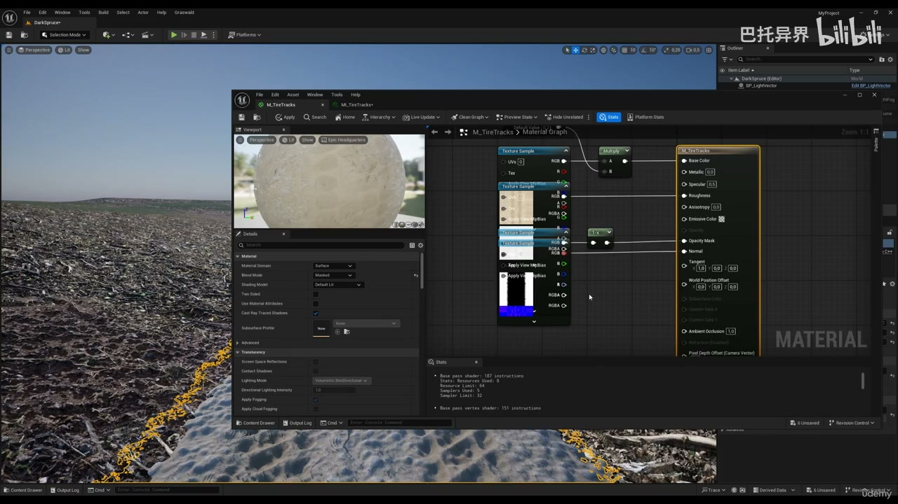

### 00:41:08-00:44:03 Spline 采样与路径生成

- 本段定位：Spline 采样与路径生成。
- 知识点：缩放、旋转、倒角或弯曲前后使用 `Ctrl+A > Apply All Transforms` 归一化对象变换，避免非统一缩放影响倒角、弯曲和法线。
- 知识点：导入 UE 前检查 pivot、命名、法线、材质和 Nanite/实例化策略，保证高密度树木在场景中可管理且可重复使用。
- 知识点：Spline 输入通常先采样为点，再用距离、切线或标签过滤道路范围内外的生成点。
- 知识点：用 Actor Tag 或 Spline 作为外部输入时，应先确认标签命中对象，再检查过滤后的点集。
- 核对对象：`PCG`、`生成`。

**关键画面：**

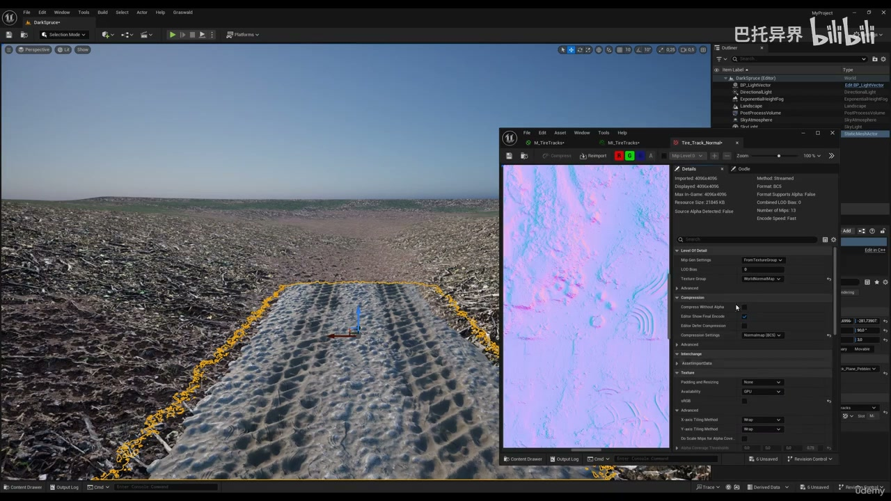
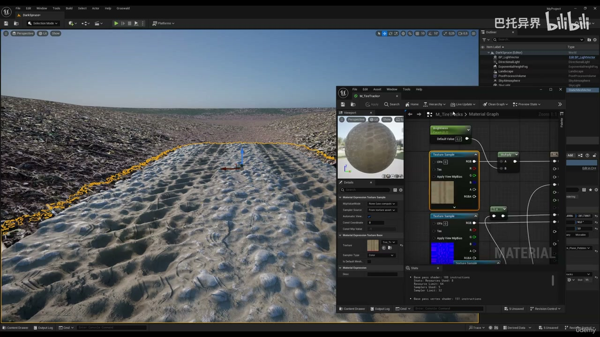

### 00:44:15-00:46:14 Spline 采样与路径生成

- 本段定位：Spline 采样与路径生成。
- 知识点：基础阶段就分配并命名材质槽，保证枝条、针叶或树皮在复制、导入 UE 和材质替换时保持稳定归类。
- 知识点：Spline 输入通常先采样为点，再用距离、切线或标签过滤道路范围内外的生成点。
- 知识点：用 Actor Tag 或 Spline 作为外部输入时，应先确认标签命中对象，再检查过滤后的点集。
- 核对对象：`PCG`、`Material`、`Instance`、`生成`。

**关键画面：**

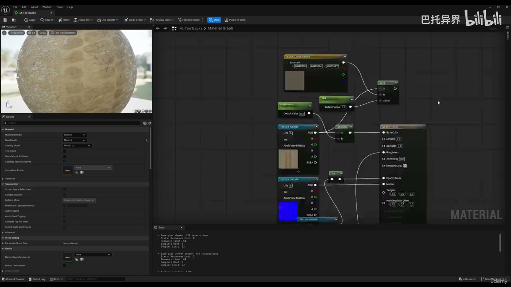
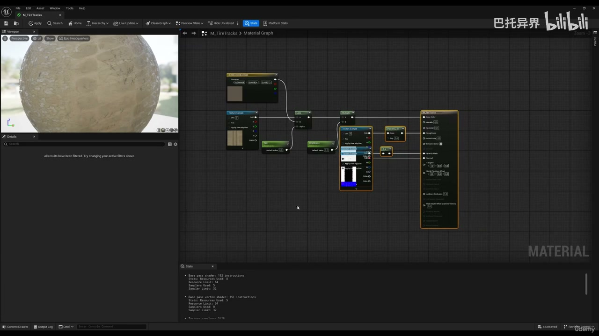

### 00:47:13-00:49:20 Spline 采样与路径生成

- 本段定位：Spline 采样与路径生成。
- 知识点：基础阶段就分配并命名材质槽，保证枝条、针叶或树皮在复制、导入 UE 和材质替换时保持稳定归类。
- 知识点：通过曲线或弯曲变形控制枝条走势，先检查对象变换和拓扑，再调整弯曲强度，避免卡片被拉伸或扭曲。
- 知识点：Spline 输入通常先采样为点，再用属性、距离或索引区分路段、端点、交叉点和曲线段。
- 复现要点：Spline 流程要单独核对采样间距、切线、端点、交叉点和生成网格的对齐方式。
- 核对对象：`Spline`、`Spline Mesh`、`Material`、`采样`、`生成`。

**关键画面：**

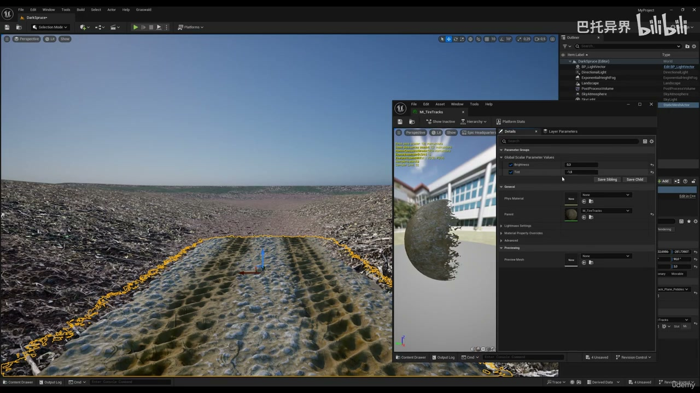
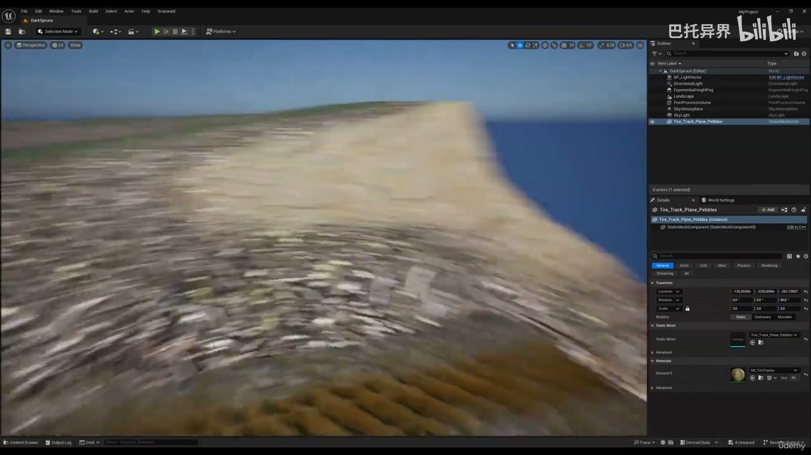

## 复现检查

- 每个图表先检查输入数据是否正确进入 PCG Graph，再看下游生成结果。
- Debug/Inspect 时重点看点数量、Bounds、Density、Transform、Seed 和自定义 Attribute。
- Static Mesh Spawner、Spawn Actor、Spline Mesh 和 Blueprint 输出节点不能混用语义；选择前先确定是否需要实例化性能或蓝图逻辑。
- 涉及样条、分区、运行时或 GPU 生成时，必须额外验证更新触发、缓存、世界分区和性能预算。
