# 【UE5】1.5小时超干！初学者教程！程序生成PCG创建一个村庄

## 知识目标

- 围绕“【UE5】1.5小时超干！初学者教程！程序生成PCG创建一个村庄”整理一套 UE5 初学者向 PCG 小村庄生成流程：先用 Landscape、PCG Volume、Surface Sampler 和 Static Mesh Spawner 建立森林基础，再用 Blueprint Spline 定义村庄范围，生成教堂、房屋、墓地、草、干草和围栏，并处理地形投射、夜间灯光、火焰、后处理和围栏附近植被。

## 可复现主流程

- 新建 Blueprint 游戏项目，启用 Procedural Content Generation Framework 插件并重启编辑器，确保 PCG 节点和图表类型可用。
- 创建 Open World/World Partition 场景与 Landscape，加载工作区域，保存关卡并建立项目资源目录。
- 创建森林 PCG 图表，使用 Landscape Data、Surface Sampler 和 PCG Volume 生成初始点云，先用 Debug 验证点只出现在目标区域。
- 接入 Static Mesh Spawner，添加树木 mesh entry，再通过 Density Filter 控制森林密度，避免一开始就生成过密实例。
- 使用 Transform Points 为树木加入随机旋转、缩放和偏移，打破同一模型、同一尺寸、同一朝向的重复感。
- 加入第三人称角色或玩家视角，检查 PCG 结果从实际游玩高度看是否成立，而不是只看编辑器俯视角。
- 创建 Village Spline Blueprint，用 spline 定义村庄边界，并给蓝图添加 PCG Component，绑定新建的 `PCG Village` 图表。
- 在村庄图表中读取 spline 数据，调整 interior sample spacing 和 border sample spacing，让村庄候选点数量适合房屋尺度。
- 使用 Difference 从森林点中减去村庄 spline 区域，清理村庄内部树木，让村庄生成空间和森林空间互斥。
- 用 Density Filter、Combine Points、Bounds Modifier 和 Spawn Actor 生成教堂这类中心建筑，并用 Bounds 控制建筑占用面积。
- 为房屋建立多个密度区间，按不同 lower/upper bound 分配不同房屋蓝图，避免多个建筑生成在同一位置。
- 用同样的密度过滤方式预留墓地区域，结合 Static Mesh Spawner 或 Spawn Actor 放置墓碑、墓地道具和中心装饰。
- 使用 Copy Points、Create Points Grid、Transform Points 和 Projection 在墓地局部生成规则点阵，作为墓碑和细节的摆放基础。
- 为墓地中心物件单独过滤点，加入 Density Noise 和 Density Filter，生成 ritual/centerpiece 一类焦点资产。
- 添加草、树叶、干草等地面细节；这类装饰物应设为 Static Mobility、No Collision，避免影响玩家移动和物理。
- 批量配置草、树叶、干草 mesh entry 的 scale、collision 和 mobility，保持不同地面装饰的视觉比例一致。
- 当地形被雕刻或抬高后，强制重新生成森林图表；必要时在 Landscape Data 中使用 Get Height Only，确保树木贴合新地形。
- 修正村庄与森林的扣除关系：增大 spline 的 Bounds Modifier，把村庄边缘、房屋和墓地都纳入 Difference 范围，避免树木穿入村庄。
- 因为村庄点来自 spline 而不是 Landscape，需在 Transform 后加入 Projection，把房屋、墓碑和装饰投射回地形表面。
- 用 Landscape Sculpt/Paint 修整村庄地形和地表材质，平整房屋区域，给道路、泥土和草地分层上色。
- 进入夜间氛围制作，调整 Directional Light、Sky/环境光和 Lumen 结果，并给房屋蓝图添加 Point Light。
- 降低房屋灯光强度，让湿润地面和建筑反射不过曝；在墓地区域加入火焰粒子，提高焦点可读性。
- 调 Post Process Volume、Exponential Height Fog、Fog Density、Falloff 和 Start Distance，形成黑暗但可读的村庄氛围。
- 制作或解释围栏 spline 工具：根据 fence mesh bounding box 计算间距，用 spline length / mesh spacing 得到实例数量，再沿 spline 逐个放置。
- 把围栏 spline 数据接回 PCG 图表，可通过 Actor Tag 或指定 Blueprint 工具读取 fence spline，并用它生成围栏附近的植被。
- 用 fence spline 采样点接 Static Mesh Spawner，生成围栏附近的 tall grass，使围栏和村庄地表更自然地融合。
- 最后检查整体村庄：森林不穿入村庄、建筑不重叠、墓地和围栏点贴地、灯光不过曝、地形材质和植被密度符合玩家视角。

## 关键术语

- `PCG`
- `Blueprint`
- `蓝图`
- `Static Mesh`
- `Mesh`
- `Spline`
- `Transform`
- `Point`
- `Attribute`
- `Actor`
- `Component`
- `Spawn`
- `Grid`
- `Bounds`
- `Density`
- `Random`
- `Loop`
- `Graph`

## 操作步骤与要点

### 新建 Blueprint 游戏项目，启用 Procedural Content Generation Framework 插件并重启编辑器，确保 PCG 节点和图表类型可用

**内容要点：**

- 本段说明教程目标：不是只用 PCG 做森林，而是把 PCG 基础扩展到一个小村庄。流程从创建 Blueprint 游戏项目开始，启用 Procedural Content Generation Framework 插件，重启编辑器，并创建开放世界场景，为后续 Landscape 和 PCG 图表做准备。

**关键截图：**

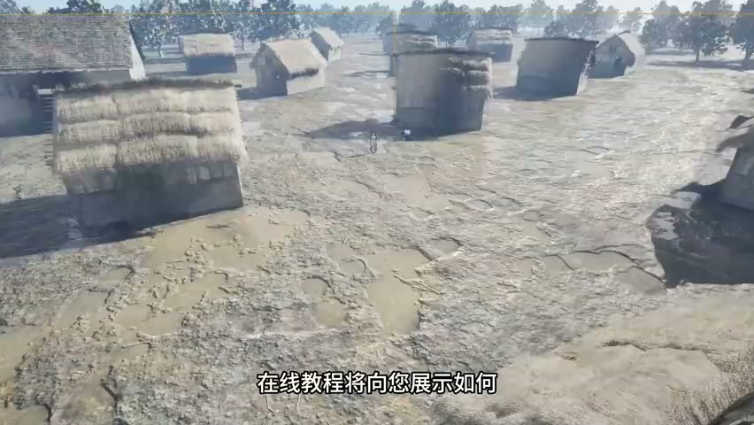
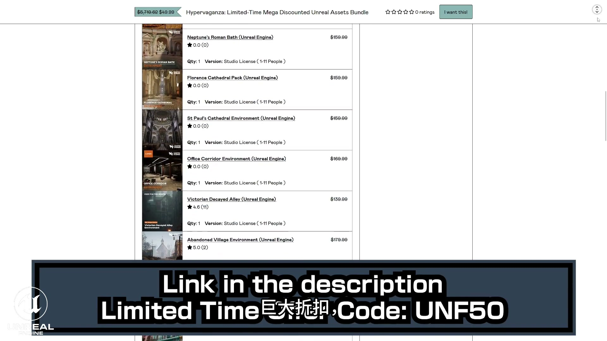

**参数、节点和风险点：**

- `PCG`
- `Blueprint`
- `Content`
- `License`
- `Unreal`
- `project`
- `folder`
- `content`
- `Studio`
- `tutorial`

### 创建 Open World/World Partition 场景与 Landscape，加载工作区域，保存关卡并建立项目资源目录

**内容要点：**

- 本段创建村庄所在 Landscape，并处理 World Partition 的加载区域。作者提醒 no loaded regions 表示当前区域未加载，需要右键从选择区域加载，避免重新打开关卡后场景为空。随后保存关卡、建立资源文件夹，并准备在 Landscape 上放置 PCG Volume。

**关键截图：**

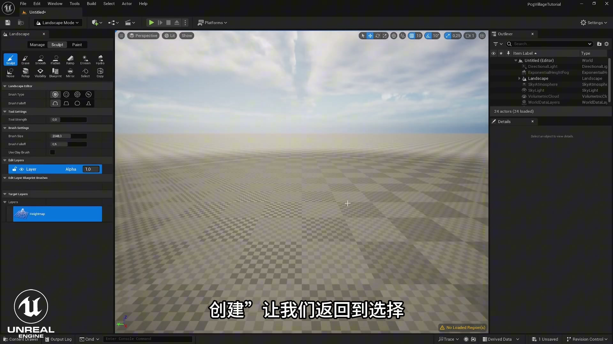
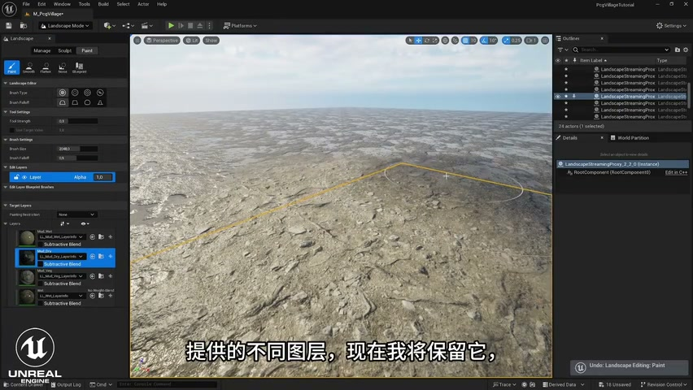

**参数、节点和风险点：**

- `PCG`
- `Point`
- `Spawn`
- `Graph`
- `Material`
- `Landscape`
- `landscape`
- `data`
- `level`
- `open`

### 创建森林 PCG 图表，使用 Landscape Data、Surface Sampler 和 PCG Volume 生成初始点云，先用 Debug 验证点只出现在目标区域

**内容要点：**

- 本段建立森林 PCG 基础：在 PCG 图表里用 Surface Sampler 从 Landscape 生成点，按 D 调试点云，再用 Static Mesh Spawner 指定树木 Static Mesh。随后加入 Density Filter，把点密度控制到可接受范围，形成第一版森林。

**关键截图：**

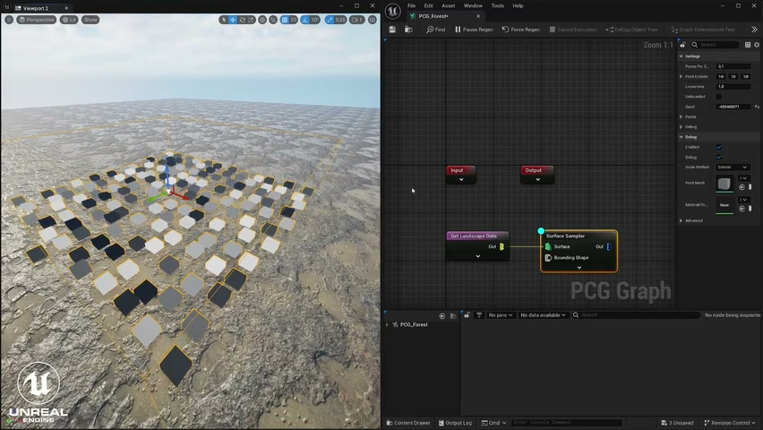
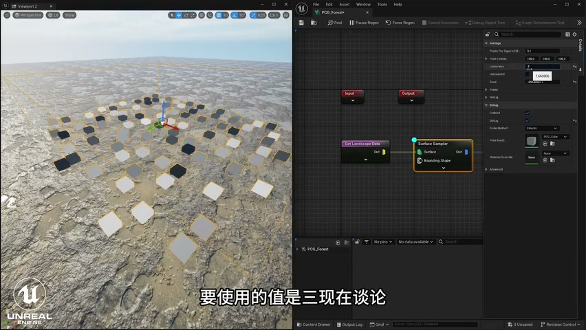

**参数、节点和风险点：**

- `PCG`
- `Static Mesh`
- `Mesh`
- `Point`
- `Spawn`
- `Density`
- `Graph`
- `Landscape`
- `points`
- `density`

### 接入 Static Mesh Spawner，添加树木 mesh entry，再通过 Density Filter 控制森林密度，避免一开始就生成过密实例

**内容要点：**

- 本段通过 Transform Points 打破树木重复：给树木加入 Z 轴 360 度随机旋转，并设置随机缩放范围。这里解决的是所有树都同尺寸、同朝向的问题，也是 PCG 场景自然感的第一层。

**关键截图：**

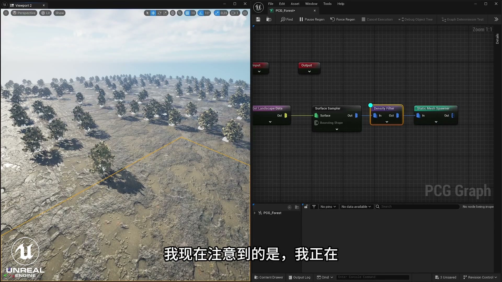
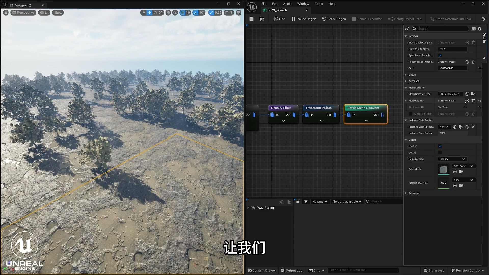

**参数、节点和风险点：**

- `PCG`
- `Static Mesh`
- `Mesh`
- `Transform`
- `Point`
- `Spawn`
- `Density`
- `Random`
- `Graph`
- `Landscape`

### 使用 Transform Points 为树木加入随机旋转、缩放和偏移，打破同一模型、同一尺寸、同一朝向的重复感

**内容要点：**

- 本段添加第三人称角色，从玩家视角检查森林密度和尺度。随后进入村庄规划：因为村庄区域不能被森林占据，所以用 Blueprint Spline 定义村庄范围，并准备将该 spline 作为 PCG 村庄图表的数据来源。

**关键截图：**

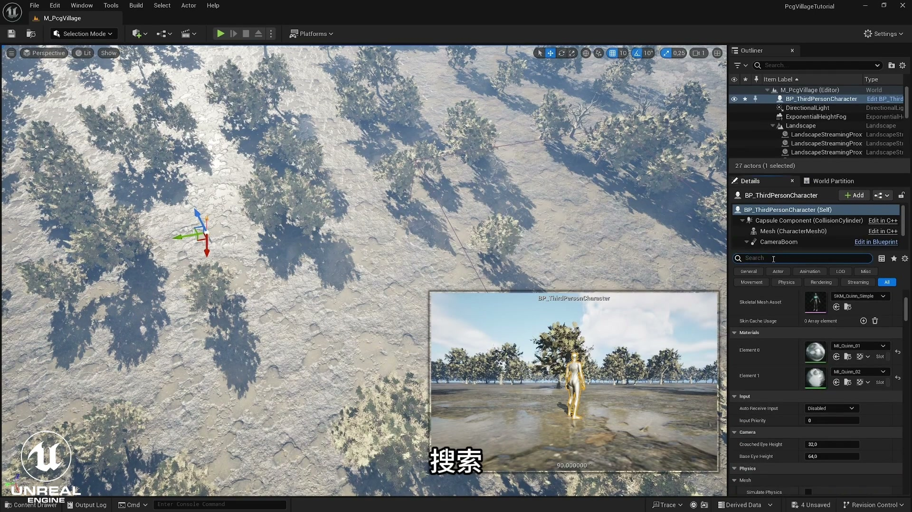
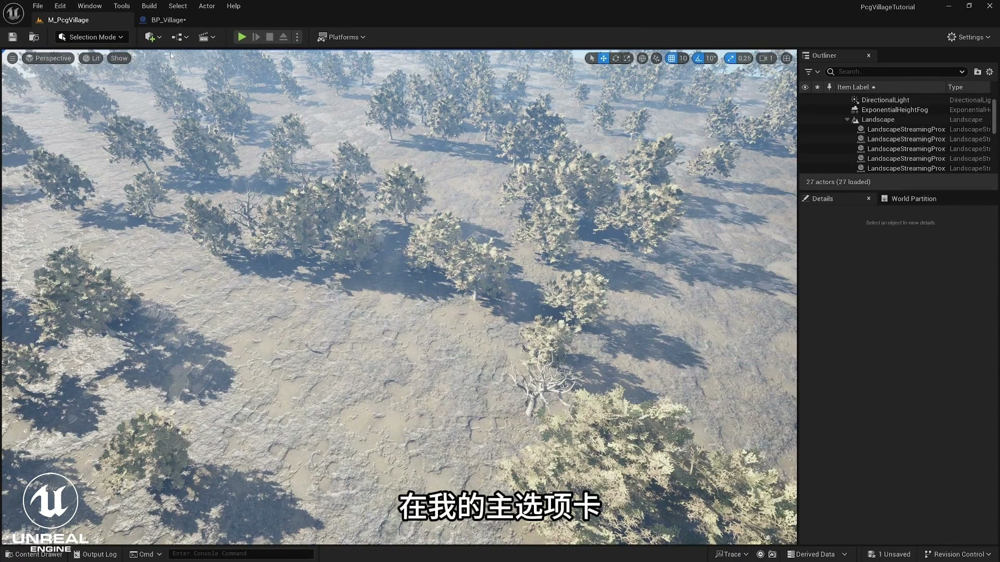

**参数、节点和风险点：**

- `PCG`
- `Blueprint`
- `Mesh`
- `Spline`
- `Point`
- `Actor`
- `Spawn`
- `Loop`
- `village`
- `spline`

### 加入第三人称角色或玩家视角，检查 PCG 结果从实际游玩高度看是否成立，而不是只看编辑器俯视角

**内容要点：**

- 本段创建 Village Space 蓝图并添加 PCG Component，绑定新建的 `PCG Village` 图表。将蓝图拖入关卡后，作者调整 spline 点和区域大小，形成村庄候选空间。

**关键截图：**

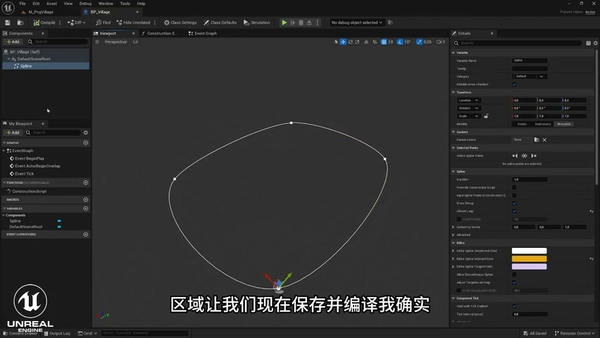
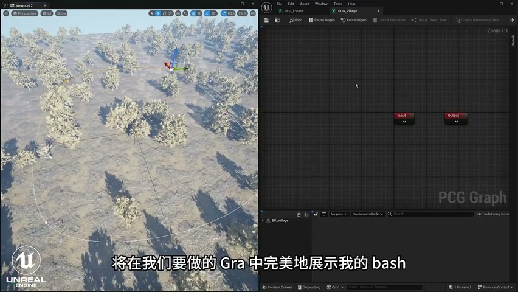

**参数、节点和风险点：**

- `PCG`
- `Blueprint`
- `Spline`
- `Point`
- `Component`
- `Spawn`
- `Graph`
- `spline`
- `points`
- `graph`

### 创建 Village Spline Blueprint，用 spline 定义村庄边界，并给蓝图添加 PCG Component，绑定新建的 `PCG Village` 图表

**内容要点：**

- 本段在村庄图表中读取 spline 数据，并调整 interior sample spacing 和 border sample spacing。采样间距从默认密集点变成适合房屋尺度的稀疏点，避免房屋互相挤在一起。

**关键截图：**

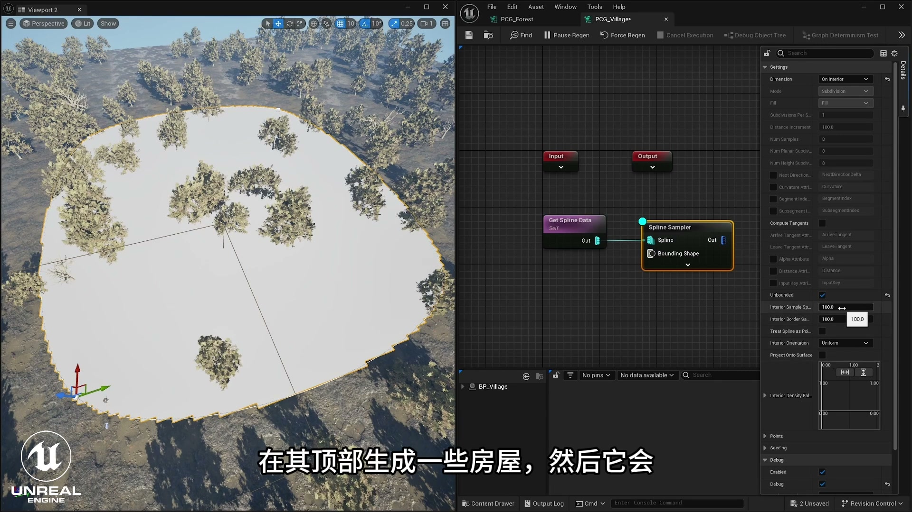
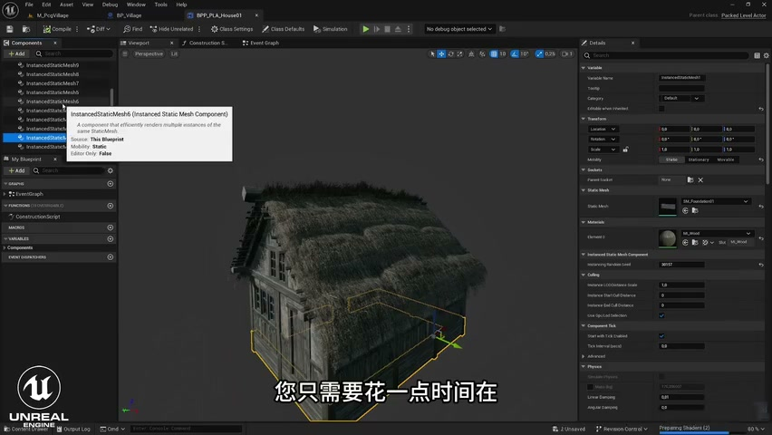

**参数、节点和风险点：**

- `PCG`
- `Blueprint`
- `Static Mesh`
- `Mesh`
- `Spline`
- `Point`
- `Actor`
- `Component`
- `Spawn`
- `Bounds`

### 在村庄图表中读取 spline 数据，调整 interior sample spacing 和 border sample spacing，让村庄候选点数量适合房屋尺度

**内容要点：**

- 本段用 Difference 节点让森林避开村庄：source 使用原森林点，difference 使用村庄区域点，把村庄内部树木删掉。这样村庄空间变干净，后续建筑不会被树穿插。

**关键截图：**

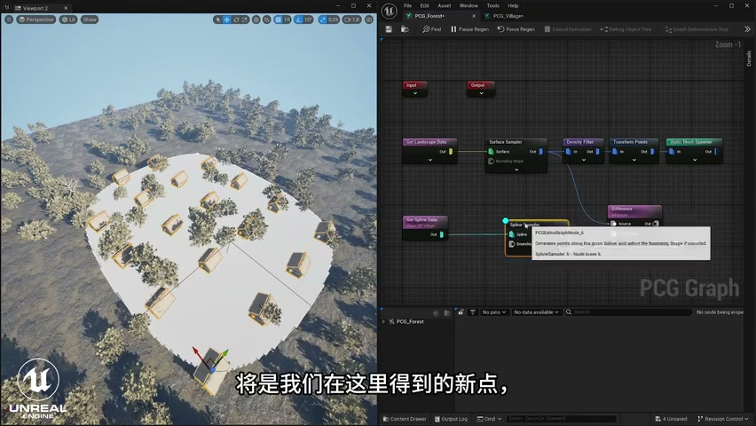
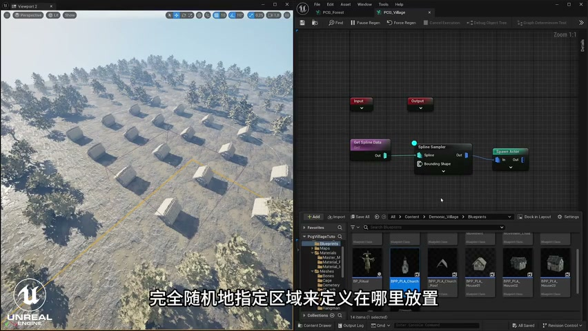

**参数、节点和风险点：**

- `PCG`
- `Mesh`
- `Spline`
- `Point`
- `Attribute`
- `Spawn`
- `Density`
- `Random`
- `Graph`
- `density`

### 使用 Difference 从森林点中减去村庄 spline 区域，清理村庄内部树木，让村庄生成空间和森林空间互斥

**内容要点：**

- 本段生成教堂。作者用 Density Filter 选出少量点，再用 Combine Points 合并成一个中心点，接 Spawn Actor 并选择 church 蓝图。Combine Points 可移动生成位置，用来把教堂放在村庄焦点处。

**关键截图：**

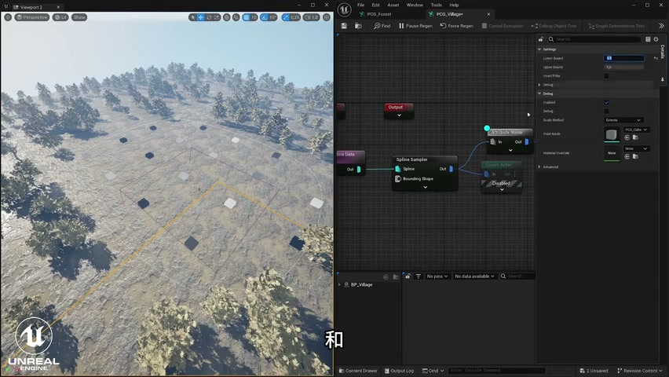
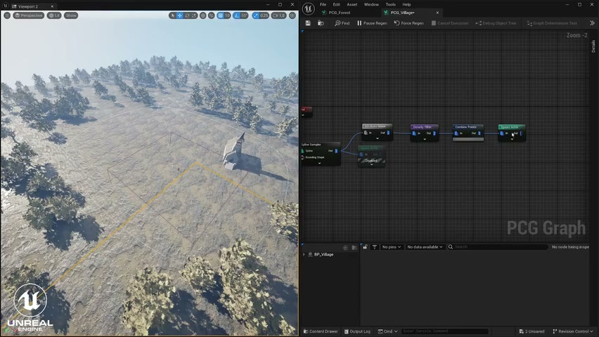

**参数、节点和风险点：**

- `PCG`
- `Mesh`
- `Transform`
- `Point`
- `Actor`
- `Spawn`
- `Random`
- `Graph`
- `points`
- `actor`

### 用 Density Filter、Combine Points、Bounds Modifier 和 Spawn Actor 生成教堂这类中心建筑，并用 Bounds 控制建筑占用面积

**内容要点：**

- 本段修正 Combine Points 的占用范围：合并点的 bounds 可能过大，会覆盖整个村庄，因此加入 Bounds Modifier 缩小到 0.4。随后复制同样的过滤/合并逻辑，准备给其他建筑分配点。

**关键截图：**

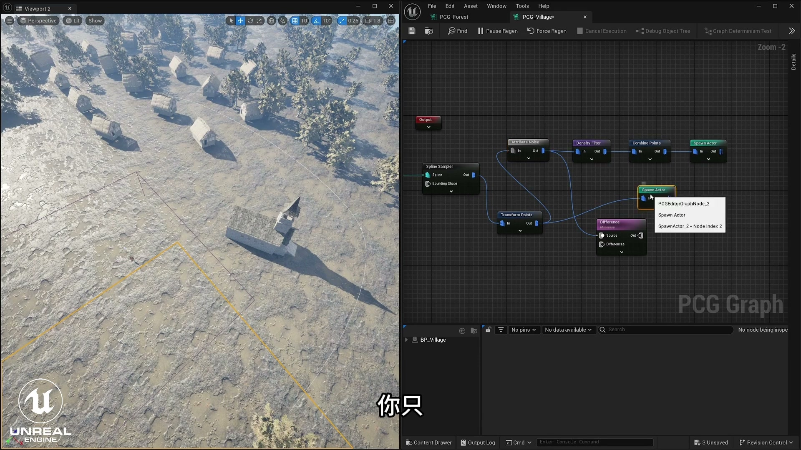
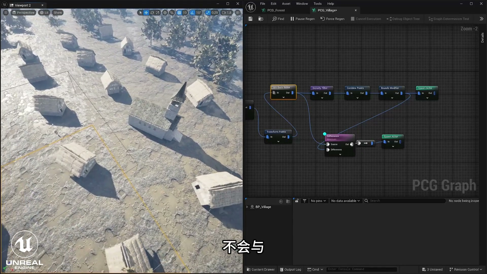

**参数、节点和风险点：**

- `PCG`
- `Point`
- `Attribute`
- `Actor`
- `Spawn`
- `Density`
- `Graph`
- `points`
- `point`
- `filter`

### 为房屋建立多个密度区间，按不同 lower/upper bound 分配不同房屋蓝图，避免多个建筑生成在同一位置

**内容要点：**

- 本段用不同 Density Filter 区间生成多类房屋。通过互斥的 lower/upper bound，确保不同房屋蓝图使用不同点，避免多个建筑重叠在同一个位置。

**关键截图：**

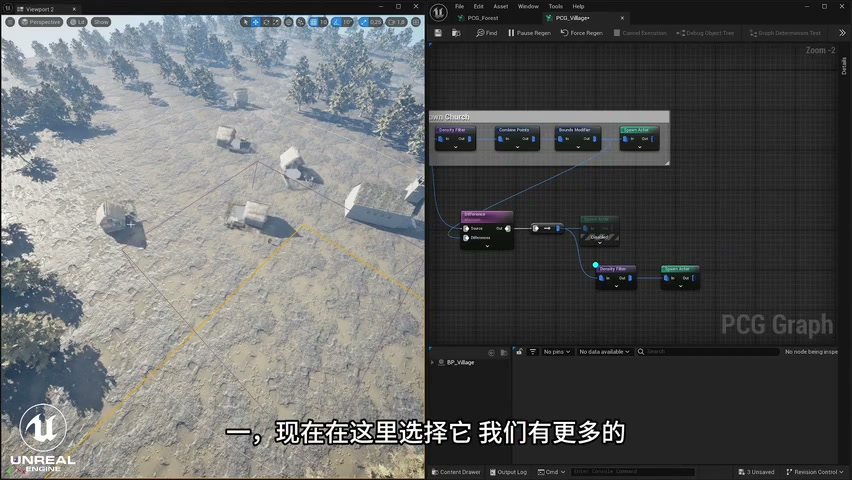
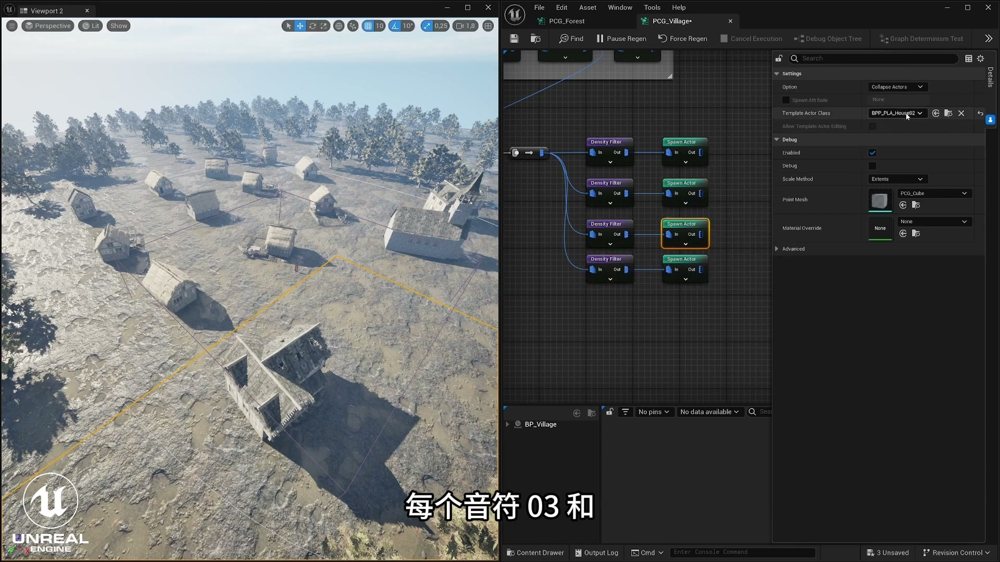

**参数、节点和风险点：**

- `PCG`
- `Mesh`
- `Transform`
- `Point`
- `Actor`
- `Spawn`
- `Density`
- `Graph`
- `zero`
- `point`

### 用同样的密度过滤方式预留墓地区域，结合 Static Mesh Spawner 或 Spawn Actor 放置墓碑、墓地道具和中心装饰

**内容要点：**

- 本段开始做墓地。作者先调整村庄内各建筑 bounds，给墓地预留空间，然后复制教堂式过滤链路，使用 0 到 0.1 的密度区间选出墓地点，并准备生成墓碑或墓地物件。

**关键截图：**

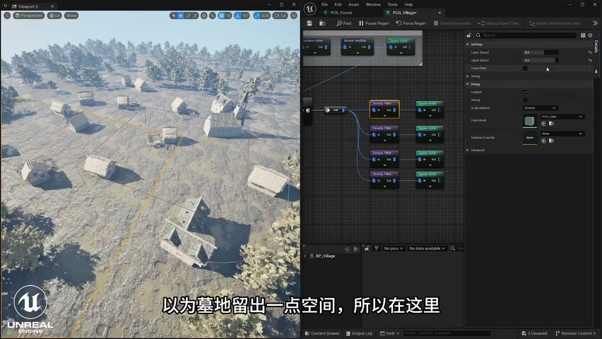
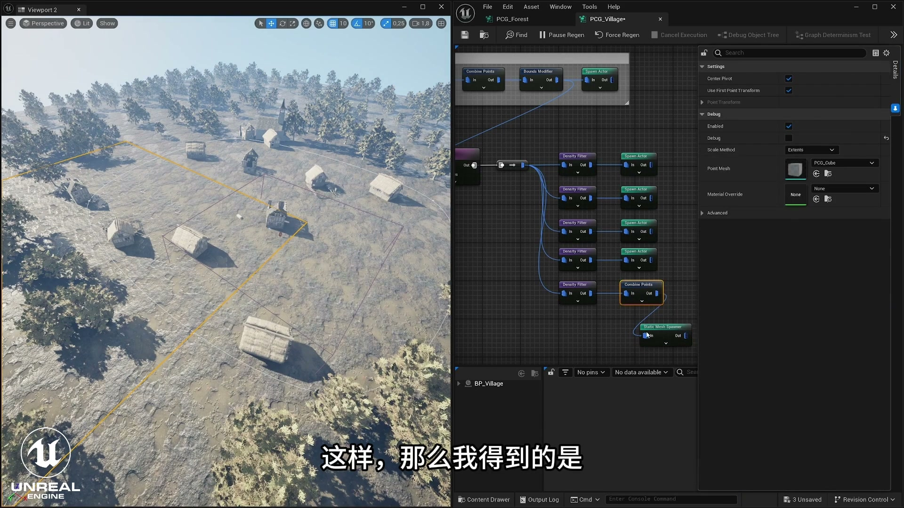

**参数、节点和风险点：**

- `PCG`
- `Blueprint`
- `Static Mesh`
- `Mesh`
- `Transform`
- `Point`
- `Spawn`
- `Grid`
- `Bounds`
- `Density`

### 使用 Copy Points、Create Points Grid、Transform Points 和 Projection 在墓地局部生成规则点阵，作为墓碑和细节的摆放基础

**内容要点：**

- 本段为墓地创建规则点阵：用 Copy Points、Create Points Grid、Transform Points 等节点，把墓地区域中的一个点扩展成多个规则点，再用这些点驱动墓碑和细节摆放。

**关键截图：**

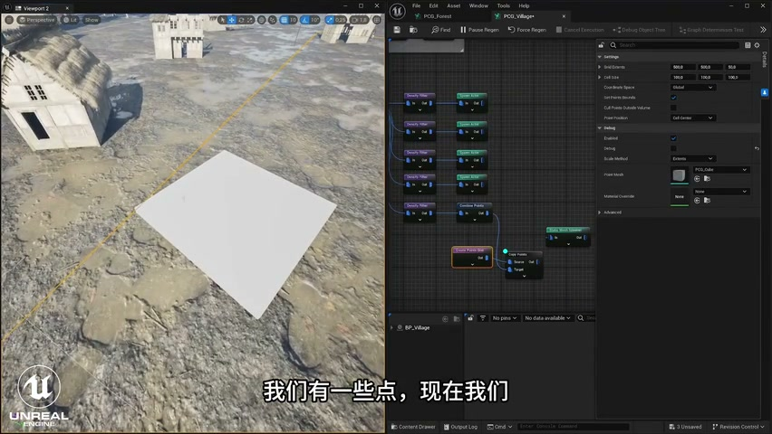
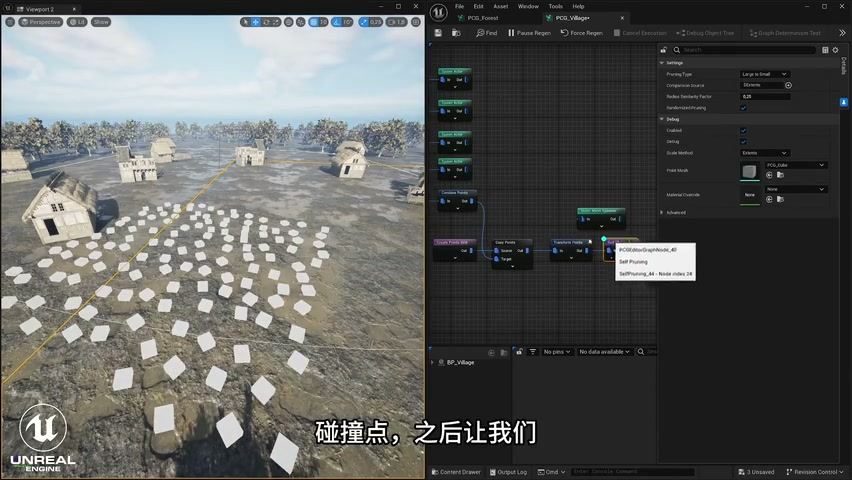

**参数、节点和风险点：**

- `PCG`
- `Static Mesh`
- `Mesh`
- `Transform`
- `Point`
- `Actor`
- `Spawn`
- `Grid`
- `points`
- `change`

### 为墓地中心物件单独过滤点，加入 Density Noise 和 Density Filter，生成 ritual/centerpiece 一类焦点资产

**内容要点：**

- 本段添加墓地中心物件。通过 Density Noise 和 Density Filter 再次筛点，分离出仪式物件或中心装饰类焦点蓝图，使墓地不只是重复墓碑，而有明确的视觉中心。

**关键截图：**

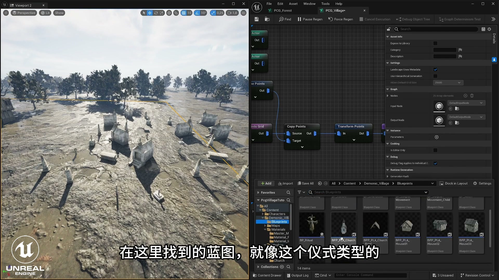
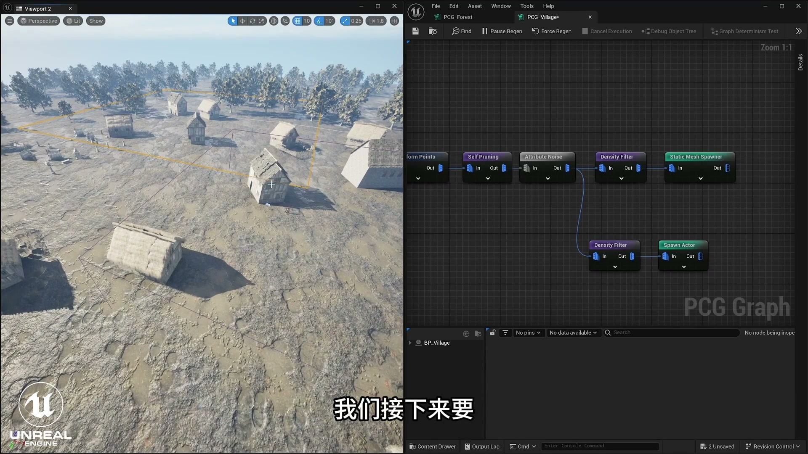

**参数、节点和风险点：**

- `PCG`
- `Blueprint`
- `蓝图`
- `Static Mesh`
- `Mesh`
- `Transform`
- `Point`
- `Attribute`
- `Actor`
- `Spawn`

### 添加草、树叶、干草等地面细节；这类装饰物应设为 Static Mobility、No Collision，避免影响玩家移动和物理

**内容要点：**

- 本段添加草、树叶和地面装饰。作者强调这类装饰物应设为 Static Mobility，并关闭碰撞，因为它们只是视觉细节，不应该阻挡玩家或产生额外物理负担。

**关键截图：**

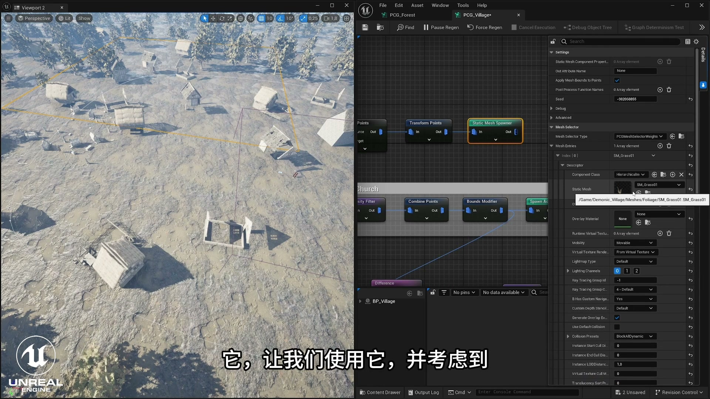
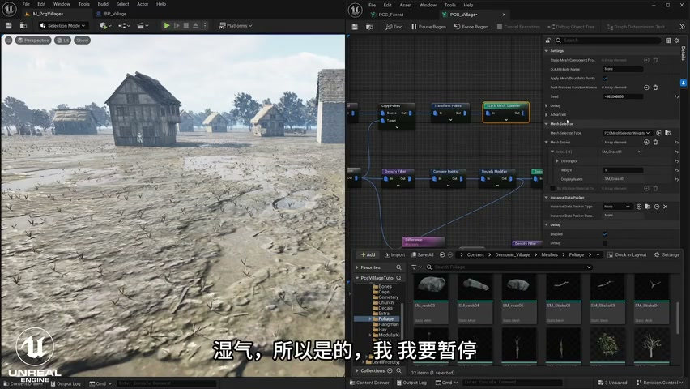

**参数、节点和风险点：**

- `PCG`
- `Static Mesh`
- `Mesh`
- `Spawn`
- `Graph`
- `some`
- `grass`
- `tall`
- `wheat`

### 批量配置草、树叶、干草 mesh entry 的 scale、collision 和 mobility，保持不同地面装饰的视觉比例一致

**内容要点：**

- 本段继续配置草和干草 mesh entry。由于每个条目都要设置 scale、collision 和 mobility，作者展示批量复制参数的做法，并加入 hay 作为额外地面装饰。

**关键截图：**

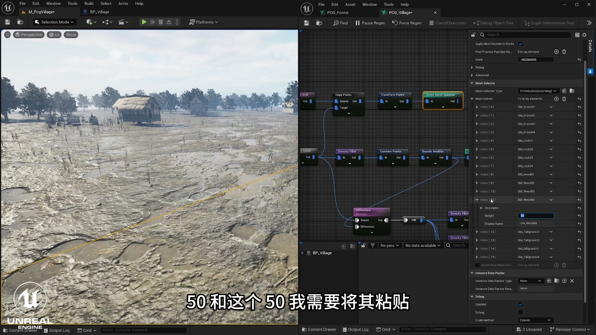
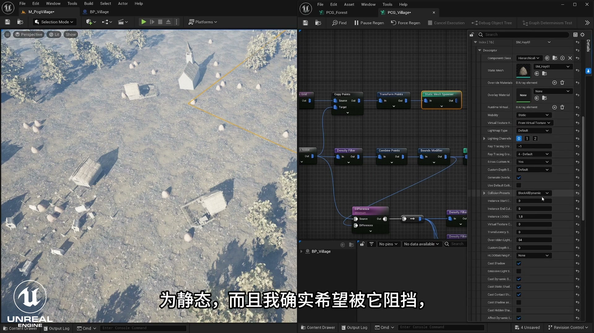

**参数、节点和风险点：**

- `PCG`
- `Static Mesh`
- `Mesh`
- `Spawn`
- `Landscape`
- `mean`
- `tall`
- `grass`
- `much`
- `good`

### 当地形被雕刻或抬高后，强制重新生成森林图表；必要时在 Landscape Data 中使用 Get Height Only，确保树木贴合新地形

**内容要点：**

- 本段处理地形变化导致的树木贴地问题。当地形被抬高后，森林树木可能被 terrain 覆盖或悬空，需要对森林图表强制 regenerate，并在 Landscape Data 中使用 Get Height Only，使树木重新投射到新地形高度。

**关键截图：**

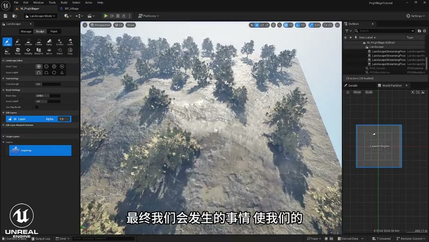
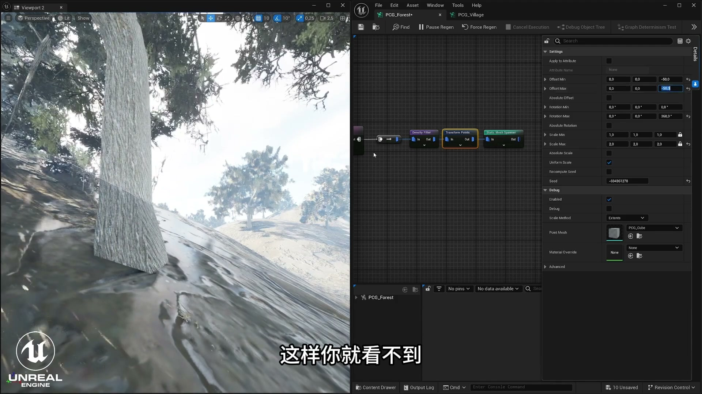

**参数、节点和风险点：**

- `PCG`
- `Mesh`
- `Transform`
- `Point`
- `Actor`
- `Graph`
- `Landscape`
- `some`
- `trees`
- `being`

### 修正村庄与森林的扣除关系：增大 spline 的 Bounds Modifier，把村庄边缘、房屋和墓地都纳入 Difference 范围，避免树木穿入村庄

**内容要点：**

- 本段修复森林和村庄的交界问题。由于 spline sampler 的 bounds 太小，Difference 不再正确扣除村庄边缘，导致树木进入房屋和墓地区域。作者用 Bounds Modifier 放大 spline bounds，再接回 Difference。

**关键截图：**

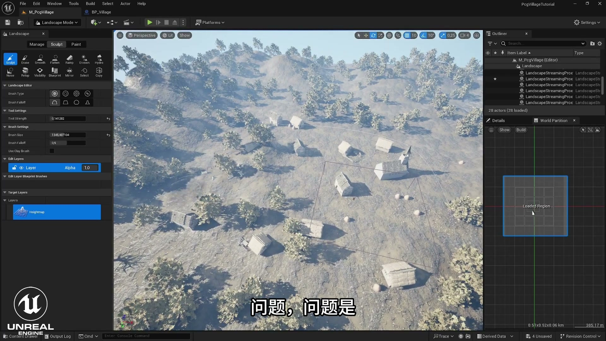
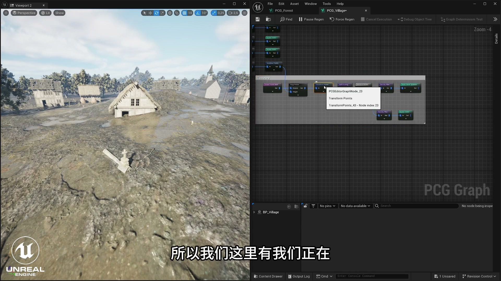

**参数、节点和风险点：**

- `PCG`
- `Spline`
- `Transform`
- `Point`
- `Bounds`
- `Graph`
- `Landscape`
- `cemetery`
- `points`
- `landscape`

### 因为村庄点来自 spline 而不是 Landscape，需在 Transform 后加入 Projection，把房屋、墓碑和装饰投射回地形表面

**内容要点：**

- 本段解决村庄点不贴地的问题。村庄点来自 spline data，不自带 Landscape 表面高度，所以在 Transform 后复制 Projection 节点，把房屋、墓碑和村庄物件投射回地形表面。

**关键截图：**

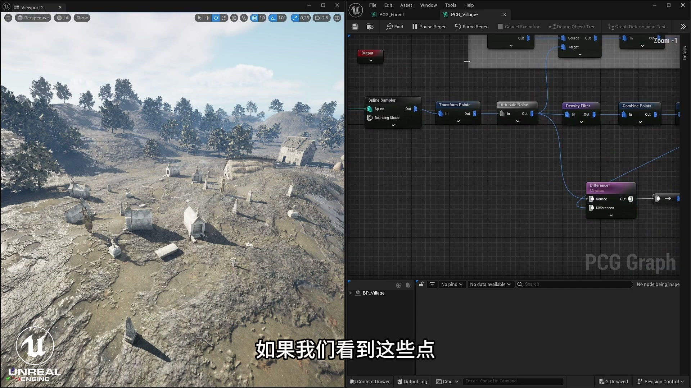
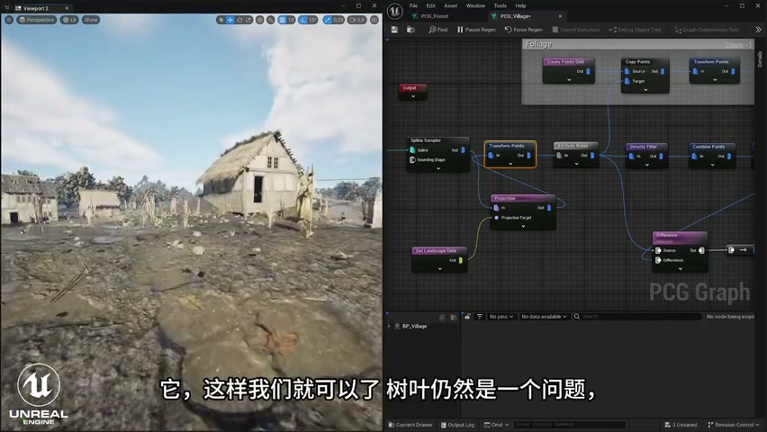

**参数、节点和风险点：**

- `PCG`
- `Mesh`
- `Spline`
- `Transform`
- `Point`
- `Graph`
- `Landscape`
- `transform`
- `points`
- `data`

### 用 Landscape Sculpt/Paint 修整村庄地形和地表材质，平整房屋区域，给道路、泥土和草地分层上色

**内容要点：**

- 本段用 Landscape Sculpt 和 Paint 修整地形与地表材质：平整房屋区域，刷出泥土/道路/草地层，让村庄不再像漂浮在默认地表上，而是嵌入 Landscape。

**关键截图：**

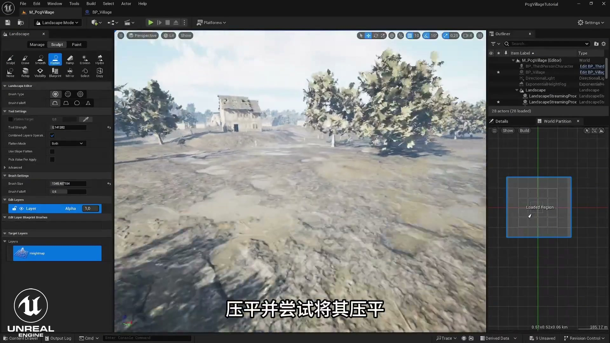
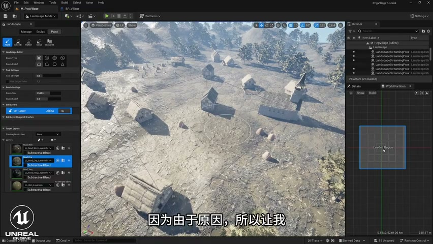

**参数、节点和风险点：**

- `PCG`
- `Random`
- `Material`
- `Landscape`
- `around`
- `landscape`
- `village`
- `control`
- `search`
- `flatten`

### 进入夜间氛围制作，调整 Directional Light、Sky/环境光和 Lumen 结果，并给房屋蓝图添加 Point Light

**内容要点：**

- 本段进入夜间灯光。作者把场景调暗，利用 Lumen 的全局照明效果，再给建筑蓝图添加 Point Light，让房屋窗口或室内区域发光，建立小村庄夜晚氛围。

**关键截图：**

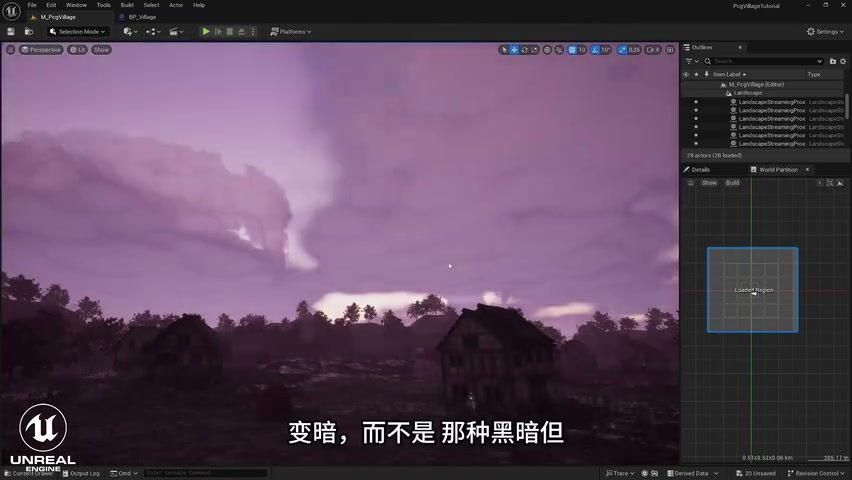
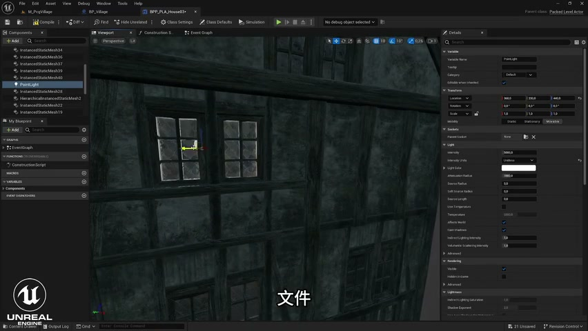

**参数、节点和风险点：**

- `PCG`
- `Blueprint`
- `Point`
- `Actor`
- `Graph`
- `light`
- `some`
- `lights`
- `dark`
- `better`

### 降低房屋灯光强度，让湿润地面和建筑反射不过曝；在墓地区域加入火焰粒子，提高焦点可读性

**内容要点：**

- 本段降低房屋灯光强度，避免房屋像 rave 一样过亮；随后加入 Starter Content 的 fire 粒子，把火焰放到墓地附近，使黑暗区域有焦点和颜色变化。

**关键截图：**

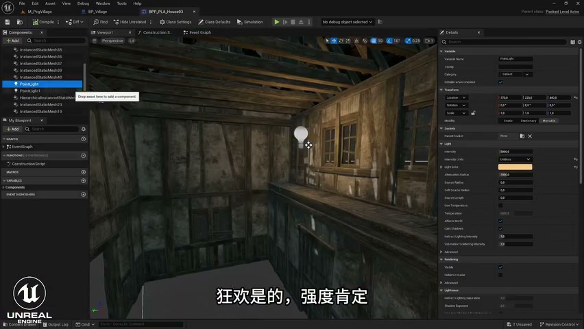
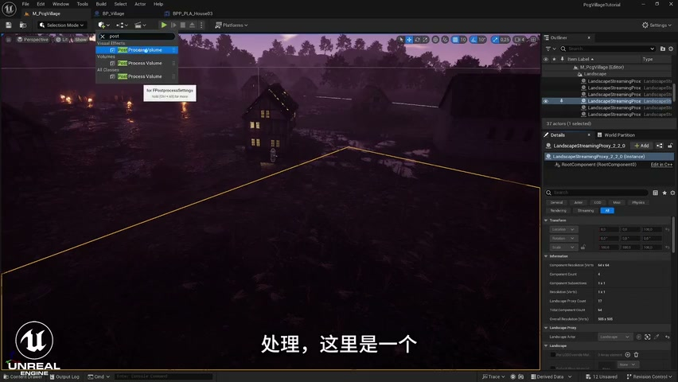

**参数、节点和风险点：**

- `Mesh`
- `Graph`
- `post`
- `fire`
- `light`
- `change`
- `processing`
- `volume`
- `intensity`

### 调 Post Process Volume、Exponential Height Fog、Fog Density、Falloff 和 Start Distance，形成黑暗但可读的村庄氛围

**内容要点：**

- 本段调整后处理和雾效。Post Process Volume 设置为 Unbounded，调曝光、边缘和全局观感；Exponential Height Fog 的 fog density、falloff、start distance 用来塑造暗色村庄氛围。

**关键截图：**

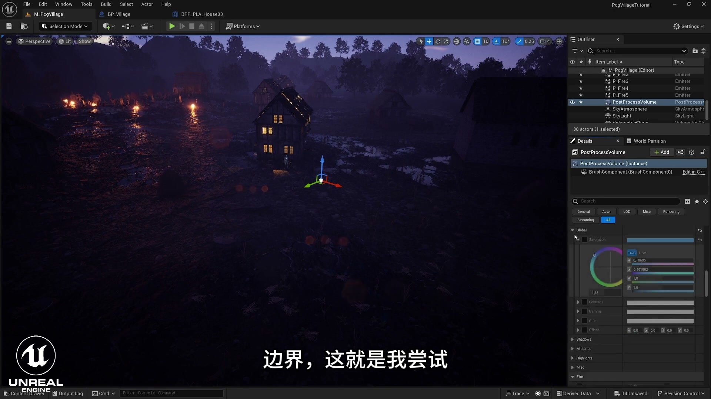
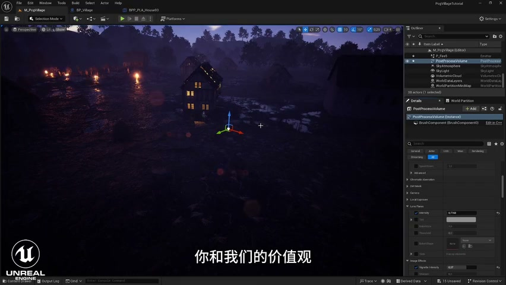

**参数、节点和风险点：**

- `Static Mesh`
- `Mesh`
- `Spline`
- `Actor`
- `Component`
- `Density`
- `Graph`
- `Instance`
- `fence`
- `mean`

### 制作或解释围栏 spline 工具：根据 fence mesh bounding box 计算间距，用 spline length / mesh spacing 得到实例数量，再沿 spline 逐个放置

**内容要点：**

- 本段解释围栏 spline 工具的原理：根据 fence mesh 的 bounding box 得到每段围栏间距，用 spline length 除以 mesh spacing 得到实例数量，再按 index 沿 spline 逐个放置围栏。

**关键截图：**

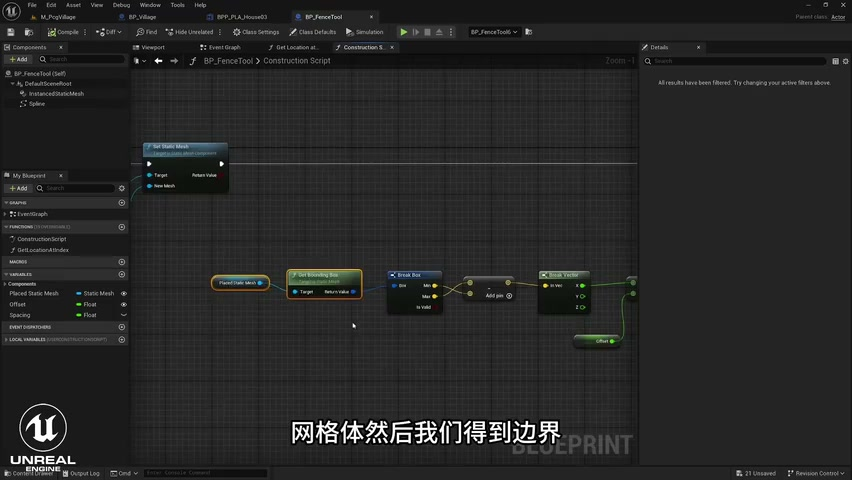
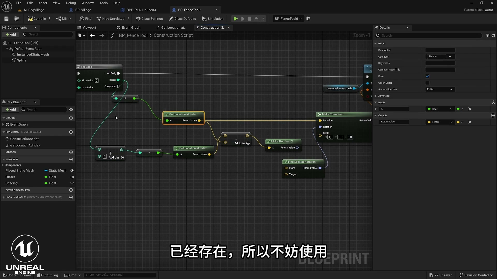

**参数、节点和风险点：**

- `Static Mesh`
- `Mesh`
- `Spline`
- `Loop`
- `Graph`
- `Instance`
- `index`
- `mesh`
- `location`
- `zero`

### 把围栏 spline 数据接回 PCG 图表，可通过 Actor Tag 或指定 Blueprint 工具读取 fence spline，并用它生成围栏附近的植被

**内容要点：**

- 本段把围栏 spline 数据接回 PCG：像读取村庄 spline 一样，从 all world actors 或 Actor Tag 获取 fence spline data，演示 spline 不只可以放围栏，也可以作为 PCG 植被分布依据。

**关键截图：**

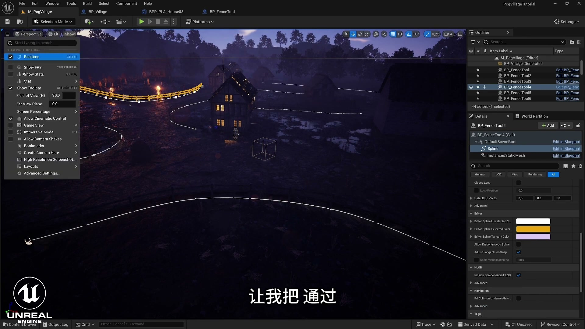
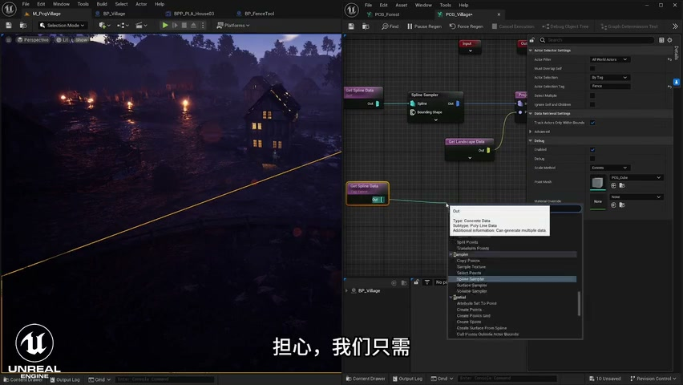

**参数、节点和风险点：**

- `PCG`
- `Blueprint`
- `Spline`
- `Point`
- `Actor`
- `Spawn`
- `Bounds`
- `Landscape`
- `spline`
- `cool`

### 用 fence spline 采样点接 Static Mesh Spawner，生成围栏附近的 tall grass，使围栏和村庄地表更自然地融合

**内容要点：**

- 本段在围栏附近生成 tall grass。用 fence spline 采样点接 Static Mesh Spawner，添加高草 mesh，让围栏边缘和地面更自然；作者也把进一步扩展作为练习，例如在这些点周围生成更多变体点。

**关键截图：**

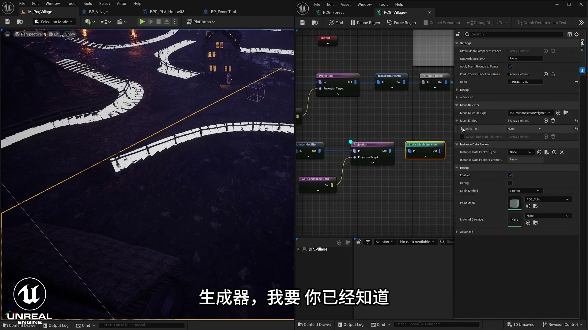
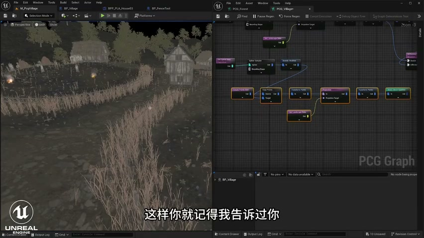

**参数、节点和风险点：**

- `PCG`
- `Static Mesh`
- `Mesh`
- `Transform`
- `Point`
- `Spawn`
- `Graph`
- `生成`
- `more`
- `tall`

### 最后检查整体村庄：森林不穿入村庄、建筑不重叠、墓地和围栏点贴地、灯光不过曝、地形材质和植被密度符合玩家视角

**内容要点：**

- 本段收尾，作者询问观众是否喜欢 PCG 主题或想看编程相关内容。此段没有新增操作，主要是总结和后续内容方向。

**关键截图：**

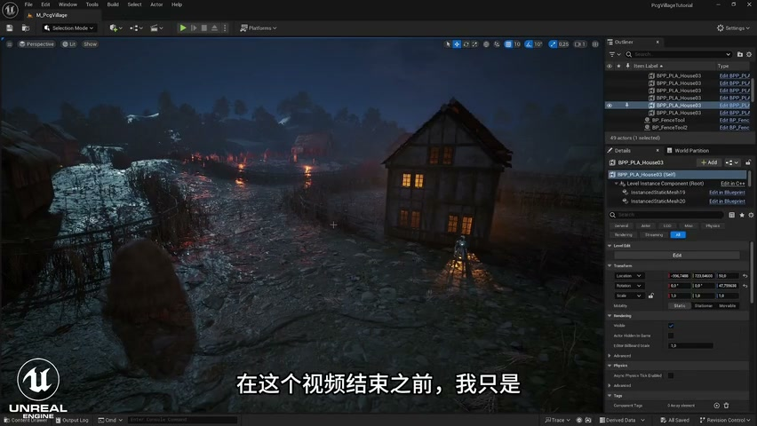
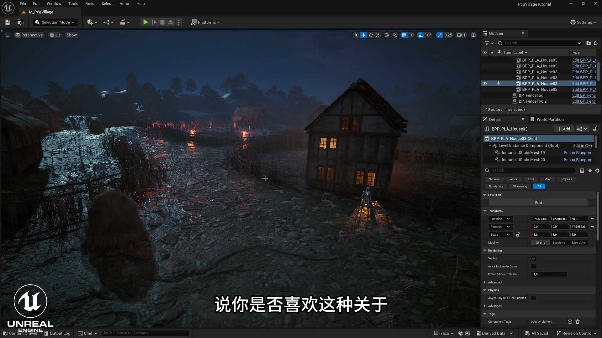

**参数、节点和风险点：**

- `PCG`
- `Actor`
- `know`
- `wanted`
- `leave`
- `comment`
- `saying`
- `type`
- `video`
- `subject`

## 复现检查清单

- World Partition 场景要先加载工作区域，否则重新打开关卡可能看不到 Landscape 或 PCG 目标区域。
- Forest Graph 和 Village Graph 要分清职责：森林负责外部植被，村庄负责建筑与村庄细节，二者通过 Difference/Bounds 互斥。
- Density Filter 的上下界必须互斥；教堂、房屋、墓地和其他建筑不能复用同一批点。
- Combine Points 后生成的 bounds 可能过大，必须用 Bounds Modifier 缩小占用范围，否则一个中心建筑会清掉过多村庄空间。
- Spline 数据本身不带 Landscape 高度，所有来自 spline 的房屋/墓地/围栏点都要检查 Projection 或 Get Height Only。
- 草、树叶、干草这类装饰资产建议 No Collision，并单独控制 scale 和 mobility，避免拖慢运行或挡住玩家。
- 夜间场景要先压低点光源强度，再调雾和后处理；过亮的房屋灯会破坏恐怖村庄气氛。
- 围栏工具依赖 mesh bounding box 和 spline length，mesh pivot、长度和朝向错误会导致实例间距错位。
- 复现时先固定随机种子，再调整密度、过滤和生成资源，避免随机结果掩盖逻辑错误。
