# 01-你绝对想不到在UE5中使用PCG让城市街道变得多么简单

## 知识目标

- 围绕“01-你绝对想不到在UE5中使用PCG让城市街道变得多么简单”整理 PCG 城市街道路网基础：用手绘 Spline 生成道路，识别十字路口、T 型路口、死胡同和直路段，再把这些点集转成可生成网格和关卡实例的稳定路网。

## 可复现主流程

- 用建模模式绘制 Spline，并把输出设为空 Actor，避免 PCG 模式绘制时覆盖样条数据。
- 把道路 Spline 输入 PCG，先用 Spline Sampler/Bounds Modifier 得到可调试的道路点集和道路宽度。
- 检测交叉点、T 型路口和死胡同，把它们命名并从原始样条点集中分离出来。
- 用 Partition/Attribute 按索引、位置或聚类 ID 拆分路径，让每条道路段成为独立数据集。
- 为分割后的道路段存储片段数量、聚类 ID 和原始索引，保留后续判断路口类型所需的信息。
- 通过 Attract/Collapse Points 把需要合并的点吸回原始交叉位置，并移除重复点。
- 把十字路口、T 型路口、死胡同等路口资源做成 Level Instance 或可替换网格，接入对应点集。
- 用 Alpha、索引和样条距离区分道路前半段、后半段、起点、终点和中间点。
- 为直路和曲线路段创建样条，开启切线计算，并用 Create Spline/Generate Spline Mesh 生成道路网格。
- 调整切线、曲线控制和路口网格替换，让直路、曲线、T 型和死胡同都能自动适配。
- 在关卡里拖动或新增道路样条，确认新的路口和道路段能自动重新生成。
- 把关键参数保留为可调项，便于后续扩展建筑、区域和城市生成规则。

## 关键术语

- `PCG`
- `Blueprint`
- `Static Mesh`
- `Mesh`
- `Spline`
- `Transform`
- `Point`
- `Attribute`
- `Actor`
- `Component`
- `Spawn`
- `Grid`
- `Bounds`
- `Density`
- `Seed`
- `Loop`
- `Graph`
- `Material`

## 操作步骤与要点

### 用建模模式绘制 Spline，并把输出设为空 Actor，避免 PCG 模式绘制时覆盖样条数据

**内容要点：**

- 用建模模式绘制 Spline，并把输出设为空 Actor，避免 PCG 模式绘制时覆盖样条数据。

**关键截图：**

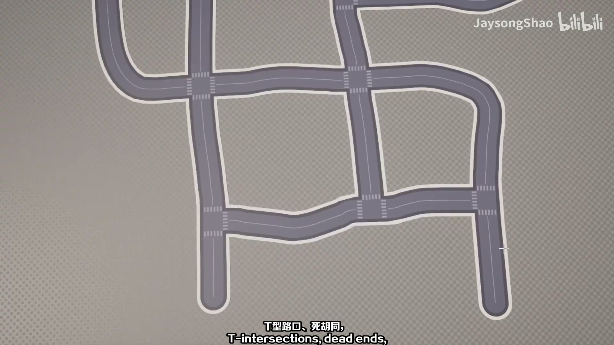

**参数、节点和风险点：**

- `PCG`
- `Actor`
- `样条`
- `属性`
- `程序化`
- `生成`
- `道路`
- `extended`
- `bilbili`
- `JaysongShao`

### 把道路 Spline 输入 PCG，先用 Spline Sampler/Bounds Modifier 得到可调试的道路点集和道路宽度

**内容要点：**

- 把道路 Spline 输入 PCG，先用 Spline Sampler/Bounds Modifier 得到可调试的道路点集和道路宽度。

**关键截图：**

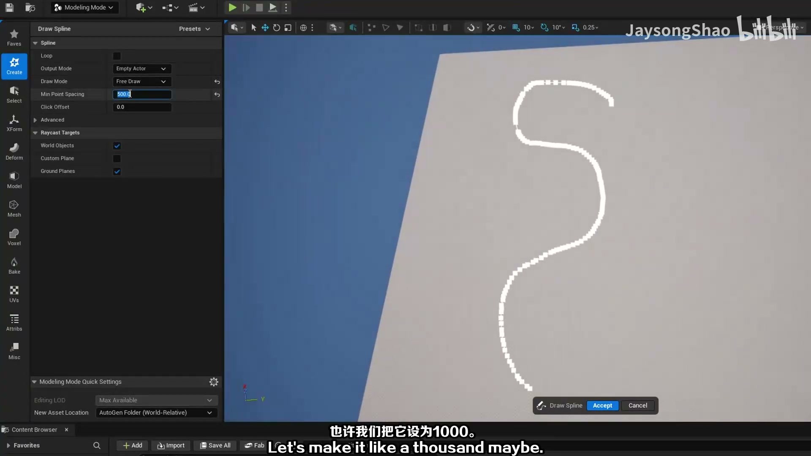
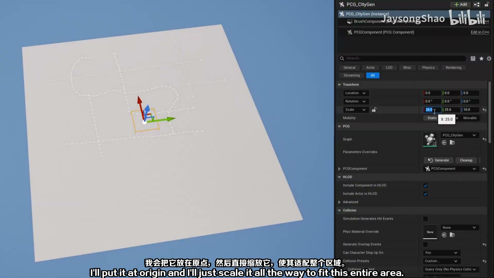

**参数、节点和风险点：**

- `PCG`
- `Spline`
- `Point`
- `Actor`
- `Loop`
- `样条`
- `属性`
- `采样`
- `参数`
- `生成`

### 检测交叉点、T 型路口和死胡同，把它们命名并从原始样条点集中分离出来

**内容要点：**

- 检测交叉点、T 型路口和死胡同，把它们命名并从原始样条点集中分离出来。

**关键截图：**

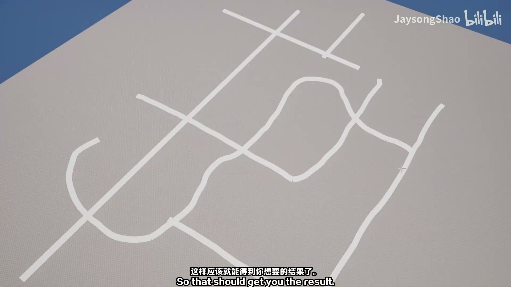

**参数、节点和风险点：**

- `PCG`
- `Spline`
- `Bounds`
- `样条`
- `过滤`
- `采样`
- `节点`
- `道路`
- `JaysongShao`
- `line`

### 用 Partition/Attribute 按索引、位置或聚类 ID 拆分路径，让每条道路段成为独立数据集

**内容要点：**

- 用 Partition/Attribute 按索引、位置或聚类 ID 拆分路径，让每条道路段成为独立数据集。

**关键截图：**

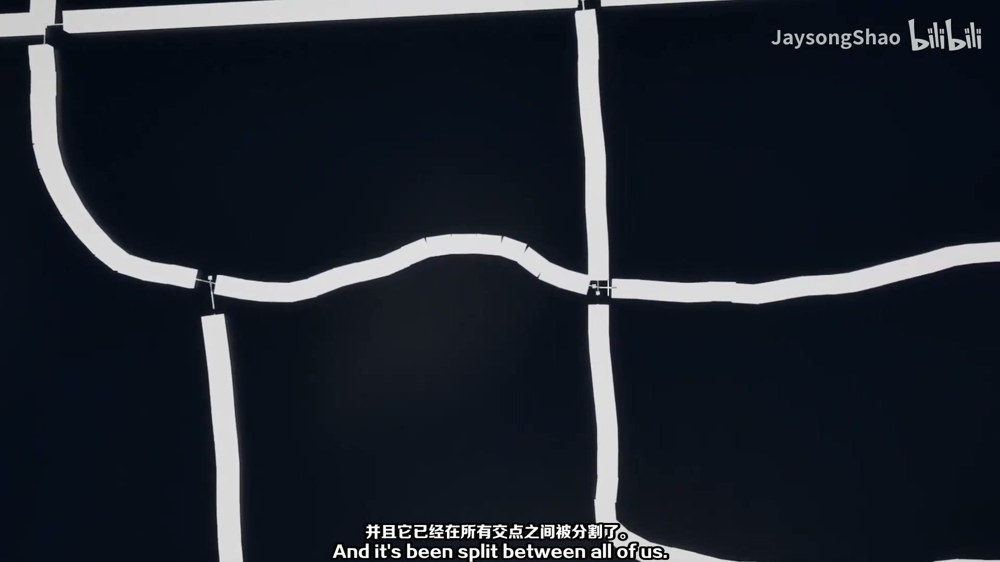
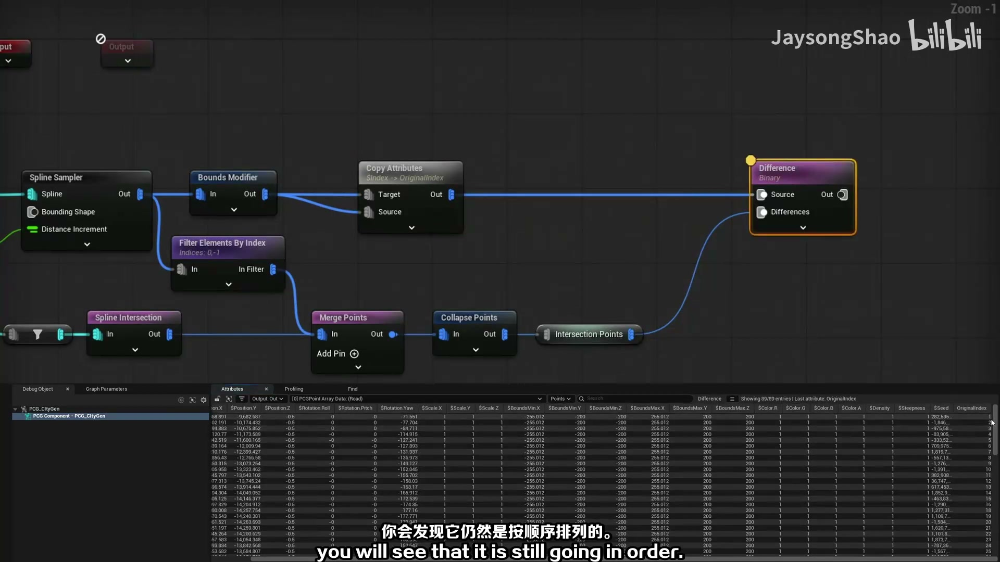

**参数、节点和风险点：**

- `Spline`
- `Attribute`
- `Bounds`
- `样条`
- `属性`
- `节点`
- `生成`
- `JaysongShao`
- `been`
- `split`

### 为分割后的道路段存储片段数量、聚类 ID 和原始索引，保留后续判断路口类型所需的信息

**内容要点：**

- 为分割后的道路段存储片段数量、聚类 ID 和原始索引，保留后续判断路口类型所需的信息。

**关键截图：**

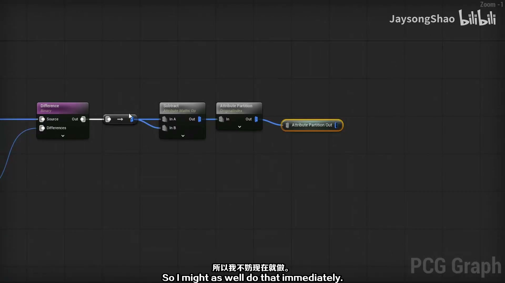
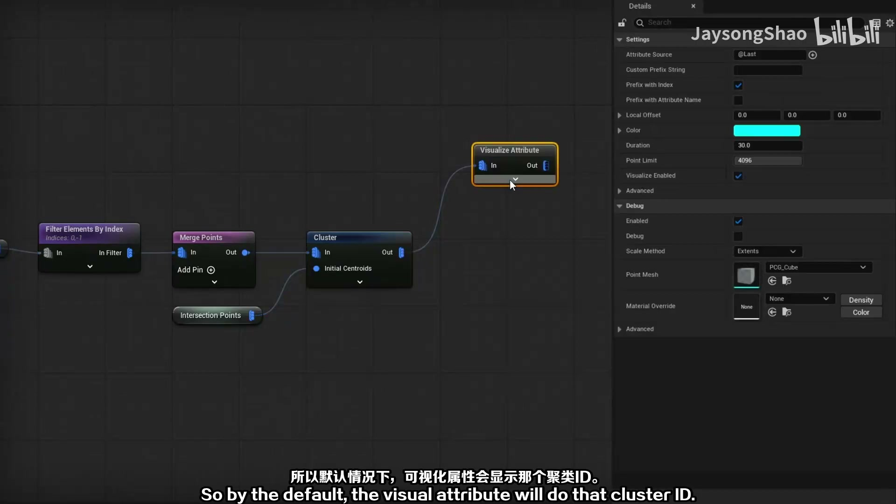

**参数、节点和风险点：**

- `PCG`
- `Attribute`
- `Graph`
- `样条`
- `网格`
- `属性`
- `过滤`
- `节点`
- `生成`
- `道路`

### 通过 Attract/Collapse Points 把需要合并的点吸回原始交叉位置，并移除重复点

**内容要点：**

- 通过 Attract/Collapse Points 把需要合并的点吸回原始交叉位置，并移除重复点。

**关键截图：**

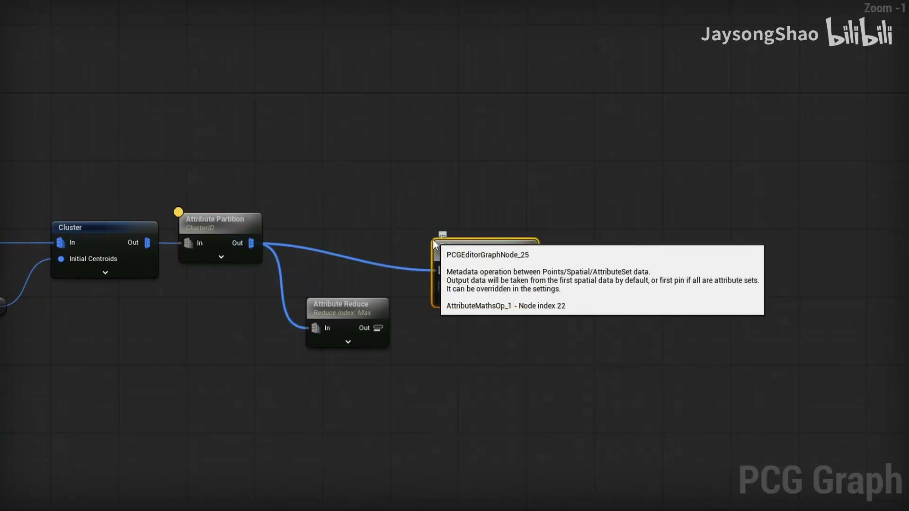
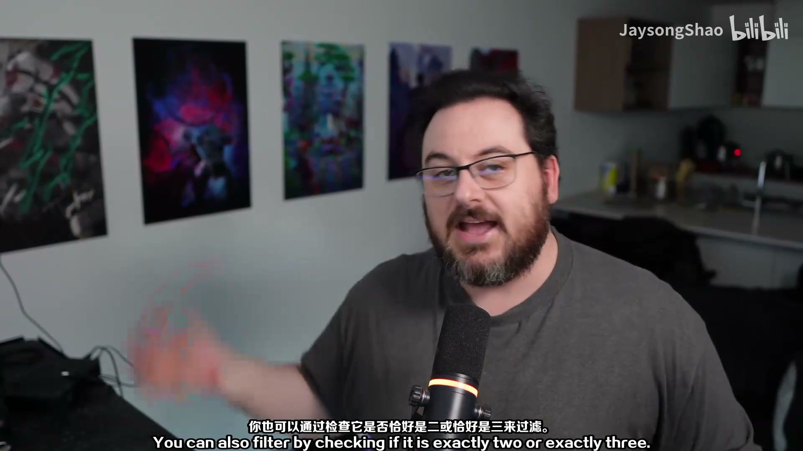

**参数、节点和风险点：**

- `PCG`
- `Point`
- `Attribute`
- `Graph`
- `属性`
- `过滤`
- `节点`
- `Reduce`
- `Zoom`
- `JaysongShao`

### 把十字路口、T 型路口、死胡同等路口资源做成 Level Instance 或可替换网格，接入对应点集

**内容要点：**

- 把十字路口、T 型路口、死胡同等路口资源做成 Level Instance 或可替换网格，接入对应点集。

**关键截图：**

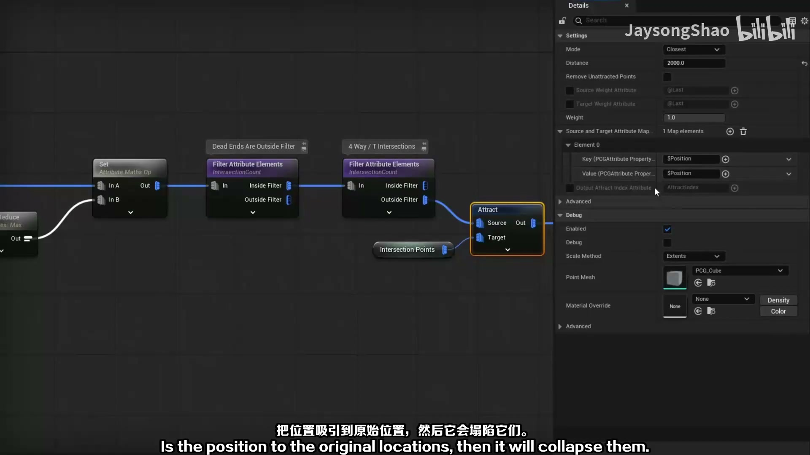
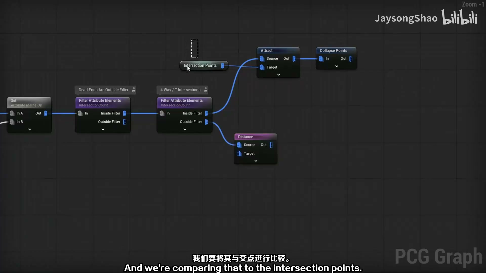

**参数、节点和风险点：**

- `PCG`
- `Point`
- `Attribute`
- `网格`
- `属性`
- `节点`
- `Source`
- `Weight`
- `road`
- `rotator`

### 用 Alpha、索引和样条距离区分道路前半段、后半段、起点、终点和中间点

**内容要点：**

- 用 Alpha、索引和样条距离区分道路前半段、后半段、起点、终点和中间点。

**关键截图：**

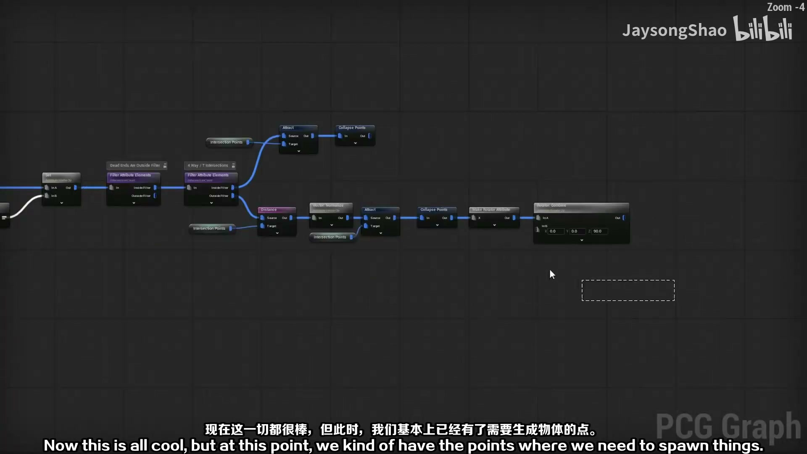
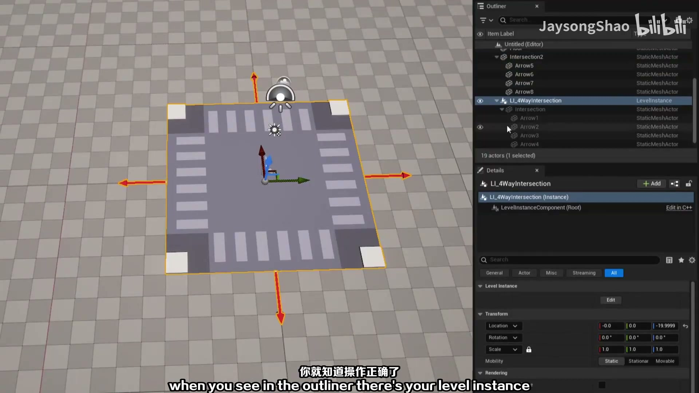

**参数、节点和风险点：**

- `PCG`
- `Mesh`
- `Point`
- `Actor`
- `Spawn`
- `Graph`
- `网格`
- `实例`
- `生成`
- `道路`

### 为直路和曲线路段创建样条，开启切线计算，并用 Create Spline/Generate Spline Mesh 生成道路网格

**内容要点：**

- 为直路和曲线路段创建样条，开启切线计算，并用 Create Spline/Generate Spline Mesh 生成道路网格。

**关键截图：**

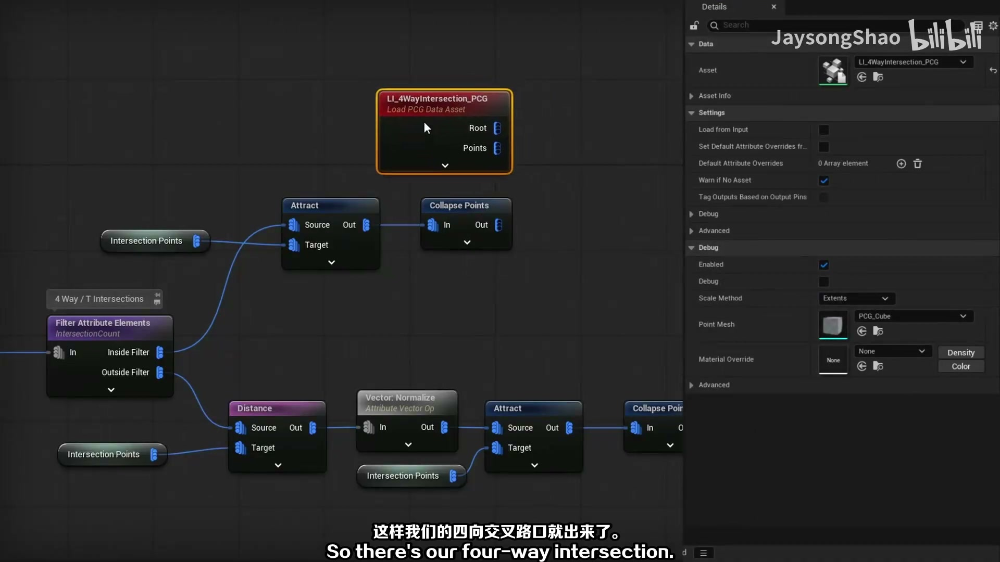

**参数、节点和风险点：**

- `PCG`
- `Mesh`
- `Transform`
- `Point`
- `Attribute`
- `样条`
- `网格`
- `属性`
- `过滤`
- `采样`

### 调整切线、曲线控制和路口网格替换，让直路、曲线、T 型和死胡同都能自动适配

**内容要点：**

- 调整切线、曲线控制和路口网格替换，让直路、曲线、T 型和死胡同都能自动适配。

**关键截图：**

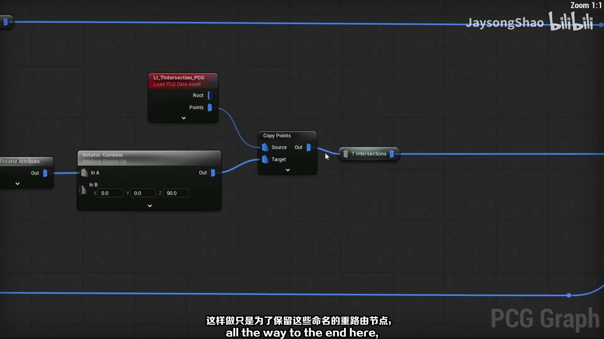
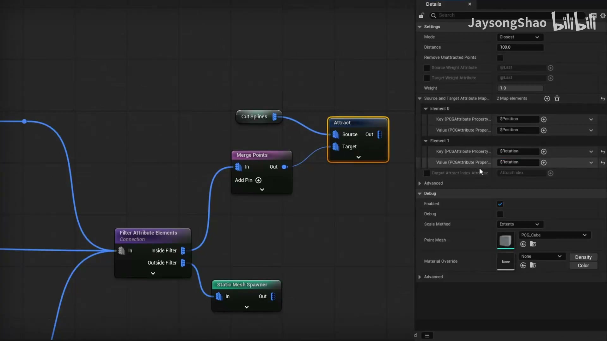

**参数、节点和风险点：**

- `PCG`
- `Point`
- `Attribute`
- `Actor`
- `Graph`
- `样条`
- `网格`
- `属性`
- `过滤`
- `节点`

### 在关卡里拖动或新增道路样条，确认新的路口和道路段能自动重新生成

**内容要点：**

- 在关卡里拖动或新增道路样条，确认新的路口和道路段能自动重新生成。

**关键截图：**

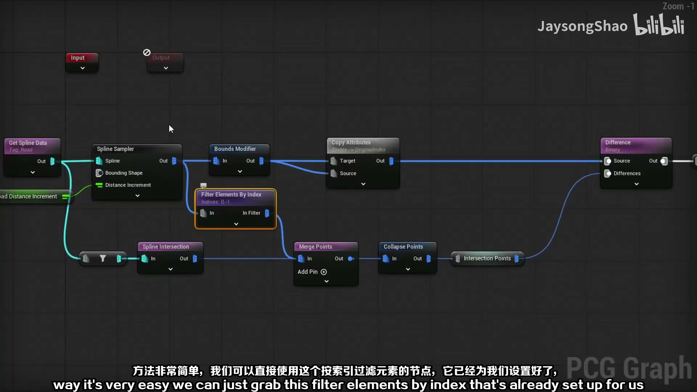
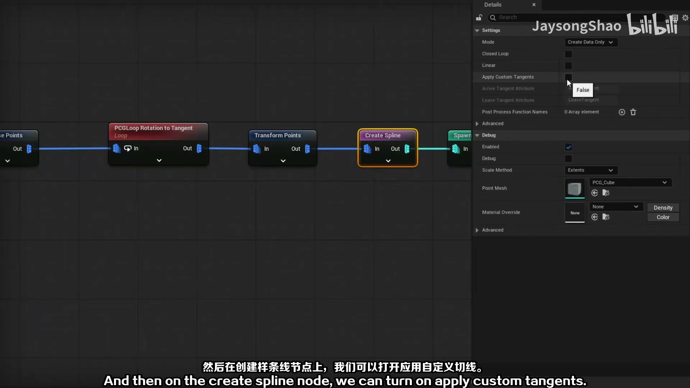

**参数、节点和风险点：**

- `Spline`
- `Point`
- `Attribute`
- `Bounds`
- `样条`
- `属性`
- `过滤`
- `采样`
- `参数`
- `节点`

### 把关键参数保留为可调项，便于后续扩展建筑、区域和城市生成规则

**内容要点：**

- 把关键参数保留为可调项，便于后续扩展建筑、区域和城市生成规则。

**关键截图：**

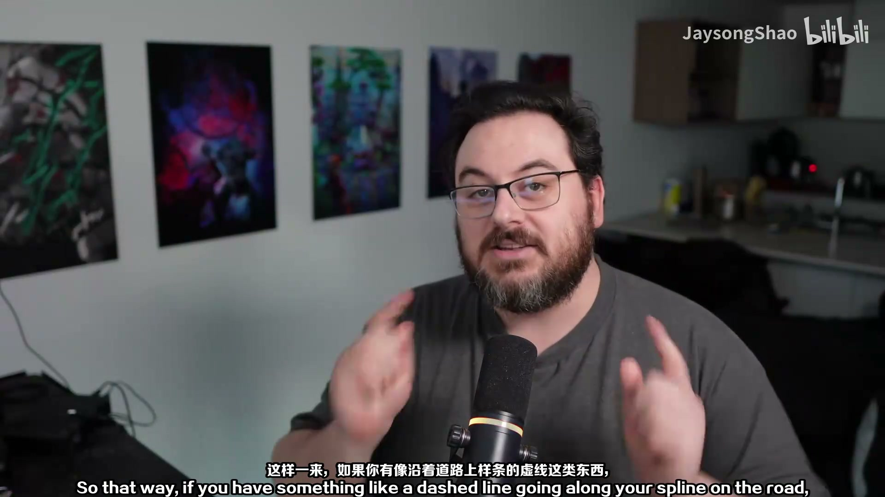
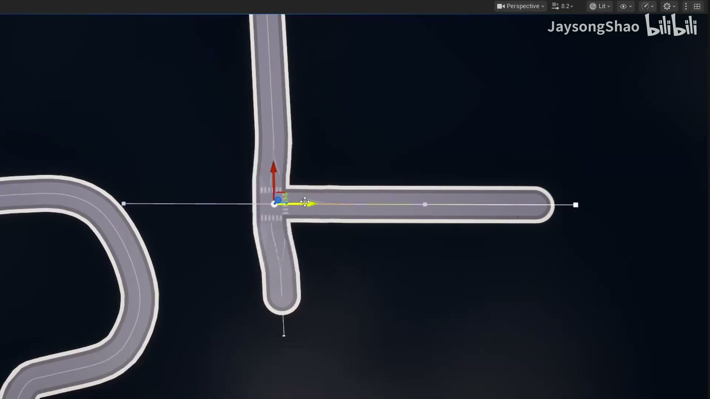

**参数、节点和风险点：**

- `PCG`
- `Spline`
- `样条`
- `采样`
- `节点`
- `道路`
- `along`
- `road`
- `lights`
- `Lilibili`

## 复现检查清单

- PCG 模式绘制样条可能覆盖样条数据，本视频选择建模模式输出空 Actor。
- 路口点必须从原始样条中分离，否则直路段会把路口当作普通道路继续生成。
- Partition 属性选择错误会导致多条道路混在一个数据集里，后续 Create Spline 会错连。
- Attract 和 Collapse 的顺序要谨慎，过早合并会丢失距离和原始位置判断。
- Alpha、切线和端点处理决定曲线道路是否平滑，以及死胡同/T 型路口是否对齐。
- 复现时先固定随机种子，再调整密度、过滤和生成资源，避免随机结果掩盖逻辑错误。
