# 02-停止在UE5中手动沿路放置建筑，改用此方法

## 知识目标

- 围绕“02-停止在UE5中手动沿路放置建筑，改用此方法”整理 PCG 沿路建筑生成流程：沿主路采样可放置点，按道路厚度和建筑边界过滤位置，让建筑朝向道路，并自动生成连接建筑入口和主路的小径。

## 可复现主流程

- 先复用上一集生成的道路样条，明确目标是沿主路两侧生成随机建筑和通向主路的小径。
- 用 Spline Sampler 按距离采样道路，并开启拟合/细分，让采样点贴合道路起点和终点。
- 清理道路内部多余点，避免建筑点与道路点仍然连接或重叠。
- 用 Bounds Modifier 表示道路厚度，并按道路宽度过滤建筑候选点。
- 添加 PCG 模块网格信息，让建筑网格边界可以作为模块尺寸参与过滤和偏移。
- 根据网格 Bounds/Extents 计算建筑半尺寸，把建筑从道路边缘向外推到正确位置。
- 计算建筑朝向，让建筑正面、入口或连接点朝向最近的道路段。
- 评估距离/最近点搜索的性能风险，只在必要点集规模下启用。
- 提取建筑入口点，作为连接小径的起点。
- 在建筑入口点和主路之间生成连接路径，用距离缩放单点网格或道路模块。
- 整理建筑相关参数到 Details 面板分类中，包括建筑缩放、道路半宽、间距和模块列表。

## 关键术语

- `PCG`
- `Blueprint`
- `蓝图`
- `Static Mesh`
- `Mesh`
- `SubGraph`
- `Spline`
- `Transform`
- `Point`
- `Attribute`
- `Actor`
- `Component`
- `Spawn`
- `Bounds`
- `Density`
- `Random`
- `Seed`
- `Loop`

## 操作步骤与要点

### 先复用上一集生成的道路样条，明确目标是沿主路两侧生成随机建筑和通向主路的小径

**内容要点：**

- 先复用上一集生成的道路样条，明确目标是沿主路两侧生成随机建筑和通向主路的小径。

**关键截图：**

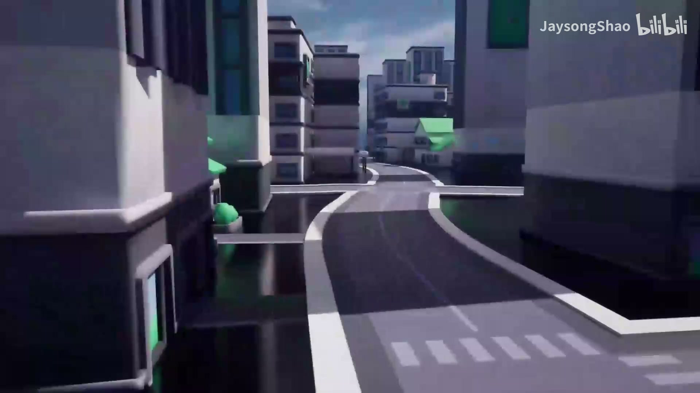
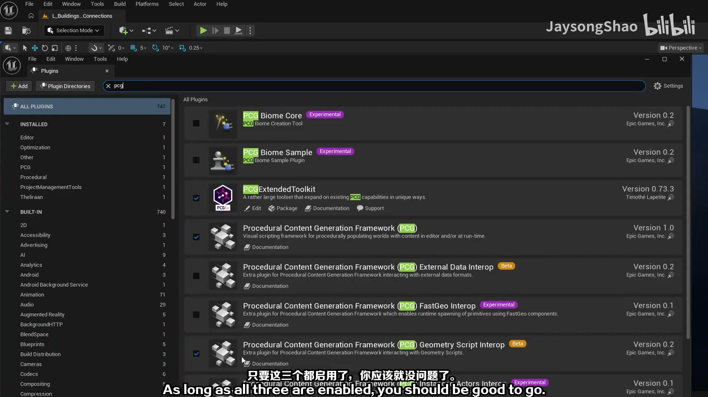

**参数、节点和风险点：**

- `PCG`
- `Spline`
- `Actor`
- `样条`
- `体积`
- `采样`
- `程序化`
- `生成`
- `建筑`
- `道路`

### 用 Spline Sampler 按距离采样道路，并开启拟合/细分，让采样点贴合道路起点和终点

**内容要点：**

- 用 Spline Sampler 按距离采样道路，并开启拟合/细分，让采样点贴合道路起点和终点。

**关键截图：**

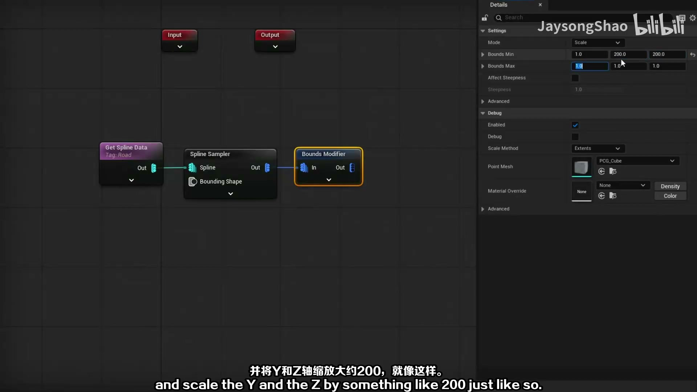
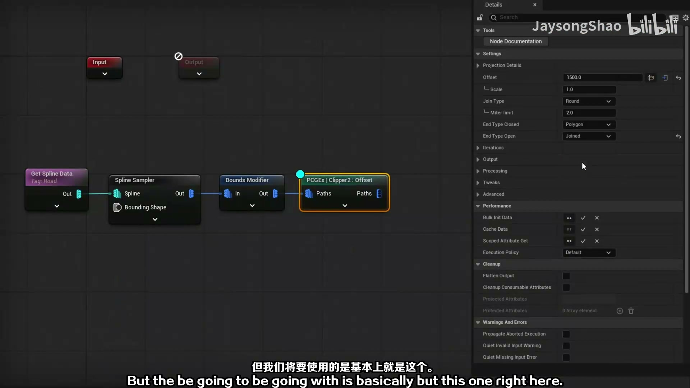

**参数、节点和风险点：**

- `PCG`
- `Spline`
- `Actor`
- `Bounds`
- `样条`
- `网格`
- `节点`
- `生成`
- `建筑`
- `道路`

### 清理道路内部多余点，避免建筑点与道路点仍然连接或重叠

**内容要点：**

- 清理道路内部多余点，避免建筑点与道路点仍然连接或重叠。

**关键截图：**

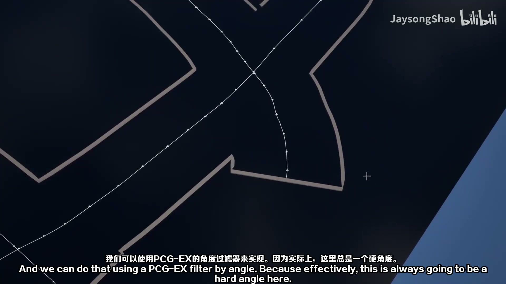
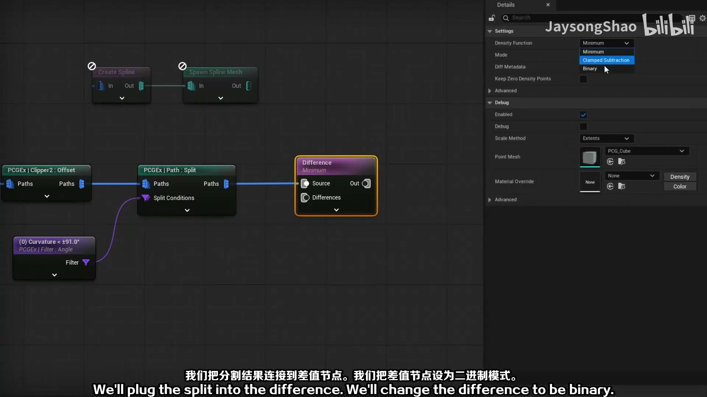

**参数、节点和风险点：**

- `PCG`
- `Mesh`
- `Spline`
- `Point`
- `Spawn`
- `Density`
- `样条`
- `过滤`
- `节点`
- `生成`

### 用 Bounds Modifier 表示道路厚度，并按道路宽度过滤建筑候选点

**内容要点：**

- 用 Bounds Modifier 表示道路厚度，并按道路宽度过滤建筑候选点。

**关键截图：**

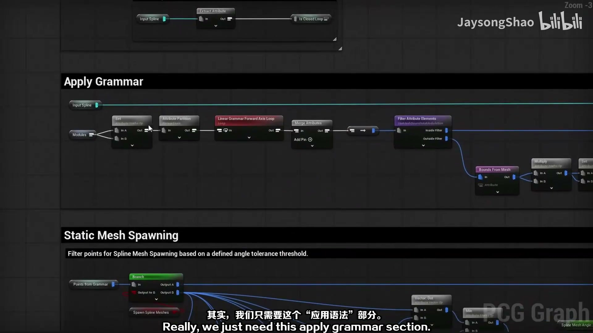

**参数、节点和风险点：**

- `PCG`
- `Mesh`
- `Spline`
- `Attribute`
- `Loop`
- `样条`
- `网格`
- `属性`
- `参数`
- `生成`

### 添加 PCG 模块网格信息，让建筑网格边界可以作为模块尺寸参与过滤和偏移

**内容要点：**

- 添加 PCG 模块网格信息，让建筑网格边界可以作为模块尺寸参与过滤和偏移。

**关键截图：**

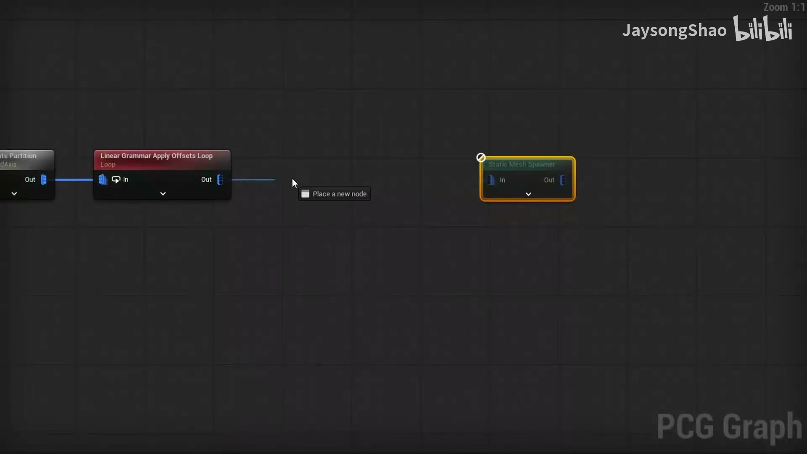
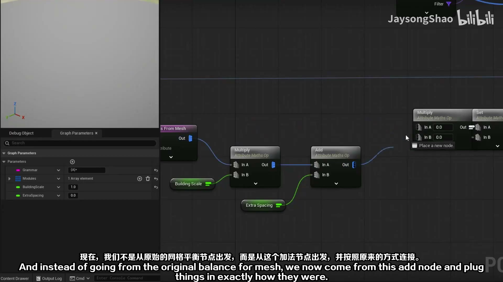

**参数、节点和风险点：**

- `PCG`
- `Static Mesh`
- `Mesh`
- `Spawn`
- `Loop`
- `Graph`
- `样条`
- `网格`
- `过滤`
- `参数`

### 根据网格 Bounds/Extents 计算建筑半尺寸，把建筑从道路边缘向外推到正确位置

**内容要点：**

- 根据网格 Bounds/Extents 计算建筑半尺寸，把建筑从道路边缘向外推到正确位置。

**关键截图：**

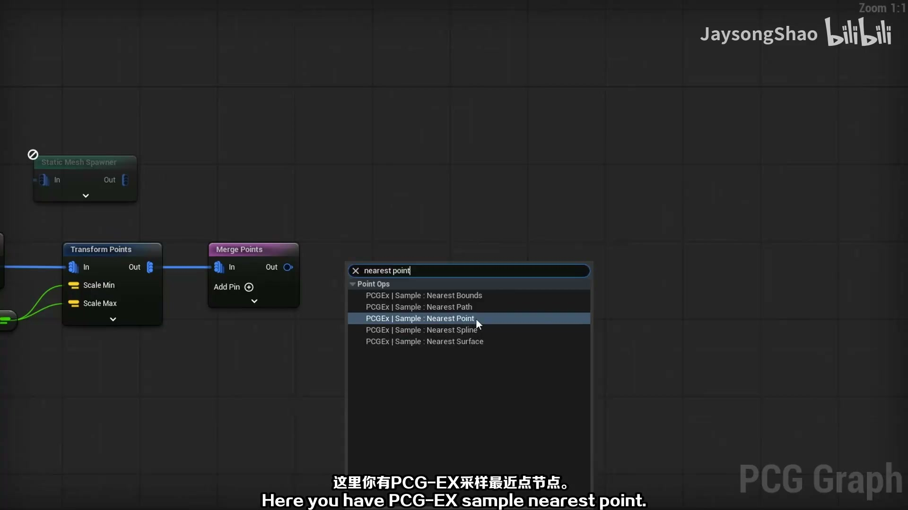
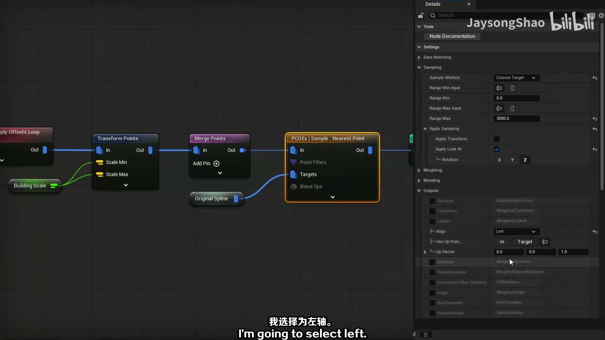

**参数、节点和风险点：**

- `PCG`
- `Static Mesh`
- `Mesh`
- `Spline`
- `Transform`
- `Point`
- `Spawn`
- `Bounds`
- `样条`
- `网格`

### 计算建筑朝向，让建筑正面、入口或连接点朝向最近的道路段

**内容要点：**

- 计算建筑朝向，让建筑正面、入口或连接点朝向最近的道路段。

**关键截图：**

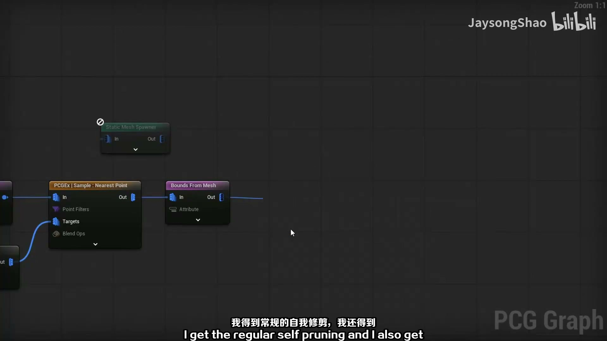
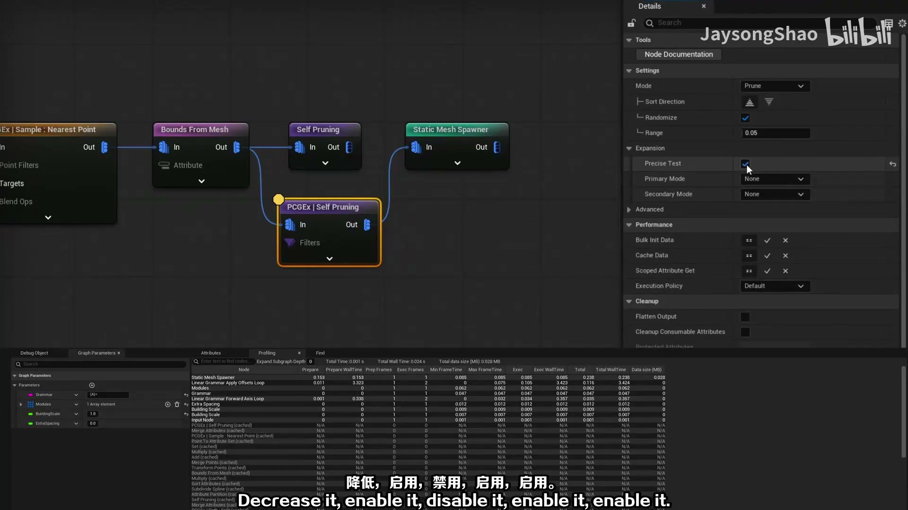

**参数、节点和风险点：**

- `PCG`
- `Mesh`
- `Point`
- `Attribute`
- `Spawn`
- `Bounds`
- `Graph`
- `网格`
- `属性`
- `过滤`

### 评估距离/最近点搜索的性能风险，只在必要点集规模下启用

**内容要点：**

- 评估距离/最近点搜索的性能风险，只在必要点集规模下启用。

**关键截图：**

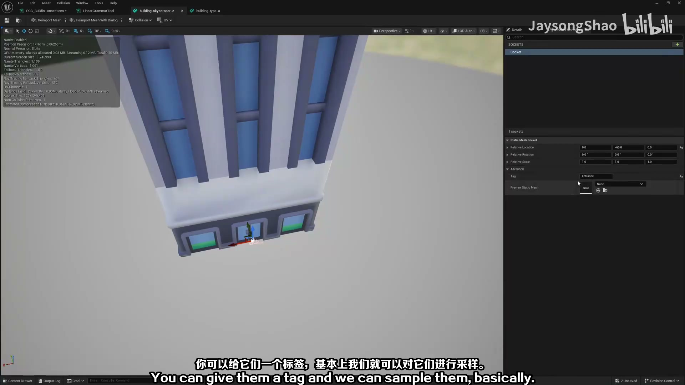
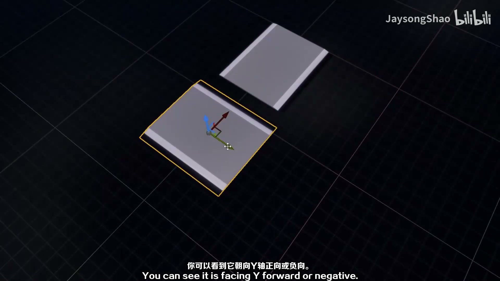

**参数、节点和风险点：**

- `PCG`
- `Mesh`
- `样条`
- `网格`
- `属性`
- `过滤`
- `采样`
- `节点`
- `生成`
- `建筑`

### 提取建筑入口点，作为连接小径的起点

**内容要点：**

- 提取建筑入口点，作为连接小径的起点。

**关键截图：**

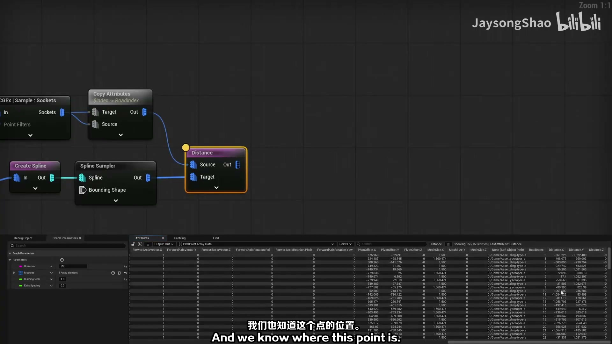
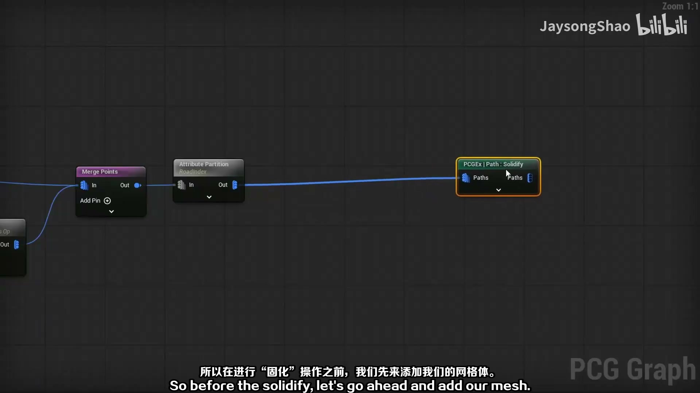

**参数、节点和风险点：**

- `PCG`
- `Spline`
- `Point`
- `Attribute`
- `样条`
- `网格`
- `属性`
- `参数`
- `节点`
- `生成`

### 在建筑入口点和主路之间生成连接路径，用距离缩放单点网格或道路模块

**内容要点：**

- 在建筑入口点和主路之间生成连接路径，用距离缩放单点网格或道路模块。

**关键截图：**

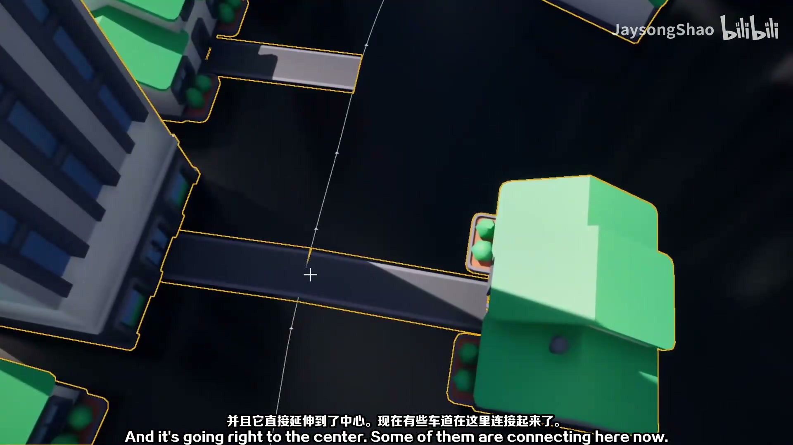

**参数、节点和风险点：**

- `PCG`
- `蓝图`
- `Point`
- `Graph`
- `样条`
- `实例`
- `属性`
- `参数`
- `节点`
- `生成`

### 整理建筑相关参数到 Details 面板分类中，包括建筑缩放、道路半宽、间距和模块列表

**内容要点：**

- 整理建筑相关参数到 Details 面板分类中，包括建筑缩放、道路半宽、间距和模块列表。

**关键截图：**

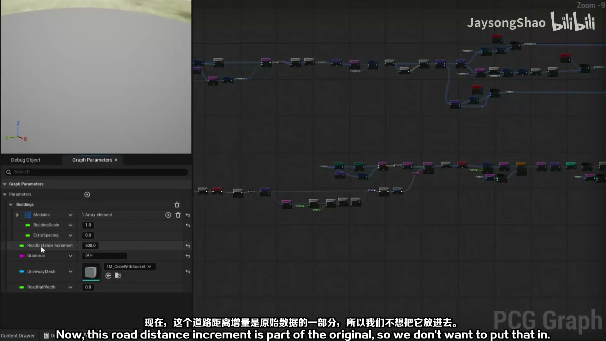
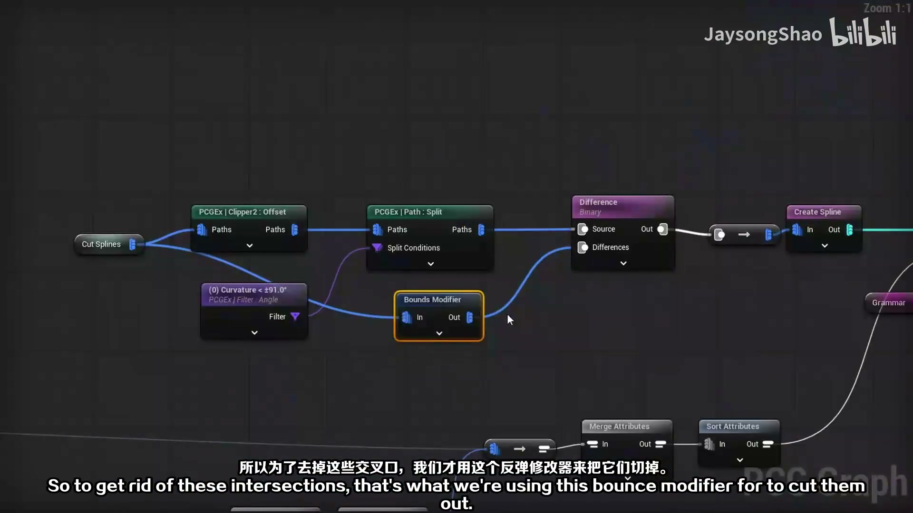

**参数、节点和风险点：**

- `Mesh`
- `Graph`
- `样条`
- `网格`
- `参数`
- `生成`
- `建筑`
- `道路`
- `Parameters`
- `Zoom`

## 复现检查清单

- 道路厚度、建筑边界和道路半宽必须统一，否则建筑会压到道路或离道路太远。
- 建筑朝向应以最近道路段或入口方向为准，不要只做随机旋转。
- 大量点之间做距离计算可能昂贵，点数和重叠数量越高成本越明显。
- 入口点和连接路的合并顺序会影响小径是否接到正确的主路位置。
- 暴露到 Details 面板的参数应分组，避免城市生成器后续难以维护。
- 复现时先固定随机种子，再调整密度、过滤和生成资源，避免随机结果掩盖逻辑错误。
