# PCG制作无限城思路分享

## 知识目标

- 围绕“PCG制作无限城思路分享”整理 PCG 无限城制作流程：先用手工资产和模块化组装确定建筑语言，再用 PCG 负责空间分布、方向约束、密度拆分、实例生成和大范围性能处理。

## 可复现主流程

- 先准备无限城模块化资产：窗户、门、灯笼、桥、建筑块等复杂视觉资产以手工建模或手工组装为主，PCG 负责复用和空间分布。
- 把 PCG Actor/Volume 放入场景并调整生成范围，读取自身 Actor/Volume 数据，用 Volume Sampler 或点集生成基础候选点。
- 用 90 度朝向算法、Graph Parameters、Copy Attribute 等方式约束模块旋转，避免无序随机旋转导致建筑方向错乱。
- 用 Attribute Noise、密度过滤、Difference 等方式把候选点拆成多个空间子集，再分别接不同 Static Mesh、Level Instance 或模块 Spawner。
- 根据用途处理灯光、碰撞和性能：动画镜头可手动打灯，游戏方案应优先蓝图建筑和距离加载卸载，密集实例默认关闭碰撞并设置 Cull Distance。

## 关键术语

- `PCG`
- `蓝图`
- `Static Mesh`
- `Mesh`
- `Transform`
- `Point`
- `Attribute`
- `Actor`
- `Component`
- `Spawn`
- `Grid`
- `Bounds`
- `Density`
- `Random`
- `Graph`
- `Material`
- `Instance`
- `Landscape`

## 操作步骤与要点

### 先准备无限城模块化资产：窗户、门、灯笼、桥、建筑块等复杂视觉资产以手工建模或手工组装为主，PCG 负责复用和空间分布

**内容要点：**

- 先准备无限城模块化资产：窗户、门、灯笼、桥、建筑块等复杂视觉资产以手工建模或手工组装为主，PCG 负责复用和空间分布。

**关键截图：**

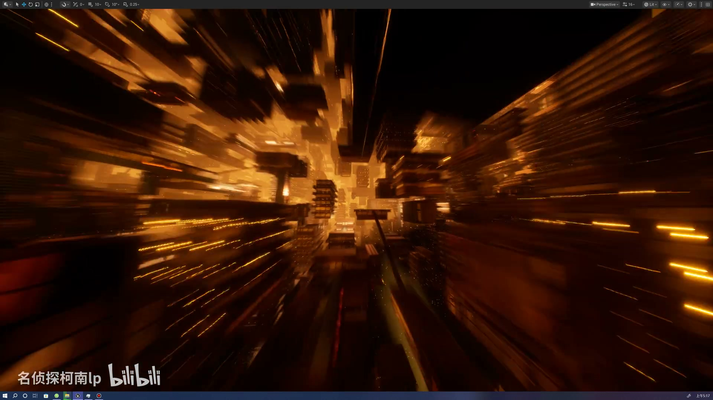
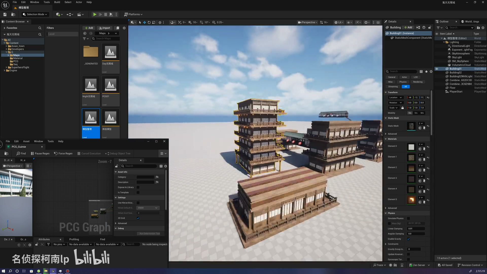

**参数、节点和风险点：**

- `Mesh`
- `程序化`
- `生成`
- `建筑`
- `Selection`
- `Mode`
- `Platforms`
- `Content`

### 先准备无限城模块化资产：窗户、门、灯笼、桥、建筑块等复杂视觉资产以手工建模或手工组装为主，PCG 负责复用和空间分布（2）

**内容要点：**

- 先准备无限城模块化资产：窗户、门、灯笼、桥、建筑块等复杂视觉资产以手工建模或手工组装为主，PCG 负责复用和空间分布（2）。

**关键截图：**

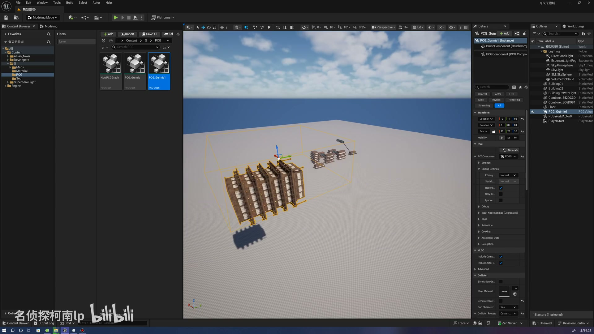
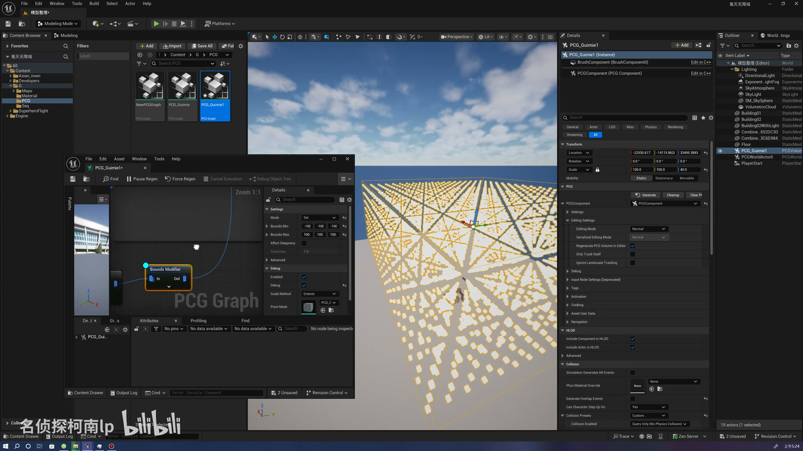

**参数、节点和风险点：**

- `PCG`
- `Mesh`
- `Attribute`
- `Actor`
- `Graph`
- `Instance`
- `体积`
- `采样`
- `参数`
- `节点`

### 把 PCG Actor/Volume 放入场景并调整生成范围，读取自身 Actor/Volume 数据，用 Volume Sampler 或点集生成基础候选点

**内容要点：**

- 把 PCG Actor/Volume 放入场景并调整生成范围，读取自身 Actor/Volume 数据，用 Volume Sampler 或点集生成基础候选点。

**关键截图：**

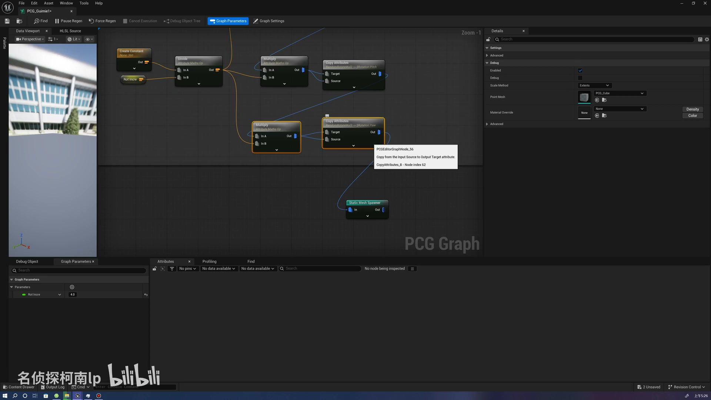
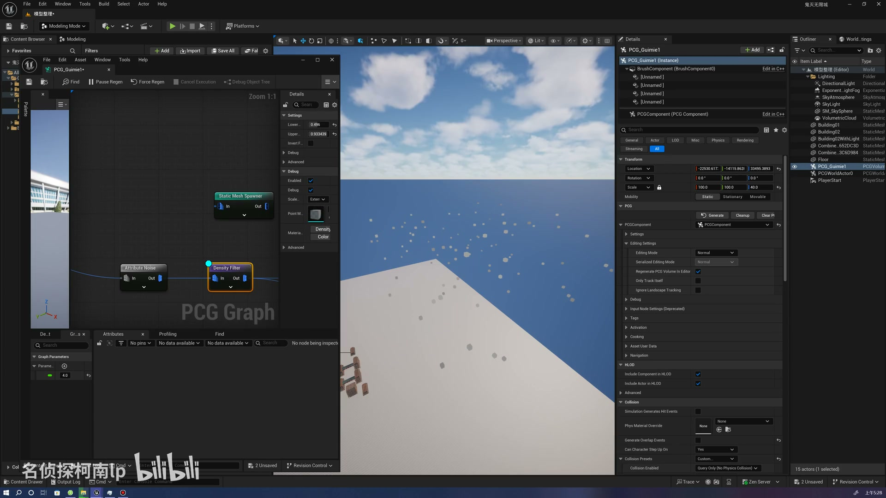

**参数、节点和风险点：**

- `PCG`
- `Attribute`
- `Graph`
- `属性`
- `过滤`
- `密度`
- `参数`
- `节点`
- `生成`
- `copy`

### 用 90 度朝向算法、Graph Parameters、Copy Attribute 等方式约束模块旋转，避免无序随机旋转导致建筑方向错乱

**内容要点：**

- 用 90 度朝向算法、Graph Parameters、Copy Attribute 等方式约束模块旋转，避免无序随机旋转导致建筑方向错乱。

**关键截图：**

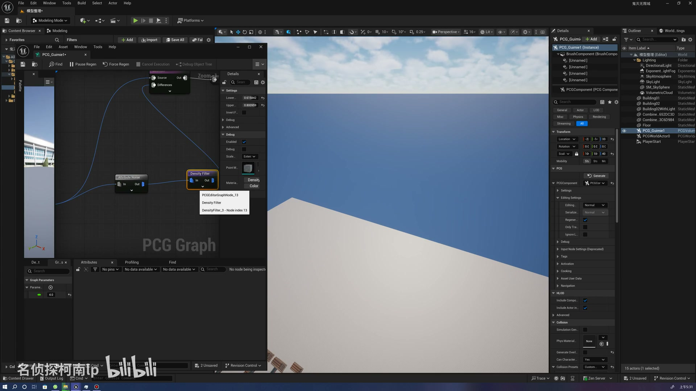
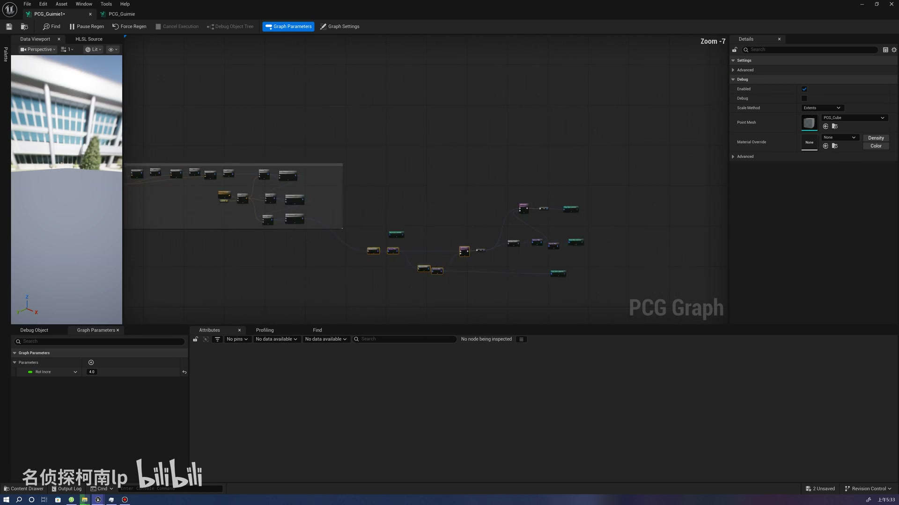

**参数、节点和风险点：**

- `PCG`
- `Static Mesh`
- `Mesh`
- `Attribute`
- `Density`
- `Instance`
- `过滤`
- `密度`
- `参数`
- `生成`

### 用 90 度朝向算法、Graph Parameters、Copy Attribute 等方式约束模块旋转，避免无序随机旋转导致建筑方向错乱（2）

**内容要点：**

- 用 90 度朝向算法、Graph Parameters、Copy Attribute 等方式约束模块旋转，避免无序随机旋转导致建筑方向错乱（2）。

**关键截图：**

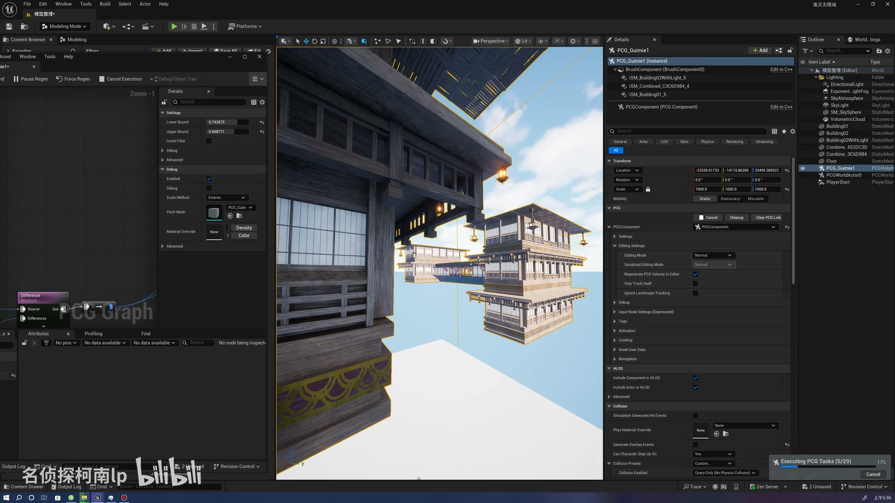
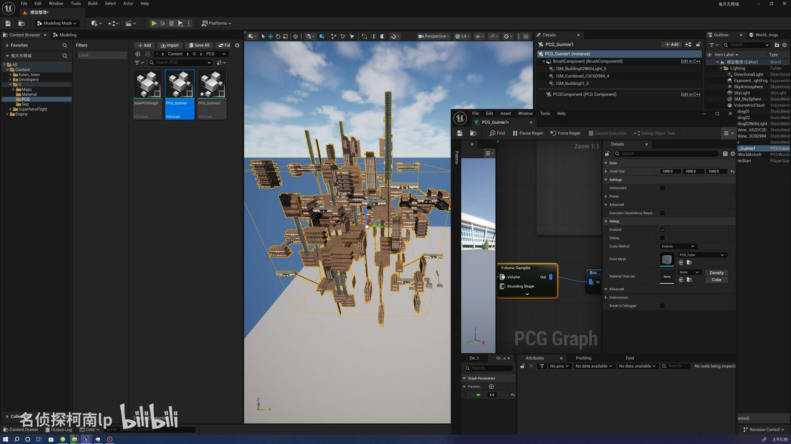

**参数、节点和风险点：**

- `PCG`
- `Component`
- `Instance`
- `体积`
- `属性`
- `参数`
- `生成`
- `建筑`
- `Modeling`
- `Block`

### 用 Attribute Noise、密度过滤、Difference 等方式把候选点拆成多个空间子集，再分别接不同 Static Mesh、Level Instance 或模块 Spawner

**内容要点：**

- 用 Attribute Noise、密度过滤、Difference 等方式把候选点拆成多个空间子集，再分别接不同 Static Mesh、Level Instance 或模块 Spawner。

**关键截图：**

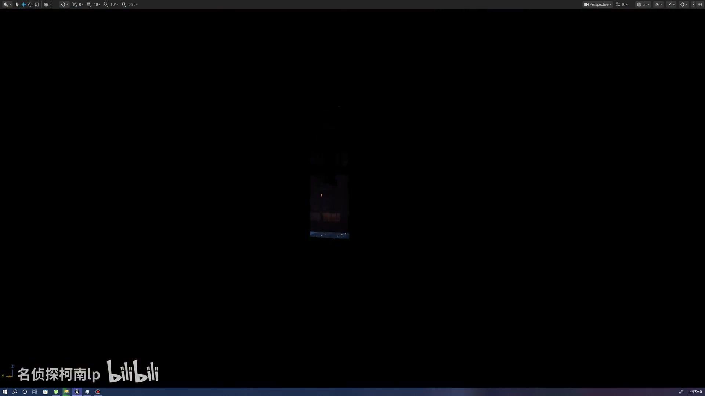
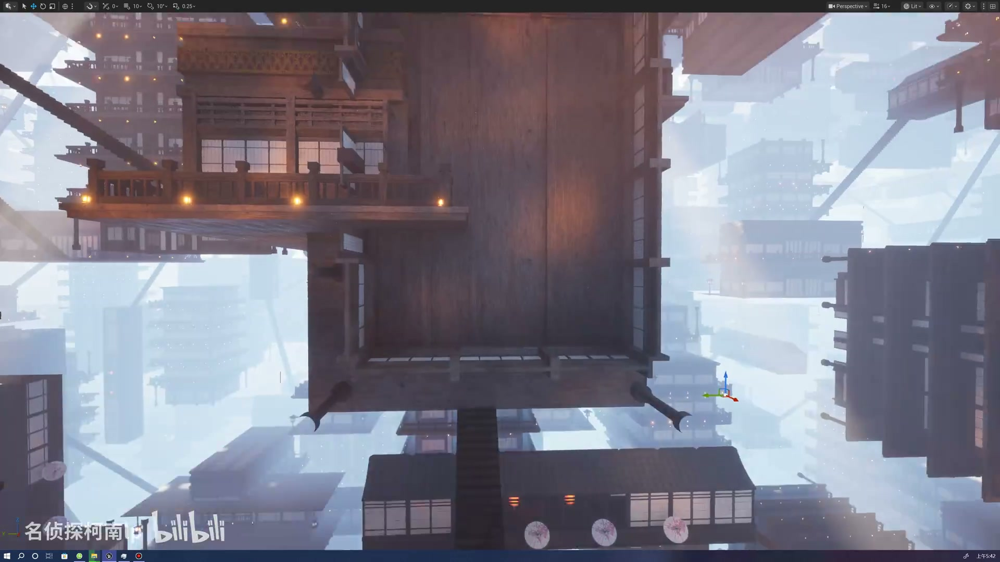

**参数、节点和风险点：**

- `体积`
- `生成`
- `建筑`
- `OLitV`
- `Selection`
- `Mode`
- `Platforms`
- `Content`

### 根据用途处理灯光、碰撞和性能：动画镜头可手动打灯，游戏方案应优先蓝图建筑和距离加载卸载，密集实例默认关闭碰撞并设置 Cull Distance

**内容要点：**

- 根据用途处理灯光、碰撞和性能：动画镜头可手动打灯，游戏方案应优先蓝图建筑和距离加载卸载，密集实例默认关闭碰撞并设置 Cull Distance。

**关键截图：**

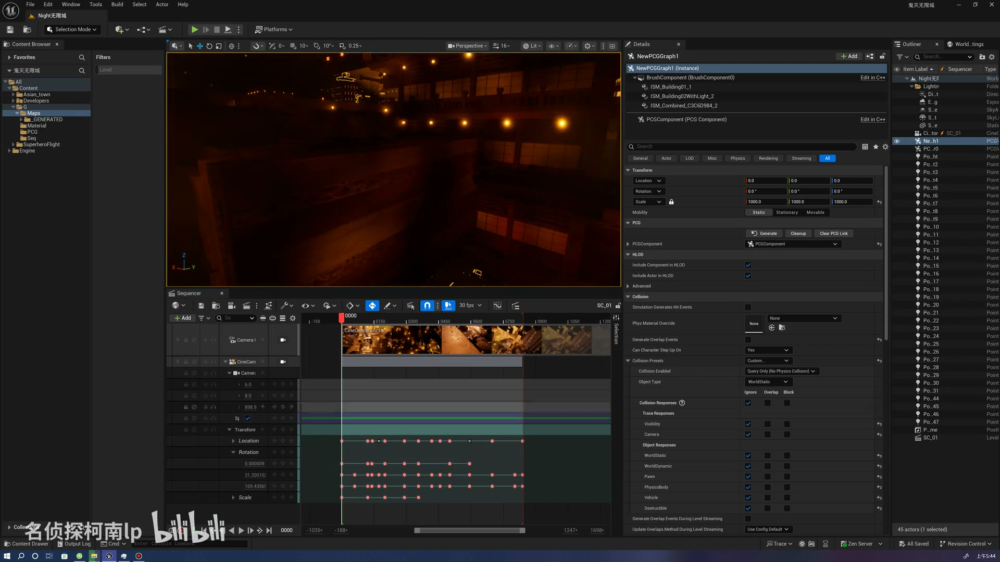
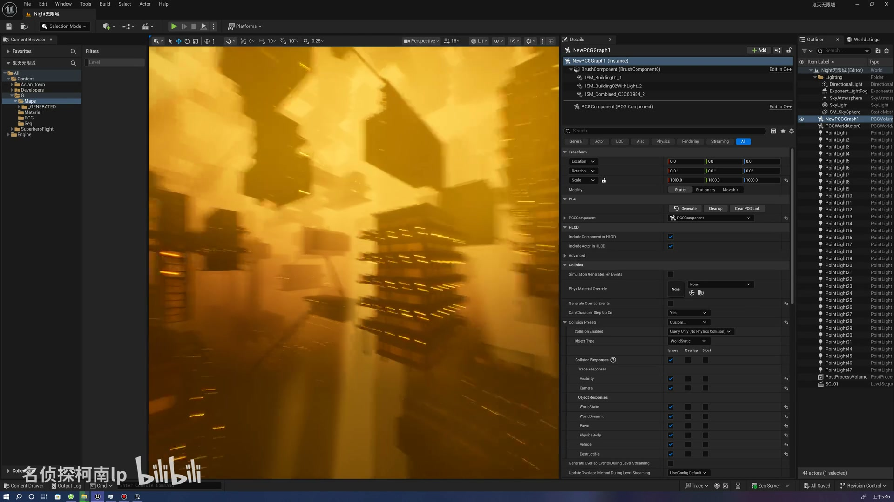

**参数、节点和风险点：**

- `PCG`
- `蓝图`
- `Graph`
- `Instance`
- `参数`
- `节点`
- `程序化`
- `生成`
- `建筑`
- `Content`

## 复现检查清单

- 模块资产的 Pivot、尺寸和朝向必须统一，否则 90 度旋转约束也无法稳定拼接。
- Density Filter 和 Difference 分支要检查点集是否互斥，避免同一区域重复生成多个模块。
- 大范围生成前先小范围调试，确认节点、资源、朝向和密度都正确后再放大到 500/1000 级别。
- 碰撞、Lumen 自发光、灯光数量、Cull Distance 和资源所在硬盘速度是主要性能风险。
- 复现时先固定随机种子，再调整密度、过滤和生成资源，避免随机结果掩盖逻辑错误。
