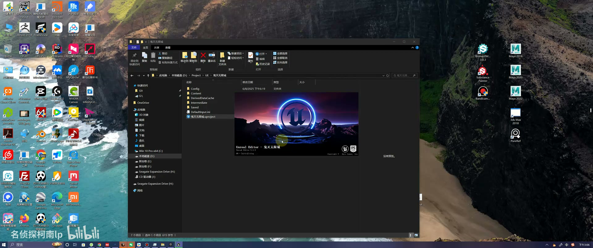
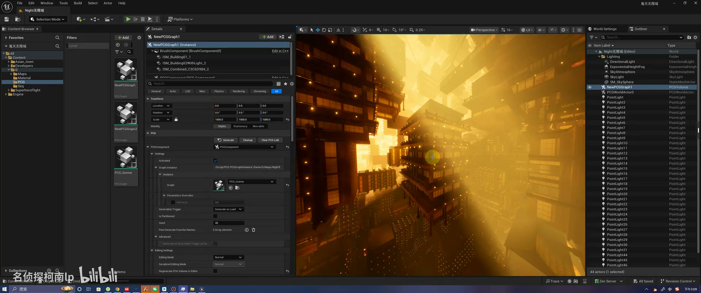
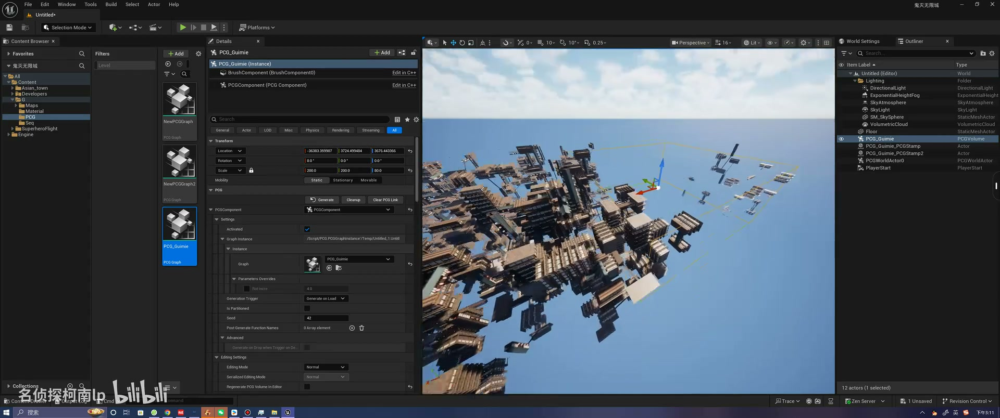
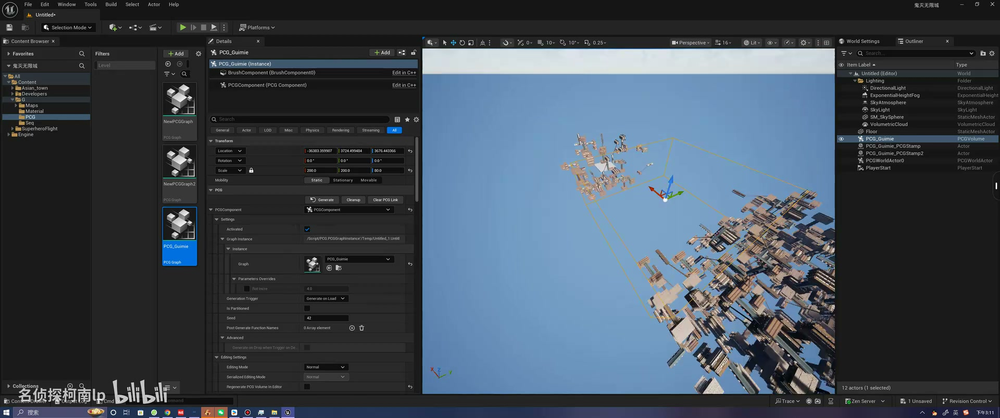

# 无限城案例补充-卡顿？

## 知识目标

- 围绕“无限城案例补充-卡顿？”整理 PCG 视频中的输入数据、图表规则、关键节点、参数风险和最终生成结果。
- 阅读时重点区分三层：输入来源（点、样条、表面、体积、Actor 或属性）、规则处理（采样、过滤、变换、分区、循环、HLSL 或子图）、输出方式（Static Mesh Spawner、Spawn Actor、Spline Mesh、Blueprint 或 Dynamic Mesh）。

## 可复现主流程

- 确认 PCG Graph/PCG Component 已绑定到正确 Actor，并先用 Debug/Inspect 查看中间点数据。
- 明确输入来源：Spline、Surface、Mesh、Volume、Actor、Data Asset/Data Table 或手工参数。
- 在图表中按顺序处理采样、属性写入、过滤、Transform、分区/循环和输出节点。
- 生成可见结果前，先核对 Point 的 Transform、Bounds、Density、Seed 和自定义 Attribute。
- 用 Static Mesh Spawner 输出大量网格实例；需要蓝图逻辑时改用 Spawn Actor 或 Blueprint 交互。

## 关键术语

- `PCG`、`蓝图`、`Mesh`、`Transform`、`Point`、`Actor`、`Component`、`Seed`、`Graph`、`Material`、`Instance`、`实例`、`生成`、`Generate`、`Content`、`Editor`、`PCGComponent`、`Mode`、`Volume`、`点`

## 分段知识

### 00:00:00-00:05:00 点数据、Bounds 与采样来源

- 本段定位：点数据、Bounds 与采样来源。
- 知识点：本段在蓝图/PCG 节点中组织数据流，复现时要核对输入输出引脚、执行顺序和写回的点属性。
- 知识点：无限城市类 PCG 场景出现卡顿时，应先区分是点数据过密、生成器实例过多、Actor 生成过重，还是编辑器重复 Generate 触发造成的卡顿。
- 知识点：优先检查 PCG Volume/PCGComponent 的生成范围，避免大范围体积一次性生成过多街区、建筑或装饰实例。
- 知识点：如果只是重复静态网格，应优先使用 Static Mesh Spawner/实例化输出；只有需要蓝图逻辑、交互或运行时状态时才改用 Spawn Actor。
- 知识点：调试时先用 Debug/Inspect 查看点数量、Bounds 和过滤后的点集，再调整 Density、随机种子、分区或生成范围。
- 复现要点：先用 Debug/Inspect 核对点数量、Bounds、Density 和关键属性，再判断最终生成结果。
- 复现要点：性能优化应按“减少输入点数、限制生成范围、实例化输出、减少重复触发 Generate”的顺序排查。
- 核对对象：`Bounds`、`Volume`、`点`、`点数据`、`采样`、`生成`、`蓝图`。

**关键画面：**

### 00:05:00-00:05:06 PCG 数据流与生成规则

- 本段定位：PCG 数据流与生成规则。
- 知识点：复现时需要对照本段截图核对关键参数、节点连接和最终结果。
- 复现要点：保存优化结果前，重新触发 Generate 并检查输出是否稳定，避免缓存或编辑器状态掩盖真实问题。
- 核对对象：`PCG`、`生成`。

**关键画面：**

## 复现检查

- 每个图表先检查输入数据是否正确进入 PCG Graph，再看下游生成结果。
- Debug/Inspect 时重点看点数量、Bounds、Density、Transform、Seed 和自定义 Attribute。
- Static Mesh Spawner、Spawn Actor、Spline Mesh 和 Blueprint 输出节点不能混用语义；选择前先确定是否需要实例化性能或蓝图逻辑。
- 涉及样条、分区、运行时或 GPU 生成时，必须额外验证更新触发、缓存、世界分区和性能预算。
